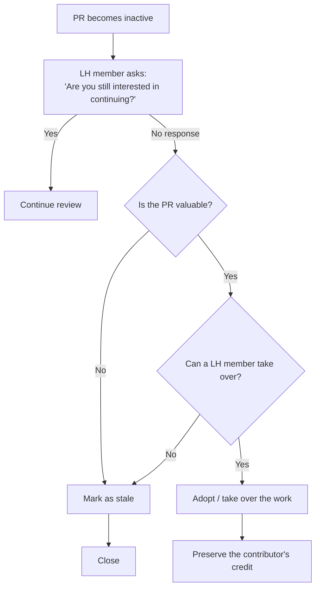

# Contributing to Longhorn

Welcome, and thank you for your interest in contributing to Longhorn!

Longhorn is a cloud-native distributed block storage system for Kubernetes. Contributions are not limited to code changes. You can help by reporting issues, improving documentation, reviewing pull requests, testing fixes, proposing new features, or sharing feedback from real-world deployments.

This guide applies to contributions to the Longhorn project and its related repositories.

## Getting Started

Before contributing code, please read the Longhorn developer guide:

- [Getting started with Longhorn development](https://github.com/longhorn/longhorn/wiki/Getting-started-with-Longhorn-Development)

You can also join the Longhorn community discussions through the available Longhorn community channels.

## Project Structure and Repositories

Longhorn is spread across several repositories. The [`longhorn/longhorn`](https://github.com/longhorn/longhorn) repository is the umbrella project: it is the single place for issue tracking, enhancement proposals, release manifests (`deploy/`), the Helm chart source (`chart/`), and design documents (`enhancements/`). It does **not** contain the component source code.

Source code for components and libraries lives in dedicated repositories. Open code pull requests against the repository that owns the code you are changing:

| Component                      | What it does                                                           | GitHub repo                                                                                 |
| :----------------------------- | :--------------------------------------------------------------------- | :------------------------------------------------------------------------------------------ |
| Longhorn Backing Image Manager | Backing image download, sync, and deletion in a disk                   | [longhorn/backing-image-manager](https://github.com/longhorn/backing-image-manager)         |
| Longhorn Engine                | Core V1 Data Engine controller/replica logic                           | [longhorn/longhorn-engine](https://github.com/longhorn/longhorn-engine)                     |
| Longhorn SPDK Engine           | Core V2 Data Engine controller/replica logic                           | [longhorn/longhorn-spdk-engine](https://github.com/longhorn/longhorn-spdk-engine)           |
| Longhorn Instance Manager      | Controller/replica instance lifecycle management                       | [longhorn/longhorn-instance-manager](https://github.com/longhorn/longhorn-instance-manager) |
| Longhorn Manager               | Longhorn orchestration, includes CSI driver for Kubernetes             | [longhorn/longhorn-manager](https://github.com/longhorn/longhorn-manager)                   |
| Longhorn Share Manager         | NFS provisioner that exposes Longhorn volumes as ReadWriteMany volumes | [longhorn/longhorn-share-manager](https://github.com/longhorn/longhorn-share-manager)       |
| Longhorn UI                    | The Longhorn dashboard                                                 | [longhorn/longhorn-ui](https://github.com/longhorn/longhorn-ui)                             |

Regardless of which repository the code change targets, the tracking issue is always filed in [`longhorn/longhorn`](https://github.com/longhorn/longhorn/issues).

## Reporting Issues and Before Opening a Pull Request

Before submitting a pull request, make sure there is a related issue in the Longhorn issue tracker:

- https://github.com/longhorn/longhorn/issues

If no issue exists, please create one first.

When creating an issue, use the correct issue template so the report is categorized properly and includes the required information:

- https://github.com/longhorn/longhorn/tree/master/.github/ISSUE_TEMPLATE

The selected template automatically applies the matching title prefix, and the issue title should keep that prefix, for example:

- `[BUG] <description>`
- `[FEATURE] <description>`
- `[IMPROVEMENT] <description>`
- `[REFACTOR] <description>`
- `[DOC] <description>`
- `[TEST] <description>`

Having an issue for every pull request helps the community:

- Track bugs, enhancements, regressions, and design discussions.
- Understand the motivation and scope of the change.
- Coordinate review, testing, release planning, and backport decisions.
- Avoid duplicated or conflicting work.

Small changes such as typo fixes may be submitted directly, but larger bug fixes, behavior changes, features, refactoring, dependency updates, or chart-related changes should always be linked to an issue.

## Enhancement Proposals

Large features, architectural changes, or changes that affect the storage data path, upgrade behavior, or public APIs require a Longhorn Enhancement Proposal (LEP) before implementation begins.

- Proposals live in the [`enhancements/`](https://github.com/longhorn/longhorn/tree/master/enhancements) directory of this repository.
- Use an existing proposal as a template and open the proposal as a pull request for discussion.
- Reaching agreement on the design early avoids rework and helps maintainers plan releases and backports.

If you are unsure whether a change needs a proposal, open an issue first and ask the maintainers.

## Pull Request Requirements

Each pull request must include:

1. A clear summary of the change.
2. A link to the related Longhorn issue.
3. The motivation and context for the change.
4. The test plan and actual test results.
5. Any known risks, limitations, compatibility concerns, or follow-up work.

Every commit and the pull request description must reference the related ticket number, for example `longhorn/longhorn#1234`. This links the change back to its tracking issue.

A pull request should be focused and reviewable. Avoid combining unrelated fixes, refactoring, formatting changes, and feature work in the same pull request.

For stale pull requests, see [Community Contribution Triage and Stale Pull Requests](#community-contribution-triage-and-stale-pull-requests).

## Testing Requirements

Every pull request must be tested before submission.

The pull request description must include:

- What was tested.
- How it was tested.
- The environment used for testing.
- The test result.
- Any tests that were not run and the reason.

Examples of useful test information include:

```text
Test environment:
- Longhorn version/image:
- Kubernetes version:
- Kubernetes distribution:
- Node count:
- OS:
- Data engine:
- Installation method:

Test steps:
1.
2.
3.

Result:
- PASS / FAIL
- Relevant logs, screenshots, or command output if applicable.
```

Depending on the change, testing may include:

- Unit tests.
- Integration tests.
- End-to-end tests.
- Upgrade tests.
- Regression tests.
- Manual validation in a Kubernetes cluster.
- Helm installation or upgrade validation.
- UI validation.
- Backup, restore, snapshot, replica rebuild, engine, node, disk, or volume lifecycle validation.

If a pull request affects storage behavior, upgrade behavior, data path logic, scheduling, recovery, backup, restore, snapshot handling, CSI behavior, or Kubernetes object reconciliation, provide enough detail for reviewers to reproduce the test.

## Commit and Pull Request Title Convention

Pull request titles and commit titles must follow the Conventional Commits format:

- https://www.conventionalcommits.org/en/v1.0.0/

```text
<type>(optional scope): <description>
```

Common types include:

```text
fix:
feat:
chore:
docs:
test:
refactor:
ci:
build:
perf:
```

Examples:

```text
fix(manager): prevent stale disk ready condition after node recovery
feat(engine): add validation for v2 live switchover
docs: update snapshot restore troubleshooting guide
test(e2e): add regression test for replica rebuild failure
chore(deps): update CSI sidecar images
```

Use a clear and concise description. The title should explain what changed, not only where the change happened.

## DCO Sign-off

All commits must be signed off.

Longhorn uses the Developer Certificate of Origin (DCO). By signing off your commit, you certify that you have the right to submit the contribution under the project license.

Use the `--signoff` or `-s` option when creating commits:

```bash
git commit -s -m "fix(manager): handle replica cleanup error"
```

This adds a `Signed-off-by` line to the commit message:

```text
Signed-off-by: Your Name <your-email@example.com>
```

Every commit in the pull request must include a valid sign-off.

If you already created commits without sign-off, you can amend or rebase them:

```bash
git commit --amend --signoff
```

or, for multiple commits:

```bash
git rebase --signoff <base-branch>
```

## Coding Convention

Go code must follow the Longhorn coding convention:

- https://github.com/longhorn/longhorn/wiki/coding-convention

In particular, Go imports must follow the project import grouping convention. Import groups should be organized consistently with the existing codebase and separated by blank lines.

The expected grouping is generally:

1. Go standard library packages.
2. Third-party packages.
3. Kubernetes-related packages.
4. Longhorn component packages outside the current repository.
5. Packages from the current repository.

When aliases are used, keep them grouped consistently with nearby imports and existing Longhorn code patterns.

Before submitting a pull request, run the relevant formatting and validation commands for the repository you are changing.

## Chart Changes

Do not submit pull requests directly to:

- https://github.com/longhorn/charts

The `longhorn/charts` repository is used for publishing released Helm charts. Chart changes should be submitted to the source repository instead:

- https://github.com/longhorn/longhorn

After chart changes are merged and ready for release, they will be synced to the charts repository through the release process.

## Documentation Changes

The official Longhorn product documentation published at https://longhorn.io is maintained in the [longhorn/website](https://github.com/longhorn/website) repository. Submit changes to installation, configuration, operation, troubleshooting, upgrade, and feature documentation there.

Repository-specific documentation, such as README files, development instructions, Helm chart documentation, examples, and design documents, should be updated in the repository that owns that content. A change may require documentation pull requests in both the component repository and `longhorn/website`.

For documentation pull requests, please make sure:

- The content is accurate and matches the current Longhorn behavior.
- The change is linked to a related issue in [`longhorn/longhorn`](https://github.com/longhorn/longhorn/issues) when it affects user-facing behavior, troubleshooting, installation, upgrade, settings, or feature documentation.
- The correct documentation version is updated, and the change is applied to other supported versions when it also applies to them.
- The wording is clear and concise.
- Examples, commands, and YAML snippets are tested.

## Backports and Release Branches

Longhorn maintains multiple release branches (for example `v1.x.x`) in addition to `master`.

- New work normally lands on `master` first.
- Fixes that also affect supported releases are backported to the relevant release branches. Backport issues and pull requests are tracked with a `[BACKPORT]` prefix and the target version.
- When reporting or fixing a bug, mention which released versions are affected so maintainers can plan backports.

## Review Process

Maintainers and reviewers may ask for:

- More test coverage.
- Additional manual validation.
- Design clarification.
- Backward compatibility analysis.
- Upgrade or rollback considerations.
- Documentation updates.
- Smaller or more focused pull requests.

Please keep discussions constructive and technical. Review comments are part of the normal contribution process and help maintain Longhorn quality.

## Community Contribution Triage and Stale Pull Requests

Pull requests may be marked stale when they have had no meaningful activity for an extended period. Before closing a stale pull request, Longhorn members should determine whether the change is still valuable to the project.

If the contributor is still interested in continuing the work, review should continue as usual. If there is no response and the pull request is still valuable, a Longhorn member may adopt the work and preserve the original contributor's credit, for example by keeping authorship where appropriate or using a `Co-authored-by` trailer in the final commit.

Use the following workflow for stale pull requests:



## Security Issues

Do not publicly disclose security vulnerabilities through GitHub issues or pull requests before they are properly reported and triaged.

If you believe you have found a security vulnerability, follow the Longhorn security reporting process instead of opening a public issue.

## Contribution Checklist

Before requesting review, confirm that:

- [ ] There is a related issue in https://github.com/longhorn/longhorn/issues.
- [ ] The code pull request targets the correct component repository.
- [ ] The pull request description explains the motivation and scope.
- [ ] The commit and pull request description reference the related ticket number (for example `longhorn/longhorn#1234`).
- [ ] The pull request title follows Conventional Commits.
- [ ] Each commit title follows Conventional Commits.
- [ ] Each commit includes a valid DCO sign-off.
- [ ] The change has been tested.
- [ ] The test steps and results are included in the pull request description.
- [ ] Go imports follow the Longhorn coding convention.
- [ ] Documentation has been updated in the appropriate repository when needed.
- [ ] Chart changes are submitted to `longhorn/longhorn`, not `longhorn/charts`.
- [ ] Backports to supported release branches are considered when needed.
- [ ] The pull request contains only related changes.

Thank you for helping improve Longhorn!
