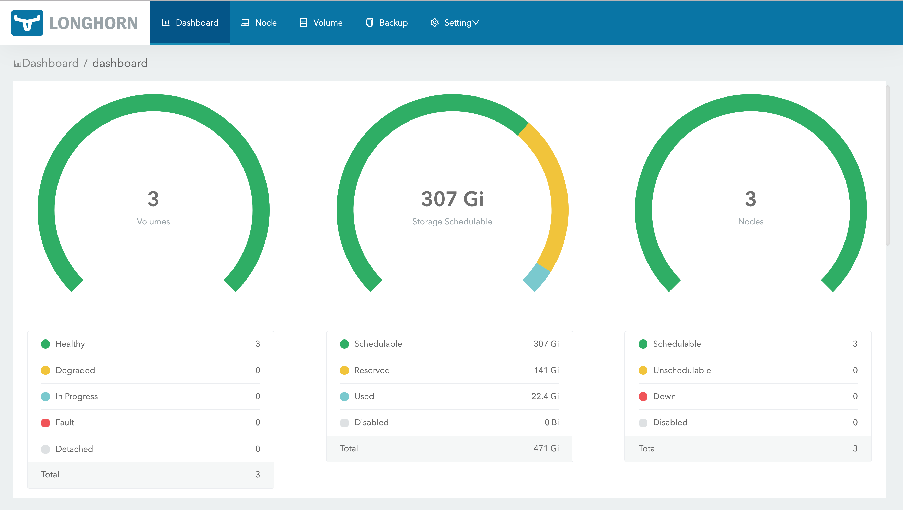

# Longhorn 

### Build Status
* Engine:  
* Instance Manager: 
* Manager: 
* UI: 
* Test: 

### Overview
Longhorn is a distributed block storage system for Kubernetes.

Longhorn is lightweight, reliable, and powerful. You can install Longhorn on an existing Kubernetes cluster with one `kubectl apply` command or using Helm charts. Once Longhorn is installed, it adds persistent volume support to the Kubernetes cluster.

Longhorn implements distributed block storage using containers and microservices. Longhorn creates a dedicated storage controller for each block device volume and synchronously replicates the volume across multiple replicas stored on multiple nodes. The storage controller and replicas are themselves orchestrated using Kubernetes. Here are some notable features of Longhorn:

1. Enterprise-grade distributed storage with no single point of failure
2. Incremental snapshot of block storage
3. Backup to secondary storage (NFSv4 or S3-compatible object storage) built on efficient change block detection
4. Recurring snapshot and backup
5. Automated non-disruptive upgrade. You can upgrade the entire Longhorn software stack without disrupting running volumes!
6. Intuitive GUI dashboard

You can read more technical details of Longhorn [here](https://longhorn.io/).

## Current status

The latest release of Longhorn is **v1.0.2**.

## Source code
Longhorn is 100% open source software. Project source code is spread across a number of repos:

1. Longhorn engine -- Core controller/replica logic https://github.com/longhorn/longhorn-engine
1. Longhorn manager -- Longhorn orchestration https://github.com/longhorn/longhorn-manager
1. Longhorn UI -- Dashboard https://github.com/longhorn/longhorn-ui

# Requirements

For the installation requirements, refer to the [Longhorn documentation.](https://longhorn.io/docs/install/requirements)

# Install

Longhorn can be installed on a Kubernetes cluster in several ways:

- [kubectl](https://longhorn.io/docs/install/install-with-kubectl/)
- [Helm](https://longhorn.io/docs/install/install-with-helm/)
- [Rancher catalog app](https://longhorn.io/docs/install/install-with-rancher/)

# Documentation

The official Longhorn documentation is [here.](https://longhorn.io/docs)

## Community
Longhorn is an open source software, so contribution are greatly welcome. Please read [Code of Conduct](./CODE_OF_CONDUCT.md) and [Contributing Guideline](./CONTRIBUTING.md) before contributing.

Contributing code is not the only way of contributing. We value feedbacks very much and many of the Longhorn features are originated from users' feedback. If you have any feedbacks, feel free to [file an issue](https://github.com/longhorn/longhorn/issues/new?title=*Summarize%20your%20issue%20here*&body=*Describe%20your%20issue%20here*%0A%0A---%0AVersion%3A%20``) and talk to the developers at the [CNCF](https://slack.cncf.io/) [#longhorn](https://cloud-native.slack.com/messages/longhorn) slack channel.

## License

Copyright (c) 2014-2020 The Longhorn Authors

Licensed under the Apache License, Version 2.0 (the "License"); you may not use this file except in compliance with the License. You may obtain a copy of the License at

[http://www.apache.org/licenses/LICENSE-2.0](http://www.apache.org/licenses/LICENSE-2.0)

Unless required by applicable law or agreed to in writing, software distributed under the License is distributed on an "AS IS" BASIS, WITHOUT WARRANTIES OR CONDITIONS OF ANY KIND, either express or implied. See the License for the specific language governing permissions and limitations under the License.

### Longhorn is a [CNCF Sandbox Project](https://www.cncf.io/sandbox-projects/)

