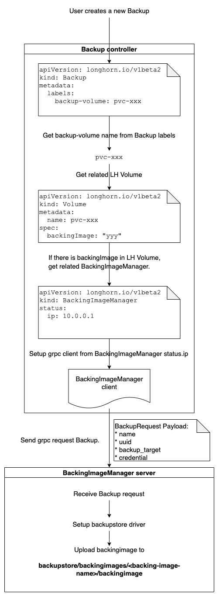
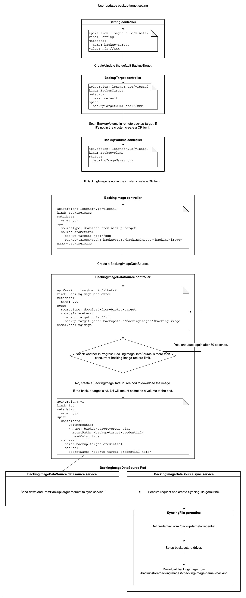

# Backing Image backup and restore

## Summary

Backup the `BackingImage` when there is a `BackupVolume` based on it and restore the `BackingImage` in the new cluster, so users can restore the related `Backup` without missing `BackingImage`.

### Related Issues

[#4165](https://github.com/longhorn/longhorn/issues/4165)

## Motivation

### Goals

1. A `BackupVolume` with non-empty `backingImageName` can be restored correctly in the new cluster without manual creating `BackingImage` again.
2. Longhorn only upload a `BackingImage` to the backup target when there is a `BackupVolume` based on it.
3. Different `BackupVolume`s use a same `BackingImage`. The `BackingImage` is uploaded once.
4. In a new cluster, when Longhorn restores `BackupVolume`s, if many `BackupVolume`s have a same `backingImageName`, Longhorn will only create one `BackingImage` CR for it and download it once.
5. For multiple `BackingImage` restoring, users can set `concurrent-backing-image-restore-limit` to control maximum number of `BackingImage` restoring at the same time. (WIP)

### Non-goals [optional]

N/A

## Proposal

### Backup flow



### Restore flow



### User Stories

#### Restore `BackingImage` in a new cluster

Before the enhancement, users need to manually upload `BackingImage` again in a new cluster.

After the enhancement, if there is a `BackupVolume` based on a `BackingImage`, Longhorn help to automatically restore the `BackingImage`.

### User Experience In Detail

There is no experience changed when users take a backup for a volume or add the `backup-target` setting in a new cluster.

If users want to control maximum number of concurrent `BackingImage` restoring, they can change `concurrent-backing-image-restore-limit` in the General setting page.

### API changes

* Add a new source type `download-from-backup-target` to `backingimagedatasource.longhorn.io`.

## Design

### Implementation Overview

#### Backup flow

**backing-image-manager**
1. Add a `Backup` rpc.

```proto
service BackingImageManagerService {
    // ...
    rpc Backup(BackupRequest) returns (google.protobuf.Empty) {}
}

message BackupRequest {
	string name = 1;
    string uuid = 2;
	string backup_target = 3;
	map<string, string> credential = 4;
}
```
    
2. Implement the `Backup` rpc in `manager` service:
    1. Get `BackingImage` file path.
    2. Setup `backupstore` driver.
    3. Check whether the `BackingImage` is already existent in backup-target and the size is same:
        - If yes, skip the operation.
        - If not, Upload the `BackingImage` to `backupstore/backingimages/<backing-image-name>/backingimage`.

**longhorn-manager**
1. In `BackingImageManager` controller, add `securityContext` when creating the `backing-image-manager` pod, so `backing-image-manager` has enough permission operate NFS driver.
```yaml
    securityContext:
      privileged: true
```
2. In `BackupController`, check whether the `volume.Spec.BackingImage` is empty:
    * If yes, continue.
    * If not, send a `Backup` request to `backing-image-manager`.

#### Restore flow

**longhorn-manager**
1. Add a new soruce type and new parameters to `backingimagedatasource.longhorn.io`.
```go
const (
    // ...
	DataSourceTypeDownloadFromBackupTargetParameterBackupTarget     = "backup-target"
	DataSourceTypeDownloadFromBackupTargetParameterBackupTargetPath = "backup-target-path"
)

type BackingImageDataSourceType string

const (
	// ...
	BackingImageDataSourceTypeExportFromVolume         = BackingImageDataSourceType("export-from-volume")
)
```
2. In `BackupVolume` controller, check whether `BackingImageName` is empty:
    - If yes, continue.
    - If not, check whether related `BackingImage` CR is in the cluster:
        - If yes, skip download operation.
        - If not, create a new `BackingImage` CR with `download-from-backup-target` source type.
3. In `BackingImageDataSource` controller:
    1. Add `securityContext` when creating the `backing-image-data-source` pod, so `backing-image-data-source` has enough permission operate NFS driver.
    1. If `BackupTarget` is s3, mount `backup-target-credential` secret as a volume under `/backup-target-credential`.

 **backing-image-manager**
1. In `SyncingFile` struct, add a `DownloadFromBackupTarget` function:
    1. Get s3 credential from `/backup-target-credential` folder.
    1. Setup `backupstore` driver.
    1. Get backing image file from backup target.
2. In `sync` service, add a new action `downloadFromBackupTarget` to `POST /v1/files` handler:
    1. Initialize `SyncingFile`.
    1. Create a goroutine to async download backing image in `SyncingFile`.
3. In `datasource` service, send `downloadFromBackupTarget` request to `sync` service.

### Test plan

1. Check backup flow works fine when users take a backup for a volume based on a `BackingImage`.
1. Check restore flow works fine when users set the `backup-target` in a new cluster.

### Upgrade strategy

N/A

## Note [optional]

N/A
