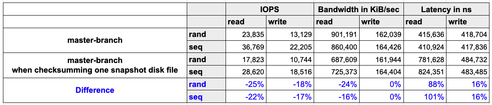
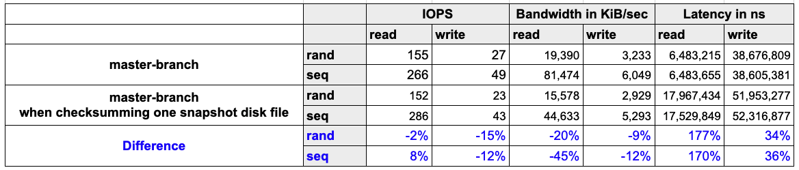
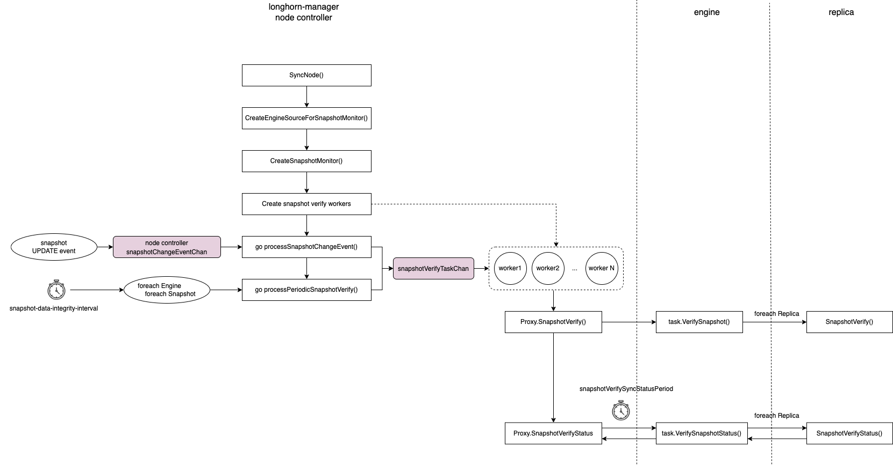

# Snapshot Checksum Calculation and Bit Rot Detection

## Summary

Longhorn system supports volume snapshotting and stores the snapshot disk files on the local disk. However, it is impossible to check the data integrity of snapshots due to the lack of the checksums of the snapshots in current implementation. As a result, if the underlying storage bit rots, no way is available to detect the data corruption and repair the replicas. In the enhancement, the snapshot checksum is calculated after the snapshot is taken and is checked periodically. When a corrupted snapshot is detected, a replica rebuild is triggered to repair the snapshot.

### Related Issues

- [[IMPROVEMENT] Introduce checksum for snapshots](https://github.com/longhorn/longhorn/issues/4210)
- [[FEATURE] automatic identifying of corrupted replica (bit rot detection)](https://github.com/longhorn/longhorn/issues/3198)

## Motivation

### Goals

- Automatic snapshot hashing
- Identify corrupted snapshot
- Trigger replica rebuild when a corrupted snapshot is detected

### Non-goals
- The hashing/checking mechanism is applied to detached volumes
- Support concurrent snapshot hashing
  - In current architecture, the instance-manager-r does not have a proxy, so the snapshot requests are directly sent to the replica processes’ sync-agent servers. Hence, the concurrent limit cannot achieved in the instance-manager-r internally.
  - From the benchmarking result, the checksum calculation eats too much io resource and impacts the system performance a lot. We also don’t know if the longhorn disks on a same physical disk or not. If they are on the same physical disk and the concurrent limit is larger than 1, the other workloads will be impacted significantly, and there might be a disaster for the entire system.

## Proposal

### User Stories

Bit rot in storage is rare but real, and it can corrupt the data silently. Longhorn supports volume snapshotting and restoring a volume to a previous version. However, due to the lack of the checksums of the snapshots in current implementation, it is impossible to ensure the data integrity of the replicas/snapshots. Although, we provide a method ([ref](https://longhorn.io/docs/1.3.1/advanced-resources/data-recovery/corrupted-replica/)) to identify the corrupted snapshots/replicas, the process is tedious and time-consuming for users.

### User Experience In Detail
1. Users' operations will not be affected by snapshot hashing and checking.
2. The system will consume computing and disk IO resources while hashing snapshot disk files. In the meantime, the CPU usages are 380m and 900m when computing the CRC64 (ISO) and SHA256 values, respectively. In the implementation, the CRC64 (ISO) is utilized for detecting corruption.
   - The snapshot hashing benchmarking result is provided
  
   - The read performance will be impacted as well, as summarized in the below table.
     - Environment
        - Host: AWS EC2 c5d.2xlarge
          - CPU: Intel(R) Xeon(R) Platinum 8124M CPU @ 3.00GHz
          - Memory: 16 GB
          - Network: Up to 10Gbps
        - Kubernetes: v1.24.4+rke2r1
     - Result
       - Disk: 200 GiB NVMe SSD as the instance store
         - 100 GiB snapshot with full random data
        
       - Disk: 200 GiB throughput optimized HDD (st1)
          - 30 GiB snapshot with full random data
        

#### CLI
Add `snapshot hash` and `snapshot hash-status` commands
- `snaphost hash` issues a snapshot hashing request to engine.
  - Usage: `longhorn --url ${engine-ip}:${engine-port} snapshot hash tcp://${replica-sync-agent-ip}:${replica-sync-agent-port} --snapshot-name ${name}`
- `snapshot hash-status` requests the snapshot hashing status from engine.
  - Usage: `longhorn --url ${engine-ip}:${engine-port} snapshot hash-status tcp://${replica-sync-agent-ip}:${replica-sync-agent-port}`
- `snapshot hash-cancel` cancels the snapshot hashing task.
  - Usage: `longhorn --url ${engine-ip}:${engine-port} snapshot hash-cancel tcp://${replica-sync-agent-ip}:${replica-sync-agent-port}`

#### Engine Proxy gRPC API
Add `SnapshotHash`, `SnapshotHashStatus` and `SnapshotHashCancel` methods and their request and response messages.
- `SnapshotHash` issues a snapshot hashing request to engine.
- `SnapshotHashStatus` requests the snapshot hashing status from engine.
- `SnapshotHashCancel` cancels the snapshot hashing task.

#### Replica Sync-Agent gRPC API
Add `SnapshotHash`, `SnapshotHashStatus` and `SnapshotHashCancel` methods and their request and response messages.
- `SnapshotHash` issues a snapshot hashing request to replica sync-agent.
- `SnapshotHashStatus` requests the snapshot hashing status from replica sync-agent.
- `SnapshotHashCancel` cancels the snapshot hashing task.

## Design

### Implementation Overview

#### Global Settings
- **snapshot-data-integrity**
  - Description: A global setting for enabling or disabling snapshot data integrity checking mode.
  - Type: string
  - Value:
    - disabled: Disable snapshot disk file hashing and data integrity checking.
    - enabled: Enables periodic snapshot disk file hashing and data integrity checking. To detect the filesystem-unaware corruption caused by bit rot or other issues in snapshot disk files, Longhorn system periodically hashes files and finds corrupted ones. Hence, the system performance will be impacted during the periodical checking.
    - fast-check: Enable snapshot disk file hashing and fast data integrity checking. Longhorn system only hashes snapshot disk files if they are not hashed or if the modification time changed. In this mode, filesystem-unaware corruption cannot be detected, but the impact on system performance can be minimized.
  - Default: `disabled`

- **snapshot-data-integrity-immediate-checking-after-snapshot-creation**
  - Description: Hashing snapshot disk files impacts the performance of the system. The immediate snapshot hashing and checking can be disabled to minimize the impact after creating a snapshot.
  - Type: bool
  - Default: `false`

- **snapshot-data-integrity-cron-job**
  - Description: The setting is a set of five fields in a line, indicating when Longhorn checks the data integrity of snapshot disk files.
  - Type: string (Cron job format)
  - Default: `0 0 */7 * *` (once a week)

#### CRDs
- Volume
  - Add `volume.spec.snapshotDataIntegrity` for setting the volume's snapshot data integrity checking mode. The value can be `ignored`, `disabled`, `enabled` or `fast-check`.
    - `ignored` means the the volume's snapshot check is following the global setting `snapshot-data-integrity`.
    - After upgrading Longhorn-system, the value is set to `ignored` for an existing volumes whose `volume.spec.snapshotDataIntegrity` is not set.
    - For a newly created volume, the value is `ignored` by default.

- Snapshot
  - Add `snapshot.status.checksum` for recording the snapshot `crc64(iso)` checksum.

- Node
  - Add `node.status.snapshotPeriodicCheckStatus.state` for indicating current periodic check state. The value can be `idle` or `in-progress`.
  - Add `node.status.snapshotPeriodicCheckStatus.lastCheckedAt` for recording the start timestamp of the last checksum checking.
  
#### Automatic Snapshot Checksum Hashing and Checking



1. Node controller creates a snapshot monitor for hashing snapshot disk files as well as checking their data integrity. The monitor is consist of
    - **1 goroutine `processSnapshotChangeEvent()`**: Send a snapshot hashing/checking task to the `snapshotCheckTaskQueue` workqueue after receiving one snapshot `UPDATE` event.

    - **1 goroutine `processPeriodicSnapshotCheck()`**: Periodically create snapshot hashing/checking tasks. The period is determined by the global setting `snapshot-data-integrity-cron-job`. When the job is started, it populates engines' snapshots and sends snapshot hashing/checking tasks to the `snapshotCheckTaskQueue` channel.
  
     - **N task workers**: Issue hashing requests to engines and detect corrupted replicas according to the results.

2. Task workers fetch tasks from `snapshotCheckTaskQueue` and check if the snapshot disk file needs to be hashed. The rules are
    - If one of the following conditions are met, do not hash the file
      - Volume-head disk file, i.e. `Volume Head` in the following figure
      - System-generated snapshot disk file, e.g. `ccb017f6` and `9a8d5c9c`.

      

3. Issue snapshot hashing requests to their associated engines. Then, the checksum of the snapshot disk file is calculated individually in the replica process. To ensure only one in-progress calculation, the worker holds the per-node file lock (`/host/var/lib/longhorn/.lock/hash`) when calculating the checksum to avoid significant storage performance drop caused by the concurrent calculations.
   
4. The worker waits until each snapshot disk file's checksum calculation has been completed. It periodically polls the engine and checks the status during the waiting period.

5. The worker gets the result once the calculation is completed. The result is like
    ```
    map[string]string{
      "pvc-abc-r-001": 0470c08fbc4dc702,
      "pvc-abc-r-002": 0470c08fbc4dc702,
      "pvc-abc-r-003": ce7c12a4d568fddf,
    }
    ```

6. The **final checksum** is determined by the majority of the checksums with `SilentCorrupted=false` from replicas. For instance, the **final checksum** of the result in 4. is `0470c08fbc4dc702`.
   - When all checksums differ, the **final checksum** is unable to be determined
      - If  `snapshot.status.checksum` is empty
        - Set all replicas to `ERR`
      - If  `snapshot.status.checksum` is already set
        - Use the `snapshot.status.checksum` as the **final checksum**, and set the replicas that have mismatching checksums to `ERR`
   - When the **final checksum** is successfully determined
      - Assign the **final checksum** to `snapshot.status.checksum`
      - Set the replica to `ERR` if its snapshot disk file's checksum is not equal to `snapshot.status.checksum`
   - If the **final checksum** cannot be determined, the event of the corruption detected is also emitted.
     - For example, Longhorn will not do any error handling and just emits a event when the silent corruption is found in a single-replica volume. 
  
7. Then, the replicas in `ERR` mode will be rebuilt and fixed. The event of the corruption detected is also emitted.

#### Snapshot Disk File Hashing in Replica Process
When the replica process received the request of snapshot disk file hashing, the checking mode is determined by `volume.spec.snapshotDataIntegrity`. If the value is `ignored`, the checking mode follows the global setting `snapshot-data-integrity`.

- **`fask-check`**
  - Flow
    1. Get `ctime` information of the snapshot disk file.
    2. Get the value of the extended attribute `user.longhorn-system.metadata` recording the checksum and `ctime` of the file in the last calculation. The value of `user.longhorn-system.metadata` is JSON formatted string and records `hashing method`, `checksum`, `ctime` and etc.
    3. Compare the `ctime` from 1. and 2. Recalculate the checksum if one of the conditions is met
       - The two `ctime` are mismatched.
       - 2's `ctime` is not existing.

    4. Ensure that the checksum is reliable by getting the `ctime` information of the disk file again after the checksum calculation.
       - If it is matched with 1's `ctime`, update the extended attribute with the latest result.
       - Instead, it indicates the file is changed by snapshot pruning, merging or other operations. Thus, recalculate the checksum. A maximum retries controls the recalculation.

    5. Return checksum or error to engine.

- **enabled**
  - Because the silent data corruption in snapshot disk files can be caused by the host's storage device such as bit rot or somewhere within the storage stack. Filesystem cannot be aware of the corruption. To detect the corruption, the checksums of the disk files are always be recalculated and return back to engine. Silent corruption is detected when the disk file's `ctime` matches the `ctime` in the extended attribute, but the checksums do not match. The extended attribute will not be updated, and the `SilentCorrupted` of the hash status will be set to `true`.

- **disabled**
  - Do nothing.
### Test Plan
**Integration tests**
- Test snapshot disk files hashing
  - Compare the checksum recorded in `snapshot.status.checksum` and the checksum (calculated by a [3rd-party CRC64 checksum utility](#3rd-party-crc64-checksum-utility-for-test-plan) of each replica's snapshot disk file.
- Test snapshot disk files check
  - Corrupt a snapshot disk file in one of the replicas. Then, check the corruption is detected by Longhorn, and the replica rebuilding should be triggered.

## Note[optional]
### 3rd-party CRC64 Checksum Utility for Test Plan
- Install Java (`apt install default-jre default-jdk`)
- Download jacksum (`wget https://github.com/jonelo/jacksum/releases/download/v3.4.0/jacksum-3.4.0.jar`)
- Calculate checksum by `java -jar jacksum-3.4.0.jar -a crc64_go-iso ${path-to-file}`
