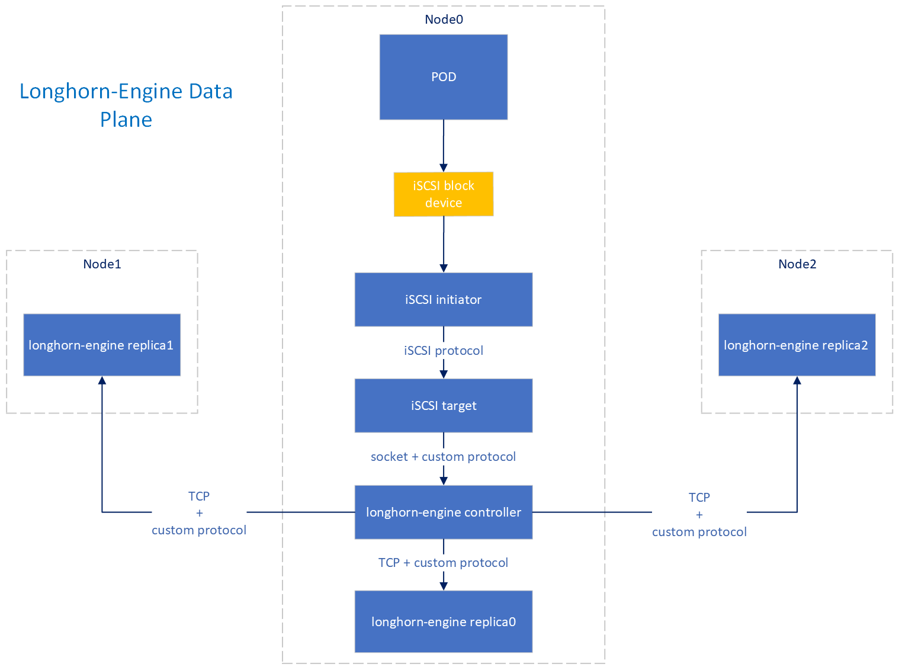
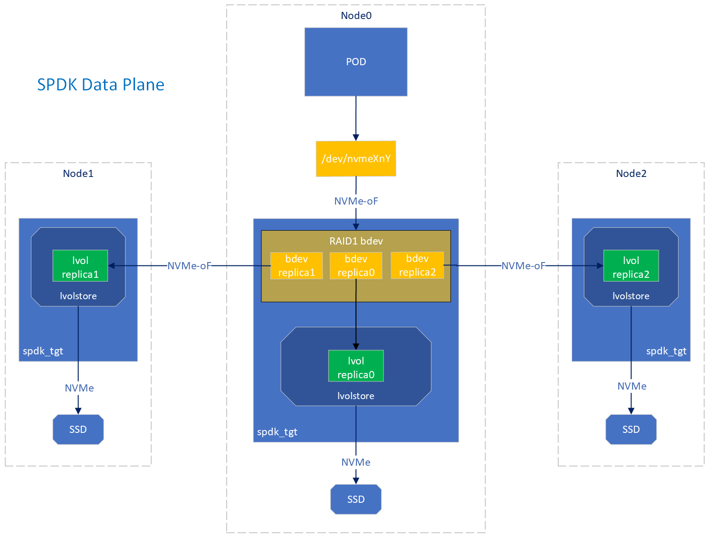

# Reimplement Longhorn Engine with SPDK

## Summary

The Storage Performance Development Kit [SPDK](https://spdk.io) provides a set of tools and C libraries for writing high performance, scalable, user-mode storage applications. It achieves high performance through the use of a number of key techniques:

* Moving all of the necessary drivers into userspace, which avoids syscalls and enables zero-copy access from the application.
* Polling hardware for completions instead of relying on interrupts, which lowers both total latency and latency variance.
* Avoiding all locks in the I/O path, instead relying on message passing.

SPDK has several features that allow it to perform tasks similar to what the `longhorn-engine` currently needs:

* [Block Device](https://spdk.io/doc/bdev.html) layer, often simply called bdev, intends to be equivalent to the operating system block storage layer that often sits immediately above the device drivers in a traditional kernel storage stack. SPDK provides also virtual bdev modules which creates block devices on existing bdev, for example Logical Volumes or RAID1.
* [Logical volumes](https://spdk.io/doc/logical_volumes.html) library is a flexible storage space management system. It allows creating and managing virtual block devices with variable size on top of other bdevs. The SPDK Logical Volume library is built on top [Blobstore](https://spdk.io/doc/blob.html) which is a persistent, power-fail safe block allocator designed to be used as the local storage system backing a higher level storage service, typically in lieu of a traditional filesystem. Logical volumes have a couple of features like Thinly Provisioning and Snapshots similar to what actual Longhorn-Engine provides.
* [NVMe over Fabrics](https://spdk.io/doc/nvmf.html) is a feature to presents block devices over a fabrics such as Ethernet, supporting RDMA and TCP transports. The standard Linux kernel initiators for NVMe-oF interoperate with these SPDK NVMe-oF targets, so with this feature we can serve bdev over the network or to other processes

## Motivation

These are the reasons that have driven us:

* Use SPDK to improve performance of Longhorn
* Use SPDK functionality to improve reliability and robustness
* Use SPDK to take advantage of the new features that are continuously added to the framework

### Goals

* Implement all actual `longhorn-engine` functionalities
* Continue to support multiple `longhorn-engine` versions concurrently
* Maintain as much as possible the same user experience between Longhorn with and without SPDK
* Lay the groundwork for extending Longhorn to sharding and aggegration of storage devices

## Proposal

SPDK implements a JSON-RPC 2.0 server to allow external management tools to dynamically configure SPDK components ([documentation](https://spdk.io/doc/jsonrpc.html)).

What we aim is to create an external orchestrator that, with JSON-RPC calls towards multiple instances of `spdk_tgt` app running in different machines, could manage the durability and reliability of data. Actually, not all needed functionalities to do that are already available in SPDK, so some new JSON-RPC commands will be developed over SPDK. This orchestrator is implemented in longhorn manager pods and will use a new process, called `longhorn-spdk-engine` in continuity with actual `longhorn-engine`, to talk with `spdk_tgt`.

* The main purpose of `longhorn-spdk-engine` is to create and export via NVMe-oF logical volumes from multiple replica nodes (one of them likely local), attach to these volumes on a controller node, use resulting bdevs to create a RAID1 bdev and exporting it via NVMe-oF locally. At this point NVMe Kernel module can be used to connect to this NVMe-oF subsystem and so to create a block device `/dev/nvmeXnY` to be used by the Longhorn CSI driver. In this way we will have multiple replica of the same data written on this block device.
* Below a diagram that shows the control plane of the proposal 
* In release 23.01, support for ublk will be added in SPDK: with this functionality we can directly create a block device without using the NVMe layer on Linux kernel versions >6.0. This will be a quite big enhancement over using NVMe-oF locally.

The `longhorn-spdk-engine` will be responsible to make all others control operations, like for example creating snapshots over all replicas of the same volume. Other functionalities orchestrated through the engine will be the remote rebuild, a complete rebuild of the entire snapshot stack of a volume needed to add or repair a replica, the backup and restore, export/import of a SPDK logical volumes to/from sparse files stored on an external storage system via S3.

The `longhorn-spdk-engine` will be developed in Go so maybe we can reuse some code from `longhorn-engine`, for example gRPC handling to receive control commands and error handling during snapshot/backup/restore operations.

What about the data plane, below a comparison between actual architecture and new design:
* longhorn-engine 
* spdk_tgt       
  

## Design

### Implementation Overview

Actually there is a `longhorn-engine` controller and some `longhorn-engine` replica for every volume to manage. All these instances are started and controlled by the `instance-manager`, so on every node belonging to the cluster we have one instance of `instance-manager` and multiple instances of `longhorn-engine`. Every volume is stored in a sequence of sparse files representing the live data and the snapshots. With SPDK we have a different situation, because `spdk_tgt` can take the control of an entire disk, so in every node we will have a single instance of SPDK that will handle all the volumes created by Longhorn.

To orchestrate SPDK instances running on different nodes in a way to make up a set of replicas, we will introduce, as discussed before, the `longhorn-spdk-engine`; to make the volume management lighter we will have an instance of the engine per volume. `longhorn-spdk-engine` will implement actual gRPC interface used by `longhorn-engine` to talk with `instance-manager`, so this last one will became the portal to communicate with `longhorn-manager` by different data plane.

`spdk_tgt` by default starts with a single thread, but it can be configured to use multiple threads: we can have a thread per core available on the CPU. This will increase the performance but comes with the cost of an high CPU utilization. Working in polling mode instead than in interrupt mode, CPU core utilization by a single thread is always rising 100% even with no workload to handle. This could be a problem, so we can configure `spdk_tgt` with dynamic scheduler: in this way, if no workload is present, only one core will be used and only one thread will continue polling. Other thread will be put in a idle state and will become active again only when needed. Moreover, dynamic scheduler has a way to reduce the CPU frequency. (See future work section.)

### Snapshots

When `longhorn-spdk-engine` receive a snapshot request from `instance-manager`, before to proceed all I/O operations over volume's block device `/dev/nvmeXnY` must be stopped to ensure that snapshots over all the replicas contains the same data.
Actually there is no way to suspend the I/O operations over a block device, so we will have to implement this feature into SPDK. But in RAID bdev there are already some private functions to suspend I/O (they will be used for example in base bdev removing), maybe we can use and improve them. These functions actually enqueue all the I/O operations received during the suspend time.

Once received a snapshot request, `longhorn-spdk-engine` will call the JSON-RPC to make a snapshot over the local replica of the volume involved. The snapshot RPC command will ensure to freeze all I/O over the logical volume to be snapshotted, so all pending I/O will be executed before the snapshot.

SPDK logical volume have a couple of features that we will use:
* clone, used to create new logical volume based on a snapshot. It can be used to revert a volume to a snapshot too, cloning a new volume, deleting the old one and then renaming the new one as the old one
* decouple, feature that can be used to delete a snapshot, first decoupling the child volume from this snapshot and then deleting the snapshot.

### Replica rebuild

RAID replica rebuild is actually under development, so we don'know exactly hot it will be implemented, but we can suppose that we will not use it because presumably it will work only at bdev layer.
When a new replica has to be added or a replica has to be rebuilt, we have to recreate the entire snapshot stack of each volume that are hosted on that node. Actually SPDK doesn't have nothing to do that, but after discussing with core maintainers we arranged a procedure. Let's make an example.

Supposing we have to rebuild a volume with two layer of snapshots, snapshotA is the oldest and snapshotB the younger, basically we have to (in _italic_ what we miss):

* create a new volume on the node to be rebuilt
* export this volume via NVMe-oF
* attach to this volume in the node where we have the source data
* _copy snapshotA over the attached volume_
* perform a snapshot over the exported volume
* repeat the copy and snapshot operations for snapshotB

What we have to implement is a JSON-RPC to copy a logical volume over an arbitrary bdev (that in our case will represent a remote volume exported via NVMe-oF and locally attached) _while the top layer is also being modified_ (see next section).

So, in this way we can rebuild the snapshot stack of a volume. But what about the live data? Actual `longhorn-engine` make the replica rebuild in an "hot" way, i.e., during the rebuilding phase it is writing over the live data of the new volume. So, how can we reproduce this with SPDK? First of all we have to wait the conclusion of RAID1 bdev's review process to see what kind of replica rebuild will be implemented. But, supposing that the rebuild feature will not be useful for us, we will need to create a couple of additional JSON-RPC over SPDK to implement the following procedure (in _italic_ what we miss):

* create a new volume over the node to be rebuilt
* export this volume via NVMe-oF
* attach to this volume in the node where we have the RAID1
* _add the bdev of the attached volume to the RAID1 bdev excluded from the read balancing_
* wait for the snapshot stack rebuilding to finish
* _change the upper volume of the snapshot stack from the current to this one with the live data_
* _enable the bdev of the attached volume for RAID1 read balancing_

What we have at the end of the rebuilding's phase is a snapshot stack with an empty volume at the top, while in the RAID1 we have a volume with the live data but without any snapshot. So we have to couple these 2 stacks exchanging the upper volume and to do that we need a new JSON-RPC. We will need to implement the JSON-RPC to enable/disable a bdev from the RAID1 read balancing too.

### Backup and Restore

Backup will be implemented exporting a volume to a sparse file and then save this file over an external storage via S3. SPDK already has a `spdk_dd` application that can copy a bdev to a file and this app has an option to preserve bdev sparseness. But using spdk_dd has some problems: actually the sparse option works only with bdev that represent a local logical volume, not an exported one via NVMe-oF. So to backup a volume we cannot work on a remote node where to export this volume, we need to work on the node where we have the data source. But in this way, to perform a backup, we would need to stop the `spdk_tgt` app, run the `spdk_dd` and then restart the `spdk_tgt`. This operation is needed because it could not be safe to run multiple spdk applications over the same disk (even if spdk_dd would read from a read only volume) and moreover `spdk_dd` could not see the volume to export if this has been created after the last restart of `spdk_tgt` app. This because blobstore metadata, and so newly created logical volume, are saved on disk only on application exit.

Stopping `spdk_tgt` is not acceptable because it would suspend operation over all other volumes hosted in this node so, to solve these problems, we have 2 possible solutions:

* create a JSON-RPC command to export logical volume to a sparse file, so that we can make the operation directly over the `spdk_tgt` app
* create a custom NVMe-oF command to implement the seek_data and seek_hole functionalities of bdev used by `spdk_dd` to skip holes

With the second solution we could export the volume via NVMe-oF to a dedicated node where to perform the backup with `spdk_dd`application.

The restore operation can be done in a couple of way:
* read the backup sparse file and write its content into the longhorn block device. In this way data will be fully replicated
* clone from backup over each replica, importing the backup sparse file into a new thinly provisioned logical volume. We can perform this operation over the local node, owner of the new volume, if for the backup process we choose to develop a JSON-RPC to export/import logical volume to/from sparse files. Otherwise we can do it or over a dedicated node with `spdk_dd` application, that handle sparse file with SEEK_HOLE and SEEK_DATA functionalities of `lseek`.

If we leverage the same backup & restore mechanism of `longhorn-engine`, we can restore a backup done by the actual engine to a SPDK volume.

### Remote Control

The JSON-RPC API by default is only available over the `/var/tmp/spdk.sock` Unix domain socket, but SPDK offer the sample python script [rpc_http_proxy](https://spdk.io/doc/jsonrpc_proxy.html) that provides http server which listens for JSON objects from users. Otherwise we could use the `socat` application to forward requests received from an IP socket towards a Unix socket. Both `socat` and `rpc_http_proxy` can perform user authentication with password.

### Upgrade Strategy

What kind of upgrade/migration will we support?
For out-of-cluster migration we can use the Restore procedure to create SPDK logical volumes starting from existing Longhorn files. Instead for in-cluster migration we can retain read support for the old format, writing new data over SPDK.

Whatabout `spdk_tgt` updates, we can perform a rolling update strategy updating nodes one by one. Stopping `spdk_tgt` over a node will cause:
* stop of all the volumes controlled in the node. To avoid service interruption the node must be evacuated before the update. The cheat is to delay the update until the node has to be rebooted for a kernel update.
* stop of all the replicas hosted in the node. This is not a problem because during the update the I/O will be redirected towards other replica of the volume. To make a clean update of a node, before to stop `spdk_tgt`, we have to notify all the nodes that have a bdev imported via NMVMe-oF from this node to detach controllers involved.

Moreover this is a good time to introduce backup versioning, which allows us to change/improve the backup format [REF: GH3175](https://github.com/longhorn/longhorn/issues/3175)

### Future Work

* For Edge use cases, energy efficiency is important. We may need further enhancements and an interrupt-driven mode during low load periods for the scheduler. [Here](https://www.snia.org/educational-library/spdk-schedulers-%E2%80%93-saving-cpu-cores-polled-mode-storage-application-2021) an introduction to SPDK Schedulers that describes briefly the interrupt mode.

### Roadmap

For Longhorn 1.5, we need to have the below capabilities:
* replica (RAID1)
* snapshot (create, delete/purge, revert)
* replica rebuilding
* volume clone

For 1.6, we need the rest of the feature parity functions:
* volume backup & restore
* DR volume restore (incremental restore from another volume backup)
* volume encryption
* create volume from the backing image
* create backing image from volume  
* volume expansion
* volume trim
* volume metrics (bandwidth, latency, IOPS)
* volume data integrity (snapshot checksum)

SPDK uses a quarterly release cycle, next release will be 23.01 (January 2023). Assuming actual RAID1 implementation will be available in 23.01 release, actually the JSON-RPC we need to implement over SPDK are:
* suspend I/O operation
* copy a snapshot over an arbitrary bdev
* add bdev to raid1 in read balancing disabled mode
* enable/disable bdev in raid1 read balancing
* export/import file to/from bdev or implement seek_data/hole in NVMe-oF

The first development is necessary for snapshot, the last one for backup/restore and the other three developments are necessary for replica rebuilding.
The snapshot copy has already been discussed with SPDK core maintainers, so an upstream development can be made.

### Limitations
Actual RAID1 implementation is not still complete, so actually we have some limitations:
* read balancing has been developed but is still under review, so it is available only in SPDK Gerrit
* replica rebuild is still under development, so it isn't available. As a consequence of this, actually RAID1 miss the functionality to add a new base bdev to an existing RAID1 bdev.
