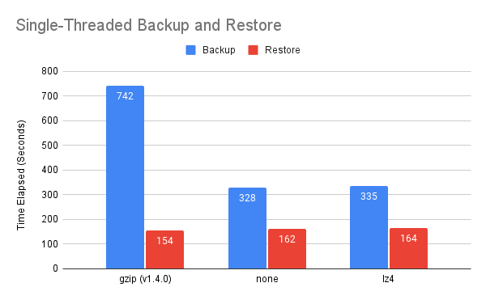
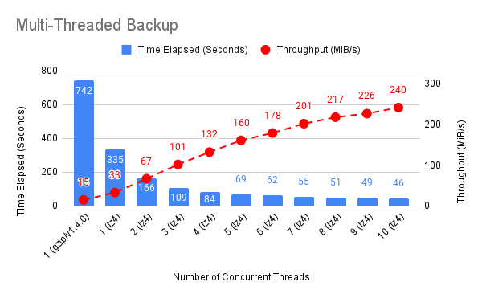
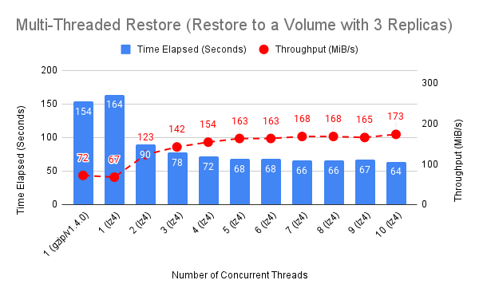
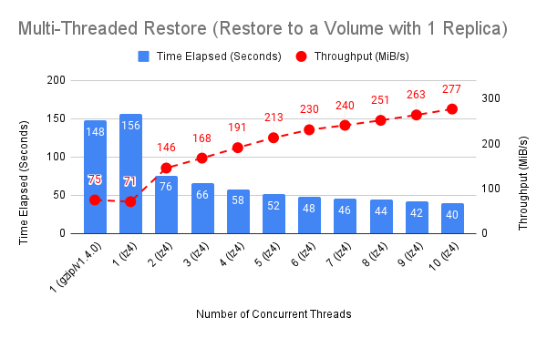

# Improve Backup and Restore Efficiency using Multiple Threads and Faster Compression Methods

## Summary

Longhorn is capable of backing up or restoring volume in multiple threads and using more efficient compression methods for improving Recovery Time Objective (RTO).

### Related Issues

[https://github.com/longhorn/longhorn/issues/5189](https://github.com/longhorn/longhorn/issues/5189)

## Motivation

### Goals

- Support multi-threaded volume backup and restore.
- Support efficient compression algorithm (`lz4`) and disable compression.
- Support backward compatibility of existing backups compressed by `gzip`.

### Non-goals

- Larger backup block size helps improve the backup efficiency more and decrease the block lookup operations. In the enhancement, the adaptive large backup block size is not supported and will be handled in https://github.com/longhorn/longhorn/issues/5215.

## Proposal

1. Introduce multi-threaded volume backup and restore. Number of backup and restore threads are configurable by uses.
2. Introduce efficient compression methods. By default, the compression method is `lz4`, and user can globally change it to `none` or `gzip`. Additionally, the per-volume compression method can be customized.
3. Existing backups compressed by `gzip` will not be impacted. 

## User Stories

Longhorn supports the backup and restore of volumes. Although the underlying computing and storage are powerful, the single thread implementation and low efficiency `gzip` compression method lead to slower backup and restore times and poor RTO.The enhancement aims to increase backup and restore efficiency through the use of multiple threads and efficient compression methods. The new parameters can be configured to accommodate a variety of applications and platforms, such as limiting the number of threads in an edge device or disabling compression for multimedia data.

### User Experience In Details

- For existing volumes that already have backups, the compression method remains `gzip` for backward compatibility. Multi-threaded backups and restores are supported for subsequent backups.
- By default, the global backup compression method is set to `lz4`. By editing the global setting `backup-compression-method`, users can configure the compression method to `none` or `gzip`. The backup compression method can be customized per volume by editing `volume.spec.backupCompressionMethod` for different data format in the volume.
- Number of backup threads per backup is configurable by the global setting `backup-concurrent-limit`.
- Number of restore threads per backup is configurable by the global setting `restore-concurrent-limit`.
- Changing the compression method of a volume having backups is not supported.

### CLI Changes

- Add `compression-method` to longhorn-engine binary `backup create` command.
- Add `concurrent-limit` to longhorn-engine binary `backup create` command.
- Add `concurrent-limit` to longhorn0engine binary `backup restore` command.

### API Changes

- engine-proxy
    - Add `compressionMethod` and `concurrentLimit` to EngineSnapshotBackup method.
    - Add `concurrentLimit` to `EngineBackupRestore` method.
- syncagent
    - Add `compressionMethod` and `concurrentLimit` to syncagent `BackupCreate` method.
    - Add `concurrentLimit` to syncagent `BackupRestore` method.

## Design

### Implementation Overview

#### Global Settings

- backup-compression-method
    - This setting allows users to specify backup compression method.
    - Options:
        - `none`: Disable the compression method. Suitable for multimedia data such as encoded images and videos.
        - `lz4`: Suitable for text files.
        - `gzip`: A bit of higher compression ratio but relatively slow. Not recommended.
    - Default: lz4
- backup-concurrent-limit
    - This setting controls how many worker threads per backup job concurrently.
    - Default: 5
- restore-concurrent-limit
    - This setting controls how many worker threads per restore job concurrently.
    - Default: 5

#### CRDs

1. Introduce `volume.spec.backupCompressionMethod`
2. Introduce `backup.status.compressionMethod`

#### Backup

A producer-consumer pattern is used to achieve multi-threaded backups. In this implementation, there are one producer and multiple consumers which is controlled by the global setting `backup-concurrent-limit`.

- Producer
    - Open the disk file to be backed up and create a `Block` channel.
    - Iterate the blocks in the disk file.
        - Skip sparse blocks.
        - Send the data blocks information including offset and size to `Block` channel.
        - Close the `Block` channel after finishing the iteration.
- Consumers
    - Block handling goroutines (consumers) are created and consume blocks from the `Block` channel.
    - Processing blocks
        - Calculate the checksum of the incoming block.
        - Check the in-memory `processingBlocks` map to determine whether the block is being processed.
            - If YES, end up appending the block to `Blocks` that record the blocks processed in the backup.
        - If NO, check the remote backupstore to determine whether the block exists.
            - If YES, append the block to `Blocks`.
        - If NO, compress the block, upload the block, and end up appending it to the `Blocks`.
    - After the blocks have been consumed and the `Block` channel has been closed, the goroutines are terminated.

Then, update the volume and backup metadata files in remote backupstore.

#### Restore

A producer-consumer pattern is used to achieve multi-threaded restores. In this implementation, there are one producer and multiple consumers which is controlled by the global setting `restore-concurrent-limit`.

- Producer
    - Create a `Block` channel.
    - Open the backup metadata file and get the information, offset, size and checksum, of the blocks.
    - Iterate the blocks and send the block information to the `Block` channel.
    - Close the `Block` channel after finishing the iteration.
- Consumers
    - Block handling goroutines (consumers) are created and consume blocks from the `Block` channel.
    - It is necessary for each consumer to open the disk file in order to avoid race conditions between the seek and write operations.
    - Read the block data from the backupstore, verify the data integrity and write to the disk file.
    - After the blocks have been consumed and the `Block` channel has been closed, the goroutines are terminated.

### Performance Benchmark

In summary, the backup throughput is increased by 15X when using `lz4` and `10` concurrent threads in comparison with the backup in Longhorn v1.4.0. The restore (to a volume with 3 replica) throughput is increased by 140%, and the throughput is limited by the IO bound of the backupstore server.

#### Setup

| | |
|---|---|
| Platform | Equinix |
| Host | Japan-Tokyo/m3.small.x86 |
| CPU | Intel(R) Xeon(R) E-2378G CPU @ 2.80GHz |
| RAM | 64 GiB |
| Disk | Micron_5300_MTFD |
| OS | Ubuntu 22.04.1 LTS(kernel 5.15.0-53-generic) |
| Kubernetes | v1.23.6+rke2r2 |
| Longhorn | master-branch + backup improvement |
| Nodes | 3 nodes |
| Backupstore target | external MinIO S3 (m3.small.x86) |
| Volume | 50 GiB containing 1GB filesystem metadata and 10 GiB random data (3 replicas) |

#### Results

- Single-Threaded Backup and Restore by Different Compression Methods

    

- Multi-Threaded Backup

    

- Multi-Threaded Restore to One Volume with 3 Replicas

    

    Restore hit the IO bound of the backupstore server, because the throughput is saturated from 5 worker threads.

- Multi-Threaded Restore to One Volume with 1 Replica

    

## Test Plan

### Integration Tests

1. Create a volumes and then create backups using the compression method, `none`, `lz4` or `gzip` and different number of backup threads. The backups should succeed.
2. Restore the backups created in step 1 by different number of restore threads. Verify the data integrity of the disk files.