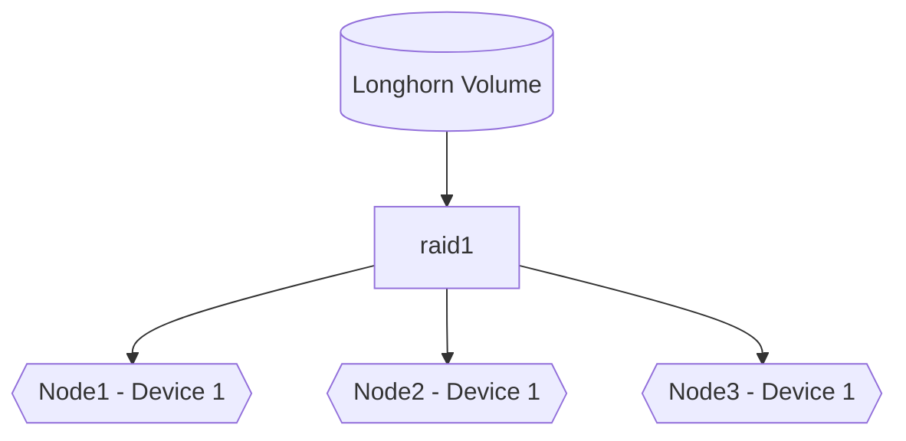
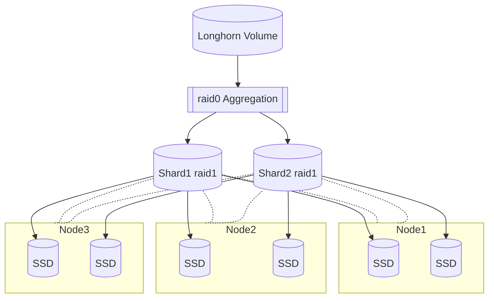

# Title

Sharded volume layout

## Summary

Sharding will introduce Longhorn volumes that are larger than a single
backend storage device. This proposal discusses how to achieve this
based on the SPDK data plane, and how key functionality provided by
Longhorn such as snapshots and volume expansion are provided.

This is achieved by introducing an aggregation layer (using SPDK's
`raid0` bdev) on top of the existing `raid1` replication, extending
Longhorn's data model similar to traditional RAID10. The individual
RAID1 entities are referred to as _shards_.

In a few cases, multiple options for achieving this were considered, and
only one was chosen. These are flagged as _Rejected Design Alternatives
(RDA)_ but hopefully provide context.

This is a fairly high-level design proposal, and while a few issues need
to be considered at this stage and level, their detailed implementations
would make this LEP too complex. Please see the _Future Work_ section.

## Motivation

### Goals

- Aggregate storage from multiple backend devices (including across
  nodes) to build a larger volume than previously possible
- Enhance space efficiency, since smaller shards can be more flexibly
  allocated.
- Maintain Longhorn's key features: thin provisioning, snapshots, and
  backup/restore, ability to grow and shrink volumes, Node- or
  device-level evacuation, recovery, and migration
- Seamless introduction with minimal changes to the user experience

### Non-goals [optional]

- Load balancing for performance or storage balancing. While the
  mechanisms laid out here would allow for this functionality, this - if
  desired - is left for a future proposal.
- This is meant to be introduced on top of [SPDK Engine for
  Longhorn](./20221213-reimplement-longhorn-engine-with-SPDK.md), not
  for LH's legacy data layout.
- Scale out concurrent access from multiple clients. Needs such as `RWX
  via HA NFS` or S3 must go through the one frontend.

## Proposal

### User Stories

#### Creating a volume larger than a single storage device

Previously, the size of a Longhorn volume was limited to the maximum of
free space available on `number of replicas` backend devices.

After implementing this proposal, LH will create multiple individual
shards (sizing to be discussed below) that are each replicated on
storage devices according to the availability/redundancy requirements,
and then assemble a coherent single volume from this for the user to
consume.

The user can thus request the _entirety_ of the free space available in a
Longhorn cluster.

From the point of view of the user, this will happen transparently when
a volume of a size above `shard_size` is requested.

The user experience of all other management later should remain the
same.

### User Experience In Detail

Beyond the former, users may have to consider the implication of setting
`shard_size`. To allow free space of devices to be used effectively,
this should likely be between 1-10% of the typical device's capacity.
(This will work better if devices are roughly similar in size.)

Defaulting `shard_size` to _`64 GiB`_ is likely a reasonable start
(assuming `1 TiB` or larger SSDs/NVMes). The downside of a smaller shard
size is the number of connections and `bdev` instances the nodes need to
handle, but this impact should be small (see future work).

LH can optimize the data layout to allow for volume growth or
performance/capacity balancing (by setting the `raid0` `stripe_size`
accordingly). This may need to be an advanced mode choice for the
user.

## Design

### Implementation Overview

Previously, a volume had only a very simple layout:

Once this proposal is implemented, a more complex layout becomes
available:

<!-- There's an issue with the mermaid integration on GH, which
hopefully will be fixed in time
https://github.com/orgs/community/discussions/48152 -->

#### Allocation

- At allocation time, Longhorn instantiates the top-level `raid0` as the
  aggregation layer. (See `Notes` section on a brief discussion of raid0
  vs concatenation, and the `Growing a volume` section on a discussion
  of the `stripe_size` chosen)
- Enough shards are created to hold the intended volume size.
  - If the `volume_size % shard_size != 0`, the last shard might only be
    partially used.
  - Users may be encouraged to chose sizes that _are_ multiples of
    `shard_size`, but if they're not, due to thin-provisioning, there's
    no harm if the last shard has unallocated space.
- Each shard is a `raid1 bdev`, that can each be allocated exactly as a
  non-sharded Longhorn volume would be.

#### Fault handling

Handling of individual device or even node failures can be handled
transparently at the level of the affected shards's `raid1 bdev`, again
just like a non-sharded LH volume would be handled.

#### Handling of management operations

- Management operations such as snapshots would be handled by quiescing
  the top level entity as before, and then (possibly concurrently)
  issuing the operation to all shards, and unpausing once they've all
  completed.

  If the command can be fully parallelized, this may improve performance
  greatly.

- Node and device evacuation can treat each affected shard as it'd have
  treated a replicated LH volume's data previously.

#### Changing shard size

Since introducing a new tunable, it is important to consider whether
this can be adjusted later to understand how careful users need to be
with getting this right.

##### Increasing
Growing may be feasible within certain limits:
- if the backing storage devices holding each shard still have
  sufficient capacity.
- If not, each shard may need to individually be migrated to a device
  that can hold the new size.
- This somewhat negatively impacts the allocation granularity.

##### Decreasing

Shrinking `shard_size` for an existing and full volume (creating new,
smaller shards as needed) is difficult. In theory it could be done
- if all shards are split,
- afterwards the `raid1` can be split into two as well,
- then both be added to the higher-level `raid0` again,
- and then the individual shards be rebalanced (see later section).

It is _recommended_ to not support this for the foreseeable future until
everything else has been stabilized.

It _may_ be feasible as part of shrinking a volume (see later section).

#### Growing a volume

Data tends to grow, and thus this may be the most important metadata
change required to an existing volume.

- As long as the requested size still fits into the `shard_size *
  shard_count` envelope (which might have been over-allocated at
  creation time), LH can simply adjust the exposed size and return.

- If `shard_size == stripe_size`, it is straightforward to allocating
  one or more shards as required using the same logic as allocating a
  new volume, and appending them to the existing volume.

  This only requires a simple change to the `raid0` bdev code, see
  future work.

  This would be thus be _strongly_ recommended for volumes that need to
  grow.

- If the `stripe_size < shard_size` (`shard_size % stripe_size == 0`
  must hold), this might balance performance and capacity load, but
  growing the volume becomes significantly more involved.

  - Growing `shard_size` by a multiple of `stripe_size`, and then
    increasing the `raid0` size. (See _Changing shard_size_)
  - **RDA**:
    - If the former is not possible because there's not sufficient
      storage on the devices directly, _but_ there'd be enough storage
      on other devices of the nodes, LH could allocate additional
      capacity and turn each device below the `raid1` into a `raid0`
      itself. This approach however gets complicated really fast, and
      may have the same drawbacks as RAID01 (as opposed to RAID10).
      _Not_ recommended.
    - If growing a volume is rare and happens in larger increments only,
      a new `bdev` could be assembled for the space increase and a new
      concatenating bdev be introduced at the top. (This is the top
      version of the previous proposal with fewer drawbacks.)
  - _Future option_: 
    - Create an entirely new layout according to the new requirements,
      and using a temporary `raid1` to migrate over to the new layout.
    - The downside of this approach are the space requirements and load
      incurred by the migration.
    - The upside is that the end result is pristine and this function
      would be suitable for migration of legacy volumes as well.
  
  **Note** that resharding is a very common problem in distributed
  sharded storage systems and has been since the initial invention of
  RAID. e.g., Ceph implements several hashing algorithms to minimize the
  impact of this operation on data movement vs balancing.

  _Recommendation_ would be to go with the `shard_size == stripe_size`
  approach for growable volumes, and to defer more complex strategies.

#### Shrinking a volume

- Shrinking a volume will require the workload's data to be consolidated
  at the beginning of the volume; such compaction is outside the scope
  of this LEP.
- Reducing the `exposed_size` of a volume is fairly trivial; LH can then
  de-provision/free all blocks/clusters beyond this point. At this
  point, the actual space is already freed, and if LH's overprovisioning
  calculation is based on the available size, this might be good
  enough.
- If the volume aggregation is linear (`stripe_size == shard_size`), the
  last shards should be fairly straightforward to remove. (See future
  work.)
- It may also be feasible to do this while maintaining the number of
  shards (and even a striped layout), but reducing the `shard_size` of
  all shards accordingly and atomically and then shrinking the
  `raid0`.

#### Moving a shard's replica

This may be necessary for device or node evacuation and is technically
straightforward by either allocating a temporary additional replica
(thus maintaining full redundancy) or reducing a shard's replica count
first and then allocating the new one as needed (reducing redundancy
temporarily, which may be necessary if space constrained).

This is not different from previous LH volumes and should likely be able
to use the very same code paths.

However, experience from other storage solutions shows that sharded
volumes may aggravate this need if they contain **hotspots** - data that is
very frequently read to or written -, or that the data written to the
volume is unevenly distributed and thus, in the combination with
thin-provisioning and possibly snapshots, certain backend devices are
significantly more loaded than others, it may be desirable to shift
certain shards to other devices.

Should this be needed, a future LEP will need to discuss how to show
this in the metrics/UI and allow users an automated layout assistant.

_Note (**RDA**):_ for "over-sized" snapshots the idea of storing those
on other devices on the node may arise. However, then a shard's replica
is impacted by several devices, which would lower availability and
further complicate layout decisions.

#### Backups

As these are fanned out to individual shards, LH would generate not one
backup export bundle/object, but one per shard.

While this improves performance, this is a change in observed behaviour
and also needs to be handled on import/restore.

It is recommended that each backup shard includes a header identifying
the `UUID` of the export operation it was part of, its own and the total
number of shards to protect against mistakes during reassembly.

#### Why not aggregate all devices on a node

**RDA**: An alternative to treating all devices as independent
`blobstores` (and allocating shards on individual devices, as shown
above) would be to aggregate all devices on a node into one, and then
place a single per-node `blobstore` on top.

This would reduce complexity slightly, and alleviate in particular the
risk of the aforementioned hotspots and uneven data distribution
somewhat.

However, the downsides to this are:

- Any device failure on a node fails the entire node's pool, unless
  local redundancy is available. Nodes would have to effectively be
  replaced and reconstructed entirely. (Similar to a RAID010.)
- While it alleviates the hotspot risk, it does not fully eliminate
  it.
- Treating devices independently at least keeps the theoretical ability
  that they could be physically/logically re-attached to other nodes
  should the previous node fail, which could be important in a disaster
  recovery situation.

### Upgrade strategy

- This is only available for new volumes. Existing volumes continue to
  work as before and in parallel.
- Migration may be possible, see future work

## Note [optional]

- There could be a `linear` or `concatenate` top target instead of
  `raid0` in SPDK, which would necessitate writing a new (simple) bdev
  implementation rather than leveraging `raid0`. Since the existing code
  can handle the need with specific configuration settings, this was
  not considered required.
  
  Adding this may be considered "cleaner" versus allowing the additional
  and removal of devices at runtime to `raid0`. We will need to see this
  based on the SPDK discussion.

## Future Work

- **SPDK**: API call to add or remove a member device for `raid0`
- **SPDK**: Is there one SPDK management process per backend
  device/blobstore, or one per node that manages several?
- Measuring the performance impact of different shard sizes and possibly
  adjusting the defaults
- Additional Telemetry data: on shard sizes and Longhorn volume sizes,
  storage devices sizes, data distribution 
- Transient `raid1` top-level for full layout migration, which can help
  both with re-sharding, any other complex layout changes, or upgrades
  from pre-SPDK volumes
- The GUI may need/want special visualization for shards
- Based on per-shard load and space use metrics, introduce an automated
  layout optimizer
- Handling multi-part backups (and restore)
- Moving backend devices/blobstores between nodes (DR scenario)
