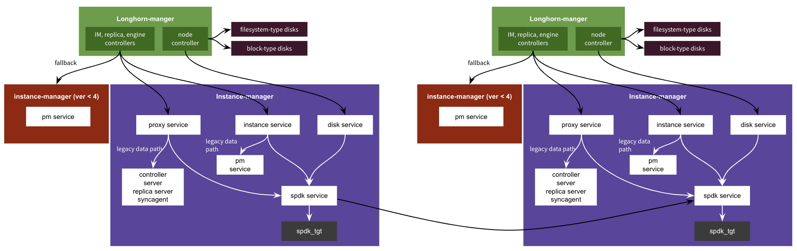
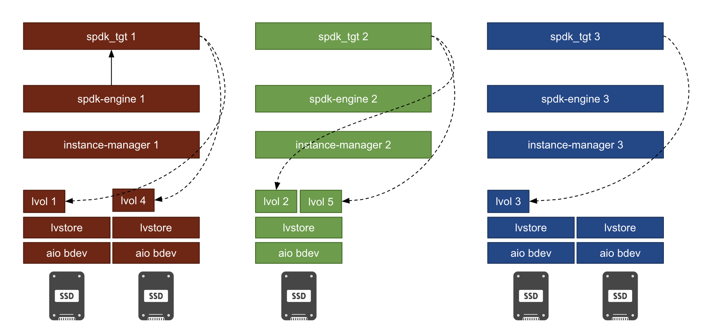

# Support Volumes using V2 Data Engine

## Summary

Longhorn's storage stack, based on iSCSI and a customized protocol, has limitations such as increased I/O latencies and reduced IOPS due to the longer data path. This makes it less suitable for latency-critical applications. To overcome these challenges, Longhorn introduces the Storage Performance Development Kit (SPDK) to enhance overall performance. With SPDK integration, Longhorn optimizes system efficiency, addresses latency concerns, and provides a high-performance storage solution capable of meeting diverse workload demands.

### Related Issues

- [[FEATURE] Add a global setting for enabling and disabling SPDK feature](https://github.com/longhorn/longhorn/issues/5778)
- [[FEATURE] Support replica scheduling for SPDK volume](https://github.com/longhorn/longhorn/issues/5711)
- [[FEATURE] Implement Disk gRPC Service in Instance Manager for collecting SPDK disk statistics from SPDK gRPC service](https://github.com/longhorn/longhorn/issues/5744)
- [[FEATURE] Identify and manage orphaned lvols and raid bdevs if the associated Volume resources are not existing](https://github.com/longhorn/longhorn/issues/5827)

## Motivation

### Goals

- Introduce backend store drivers
    - `v1`: legacy data path
    - `v2`: a newly introduced data path based on SPDK
- Introduce disk types and management
- Support volume creation, attachment, detachment and deletion
- Support orphaned replica collection

### Non-goals [optional]

- Support runtime replica rebuilding
- Support changing number of replicas of a volume
- Support volume expansion
- Support volume backup

## Proposal

### User Stories

Longhorn's storage stack is built upon iSCSI and a customized protocol. However, the longer data path associated with this architecture introduces certain limitations, resulting in increased I/O latencies and reduced IOPS. Consequently, Longhorn may not be the ideal choice for latency-critical applications, as the performance constraints could impede their deployment on the platform.

By incorporating SPDK, Longhorn leverages its capabilities to significantly improve performance levels. The integration of SPDK enables Longhorn to optimize system efficiency, mitigate latency concerns, and deliver a high-performance storage solution that can better meet the demands of diverse workloads.

### User Experience In Detail

- Environment Setup
    - Configure Kernel Modules (uio and uio_pci_generic) and Huge Pages for SPDK
        
        ```bash
        kubectl apply -f https://raw.githubusercontent.com/longhorn/longhorn/master/deploy/prerequisite/longhorn-spdk-setup.yaml
        ```
        
    - Install NVMe Userspace Tool and Load `nvme-tcp` Kernel Module
        
        nvme-cli on each node and make sure that the version of nvme-cli is equal to or greater than version `1.12` .
        
        ```bash
        kubectl apply -f https://raw.githubusercontent.com/longhorn/longhorn/master/deploy/prerequisite/longhorn-nvme-cli-installation.yaml
        ```
        
    - Restart `kubelet`
        
        Modifying the Huge Page configuration of a node requires either a restart of kubelet or a complete reboot of the node. This step is crucial to ensure that the changes take effect and are properly applied.
        
- Install Longhorn system
- Enable SPDK Support
    
    Enable the SPDK feature by changing the `v2-data-engine` setting to `true` after installation. Following this, the instance-manager pods shall be automatically restarted.
    
- Add Disks for volumes using v2 data engine
    - Legacy disks are classified as `filesystem`-type disks
    - Add one or multiple `block`-type disks into `node.Spec.Disks`
        
        ```bash
        block-disk-example1:
          allowScheduling: true
          evictionRequested: false
          path: /path/to/block/device
          storageReserved: 0
          tags: []
          diskType: block
        ```
        
- Create a storage class utilizing the enhanced performance capabilities offered by SPDK
    
    ```bash
    kind: StorageClass
    apiVersion: storage.k8s.io/v1
    metadata:
      name: longhorn-v2-data-engine
    provisioner: driver.longhorn.io
    allowVolumeExpansion: true
    reclaimPolicy: Delete
    volumeBindingMode: Immediate
    parameters:
      numberOfReplicas: "2"
      staleReplicaTimeout: "2880"
      fromBackup: ""
      fsType: "ext4"
      dataEngine: "v2"
    ```
    
- Create workloads that use Longhorn volumes provisioning based on the storage class.

### API changes


## Design

### Implementation Overview

- Global settings
    - `v2-data-engine`: This setting allows users to enable v2 data engine support. Default: false.
    - `v2-data-engine-hugepage-limit`: This setting allows users to specify the 2 MiB hugepage size for v2 data engine. Default: 2048.
- CRD
    - Introduce `diskType` in `node.Spec.Disks`
        - `filesystem`: disks for legacy volumes. These disks, which are actually directories, store and organize data in a hierarchical manner.
        - `block`: block disks for volumes using v2 data engine
        
        The replica scheduler assigns replicas of legacy volumes to `filesystem`-type disks while replicas of volumes using v2 data engine are scheduled to `block`-type disks.
        
    - Introduce `backendStoreDriver` in `volume.Spec`, `engine.Spec` and `replica.Spec`.
        - `backendStoreDriver` is utilized to differentiate between volume types and their associated data paths.
- Introduce `Instance`, `Disk` and `SPDK` gRPC services
    
     
    
    - `Instance` gRPC service: It is tasked with managing various operations related to instance management, including creation, deletion, retrieval, listing, and watching. An instance, either an engine or a replica of a legacy volume, represents a process. On the other hand, for replicas of volumes using v2 data engine, an instance represents a logical volume. In the case of an engine for an volume using v2 data engine, an instance is associated with a raid bdev, a frontend NVMe target/initiator pair and a bind mount device.

    - `Disk` gRPC service: It is responsible for managing various disk operations, including creation, deletion, and retrieval. Additionally, it provides functionalities to list or delete replica instances associated with the disks. In the case of a legacy volume, a replica instance is represented as a replica directory on the disk. On the other hand, for an volume using v2 data engine, a replica instance is a replica chained by logical volumes.

    - `SPDK` gRPC service: It manages replicas chained by logical volumes and engines constructed using SPDK raid1 bdevs. In addition, the service is responsible for the communication with `spdk_tgt`.

- Proxy gRPC service APIs
    - Update gRPC service APIs for support different disk type, filesystem and block, and data engines, v1 and v2.

- Disk orchestration
    
    Within the Longhorn system, an aio bdev and an lvstore are created on top of a block-type disk. Replicas in terms of logical volumes (lvols) are then created on the lvstore.
    
    
    
- Orphaned replicas collection

    The features have been integrated into the existing framework for collecting and cleaning up orphaned replicas.

## Test Plan


## Note [optional]