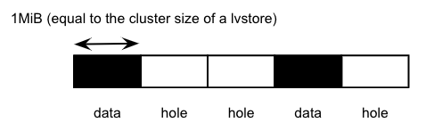

# Support Backup and Restore For Volumes with V2 Data Engine

## Summary

Support backup and full restore for volumes with v2 data engine.

### Related Issues

- [[FEATURE] SPDK volumes support volume backup/restore](https://github.com/longhorn/longhorn/issues/6138)

## Motivation

### Goals

- Leverage the existing backup and restore frameworks
- Back up volumes with v2 data engine 
- Fully restore volumes with v2 data engine
- Support fully restoring v2 volume backup to v1/v2 volume

### Non-goals

- Incremental restore volumes with v2 data engine

## Proposal

## User Stories

Backup and restore are essential for data recovery. Longhorn system can back up volumes with v1 data engine. However, it does not support snapshot backup for v2 data engine yet. For better user experience, backup and restore operations should be consistent across both data engines. Additionally, a v2 volume can support restoring to an either v1 or v2 volume.

### User Experience In Details

Backup and restore operations should be consistent across both data engines.

### API Changes

- engine-proxy
    - Add `BackupRestoreFinish` for wrapping up the volume restore
- spdk
    - Add `bdev_lvol_get_fragmap` API
        - Get a fragmap for a specific segment of a logical volume (lvol) using the provided offset and size. A fragmap is a bitmap that records the allocation status of clusters. A value of "1" indicates that a cluster is allocated, whereas "0" signifies that a cluster is unallocated.
    - Add `creation_time` xattr in lvols
        - The `creation_time` is represented as a snapshot creation time.
    - Add `bdev_lvol_get_xattr` and `bdev_lvol_set_xattr`

- spdk-go-helper
    - Add `BdevLvolGetFragmap` for `bdev_lvol_get_fragmap`
    - Add `BdevGetXattr` for `bdev_lvol_get_xattr`
    - Add `BdevSetXattr` for `bdev_lvol_set_xattr`
### UI Changes

- In `UI > Backup > Volume Operations > Restore` page, add `Data Engine` option.

## Design

Longhorn can incrementally back up volumes that use the v1 data engine. Incremental backups are based on fiemap, which are file extent mappings of the disk files. This means that only the changes to the volume since the last backup are backed up, which can save time and space.

However, snapshots of volumes that use the v2 data engine are SPDK lvols, which do not support fiemap. Instead, we can use the concept of fiemap to leverage the fragmentation map (fragmap) instead. A fragmap is a mapping of data and hole segments in a volume. This means that we can use the fragmap to identify the changed segments of a v2 volume and back them up, even though fiemap is not supported.

Here are some additional details about fiemap and fragmaps:

- fiemap is a Linux kernel API that allows applications to query the file system for the extents of a file. This can be used to efficiently back up files, as only the changed extents need to be backed up.
- fragmap is a data structure that stores the fragmentation information for a volume. This information includes the size and location of each data segment in the volume, as well as the size and location of any holes in the volume.

### Implementation Overview

- **spdk_tgt**
    - Add `bdev_lvol_get_fragmap` JSON-RPC method: retrieve the fragmap for a specific portion of the specified lvol bdev
        - Parameters
            - lvs_name: The name of the lvstore name
            - lvol_name: The name of the lvol.
            - offset: offset the a specific portion of the lvol. Unit: bytes.
            - size: size the a specific portion of the lvol. Unit: bytes.
        - The fragmap is internally constructed by incorporating with `spdk_bdev_seek_hole` and `spdk_bdev_seek_data`
        - The size of each data segment or hole segment is the same as the cluster size of a lvstore
        - An example of a fragmap of a lvol

          

- **Backup Flow**

    The backup flow is explained by the an example. A snapshot chain of a volume is
    ```
    volume-head -> snap003 -> snap002 -> snap001 (backed up)
    ```
    `snap001` is already backed up, and we are going to back up `snap003`. The steps are

    1. longhorn-manager's backup controller is aware of the backup resource for the snapshot `snapshot3` and then issues a backup request to the instance-manager by the proxy function `SnapshotBackup()` with the specified volume and snapshot names.
    2. After the instance-manager proxy service receives the request, the proxy function transfers the request to the SPDK service by `EngineBackupCreate()`.
    3. The SPDK service randomly picks one of the replicas and executes the backup by `ReplicaBackupCreate()`.
    4. Expose snapshot (`snap003`) to be a block device locally via NVMe over TCP. The data in the block device is the accumulated data of `snap003` and its descendants.
    5. Get the fragmaps of the snapshot to be backed up and its descendants prior to the last backup. In the example, we need to get the fragmaps of `snap003` and `snap002`.
    6. Retrieve the fragmap of each lvol using `bdev_lvol_get_fragmap` JSON-RPC method.
    7. Overlay all the fragmaps, iterate each bit, and if it's set to 1, read data from the corresponding cluster on the block device and perform a backup.


- **Full Restore Flow**

    1. The engine controller within Longhorn Manager is informed of a volume restore request. Subsequently, it initiates a restore operation to the instance manager using the BackupRestore() proxy function. This operation includes essential details such as the volume name, backup name, credentials, and more.
    2. Once the instance manager's proxy service receives the request, the `EngineRestoreCreate()` proxy function is employed to transfer the request to the SPDK service.
    3. Within `EngineRestoreCreate()`, the raid bdev is removed, followed by issuing a replica restore command to the associated replicas through the `ReplicaRestoreCreate()` function.
    4. In the `ReplicaRestoreCreate()`, the lvol of the replica is locally exposed as a block device using NVMe over TCP.
    5. The subsequent steps involve downloading data blocks and writing them to the block device according to the block mappings.
    6. Upon the successful completion of the restoration process, Longhorn Manager sends a request to finalize the restoration to the instance manager via the `EngineRestoreFinish()` function. This function facilitates the recreation of the raid bdev.

## Test Plan

- Concurrent volume backup and full restore

## Note[optional]