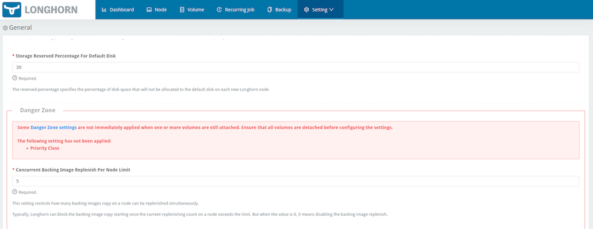

# Support non-disruptive volume-related setting updates

## Summary

The volume-related settings can only be updated when no volumes are attached. This enhancement will allow users to modify volume-related settings, with changes taking effect only during volume upgrades or reattachments.

### Danger Zone

If modifying the settings that will affect the running volumes (usually it will restart instance manager pods, and restarting instance manager pods will affect the running volumes), the setting should be included in the Danger Zone settings.

| Setting | Additional Information| Affected Components |
| --- | --- | --- |
| [Kubernetes Taint Toleration](#kubernetes-taint-toleration)| [Taints and Tolerations](../../advanced-resources/deploy/taint-toleration/) | System-managed components |
| [Priority Class](#priority-class) | [Priority Class](../../advanced-resources/deploy/priority-class/) | System-managed components |
| [System Managed Components Node Selector](#system-managed-components-node-selector) | [Node Selector](../../advanced-resources/deploy/node-selector/) | System-managed components |
| [Storage Network](#storage-network) | [Storage Network](../../advanced-resources/deploy/storage-network/) | Instance Manager and Backing Image components |
| [V1 Data Engine](#v1-data-engine) || Instance Manager component |
| [V2 Data Engine](#v2-data-engine) | [V2 Data Engine (Preview Feature)](../../v2-data-engine/) | Instance Manager component |
| [Guaranteed Instance Manager CPU](#guaranteed-instance-manager-cpu) || Instance Manager component |
| [Guaranteed Instance Manager CPU for V2 Data Engine](#guaranteed-instance-manager-cpu-for-v2-data-engine) || Instance Manager component |

### Related Issues

https://github.com/longhorn/longhorn/issues/7173

## Motivation

Longhorn must have the capability to update volume-related settings without deleting pods associated with running volumes. Without this enhancement, users are restricted to customizing the volume-related settings only when all volumes are detached.

### Goals

- Users can update the volume-related settings immediately.
- The updated volume-related settings will take effect in Longhorn only during volume upgrades or reattachments.
- A field `Applied` in `Status` of the CRD `Setting` indicating that the setting has been applied to the Longhorn components.

### Non-goals [optional]

`None`

## Proposal

This proposal aims to enable users to update the volume-related settings while ensuring the uninterrupted operation of running volumes.

### User Stories

Previously, users could only update volume-related settings after manually detaching all volumes. With this enhancement, users can promptly update the settings, and Longhorn will apply the change to an instance manager only when there are no engine or replica processes running on that instance manager.

### User Experience In Detail

Users can modify the volume-related settings, like other general settings, either through the Longhorn UI or by applying the Kubernetes manifest file. Longhorn carefully examine these settings to determine whether to proceed with the update process. If there are engine or replica processes running on the instance manager, Longhorn will temporarily halt the update process and retry until all processes of the instance manager are terminated.

Longhorn components, except the instance manager, must still wait for all volumes to be detached before applying the setting. Once all volumes are detached, users may need to reapply the setting to ensure it affects the other components.

#### Check Setting Status By CLI

Users can check if the setting has been applied to Longhorn components by the CLI command:

```shell
> kubectl -n longhorn-system get setting priority-class
NAME             VALUE               APPLIED   AGE
priority-class   longhorn-critical   true      5h30m
```

#### Check Setting Status By UI

Users can check if the setting has been applied to Longhorn components on the Setting/General page. The Danger Zone section will display any unapplied Danger Zone settings.
 

### API changes

Add a field `Applied` in returning data `Setting` for APIs `SettingList`, `SettingGET` and `SettingSet`:

```golang
type Setting struct {
  ...
  Applied bool   `json:"applied"`
  Name    string `json:"name"`
  Value   string `json:"value"`
  ...
}
```

## Design

### CRD

```golang
  type Setting struct {
    metav1.TypeMeta   `json:",inline"`
    metav1.ObjectMeta `json:"metadata,omitempty"`

    // The value of the setting.
    Value string `json:"value"`

    // The status of the setting.
    Status SettingStatus `json:"status,omitempty"`
  }

  // SettingStatus defines the observed state of the Longhorn setting
  type SettingStatus struct {
    // The setting is applied.
    Applied bool `json:"applied"`
  }
```

### Implementation Overview

1. Move `SettingNameV1DataEngine`, `SettingNameV2DataEngine`, and `SettingNameV2DataEngineGuaranteedInstanceManagerCPU` settings to the Category `SettingCategoryDangerZone`.

1. Remove all volumes attached examinations for volume-related settings from validations. Such as:

    ```golang
    case types.SettingNameTaintToleration:
        volumesDetached, err := s.AreAllVolumesDetachedState()
        if err != nil {
            return errors.Wrapf(err, "failed to list volumes before modifying toleration setting")
        }
        if !volumesDetached {
            return &types.ErrorInvalidState{Reason: "cannot modify toleration setting before all volumes are detached"}
        }
    ```

1. Separate the non-danger zone settings and danger zone setting in the setting controller.

    ```golang
    func (sc *SettingController) handleErr(err error, key interface{}) {
        ...
        _, name, err := cache.SplitMetaNamespaceKey(key)
        if err != nil {
            return err
        }
        err := sc.syncNonDangerZoneSettingsForManagedComponents(name)

        return sc.syncDangerZoneSettingsForManagedComponents(name)
    }
    ```

1. Block applying the settings to system-managed components if one or more volume are attached:
    For settings:

    ```golang
    dangerSettingsRequiringAllVolumesDetached := []types.SettingName{
        types.SettingNameTaintToleration,
        types.SettingNameSystemManagedComponentsNodeSelector,
        types.SettingNamePriorityClass,
        types.SettingNameStorageNetwork,
    }
    ```

    ```golang
    if slices.Contains(dangerSettingsRequiringAllVolumesDetached, settingName) {
        detached, _, err := sc.ds.AreAllVolumesDetached(longhorn.DataEngineTypeAll)
        ...
        if !detached {
            return &types.ErrorInvalidState{Reason: fmt.Sprintf("failed to apply %v setting to Longhorn components when there are attached volumes. It will be eventually applied", settingName)}
        }
        // apply the setting to components.
        ...
    }
    ```

1. For the settings related to v1/v2 data engine volume, we will check if volumes are attached according to the data engine type.

    ```golang
    dangerSettingsRequiringSpecificDataEngineVolumesDetached := []types.SettingName{
        types.SettingNameV1DataEngine,
        types.SettingNameV2DataEngine,
        types.SettingNameGuaranteedInstanceManagerCPU,
        types.SettingNameV2DataEngineGuaranteedInstanceManagerCPU,
    }
    ```

    ```golang
    if slices.Contains(dangerSettingsRequiringSpecificDataEngineVolumesDetached, settingName) {
        switch settingName {
        case types.SettingNameV1DataEngine, types.SettingNameV2DataEngine:
            // the webhook validators will check if volumes are attached according to the data engine type.
        case types.SettingNameGuaranteedInstanceManagerCPU, types.SettingNameV2DataEngineGuaranteedInstanceManagerCPU:
            detached, _, err := sc.ds.AreAllVolumesDetached(dataEngine)
            if !detached {
                return &types.ErrorInvalidState{Reason: fmt.Sprintf("failed to apply %v setting to Longhorn components when there are attached volumes. It will be eventually applied", settingName)}
            }
            // apply the setting to components.
            ...
        }
    }
    ```

1. Manage the instance manager pods in the instance controller and restart pods if no instances are running and settings are not applied.

    ```golang
    func (imc *InstanceManagerController) handlePod(im *longhorn.InstanceManager) error {
        err := imc.annotateCASafeToEvict(im)
        if err != nil {
            return err
        }
        ...
        // check if pods of im *longhorn.InstanceManager needs to be restarted.
        isSettingSynced, isPodDeletedOrNotRunning, areInstancesRunningInPod, err := imc.areDangerZoneSettingsSyncedToIMPod(im)
        isPodSettingSynced := isSettingSynced || isPodDeletedOrNotRunning || areInstancesRunningInPod
        if im.Status.CurrentState != longhorn.InstanceManagerStateError && im.Status.CurrentState != longhorn.InstanceManagerStateStopped && isPodSettingSynced {
            return nil
        }

        // cleanup and recreate pods.
        ...
    }

    func (imc *InstanceManagerController) isSettingsSyncedToPod(im *longhorn.InstanceManager) (isSynced, isPodDeletedOrNotRunning, areInstancesRunningInPod bool, err error) {
        // check if instance manager is in running state.
        // check if instance manager has running instances.
        // check if the settings related to system managed components are applied to pods of the instance manager.

        return true, false, false err
    }
    ```

### Test plan

- Test no volume attached
    1. Fresh install Longhorn
    1. Customize a Danger Zone setting such as setting the value of `priority-class` to be `system-cluster-critical`
    1. The setting applies to all components managed by Longhorn.
    1. The `Status.Applied` of the setting is `true`.

- Test a volume attached with a replica on three node cluster.
    1. Fresh install Longhorn.
    1. Create a volume with a replica.
    1. Attach the volume to a node.
    1. Customize a Danger Zone setting such as setting the value of `priority-class` to be `system-cluster-critical`
    1. The setting only applies to pods of the instance manager without engine and replica processes.
    1. The `Status.Applied` of the setting is `false`.
    1. Detach the volume.
    1. Reapply the setting.
    1. The setting applies to all components managed by Longhorn.
    1. The `Status.Applied` of the setting is `true`.

### Upgrade strategy

- Add `spec.syncRequestedAt = now()` to all `settings.longhorn.io` objects during the upgrade.
- Check if settings related to system components should be applied to components managed by Longhorn.

## Note [optional]

`None`
