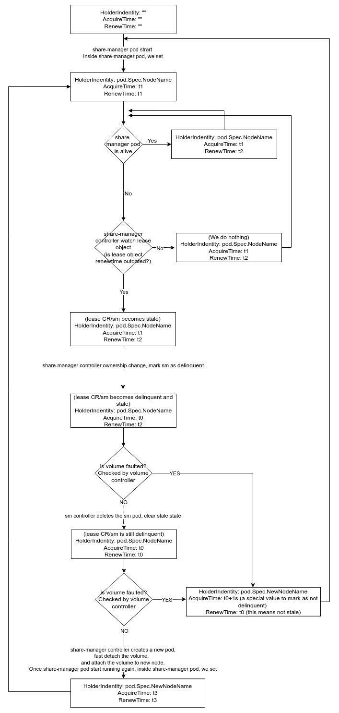

# Fast Failover for RWX Volume's NFS Server

## Summary

In Longhorn, a ReadWriteMany volume (and at some point, a ReadOnlyMany volume) is handled by an NFS server located within the share-manager pod.  It mounts an RWO volume in the usual way, and then provides export and locking capabilities on top of it, which multiple workload pods can mount and write safely.  There is only one share-manager pod for a volume, so if the node on which the pod is running fails, the responsible controller must notice and start a new pod on another node.  After it starts, client pods can re-connect and resume I/O.  But first, they negotiate with the new server about what their state should be, and there is a grace period in which writes are refused while waiting for any other possible clients to show up.

In a previous enhancement, [Dedicated Recovery Backend for RWX Volume's NFS Server](https://github.com/longhorn/longhorn/blob/master/enhancements/20220727-dedicated-recovery-backend-for-rwx-volume-nfs-server.md), Longhorn incorporated a recovery backend that can speed up that process and guarantee that all the former clients have been accounted for.  But a node failure still takes minutes to recover from, as noted in the [Longhorn docs](https://longhorn.io/docs/1.6.0/high-availability/node-failure/).

In this enhancement, a mechanism is proposed to quickly detect and respond to share-manager pod failure independently of the Kubernetes node failure sequence and timing.

### Related Issues

[https://github.com/longhorn/longhorn/issues/6205](https://github.com/longhorn/longhorn/issues/6205)

## Motivation

The main goal is to minimize downtime on RWX workloads.

In the current code, failure of a container in the share-manager pod or the pod itself is quickly handled.  It takes about 20 seconds to restore write access, of which about half is spent restarting the workload pods and letting them remount.  Longhorn's recovery backend has the ability to shorten the grace period wait when all clients are accounted for.

The big problem happens when the node with the share-manager pod fails or restarts.  Just the time it takes for the node to go `NotReady` - in Kubernetes, typically about 45 seconds - is already too long an outage for share-manager failover.  We intend to make the NFS client recovery time for a failure of the node running the share-manager pod to be just as quick as for simple pod failure.

### Goals

- Implement a fast failover mechanism that is not gated by Kubernetes' relatively slow detection and handling of node failure.  Recovery should be a matter of seconds rather than minutes.  
- It should not require a restart of workload pods.
- Operation of the recovery backend will be unchanged.
- After the failure of the share-manager pod, the application on the client side’s IO operations will be stuck until the share-manager and NFS are recreated, and the NFS server grace period has elapsed (if there was a workload pod on the failed node).  The interruption will be brief, with the NFS server back up within 20 seconds, and an overall outage of less than a minute.  
- Changing Kubernetes behavior via `node-monitor-period` and `node-monitor-grace-period` values in the Kubelet should make no difference to RWX failover. The time to accomplish node NotReady processing and return to Ready state should be independent of RWX HA time.  

### Non-goals

Duplicate NFS servers running simultaneously, providing Active/Active or Active/Passive redundancy.  "True HA" with zero recovery time is a long-term desire but is extremely difficult to accomplish with NFS.  See the section on [Alternatives](#alternatives) below.  

## Proposal

Fast failover needs several pieces.

1. Quick detection of failure  
Use the Kubernetes `Lease` mechanism.  When an RWX volume is created, create the lease at the same time as the share-manager pod and service.  Just like the service, it will have the same name and lifetime as the volume itself.  The lease holder is not specified at the time of creation; it will be assigned when the pod is scheduled to a node and begins to run.  
This mimics Kubernetes' own internal mechanism for tracking node status, which is also lease-based.  Detection of an unresponsive server could also be done with a monitor that makes a recurring call to the server pod, but the lease has the advantage that it reflects the server's ability to make an API call, rather than the connectivity from an arbitrarily chosen monitor node.  
Longhorn will
    - Update the lease periodically from ShareManager pod.
    - Use a goroutine in the share-manager controller to schedule a check of the lease for expiration.

2. Quick removal of the failed/failing server  
If the lease is expired, we infer that the pod's node is dead and another controller needs to take over.  All other nodes will detect that.  Longhorn needs to pick one, and establish that choice so that multiple controllers don't all attempt to drive the recovery.  Longhorn will use the controller's `isResponsibleFor` method:  
    - If the lease is not expired, move on to normal handling.  
    - If it has, set the share-manager CR `Status.OwnerID` to this node, if another node hasn't already done so.  (We can tell by comparing the owner field to the lease holder.)  The new owner will act as an interim manager to do tear-down and recreation of the share manager pod.  It updates the CR and, if successful, then returns "true".
    - The new owner is logged, and then the reconcile can continue.  Mark the share-manager CR as error state and let it clean up the pod.  
    - In cleanup,  
        - Remember the old lease holder.  
        - Clear the lease.  
        - Delete the pod.  
        - If the node is down *OR* expired, do a force delete of the share-manager pod as well.  If it truly is down, this is the same as current code.  If it is not, then the first delete should have succeeded, but either way, even if the pod is still running, this will ensure that Kubernetes does not route service traffic to it.  Also, deletion allows reuse of the same standard pod name, avoiding one potential upgrade complication.
    - Other resources need to change ownership similarly.  Modify the usual rules to capture our suspicion that the expired node is dead:
        - Keep track of the delinquent state in the volume's lease object (see `Design` section below).  The otherwise informational Spec.AcquireTime field can be used for that.
        - Change `IsNodeDownOrDeleted` to check `IsNodeDownOrDeletedOrDelinquent` for other resources related to that volume, as well as any resource-specific `isResponsibleFor` calls.  

3. Quick creation of a replacement  
This is already a normal part of the Share Manager lifecycle.  But it does need an adjustment to avoid the former host, which Kubernetes will try to re-schedule to since Kubelet does not yet report it as down.  
    - If the volume is delinquent, avoid its node (the current delinquent lease holder).  Create the pod with the existing set of selectors, tolerations, and affinities defined for share-manager pods, with an extra added one-time anti-affinity for the delinquent node.  Note that when the pod is scheduled, it might not be on the interim controller node, so ownership might change again.
    - After the pod is created, it will not clear the delinquent condition until the lease is taken over.  That happens after the pod is running, so the deliquent state can still be checked for attachment actions, which must be satisfied for the NFS server to run.  

4. Avoid client workload pod restart  
Longhorn currently restarts the workload pods in volume controller when the share-manager pod restarts.  There does not appear to be any need to do so.  If the server restarts beneath a client, it will reconnect and resume operation without having to restart the workload pod to kill the client process.  If the outage is long enough, a client mounted with "soft" option may return an EIO or an ETIMEDOUT to its application.

5. Shorten the recovery grace period  
After a restart, the NFS server will wait for clients to re-establish connection and supply their state.  The recovery grace period is usually configured to 90 seconds.  If all workload pods are alive, they will attempt to restore a connection, and the recovery backend can terminate the wait for clients as soon as all are accounted for.  But if a workload pod was on the failed node, it will not be able to clear its state.  For the purposes of fast failover, Longhorn will configure the NFS server with a shorter grace period of only 30 seconds.  This is a trade-off between speed and probability of a legitimate client being delayed in re-connecting.  

### User Experience

The changes should not alter the use of RWX volumes.  There will be no observable difference until a node failure occurs (for whatever reason - Kubernetes upgrade, eviction, injected error).

This is an `experimental` feature, and needs some soak time before it is the default.  There will be a setting to enable or disable it, and it will be off in the first release.

## Design

This feature uses two close but separate notions of pod state, "stale" and "delinquent".  A pod is stale when its lease has expired - that is, not been renewed for some period longer than the renewal interval.  The inference is that its node has failed, and it needs a controller on another node to take over ownership and do the work of deleting and recreating the pod.  All nodes will monitor leases, and the first one to notice the stale state will modify the share-manager CR status to make itself the owner.  When that has happened, the stale state can be cleared by zeroing the `RenewalTime` field of the lease.  Other controllers will know that it is being handled.  

After a new node has claimed the interim ownership, it marks the lease as "delinquent" and that state is used so that the controller can know how to do recovery, and in particular to avoid sending any commands to the dead node.  They would time out without having any effect.  There is not actually a "delinquent" field in the lease, so the `AcquireTime` field is overloaded and set to zero when the current holder is presumed dead.  

The flow is laid out in this state diagram:  

The "delinquent" state remains until the lease is acquired by a new lease-holder node, which happens after
  - The old pod has been deleted,
  - A new pod created and scheduled,
  - The old pod's attachment is cleared and the new pod attached to its node,
  - The exported filesystem is mounted and the NFS server is running.

Typically, the delinquent state is used to bypass communication to the node that would be allowed by Kubernetes, but is likely to time out.  To keep that state from lasting indefinitely, and possibly blocking some recovery action in turn blocks the pod creation, the state can be cleared when the node in question actually does shift to `NotReady` state.  At that point, fast failover is moot, but failover will revert to the normal sequence.

### Implementation Overview

- **share-manager**
    
    Add a constant, `share-manager-renew-interval`.  It should be often enough to detect failure quickly, but not so often that it overwhelms the network and API server with traffic.  Hard-code this to 3 seconds.

    Add a goroutine to keep the lease from expiring.  Every `share-manager-renew-interval`, get the lease for the RWX volume (name it the same as the volume name) and update its `lease.spec.renewTime` to "now".  If the lease cannot be found, take no action.
    
- **longhorn-manager**
    
    - setting
    Add a Boolean setting, `rwx-volume-fast-failover`.  Because this is an experimental feature to begin with, default it to false.
    
    - share_manager_controller  
    Add code to create a lease at the same time as the service.  Set `lease.spec.leaseDurationSeconds` to a little over two lease renewal periods.  
    At creation, also set `lease.spec.acquireTime` and `lease.spec.renewTime` to "now".  
    Every sync, check the lease for each share-manager.  If acquireTime == renewTime, assume that the share-manager image does not know to update the lease, so take no action.  Otherwise, if status is StateRunning and renewTime + timeout is less than "now", mark the share-manager CR as `Error` to drive deletion and re-creation.  
    Add logic to `isResponsibleFor` to check for staleness first and take over ownership.
    Modify the lease to mark its status on the node as delinquent.
    Remove the selector labels for admission webhook and recovery backend from the delinquent node's longhorn-manager pod.
    Add delinquency check to `cleanupShareManagerPod()` when deciding to force-delete.
    Add an anti-affinity to pod manifest creation to avoid the previous owner node.

    - node_controller  
    Add code at startup to replace the selector labels for any services that may have been turned off while the node was delinquent.

    - datastore/longhorn  
    Revise `IsNodeDownOrDeleted` to add an `IsNodeDownOrDeletedOrDelinquent` function that also takes the volume as a parameter, and check the lease's state.

    - volume_controller  
    Add logic in `ReconcileShareManagerState()` to check the volume's storageclass for NFS mount options.  If `parameters.nfsOptions` contains "hard", then request remount to force a restart as in current code.  Otherwise, skip that (but make a similar event).  This code is aware that the default option is not to hard mount NFS.
    
- **nfs-ganesha (user-space NFS server)**

    No changes.
    
### Proof of Concept
    
A lot of trial failovers have been executed, to test various aspects of the implementation.  We have run with the changes listed, but using a "global" application of delinquency check with a condition set for the node itself.  Running on a 3-worker node cluster with just a single, soft-mounted RWX volume (nginx RWX example) and forcing a node restart with `shutdown -r now` on the node console, Longhorn could destroy and re-create the share-manager pod in 16 seconds, as shown by the time for the new owner to take over and resume refreshing the lease.  Note that for the lease to be refreshed, the pod must be running, implying that the volume is mounted.  
The workload pods themselves failed to be able to write for about 2 minutes, but most of that time was waiting for the client grace period to elapse.

### Risks and Mitigation

- **Something goes not as expected**
For all code paths, the fallback is to resort to the normal "not ready" path.  So at worst, the failover time is the same as previous releases.  Every effort should be made to ensure that the logging is clear and sufficient to tell why an expedited failover was not accomplished in such cases.

- **Possible delay due to image pull on the successor node**
This is taken care of by the added feature to pre-pull the share-manager pod image: [[IMPROVEMENT] Pre-pull images (share-manager image and instance-manager image) on each Longhorn node](https://github.com/longhorn/longhorn/issues/8376).

- **Insufficient resources on any successor node**
We rely on Kubernetes scheduling to pick an appropriate successor node that meets all the usual constraints, if one exists.  If the pod can't be scheduled, there is little to be done immediately but to wait for the failed node to return.  For the user, the solution might be to add resources or decrease the cluster load in order to allow space for failover scheduling.  This design does not schedule the successor in advance (see [Active/Passive](#active-passive) below for notes on how that might work).  

- **False positives**
The initial choice for timeout interval may prove to be too sensitive.  It is not currently adjustable.  Increasing the timeout will make it less likely to restart share-manager unnecessarily, but also increase the time to recovery.  
One open question is whether delays in lease renewal and false positives are more likely in a heavily loaded cluster.  That can probably only be resolved with copious testing, including high-load cases.

- **Webhook availability**
Testing with the PoC uncovered a snag.  Often, the share manager controller will get a failure when it updates the volume attachment. The error is a timeout while trying to call the admission webhook.  That repeats until the failed node actually goes to "not ready", and then it succeeds, usually about 20-30 seconds later.  It doesn't break anything, but it means that the failover takes as long as it would without this feature.  
In analysis with team members, we concluded that it is because the admission webhook is a service and one node of the cluster is picked to respond to the service IP address for any given request.  It can happen that it is the same node that hosted the share manager and has failed.  If so, calls to the webhook will time out until control is passed by Kubernetes to another node, which happens on its own timetable.  On the PoC test cluster of three worker nodes, that's about 1/3 of the time.  That means that failovers will intermittently and unpredictably take longer than they should.

We can avoid this by making a label on the longhorn-manager pod specific to each webhook and using that label as the webhook's selector.  If the node goes delinquent, remove the label to take that node's IP address out of the webhook service's endpoint slice.  That will prevent the unresponsive node from being selected.  The same applies to the recovery backend service as well.

### Upgrade Strategy

There are two changes that need to be handled in an upgrade:
- Creation of a new setting to define and default:  `rwx-volume-fast-failover` (default, false).  
- Revision of webhook and recovery backend services to use dedicated labels as selectors.
Both can be done in the upgrade manifest.

After an upgrade, the share-manager pod would have to be restarted into the new share-manager image for lease management to work.  That could happen as part of the upgrade, or as nodes are restarted for other reasons.  The first restart would use the old, slow mechanism, but subsequent ones would use the new one.

The logic for creation and checking of Lease records ensures that all parties know and implement the lease strategy.  If some component doesn't, the behavior defaults to the same as current code.

> Old longhorn-manager + new share-manager: No lease is created, so the share-manager just skips the renewal loop.

> New longhorn-manager + old share-manager: Lease is created, but never claimed by a holder or renewed to advance the expiration time. Staleness check sees that there is no holder, so the lease is never expired. Failover is only based on reported K8s node state.

### Test Plan

The Test Plan is similar to [Dedicated Recovery Backend for RWX Volume's NFS Server](https://github.com/longhorn/longhorn/blob/master/enhancements/20220727-dedicated-recovery-backend-for-rwx-volume-nfs-server.md).

- Setup
    3 worker nodes for the Longhorn cluster.  
    For each test repeat once with default NFS mount options, including "soft" or "softerr", and once with custom options including "hard" mount.

- Tests
    1. Enable the feature.  
       Create 1 RWX volume and then run an app pod with the RWX volume on each worker node.  Execute the command in each app pod
        
        `( exec 7<>/data/testfile-${i}; flock -x 7; while date | dd conv=fsync >&7 ; do sleep 1; done )`
        
        where ${i} is the node number.
        
        Turn off or restart the node where share-manager is running. Once the share-manager pod is recreated on a different node, check
        
        - Expect
            - In the client side, IO to the RWX volume will hang until a share-manager pod replacement is successfully created on another node.
            - During the outage, the server rejects READ and WRITE operations and non-reclaim locking requests (i.e., other LOCK and OPEN operations) with an error of NFS4ERR_GRACE.
            - New share-manager pod is created in under 20 seconds.
            - Outage, including grace period, should be less than 60 seconds.
            - If locks cannot be reclaimed after a grace period, the locks are discarded and return IO errors to the client. The client reestablishes a new lock.

    2. Turn the deployment into a daemonset in [example]([https://github.com/longhorn/longhorn/blob/master/examples/rwx/rwx-nginx-deployment.yaml](https://github.com/longhorn/longhorn/blob/master/examples/rwx/rwx-nginx-deployment.yaml) ) and disable `Automatically Delete Workload Pod when The Volume Is Detached Unexpectedly`. Then, deploy the daemonset with a RWX volume.
        
        Turn off the node where share-manager is running. Once the share-manager pod is recreated on a different node, check
        
        - Expect
            - The other active clients should not run into stale handle errors after the failover.
            - New share-manager pod is created in under 20 seconds.
            - Outage, including grace period, should be less than 60 seconds.

    3. Run a scale test.  Use the deployment in [example]([https://github.com/longhorn/longhorn/blob/master/examples/rwx/rwx-nginx-deployment.yaml](https://github.com/longhorn/longhorn/blob/master/examples/rwx/rwx-nginx-deployment.yaml) ).  Make as many instances of the deployment as possible, but at least 100.  They should be evenly distributed across the worker nodes.
        
        Run once without the fast-failover feature enabled.  Note the CPU use of longhorn-manager pods.  

        Re-run with the feature on, and verify that the CPU use is not significantly larger.  The load of lease-checking should be minimal.  
        Turn off one of the nodes.  That should cause about 1/3 of the pods to relocate.  
        
        - Expect
            - All pods should be recreated within 20 seconds.
            - Outage, including grace period, for all pods should be less than 60 seconds.
            - RWX volumes not originally on the failed node should be unaffected.

## Alternatives

In the LEP for the recovery backend, it said, (bullets added for emphasis)
> To support NFS server's failover capability, we need to change both the client and server configurations. A dedicated recovery backend for Kubernetes and Longhorn is also necessary.
> In the implementation, we will not implement the active/active or active/passive server pattern:
>   - Longhorn currently supports local filesystems such as ext4 and xfs. Thus, any change in the node, which is providing service, cannot update to the standby node. The limitation will hinder the active/active design. 
>   - Currently, the creation of an engine process needs at least one replica and then exports the iSCSI frontend. That is, the standby engine process of the active/passive configuration is not allowable in current Longhorn architecture.

Those factors are still present.  But here are some possibilities that have been considered.

### Active/Active with no interruption.

In order to do a more immediate failover, the [NFS-ganesha Wiki](https://github.com/nfs-ganesha/nfs-ganesha/wiki/NFS-Ganesha-and-High-Availability) advises 
> NFS-Ganesha does not provide its own clustering support, but HA can be achieved using Linux HA  

and points to several options for a Linux node clustering solution layered below ganesha, including Gluster or Ceph.

Some of the difficulties are discussed in the nfs-ganesha issue [Does the nfs client can do auto failover to another good nfs-ganesha server if one ganesha server is down.](https://github.com/nfs-ganesha/nfs-ganesha/issues/761).

There was a [proposal](https://www.snia.org/sites/default/files/Poornima_NFS_GaneshaForClusteredNAS.pdf) to extend nfs-ganesha with a Cluster Manager Abstraction Layer (CMAL) for the purpose, but it was abandoned.

Here are some more recent solutions for "NFS clusters".
 - SUSE SLE 15 [Highly Available NFS Storage with DRBD and Pacemaker](https://documentation.suse.com/sle-ha/15-SP5/html/SLE-HA-all/article-nfs-storage.html)
 - Ubuntu [HighlyAvailableNFS](https://help.ubuntu.com/community/HighlyAvailableNFS)
 - Highly Available NFS based Kerberos KDC [Ganesha + GlusterFS + HAProxy](https://www.loadbalancer.org/blog/highly-available-shared-nfs-server/)
 - A video on [How to create a HA NFS Cluster using Pacemaker, Corosync, & DRBD on RHEL / AlmaLinux 9](https://www.youtube.com/watch?v=IxFI0Ms0ULA).  Setup is far from trivial.
  
All of these methods use a distributed filesystem or block driver to keep the metadata synchronized between the HA cluster nodes.  They set up network access with a tool such as HAProxy to an IP address that will be handled by whichever node or nodes are alive, and use a tight synchronizer between the Linux server nodes.
In a Kubernetes setting, that would become a synchronizer between the NFS server containers in the paired share-manager pods.  That might be possible, but it would add a significant amount of configuration to the container, and traffic to the management network per volume.

### Active/Active as Load Balancer

  - [cephNFS](https://rook.io/docs/rook/latest/CRDs/ceph-nfs-crd/#example) can configure multiple active NFS servers, but it does not work quite the same way.  Clients connect to either server, but it relies on "sticky" client connection to stay with the same server.  It recommends setting active count to 1; otherwise a failover may block I/O for the grace period while clients move.
  - rook/ceph had a [ticket for the HA feature](https://github.com/rook/rook/issues/11526) which has been closed for lack of activity.

### Active/Passive

Also termed `Active/Warm Standby`.  There's a good discussion of the comparison in [this S3GW doc](https://github.com/s3gw-tech/s3gw/blob/main/docs/research/ha/RATIONALE.md).  The share-manager pod is the Longhorn SPOF analog of S3GW's `radosgw`.  Even though the feature has been de-prioritized, there is a residual Longhorn issue that still applies: [[FEATURE] Improving recovery times for non-graceful node failures #6803](https://github.com/longhorn/longhorn/issues/6803).

In this situation, the implementation could look something like this:
  1. Make the share-manager pod a Deployment of two pods.  Force them via hard anti-affinity to locate on different nodes.  (This might take some adjustment on single-node systems, but in that case, HA for node failure is impossible anyway.  Still, Longhorn would need to alter the deployment to 1 node to avoid an ever-present unshedulable pod.)
  2. Pick a leader pod, using [leader election](https://kubernetes.io/docs/concepts/architecture/leases/#leader-election) just as Longhorn upgrade package does.  That leader can mount the volume and export it under the service's ClusterIP, just as at present.
  3. Weight or configure the ClusterIP mapping so that all traffic to that address is routed to the leader.  One way to do this is to prevent the non-leader from reporting as "ready" in its readiness probe.

As mentioned, there are complications with the engine and attachments for the passive pod.  There would be a lot of changes to tolerate a second engine and ensure that it is not used until failover.  To attach the backup node, the mount has to be `AccessMode: ReadWriteMany` itself so that Kubernetes will permit it.  It won't actually ever be simultaneously written, since there will be no NFS client traffic to it.  It is more like the RWX mount used for migration.

### Active/Fast-Failover

Referred to as "Active/Standby" in the S3GW discussion.  This document will use the term "Fast-failover" to emphasize that the pipeline is rebuilt entirely at the time of failure.  The focus of the implementation is to make the rebuild as quick as possible.  This is the option proposed.

Other options considered for quick failure detection of the share-manager pod, but discarded:
  - Apply a liveness probe to the share-manager pod.  But that is probed from `kubelet` on the same node, so that is ineffective when the node itself is down.
  - Similar to [rook](https://github.com/rook/rook/pull/12845), implement a "ping" RPC call in share-manager to check that it is responsive.  But then, what entity pings and decides it is unresponsive?  One idea was let all worker nodes (longhorn-managers) ping all RWX volumes, but that doesn't scale very well as volumes and nodes increase in number.

## Other References
 
#### NFSv4 implementation

- [Network File System (NFS) Version 4 Protocol](https://datatracker.ietf.org/doc/html/rfc7530)
- [Client recovery in NFS Version 4](https://docs.oracle.com/cd/E19120-01/open.solaris/819-1634/6n3vrg2al/index.html)
- [Long client timeouts when failing over the NFS Ganesha IP resource](https://www.suse.com/support/kb/doc/?id=000019374)
- [Necessary NFS Server Cluster Design for NFS Client Lock Preservation](https://www.suse.com/support/kb/doc/?id=000020396)
- [How NFSv4 file delegations work](https://library.netapp.com/ecmdocs/ECMP1401220/html/GUID-DE6FECB5-FA4D-4957-BA68-4B8822EF8B43.html)

#### Nfs-ganesha

- https://github.com/nfs-ganesha/nfs-ganesha/wiki/NFS-Ganesha-and-High-Availability
- https://www.snia.org/sites/default/files/Poornima_NFS_GaneshaForClusteredNAS.pdf
- https://lists.nfs-ganesha.org/archives/list/devel@lists.nfs-ganesha.org/thread/MLI3DRZ5MR5MC4GBREO5OR2Q2SXYK47V/
- https://github.com/nfs-ganesha/nfs-ganesha/issues/761

#### Kubernetes

- [K8s non-graceful node shutdown](https://kubernetes.io/blog/2023/08/16/kubernetes-1-28-non-graceful-node-shutdown-ga)
- Poison-pill HA demo at [medik8s](https://www.medik8s.io)
    - Comparatively slow and focus is on ensuring against split-brain, not speed of recovery.

