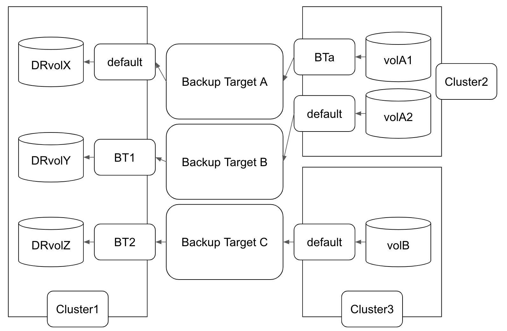

# Multiple Backup Targets Support

## Summary

The current Longhorn only supports a single backup target for all volumes. The feature aims to provide multiple backup targets.

### Related Issues

https://github.com/longhorn/longhorn/issues/2317
https://github.com/longhorn/longhorn/issues/5411

## Motivation

Users can choose backup targets to that they want to back up volumes by setting the backup target name of the volumes.

### Goals

- There are different backup targets at the same time on Longhorn.
- Backups can be synchronized from different remote backup targets.
- Snapshots of a volume can be backed up to a specific remote backup target according to the backup target name of the volume.
- A backup can be restored from its remote backup target to be a new volume.
- Separate default backup target related settings `backup-target`, `backup-target-credential-secret`, and `backupstore-poll-interval` from global settings into another category.

### Non-goals [optional]

- Backing up volumes to multiple backup targets concurrently is not a goal.

## Proposal

1. Allow users to create, delete or modify backup targets.
    - The backup target controller needs to synchronize the backups' information from the remote backup target and create `Backup` CR objects and `BackupVolume` CR objects in the cluster when the backup target is created.
    - When the backup target is deleted, backup target controller needs to delete the `Backup` CR and `BackupVolume` CR objects in the cluster related to the backup target, and backup data will be kept on the remote backup target.
2. Introduce a new field `BackupTarget` in `Status` of the `Backup` CRD to keep backup target information.
    - The field `BackupTarget:` is used to specify the backup target of the backup for the backup information from the `kubectl get` command and Longhorn RESTful APIs.
3. Introduce new fields `BackupVolume.Spec.BackupTargetName` and `BackupVolume.Spec.VolumeName` to keep information of the remote backup target and volume name.
    - Different backup targets might have volumes with the same names. The `BackupVolume` object name will be a randomly generated UUID with a prefix. It uses the `BackupTargetName` and `VolumeName` fields to specify the volume on the remote backup target.
4. Introduce new fields `BackupBackingImage.Spec.BackupTargetName` and `BackupBackingImage.Spec.BackingImage` to keep information of the remote backup target and backing image name.
    - Different backup targets might have backing images with the same names. The `BackupBackingImage` object name will be a randomly generated UUID with a prefix. It uses the `BackupTargetName` and `BackingImage` fields to specify the backing image on the remote backup target.
5. Introduce a new field `Volume.Spec.BackupTargetName` to mark the default backup target for storing the volume backups.
6. Not only the system backup will be handled by the default backup target but also the volumes without specifying the field `Spec.BackupTargetName`.
7. Support the parameter `backupTargetName` in the `StorageClass`.
8. Get default backup target related settings from the new `ConfigMap` `longhorn-default-backupstore` and remove them from the default settings.

### User Stories

#### Default Backup Target

The `default` backup target will be created automatically when a fresh installation, and it exists already when upgrading. If a volume doesn't have a specified backup target, the `default` backup target will be used.

The `default` backup target can not be deleted by users.

#### Create and Delete a new backup target

Users need to create/modify backup targets on the page `Setting/Backup Target` as `Setting/Backing Image` via the Longhorn UI or by the manifest. After backup targets are created and synchronized, users can start to create a backup on these remote backup targets.

Volume can not be created with specifying a non-existing or deleting backup target name. Users need to update the filed `Spec.BackupTargName` of the volumes manually after deleting the backup target. A warning or event should be shown if users try to delete a backup target still referenced by volumes or storage classes.

### User Experience In Detail

#### Modify `default` Backup Targets With Helm

The default backup target settings `backup-target`, `backup-target-credential-secret`, and `backupstore-poll-interval` will be moved to the new category `defaultBackupStoreSettings` from the category `defaultSettings` in the file `values.yaml`.

- `defaultBackupStoreSettings.backupTarget` is used as `defaultSetting.backupTarget` to set up the default backup target URL.
- `defaultBackupStoreSettings.backupTargetCredentialSecret` is used as `defaultSetting.backupTargetCredentialSecret` to set up the name of the default backup target secret.
- `defaultBackupStoreSettings.pollInterval` is used as `defaultSetting.backupstorePollInterval` to set up how long to check the default backup target status.

#### Create Or Modify Backup Targets By UI

1. There will be an empty default backup target created by Longhorn and users should set up the default backup target before creating a new backup target.
2. User can find the link `Backup Target` in drop down menu of `Setting`.
3. The page `Backup Target` would show backup target name, backup target URL, secret name (credential) for this backup target, poll interval, and availability status.
4. User can create a new backup target on the page `Backup Target` by clicking the button `Create`. User have to fill out the necessary item for the backup target name, and it can be optional for the backup target URL, secret name, and poll interval fields.
5. Users can modify a backup target information by clicking the button `Edit`.
6. Users can delete a backup target by clicking the button `Delete`.
7. Users can not create or modify a backup target with the `BackupTargetURL` that is the same to an existing backup target.
8. Users can not delete the default backup target directly.
9. Users can not modify the backup target name.
10. Users can not modify the `BackupTargetURL` of a backup target that is the same to another one in the cluster.

#### Create Or Modify Backup Targets By CLI

User can the bash command to create or modify a backup target such as below:

```bash
cat <<EOF >>new-backup-target.yaml
apiVersion: longhorn.io/v1beta2
kind: BackupTarget
metadata:
  name: azure-blob-server-001
  namespace: longhorn-system
spec:
  backupTargetURL: azblob://demo@core.windows.net/
  credentialSecret: azblob-secret
  pollInterval: 4m30s
EOF

kubectl apply -f new-backup-target.yaml
```

##### Backup Target Conditions

There is only one backup target condition and one reason now.

```golang
const (
	BackupTargetConditionTypeUnavailable = "Unavailable"
	BackupTargetConditionReasonUnavailable = "Unavailable"
)
```

The condition `BackupTargetConditionTypeUnavailable` will be set to true if the backup target URL is empty or if retrieving backup information from the remote backup target fails due to issues such as:

- Backup list command timeout.
- Invalid backup target URL.
- Invalid secret data for the backup target.
- Protocol version of the remote NFS server is not supported. Longhorn support NFSv4, NFSv4.1, and NFSv4.2 now.
- Permission of the remote data path, directory, bucket or container, is not allowed to read/write.
- The network is disconnected for a while.

#### Create A Backup To Remote Backup Targets By UI

After users click the button `Create Backup` on the `Volume Details` page, the backup will be stored on the remote backup target set in the `BackupTargetName` filed of the volume.

The backup volume will be created and displayed on the `Backup` page if it is the first backup of the volume.

On the `Backup` page, the backup targets are displayed first if one or more backup volumes exist. Clicking a backup target will expand or collapse the list to show the associated backup volumes.

#### Create A Backup To Remote Backup Targets By CLI

1. Create a snapshot of the volume.
2. Create a backup referring to store the snapshot by the manifest as below:

```yaml
apiVersion: longhorn.io/v1beta2
kind: Backup
metadata:
  labels:
    backup-volume: pvc-xxxxxxxx-9ab9-4055-9eb4-558999b09a11
  name: backup-test-001
  namespace: longhorn-system
spec:
  labels:
    longhorn.io/volume-access-mode: rwo
  snapshotName: xxxxxxxx-9a69-4ede-ab88-c9853459462c
```

3. The `status.backupTarget` field will be assigned to match the `spec.backupTargetName` field in the volume of the snapshot after the backup is completed.  
  The field `status.backupTarget` displays the backup target name in the column information of the backup when users run the `kubectl get` command, and populates the backup target name in the backup information returned by the Longhorn RESTful APIs.

#### Create A Backup To Remote Backup Targets By Recurring Jobs

It will store snapshots to the appointed backup target set in the `spec.backupTargetName` of the volume when the recurring job is running.

#### Restore From A Backup From A Remote Backup Target

Restoring from a backup will behave as before. Choose a backup and do the `Restore` operation in drop down menu on UI.

#### Create A Disaster Recovery Volume From A Remote Backup Target



Creating a DR volume can be from any backups of valid backup targets in the cluster. As the graph above, the DR volume `DRvolX` is created from the backup of the `default` backup target and the DR volume `DRvolY` can be from the backup of the backup target `BT1`.

If users want to create all DR volumes of the cluster 2 in the cluster 1, users need to create all backup targets that volumes of the cluster 2 using. If users only want to create a DR volume for the volume `volA2` in the cluster 2, user only need to create the backup target `BT1` in the cluster 1 and Longhorn will poll the incremental backups on the remote backup target B.

#### Create A Backup Of The Backing Image To Remote Backup Targets

Allow users to choose a backup target when creating a backup for a backing image. This behavior differs from the backup operation of a volume. The volume custom resource uses a fixed field, `Spec.BackupTargetName`, to determine the remote backup target when creating incremental backups. In contrast, a backing image typically has only one backup on the remote backup target, so it is unnecessary to include a `Spec.BackupTargetName` field for storing incremental backups of a backing image on the same backup target.

##### Create A Disaster Recovery Volume From A Remote Backup Target By UI

1. In the cluster A, make sure the original volume X has a backup created or has recurring backups scheduled.
2. In `Backup` page of cluster B, choose the backup volume X, then create disaster recovery volume Y.
3. Longhorn will automatically attach the DR volume Y to a random node. Then Longhorn will start polling for the last backup of volume X, and incrementally restore it to the volume Y.

### API changes

- Introduce new APIs `BackupTargetCreate`,`BackupTargetDelete`, `BackupTargetUpdate` and `BackupTargetGet`:

    | API | Input | Output | Comments | HTTP Endpoint |
    | --- | --- | --- | --- | --- |
    | Create | name, backupTargetURL, credentialSecret string, pollInterval time.Duration | err error | Create a new backup target and start to synchronize data | **POST** `/v1/backuptargets/` |
    | Delete | name string | err error | Remove a backup target and its related backup volume and backup CR objects in the cluster | **DELETE** `/v1/backuptargets/{backupTargetName}` |
    | Update | backupTargetURL, credentialSecret string, pollInterval time.Duration | err error | Update the backup targets information | **POST** `/v1/backuptargets/{backupTargetName}?action=backupTargetUpdate` |
    | Get    |  | backupTarget BackupTarget, err error | Get the backup targets information | **GET** `/v1/backuptargets/{backupTargetName}` |

- Modify the APIs `BackupVolumeGet`, `BackupVolumeList`:
  - Add a new field `BackupTargetName` and `VolumeName` in returning `BackupVolume` information for all backup targets that have this backup volume.
- Modify the APIs `BackupGet`:
  - Add a new field `BackupTargetName` in returning `Backup` information.
- Modify the API `SnapshotBackup`:
  - Add a new field `BackupTargetName` in the input `SnapshotInput` and returning `Backup` information.
- Modify the API `BackupBackingImageCreate`, `BackupBackingImageGet` and `BackupBackingImageList`:
  - Add new fields `BackingImage` and `BackupTargetName` in the input `BackupBackingImage`.

  ```golang
    type BackupBackingImage struct {
      client.Resource

      Name             string `json:"name"`
      BackingImage     string `json:"backingImage"`
      BackupTargetName string `json:"backupTargetName"`
      ...
    }
  ```

## Design

### Implementation Overview

#### Custom Resource Definitions

1. Modify the Backup CRD `backups.longhorn.io` to add a new field `BackupTarget` in `Status` for creating a backup. And add a label `LonghornLabelBackupTarget = "backup-target"` for resource listing and `OwnerReferences` for its corresponding backup volume.

  ```golang
  type BackupStatus struct {
    ...
    // The backup target name.
    BackupTarget string `json:"backupTarget"`
  }
  ```

  ```yaml
  metadata:
    labels:
      longhorn.io/backup-target: the backup target name (string)
      longhorn.io/backup-volume: the volume name (string)
    OwnerReferences: GetOwnerReferencesForBackupVolume(string),
    name: the backup name. (string)
  status:
    backupTarget: the backup target Name. (string)
    ...
  ```

2. Modify the Backup Volume CRD `backupvolumes.longhorn.io` to add new fields `BackupTargetName` and `VolumeName` in `Spec`, and add labels `LonghornLabelBackupTarget` and `LonghornLabelBackupVolume` for resource listing and `OwnerReferences` for its corresponding backup get.

  ```golang
    type BackupVolumeSpec struct {
      ...
      SyncRequestedAt metav1.Time `json:"syncRequestedAt"`
      // The backup target name that the backup volume was synced.
      BackupTargetName string `json:"backupTargetName"`
      // The volume name that the backup volume was used to backup.
      VolumeName string `json:"volumeName"`
    }
  ```

  ```yaml
  metadata:
    labels:
      longhorn.io/backup-target: the backup target name (string)
      longhorn.io/backup-volume: the volume name (string)
    OwnerReferences: GetOwnerReferencesForBackupTarget(string),
    name: the backup volume name. (string)
  spec:
    backupTargetName: the backup target Name. (string)
    volumeName: the volume name (string)
    ...
  ```

3. Modify the Backup Backing Image CRD `backupbackingimages.longhorn.io` to add new fields `BackingImage` and `BackupTargetName` in `Spec`, and add labels `LonghornLabelBackupTarget = "backup-target"` and `LonghornLabelBackingImage = "backing-image"`.

  ```golang
  type BackupBackingImageSpec struct {
    ...
    // The backing image name.
    BackingImage string `json:"backingImage"`
    // The backup target name.
    BackupTargetName string `json:"backupTargetName"`
  }
  ```

  ```yaml
  metadata:
    labels:
      longhorn.io/backing-image: the backing image name (string)
      longhorn.io/backup-target: the backup target name (string)
    name: the backup backing image name. (string)
  spec:
    backingImage: the backing image name (string)
    backupTargetName: the backup target Name. (string)
    ...
  ```

4. Modify the Volume CRD `volumes.longhorn.io` to add a new field `BackupTargetName` in `Spec` for a default backup target.

  ```golang
  type VolumeSpec struct {
    // The default backup target name when a backup is created from the volume.
    BackupTargetName int64 `json:"backupTargetName"`
  }
  ```

  ```yaml
  metadata:
    name: the volume name. (string)
  spec:
    backupTargetName: the backup target Name. (string)
  ```

  The `Spec.BackupTargetName` field will default to the backup target when a volume is created with an empty backup target name, and volume backups will be stored in the default backup target. If the `Spec.BackupTargetName` field is updated to a new backup target, subsequent backups will be stored in the new target.

#### Backup Related Controllers

- Modify the backup target controller to allow adding and deleting an extra backup target.
  - Create pulling backup volume CR objects with a random backup volume name, for example, `bv-xxxxxx-a12345-b12345-xxxxxx` and filling in the fields `Spec.BackupTargetName` and `Spec.VolumeName`, and corresponding labels from the backup target if it does not exist according to the fields `Spec.BackupTargetName` and `Spec.VolumeName`.
  - Create pulling backup backing images with a random backup volume name, for example, `bbi-xxxxxx-a12345-b12345-xxxxxx` from the backup target with filling in the fields `Spec.BackupTargetName` and `Spec.BackingImage`, and corresponding labels if not existing.
  - Remove a backup volume or backup backing image CR object if the corresponding backup target is deleting or the URL of the corresponding backup target is empty.
- Modify the backup volume controller to tell the backup volume belongs to which backup target and synchronize the backups of the backup volume from remote backup target.
  - Create pulling backups from the backup target with the field `Status.BackupTarget` of the backup target.
  - Clean up backup CR objects in the cluster by the volume name and backup target name when deleting a backup volume or the backup target URL is empty.
- Modify backup backing image controller
  - Start backing up a backing image with the given backup target name.

#### Delete An Extra Backup Target

- Deleting the `default` backup target is not allowed.
- When DR volumes exist, deleting any backup target is not allowed.
- When deleting a backup target is allowed, the backup volumes and backups associated with this target will be cleaned up (the remote backup data will remain stored). This will not affect backup volumes and backups of other backup targets.
  - Volumes where the `Spec.BackupTargetName` field matches the name of the deleted backup target will retain their original value, but creating a new backup will fail.

#### Handle Backup Target URL Changed

The behavior will be the same as current implementation.

- When an extra backup target URL is valid, the backup target controller will synchronize backup volumes and backups information from the remote backup target to the cluster.
- When emptying the extra backup target URL, the backup target controller will clean up backup volumes and backups information in the cluster. This will not affect backup volumes and backups of other backup targets.
- When an extra backup target URL is modified from a valid URL to an invalid URL, the backup target controller will set this backup target unavailable and unavailable reason in the `Status.Condition`, and skip the synchronization with the remote backup target. Backup volumes and backups synchronized from the previous valid URL will not be cleaned up.

#### Add A New Category For Default Backup Settings

1. Separate the default backup related settings from default settings into the new category in Helm `values.yaml` file:

```yaml
defaultBackupStoreSettings:
  # -- Endpoint used to access the default backupstore. (Options: "NFS", "CIFS", "AWS", "GCP", "AZURE")
  backupTarget: ~
  # -- Name of the Kubernetes secret associated with the default backup target.
  backupTargetCredentialSecret: ~
  # -- Number of seconds that Longhorn waits before checking the default backupstore for new backups. The default value is "300". When the value is "0", polling is disabled.
  pollInterval: ~
```

2. Create a new `ConfigMap` `default-backupstore.yaml` to store these settings in Helm chart:

```yaml
apiVersion: v1
kind: ConfigMap
metadata:
  name: longhorn-default-backupstore
  namespace: {{ include "release_namespace" . }}
  labels: {{- include "longhorn.labels" . | nindent 4 }}
data:
  default-backupstore.yaml: |-
    {{- if not (kindIs "invalid" .Values.defaultBackupStore.backupTarget) }}
    backup-target: {{ .Values.defaultBackupStore.backupTarget }}
    {{- end }}
    {{- if not (kindIs "invalid" .Values.defaultBackupStore.backupTargetCredentialSecret) }}
    backup-target-credential-secret: {{ .Values.defaultBackupStore.backupTargetCredentialSecret }}
    {{- end }}
    {{- if not (kindIs "invalid" .Values.defaultBackupStore.pollInterval) }}
    backupstore-poll-interval: {{ .Values.defaultBackupStore.pollInterval }}
    {{- end }}
```

3. The Kubernetes `ConfigMap` controller will monitor the `ConfigMap` `longhorn-default-backupstore` and update the default backup target if settings are modified.

```go
func (kc *KubernetesConfigMapController) reconcile(namespace, cfmName string) error {
  ...
  case types.DefaultDefaultSettingConfigMapName:
    if err := kc.ds.UpdateCustomizedSettings(nil); err != nil {
      return errors.Wrap(err, "failed to update built-in settings with customized values")
    }
  case types.DefaultDefaultBackupStoreConfigMapName:
    if err := kc.ds.CreateOrUpdateDefaultBackupStore(); err != nil {
      return errors.Wrap(err, "failed to crerate or update default backup target with customized values")
    }
  }
}
```

#### Uninstallation

When uninstalling Longhorn:

  1. Empty the URL of all backup targets to safely clean up backup volume and backup custom resources in the cluster.
  2. Delete all backup target custom resources in the cluster.

### Validating And Mutating Webhook

- If the `Spec.BackupTargetName` field of the Volume CR object is empty, populate it with the default backup target name.
- The volume validator will check if the backup target exists after the volume is created or the field `Spec.BackupTargetName` is updated.

### Test plan

#### Update The Default Backup Target

1. Install with Helm.
2. Update the default backup setting `defaultBackupStore.backupTarget` with a valid URL of a remote backup target.
3. Update the default backup setting `defaultBackupStore.backupTargetCredentialSecret` if needed.
4. Check if the default backup target is available.
5. Update the default backup setting `defaultBackupStore.pollInterval` and it succeeds.

#### Create A Volume By A Storage Class For The Parameter `backupTargetName`

1. Create a Storage Class A without the parameter `backupTargetName`.
2. Create a volume A with the Storage Class A successfully and the field `spec.backupTargetName` of volume A is `default`.
3. Create a Storage Class B with the parameter `backupTargetName: backupTargetB` (the backup target B exists.)
4. Create a volume B with the Storage Class B successfully and the field `spec.backupTargetName` of volume B is `backupTargetB`.
5. Create a Storage Class C with the parameter `backupTargetName: backupTargetC` (the backup target C does not exist.)
6. Creating a volume C is not allowed.
7. Create a volume D with the field `spec.backupTargetName` is `backupTargetB`.
8. Create a volume D successfully and the field `spec.backupTargetName` of volume D is `backupTargetB`.

#### Create And Restore A Backup

1. Set up the default backup target.
2. Create a backup to the default backup target, and it succeeds.
3. Create an extra backup target A which has existing backups.
4. Backups of the default backup target will not be deleted.
5. Existing backups on the extra backup target A can be synchronized back to the cluster.
6. Create a backup to extra backup target A (by setting the `Spec.BackupTargetName` field in the volume first), and it succeeds.
7. Restore a backup from the default backup target, and it succeeds and data is correct.
8. Restore a backup from the extra backup target A, and it succeeds and data is correct.

#### Create And Restore A Backing Image

1. Set up the default backup target and create an extra backup target A.
2. Create a backing image.
3. Create a backup of the backing image to the default backup target, and it succeeds.
4. Create a backup of the backing image to extra backup target A, and it succeeds.
5. Restore the backup of the backing image from the default backup target, and it succeeds and data is correct.
6. Restore the backup of the backing image from the extra backup target A, and it succeeds and data is correct.

#### Create A DR Volume

1. Prepare two clusters A and B with Longhorn installed.
2. Set up the default backup target of two clusters with the same remote backup target.
3. Create the volume A and create a backup of the volume A in the cluster A.
4. In the cluster B, create a DR volume after the backup A is synchronized.
5. Write data to the volume A and create a new backup B in the cluster A.
6. Modifying/Deleting the default backup target URL is not allowed.
7. Check if the DR volume will synchronize the data in the cluster B.

#### Create A DR Volume Through Another Backup Target

1. Prepare two clusters A and B with Longhorn installed.
2. Set up an extra backup target BT of two clusters with the same remote backup target.
3. Create the volume A and create a backup of the volume A in the cluster A.
4. In the cluster B, create a DR volume after the backup A is synchronized.
5. Write data to the volume A and create a new backup B in the cluster A.
6. Modifying/Deleting the default backup target URL is not allowed.
7. Check if the DR volume will synchronize the data in the cluster B.

#### Create And Restore A System Backup

1. Set up the default backup target and an extra backup target A.
2. Create a volume A with the default backup target name and a volume B with the extra backup target name A.
3. Write some data to volume A and volume B.
4. Create a system backup, and it succeeds. (the system backup and the volume A is stored on the default backup target, and the volume B is stored on the backup target A)
5. Delete the backup target A.
6. Restore the system backup, and it succeeds.
7. The backup target A should be restored.

#### Modify The Backup Target URL

1. Set up the default backup target and add an extra backup target A which has existing backups.
2. Existing backups on the extra backup target A can be synchronized back to the cluster.
3. Modify the extra backup target A URL to another valid URL of backup target B and related backup volume and backup custom resources will be synchronized correctly from the remote backup target B.
4. Modify the extra backup target A URL to an invalid URL.
5. The extra backup target A become unavailable and synchronization will be skipped. (related backup volume and backup custom resources of the backup target B will not be cleaned up.)
6. Empty the extra backup target A URL and related backup volume and backup custom resources of the backup target B will be cleaned up.
7. Backup volume and backup custom resources of the default backup target will not be affected.

#### Delete A Backup Target

1. Set up the default backup target and add an extra backup target B which has existing backups.
2. Deleting the default backup target is not allowed.
3. Existing backups on the extra backup target B can be synchronized back to the cluster.
4. Create a backup to the default backup target, and it succeeds.
5. Create a backup to extra backup target B (by setting the `Spec.BackupTargetName` field in the volume first), and it succeeds.
6. Delete the extra backup target and related backup volume and backup custom resources will be cleaned up.
7. Backup volume and backup custom resources of the default backup target will not be affected.
8. Add the extra backup target back and related backup volume and backup custom resources will be synchronized correctly.

#### Uninstall

1. Set up the default backup target and an extra backup target A.
2. Create a volume A with the default backup target name and a volume B with the extra backup target name A.
3. Create backups for the volume A and B and wait for backups completion.
4. Uninstall Longhorn
5. URLs of backup targets are empty successfully.
6. Backup targets are deleted successfully.
7. Uninstall successfully.

### Upgrade strategy

The `default` backup target will not be deleted on old versions Longhorn

- Fill in the field `Status.BackupTarget` for existing Backup CR objects and labels with corresponding values of the `default` backup target.
- Fill in the fields `Spec.BackupTargetName` and `Spec.VolumeName` and labels for existing `BackupVolume` CR objects with corresponding values of the `default` backup target and volume.
- Fill in the fields `Spec.BackupTargetName` and `Spec.BackingImage` and labels for existing `BackupBackingImage` CR objects with corresponding values of the `default` backup target and backing image.
- Fill in the fields `Spec.BackupTargetName` for existing `Volume` CR objects with corresponding values of the `default` backup target.

## Note [optional]

`None`
