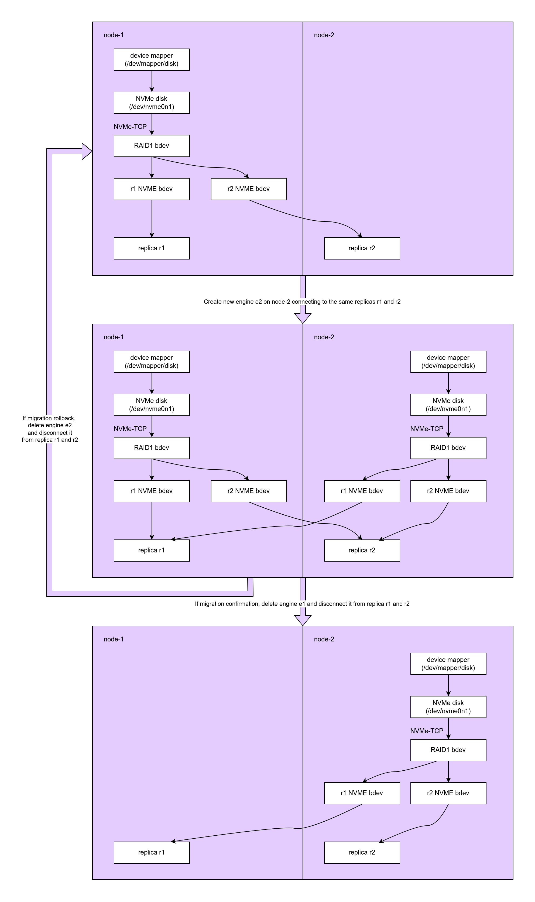
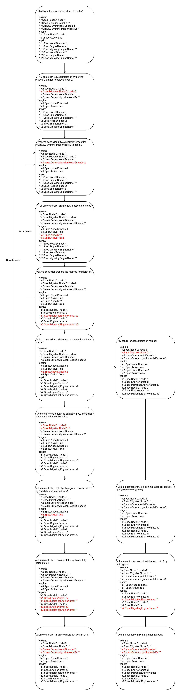

# V2 Volume Live Migration

## Summary

Implement live migration feature for volume with v2 data engine 

### Related Issues

https://github.com/longhorn/longhorn/issues/6361

## Motivation

### Goals

1. Implement live migration feature for volume with v2 data engine similar to live migration feature for volume with v1 data engine.
2. Make sure we can handle disaster test cases during live migration

## Proposal

### User Stories

Live migration for v2 is needed for Harvester VM live migration feature

### User Experience In Detail

From the user's perspective, the experience will be very similar to live migration feature in v1 volume

First, user create SC with `migratable` set to `true` and `dataEngine` set to `v2`
```yaml
kind: StorageClass
apiVersion: storage.k8s.io/v1
metadata:
  name: longhorn-v2-migratable
provisioner: driver.longhorn.io
allowVolumeExpansion: true
parameters:
  numberOfReplicas: "1"
  staleReplicaTimeout: "2880" # 48 hours in minutes
  dataEngine: "v2"
  migratable: "true"
```
Then user create PVC from the SC with `accessModes` as `ReadWriteMany` and `volumeMode` as `Block`
```yaml
apiVersion: v1
kind: PersistentVolumeClaim
metadata:
  name: longhorn-block-vol
  namespace: default
spec:
  accessModes:
    - ReadWriteMany
  volumeMode: Block
  storageClassName: longhorn-v2-migratable
  resources:
    requests:
      storage: 2Gi
```
Then user deploy a pod using the PVC
```yaml
apiVersion: v1
kind: Pod
metadata:
  name: pod-1
  namespace: default
spec:
  nodeName: node-1
  containers:
    - name: block-volume-test
      image: ubuntu:xenial
      imagePullPolicy: IfNotPresent
      command: ["sleep", "36000"]
      volumeDevices:
        - devicePath: /dev/longhorn/testblk
          name: block-vol
  volumes:
    - name: block-vol
      persistentVolumeClaim:
        claimName: longhorn-block-vol
```
If the user want to migrate the pod to node-2, they can deploy an identical pod on node-2 using the same PVC
```yaml
apiVersion: v1
kind: Pod
metadata:
  name: pod-2
  namespace: default
spec:
  nodeName: node-2
  containers:
    - name: block-volume-test
      image: ubuntu:xenial
      imagePullPolicy: IfNotPresent
      command: ["sleep", "36000"]
      volumeDevices:
        - devicePath: /dev/longhorn/testblk
          name: block-vol
  volumes:
    - name: block-vol
      persistentVolumeClaim:
        claimName: longhorn-block-vol
```
Longhorn will expose the volume to both node-1 and node-2.
1. User then can do operation like flush/pausing IO on pod-1 and delete pod-1. 
   This would mean migration confirmation. 
   Longhorn would then detach the volume from node-1. 
   The volume become solely attached to node-2.
2. User can also delete the pod-2.
   This would mean migration rollback
   Longhorn would then detach the volume from node-2.
   The volume become solely attached to node-1. 


### API changes

Adding a new field `MigratingEngineName` to the replica CR
```go
// ReplicaSpec defines the desired state of the Longhorn replica
type ReplicaSpec struct {
	InstanceSpec `json:""`
	// +optional
	EngineName string `json:"engineName"`
	// +optional
	// MigratingEngineName is indicating the migrating engine which current connected to this replica. This is only
	// used for live migration of v2 data engine
	MigratingEngineName string `json:"migratingEngineName"`
```
This field is used to indicating which engine the replica is migrating to. This will be explained in more details in the section [Implementation Overview](#implementation-overview).

## Design

### Implementation Overview

In v1 volume live migration, the flow was:
1. Assume that volume has engine e1 with replica r1 and r2
1. Create a new inactive engine e2 on node2
1. Create inactive replicas r1' and r2' that match spec of r1 and r2. 
   r1' is accessing same replica folder as r1.
   r2' is accessing same replica folder as r2
1. Start replica r1' and r2'
1. Start engine e2 with replica r1' and r2'
1. Now migration is ready. User can either do migration confirmation or migration rollback 
1. If user does migration confirmation:
   1. Longhorn delete e1
   1. Active e2
   1. Active r1' and r2'
   1. Deactivate r1 and r2
1. If user does migration rollback:
    1. Longhorn delete e2
    1. Delete r1' and r2'

The reason, we have to create new inactive replicas r1' and r2' is because v1 replica is designed to be connected to a single engine at time.
However, it seems that v2 replica can be connected by multiple engine at a time.
More over, creating and matching new inactive replicas in v1 live migration seems a bit complicated especially when it comes to handle migration revert.
Therefore, I decided to not creating new inactive replicas in v2 live migration. 
The flow would be like this:



Detailed state transitions:


### Test plan

Test cases:
1. Migration confirmation
1. Migration rollback
1. Engine crash during migration
   1. Original engine crash
   1. Migrating engine crash
1. Replica crash during live migration:
   1. Some replicas crash
   1. All replicas crash: failed
1. Run all e2e migration test cases

More details are at https://github.com/longhorn/longhorn/issues/6361#issuecomment-2537547340

### Upgrade strategy

No upgrade strategy is needed 

