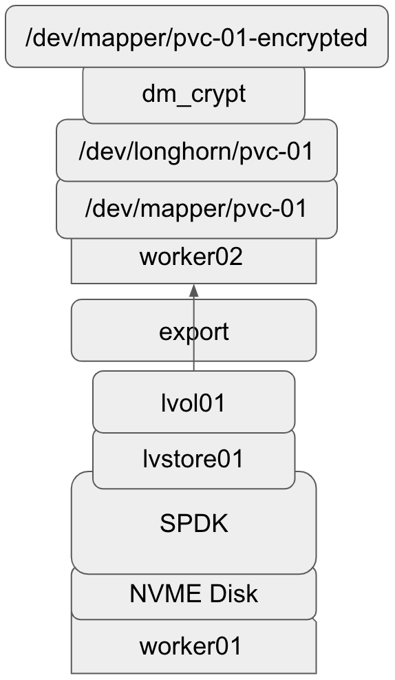

# V2 Volume Encryption

## Summary

This enhancement adds support for user configured (storage class, secrets) encrypted v2 volumes.

### Related Issues

- https://github.com/longhorn/longhorn/issues/7355

## Motivation

### Goals

- User is able to create and use an encrypted v2 volume with cipher customization options only via CSI.

## Proposal

There are two candidates for the v2 volume encryption.

1. The `dm_crypt` kernel module (Linux kernel device-mapper crypto target) as the v1 volume encryption.  
  Device-Mapper’s “crypt” target provides transparent encryption of block devices using the kernel crypto API.

2. The SPDK [Crypto Virtual Bdev Module](https://spdk.io/doc/bdev.html).  
  The SPDK has the crypto virtual bdev module to provide at rest data encryption for any underlying bdev. The module relies on the `SPDK Accel Framework` to provide all cryptographic functionality.

Benchmark information:

- Equinix metal machine: m3.large.x86
  - CPU: 1 x AMD EPYC 7502P and 32 cores @ 2.50GHz
  - Memory: 256 GB
  - Test Disks: 2 x 3.8 TB NVMe
  - NICs: 2 x 25 Gbps
- Volume size: 50 GiB
  - Replicas for the volume: 2

| [SPDK Crypto Virtual Module](https://spdk.io/doc/bdev.html) / CBC | Sequential | Random |
| --------------------------------: | :-------------------: | :-------------------: |
| IOPS (Read/Write)                 | 240,125 / 235,990     | 239,201 / 236,695     |
| Bandwidth in KiB/sec (Read/Write) | 2,022,358 / 1,478,101 | 1,990,292 / 1,420,072 |
| Latency in ns (Read/Write)        | 165,033 / 161,666     | 164,378 / 162,669     |

| `dm_crypt` kernel module / CBC    | Sequential            | Random                |
| --------------------------------: | :-------------------: | :-------------------: |
| IOPS (Read/Write)                 | 332,107 / 226,378     | 332,758 / 61,755      |
| Bandwidth in KiB/sec (Read/Write) | 4,866,733 / 1,878,130 | 4,838,664 / 1,947,787 |
| Latency in ns (Read/Write)        | 169,440 / 270,217     | 169,967 / 271,265     |

The performance discrepancy between an encrypted SPDK device using the `dm_crypt` kernel module and SPDK's native crypto virtual bdev nodule.

- Kernel space and user space:
  - The `dm_crypt` module operates entirely in the Linux kernel space
  - For the crypto virtual bdev nodule, the processing might happen in user space, which can introduce additional memory copying and context switching when compared to kernel space encryption.
- Hardware acceleration:
  - The `dm_crypt` module leverages hardware encryption acceleration features provided by the CPU or dedicated hardware that Linux kernel can use.
  - While SPDK supports hardware acceleration, it requires explicit configuration to utilize a hardware-based cryptographic device (e.g., `Intel QuickAssist` or DPDK-supported accelerators)

Based on the benchmark comparison between the [SPDK Crypto Virtual Module](https://spdk.io/doc/bdev.html) and the `dm_crypt` kernel module,
v2 volume encryption will utilize the `dm_crypt` kernel module for encrypting the v2 volumes.

### User Stories

All regular longhorn operations should also be supported for encrypted v2 volumes,
therefore the only user story that is mentioned is how to create and use an encrypted v2 volume.

#### Create And Use An Encrypted V2 Volume

- Create a storage class with (encrypted=true and dataEngine=v2) and either a global secret or a per volume secret.
- Create the secret for that volume in the configured namespace with customization options of the cipher for instance `cipher`, `key-size` and `hash`.
- Create a PVC that references the created storage class.
- A v2 volume will be created then encrypted during first use.
- Afterwards a regular filesystem that lives on top of the encrypted volume or the raw block volume will be exposed to the pod.

### User Experience In Detail

Creation and usage of an encrypted v2 volume requires:

- The encrypted v2 volumes only support CSI as encrypted v1 volumes.
- The storage class needs to specify `encrypted: "true"` and `dataEngine: "v2"` as part of its parameters.
- Secrets need to be created and reference for the CSI operations need to be setup.

#### Create Storage Class With A Global Secret

The storage class uses a global secret named `longhorn-crypto` in the `longhorn-system` namespace.

```yaml
kind: StorageClass
apiVersion: storage.k8s.io/v1
metadata:
  name: longhorn-crypto-global
provisioner: driver.longhorn.io
allowVolumeExpansion: true
parameters:
  numberOfReplicas: "3"
  staleReplicaTimeout: "2880" # 48 hours in minutes
  ...
  encrypted: "true"
  dataEngine: "v2"
  csi.storage.k8s.io/provisioner-secret-name: "longhorn-crypto"
  csi.storage.k8s.io/provisioner-secret-namespace: "longhorn-system"
  csi.storage.k8s.io/node-publish-secret-name: "longhorn-crypto"
  csi.storage.k8s.io/node-publish-secret-namespace: "longhorn-system"
  csi.storage.k8s.io/node-expand-secret-name: "longhorn-crypto"
  csi.storage.k8s.io/node-expand-secret-namespace: "longhorn-system"
```

## Design

### Implementation Overview

Host requires `dm_crypt` kernel module as well as `cryptsetup` installed as the v1 volume requirement.

- Utilize host `dm_crypt` kernel module for device encryption.
- Utilize host installed `cryptsetup` for configuration of the crypto device.
- CSI flows `NodeStageVolume`, `NodeUnstageVolume`, `NodePublishVolume` and `NodeExpandVolume` will operate as the v1 volume does.
- During CSI `NodeStageVolume` encrypts the regular longhorn device (/dev/longhorn/[volume-name]).
  - It exposes a crypto mapped device (/dev/mapper/[volume-name]-encrypted).
  Since the v2 volume will use the device mapper to control I/O and the `dm` device name will match the volume name, we add the suffix `-encrypted` to the encrypted `dm` device in the `/dev/mapper/` directory to resolve the naming conflict, as illustrated in the stack graph below.



### Test plan

#### Create An Encrypted V2 Volume And Verify Encryption of Volume

- Create the secret for that volume in the configured namespace
- Create a storage class with (encrypted=true and dataEngine=v2) and either a global secret.
- Create a PVC that references the created storage class
- Create a pod that uses that PVC for a volume mount
- Wait for pod up and healthy
- Write the known test pattern into the file system
- Verify absence of the known test pattern after directly reading block device content `/dev/longhorn/[volume-name]`

#### Create An Encrypted V2 Volume With The Customized Cipher

- Create the secret with customized options of the cipher for that volume in the configured namespace
- Create a storage class with (encrypted=true and dataEngine=v2) and either a global secret.
- Create a PVC that references the created storage class
- Create a pod that uses that PVC for a volume mount
- Wait for pod up and healthy
- Check if the customized cipher are correct
