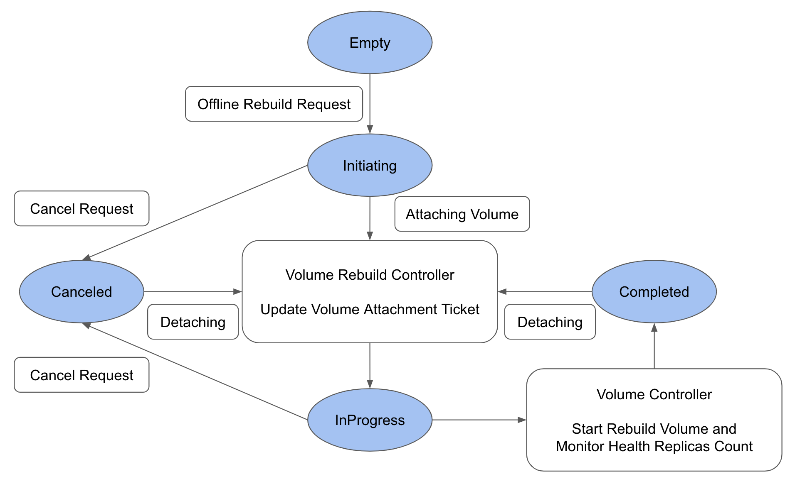

# Volume Offline Rebuilding

## Summary

This enhancement adds support for offline replica rebuild functionality for Longhorn volumes. It will allow rebuilding replicas while the volume is detached, enhancing the volume availability and reliability.

### Related Issues

- https://github.com/longhorn/longhorn/issues/8443

## Motivation

### Goals

- User can perform volume rebuilding when volumes are detached.
- User can cancel the offline replica rebuild process.

## Proposal

### User Stories

- Users want to rebuild replicas while the volume is offline to ensure maintain data redundancy.
- Users want to start a workload with the volume when the volume is in offline replica rebuild process.

### User Experience In Detail

#### Trigger Volume Offline Rebuilding

When users want to rebuild a volume detached:

- By the Longhorn UI
  1. Access the Longhorn UI and navigate to the `Volume` page.
  2. Select the volume that needs offline replica rebuilding.
  3. Click on the `Operation` dropdown and choose `Offline Replica Rebuild`.
  4. The rebuilding volume process will be triggered, and the volume will be attached.
  5. After all replicas are health, the volume will be detached.

#### The CSI Attach Request During Volume Offline Rebuilding

When the offline rebuilding process is triggered or in progress:

1. Users try to start the workload with the Longhorn volume that is in offline rebuilding process.
2. The CSI attaching volume request is received, and the offline rebuilding process will be canceled and return an error.
3. After the offline rebuilding process is canceled, the volume will be detached.
4. The CSI attaching volume request will be received again, and the volume will be attached to the request node.

### API changes

Introduce new volume Action APIs `offlineRebuild` and `cancelOfflineRebuild`, and a new field `Volume.Status.OfflineRebuildState`:

  | API | Input | Output | Comments | HTTP Endpoint |
  | --- | --- | --- | --- | --- |
  | Update | N/A | err error | Trigger volume offline rebuilding | **POST** `/v1/volumes/{VolumeName}?action=offlineRebuild` |
  | Update | N/A | err error | Cancel volume offline rebuilding | **POST** `/v1/volumes/{VolumeName}?action=cancelOfflineRebuild` |

```golang
  type OfflineRebuildState string

  const (
    OfflineRebuildStateEmpty      = OfflineRebuildState("")
    OfflineRebuildStateInitiating = OfflineRebuildState("initiating")
    OfflineRebuildStateInprogress = OfflineRebuildState("inprogress")
    OfflineRebuildStateCanceled   = OfflineRebuildState("canceled")
    OfflineRebuildStateCompleted  = OfflineRebuildState("completed")
    OfflineRebuildStateFailed     = OfflineRebuildState("failed")
  )
  type VolumeStatus struct {
    ...
    // +optional
    ShareState ShareManagerState `json:"shareState"`
    // +optional
    OfflineRebuildState OfflineRebuildState `json:"offlineRebuildState"`
  }
```

## Design

### Implementation Overview

The offline replica rebuild process involves the following steps:

1. Identify replicas needed to rebuild in the detached volume.
2. Initiate the rebuild process and the volume rebuild controller will update the volume attachment ticket for attaching the volume.
3. The rebuilding process will be started automatically by the volume controller.
4. If the rebuilt replicas are healthy, detach the volume and the process is done.



### Test plan

- The replica count is less than the number of replicas in the `Volume.Spec`:
  1. Create a volume with 3 replicas in a 3 worker nodes cluster and write some data to the volume.
  2. Detach the volume.
  3. Delete a replica of the volume.
  4. Trigger the offline rebuilding by the API `volume.offlineRebuild`.
  5. Wait for the volume detached.
  6. Check if the replica count of the volume is as the number of replicas in the `Volume.Spec`.
  7. Check if the `volume.Status.OfflineRebuildState` is `completed`.

### Upgrade strategy

No upgrade strategy is needed.
