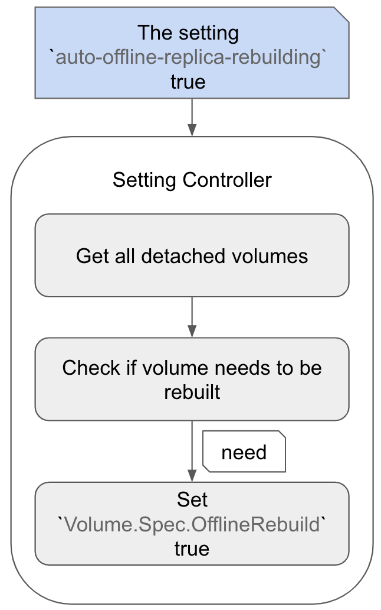
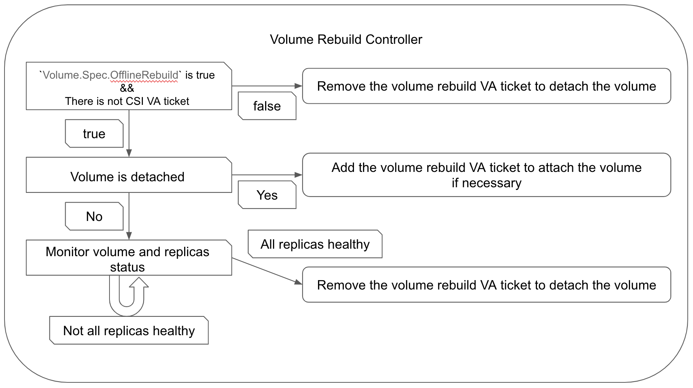

# Volume Offline Rebuilding

## Summary

This enhancement adds support for offline replica rebuild functionality for Longhorn volumes. It will allow rebuilding replicas while the volume is detached, enhancing the volume availability and reliability.

### Related Issues

- https://github.com/longhorn/longhorn/issues/8443

## Motivation

### Goals

- Longhorn can automatically perform volume offline rebuilding when volumes are detached by enabling the global setting `offline-replica-rebuilding`.
- Users can manually trigger volume offline rebuilding when an individual volume is detached by the API or the `kubectl` command.
- Users can manually cancel the offline replica rebuilding process for an individual volume.

## Proposal

### API changes

Introduce new volume Action APIs `offlineRebuilding` and `cancelOfflineRebuilding`, and a new field `Volume.Spec.OfflineRebuild`:

  | API | Input | Output | Comments | HTTP Endpoint |
  | --- | --- | --- | --- | --- |
  | Update | N/A | err error | Trigger volume offline rebuilding | **POST** `/v1/volumes/{VolumeName}?action=offlineRebuilding` |
  | Update | N/A | err error | Cancel volume offline rebuilding | **POST** `/v1/volumes/{VolumeName}?action=cancelOfflineRebuilding` |

```golang
type VolumeSpec struct {
  ...
  // The backup target name that the volume will be backed up to or is synced.
  // +optional
  BackupTargetName string `json:"backupTargetName"`
  // The flag that trigger the offline replica rebuilding when volume is detached.
  // +optional
  OfflineRebuild bool `json:"offlineRebuild"`
}
```

### User Stories

- Users want to automatically or manually trigger replica rebuilding while a volume is offline to ensure maintain data redundancy.
- Users want to start a workload with the volume when the volume is in offline replica rebuild process.
- The offline rebuilding process will still work after the cluster goes down and comes back up.
- A worker node is down during the offline rebuilding process.

### User Experience In Detail

#### Trigger An Individual Volume Offline Rebuilding

When users want to rebuild a volume detached:

- By the Longhorn UI
  1. Access the Longhorn UI and navigate to the `Volume` page.
  2. Select the volume that needs offline replica rebuilding.
  3. Click on the `Operation` dropdown and choose `Offline Replica Rebuild`.
  4. The rebuilding volume process will be triggered, and the volume will be attached.
  5. After all replicas are healthy, the volume will be detached.

- By `kubectl` command:
  1. Use the command `kubectl -n longhorn-system edit volume [volume-name]`
  2. Set the field `Volume.spec.offlineRebuild` to `true`.
  3. The field `Volume.spec.offlineRebuild` will be back to `false` after rebuilding is done.

  ```yaml
  apiVersion: longhorn.io/v1beta2
  kind: Volume
  metadata:
    ...
    name: [volume-name]
    namespace: longhorn-system
    ...
  spec:
    ...
    numberOfReplicas: 3
    offlineRebuild: true
    replicaAutoBalance: ignored
    ...
  ```

  3. The rebuilding volume process will be triggered, and the volume will be attached.
  4. After all replicas are healthy, the volume will be detached.

#### Trigger Volumes Offline Rebuilding

When users want to rebuild volumes detached:

- By the Longhorn UI
  1. Access the Longhorn UI and navigate to the `Setting` > `General` page.
  2. Check the setting `Offline Replica Rebuilding`.
  3. Click the bottom `Save` button.

- By `kubectl` command:

  ```shell
  kubectl -n longhorn patch setting offline-replica-rebuilding --type=merge -p '{"value": "true"}'
  ```

#### The CSI Attach Request During Volume Offline Rebuilding

When the offline rebuilding process is triggered or in progress:

1. Users try to start the workload with the Longhorn volume that is in offline rebuilding process.
2. When The CSI attaching volume request is received and the CSI VA ticket is created, the volume rebuild VA ticket will be preempted by the CSI VA ticket.
3. The offline rebuilding process will be canceled because the volume rebuild VA ticket is preempted.
4. After the offline rebuilding process is canceled, the volume will be detached.
5. The volume will be attached to the request node for the CSI VA ticket.
6. The workload can start to use the volume after the volume attachment.

#### Cluster Goes Down And Comes Back Up During Volume Offline Rebuilding

Users should be aware that the rebuilding process will restart if it does not finish before the cluster goes down.

#### A Worker Node Down During Volume Offline Rebuilding

The offline rebuilding will continue until healthy replicas equals to the number of ready worker nodes, as long as it is less than `Volume.Spec.NumberOfReplica`.

#### Volume Becomes Faulted During Offline Rebuilding

- The rebuilding process will be canceled.
- Users need to resolve the issues causing the volume to be faulted before initiating a salvage.

## Design

### Implementation Overview

The volume rebuild VA ticket example:

```yaml
apiVersion: longhorn.io/v1beta2
kind: VolumeAttachment
...
spec:
  attachmentTickets:
    volume-rebuilding-controller-[volume-name]:
      generation: 0
      id: volume-rebuilding-controller-[volume-name]
      nodeID: workerNode01
      parameters:
        disableFrontend: any
      type: volume-rebuilding-controller
  volume: [volume-name]
status:
  ...
```

The offline replica rebuild process involves the following steps:

- The global setting `offline-replica-rebuilding` is `true`:
  1. Identify replicas needed to rebuild in the detached volumes in the setting controller.
  2. The field `Spec.OfflineRebuild` of the volume will be set to `true` by the setting controller if it needs to be rebuilt.
  3. The volume rebuild controller will create the VA ticket for attaching the volume that `Spec.OfflineRebuild` is `true`.
  4. The rebuilding process will be started automatically by the volume controller.
  5. The volume rebuild controller will check the volume and replicas of the volume status when the volume is updated.
  6. If the rebuilt replicas are healthy (healthy replica count is equal to `Volume.Spec.NumberOfReplica` or healthy replica count is equal to ready worker nodes if it is less than `Volume.Spec.NumberOfReplica`), the volume rebuild controller will remove the volume rebuild VA ticket to detach the volume and the process is done.
  7. The volume rebuild controller will set `Spec.OfflineRebuild` to `false`.  
    

- The field `Spec.OfflineRebuild` of the detached volume is set to `true` by the Longhorn UI, API or `kubectl` command:
  1. The volume rebuild controller will create the VA ticket for attaching the volume if rebuilding is necessary.
  2. The rebuilding process will be started automatically by the volume controller.
  3. The volume rebuild controller will check the volume and replicas of the volume status when the volume is updated.
  4. If the rebuilt replicas are healthy (healthy replica count is equal to `Volume.Spec.NumberOfReplica` or healthy replica count is equal to ready worker nodes if it is less than `Volume.Spec.NumberOfReplica`), the volume rebuild controller will remove the volume rebuild VA ticket to detach the volume and the process is done.
  5. The volume rebuild controller will set `Spec.OfflineRebuild` to `false`.  


- The CSI attach request during volume offline rebuilding
  1. When The CSI attaching volume request is received and the CSI VA ticket is created, the volume rebuild VA ticket will be preempted by the CSI VA ticket by the volume attachment controller.
  2. The volume rebuild controller will remove the volume rebuild VA ticket if there is a CSI VA ticket.
  3. The volume rebuild controller will record the cancellation of the volume offline rebuilding.
  4. The volume will be detached when the volume rebuild VA ticket is removed, then the volume will be attached for the CSI VA ticket.
  5. Make an event or logs in the controller to notice users the rebuilding is canceled.

- Handle the cluster goes down and comes back up during offline rebuilding
  - The setting controller will examine all settings again when the cluster comes back up and if the `offline-replica-rebuilding` setting is `true`, identify detached volumes that need to be rebuilt (set `Volume.Spec.OfflineRebuild` to `true` by the setting controller).
  - The volume rebuild controller will examine all volumes:
    - If `Volume.Spec.OfflineRebuild` is `false`, remove the volume rebuild VA ticket for the volume.
    - If `Volume.Spec.OfflineRebuild` is `true` and there is no CSI VA ticket:
      - Add the volume rebuild VA ticket of the volume if it does not exist.
      - Monitor the volume rebuilding status if the volume rebuild VA ticket exists.

- The volume becomes faulted during offline rebuilding
  - The volume rebuild controller will remove the volume rebuild VA ticket and set `Volume.Spec.OfflineRebuild` to false for stopping the rebuilding process.
  - The volume rebuild controller will record the cancellation of the volume offline rebuilding.
  - Make an event or logs in the controller to notice users the rebuilding is canceled.

### Test plan

- The replica count is less than the number of replicas in the `Volume.Spec`:
  - Set the field `Volume.Spec.OfflineRebuild` to `true`
    1. Create a volume with 3 replicas in a 3 worker nodes cluster and write some data to the volume.
    2. Detach the volume.
    3. Delete a replica of the volume.
    4. Trigger the offline rebuilding by the API `volume.offlineRebuilding`.
    5. Wait for the volume detached.
    6. Check if the replica count of the volume is as the number of replicas in the `Volume.Spec`.
    7. Check if the `Volume.Spec.OfflineRebuild` is `false`.

  - Set the global setting `offline-replica-rebuilding` to `true`
    1. Create a volume with 3 replicas in a 3 worker nodes cluster and write some data to the volume.
    2. Detach the volume.
    3. Delete a replica of the volume.
    4. Set the global setting `offline-replica-rebuilding` to `true` to trigger the offline rebuilding.
    5. Wait for the volume detached.
    6. Check if the replica count of the volume is as the number of replicas in the `Volume.Spec`.
    7. Check if the `Volume.Spec.OfflineRebuild` is `false`.
    8. Set the global setting `offline-replica-rebuilding` to `false`.

- The CSI attaching request should cancel the offline rebuilding process:
  1. Create a workload with Longhorn volume having 3 replicas in a 3 worker nodes cluster
  2. Write some data to the volume.
  3. Scale down the workload to detach the volume.
  4. Delete a replica of the volume.
  5. Trigger the offline rebuilding by the API `volume.offlineRebuilding`.
  6. When the rebuilding is in progress, scale up the workload.
  7. Check if the offline rebuilding process is canceled.
  8. Check if the workload is working well.

- The one worker node shutdown/reboot during offline rebuilding in the cluster with three worker nodes:
  1. Create a workload with Longhorn volume with 3 replicas.
  2. Write some data to the volume.
  3. Scale down the workload to detach the volume.
  4. Delete a replica of the volume.
  5. Trigger the offline rebuilding by the API `volume.offlineRebuilding`.
  6. Shutdown/reboot a worker node.
  7. Check if the volume offline rebuilding is done
  8. The volume is detached.

- The cluster with three worker nodes goes down and comes back up during offline rebuilding:
  1. Create a workload with Longhorn volume with 3 replicas.
  2. Write some data to the volume.
  3. Scale down the workload to detach the volume.
  4. Delete a replica of the volume.
  5. Trigger the offline rebuilding by the API `volume.offlineRebuilding`.
  6. Shutdown the cluster.
  7. Bring the cluster up.
  8. Check if the volume offline rebuilding is restarted.
  9. Check if the volume offline rebuilding is done
  10. The volume is detached.

### Upgrade strategy

No upgrade strategy is needed.
