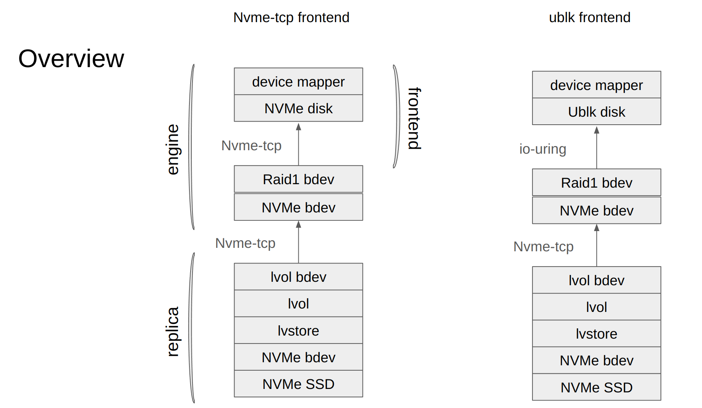

# UBLK Frontend For V2 Engine

## Summary

Longhorn v2 data engine current only support NVME-TCP frontend. 
We would like to support UBLK frontend for v2 data engine.
In high performance environment, UBLK frontend may have better performance compares to NVME-TCP. 
Ref https://github.com/longhorn/longhorn/wiki/Longhorn-Performance-Investigation

### Related Issues

https://github.com/longhorn/longhorn/issues/9456

## Motivation

### Goals

Support UBLK frontend for v2 data engine

### Non-goals

In this ticket, supporting live engine upgrade is not a goal. 
It will be handled in different ticket https://github.com/longhorn/longhorn/issues/9104

## Proposal

### User Stories

In high performance env, UBLK frontend may have better performance compares to NVME-TCP.
Ref https://github.com/longhorn/longhorn/wiki/Longhorn-Performance-Investigation

### User Experience In Detail

UBLK framework added in the Linux 6.0 kernel.
User need to have kernel version >= 6.0 to use this feature.
Require kernel module `ublk_drv`

In order to use UBLK frontend for v2 data engine, user just need to create a v2 volume with `volume.Spec.Frontend: ublk`. 
For example:
```yaml
apiVersion: v1
items:
- apiVersion: longhorn.io/v1beta2
  kind: Volume
  metadata:
    name: testvol
    namespace: longhorn-system
  spec:
    Standby: false
    accessMode: rwo
    backendStoreDriver: ""
    backingImage: ""
    backupCompressionMethod: lz4
    backupTargetName: default
    dataEngine: v2
    dataLocality: disabled
    dataSource: ""
    disableFrontend: false
    diskSelector: []
    encrypted: false
    engineImage: ""
    freezeFilesystemForSnapshot: ignored
    fromBackup: ""
    frontend: ublk
    image: longhornio/longhorn-instance-manager:master-head
    lastAttachedBy: ""
    migratable: false
    migrationNodeID: ""
    nodeID: ""
    nodeSelector: []
    numberOfReplicas: 1
    replicaAutoBalance: ignored
    replicaDiskSoftAntiAffinity: ignored
    replicaSoftAntiAffinity: ignored
    replicaZoneSoftAntiAffinity: ignored
    restoreVolumeRecurringJob: ignored
    revisionCounterDisabled: true
    size: "21474836480"
    snapshotDataIntegrity: disabled
    snapshotMaxCount: 250
    snapshotMaxSize: "0"
    staleReplicaTimeout: 20
    unmapMarkSnapChainRemoved: disabled
```

### API changes
We will add a new field to the engine CR's status: `UblkID` indicating the current ID of the ublk device on node corresponding to this engine.
For example,
```yaml
apiVersion: v1
items:
- apiVersion: longhorn.io/v1beta2
  kind: Engine
  metadata:
    creationTimestamp: "2025-02-19T23:49:20Z"
    finalizers:
    - longhorn.io
    generation: 19
    labels:
      longhornnode: ""
      longhornvolume: testvol
    name: testvol-e-0
    namespace: longhorn-system
    ownerReferences:
    - apiVersion: longhorn.io/v1beta2
      kind: Volume
      name: testvol
      uid: 5097129b-cbd8-496d-92c9-107ebd7c4e98
    resourceVersion: "6620798"
    uid: a3516605-403b-4a9e-9e8c-67f1d040564a
  spec:
    active: true
    backendStoreDriver: ""
    backupVolume: ""
    dataEngine: v2
    desireState: stopped
    disableFrontend: false
    engineImage: ""
    frontend: blockdev
    image: longhornio/longhorn-instance-manager:master-head
    logRequested: false
    nodeID: ""
    replicaAddressMap:
      testvol-r-8c244275: 10.42.7.177:20001
    requestedBackupRestore: ""
    requestedDataSource: ""
    revisionCounterDisabled: true
    salvageRequested: false
    snapshotMaxCount: 250
    snapshotMaxSize: "0"
    unmapMarkSnapChainRemovedEnabled: false
    upgradedReplicaAddressMap: {}
    volumeName: testvol
    volumeSize: "21474836480"
  status:
    backupStatus: null
    cloneStatus: null
    conditions:
    - lastProbeTime: ""
      lastTransitionTime: "2025-02-19T23:49:20Z"
      message: ""
      reason: ""
      status: "True"
      type: InstanceCreation
    - lastProbeTime: ""
      lastTransitionTime: "2025-02-19T23:49:20Z"
      message: ""
      reason: ""
      status: "False"
      type: FilesystemReadOnly
    currentImage: ""
    currentReplicaAddressMap:
      testvol-r-8c244275: 10.42.7.177:20001
    currentSize: "21474836480"
    currentState: stopped
    endpoint: ""
    instanceManagerName: ""
    ip: ""
    isExpanding: false
    lastExpansionError: ""
    lastExpansionFailedAt: ""
    lastRestoredBackup: ""
    logFetched: false
    ownerID: phan-v715-pool2-wn2t9-p8cjh
    port: 0
    ublkID: 1
    purgeStatus: null
    rebuildStatus: null
    replicaModeMap: null
    restoreStatus: null
    salvageExecuted: false
    snapshotMaxCount: 0
    snapshotMaxSize: "0"
    snapshots:
      volume-head:
        children: {}
        created: "2025-02-19T23:49:34Z"
        labels: {}
        name: volume-head
        parent: ""
        removed: false
        size: "0"
        usercreated: true
    snapshotsError: ""
    started: false
    storageIP: ""
    unmapMarkSnapChainRemovedEnabled: false
```

Longhorn UI will also be changed to allow the user to create the new v2 volume with UBLK frontend 

## Design

This is an overview of the NVME-TCP frontend stack VS the new UBLK frontend stack




### Implementation Overview

#### Refactor the Engine struct in `longhorn-spdk-engine/pkg/spdk/engine.go`
Refactor the Engine struct in `longhorn-spdk-engine/pkg/spdk/engine.go` to separate the information about NVME-TCP frontend and UBLK frontend.
This is the old struct:
```go
type Engine struct {
	sync.RWMutex

	Name              string
	VolumeName        string
	SpecSize          uint64
	ActualSize        uint64
	IP                string
	Port              int32 // Port that initiator is connecting to
	TargetIP          string
	TargetPort        int32 // Port of the target that is used for letting initiator connect to
	StandbyTargetPort int32
	Frontend          string
	Endpoint          string
	Nqn               string
	Nguid             string

	ctrlrLossTimeout     int
	fastIOFailTimeoutSec int

	ReplicaStatusMap map[string]*EngineReplicaStatus

	initiator      *nvme.Initiator
	dmDeviceIsBusy bool

	State    types.InstanceState
	ErrorMsg string
	Head        *api.Lvol
	SnapshotMap map[string]*api.Lvol
	IsRestoring           bool
	RestoringSnapshotName string
	// UpdateCh should not be protected by the engine lock
	UpdateCh chan interface{}
	log *safelog.SafeLogger
}
```
And this is the new struct
```go
type Engine struct {
	sync.RWMutex

	Name       string
	VolumeName string
	SpecSize   uint64
	ActualSize uint64
	Frontend   string
	Endpoint   string

	ctrlrLossTimeout     int
	fastIOFailTimeoutSec int
	ReplicaStatusMap     map[string]*EngineReplicaStatus

	NvmeTcpFrontend *NvmeTcpFrontend
	UblkFrontend    *UblkFrontend
	initiator       *nvme.Initiator
	dmDeviceIsBusy  bool

	State    types.InstanceState
	ErrorMsg string
	Head        *api.Lvol
	SnapshotMap map[string]*api.Lvol
	IsRestoring           bool
	RestoringSnapshotName string
	// UpdateCh should not be protected by the engine lock
	UpdateCh chan interface{}
	log *safelog.SafeLogger
}
type NvmeTcpFrontend struct {
	IP                string
	Port              int32 // Port that initiator is connecting to
	TargetIP          string
	TargetPort        int32 // Port of the target that is used for letting initiator connect to
	StandbyTargetPort int32

	Nqn   string
	Nguid string
}

type UblkFrontend struct {
	UblkID int
}
```

Now the engine with NVME-TCP frontend will have the field `NvmeTcpFrontend != nil` which contains the information related to NVME-TCP only.
And the engine with the UBLK frontend will have the field  `UblkFrontend != nil` which contains the information related to UBLK only

#### Refactor the Initiator struct in `go-spdk-helper/pkg/nvme/initiator.go`
Similarly, refactor Initiator struct in `go-spdk-helper/pkg/nvme/initiator.go` to separate the information about NVME-TCP frontend and UBLK frontend.

This is the old Initiator struct
```go
type Initiator struct {
	Name               string
	SubsystemNQN       string
	UUID               string
	TransportAddress   string
	TransportServiceID string

	Endpoint       string
	ControllerName string
	NamespaceName  string
	dev            *util.LonghornBlockDevice
	isUp           bool

	hostProc string
	executor *commonns.Executor

	logger logrus.FieldLogger
}
```
And this is the new Initiator struct:
```go
type Initiator struct {
	Name     string
	Endpoint string
	dev      *util.LonghornBlockDevice
	isUp     bool

	NvmeTcpInfo *NvmeTcpInfo
	UblkInfo    *UblkInfo

	hostProc string
	executor *commonns.Executor

	logger logrus.FieldLogger
}

type NvmeTcpInfo struct {
	SubsystemNQN       string
	UUID               string
	TransportAddress   string
	TransportServiceID string
	ControllerName     string
	NamespaceName      string
}

type UblkInfo struct {
	BdevName string
	UblkID   int
}
```

#### Build more SPDK API in `go-spdk-helper/pkg/spdk/client/basic.go`

These SPDK APIs are:
* `UblkCreateTarget`: Start to create ublk threads and initialize ublk target. It will return an error if user calls this RPC twice without ublk_destroy_target in between. It will use current cpumask in SPDK when user does not specify cpumask option.
* `UblkDestroyTarget`: Release all UBLK devices and destroy ublk target.
* `UblkGetDisks`: Display full or specified ublk device list
* `UblkStartDisk`: Start to export one SPDK bdev as a UBLK device
* `UblkRecoverDisk`: Recover original UBLK device with ID and block device
* `UblkStopDisk`: Delete a UBLK device

#### The flow when creating a new v2 engine with new UBLK frontend
1. User creates a volume with `Spec.Frontend: ublk`
1. Longhorn manager creates engine CR with `Spec.Frontend: ublk`
1. Longhorn manager also creates replica CRs
1. Longhorn manager starts replica and expose them as NVME-TCP target as usually 
1. Longhorn manager send gRPC call to instance manager to create engine with UBLK frontend 
1. Instance manager connect to the replicas
1. Instance manager creates a raid1 bdev from these replicas' NVME bdevs
1. Instance manager create ublk frontend by calling `handleUblkFrontend`
1. Instance manager starts ublk target if it has not been started by calling `UblkCreateTarget`
1. UBLK initiator cleanups the previous ublk device associated with the raid1 bdev by calling `UblkGetDisks` and `UblkStopDisk`
1. UBLK initiator finds an available ublk id by calling `UblkGetDisks`
1. UBLK initiator creates new ublk device for the raid bdev by calling `UblkStartDisk`
1. UBLK initiator set `UblkInfo.UblkID` to the available ID
1. UBLK initiator links that device to dm mapper
1. UBLK initiator duplicates dm device to `e.Endpoint`

#### The flow when deleting a new v2 engine with new UBLK frontend
1. Longhorn manager send gRPC call to instance manager to delete engine with UBLK frontend
1. UBLK initiator removes dm mapper device
1. UBLK initiator removes `e.Endpoint`
1. UBLK initiator delete ublk device associated with the raid1 bdev by calling `UblkStopDisk` with the recorded `UblkInfo.UblkID` info
2. Instance manager disconnects from the replicas
1. Longhorn manager delete replica and stops expose them as NVME-TCP target

### Test plan

https://github.com/longhorn/longhorn/issues/9456#issuecomment-2811508087

### Upgrade strategy

No upgrade strategy is needed