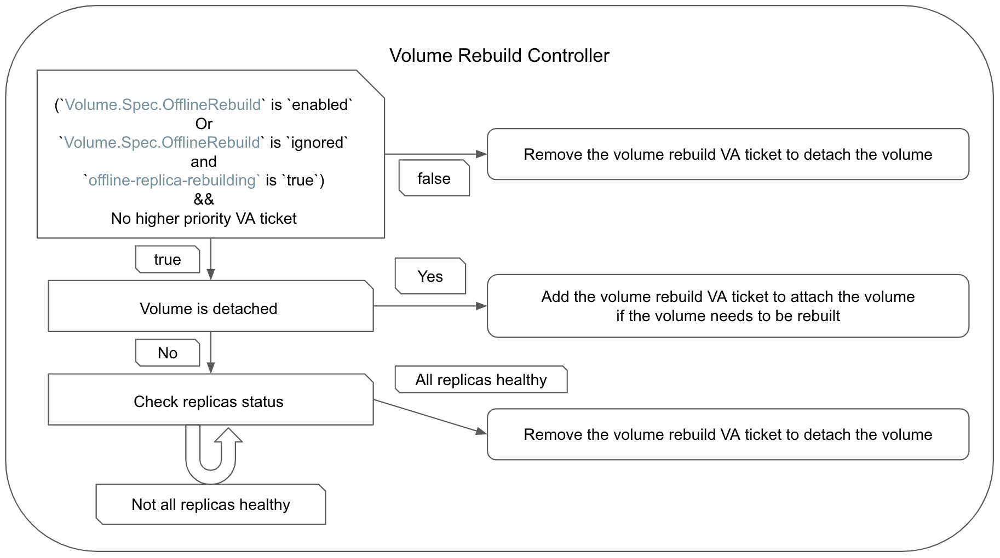

# Volume Offline Rebuilding

## Summary

This enhancement adds support for offline replica rebuild functionality for Longhorn volumes. It will allow rebuilding replicas while the volume is detached, enhancing the volume availability and reliability.

### Related Issues

- https://github.com/longhorn/longhorn/issues/8443

## Motivation

### Goals

- Support enabling and disabling volume offline rebuilding by enabling the global setting `offline-replica-rebuilding`.
- Support enabling and disabling volume offline rebuilding by the per-volume by the Longhorn UI, API or `kubectl` command.

### Non-goals

- Support offline replica rebuilding for faulted volumes.

## Proposal

### API changes

Introduce new volume Action APIs `offlineReplicaRebuilding` and a new field `Volume.Spec.OfflineRebuilding`:

  | API | Input | Output | Comments | HTTP Endpoint |
  | --- | --- | --- | --- | --- |
  | Update | N/A | err error | Enable/Disable volume offline rebuilding | **POST** `/v1/volumes/{VolumeName}?action=offlineReplicaRebuilding` |

```golang
type UpdateOfflineRebuildInput struct {
  OfflineRebuilding string `json:"offlineRebuilding"`
}

type VolumeOfflineRebuilding string

const (
  VolumeOfflineRebuildEnabled   = VolumeOfflineRebuilding("enabled")
  VolumeOfflineRebuildDisabled  = VolumeOfflineRebuilding("disabled")
  VolumeOfflineRebuildIgnored   = VolumeOfflineRebuilding("ignored")
)

type VolumeSpec struct {
  ...
  // The backup target name that the volume will be backed up to or is synced.
  // +optional
  BackupTargetName string `json:"backupTargetName"`
  // The flag that enable the offline replica rebuilding when volume is detached.
  // +optional
  OfflineRebuilding VolumeOfflineRebuilding `json:"offlineRebuilding"`
}
```

### User Stories

- Users want to automatically rebuild replicas while a degraded volume is detached to ensure maintain data redundancy.
- Users want to start a workload with the volume when the volume is in offline replica rebuild process.
- The offline rebuilding process will still work after the cluster goes down and comes back up.
- A worker node is down during the offline rebuilding process.

### User Experience In Detail

| `Volume.Spec.OfflineRebuilding` \ setting `offline-replica-rebuilding` | `true` | `false` |
| :---: | :---: | :---: |
|  `ignored` | ✓ | X |
| `enabled` | ✓ | ✓ |
| `disabled` | X | X |

- ✓: The offline rebuilding is enabled.
- X: The offline rebuilding is disabled.

#### Manually Enable An Individual Volume Offline Rebuilding

When users want to enable the offline rebuilding of a detached volume:

1. After enabling the per-volume offline rebuilding, if the volume is degraded, it will start the rebuilding process.
2. When all replicas (`Spec.NumberOfReplicas`) are healthy, the volume will be detached.

- By the Longhorn UI
  1. Access the Longhorn UI and navigate to the `Volume` page.
  2. Select the volume that needs offline replica rebuilding.
  3. Click on the `Operation` dropdown and click on `Offline Replica Rebuilding`.
  4. A UI lightbox will pop out and users choose the option `enabled`.

  Three options for the `Offline Replica Rebuilding` (`Volume.Spec.OfflineRebuilding`):
  - `ignored`: The default value. When the `Volume.Spec.OfflineRebuilding` is `ignored`, the offline rebuilding will follow the value of the global setting `offline-replica-rebuilding`.
  - `enabled`: The offline rebuild process will always start when the volume is detached and degraded.
  - `disabled`: The offline rebuild process will never start.

- By `kubectl` command:
  1. Use the command `kubectl -n longhorn-system edit volume [volume-name]`
  2. Update the field `Volume.spec.offlineRebuilding` to `enabled`.

  ```yaml
  apiVersion: longhorn.io/v1beta2
  kind: Volume
  metadata:
    ...
    name: [volume-name]
    namespace: longhorn-system
    ...
  spec:
    ...
    numberOfReplicas: 3
    offlineRebuilding: enabled
    ...
  ```

#### Enable Global Volumes Offline Rebuilding

When users want to enable the offline rebuilding of detached volumes:

- By the Longhorn UI
  1. Access the Longhorn UI and navigate to the `Setting` > `General` page.
  2. Check the setting `Offline Replica Rebuilding`.
  3. Click the bottom `Save` button.

- By `kubectl` command:

  ```shell
  kubectl -n longhorn patch setting offline-replica-rebuilding --type=merge -p '{"value": "true"}'
  ```

When there are detached volumes degraded, the offline rebuilding process of these volumes will start.

#### The CSI Attach Request During Volume Offline Rebuilding

When the offline rebuilding process is in progress:

1. Users try to start the workload with the Longhorn volume that is in offline rebuilding process.
2. When The CSI attaching volume request is received and the CSI VA ticket is created, the volume rebuild VA ticket will be preempted by the CSI VA ticket.
3. The offline rebuilding process will be canceled because the volume rebuild VA ticket is preempted.
4. After offline rebuilding process is canceled, the volume will be attached to the requested node for the CSI VA ticket.
5. The workload can start to use the volume after the volume attachment.

#### Cluster Goes Down And Comes Back Up During Volume Offline Rebuilding

Users should be aware that the rebuilding process will restart if it does not finish before the cluster goes down.

#### A Worker Node Down When Volume Is Detached

- A worker node that contains the volume replica is down.
- When offline rebuilding is enabled (either by the global setting or `Volume.Spec.OfflineRebuilding`), detached volumes will start the offline rebuilding process if the number of healthy replicas does not equal `Volume.Spec.NumberOfReplicas`, and will continue until the numbers match.

#### A Worker Node Down During Volume Offline Rebuilding

- The offline rebuilding will continue until the number of healthy replicas equals to `Volume.Spec.NumberOfReplicas`.
- The detached volumes will start the offline rebuilding process if the number of healthy replicas does not equal to `Volume.Spec.NumberOfReplicas`.

#### Volume Becomes Faulted During Offline Rebuilding

- The rebuilding process will be canceled.
- Users need to resolve the issues causing the volume to be faulted before initiating a salvage.

## Design

### Implementation Overview

The volume rebuild VA ticket example:

```yaml
apiVersion: longhorn.io/v1beta2
kind: VolumeAttachment
...
spec:
  attachmentTickets:
    volume-rebuilding-controller-[volume-name]:
      generation: 0
      id: volume-rebuilding-controller-[volume-name]
      nodeID: workerNode01
      parameters:
        disableFrontend: "any"
      type: volume-rebuilding-controller
  volume: [volume-name]
status:
  ...
```

- The `Volume.Spec.OfflineRebuilding` field will `NOT` be changed when the global setting `offline-replica-rebuilding` is modified.

#### Global Setting `offline-replica-rebuilding`

- The setting `offline-replica-rebuilding` is `true`:
  1. The volume rebuild controller will create the VA ticket for attaching the volume that the `Spec.OfflineRebuilding` field is `enabled` or `ignored` and need to be rebuilt.
    
  2. The rebuilding process will be started automatically by the volume controller.
  3. The volume rebuild controller will check the volume and replicas of the volume status when the volume is updated.
  4. If the rebuilt replicas are healthy (healthy replica count is equal to `Volume.Spec.NumberOfReplicas`), the volume rebuild controller will remove the volume rebuild VA ticket to detach the volume and the process is done.

- The setting `offline-replica-rebuilding` is `false`:
  1. The volume rebuild controller will check if the `Volume.Spec.OfflineRebuilding` field is `disabled` or `ignored`.
  2. The offline rebuilding in progress will be canceled by the volume rebuild controller with removing the volume rebuild VA ticket.

#### Manually Enable Offline Rebuilding

- The `Spec.OfflineRebuilding` field of the detached volume is set to `enabled` by the Longhorn UI, API or `kubectl` command:
  
  ```yaml
  apiVersion: longhorn.io/v1beta2
  kind: Volume
  ...
  spec:
    ...
    numberOfReplicas: 3
    offlineRebuilding: enabled
    ...
  ```

1. The volume rebuild controller will create the VA ticket for attaching the volume if rebuilding is necessary.
2. The rebuilding process will be started automatically by the volume controller.
3. The volume rebuild controller will check the volume and replicas of the volume status when the volume is updated.
4. If the rebuilt replicas are healthy (healthy replica count is equal to `Volume.Spec.NumberOfReplicas`), the volume rebuild controller will remove the volume rebuild VA ticket to detach the volume and the process is done.

- The `Spec.OfflineRebuilding` field of the detached volume is set to `disabled` by the Longhorn UI, API or `kubectl` command:
  
  ```yaml
  apiVersion: longhorn.io/v1beta2
  kind: Volume
  ...
  spec:
    ...
    numberOfReplicas: 3
    offlineRebuilding: disabled
    ...
  ```

1. The rebuilding process will be canceled if necessary.
2. The volume rebuild controller will remove the VA ticket if necessary.

#### Attach Request With High Priority VA Ticket During Offline Rebuilding

For instance, CSI VA ticket priority 900 is higher than volume rebuild controller VA ticket priority 800:

1. When The CSI attaching volume request is received and the CSI VA ticket is created, the volume rebuild VA ticket will be preempted by the CSI VA ticket by the volume attachment controller.
2. The volume rebuild controller will remove the volume rebuild VA ticket if there is a CSI VA ticket.
3. The volume rebuild controller will record the cancellation of the volume offline rebuilding.
4. After the volume rebuild VA ticket is removed, then the volume will be attached for the CSI VA ticket.
5. Make an event or logs in the controller to notice users the rebuilding is canceled.

#### Handle Cluster Goes Down And Comes Back Up During Offline Rebuilding

- The volume rebuild controller will examine all volumes:
  - If `Volume.Spec.OfflineRebuilding` is `disabled`, remove the volume rebuild VA ticket for the volume.
  - If `Volume.Spec.OfflineRebuilding` is `enabled` or if the global setting `offline-replica-rebuilding` is `true` and the `Volume.Spec.OfflineRebuilding` field is `ignored`, the volume needs to be rebuilt and there is no CSI VA ticket:
    - Add the volume rebuild VA ticket of the volume if it does not exist.
    - Check the volume rebuilding status if the volume rebuild VA ticket exists.

#### Volume Faulted During Offline Rebuilding

1. The volume rebuild controller will remove the volume rebuild VA ticket for stopping the rebuilding process.
2. The volume rebuild controller will record the cancellation of the volume offline rebuilding.
3. Make an event or logs in the controller to notice users the rebuilding is canceled.

### Test plan

- The replica count is less than the number of replicas in the `Volume.Spec`:
  - Set the field `Volume.Spec.OfflineRebuilding` to `enabled`
    1. Create a volume with 3 replicas in a 3 worker nodes cluster and write some data to the volume.
    2. Detach the volume.
    3. Delete a replica of the volume.
    4. Enable the offline rebuilding by the API `volume.offlineReplicaRebuilding`.
    5. Wait for the volume detached.
    6. Check if healthy replicas count of the volume equals to `Volume.Spec.NumberOfReplicas`.
    7. Check if the `Volume.Spec.OfflineRebuilding` is still `enabled`.
    8. Delete a replica of the volume.
    9. The offline rebuilding will start again.
    10. Wait for the volume detached.
    11. Check if healthy replicas count of the volume equals to `Volume.Spec.NumberOfReplicas`.
    12. Check if the `Volume.Spec.OfflineRebuilding` is still `enabled`.

  - Set the global setting `offline-replica-rebuilding` to `true`
    1. Create a volume with 3 replicas in a 3 worker nodes cluster and write some data to the volume.
    2. Detach the volume.
    3. Delete a replica of the volume.
    4. Set the global setting `offline-replica-rebuilding` to `true` to enable the offline rebuilding.
    5. Wait for the volume detached.
    6. Check if healthy replicas count of the volume equals to `Volume.Spec.NumberOfReplicas`.
    7. Check if the `Volume.Spec.OfflineRebuilding` is still `ignored`.
    8. Delete a replica of the volume.
    9. The offline rebuilding will start again.
    10. Wait for the volume detached.
    11. Check if healthy replicas count of the volume equals to `Volume.Spec.NumberOfReplicas`.
    12. Check if the `Volume.Spec.OfflineRebuilding` is still `ignored`.
    13. Set the global setting `offline-replica-rebuilding` to `false`.
    14. Check if the `Volume.Spec.OfflineRebuilding` is `ignored`
    15. Set the `Volume.Spec.OfflineRebuilding` to `disable`.
    16. Delete a replica of the volume.
    17. Set the global setting `offline-replica-rebuilding` to `true`.
    18. The offline rebuilding will not start.
    19. Check if the `Volume.Spec.OfflineRebuilding` is still `disable`.
    20. Set the global setting `offline-replica-rebuilding` to `false`.
    21. Check if the `Volume.Spec.OfflineRebuilding` is still `disable`.

- Enable the global setting `offline-replica-rebuilding` when many volumes are degraded
  1. Create 10 volumes with 3 replicas in a 3 worker nodes cluster and write some data to all volumes.
  2. Detach all volumes.
  3. Delete a replica of all volumes.
  4. Set the global setting `offline-replica-rebuilding` to `true` to enable the offline rebuilding.
  5. Wait for that volumes are attached.
  6. Patch the global setting `concurrent-replica-rebuild-per-node-limit` to 3
  7. Check if only 3 rebuilding processes start.
  8. Wait for all volumes are detached.
  9. Check if healthy replicas count of all volumes equals to `Volume.Spec.NumberOfReplicas`.

- The CSI attaching request should preempt the offline rebuilding process:
  1. Create a workload with Longhorn volume having 3 replicas in a 3 worker nodes cluster
  2. Write some data to the volume.
  3. Scale down the workload to detach the volume.
  4. Delete a replica of the volume.
  5. Enable the offline rebuilding by the API `volume.offlineReplicaRebuilding`.
  6. When the rebuilding is in progress, scale up the workload.
  7. Check if the offline rebuilding process is canceled.
  8. Check if the workload is working well.

- The one worker node shutdown/reboot during offline rebuilding in the cluster with 3 worker nodes:
  1. Create a workload with Longhorn volume with 3 replicas.
  2. Write some data to the volume.
  3. Scale down the workload to detach the volume.
  4. Delete a replica of the volume.
  5. Enable the offline rebuilding by the API `volume.offlineReplicaRebuilding`.
  6. Shutdown/reboot a worker node.
  7. Check if the volume offline rebuilding is in progress.
  8. The volume is detached after healthy replicas count of the volume equals to `Volume.Spec.NumberOfReplicas`.

- The one worker node shutdown in the cluster with 4 worker nodes:
  1. Create a workload with Longhorn volume with 3 replicas.
  2. Write some data to the volume.
  3. Scale down the workload to detach the volume.
  4. Enable the offline rebuilding by the API `volume.offlineReplicaRebuilding`.
  5. Shutdown a worker node that contain a volume replica.
  6. Check if the volume offline rebuilding is in progress.
  7. The volume is detached after healthy replicas count of the volume equals to `Volume.Spec.NumberOfReplicas`.

- The cluster with 3 worker nodes goes down and comes back up during offline rebuilding:
  1. Create a workload with Longhorn volume with 3 replicas.
  2. Write some data to the volume.
  3. Scale down the workload to detach the volume.
  4. Delete a replica of the volume.
  5. Enable the offline rebuilding by the API `volume.offlineReplicaRebuilding`.
  6. Shutdown the cluster.
  7. Bring the cluster up.
  8. Check if the volume offline rebuilding is restarted.
  9. Check if the volume offline rebuilding is done
  10. The volume is detached.

- The source replica is deleted during offline rebuilding:
  1. Create a volume with 3 replicas in a 3 worker nodes cluster and write some data to the volume.
  2. Detach the volume.
  3. Delete a replica of the volume.
  4. Enable the offline rebuilding by the API `volume.offlineReplicaRebuilding`.
  5. Check if the rebuilding process is start and the new replica is replenished.
  6. Delete or crash the source replica process.
  7. Check if the volume rebuilding is still working.
  8. Check if the volume offline rebuilding is done
  9. The volume is detached.

### Upgrade strategy

- The `Volume.Spec.OfflineRebuilding` field of all volumes will be updated to `ignored`.
