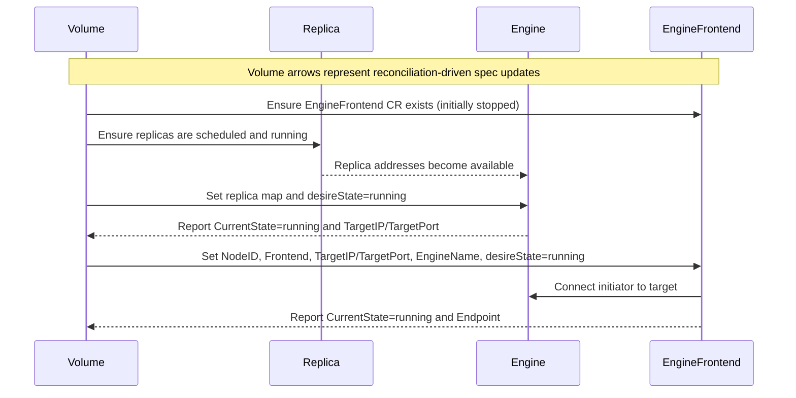
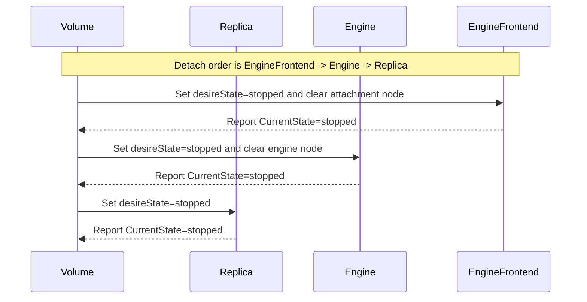
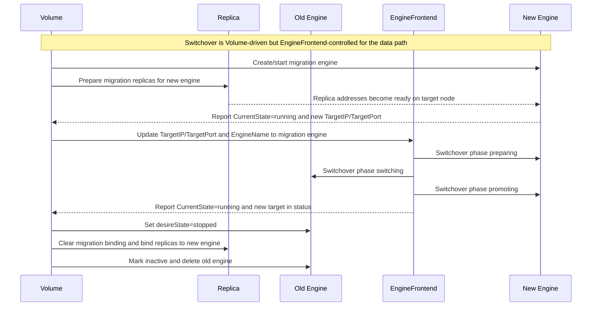
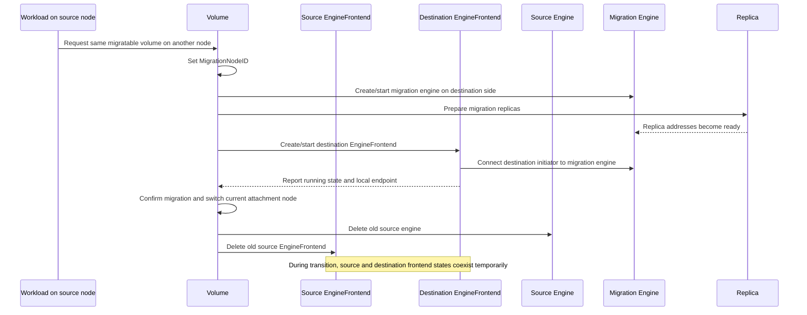

# Decouple V2 Data Engine Initiator and Target Placement

## Summary

This proposal enables the Longhorn v2 data engine to run its initiator and target on different nodes.

The key design change is to split the current v2 `Engine` responsibility into two control-plane objects with independent placement and lifecycle:

- `Engine` manages the v2 target.
- `EngineFrontend` manages the v2 initiator.

This separation is required for future v2 data engine live upgrade support. To upgrade an instance-manager without detaching attached v2 volumes, Longhorn must be able to move the target to another node while the initiator continues serving I/O on the attachment node.

With this split, `Volume` remains the top-level owner of desired state, `EngineFrontend` owns the initiator-side data path on the attachment node, `Engine` owns the target-side data path on the engine node, and `Replica` owns the backend storage copies. The main architectural benefit is that v2 can explicitly support cross-node placement of initiator and target while leaving the v1 data engine unchanged.

## Motivation

### Problem Statement

The original `Engine` CRD was designed around a model where one object represented the serving data path for a volume. That was sufficient for the v1 data engine, where the engine process both served the frontend and coordinated the backend on the same node.

That model does not fit the v2 data engine well. In v2, the target and the initiator are different concerns and may run on different nodes:

- The v2 target is exported by the SPDK engine on the engine node.
- The v2 initiator is created on the attachment node and is responsible for the local consumable endpoint.

The primary problem is **instance-manager live upgrade for the v2 data engine**. To upgrade the instance-manager on a node without detaching attached v2 volumes, Longhorn must be able to move the volume's target away from the node being upgraded while keeping the initiator on the attachment node. The upgrade sequence is:

1. For each v2 volume whose target is on the node being upgraded, switch the target (Engine) to a different node while the initiator (EngineFrontend) stays on the attachment node.
2. Once all targets have been moved off the node, the old instance-manager pod can be safely deleted.
3. A new instance-manager pod is created with the upgraded image.
4. After the upgraded instance-manager is running, targets can be moved back if needed.

This sequence requires the initiator and target to be modeled as separate objects with independent node placement and lifecycle. If both are bound to a single `Engine` object, there is no way to move the target to another node while the initiator continues serving I/O on the attachment node — the volume would have to be detached for the upgrade, causing workload disruption.

### Why EngineFrontend Is Needed

A dedicated `EngineFrontend` CRD gives the control plane object for the v2 initiator. This is what makes cross-node placement possible: the initiator can stay on the attachment node to keep serving I/O while the target is moved to another node. That same separation is what enables instance-manager live upgrade without detaching attached v2 volumes.

The split also matches the implementation boundary already present in the v2 stack:

- `longhorn-manager` has a dedicated `EngineFrontendController`.
- `longhorn-instance-manager` has a dedicated `engine-frontend` instance type.
- `longhorn-spdk-engine` has dedicated `EngineFrontend*` APIs and runtime objects.
- `go-spdk-helper` contains initiator-specific logic for NVMe/TCP, device-mapper, and ublk.

## Goals

- Support the v2 data engine initiator and target running on different nodes.
- Enable v2 instance-manager live upgrade without detaching attached volumes by allowing the target to move to another node while the initiator stays on the attachment node.
- Introduce a v2-only `EngineFrontend` CRD that represents the initiator side of the v2 data path.
- Keep `Engine` focused on the v2 target lifecycle.
- Make the frontend attachment node (`Volume.Spec.NodeID`) explicit and independent from the engine node (`Volume.Spec.EngineNodeID`).
- Track the current target node separately in `Volume.Status.CurrentEngineNodeID`.
- Make attach and detach ordering explicit.
- Make v2 engine target switchover frontend-aware and report switchover progress in `Volume.Status.SwitchoverState`.
- Expose the v2 consumable endpoint through `EngineFrontend`.
- Track frontend device size and NVMe/TCP multipath path state through `EngineFrontend`.
- Preserve v1 behavior.

## Non-Goals

- Redesign the v1 data engine.
- Remove existing frontend-related fields from `Engine` in the same change.
- Introduce multiple steady-state active frontends per volume.
- Redesign the user-facing Longhorn volume API beyond the minimal changes required for v2.

## Proposal

### Object Model

The new steady-state model for a v2 volume is:

- One active `Engine` object for the target.
- One active `EngineFrontend` object for the initiator.
- Multiple `Replica` objects for the backend data copies.

The initial scope keeps one active `EngineFrontend` per volume in steady state. `GenerateEngineFrontendNameForVolume(volumeName, currentEngineFrontendName)` produces numbered names in the pattern `{volumeName}-ef-{number}`. During live migration, the datastore temporarily contains extra `EngineFrontend` objects, but the intended steady state is a single active frontend per volume.

`EngineFrontend.Spec.Active` is the primary signal for selecting the current frontend, matching the active-engine selection model. If no active frontend is found, the datastore falls back to node-based detection using the current attachment node. This fallback helps during transition windows such as migration, detach-while-attaching, and upgrades from a version that did not yet set the active flag.

The control-plane object relationship can be visualized as follows:

```text
                     +----------------------+
                     |        Volume        |
                     |----------------------|
                     | desired attach state |
                     | attachment node      |
                     +----------+-----------+
                                |
                                v
                     +----------------------+      +----------------------+
                     |    EngineFrontend    |----->| data path initiator  |
                     |----------------------|      +----------------------+
                     | endpoint             |
                     | target connection    |
                     +----------+-----------+
                                |
                                | connects to
                                v
                     +----------------------+      +----------------------+
                     |        Engine        |----->|  data path target    |
                     |----------------------|      +----------------------+
                     | target IP / port     |
                     | replica address map  |
                     +----------+-----------+
                                |
                                | serves traffic to / coordinates
                                v
          +----------------+  +----------------+  +----------------+
          |   Replica 1    |  |   Replica 2    |  |   Replica 3    |
          |----------------|  |----------------|  |----------------|
          | backend copy   |  | backend copy   |  | backend copy   |
          +----------------+  +----------------+  +----------------+
```

### Responsibilities

| Object | Responsibility |
| --- | --- |
| `Engine` | Target-side lifecycle, replica address map, target IP/port, backend coordination, engine node placement |
| `EngineFrontend` | Initiator-side lifecycle, attachment node placement, local endpoint, target connection, suspend/resume, switchover, frontend-aware expansion and other initiator-mediated operations |

For v2, `Engine` becomes the target authority. `EngineFrontend` becomes the initiator authority.

### EngineFrontend API

The CRD is registered with short name `lhef` so that `kubectl get lhef` lists engine frontends. Kubebuilder print columns expose Data Engine, State, Node, InstanceManager, and Age. A status subresource separates spec and status updates, and a `longhorn.io` finalizer ensures graceful deletion.

`EngineFrontendSpec` contains the information needed to run the initiator:

- Embedded `InstanceSpec` (provides `VolumeName`, `VolumeSize`, `NodeID`, `Image`, `DesireState`, `DataEngine`, and other common instance fields)
- `Size` — desired frontend device size in bytes. This can intentionally lag behind `VolumeSize` during expansion so the frontend controller can drive the real frontend resize.
- `Frontend` — the `VolumeFrontend` type (`blockdev`, `nvmf`, `ublk`, or empty)
- `UblkQueueDepth` — queue depth for the ublk frontend (optional, uses default if unset)
- `UblkNumberOfQueue` — number of queues for the ublk frontend (optional, uses default if unset)
- `TargetIP` — IP address of the v2 engine target
- `TargetPort` — port of the v2 engine target
- `EngineName` — name of the v2 engine target (used for instance creation and switchover)
- `DisableFrontend` — disables frontend creation (frontend type becomes empty)
- `Active` — marks the current steady-state frontend for the volume

`EngineFrontendStatus` contains the initiator-observed runtime state:

- Embedded `InstanceStatus` (provides `OwnerID`, `InstanceManagerName`, `CurrentState`, `IP`, `StorageIP`, `Port`, `UblkID`, `UUID`, `Conditions`, and other common instance fields)
- `CurrentSize` — current size of the frontend device in bytes as observed from the data plane
- `Endpoint` — the device endpoint exposed to CSI (e.g. `/dev/longhorn/<volume>`)
- `TargetIP` — the currently active engine target IP
- `TargetPort` — the currently active engine target port
- `ActivePath` — the active NVMe/TCP frontend path address
- `PreferredPath` — the preferred NVMe/TCP frontend path address
- `Paths` — observed NVMe/TCP path records, including target IP, port, engine name, NQN, NGUID, and ANA state
- `SwitchoverPhase` — the last completed frontend switchover phase

This gives the control plane separate desired and observed state for the initiator-side data path.

The frontend switchover phases currently implemented by manager are:

| Phase | Meaning |
| --- | --- |
| `""` | No frontend switchover is in progress |
| `preparing` | Connect the new multipath path and set the new target ANA state to non-optimized |
| `switching` | Set the old target ANA state to inaccessible |
| `promoting` | Set the new target ANA state to optimized and reload initiator device information |

The volume-level switchover states currently implemented by manager are `""`, `preparing`, `switching-over`, `finalizing`, and `reverting`.

### Lifecycle

In the following interaction diagrams, arrows from `Volume` mean spec or status transitions triggered by the volume reconciliation flow. The actual API updates are performed by the volume controller and the `EngineFrontendController`, but `Volume` is used as the control-plane anchor so the object relationship is easier to read.

#### Creation and Attach

1. When a v2 volume is reconciled, Longhorn creates an `EngineFrontend` CR in the stopped state.
2. The `Engine` target is created and started first.
3. After the `Engine` is running and reports a reachable target IP and port, the volume controller updates the `EngineFrontend` with:
   - the attachment node
   - frontend settings
   - target IP and port
   - engine name
   - desired state `running`
4. The `EngineFrontendController` creates the initiator instance by calling instance-manager with instance type `engine-frontend`.
5. The `EngineFrontend` monitor updates the frontend endpoint and publishes it through the Longhorn API.
6. CSI uses the `EngineFrontend` endpoint for v2 node stage and node publish.

This ordering ensures the initiator is never started before the target exists.

During attach, `Volume` first drives `Replica` and `Engine` into a runnable backend state, then uses the running `Engine` target information to start `EngineFrontend`. For v2, the target engine node is `Volume.Spec.EngineNodeID` when set, otherwise it falls back to `Volume.Spec.NodeID`. `EngineFrontend.Spec.NodeID` remains the attachment node. `EngineFrontend` does not become runnable until the `Engine` target is already reachable.



#### Detach

Detach ordering for v2 becomes:

1. Stop `EngineFrontend`
2. Stop `Engine`
3. Stop `Replica`

The volume controller waits for the `EngineFrontend` to stop before stopping the target. This prevents the local initiator from continuing to point to a disappearing target.

During detach, the key rule is that `EngineFrontend` must stop first. Only after the frontend is no longer connected does `Volume` stop `Engine`, and only after the target is stopped does `Volume` stop `Replica`.



#### Engine Switchover

The currently implemented manager-driven v2 engine switchover is triggered when the desired target engine node (`Volume.Spec.EngineNodeID`, falling back to `Volume.Spec.NodeID`) differs from `Volume.Status.CurrentEngineNodeID`. It is driven by the volume controller through `EngineFrontend` and uses NVMe/TCP multipath ANA phases rather than suspend/resume.

The implemented flow is:

1. The volume controller detects the engine-node change, sets `Volume.Status.SwitchoverState = preparing`, creates a migration `Engine`, places it on the desired target engine node, and prepares migration replica bindings for that engine.
2. When the migration engine is running and has a reachable target IP and port, the volume controller sets `Volume.Status.SwitchoverState = switching-over`.
3. The volume controller updates the current active `EngineFrontend.Spec.TargetIP`, `TargetPort`, and `EngineName` to point at the migration engine, then returns and waits.
4. The `EngineFrontendController` detects that `Spec.TargetIP`/`TargetPort` differ from `Status.TargetIP`/`TargetPort` while the frontend instance is running. It executes `EngineFrontendSwitchOverTarget` in three reconcile-driven phases:
   - `preparing`: connect the new multipath path and set the new target ANA state to non-optimized.
   - `switching`: set the old target ANA state to inaccessible.
   - `promoting`: set the new target ANA state to optimized and reload initiator device information.
5. After the `promoting` phase succeeds, the `EngineFrontendController` clears `Status.SwitchoverPhase` and updates `Status.TargetIP` and `Status.TargetPort` to the new target.
6. Once the volume controller sees the frontend status reflecting the migration target and `EngineFrontend.Status.CurrentState = running`, it sets `Volume.Status.SwitchoverState = finalizing`, marks the migration engine active, marks the old engine inactive and stopped, rebinds replicas to the new engine, updates `Volume.Status.CurrentEngineNodeID`, and deletes the old engine.

The old engine remains running until `EngineFrontend.Status` confirms the new target. This is intentional: if the data-plane switchover fails or the frontend leaves `running`, the old path is still available and the volume controller can revert instead of tearing down the only working target.

The volume controller also has a revert path. If the migration engine is invalid, enters an error state, the migration topology is unexpected, or the frontend cannot confirm a running new path, the controller sets `Volume.Status.SwitchoverState = reverting`, cleans up migration engine and replica bindings, restores the current `EngineFrontend` spec target back to the old current engine, and stops extra frontend objects.

This phased design is the core reason the initiator needs its own CRD: target switchover must coordinate between the volume controller, which drives engine and replica lifecycle, and the frontend controller, which drives the live initiator's multipath state.

During switchover, `Volume` temporarily coordinates both the current and migration target paths. The sequence below shows the implemented multipath case: `Volume` creates the migration `Engine`, prepares `Replica` for that new target, redirects `EngineFrontend`, waits for the frontend controller to finish ANA switchover, and only then stops the old `Engine`.



#### V2 Data Engine Live Migration

The v2 data engine live migration flow is built on top of the same initiator/target split, but the goal is different from ordinary target switchover.

- **Engine switchover** moves the current v2 target from one node to another while the attached workload keeps using the same initiator on the same attachment node.
- **V2 live migration** moves the attached workload from one node to another, so the destination side must get both a migration target and a destination-side initiator.

In other words, `EngineFrontend` is required not only for target switchover but also for live migration, because the destination attachment node needs its own initiator-side object and endpoint rather than reusing the old node's frontend state.

At a high level, the live migration sequence is:

1. A second CSI attachment ticket requests the same migratable v2 volume on another node.
2. The volume attachment controller sets `MigrationNodeID` to that destination node.
3. The volume controller prepares a migration `Engine` and matching `Replica` set on the destination side.
4. Longhorn creates and starts a destination `EngineFrontend` that connects to the migration engine and exposes the local endpoint on the destination node.
5. After the destination `Engine` and `EngineFrontend` are both ready, migration is confirmed and the destination node becomes the new current attachment node.
6. The old `Engine`, old `EngineFrontend`, and temporary migration bindings are cleaned up.

The critical point is that live migration needs a second initiator-side object on the destination node. Unlike target switchover, where one existing `EngineFrontend` reconnects to a new target, live migration temporarily requires both source-side and destination-side frontend state during the transition window.



This proposal does not introduce a separate `EngineFrontend` live-migration-specific CRD or workflow object. The key requirement is that live migration can create and manage destination initiator state explicitly, instead of treating the v2 frontend as an implicit field inside `Engine`.

### Frontend Modes

`EngineFrontend` supports the v2 frontend modes already present in the runtime stack. The CRD uses the `VolumeFrontend` names from the volume spec, which are mapped to SPDK-level frontend strings by `GetEngineInstanceFrontend()`:

| `VolumeFrontend` (CRD) | SPDK Frontend String | Current Implementation Notes |
| --- | --- | --- |
| `blockdev` | `spdk-tcp-blockdev` | NVMe/TCP initiator with a local endpoint exposed as `/dev/longhorn/<volume>`. Manager drives attach, endpoint reporting, frontend size tracking, online expansion, and multipath ANA target switchover through `EngineFrontend`. |
| `nvmf` | `spdk-tcp-nvmf` | Exposes an NVMe-oF endpoint string rather than a local block device. Manager maps and routes the frontend type through `EngineFrontend`; multipath switchover depends on runtime support for the same phased `EngineFrontendSwitchOverTarget` path. |
| `ublk` | `ublk` | Uses a ublk-backed initiator and exposes the CSI endpoint as `/dev/longhorn/<volume>`. Queue depth and queue count are supported, with defaults supplied from settings when unset. |
| `""` (empty) | `""` | No frontend exposure. |

The current manager switchover path does not stop at a generic suspend/resume operation. It calls `EngineFrontendSwitchOverTarget` with explicit `preparing`, `switching`, and `promoting` phases and records observed path state in `EngineFrontend.Status.Paths`, `ActivePath`, and `PreferredPath`.

The CRD is the stable control-plane model. Frontend-specific mechanics remain in instance-manager, SPDK engine, and `go-spdk-helper`.

### Initiator-Mediated Operations

For the v2 data engine, several operations enter through `EngineFrontend` rather than directly through `Engine`:

- **Volume expansion** — the frontend monitor observes `EngineFrontend.Status.CurrentSize`, compares it with `EngineFrontend.Spec.Size` while `Volume.Status.ExpansionRequired` is true, and calls the frontend proxy expansion path after engine-side expansion and replica rebuild gates are clear.
- **Snapshot create / delete / revert / purge** — delegated to the engine via RPC, but routed through the frontend proxy path so the correct instance name and address are used.
- **Replica add** — starts a background shallow-copy phase on the engine, then suspends the frontend before the finish phase to quiesce RAID I/O during the replica merge, and resumes after completion.
- **Backup create / status** — proxied through the frontend so that the proxy address points to the frontend's instance-manager rather than the engine's.

The reason is not that the target stops being important. The reason is that these operations may need to coordinate with the live initiator path, including endpoint updates, suspend/resume semantics, and correct proxy routing. The backend work still happens on the engine side, but the entry point for control becomes the frontend object.

The proxy layer in `longhorn-manager` uses `GetObjInfo(obj)` to extract the data engine, engine name, engine frontend name, and volume name from either an `*Engine` or an `*EngineFrontend` object. When the object is an `EngineFrontend`, the proxy routes the gRPC call to the frontend's instance-manager address and passes `engineFrontendName` to the instance-manager proxy, which in turn dispatches to the correct SPDK engine frontend RPC.

### Compatibility and API Evolution

This proposal is v2-only. The v1 data engine behavior is unchanged.

To reduce churn and preserve compatibility during transition:

- Existing frontend-related fields in `EngineSpec` and `EngineStatus` may remain for now.
- For v2, those fields are no longer the authoritative initiator state.
- `EngineFrontend` becomes the authoritative source for the v2 frontend endpoint, frontend size, active target, and multipath path state.
- The Longhorn volume API merges the matching v2 `EngineFrontend` endpoint, node, and `CurrentSize` into controller output so existing clients, including CSI, can still see the user-consumable endpoint and frontend device size through the established volume response.
- Instance manager status exposes `instanceEngineFrontends` so API clients can inspect frontend instance processes separately from engine instance processes.

Removing obsolete frontend fields from `Engine` should be handled in a separate cleanup proposal after the split is stable.

## Upgrade Strategy

The upgrade uses a **controller-driven lazy creation** model rather than a dedicated migration script. There is no `EngineFrontend`-specific step in the `upgrade/` version migration path. Instead, the volume controller creates `EngineFrontend` objects for existing v2 volumes during normal reconciliation after the upgraded longhorn-manager starts.

### CRD Installation

The `EngineFrontend` CRD must be installed before the upgraded longhorn-manager starts. This is handled by the Helm chart or operator, which installs CRDs before deploying the manager DaemonSet.

### Prerequisites

`EngineFrontend` creation requires instance-manager API version 4 or later. The upgraded instance-manager and SPDK engine images must be deployed alongside the new longhorn-manager so that `engine-frontend` instance creation and switchover operations are available when the `EngineFrontendController` starts managing runtime instances.

## User Stories

### User Story 1

As a Longhorn operator upgrading instance-manager on a node, I want the v2 volume targets on that node to be moved to other nodes while the initiators continue serving I/O, so that the instance-manager pod can be replaced with a new image without detaching any v2 volumes.

### User Story 2

As a Longhorn user attaching a v2 volume to a workload node, I want the local endpoint to be managed independently from the backend target so that the data path reflects the real runtime topology.

### User Story 3

As Longhorn, I want to switch a v2 volume from one engine target to another without exposing the application node directly to backend target teardown timing.

### User Story 4

As CSI, I want a stable endpoint source for v2 volumes so that stage and publish operations use the initiator-owned endpoint rather than a target-owned field.

## Test Plan

- Add unit tests for `EngineFrontendController` create/delete/start/stop behavior, target status initialization, monitor cleanup, and path status sync.
- Add unit tests for phased multipath target switchover (`preparing`, `switching`, `promoting`), including failure events, phase reset, and revert paths.
- Add unit tests for volume-controller engine switchover using `EngineNodeID`, `CurrentEngineNodeID`, active `EngineFrontend` selection, and old-engine cleanup only after `EngineFrontend` reports the new running target.
- Add integration tests for attach and detach ordering: `EngineFrontend -> Engine -> Replicas`.
- Add integration tests for v2 endpoint propagation through the API and CSI.
- Add SPDK and instance-manager tests for:
  - frontend create/delete/get/list/watch
  - suspend/resume APIs used by frontend-mediated operations
  - phased multipath target switchover
  - path reporting, including active path, preferred path, and ANA state
  - recovery after restart
  - snapshot, expansion, and replica-add entry through `EngineFrontend`
- Add upgrade tests from a build without `EngineFrontend` to a build with `EngineFrontend`.
- Add live-migration tests that create a destination `EngineFrontend`, verify both migration engine and destination frontend readiness, confirm migration, and clean up the old frontend after node handoff.

## Risks and Mitigations

### Risk 1: Split-Brain Ownership Between Engine and EngineFrontend

If `Engine` and `EngineFrontend` drift, Longhorn could expose the wrong endpoint or switch against the wrong target.

Mitigation:

- Keep `Engine` authoritative for target lifecycle.
- Keep `EngineFrontend` authoritative for frontend lifecycle and endpoint.
- Use explicit target fields in `EngineFrontend.Spec` and observed target fields in `EngineFrontend.Status`.

### Risk 2: Attach or Detach Ordering Regressions

If the initiator starts too early or stops too late, attach and detach could race with target availability.

Mitigation:

- Encode explicit ordering in the volume controller.
- Wait for `Engine` readiness before starting `EngineFrontend`.
- Wait for `EngineFrontend` stop before stopping `Engine`.

### Risk 3: Restart Recovery Complexity

The initiator path may survive process restart and must be rediscovered safely.

Mitigation:

- Persist frontend metadata in the SPDK engine.
- Recover initiator state from host-visible devices and reconnect status after restart.

### Risk 4: Live Migration Depends on Correct Destination Frontend Handling

If destination `EngineFrontend` creation, readiness detection, or cleanup is incorrect, v2 live migration could confirm too early, use the wrong node-local endpoint, or leave stale initiator objects behind after migration.

Mitigation:

- Treat live migration as a workflow that must explicitly manage destination `EngineFrontend` lifecycle, not just destination `Engine` lifecycle.
- Require migration confirmation to depend on both destination `Engine` and destination `EngineFrontend` readiness.
- Add dedicated live-migration tests that validate destination endpoint creation, confirmation gating, and old frontend cleanup.
