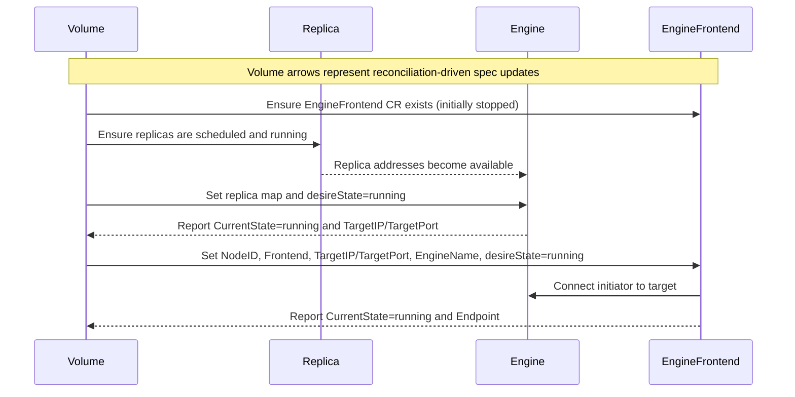
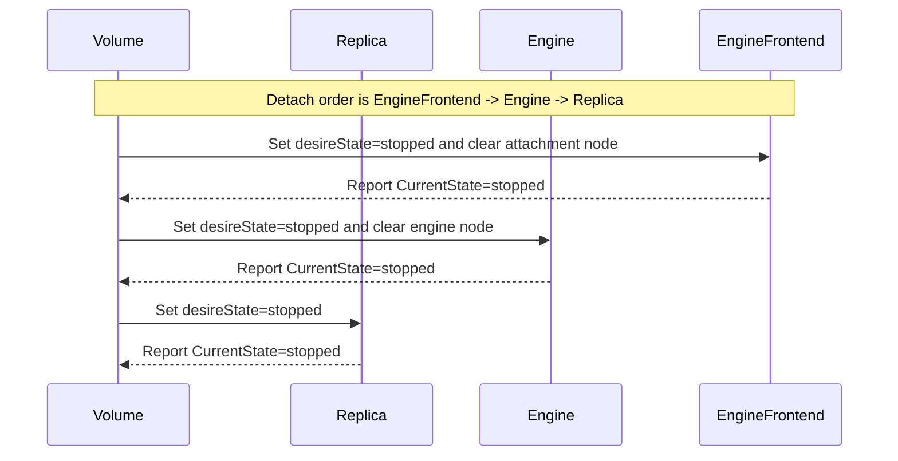
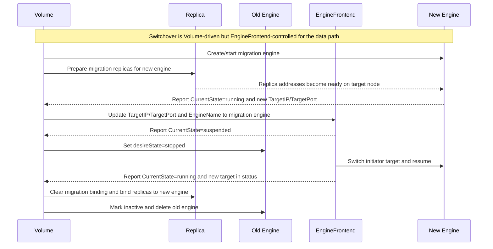
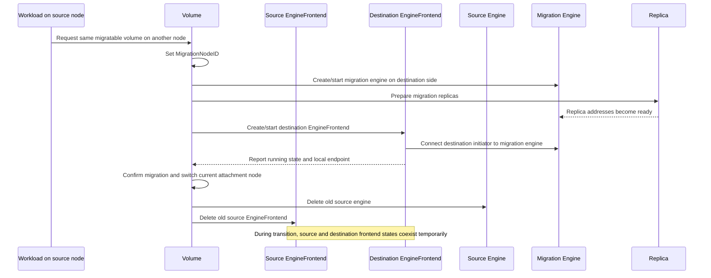

# LEP: Support Separating Initiator and Target onto Different Nodes for V2 Data Engine

## Status

Draft

## Authors

TBD

## Last Updated

2026-03-08

## Summary

This proposal enables the Longhorn v2 data engine to run its initiator and target on different nodes.

The key design change is to split the current v2 `Engine` responsibility into two control-plane objects with independent placement and lifecycle:

- `Engine` manages the v2 target.
- `EngineFrontend` manages the v2 initiator.

This separation is required for future v2 data engine live upgrade support. To upgrade an instance-manager without detaching attached v2 volumes, Longhorn must be able to move the target to another node while the initiator continues serving I/O on the attachment node.

With this split, `Volume` remains the top-level owner of desired state, `EngineFrontend` owns the initiator-side data path on the attachment node, `Engine` owns the target-side data path on the engine node, and `Replica` owns the backend storage copies. The main architectural benefit is that v2 can explicitly support cross-node placement of initiator and target while leaving the v1 data engine unchanged.

## Motivation

### Problem Statement

The original `Engine` CRD was designed around a model where one object represented the serving data path for a volume. That was sufficient for the v1 data engine, where the engine process both served the frontend and coordinated the backend on the same node.

That model does not fit the v2 data engine well. In v2, the target and the initiator are different concerns and may run on different nodes:

- The v2 target is exported by the SPDK engine on the engine node.
- The v2 initiator is created on the attachment node and is responsible for the local consumable endpoint.

The primary problem is **instance-manager live upgrade for the v2 data engine**. To upgrade the instance-manager on a node without detaching attached v2 volumes, Longhorn must be able to move the volume's target away from the node being upgraded while keeping the initiator on the attachment node. The upgrade sequence is:

1. For each v2 volume whose target is on the node being upgraded, switch the target (Engine) to a different node while the initiator (EngineFrontend) stays on the attachment node.
2. Once all targets have been moved off the node, the old instance-manager pod can be safely deleted.
3. A new instance-manager pod is created with the upgraded image.
4. After the upgraded instance-manager is running, targets can be moved back if needed.

This sequence requires the initiator and target to be modeled as separate objects with independent node placement and lifecycle. If both are bound to a single `Engine` object, there is no way to move the target to another node while the initiator continues serving I/O on the attachment node — the volume would have to be detached for the upgrade, causing workload disruption.

### Why EngineFrontend Is Needed

A dedicated `EngineFrontend` CRD gives the control plane a first-class object for the v2 initiator. This is what makes cross-node placement possible: the initiator can stay on the attachment node to keep serving I/O while the target is moved to another node. That same separation is what enables instance-manager live upgrade without detaching attached v2 volumes.

The split also matches the implementation boundary already present in the v2 stack:

- `longhorn-manager` has a dedicated `EngineFrontendController`.
- `longhorn-instance-manager` has a dedicated `engine-frontend` instance type.
- `longhorn-spdk-engine` has dedicated `EngineFrontend*` APIs and runtime objects.
- `go-spdk-helper` contains initiator-specific logic for NVMe/TCP, device-mapper, and ublk.

## Goals

- Support the v2 data engine initiator and target running on different nodes.
- Enable v2 instance-manager live upgrade without detaching attached volumes by allowing the target to move to another node while the initiator stays on the attachment node.
- Introduce a v2-only `EngineFrontend` CRD that represents the initiator side of the v2 data path.
- Keep `Engine` focused on the v2 target lifecycle.
- Make the frontend attachment node explicit and independent from the engine node.
- Make attach and detach ordering explicit.
- Make v2 engine target switchover frontend-aware.
- Expose the v2 consumable endpoint through `EngineFrontend`.
- Preserve v1 behavior.

## Non-Goals

- Redesign the v1 data engine.
- Remove existing frontend-related fields from `Engine` in the same change.
- Introduce multiple steady-state active frontends per volume.
- Redesign the user-facing Longhorn volume API beyond the minimal changes required for v2.

## Proposal

### Object Model

The new steady-state model for a v2 volume is:

- One active `Engine` object for the target.
- One active `EngineFrontend` object for the initiator.
- Multiple `Replica` objects for the backend data copies.

The initial scope keeps one active `EngineFrontend` per volume in steady state. `GenerateEngineFrontendNameForVolume(volumeName, currentEngineFrontendName)` produces numbered names in the pattern `{volumeName}-ef-{number}`. During live migration or cleanup, the datastore may temporarily contain extra `EngineFrontend` objects, but the intended steady state is a single active frontend per volume.

The control-plane object relationship can be visualized as follows:

```text
                     +----------------------+
                     |        Volume        |
                     |----------------------|
                     | desired attach state |
                     | attachment node      |
                     +----------+-----------+
                                |
                                v
                     +----------------------+      +----------------------+
                     |    EngineFrontend    |----->| data path initiator  |
                     |----------------------|      +----------------------+
                     | endpoint             |
                     | target connection    |
                     +----------+-----------+
                                |
                                | connects to
                                v
                     +----------------------+      +----------------------+
                     |        Engine        |----->|  data path target    |
                     |----------------------|      +----------------------+
                     | target IP / port     |
                     | replica address map  |
                     +----------+-----------+
                                |
                                | serves traffic to / coordinates
                                v
          +----------------+  +----------------+  +----------------+
          |   Replica 1    |  |   Replica 2    |  |   Replica 3    |
          |----------------|  |----------------|  |----------------|
          | backend copy   |  | backend copy   |  | backend copy   |
          +----------------+  +----------------+  +----------------+
```

### Responsibilities

| Object | Responsibility |
| --- | --- |
| `Engine` | Target-side lifecycle, replica address map, target IP/port, backend coordination, engine node placement |
| `EngineFrontend` | Initiator-side lifecycle, attachment node placement, local endpoint, target connection, suspend/resume, switchover, frontend-aware expansion and other initiator-mediated operations |

For v2, `Engine` becomes the target authority. `EngineFrontend` becomes the initiator authority.

### EngineFrontend API

The CRD is registered with short name `lhef` so that `kubectl get lhef` lists engine frontends. Kubebuilder print columns expose Data Engine, State, Node, InstanceManager, and Age. A status subresource separates spec and status updates, and a `longhorn.io` finalizer ensures graceful deletion.

`EngineFrontendSpec` contains the information needed to run the initiator:

- Embedded `InstanceSpec` (provides `VolumeName`, `VolumeSize`, `NodeID`, `Image`, `DesireState`, `DataEngine`, and other common instance fields)
- `Frontend` — the `VolumeFrontend` type (`blockdev`, `nvmf`, `ublk`, or empty)
- `UblkQueueDepth` — queue depth for the ublk frontend (optional, uses default if unset)
- `UblkNumberOfQueue` — number of queues for the ublk frontend (optional, uses default if unset)
- `TargetIP` — IP address of the v2 engine target
- `TargetPort` — port of the v2 engine target
- `EngineName` — name of the v2 engine target (used for instance creation and switchover)
- `DisableFrontend` — disables frontend creation (frontend type becomes empty)

`EngineFrontendStatus` contains the initiator-observed runtime state:

- Embedded `InstanceStatus` (provides `OwnerID`, `InstanceManagerName`, `CurrentState`, `IP`, `StorageIP`, `Port`, `UblkID`, `UUID`, `Conditions`, and other common instance fields)
- `Endpoint` — the device endpoint exposed to CSI (e.g. `/dev/longhorn/<volume>`)
- `TargetIP` — the currently connected engine target IP
- `TargetPort` — the currently connected engine target port

This gives the control plane separate desired and observed state for the initiator-side data path.

### Lifecycle

In the following interaction diagrams, arrows from `Volume` mean spec or status transitions triggered by the volume reconciliation flow. The actual API updates are performed by the volume controller and the `EngineFrontendController`, but `Volume` is used as the control-plane anchor so the object relationship is easier to read.

#### Creation and Attach

1. When a v2 volume is reconciled, Longhorn creates an `EngineFrontend` CR in the stopped state.
2. The `Engine` target is created and started first.
3. After the `Engine` is running and reports a reachable target IP and port, the volume controller updates the `EngineFrontend` with:
   - the attachment node
   - frontend settings
   - target IP and port
   - engine name
   - desired state `running`
4. The `EngineFrontendController` creates the initiator instance by calling instance-manager with instance type `engine-frontend`.
5. The `EngineFrontend` monitor updates the frontend endpoint and publishes it through the Longhorn API.
6. CSI uses the `EngineFrontend` endpoint for v2 node stage and node publish.

This ordering ensures the initiator is never started before the target exists.

During attach, `Volume` first drives `Replica` and `Engine` into a runnable backend state, then uses the running `Engine` target information to start `EngineFrontend`. `EngineFrontend` does not become runnable until the `Engine` target is already reachable.



#### Detach

Detach ordering for v2 becomes:

1. Stop `EngineFrontend`
2. Stop `Engine`
3. Stop `Replica`

The volume controller waits for the `EngineFrontend` to stop before stopping the target. This prevents the local initiator from continuing to point to a disappearing target.

During detach, the key rule is that `EngineFrontend` must stop first. Only after the frontend is no longer connected does `Volume` stop `Engine`, and only after the target is stopped does `Volume` stop `Replica`.



#### Engine Switchover

The currently implemented manager-driven v2 engine switchover flow is the attached `blockdev` frontend case. It is driven by the volume controller through `EngineFrontend`, using a two-phase approach in the `EngineFrontendController`:

1. The volume controller prepares a migration engine on the target engine node and waits for it to become runnable with a reachable IP.
2. The volume controller updates `EngineFrontend.Spec.TargetIP`, `TargetPort`, and `EngineName` to point at the migration engine, then returns and waits.
3. **Phase 1 (Suspend):** The `EngineFrontendController` detects the spec target change while `CurrentState` is `running`. It calls `EngineFrontendSuspend` and returns. The instance monitor reports `CurrentState = suspended` on the next poll, which triggers the next reconcile.
4. The volume controller sees `CurrentState = suspended` and sets the old engine's `DesireState` to `stopped`. I/O is paused at the device-mapper layer so there are no reconnect retries to the dying target.
5. **Phase 2 (Switchover + Resume):** On the next reconcile, the `EngineFrontendController` sees `CurrentState = suspended` with a target change still pending. It calls `EngineFrontendSwitchOverTarget` followed by `EngineFrontendResume`. On success, `Status.TargetIP` and `Status.TargetPort` are updated to reflect the new target.
6. Once `EngineFrontend.Status` reflects the new target, the volume controller finalizes the switchover: the migration engine becomes the current engine (marked active), replicas are rebound, `CurrentEngineNodeID` is updated, and the old engine is deleted.

If switchover fails during Phase 2, the controller attempts to resume the frontend back to the old target. If the spec target is reverted while the frontend is suspended, the controller simply resumes without performing a switchover.

The volume controller also has a revert path: if the migration engine enters an unexpected state, the volume controller restores the `EngineFrontend` spec target back to the current (old) engine and clears migration state.

This two-phase design is the core reason the initiator needs its own CRD: target switchover must coordinate between the volume controller (which drives the engine lifecycle) and the frontend controller (which drives the data-path suspension and reconnection).

During switchover, `Volume` temporarily coordinates both the current and migration target paths. The sequence below shows the block-path switchover case: `Volume` creates the migration `Engine`, prepares `Replica` for that new target, redirects `EngineFrontend`, and only after the frontend is safely suspended does the old `Engine` stop.



#### V2 Data Engine Live Migration

The v2 data engine live migration flow is built on top of the same initiator/target split, but the goal is different from ordinary target switchover.

- **Engine switchover** moves the current v2 target from one node to another while the attached workload keeps using the same initiator on the same attachment node.
- **V2 live migration** moves the attached workload from one node to another, so the destination side must get both a migration target and a destination-side initiator.

In other words, `EngineFrontend` is required not only for target switchover but also for live migration, because the destination attachment node needs its own initiator-side object and endpoint rather than reusing the old node's frontend state.

At a high level, the live migration sequence is:

1. A second CSI attachment ticket requests the same migratable v2 volume on another node.
2. The volume attachment controller sets `MigrationNodeID` to that destination node.
3. The volume controller prepares a migration `Engine` and matching `Replica` set on the destination side.
4. Longhorn creates and starts a destination `EngineFrontend` that connects to the migration engine and exposes the local endpoint on the destination node.
5. After the destination `Engine` and `EngineFrontend` are both ready, migration is confirmed and the destination node becomes the new current attachment node.
6. The old `Engine`, old `EngineFrontend`, and temporary migration bindings are cleaned up.

The critical point is that live migration needs a second initiator-side object on the destination node. Unlike target switchover, where one existing `EngineFrontend` reconnects to a new target, live migration temporarily requires both source-side and destination-side frontend state during the transition window.



This proposal does not introduce a separate `EngineFrontend` live-migration-specific CRD or workflow object. The key requirement is that live migration can create and manage destination initiator state explicitly, instead of treating the v2 frontend as an implicit field inside `Engine`.

### Frontend Modes

`EngineFrontend` supports the v2 frontend modes already present in the runtime stack. The CRD uses the `VolumeFrontend` names from the volume spec, which are mapped to SPDK-level frontend strings by `GetEngineInstanceFrontend()`:

| `VolumeFrontend` (CRD) | SPDK Frontend String | Current Implementation Notes |
| --- | --- | --- |
| `blockdev` | `spdk-tcp-blockdev` | NVMe/TCP initiator with a dm-linear endpoint exposed as `/dev/longhorn/<volume>`. This is the frontend with full manager-driven attach, suspend/resume, switchover, and online expansion support today. |
| `nvmf` | `spdk-tcp-nvmf` | Exposes an NVMe-oF endpoint string, not a local block device. The SPDK runtime has direct target-update logic for this mode, but the current manager-driven switchover flow is not wired for it because the controller always enters a suspend-first sequence. |
| `ublk` | `ublk` | Uses a ublk-backed initiator and still exposes the CSI endpoint as `/dev/longhorn/<volume>`. Queue depth and queue count are supported, but suspend/resume, manager-driven switchover, and online expansion are not implemented today. |
| `""` (empty) | `""` | No frontend exposure. |

Suspend and resume are implemented through device-mapper (`dmsetup suspend` / `dmsetup resume`) and are only available for the `blockdev` frontend in the current implementation. This is why the manager-side two-phase switchover flow is currently described as a `blockdev` path rather than a generic frontend-independent flow.

The CRD is the stable control-plane model. Frontend-specific mechanics remain in instance-manager, SPDK engine, and `go-spdk-helper`.

### Initiator-Mediated Operations

For the v2 data engine, several operations enter through `EngineFrontend` rather than directly through `Engine`:

- **Volume expansion** — the frontend suspends I/O, the engine expands RAID and replica logical volumes, and the frontend reconnects and syncs the dm-device size.
- **Snapshot create / delete / revert / purge** — delegated to the engine via RPC, but routed through the frontend proxy path so the correct instance name and address are used.
- **Replica add** — starts a background shallow-copy phase on the engine, then suspends the frontend before the finish phase to quiesce RAID I/O during the replica merge, and resumes after completion.
- **Backup create / status** — proxied through the frontend so that the proxy address points to the frontend's instance-manager rather than the engine's.

The reason is not that the target stops being important. The reason is that these operations may need to coordinate with the live initiator path, including endpoint updates, suspend/resume semantics, and correct proxy routing. The backend work still happens on the engine side, but the entry point for control becomes the frontend object.

The proxy layer in `longhorn-manager` uses `GetObjInfo(obj)` to extract the data engine, engine name, engine frontend name, and volume name from either an `*Engine` or an `*EngineFrontend` object. When the object is an `EngineFrontend`, the proxy routes the gRPC call to the frontend's instance-manager address and passes `engineFrontendName` to the instance-manager proxy, which in turn dispatches to the correct SPDK engine frontend RPC.

### Cross-Component Changes

The proposal requires coordinated changes across the v2 stack.

#### longhorn-manager

- **CRD and types**: Add the `EngineFrontend` CRD (`k8s/pkg/apis/longhorn/v1beta2/enginefrontend.go`), generated clients, informers, and listers. Add `InstanceTypeEngineFrontend = "engine-frontend"` to the instance type constants.
- **EngineFrontendController** (`controller/engine_frontend_controller.go`): Reconcile `EngineFrontend` objects, delegate instance lifecycle to the shared `InstanceHandler`, and manage the two-phase switchover (suspend in Phase 1, switchover+resume in Phase 2). Specific switchover failure types (`switchoverFailureSuspend`, `switchoverFailureSwitch`, `switchoverFailureSwitchAndResume`, `switchoverFailureResume`) are used for event recording.
- **EngineFrontendMonitor**: A per-frontend monitoring goroutine started when `CurrentState` becomes `running`. It polls via `EngineFrontendGet` at the engine poll interval, updates `Status.Endpoint`, and checks `Volume.Status.ExpansionRequired` to trigger expansion through the frontend proxy.
- **Datastore** (`datastore/longhorn.go`): CRUD operations (`CreateEngineFrontend`, `GetEngineFrontend`, `UpdateEngineFrontend`, `UpdateEngineFrontendStatus`, `DeleteEngineFrontend`, `RemoveFinalizerForEngineFrontend`), list operations (`ListEngineFrontends`, `ListVolumeEngineFrontendsRO`), and current-frontend selection logic (`GetVolumeCurrentEngineFrontend`, `GetCurrentEngineFrontendAndExtras`).
- **Volume controller** (`controller/volume_controller.go`): Create one active `EngineFrontend` per v2 volume in steady state, with temporary extra `EngineFrontend` objects possible during live migration or cleanup. Update volume reconciliation to start the target before the initiator and stop the initiator before the target (`closeVolumeDependentResources`). Check frontend readiness in `areVolumeDependentResourcesOpened`. Drive switchover via `processEngineSwitchover`. During `openVolumeDependentResources`, populate the frontend spec directly from the running engine status, skipping the target update when `isV2EngineSwitchoverInProgress`.
- **Live migration integration**: The same split also enables v2 migratable-volume live migration. During live migration, manager logic can create a destination `EngineFrontend` on the migration node, verify destination frontend readiness, and then switch the volume's current attachment node without reusing the source node's frontend state.
- **Proxy and engineapi**: Route v2 endpoint reporting through `EngineFrontend`. Add `EngineFrontendProxy` (`engineapi/engine_frontend_proxy.go`) wrapping `InstanceManagerClient` methods. Extend the `Proxy` type to accept `*EngineFrontend` objects for `VolumeExpand`, `VolumeSnapshot`, `SnapshotRevert`, `SnapshotPurge`, `SnapshotRemove`, `SnapshotBackup`, and `SnapshotBackupStatus`. Add `EngineFrontendInstanceCreate`, `EngineFrontendSwitchOverTarget`, `EngineFrontendSuspend`, and `EngineFrontendResume` to `InstanceManagerClient`, all gated on instance-manager API version ≥ 4.
- **Admission webhooks** (`webhook/resources/enginefrontend/`): A mutator that adds Longhorn labels, a `longhorn.io` finalizer, and defaults `DataEngine` to v2 if empty. A validator that ensures the referenced volume exists on create, only allows v2 data engine, and prevents `DataEngine` changes on update.
- **API and CSI**: Expose `EngineFrontends` (node ID and endpoint) in the volume API response (`api/model.go`). CSI node server uses the `EngineFrontend` endpoint for v2 volume stage and publish operations.

#### longhorn-instance-manager

- Add instance type `engine-frontend` (`pkg/types/types.go`).
- Add `EngineFrontendCreateRequest` struct containing `Frontend`, `UblkQueueDepth`, `UblkNumberOfQueue`, `TargetAddress`, and `EngineName`.
- Handle `engine-frontend` in `InstanceCreate`: populate `SpdkInstanceSpec` with frontend-specific fields and set `TargetAddress` / `EngineName` on the instance spec.
- Route `InstanceSuspend`, `InstanceResume`, and `InstanceSwitchOverTarget` calls to the SPDK service for `engine-frontend` instances.
- Extend proxy snapshot and backup paths to pass `engineFrontendName` to the SPDK service, so that operations like `VolumeSnapshot`, `SnapshotRevert`, `SnapshotPurge`, `SnapshotRemove`, `SnapshotBackup`, and `SnapshotBackupStatus` are dispatched to the frontend when the caller provides an engine frontend name.

#### longhorn-spdk-engine

- Add `EngineFrontend` runtime struct (`pkg/spdk/enginefrontend.go`) with fields for NVMe/TCP and ublk sub-frontends, operation guards (`isCreating`, `isSwitchingOver`, `isReplicaAdding`, `isExpanding`), and an update broadcast channel.
- Implement the full set of `SPDKService` gRPC methods: `EngineFrontendCreate`, `EngineFrontendDelete`, `EngineFrontendGet`, `EngineFrontendList`, `EngineFrontendWatch`, `EngineFrontendSuspend`, `EngineFrontendResume`, `EngineFrontendExpand`, `EngineFrontendSwitchOver`, `EngineFrontendReplicaAdd`, and `EngineFrontendSnapshotCreate`/`Delete`/`Revert`/`Purge`.
- Maintain frontend runtime state separately from engine target state, including per-mode sub-structs (`NvmeTcpFrontend` with `TargetIP`, `TargetPort`, `Nqn`, `Nguid`; `UblkFrontend` with `UblkQueueDepth`, `UblkNumberOfQueue`, `UblkID`).
- Persist frontend metadata (`EngineFrontendRecord`) to `<metadataDir>/enginefrontends/<volumeName>/enginefrontend.json` using atomic write (write to `.tmp` then rename). Recovery on SPDK engine restart loads persisted records, recreates `EngineFrontend` structs in `pending` state, and runs `RecoverFromHost` which discovers existing NVMe devices on the host (for blockdev) or reconstructs metadata (for nvmf) to restore the frontend to `running` state. If recovery fails, the frontend enters `error` state and the manager-side controller reconciles via delete and recreate.
- Implement switchover with automatic rollback: if the new NVMe initiator connection fails, the SPDK engine restores the old NQN/NGUID and reconnects to the previous target. Dedicated error types (`ErrSwitchOverTargetInvalidInput`, `ErrSwitchOverTargetPrecondition`, `ErrSwitchOverTargetEngineNotFound`, `ErrSwitchOverTargetInternal`) are returned to the controller.
- Run a periodic validation loop (`ValidateAndUpdate`) that checks initiator device state and detects disconnections.

#### go-spdk-helper

- Provide the `Initiator` struct (`pkg/initiator/initiator.go`) with NVMe/TCP and ublk sub-types.
- Implement NVMe/TCP operations: `DiscoverNVMeTCPTarget`, `ConnectNVMeTCPTarget`, `DisconnectNVMeTCPTarget`, `WaitForNVMeTCPConnect`, device discovery via `LoadNVMeDeviceInfo` and `GetDevices`.
- Implement device-mapper operations (`pkg/util/dmsetup.go`): `DmsetupCreate`, `DmsetupSuspend`, `DmsetupResume`, `DmsetupReload`, `DmsetupRemove`, `DmsetupDeps`, `DmsetupInfo`. `Suspend` and `Resume` on the `Initiator` wrap these calls.
- Implement ublk operations (`pkg/spdk/client/ublk.go`): `UblkStartDisk`, `UblkStopDisk`, `UblkGetDisks`. Ublk ID allocation (`pkg/initiator/ublk_id_generator.go`) manages IDs in the range 1–65535.
- Define shared frontend constants (`pkg/types/types.go`): `FrontendSPDKTCPBlockdev = "spdk-tcp-blockdev"`, `FrontendSPDKTCPNvmf = "spdk-tcp-nvmf"`, `FrontendSPDKUblk = "ublk"`, along with NVMe connection parameters (`DefaultCtrlrLossTimeoutSec`, `DefaultReconnectDelaySec`, `DefaultFastIOFailTimeoutSec`, `DefaultKeepAliveTimeoutMs`) and ublk defaults (`DefaultUblkQueueDepth = 128`, `DefaultUblkNumberOfQueue = 1`).

#### longhorn-types

- Add `EngineFrontend` protobuf message (`protobuf/spdkrpc/spdk.proto`) with fields: `name`, `volume_name`, `spec_size`, `actual_size`, `frontend`, `target_ip`, `target_port`, `endpoint`, `state`, `error_msg`, `ublk_id`, `uuid`, `engine_name`, `engine_ip`.
- Add request messages: `EngineFrontendCreateRequest` (with `name`, `volume_name`, `engine_name`, `spec_size`, `target_address`, `frontend`, `ublk_queue_depth`, `ublk_number_of_queue`), `EngineFrontendDeleteRequest`, `EngineFrontendGetRequest`, `EngineFrontendSuspendRequest`, `EngineFrontendResumeRequest`, `EngineFrontendExpandRequest`, `EngineFrontendSwitchOverRequest`, `EngineFrontendReplicaAddRequest`, and `EngineFrontendListResponse`.
- Add all `EngineFrontend*` RPC methods to the `SPDKService` service definition.
- Extend instance-manager protobuf (`protobuf/imrpc/instance.proto`): add `target_address`, `engine_name` fields to `InstanceSpec`; add `ublk_id`, `uuid`, `engine_name` fields to `InstanceStatus`; add `InstanceSuspend`, `InstanceResume`, and `InstanceSwitchOverTarget` RPCs to the `InstanceService`.

### Compatibility and API Evolution

This proposal is v2-only. The v1 data engine behavior is unchanged.

To reduce churn and preserve compatibility during transition:

- Existing frontend-related fields in `EngineSpec` and `EngineStatus` may remain for now.
- For v2, those fields are no longer the authoritative initiator state.
- `EngineFrontend` becomes the authoritative source for the v2 frontend endpoint and target connection state.
- The Longhorn volume API exposes `engineFrontends`, and CSI should prefer the `EngineFrontend` endpoint for v2 volumes.

Removing obsolete frontend fields from `Engine` should be handled in a separate cleanup proposal after the split is stable.

## Upgrade Strategy

The upgrade uses a **controller-driven lazy creation** model rather than a dedicated migration script. There is no `EngineFrontend`-specific step in the `upgrade/` version migration path. Instead, the volume controller creates `EngineFrontend` objects for existing v2 volumes during normal reconciliation after the upgraded longhorn-manager starts.

### CRD Installation

The `EngineFrontend` CRD must be installed before the upgraded longhorn-manager starts. This is handled by the Helm chart or operator, which installs CRDs before deploying the manager DaemonSet.

### Lazy Creation in the Volume Controller

The `reconcileVolumeCreation` function in the volume controller handles both new volume creation and upgrade-time backfill with the same code path:

1. The volume controller lists `EngineFrontend` objects for each v2 volume.
2. If a v2 volume has no `EngineFrontend` (`len(efs) == 0`), the controller calls `createEngineFrontend(v, "", e.Name, v.Status.CurrentNodeID)`, which creates a stopped `EngineFrontend` CR named `{volumeName}-ef-0` with the volume's current spec (frontend mode, ublk settings, engine name, disable-frontend flag).
3. For **attached volumes**: in the same reconcile cycle, `openVolumeDependentResources` detects that the `Engine` is already running with a reachable IP. It populates the `EngineFrontend` spec with `TargetIP`, `TargetPort`, `EngineName`, attachment `NodeID`, and sets `DesireState = running`. The `EngineFrontendController` then creates the runtime initiator instance via instance-manager.
4. For **detached volumes**: the `EngineFrontend` stays in `DesireState = stopped` until the next attach, at which point the normal attach flow starts it.

This means every v2 volume gets an `EngineFrontend` on its first reconcile after upgrade, with no manual intervention and no separate migration job.

### Prerequisites

`EngineFrontend` creation requires instance-manager API version 4 or later. The upgraded instance-manager and SPDK engine images must be deployed alongside the new longhorn-manager so that `engine-frontend` instance creation and switchover operations are available when the `EngineFrontendController` starts managing runtime instances.

## User Stories

### User Story 1

As a Longhorn operator upgrading instance-manager on a node, I want the v2 volume targets on that node to be moved to other nodes while the initiators continue serving I/O, so that the instance-manager pod can be replaced with a new image without detaching any v2 volumes.

### User Story 2

As a Longhorn user attaching a v2 volume to a workload node, I want the local endpoint to be managed independently from the backend target so that the data path reflects the real runtime topology.

### User Story 3

As Longhorn, I want to switch a v2 volume from one engine target to another without exposing the application node directly to backend target teardown timing.

### User Story 4

As CSI, I want a stable endpoint source for v2 volumes so that stage and publish operations use the initiator-owned endpoint rather than a target-owned field.

## Test Plan

- Add unit tests for `EngineFrontendController` create/delete/start/stop behavior.
- Add unit tests for phased target switchover, including revert paths.
- Add integration tests for attach and detach ordering: `EngineFrontend -> Engine -> Replicas`.
- Add integration tests for v2 endpoint propagation through the API and CSI.
- Add SPDK and instance-manager tests for:
  - frontend create/delete/get/list/watch
  - suspend/resume
  - target switchover
  - recovery after restart
  - snapshot, expansion, and replica-add entry through `EngineFrontend`
- Add upgrade tests from a build without `EngineFrontend` to a build with `EngineFrontend`.
- Add live-migration tests that create a destination `EngineFrontend`, verify both migration engine and destination frontend readiness, confirm migration, and clean up the old frontend after node handoff.

## Risks and Mitigations

### Risk 1: Split-Brain Ownership Between Engine and EngineFrontend

If `Engine` and `EngineFrontend` drift, Longhorn could expose the wrong endpoint or switch against the wrong target.

Mitigation:

- Keep `Engine` authoritative for target lifecycle.
- Keep `EngineFrontend` authoritative for frontend lifecycle and endpoint.
- Use explicit target fields in `EngineFrontend.Spec` and observed target fields in `EngineFrontend.Status`.

### Risk 2: Attach or Detach Ordering Regressions

If the initiator starts too early or stops too late, attach and detach could race with target availability.

Mitigation:

- Encode explicit ordering in the volume controller.
- Wait for `Engine` readiness before starting `EngineFrontend`.
- Wait for `EngineFrontend` stop before stopping `Engine`.

### Risk 3: Restart Recovery Complexity

The initiator path may survive process restart and must be rediscovered safely.

Mitigation:

- Persist frontend metadata in the SPDK engine.
- Recover initiator state from host-visible devices and reconnect status after restart.

### Risk 4: Live Migration Depends on Correct Destination Frontend Handling

If destination `EngineFrontend` creation, readiness detection, or cleanup is incorrect, v2 live migration could confirm too early, use the wrong node-local endpoint, or leave stale initiator objects behind after migration.

Mitigation:

- Treat live migration as a workflow that must explicitly manage destination `EngineFrontend` lifecycle, not just destination `Engine` lifecycle.
- Require migration confirmation to depend on both destination `Engine` and destination `EngineFrontend` readiness.
- Add dedicated live-migration tests that validate destination endpoint creation, confirmation gating, and old frontend cleanup.
