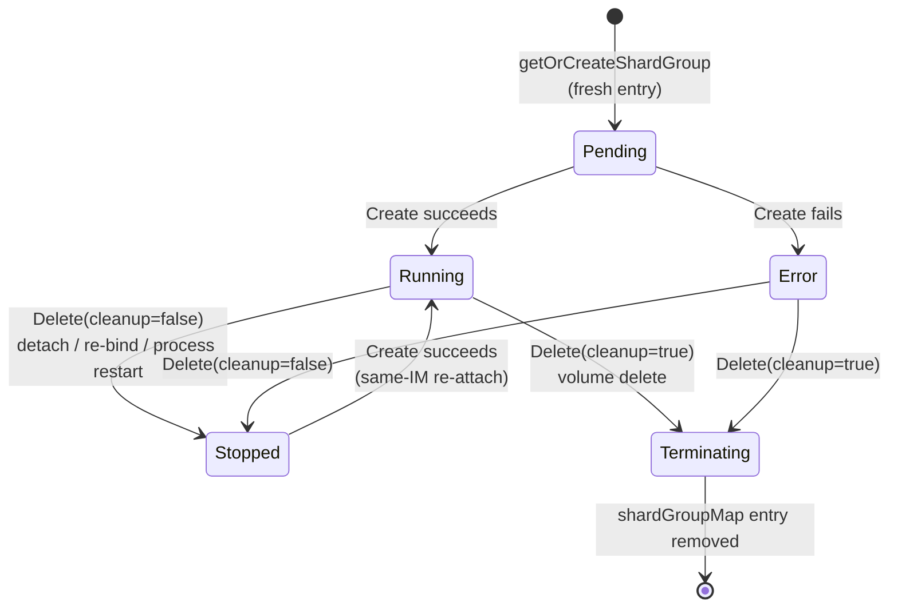

# V2 Sharding

This document provides a detailed proposal and design for the Longhorn V2 sharding feature - erasure coded storage with Reed-Solomon coded data distribution across multiple physical devices.

<!-- START doctoc generated TOC please keep comment here to allow auto update -->
<!-- DON'T EDIT THIS SECTION, INSTEAD RE-RUN doctoc TO UPDATE -->
## Table of Contents

- [Summary](#summary)
  - [Related Issues](#related-issues)
- [Reviewer's overview](#reviewers-overview)
  - [Topology in one picture](#topology-in-one-picture)
  - [Six load-bearing design decisions](#six-load-bearing-design-decisions)
  - [Reading paths by role](#reading-paths-by-role)
- [Motivation](#motivation)
  - [Goals](#goals)
  - [Non-goals](#non-goals)
- [Proposal](#proposal)
  - [SPDK Proposal 1 - EC Full-Stripe write (7-Layered stack)](#spdk-proposal-1---ec-full-stripe-write-7-layered-stack)
  - [SPDK Proposal 2 - EC Read-Modify-Write (4-Layered stack)](#spdk-proposal-2---ec-read-modify-write-4-layered-stack)
  - [Decision](#decision)
  - [User Stories](#user-stories)
    - [Story 1: Reduced Storage Cost](#story-1-reduced-storage-cost)
    - [Story 2: Online Expansion](#story-2-online-expansion)
    - [Story 3: Disk Failure and Rebuild](#story-3-disk-failure-and-rebuild)
  - [User Experience In Detail](#user-experience-in-detail)
- [Design](#design)
  - [SPDK Implementation Overview](#spdk-implementation-overview)
    - [Threading model](#threading-model)
    - [Mental model: layout and the three maps](#mental-model-layout-and-the-three-maps)
    - [Async bdev_ec_create](#async-bdev_ec_create)
    - [How data is laid out:](#how-data-is-laid-out)
    - [How address translation works through the stack:](#how-address-translation-works-through-the-stack)
    - [How reads work:](#how-reads-work)
    - [How write works](#how-write-works)
      - [Counters](#counters)
    - [Dirty bitmap details](#dirty-bitmap-details)
    - [Crash safety of the dirty bitmap](#crash-safety-of-the-dirty-bitmap)
    - [WIB on-disk layout](#wib-on-disk-layout)
    - [Front-placed metadata: WIB and unmapped bitmap share a layout](#front-placed-metadata-wib-and-unmapped-bitmap-share-a-layout)
    - [WIB region granularity and sizing](#wib-region-granularity-and-sizing)
      - [The region size is fixed at 1024 stripes per bit](#the-region-size-is-fixed-at-1024-stripes-per-bit)
        - [Why 1024?](#why-1024)
      - [Maximum volume size](#maximum-volume-size)
        - [About `strip_size_kb`](#about-strip_size_kb)
        - [How k and m affect WIB sizing](#how-k-and-m-affect-wib-sizing)
        - [How to choose k, m, and strip_size](#how-to-choose-k-m-and-strip_size)
        - [Recommended configurations by volume size](#recommended-configurations-by-volume-size)
    - [WIB persist lifecycle](#wib-persist-lifecycle)
    - [Startup scrub:](#startup-scrub)
    - [How UNMAP works (capacity reclamation)](#how-unmap-works-capacity-reclamation)
      - [Why a persistent unmapped bitmap](#why-a-persistent-unmapped-bitmap)
      - [On-disk layout of the unmapped bitmap](#on-disk-layout-of-the-unmapped-bitmap)
      - [Setting a stripe unmapped (UNMAP path)](#setting-a-stripe-unmapped-unmap-path)
      - [Split dispatcher (unaligned multi-stripe)](#split-dispatcher-unaligned-multi-stripe)
      - [Reading an unmapped stripe (correctness-critical)](#reading-an-unmapped-stripe-correctness-critical)
      - [Writing into an unmapped stripe (clearing a bit)](#writing-into-an-unmapped-stripe-clearing-a-bit)
      - [Bit-clear waiter queue](#bit-clear-waiter-queue)
      - [Scrub and rebuild skip unmapped stripes (optimization)](#scrub-and-rebuild-skip-unmapped-stripes-optimization)
      - [Concurrency](#concurrency)
      - [Resize](#resize)
      - [Native WRITE_ZEROES path](#native-write_zeroes-path)
      - [Counters](#counters-1)
    - [IO splitting](#io-splitting)
    - [Why splitting is necessary](#why-splitting-is-necessary)
    - [EC bdev operation states:](#ec-bdev-operation-states)
    - [How disk failure is handled:](#how-disk-failure-is-handled)
    - [NVMe-oF transient failure vs permanent disk failure](#nvme-of-transient-failure-vs-permanent-disk-failure)
    - [Shard node reboot vs permanent disk failure](#shard-node-reboot-vs-permanent-disk-failure)
    - [How disk replacement and rebuild work:](#how-disk-replacement-and-rebuild-work)
    - [How foreground writes and rebuild interact:](#how-foreground-writes-and-rebuild-interact)
    - [How in-place resize works (same k/m, bigger disks):](#how-in-place-resize-works-same-km-bigger-disks)
    - [How snapshot work with the EC stack:](#how-snapshot-work-with-the-ec-stack)
      - [EC snapshot implementation: ShardGroup-local lvol operations (not per-shard, not engine-local)](#ec-snapshot-implementation-shardgroup-local-lvol-operations-not-per-shard-not-engine-local)
    - [How teardown works:](#how-teardown-works)
    - [How crash recovery works (end-to-end):](#how-crash-recovery-works-end-to-end)
  - [Longhorn Data-plane Implementation Overview](#longhorn-data-plane-implementation-overview)
    - [Engine role for EC volumes (clarification)](#engine-role-for-ec-volumes-clarification)
    - [Bdev stack construction:](#bdev-stack-construction)
      - [Engine layout dispatch](#engine-layout-dispatch)
    - [Health event propagation](#health-event-propagation)
    - [Shard status propagation (control-plane <-> data-plane)](#shard-status-propagation-control-plane---data-plane)
      - [Two-stage flow: push (event) + pull (state)](#two-stage-flow-push-event--pull-state)
    - [Startup and crash recovery:](#startup-and-crash-recovery)
  - [Longhorn Control-plane Implementation Overview](#longhorn-control-plane-implementation-overview)
    - [CRD layering and responsibilities](#crd-layering-and-responsibilities)
      - [Linkage between CRs](#linkage-between-crs)
    - [New CRD](#new-crd)
    - [Volume controller EC mode detection](#volume-controller-ec-mode-detection)
    - [CRD validation (webhook)](#crd-validation-webhook)
    - [ShardGroup controller architecture](#shardgroup-controller-architecture)
    - [Engine node selection](#engine-node-selection)
    - [Scheduling (shard placement)](#scheduling-shard-placement)
    - [Orphaned shard instance cleanup](#orphaned-shard-instance-cleanup)
    - [Failure recovery (ShardGroup controller reconcile path):](#failure-recovery-shardgroup-controller-reconcile-path)
    - [Fast-path for intentional Shard CR deletion (`ShardGroupShardForceFail`)](#fast-path-for-intentional-shard-cr-deletion-shardgroupshardforcefail)
    - [EC volume creation - end-to-end round-trip](#ec-volume-creation---end-to-end-round-trip)
    - [EC volume detach - end-to-end round-trip](#ec-volume-detach---end-to-end-round-trip)
    - [EC volume re-attach to a previously-bound node - end-to-end round-trip](#ec-volume-re-attach-to-a-previously-bound-node---end-to-end-round-trip)
    - [EC volume deletion - end-to-end round-trip](#ec-volume-deletion---end-to-end-round-trip)
    - [EC shard failure - end-to-end round-trip](#ec-shard-failure---end-to-end-round-trip)
    - [EC volume expansion - end-to-end round-trip](#ec-volume-expansion---end-to-end-round-trip)
    - [EC engine restart and FrontendSwitchOver](#ec-engine-restart-and-frontendswitchover)
    - [EC snapshot operations - end-to-end round-trip](#ec-snapshot-operations---end-to-end-round-trip)
    - [Auto-salvage for EC volumes](#auto-salvage-for-ec-volumes)
    - [ShardGroup instance restart - end-to-end round-trip](#shardgroup-instance-restart---end-to-end-round-trip)
    - [Shard eviction and node drain](#shard-eviction-and-node-drain)
    - [Volume expansion (resize, same k+m)](#volume-expansion-resize-same-km)
      - [Three-way comparison of expansion mechanisms](#three-way-comparison-of-expansion-mechanisms)
      - [SPDK patch dependency](#spdk-patch-dependency)
    - [Volume.Status.Robustness mapping](#volumestatusrobustness-mapping)
    - [spec.dataLayout](#specdatalayout)
    - [Volume Deletion](#volume-deletion)
  - [Test plan](#test-plan)
  - [Upgrade strategy](#upgrade-strategy)
- [API changes](#api-changes)
  - [SPDK JSON-RPC](#spdk-json-rpc)
  - [go-spdk-helper](#go-spdk-helper)
    - [New type definition (`pkg/spdk/types/ec.go`)](#new-type-definition-pkgspdktypesecgo)
    - [New client methods (`pkg/spdk/client/ec.go`)](#new-client-methods-pkgspdkclientecgo)
    - [New CLI commands (`app/cmd/basic/bdev_ec.go`)](#new-cli-commands-appcmdbasicbdev_ecgo)
    - [New `bdev_nvme_reset_controller` wrapper](#new-bdev_nvme_reset_controller-wrapper)
    - [longhorn spdk-engine gRPC (`spdkrpc.SPDKService`)](#longhorn-spdk-engine-grpc-spdkrpcspdkservice)
    - [longhorn-instance-manager changes](#longhorn-instance-manager-changes)
    - [Proxy service impact](#proxy-service-impact)
    - [Disk service impact](#disk-service-impact)
    - [longhorn-manager changes](#longhorn-manager-changes)
- [Known implementation gaps in initial release](#known-implementation-gaps-in-initial-release)
- [Current limitation](#current-limitation)
- [Future improvements](#future-improvements)

<!-- END doctoc generated TOC please keep comment here to allow auto update -->

## Summary

Longhorn V2 currently replicates entire volumes via RAID1 across nodes - each replica stores a full copy of the data. This provides simple fault tolerance but requires Nx the physical storage capacity (N full copies for N-way replication).

V2 Sharding aims to provide a new storage tier option with erasure coding (EC). A k+m EC configuration splits data into k data chunks and m parity chunks using Reed-Solomon coding (ISA-L). Any m simultaneous disk failures can be tolerated while storing only (k+m)/k times the original data. In contrast, full replication needs f+1 full copies to tolerate f failures. For example:
```
A 4+2 EC layer provides 2-failure tolerance using 6 devices at 1.5x storage overhead (150 GB raw for 100 GB usable), compared to 3-way replication with provides 2-failure tolerance using 3 devices overhead (300GB raw for 100GB usable).
```

This enhancement introduces a new SPDK bdev module (`bdev_ec`) that sits below the lvol/blobstore layer and above the base bdev layer, performing transparent erasure coding on all I/O. The EC bdev's base devices can be remote NVMe-oF attached bdevs on other nodes. This breaks the physical node boundary of the current replication model: instead of each node holding a full replica, chunks are distributed across nodes at the EC layer. Longhorn's control plane sees only a single volume and does not manage chunk placement - the cross-node distribution is entirely transparent at the SPDK layer.

Fault tolerance comes from Reed-Solomon coding across the distributed base devices.

### Related Issues

- https://github.com/longhorn/longhorn/issues/1061

## Reviewer's overview

This LEP spans SPDK internals, gRPC surfaces across four repos, and Longhorn control-plane orchestration. It is not designed to be read end-to-end. Use this section to orient and pick a reading path.

### Topology in one picture

```
            +----------+                +-------------+               +---------+
 workload --|  Engine  |--- raid1(1) ---| ShardGroup  |--- bdev_ec ---| Shard 0 |
            | (engine  |    NVMe-oF     |   process   |    over k+m   |   ...   |
            |  node)   |                |  (engine    |    NVMe-oF    |  Shard  |
            +----------+                |   node)     |     legs      |  k+m-1  |
                                        | lvstore +   |               +---------+
                                        | head lvol   |               (one per node;
                                        | live HERE   |                hard anti-affinity)
                                        +-------------+
```

- One Volume maps to one ShardGroup CR (1:1, same name), which maps to k+m Shard CRs.
- The lvstore and head lvol live on `bdev_ec` **inside the ShardGroup instance**, not on the engine. This is what makes detach data-preserving and engine teardown safe.
- The engine is structurally a single-replica raid1 aggregator over the ShardGroup endpoint. RAID1 and EC engines are byte-identical inside `SpdkInstanceSpec`; the only discriminator is `data_layout_type` on the gRPC request. See [Engine role for EC volumes](#engine-role-for-ec-volumes-clarification) for why the engine and its single-member raid1 are kept rather than exposing `bdev_ec` directly over NVMe-oF.

### Six load-bearing design decisions

1. **RMW-based EC, not full-stripe write.** A 4-layer stack (NVMe-oF -> lvol -> bdev_ec -> base bdevs) instead of the 7-layer FTL-on-top alternative. Accepts per-stripe RMW serialization as the cost of a simpler stack and a one-RPC online expansion path. See [Decision](#decision).

2. **Lvstore lives on `bdev_ec` inside a separate ShardGroup instance, not on the engine.** The engine owns no persistent state. Detach can destroy the engine without destroying the lvstore. See [Engine role for EC volumes](#engine-role-for-ec-volumes-clarification).

3. **Engine is layout-blind via an `Upstream` interface** with two implementations (`replicaUpstream` and `shardGroupUpstream`). One interface collapses around 10 dispatch sites. The interface has **no `Delete` method**, so the cleanup path cannot dispatch layout-aware tear-down by construction. See [Engine layout dispatch](#engine-layout-dispatch).

4. **`data_layout_type` lives on the gRPC request, never on `SpdkInstanceSpec`.** The delete path reads the spec, so keeping the discriminator off the spec guarantees the delete path cannot branch on layout. That is the structural fence against the detach data-loss bug that motivated this refactor. See [Engine layout dispatch](#engine-layout-dispatch) and [longhorn-instance-manager changes](#longhorn-instance-manager-changes).

5. **WIB + startup scrub is the engine-crash consistency contract.** Persistent write-intent bitmap on parity disks only, double-buffered, generation-numbered, CRC'd. Crash recovery re-encodes parity for marked regions before resuming. The contract is "no silent corruption", not "no data loss" - recovery of original intent is the responsibility of the layer above (filesystem journal, WAL). See [Dirty bitmap details](#dirty-bitmap-details) and [How crash recovery works](#how-crash-recovery-works-end-to-end).

6. **Two-role threading: home owns shared state, submitter owns base channels.** Foreground I/O dispatches on its submitter thread (the NVMe-oF poll-group thread the `bdev_io` arrived on); all shared `ec_bdev` state (rebuild, scrub, persist flags, bit-clear queues) is owned by the home thread. Cross-thread hops use `spdk_thread_send_msg`, resolving inline when already on the target thread. No locks; the invariant is "every shared field has one writing role." See [Threading model](#threading-model).

### Reading paths by role

| If you are reviewing... | Read in order |
|---|---|
| EC correctness in SPDK | [Decision](#decision) -> [SPDK Implementation Overview](#spdk-implementation-overview) through [How crash recovery works](#how-crash-recovery-works-end-to-end) |
| Engine + ShardGroup data plane | [Engine role for EC volumes](#engine-role-for-ec-volumes-clarification) -> [Bdev stack construction](#bdev-stack-construction) -> [Engine layout dispatch](#engine-layout-dispatch) |
| Longhorn control plane and CRDs | [CRD layering and responsibilities](#crd-layering-and-responsibilities) -> [New CRD](#new-crd) -> [ShardGroup controller architecture](#shardgroup-controller-architecture) -> [Failure recovery](#failure-recovery-shardgroup-controller-reconcile-path) |
| Lifecycle correctness | All "end-to-end round-trip" subsections, starting at [EC volume creation](#ec-volume-creation---end-to-end-round-trip) |
| Scope, gaps, what is not landing | [Known implementation gaps in initial release](#known-implementation-gaps-in-initial-release) -> [Future improvements](#future-improvements) |
| gRPC / proto surface only | [API changes](#api-changes); skip on first pass - read after the design sections |

## Motivation

### Goals

SPDK layout:
- Reduce storage overhead from 2-3x (RAID1 replication) to 1.25-1.5x (erasure coding) while having the same fault tolerance. Specifically: a 4+1 EC layer (1.25x overhead) tolerate 1 disk failure, matching 2-way replication (2x overhead); a 4+2 EC layout (1.5x overhead) tolerate 2 disk failures, matching 3-way replication (3x overhead).
- Support online capacity expansion (resize).
- Support hot-swap disk replacement and rebuild for failed disks.
- Support existing Longhorn features.

### Non-goals

- k -> k+1 grow (`bdev_ec_grow`). Adding a new data disk to an existing array would change the encode matrix, recompute parity for every stripe, and requires redistribution under quiesce.
- Resizing the WIB region granularity (`EC_WIB_REGION_STRIPES`). This constant is fixed at compile time (1024 stripes per bit). Making this tunable per-volume would require versioning the on-disk WIB header, handling regranularization during resize, and would not solve any current pain point - 1024 stripes/bit lands well on the size/scrub-cost tradeoff curve for any volume from gigabytes to hundreds of TiB. The maximum supported volume size at the default `strip_size=64` is ~128 TiB for a 4+2 array, with larger strip sizes pushing the limit into the petabyte range; see [WIB region granularity and sizing](#wib-region-granularity-and-sizing).
- Changing `strip_size_kb` after volume creation. The strip size is fixed at `bdev_ec_create` time and cannot be altered for the life of the volume. Every stripe on disk is laid out and parity-encoded against the original value, and the WIB region size derives from it, so changing it would require relocating every stripe, re-encoding every parity chunk against the new chunk boundaries, and rewriting the WIB header - this means an offline rewrite of the entire volume. The `bdev_ec_resize` path preserves `strip_size_kb` (resize is in-place - growing existing chunks, not redrawing them).

## Proposal

### SPDK Proposal 1 - EC Full-Stripe write (7-Layered stack)

Alternative considered and rejected. Places EC at the bottom of the stack and requires all writes to be aligned to full EC stripes, with an FTL bdev above the EC bdev absorbing unaligned writes via a RAID1 write cache that flushes full stripes to EC. Trades RMW complexity for stack depth (7 layers between NVMe-oF and disk), RAID-concat-based expansion, and harder debugging. Rejected in favor of Proposal 2 - see [Decision](#decision).

### SPDK Proposal 2 - EC Read-Modify-Write (4-Layered stack)

This approach moves the EC bdev to handle arbitrary I/O sizes directly using a read-modify-write (RMW) path for sub-stripe writes. SPDK's `split_on_optimal_io_boundary` splits incoming read/write I/O at chunk boundaries, so each post-split I/O the EC module sees spans at most one chunk. Full-stripe writes therefore arrive as k consecutive chunk-sized I/Os whose offsets cover a complete stripe; the EC module recognizes that pattern and takes the full-stripe path instead of RMW. (UNMAP splits at `max_unmap`, not `optimal_io_boundary` - see [How UNMAP works](#how-unmap-works-capacity-reclamation).)

For a sub-stripe write, the EC module reads all k data chunks for the target stripe, overlays the new payload in memory, re-encodes m parity chunks using ISA-L, and writes back. Full-stripe-aligned writes skip the read phase entirely.

**Pros**
- Flat stack: 4 layers. Simpler to debug, lower baseline latency.
- No upper-layer alignment constraints.
- Online expansion is simpler.
- Simpler SPDK sharding stack - no RAID concat for stitching multiple FTL address spaces together, no FTL write journal for stripe alignment. Capacity expansion is a single `bdev_ec_resize` operation rather than adding concat members.

**Cons**
- Every sub-stripe write requires reading k chunks, encoding, and writing 1+m chunks (the modified data chunk plus all parity chunks), regardless of payload size.
- Increased DMA memory pressure: each in-flight RMW holds n chunk buffers (~256 KB for 64 KB chunks, k=2, m=2).
- Only one sub-stripe write can be in flight per stripe at a time. A per-stripe dirty bitmap prevents concurrent RMW operations from corrupting each other's parity - if a second write targets the same stripe, it is requeued until the first completes. This limits write parallelism for small random writes hitting the same stripe.

### Decision

Proposal 2 is selected. The reduced stack complexity, simpler expansion path outweigh the RMW overhead.

### User Stories

#### Story 1: Reduced Storage Cost
By using EC sharding with a 4+2 configuration, the volume can achieve 2-disk fault tolerance at 1.5x overhead compared to a 3-replica volume.


#### Story 2: Online Expansion

A cluster needs to expand an existing EC volume without downtime. For the common case (same k/m, bigger disks), the cluster expands each shard's lvol and Longhorn calls `bdev_ec_resize`. The EC bdev capacity increases with no data movement and no I/O interruption.

#### Story 3: Disk Failure and Rebuild

A physical disk fails in a 2+2 EC array. The EC module detects the failure via SPDK's bdev remove event, transitions the slot to FAILED state, and continues service reads via ISA-L Reed-Solomon reconstruction from the surviving k disks. The administrator hot-swaps a replacement disk using `bdev_ec_replace_base_bdev`, then starts a background rebuild with `bdev_ec_start_rebuild`. The rebuild proceeds stripe-by-stripe while foreground I/O continues normally.

### User Experience In Detail

From the downstream user/application perspective, an EC sharded volume should be seem identical to a replicaed volume. It is a standard block device exposed via NVMe-oF and mounted by a Kubernetes pod. The user configures EC parameters (k, m, stripe size) at volume creation.

Volume lifecycle operation (snapshot, clone, resize, backup, restore) should work identically. The EC layer is transparent - it sits below the lvol/blobstore layer and above physical storage.

**Kubernetes CR model changes**

The current Longhorn V2 CR hierarchy is Volume -> Engine -> Replica, where each Replica CR represents a full copy of the volume. With EC sharding there are no full replicas - data is distributed as chunks across nodes. The CR model introduces two new resource types for EC volumes:

- **Volume CR:** gains `spec.dataLayout`, a struct (`{type, mode, dataChunks, parityChunks, stripSizeKB}`) that declares the user's intended data layout and, for EC volumes, the EC parameters. `type: sharded` activates EC mode; `type: replicated` activates RAID1 mode. The entire `spec.dataLayout` struct is **immutable after creation**. The Volume controller uses `spec.dataLayout.type` as the authoritative mode selector (see the [`spec.dataLayout`](#specdatalayout) section below).
- **Engine CR:** carries **no EC-specific spec or status fields**. For EC volumes, the engine consumes a single upstream endpoint (`ShardGroup.Status.{IP, Port, NQN}`) just as a single-replica RAID1 engine consumes one replica endpoint. The Engine controller's `CreateInstance` path passes that endpoint via the standard `replica_address_map` (one entry for EC), plus a `data_layout_type` field on `InstanceCreateRequest`/`EngineCreateRequest` (see [Engine layout dispatch](#engine-layout-dispatch) below) so the engine selects the correct upstream-RPC dispatch (`ReplicaGet` vs. `ShardGroupGet`, etc.). The engine builds a `bdev_raid1` aggregator over its upstream endpoint(s) - k+m for EC do **not** apply at the engine layer; the EC `bdev_ec_create` lives in the ShardGroup instance. `EngineCreate` is the source of truth for layout (via `data_layout_type` on the request); `spdkrpc.Engine` carries no `data_layout` field and `EngineGet` does not surface layout - the engine's running layout is derived from its concrete upstream type (`replicaUpstream` vs `shardGroupUpstream`). Per-slot health (NORMAL / FAILED / REPLACING) is observable on each child Shard CR's `Status.State` and aggregated on `ShardGroup.Status` (`FailedCount`, `RebuildInProgress`, `State`); it is not duplicated onto the Engine CR, and `EngineGet` does **not** return per-slot EC fields.
- **ShardGroup CR (new):** represents the EC array configuration for one volume. Contains k, m, strip_size, engine node, aggregate health state, and references to individual Shard CRs. One ShardGroup per EC volume. The ShardGroup controller watches ShardGroup CRs and is responsible for creating/deleting child Shard CRs, coordinating rebuild orchestration, and aggregating health state.
- **Shard CR (new):** represents one base device slot in the EC array. Contains the node, disk, slot index, role (data/parity), health state (normal/failed/replacing), storage IP, and NVMe-oF port. Each EC volume has k+m Shard CRs instead of 2-3 Replica CRs. The Shard CR lifecycle (create lvol -> expose via NVMe-oF -> attach on engine node -> monitor health -> replace on failure -> rebuild) mirrors the Replica CR lifecycle but with EC-specific state tracking.

## Design

**Terminology:**

- **Chunk**: A single unit of data stored on one disk within a stripe. In SPDK, this is referred to as `strip_size` following RAID conventions. This document uses "chunk" instead to avoid confusion with "stripe"
- **Stripe**: One full row across all k+m disks. Each stripe contains k data chunks and m parity chunks.
- **Slot**: A fixed position (0..k+m-1) in the EC array. It is baked into the Reed-Solomon encode matrix and is permanent for the volume's life.
- **User data (region)**: The part of each base disk below the front metadata (bitmap + WIB) that holds this disk's EC chunk per stripe - data chunks on data disks, parity chunks on parity disks. It is the EC payload, not strictly application data (parity disks hold parity).
- **RMW (read-modify-write)**: The sub-stripe write path - read the stripe's data chunks, overlay the new bytes, re-encode parity, write back.
- **WIB (write-intent bitmap)**: Persistent bitmap on the parity disks that marks regions where a parity write was in progress, so after a crash only those regions need scrubbing instead of the whole disk.
- **Scrub**: Background pass that re-encodes parity for WIB-dirty regions after a crash, making parity consistent with whatever data landed.
- **ShardGroup instance**: The bdev stack (`bdev_ec` + lvstore + head lvol + NVMe-oF export) for one EC volume - the EC equivalent of a Replica in RAID1. The InstanceManager runs it as an SPDK instance inside the node's shared `spdk_tgt`.
- **Engine**: The layout-blind `bdev_raid1` aggregator the workload connects to. It has one upstream for EC, N for RAID1, and owns no persistent state.
- **AER (asynchronous event request)**: The NVMe mechanism a target uses to notify a connected initiator of state changes, such as a namespace resize.

### SPDK Implementation Overview

The EC module implements a virtual SPDK bdev backed by k+m base bdevs. The base bdevs can be any SPDK bdev type. The module is registered as an SPDK bdev module and exposes its operations via JSON-RPC.

#### Threading model

`bdev_ec` is multi-reactor: every I/O path is bracketed by two thread roles.

- **Home thread.** The SPDK thread on which the EC bdev was created. Owns all shared `ec_bdev` state - rebuild, scrub, and resize contexts; persist flags; bit-clear queues - and the long-lived home-owned channels (`wib_chans`, `bitmap_chans`, `rebuild_chans`, `scrub_chans`). RPC handlers, pollers, and persist completion callbacks all run here.
- **Submitter thread.** The SPDK thread on which a `bdev_io` was issued (typically an NVMe-oF poll-group thread). Owns the per-thread `base_chans[]` used to dispatch child reads / writes / unmaps to the base bdevs; child completions land here too, since SPDK delivers each completion back on the channel-owning thread.

Entry points (read / write / UNMAP) route to home before touching shared state; fan-out dispatchers route to the submitter so child I/O is issued on the channel-owning thread; completion routes back to the submitter so the `bdev_io` completes there. Every cross-thread hop uses the same shape: inline call when the caller is already on the target thread, `spdk_thread_send_msg` otherwise.

**Channel counts.** Each channel set is sized differently: `base_chans[]` - one per thread that issues I/O; `wib_chans[]` - one per parity disk (the WIB is parity-mirrored); `bitmap_chans[]` - one per disk; `rebuild_chans[]` and `scrub_chans[]` - one per live slot during their respective background ops.

#### Mental model: layout and the three maps

Before the mechanisms, the picture they all refer back to. `bdev_ec` is a virtual bdev over k+m base bdevs. Two things anchor everything below: how each disk is laid out, and the three bit-maps the module keeps.

**On-disk layout (per base disk, uniform across all k+m).** Every disk reserves the same front region for metadata, then user data fills the rest. This is the canonical layout; later sections refer to it rather than redraw it.

```
+------------------------+-----+-----------+
| unmapped-bitmap region | WIB | user data |
+------------------------+-----+-----------+
```

- `unmapped-bitmap region` - raw-replicated, an identical copy on every disk.
- `WIB` - reserved on all disks, but written only on the parity disks.
- `user data` - the rest of the disk.

The front metadata is reserved once at create and never moves or grows on resize - only the user-data region grows. Exact sizes and offsets are in [Front-placed metadata](#front-placed-metadata-wib-and-unmapped-bitmap-share-a-layout).

**The three maps.** Keeping these straight is the key to the rest of the section - they have similar names but different jobs, lifetimes, and granularity.

| Map | Lives | One bit covers | Tracks | Detailed in |
|---|---|---|---|---|
| `stripe_dirty_map` | in-memory only | one stripe | "a write-side op (RMW, full-stripe write, UNMAP, or rebuild) currently owns this stripe" - the one-writer-per-stripe interlock | [Dirty bitmap details](#dirty-bitmap-details) |
| `stripe_unmapped_map` | persistent (front of every disk, raw-replicated, double-buffered) | one stripe | "this stripe is logically zero (unmapped)" - so reads return zeros without touching disk | [How UNMAP works](#how-unmap-works-capacity-reclamation) |
| `wib_region_map` (WIB) | persistent (front of parity disks, double-buffered) | 1024 stripes (a region) | "this region may have a parity-modifying write in flight" - the crash write-hole guard | [WIB on-disk layout](#wib-on-disk-layout) |

The first is a runtime interlock that vanishes on crash (safe - a crash kills the in-flight I/O it guarded). The other two are durable and are what crash recovery and UNMAP correctness rest on.

**The I/O paths, at a glance.** A read returns data from one disk (healthy) or rebuilds it from survivors + parity (degraded), and short-circuits to zeros for an unmapped stripe. A full-stripe write encodes parity from the new data and writes all k+m chunks. A sub-stripe write takes the read-modify-write (RMW) path. UNMAP flips the unmapped bit. The next sections walk each path in turn.

#### Async bdev_ec_create

`bdev_ec_create` is an asynchronous JSON-RPC: the handler returns without blocking on disk I/O, and the `true` response is delivered by a callback only after the EC bdev is fully initialized, including the WIB and unmapped-bitmap load from disk. This is deliberate - blocking the home thread to read the base disks synchronously would stall I/O for every other bdev on the system.

The synchronous setup runs first on the caller's stack (`ec_bdev_create_async`): allocate the `ec_bdev`, open the base descriptors, compute geometry, allocate the DMA and WIB buffers, and register the channels and the bdev. It then hands off to a non-blocking chain of callbacks that runs four steps in order:

1. `ec_wib_load_async` loads the WIB from the parity disks.
2. `ec_bitmap_load_async` loads the unmapped-stripe bitmap; on a fresh create it writes both slots to initialize one.
3. `ec_bdev_start_scrub` starts a background scrub if the WIB came back dirty.
4. `spdk_bdev_wait_for_examine` waits for the examine queue to drain.

**Initialization cost.** Most of the work is the unmapped-stripe bitmap I/O. Its on-disk size tracks the volume's current stripe count (not the fixed-max front reservation), so it is roughly `num_stripes / 8` bytes - rounded up to a whole strip, so never below one strip - with `num_stripes = volume_size / (k * strip_size)`. The WIB is far smaller: on disk each copy is a fixed one strip, regardless of volume size. Concretely, a 1 TiB 4+2 volume at the 64 KiB default has a ~512 KiB bitmap, and the ~128 TiB ceiling reaches ~64 MiB. On a fresh create the bitmap is read once and written to all n disks twice, while the WIB touches only the m parity disks; the cost is bounded by that byte volume plus a handful of NVMe-oF round-trips to the shards. This has not been benchmarked.

**Invariant:** The bdev is registered with the SPDK bdev layer before WIB loading begins (so it appears in `bdev_get_bdevs`), but is not yet safe to issue foreground writes against until WIB loading completes. In practice `bdev_ec_create` is always called before the lvol store and lvol are created on top of it, so no I/O is in flight during this window. If WIB loading fails, the bdev is unregistered and an error is returned.

#### How data is laid out:

Data is distributed across all k data disks in fixed size chunks (configurable). A stripe is one row across all disks - every disk holds exactly one chunk at each row, with no gaps. The k disks hold data chunks and the remaining m disks hold parity chunks, all the same size. Parity chunks are computed using ISA-L Reed-Solomon encoding over the k data chunks in the same row.

```
Example: k=2, m=2, chunk_size=32KB

             disk 0      disk 1      disk 2      disk 3
             (data 0)    (data 1)    (parity 0)  (parity 1)

stripe 0:   [32KB data]  [32KB data]  [32KB par]  [32KB par]
stripe 1:   [32KB data]  [32KB data]  [32KB par]  [32KB par]
stripe 2:   [32KB data]  [32KB data]  [32KB par]  [32KB par]

Every disk, every row - fully occupied. No wasted space.
Usable capacity = k / (k+m) = 50% of total raw storage.
```

<a id="slot-index-permanence"></a>**Slot index is permanent.** The position of a disk in `BaseBdevs[]` at `bdev_ec_create` time is its permanent slot assignment for the entire life of the volume. This is not a soft label - it is baked into the Reed-Solomon encode matrix.

ISA-L builds the encode matrix via `gf_gen_rs_matrix` once at `bdev_ec_create`. Each row of the matrix corresponds to one output chunk (data or parity). Each row carries its own set of multipliers, fixed by that row's slot index - so the parity on disk 2 combines the data chunks with one set of Galois-field weights, and the parity on disk 3 combines them with a different set. This mapping is fixed on-disk from the moment the first stripe is written.

Consequences:
- Two disks in the same EC bdev cannot be swapped without re-encoding every parity chunk on disk. Doing so silently corrupts all parity.
- A replacement disk (hot-swap via `bdev_ec_replace_base_bdev`) must occupy the **same slot index** as the disk it replaces. The rebuild writes reconstructed data for that slot to the new disk - slot identity is preserved.
- The control plane must **persist `slot_index`** in the Shard CR and pass it faithfully to every `ShardGroupCreate` and `ShardGroupShardReplace` call. It cannot be inferred from node or disk order at runtime, and `bdev_ec` stores none of it - it writes only the WIB and unmapped-bitmap headers, which record no slot, k/m, role, or membership. The shard's lvol name (`shard-<volumeName>-<slotIndex>`) does persist the volume and slot on its local lvstore, but it carries nothing else, and nothing reads it back for recovery (the restart scan parses it only to repopulate its in-memory cache). So the Shard CR (`Spec.SlotIndex`, immutable) is the authoritative record of the slot-to-disk binding (see [Future improvements](#future-improvements) for the disk-recovery gap).

#### How address translation works through the stack:

When an application writes to a mounted filesystem, the write passes through several layers, each translating the address before passing it down. Example of how a write to logical byte offset 100 KB traces through the stack (k=2, m=2, chunk_size=32 KB, 4 KB block size).
```
Layer 1: Filesystem (ext4)
    Application writes to a file offset. ext4 translates it to a block on the underlying block device in two steps:
      1. file offset -> file logical block number
         (= byte offset / block size)
      2. file logical block number -> block device LBA
         (via the inode's extent tree)
    Example: file write at byte offset 100 KB
             -> file logical block 25 (= 100 KB / 4 KB)
             -> block device LBA 25 (the example keeps the same number; a real extent tree would map it to a different block)

Layer 2: Linux block layer / NVMe-oF initiator
    The block layer hands the write request for LBA 25 to the NVMe/TCP initiator, which wraps it in an NVMe WRITE command (starting LBA = 25) and sends it over TCP to spdk_tgt.

Layer 3: NVMe-oF target (spdk_tgt)
    Receives NVMe command for block 25 -> forwards to the lvol bdev

Layer 4: Lvol / Blobstore
    Lvol block 25 -> blobstore looks up which cluster this block belongs to, maps it to a physical offset within the lvol store's address space.
    Example: cluster 0 starts at blobstore offset X, block 25 is at blobstore offset X + 25.
    The blobstore translates this to an offset on the underlying bdev (ec0).
    Example: ec0 block 25

Layer 5: EC bdev (ec0)
    This is where the EC address translation happens.
    ec0 block -> which stripe? which disk? which offset on that disk?

    chunk_size_in_blocks = chunk_size / block_size
                         = 32 KB / 4KB
                         = 8 blocks per chunk

    stripe blocks = k * chunk_size_in_blocks
                  = 2 * 8
                  = 16 blocks per stripe

    stripe index = 25 / 16
                 = 1 (second stripe, 0-indexed)

    offset_in_stripe = 25 % 16
                     = 9 (9th block within the stripe)

    disk_index = 9 / 8
               = 1 (second data disk, since chunk = 8 blocks)
    
    offset_in_chunk = 9 % 8
                    = 1 (1st block within disk 1's chunk)

    disk_lba = stripe_index * chunk_size_in_block + offset_in_chunk
             = 1 * 8 + 1
             = LBA 9 on disk 1

Layer 6: Base bdev (disk 1 = AIO / NVMe / NVMe-oF)
    LBA 9 -> physical I/O to the underlying storage device
```

The EC layer is the only layer that fans out to multiple disks. All other layers are 1-to-1 address translation. For writes, the EC layer also computes parity and write to the parity disks at the same stripe LBA.

#### How reads work:

**Threading.** Submitter -> home (shared-state checks: slot-state, unmapped-bitmap read) -> submitter (child reads on `base_chans[]`) -> submitter (completion). See [Threading model](#threading-model).

Before any disk read, the module checks the stripe's unmapped bit. If it is set (the stripe was unmapped, so it is all zeros), the read returns zeros into the caller's buffer and finishes - no disk I/O. This check runs first, before the healthy and degraded read paths, and applies to all of them: even on a degraded array there is no reconstruction, since an all-zero stripe decodes to zeros. See [Reading an unmapped stripe](#reading-an-unmapped-stripe-correctness-critical) for details.

In the normal case (all disks healthy), a read maps directly to one data disk (no parity is involved). If only parity disks have failed, reads still go directly to data disk since parity is not needed for reads.

If a data disk has failed, the module reads k chunks from the first k healthy disks (scanning in order, skipping failed ones - this includes data and parity disks). It then reconstructs the missing data chunk using ISA-L Reed-Soloman (RS) decoding (`gf_invert_matrix` to build recovery coefficients, then `ec_encode_data` to apply them).The RS math should guarantee reconstruction succeeds regardless of which specific k disks survives, as long as at least k are healthy (i.e., up to m failures of any combination).

When multiple data disk fails simultaneously (e.g., 2 out of 4 in a 4+2 array), the module reconstructs all missing chunks together within the same read request, instead of repeating the full recovery process for each one. The flow is:

1. **Collect survivors**: Read k chunks from the first k healthy disks, just like the single-failure case. These k chunks could be a mix of data and parity.
1. **Build recovery table**: To understand this step, we will first look at how RS parity is created, then how recovery reverses the process.

    **How parity is created (encoding):**
    Each parity chunk is computed from all data chunks using a formula (`gf_gen_rs_matrix`) generated by the ISA-L library when the EC array is created. This formula is stored in memory for the lifetime of the array and used for every parity computation. For a simple k=2, m=2 example, suppose the data chunk contains value D0 and D1:
    ```
    parity 0 = (weight_a * D0) + (weight_b * D1)
    parity 1 = (weight_c * D0) + (weight_d * D1)
    ```
    The weight (a, b, c, d) are fixed number chosen by ISA-L so that any 2 of the 4 chunks (D0, D1, P0, P1) are sufficient to recover the other 2.
    ```
                    D0      D1
    disk 0 (D0):   [ 1       0 ] -> D0 = 1*D0 + 0*D1
    disk 1 (D1):   [ 0       1 ] -> D1 = 0*D0 + 1*D1
    disk 2 (P0):   [ a       b ] -> P0 = a*D0 + b*D1
    disk 3 (P1):   [ c       d ] -> P1 = c*D0 + d*D1
    ```

    We can store this as a table, where each row describes how to produce one disk's chunk from the original data:
    ```
                    D0    D1
    disk 0 (D0):  [ 1     0 ]   -> D0 = 1*D0 + 0*D1  (just store D0 directly)
    disk 1 (D1):  [ 0     1 ]   -> D1 = 0*D0 + 1*D1  (just store D1 directly)
    disk 2 (P0):  [ a     b ]   -> P0 = a*D0 + b*D1  (weighted mix)
    disk 3 (P1):  [ c     d ]   -> P1 = c*D0 + d*D1  (weighted mix)
    ```

    **How recovery works (decoding):**
    Suppose disk 1 (D1) fails. We can read from disk 0, 2 and 3. So the module picks disk 0 and disk 2:
    ```
    disk 0 gives us D0 (directly, it's a data disk)
    disk 2 gives us P0 = a*D0 + b*D1 (in table we stored earlier)
    ```
    We know D0 (we read it) and P0 (we read it). We know that value of a and b because they were generated when the EC array was created and are stored in memory - they are the same value used to compute P0 in the first place. So we can solve for D1:
    ```
         P0 = a*D0 + b*D1
    -> b*D1 = P0 - a*D0
    -> D1   = (P0 - a*D0) / b
    ```
    That "solving" step is what table inversion (`gf_invert_matrix`) does - it takes the rows for the survivors and computes new recovery weights that tell us how to combine the survivor chunks to get back the missing data. The recovery table is not stored on disk - it is computed on the fly during each degraded read from the original encoding table (which is kept in memory for the lifetime of the EC array). It must be recomputed each time because which disks have failed can change at any moment.

    **The multi-failure is the same idea**
    If 2 disks fail (say disk 0 and disk 1 - both data disks gone), we read from disk 2 (P0) and disk 3 (P1)
    ```
    P0 = a*D0 + b*D1
    P1 = c*D0 + d*D1
    ```
    Two equations, two unknown (D0 and D1). The table inversion solves both simultaneously, producing recovery weights that say "combine P0 and P1 with these new weights to get D0" and "combine P0 and P1 with these other weights to get D1". ISAL applies both recipes to the survivor data in one pass.

    The RS algorithm guarantees this system of equations is easily solvable as long as we have at least k survivors - no matter which specific disk failed. This is why up to m failures can be tolerated.

1. **Extract recovery recipes**: From the inverted table, extract one row per failed disk. Each row is a "receipt" - a set of weights that says how to combine the k survivor chunks to reproduce that specific missing chunk. If 2 disks failed, we extract 2 recipes.
1. **Recovery all at once**: Feed all the receipt and the k survivor chunks into ISA-L (`encode_data` - the same function used for encoding, since the math is identical; the difference is which coefficients are used) in one call. ISA-L applies each recipe to the survivor data and produces all missing chunks simultaneously.

#### How write works

**Threading.** Submitter -> home (stripe-busy claim, active-scrub guard, WIB persist setup) -> submitter (k+m child writes on `base_chans[]`) -> submitter (completion). The RMW path follows the same pattern; the read phase and the parity-write phase both fan out on the submitter. See [Threading model](#threading-model).

A full-stripe write (the entire stripe is being written at once) uses the same WIB protocol as RMW.

A write to a stripe that is currently marked unmapped is the exception: it is handled as a full-stripe write but skips the WIB. The stripe is already all zeros, and its unmapped bit is cleared only after the data lands - so if the node crashes before the write finishes, the bit is still set and reads return zeros, just as before the write. There is no write-hole to guard against. See [Writing into an unmapped stripe](#writing-into-an-unmapped-stripe-clearing-a-bit).

1. Claim the stripe-busy bit (`ec_stripe_set_dirty`).
1. Active-scrub guard (defer via `SPDK_BDEV_IO_STATUS_NOMEM` if a scrub is in flight on this stripe's region at-or-ahead of the request).
1. Mark the WIB region dirty if it isn't already, increment `wib_region_inflight[region]`, refresh `wib_region_dirty_ticks[region]`.
1. Persist the WIB bit to disk if needed (same three-branch decision as RMW: already-on-disk -> fanout; persist pending -> defer with `wib_repersist_needed`; clean -> start a persist and resume on completion).
1. Encode parity directly from the new data (no read needed; `ec_encode_data` over the k new data chunks).
1. Fan out parallel writes of all k+m chunks to writable slots.
1. On the final child completion: decrement `wib_region_inflight[region]`, release the stripe-busy claim, complete the bdev_io.

**Why WIB is required for full-stripe write.** A crash partway through the fan-out can leave a subset of the k+m chunks at the new value and the rest at the old value. Without a WIB bit, recovery has no record that this stripe was mid-write, so no scrub runs and parity stays inconsistent with whatever data did land. A later disk failure would reconstruct using stale parity and surface silently wrong bytes - the same write-hole the WIB exists to prevent for RMW. The WIB is the universal "parity may be inconsistent with data here" marker for any writer that modifies parity, not an RMW-specific mechanism.

A sub-stripe write (partial stripe) follows a read-modify-write (RMW) sequence with the same WIB participation framing the chunk-modify steps:

1. Mark the stripe as "dirty" (see [Dirty bitmap details](#dirty-bitmap-details) below). If already dirty, the write is requeued.
1. Mark the WIB region dirty in memory, increment `wib_region_inflight[region]`, refresh `wib_region_dirty_ticks[region]`.
1. Persist the WIB bit to disk if needed (same three-branch decision).
1. Read all k data chunks for the stripe from healthy disks.
1. If any data disk has failed, reconstruct the missing chunks from the surviving k disks using RS decoding (`gf_invert_matrix` + `ec_encode_data`).
1. Copy the caller's write data into the data buffer at the offset corresponding to the write's position within the stripe. For example, if the stripe covers logical blocks 0-63 and the write targets block 20-25, the new data is copied into the buffer at the position for block 20-25, leaving the rest of the stripe's data unchanged.
1. Re-encode all m parity chunks from the modified data (`ec_encode_data`).
1. Write the modified data chunk and all m parity chunks back to disk. The other k-1 data chunks are not written back - they were read for parity encoding but their on-disk content is unchanged, so writing them would be wasted I/O. This reduces write amplification from k+m writes per RMW to 1+m writes.
1. Decrement `wib_region_inflight[region]`. Clear the stripe-dirty bit.

**How a deferred write retries.** Some steps above requeue a write instead of running it now: they return `-EAGAIN` internally, and `ec_submit_request` completes the `bdev_io` with `SPDK_BDEV_IO_STATUS_NOMEM` - the only completion status that triggers an SPDK retry. SPDK holds the I/O on the channel's `nomem_io` queue and resubmits it once the channel's outstanding I/O completes.

##### Counters

Write-path counters surface via `bdev_ec_get_bdevs` and bdev `dump_info_json`. The UNMAP path has its own counters table at the end of the UNMAP section; the counters below cover RMW, full-stripe write, and degraded read.

Type is either a **gauge** (current value, goes up and down), a **gauge (derived)** (computed by popcount on each query, not stored), or a **total** (monotonic running count).

| Counter | Type | Meaning |
| --- | --- | --- |
| `dirty_stripes` | gauge (derived) | How many stripes currently hold a write-side claim, from a popcount over `stripe_dirty_map`. Covers RMW, full-stripe write, UNMAP, and rebuild. |
| `rmw_in_flight` | gauge | RMW operations running right now. Goes up when an RMW passes every defer check and allocates its working state; comes back down when it finishes or is torn down on error. A value stuck above zero flags a hung RMW. |
| `rmw_total` | total | RMWs that passed `ec_rmw_check_guards` and started. Counts distinct RMWs, not retries. |
| `rmw_deferred_scrub` | total | RMWs requeued because a scrub is at or behind the request's region - either the same region at or after the scrub cursor, or a higher region that is still dirty. Logged as back-pressure with reason `"scrub active"`. |
| `rmw_deferred_dirty` | total | RMWs requeued when no scrub is running but the array is degraded (`failed_count > 0`) and the region is dirty. A degraded RMW there would rebuild parity from stale data, so it waits. Logged as back-pressure with reason `"deferred scrub (degraded)"`. |
| `rmw_deferred_inflight` | total | RMWs requeued because another writer (RMW or full-stripe write) already holds the same stripe. Only one writer may own a stripe at a time, enforced by the claim bit in `stripe_dirty_map`. |
| `full_stripe_writes` | total | Full-stripe writes that passed the stripe-busy claim and started. |
| `full_stripe_writes_deferred` | total | Full-stripe writes requeued for any reason - scrub overlap (same cases as RMW), or a WIB persist already pending at the claim step. All reasons share one counter because they are handled the same way: requeue the I/O via `SPDK_BDEV_IO_STATUS_NOMEM`. |
| `degraded_reads_reconstructed` | total | Reads that rebuilt a missing chunk with ISA-L. Counted once per request at submit, so any non-zero value means at least one slot was FAILED when the read was issued. |
| `degraded_read_eio_dirty` | total | Degraded reads rejected with `-EIO` because the stripe's WIB region was dirty (parity may not match data, so reconstruction would return wrong bytes). The startup-scrub window is the realistic cause. There is no per-I/O log, to avoid flooding the system log - this counter is the production signal. |

**Threading.** The counters above (`rmw_in_flight`, `rmw_total`, the RMW defer counters, `full_stripe_writes` / `full_stripe_writes_deferred`, `degraded_reads_reconstructed`, `degraded_read_eio_dirty`) are incremented on the submitter and read on home by the RPC handler; the no-locks rule in [Threading model](#threading-model) applies. The UNMAP-path counters in [UNMAP Counters](#counters-1) follow the same pattern.

#### Dirty bitmap details

**Threading.** Every mutator of `stripe_dirty_map` (RMW, full-stripe write, UNMAP, rebuild, scrub) runs on home; the rebuild and scrub pollers already run there, and entry points hop to home before touching the map. Base-I/O fan-out happens on the submitter and the claim is released after completion routes back. See [Threading model](#threading-model).

The EC module maintains a dirty bitmap in memory to track which stripes have an RMW in progress. The bitmap is an array of `uint64_t` integers. Each `uint64_t` is 64 bits wide, so each element in the array can track 64 stripes - one bit per stripe:

```
array[0] holds bits for stripes 0-63:
+-------------------------------------------------------+
| bit0  bit1  bit2  bit3  ............... bit62  bit63  |
| str0  str1  str2  str3  ............... str62  str63  |
+-------------------------------------------------------+

array[1] holds bits for stripes 64-127:
+-------------------------------------------------------+
| bit0  bit1  bit2  bit3  ............... bit62  bit63  |
| str64 str65 str66 str67 ............... str126 str127 |
+-------------------------------------------------------+

array[2] holds bits for stripes 128-191...
...
```

To find which bit represents a given stripe, two steps:
- Which array element? Divide the stripe number by 64, drop the remainder. This gives us which group of 64 the stripe falls in.
- Which bit within that element? Subtract the group's starting stripe number. This gives us the position within the group.

Example:
```
Stripe 100:
    100 // 64 = 1    -> array[1] (covers stripe 64-127)
    100 - 64  = 36   -> bit 36 inside array[1]

Stripe 230:
    230 // 64 = 3    -> array[3] (covers stripe 192-255)
    230 - 192 = 38   -> bit 38 inside array[3]

Stripe 5:
    5 // 64 = 0      -> array[0] (covers stripe 0-63)
    5 - 0   = 5      -> bit 5 inside array[0]
```
The bit operations:
```
Set dirty:      array[1] |=  (1 << 36)
Clear dirty:    array[1] &= ~(1 << 36)
Check dirty:    array[1] &   (1 << 36)
```
The bitmap is allocated when the EC array is created, sized to cover all `num_stripes` *user* stripes. (The front-of-disk bitmap-region stripes are not tracked here - they are raw-replicated, not EC-encoded, so there is no bitmap-region rebuild walk.) A single global `bitmap_persist_in_flight` flag serializes any in-flight bitmap persist. The stripe indices in this section are user-stripe indices; the `+data_offset_stripes` translation to a physical base LBA happens only at `ec_stripe_base_lba()`, not in `stripe_dirty_map`. All bits start at 0 (clean). No locking - mutations are home-only and the submitter-side reader follows the access discipline in [Threading model](#threading-model).

Before starting RMW, the module checks the stripe bit - if it is dirty (another RMW is in progress), then requeue the write. If it is clean, the module sets it dirty to claim exclusive access to the stripe.

#### Crash safety of the dirty bitmap

The dirty bitmap is in-memory only - it does not survive a node crash or reboot. On restart, all bits start at zero (clean). This is safe for bitmap's primary purpose (preventing concurrent RMW on the same stripe) because the crash kills all in flight I/O, so there are no conflicting operations when the node restarts.

However, there is a separate crash-safety concern: If the node crashes mid-RMW - after writing some chunks of a stripe to a disk but not all - that stripe has inconsistent data and parity on disk. For example, the data chunk may have been updated but the parity chunk was not yet written. After restart, the bitmap is gone so the module doesn't know which stripes were mid-write. A subsequent disk failure could cause silent data corruption because the stale parity doesn't match the updated data.

To address this, the module uses a persistent write-intent bitmap (WIB): a bitmap on the parity disks that marks which regions have a write in progress. After a crash, only the marked regions need scrubbing, not the whole volume. This is the same pattern Linux md-raid uses (see [kernel RAID document](https://docs.kernel.org/admin-guide/md.html) and [md-raid write intent bitmap wiki](https://archive.kernel.org/oldwiki/raid.wiki.kernel.org/index.php/Write-intent_bitmap.html)) - fast startup with simple scrubbing. The bitmap is updated on disk before each RMW, but that cost is paid only on the first RMW into a cold region; later RMWs to the same region skip the persist because the bit is already set.

#### WIB on-disk layout

The WIB is stored as two double-buffered copies at fixed front offsets, immediately after the in-band unmapped bitmap reservation and before user data. Double-buffering means a crash during a WIB persist always leaves one valid copy on disk. Per base disk:

```
   unmapped bitmap region                     WIB region         user data
   all disks, raw-replicated                  parity-only writes EC-encoded
   2 copies: A / B                            2 copies: 0 / 1
   |                                          |                  |
   v                                          v                  v
   [ bitmap_reservation_stripes * strip_size ][ 2 * strip_size ][ num_stripes * strip_size ]
   0                                                                                   total
                                              ^
                                              ec_wib_lba(ec, copy) =
                                                (bitmap_reservation_stripes + copy) * strip_size
```

In the diagram, `0` is LBA 0 at the front of the disk and `total` is `first->blockcnt`, the base disk's full block count; the three regions partition that whole `0 .. total` range.

The WIB reservation is `2 * strip_size` per disk. It is reserved uniformly on **all k+m disks** (data and parity) so the geometry math is single-rule; only parity disks actually write WIB bytes there. The position is a pure function of `strip_size` and the bitmap reservation (both fixed-max at create), so the WIB never moves on resize.

`ec_wib_lba` is declared `static inline` in `bdev_ec_internal.h` because the result is pure arithmetic with no I/O or descriptor lookups, making it cheap to inline at every call site and trivial to exercise in unit tests without pulling in the rest of `bdev_ec_wib.c`.

On-disk header per copy:

```
[ magic       u64 ]   - "EC WIB0" (0x45432057494230)
[ generation  u64 ]   - monotonically increasing; highest valid copy wins on
                          startup. u64 so it never wraps
[ version     u32 ]   - 1 (EC_WIB_VERSION; on-disk format version, bumped in
                          lock-step with EC_BITMAP_VERSION on any layout change;
                          a mismatch is rejected on load)
[ num_regions u32 ]   - ceil(num_stripes / 1024)
[ region_bits[]   ]   - ceil(num_regions / 64) uint64_t words, one bit per region
[ crc         u32 ]   - crc32c checksum; covers everything above
```

Writes alternate between copy 0 and copy 1 (double-buffering). The active copy is flipped only after all m parity disk writes complete successfully. On startup, `ec_wib_load` reads both copies from all m parity disks, validates each (magic, version, CRC), picks the highest-generation valid copy from each disk, and OR-merges across all disks - a region is dirty if any parity disk's copy has the bit set.

**Corrupt copies.** A copy is valid only if its magic, version, and CRC all pass; load discards any that fail. What happens next depends on how many valid copies are left:

- **One copy of a pair is bad.** Load uses the other one - the valid, highest-generation copy - and leaves the bad copy in place. The repair is lazy, not done at load: each persist writes whichever of the two slots is not currently active, so the next persist overwrites the stale slot.
- **A whole parity disk's WIB is unreadable.** That disk drops out of the OR-merge; the other parity disks hold identical copies and cover it. (With `m == 1` there is no other disk to fall back on, so this degrades to the next case.)
- **No parity disk has any valid copy.** `salvage_requested` decides - the same flag that gates the unmapped bitmap. A fresh create assumes clean, since nothing was ever written. A salvage create marks every region dirty, so the startup scrub re-encodes all parity from the data disks. Scrubbing everything is safe because the WIB is only a hint that a scrub fully rebuilds - unlike the unmapped bitmap, which is authoritative and must fail the create loudly when its map is lost.

#### Front-placed metadata: WIB and unmapped bitmap share a layout

The persistent per-stripe unmapped bitmap (see [How UNMAP works](#how-unmap-works-capacity-reclamation)) and the WIB are both **front-placed** on every base disk. The bitmap sits first, the WIB sits immediately after, and user data follows. Both are fixed-max reservations sized at create from `strip_size` alone; neither moves on resize.

Geometry, per base disk (uniform across all k+m disks). This is the same three-region partition as the [WIB on-disk layout](#wib-on-disk-layout) figure above; the box structure matches, and this copy adds the `data_offset_stripes` boundary (WIB -> user data) that the WIB figure does not label:

```
   [ bitmap_reservation_stripes * strip_size ][ 2 * strip_size ][ num_stripes * strip_size ]
   0                                                                                   total
                                              ^                 ^
                                              |                 data_offset_stripes * strip_size
                                              ec_bitmap_reservation_stripes(ec) * strip_size
```

`ec_compute_geometry`:
- `total_physical_stripes = first->blockcnt / strip_size` (no tail subtraction).
- `data_offset_stripes = ec_bitmap_reservation_stripes(ec) + 2` (bitmap reservation plus the 2 WIB strips).
- `num_stripes = total_physical_stripes - data_offset_stripes`.
- `bdev.blockcnt = num_stripes * stripe_blocks` (user-visible capacity).

The bitmap reservation is **fixed-max**: sized once, at create, for the largest stripe count the volume could ever reach (the WIB-imposed ceiling) - `2 * blob_bytes` rounded up to whole physical stripes, roughly `2048 * strip_size` bytes per disk (~128 MiB at the 64 KiB default). The WIB reservation is fixed at 2 strips. Because both are computed from `strip_size` alone and never depend on `num_stripes`, no circular dependency exists and the reserved front region never moves - resize only changes `num_stripes`, never the front reservation.

The bitmap is **raw-replicated**: an identical copy of the whole blob lives on every base disk, double-buffered (copy A / copy B). This gives the bitmap **n-1 disk fault tolerance** - more than the array's own m, by design, because the metadata outlives the data it describes. No encode/decode, no per-stripe slot math, no rebuild walk of the bitmap region. See [How UNMAP works -> On-disk layout of the unmapped bitmap](#on-disk-layout-of-the-unmapped-bitmap) for the header schema and load/discrimination details.

#### WIB region granularity and sizing

The Write Intent Bitmap (WIB) tracks dirty regions of the volume so that after a crash, scrub only has to re-encode parity for regions that had writes in flight - not entire volume.

##### The region size is fixed at 1024 stripes per bit

Each bit in the WIB covers a **region** of `EC_WIB_REGION_STRIPES = 1024` stripes. The bitmap grows with the volume -  `wib_num_regions = ceil(num_stripes / 1024)`, but the size each bit covers does not.

With the default (64 KB strips on a 4+2 array), one stripe holds 256 KB of user data, so:

> 1 bit = 1024 stripes = 256 MiB

This is the blast radius of a dirty bit: the amount of data scrub has to en-code if that bit was set when the system crashed.

###### Why 1024?

Region size balances three concerns: bitmap compactness, how frequently the bitmap must be written to disk during normal I/O, and how much re-encoding work scrub must do per dirty bit after a crash. The two extremes below show why a middle value works best.

**1 stripe per bit (too small).** The bitmap is huge - one bit per stripe across the whole volume. Almost every write dirties a fresh bit and forces a bitmap persist. The upside is a tiny scrub blast radius: one dirty bit means re-encoding parity for exactly one stripe, or 256 KB. The overhead is continuous (on every write) while the benefit is occasional (only at crash recovery).

**65,536 stripes per bit (too large).** The bitmap is tiny and persists are nearly free, because most writes land in already-dirty regions. But one dirty bit now covers 16GiB, and scrub has to re-encode all of it on restart even if only one stripe was in flight.

**1024 stripes per bit (the chosen).** Each region is 256 MiB, which is small enough to scrub, and large enough that the bitmap stays compact and persists are rare - a bit only needs write the first time a region goes from clean to dirty, and in steady I/O most writes land in regions that are already dirty. The bitmap is cheaper during normal operations and recovery is reasonable.

##### Maximum volume size

Every EC volume has a hard capacity ceiling set at creation time. The ceiling exists because the entire WIB must fit inside a single strip. Once the bitmap fills the strip, there is no room left to track additional dirty regions, so the volume cannot grow.

```
max_user_bytes = (strip_bytes - 28) * 8 * 1024 * stripe_bytes
                  +--------+------+   |     |         |
                           |          |     |         +- user data per stripe = k * strip_bytes
                           |          |     +- EC_WIB_REGION_STRIPES (stripes per WIB bit, fixed)
                           |          +- bits per byte
                           +- bytes left in one strip after the on-disk header (24 B) + CRC32C (4 B) = 28 B
```

In words: count the bytes available for the bitmap inside one strip, multiply by 8 to bet bits, by 1024 to get the stripes those bits address, and by the per-stripe user-data size to get total addressable capacity. `ec_compute_geometry` enforces this bound and refuses to register the bdev if exceeded.

| Strip size          | k=2       | k=4         | k=8         | k=16        |
| ------------------- | --------- | ----------- | ----------- | ----------- |
| 4 KB                | 0.2 TiB   | 0.5 TiB     | 1.0 TiB     | 2.0 TiB     |
| 16 KB               | 4 TiB     | 8 TiB       | 16 TiB      | 32 TiB      |
| **64 KB (default)** | **64 TiB**| **128 TiB** | **256 TiB** | **512 TiB** |
| 256 KB              | 1 PiB     | 2 PiB       | 4 PiB       | 8 PiB       |
| 1 MB                | 16 PiB    | 32 PiB      | 64 PiB      | 128 PiB     |

The two scaling axes compose: doubling k doubles the max volume size, and doubling strip_size *quadruples* it - both the bytes-per-bit and the bits-that-fit-in-one-strip grow linearly with strip size.

For the default Longhorn EC configuration (4+2 with 64 KB strips), the limit is ~128 TiB per volume. Larger volumes need either a larger strip size at create time. The limit cannot be raised after creation, because changing `strip_size_kb` would invalidate the parity layout.

###### About `strip_size_kb`

`strip_size_kb` lis set at volume creation via `bdev_ec_create` (`dataLayout.stripSizeKb` in Longhorn StorageClass / Volume spec).

**Constraints** (enforced by `_ec_bdev_create` and `ec_compute_geometry`):
- **Power of two.** Address translation (LBA -> stripe / chunk / offset) reduces to bit shift and masks instead of integer division on every read and write.
- **At least one block.** `strip_size = strip_size_kb * 1024 / blocklen` must be >= 1, otherwise a chunk as zero addressable blocks and address translation is undefined. `ec_compute_geometry` returns `-EINVAL`.
- **Fixed for the volume's lifetime.** Every stripe on disk is laid out and parity-encoded against the original value, and the WIB region size derives from it. Changing strip size would require relocating every stripe, re-encoding every parity chunk, and rewriting the WIB header - effectively a full offline rewrite. `bdev_ec_resize` preserves `strip_size_kb` because resize is in-place (growing existing chunks, not redrawing them).

**Practical range: 4 KB to 1 MB.** The max-volume-size table above covers this range. Outside it, thing break down:
- *Below 4 KB:* RMW overhead dominates. Small writes pay full read-modify-write cost without getting the throughput benefit of larger I/O.
- *Above 1 MB:* sub-stripe write amplification gets painful (a 4 KB random write at k=4 reads ~4 MB to recompute parity), the WIB scrub blast radius exceeds 4 GiB per dirty region, and DMA buffer pressure rises sharply. The code does not reject these values, but operational properties have not been validated there.

**Choosing strip size by workload:**
| Strip size                 | When it fits                                                                  |
| -------------------------- | ----------------------------------------------------------------------------- |
| Smaller (4-16 KB)          | Small random writes (databases, VMs with many small files). Smaller RMW read penalty. More stripes per volume -> smaller max addressable size. |
| **Default (64 KB)**        | General-purpose or mixed workloads. Reasonable across the board.              |
| Larger (256 KB - 1 MB)     | Large sequential writes (media, backup targets, archives). Better throughput and larger max volume size, at the cost of higher RMW penalty for sub-stripe writes. |

###### How k and m affect WIB sizing

The two EC shape parameters affect the WIB very differently:

- **k (data chunks per stripe) scales WIB sizing linearly.** Doubling k
  doubles the user data per stripe, which doubles bytes-per-bit, which
  doubles the max addressable volume size at a fixed strip size. The
  formula is `bytes_per_bit = 1024 * k * strip_size_kb * 1024`.
- **m (parity chunks per stripe) does not affect WIB sizing at all.**
  More parity disks means more *copies* of the WIB, but each copy is
  the same size. The reservation per parity disk is always
  `2 * strip_size`.

Holding strip size at the default 64 KB and varying k:

| Geometry          | k  | Bytes per bit | Scrub blast radius | Max volume size |
| ----------------- | -- | ------------- | ------------------ | --------------- |
| 2+m               | 2  | 128 MiB       | 128 MiB            | ~64 TiB         |
| **4+m (default)** | 4  | **256 MiB**   | **256 MiB**        | **~128 TiB**    |
| 6+m               | 6  | 384 MiB       | 384 MiB            | ~192 TiB        |
| 8+m               | 8  | 512 MiB       | 512 MiB            | ~256 TiB        |
| 16+m              | 16 | 1 GiB         | 1 GiB              | ~512 TiB        |

###### How to choose k, m, and strip_size

Pick parameters in this order, since each depends only on the ones above
it:

1. **m - durability.** How many simultaneous disk failures must the
   volume tolerate? Pick m to match. Independent of WIB sizing.
2. **k - efficiency vs. fan-out.** Higher k means better storage
   efficiency (`k / (k+m)` of raw capacity is usable) but more disks to
   touch on every write. Higher k also requires more schedulable nodes
   for anti-affinity.
3. **strip_size - workload shape.** Large sequential writes want bigger
   strips. Small random writes want smaller strips. Mixed or unknown
   workloads should stay on the 64 KB default.
4. **Verify max volume size.** Cross-check the chosen (k, strip_size)
   against the capacity table. If the volume needs more, doubling
   strip_size quadruples the ceiling.

###### Recommended configurations by volume size

The default 4+2 / 64 KB is the right answer for most deployments.
Petabyte-scale volumes need either a wider strip or a wider array.

| Volume size       | Configuration  | Overhead | Rationale                                                                                                                                                                                |
| ----------------- | -------------- | -------- | ---------------------------------------------------------------------------------------------------------------------------------------------------------------------------------------- |
| <= 100 TiB         | **4+2, 64 KB** | 1.5x     | Default. Best latency for small random writes, simple rebuild, small fan-out (6 shards).                                                                                                 |
| 100 TiB - 1 PiB   | 4+2, 256 KB    | 1.5x     | Same durability, wider strip raises the ceiling to ~2 PiB. RMW read amplification grows 4x but stays manageable. Scrub blast radius grows to 1 GiB (still seconds on local NVMe).         |
| 1 PiB - 5 PiB     | 8+2, 256 KB    | 1.25x    | Storage efficiency matters at PiB scale. Wider fan-out (10 shards) assumes a mostly cold/archival workload where the RMW path is rarely exercised. Needs 10+ schedulable nodes.           |
| 5 PiB+            | 16+4, 1 MB     | 1.25x    | Enterprise cold storage. Minutes-long scrub windows and wide rebuild fan-out; only appropriate for mostly-sequential workloads (bulk backup, media archive).                              |

Two caveats when reading this table. Every row is a **creation-time** decision: `strip_size_kb` and the (k, m) shape are fixed for the life of the volume, and they set its maximum size (the capacity table above). Choose them for the largest size the volume will ever need, not just the size you start with. The limit cannot be raised later, so a volume sized only for today can block a future expansion. And the overhead column is the raw-to-usable ratio only; it does not include filesystem overhead or snapshot reserves.


#### WIB persist lifecycle

**Threading.** WIB persist (the `wib_persist_in_flight` flag, the `wib_deferred_writes` queue, the idle poller) runs on home over the home-owned `wib_chans[]`. When the persist callback fires, the triggering RMW re-enters its data fan-out on the submitter. See [Threading model](#threading-model).

1. Region goes cold -> dirty: The first RMW into a clean region sets the in-memory dirty bit and persists it to the parity disks before any data/parity writes proceed. The RMW's data writes are deferred until the persist confirms the bit on disk (via `ec_rmw_wib_set_cb`).
1. Persist coalescing: If a persist is already in flight (`wib_persist_in_flight`), the new dirty bit is recorded in memory and `wib_repersist_needed` is set. Data writes for the new RMW are queued on `wib_deferred_writes` (a TAILQ). When the in-flight persist completes, `ec_wib_persist_write_cb` starts a follow-up persist to capture the new bit, then drains the deferred queue once the follow-up completes. This guarantees that every dirty bit reaches disk before its corresponding data writes, even under concurrent RMW to different cold regions.
1. Region goes idle -> clear: A background poller (`ec_wib_idle_poller_cb`, every 100ms) scans regions for those with the dirty bit set, in-flight count of zero, and idle for more than 500 ms (`EC_WIB_IDLE_MS = 500`). It clears the in-memory bit and fires a persist to write the cleared state to disk.

#### Startup scrub:

**Threading.** The scrub poller runs on home; per-stripe reads fan out on the submitter; completion re-anchors on home to advance scrub state. The follow-up WIB persist that clears region bits also runs on home. See [Threading model](#threading-model).

On startup, if `ec_wib_load` finds any dirty regions, `ec_bdev_start_scrub` drives a background scrub. For each dirty region, for each stripe in that region: read k data chunks from readable disks, re-encode all m parity chunks, and write parity back. After all stripes in a region are scrubbed, the region bit is cleared in memory. Once every dirty region is scrubbed, the cleared bitmap is written to disk in one pass.

The bdev is registered and avoiable for read immediately. RMW writes to a strip whose region has not yet been scrubbed return `EAGAIN` (`SPDK_BDEV_IO_STATUS_NOMEM` -> requeue by SPDK) to prevent the scrubber and foreground RMW from racing on the same parity data.

Scrub needs all k data disks to be NORMAL so it can read the data directly. If a data disk is FAILED or REPLACING at startup (for example, a volume reopened mid-rebuild), the scrub waits until that disk is replaced and rebuilt; the dirty region bits stay set, and the scrub runs on its own once `ec_rebuild_finish` completes.

Waiting is deliberate. The alternative - rebuild the missing data chunk from the surviving disks (RS decoding) and scrub anyway - does not work after a crash. A crash mid-RMW can leave the on-disk parity inconsistent, and rebuilding a data chunk relies on that parity being correct. Rebuilding from bad parity gives bad data, and re-encoding parity from that bad data spreads the error instead of fixing it - the opposite of what the scrub is for. That circular dependency is why waiting is the only safe option, short of adding a persistent scrub journal that tracks which stripes are already known consistent.

#### How UNMAP works (capacity reclamation)

UNMAP is the storage-protocol command that says "I no longer need these bytes; feel free to reclaim the storage." It is generated by filesystem `fstrim`, the `discard` mount option, and Longhorn snapshot purge (when the ShardGroup blobstore frees clusters). The EC layer's job is to reclaim physical space on the base bdevs while preserving the parity invariant and the upper layer's read-as-zero expectation for deallocated ranges.

##### Why a persistent unmapped bitmap

The stack above expects a deallocated range to read back as zeros. The obvious way to do that is to send the UNMAP down to all k+m base bdevs and trust each one to return zeros when the freed range is read later. EC cannot rely on that.

An EC read is rebuilt from several disks at once. When a disk is missing, a degraded read reconstructs its chunk from the surviving disks plus parity - so for a freed stripe to read as zero, every one of the k+m disks has to agree the stripe is zero, and they have to agree all at once. Unmapping the disks one by one cannot guarantee that: it is k+m separate operations with no single moment when they all take effect together. If a crash or a failed unmap stops partway, the stripe is left half-zeroed - the data chunks freed but the parity still describing the old data, or the other way around. A normal read still returns zeros and hides the split, but a degraded read would rebuild from that stale parity and hand back garbage. This is the UNMAP version of the parity write-hole. RAID1 never faces this: a read comes from one full copy on one disk and nothing is rebuilt by combining disks, so a half-finished unmap there just wastes space.

The allocation-aware design fixes this by having the EC bdev keep its own record: a **persistent per-stripe unmapped bitmap** (`stripe_unmapped_map`), one bit per stripe - `1` = the stripe is logically zero (unmapped), `0` = the stripe holds real data. That record is the single point where an unmap takes effect. On UNMAP, EC writes the new bits to a scratch copy, saves that copy to disk, and only then switches the in-memory map over and sends the physical `spdk_bdev_unmap_blocks` down as a best-effort hint to reclaim space. Every read checks the bitmap first - before the healthy, degraded, and parity-only paths - and fills the buffer with zeros for a set bit without reading any disk, so whatever bytes are physically on the disks never matter. A crash before the save completes leaves the stripe fully mapped (old data, matching parity); a crash after it completes reads as zero from the saved bitmap. Either way, data and parity never disagree. Allocation-aware layers elsewhere work the same way - the blobstore keeps a used-clusters bitmap, FTL keeps a full L2P map, ZFS RAIDZ records freed space - each keeps its own notion of "this space is empty" instead of trusting the device below.

##### On-disk layout of the unmapped bitmap

Whatever must stay consistent as a whole should be written as a whole. The bitmap is one logical object - a contiguous span of bits, one per stripe - and the layout treats it that way: a single contiguous blob, written and read as a whole, double-buffered for crash safety. An earlier draft of this section specified an EC-encoded per-logical-stripe layout that fragmented the bitmap into independently-versioned slots; that design needed global-generation atomic selection on load, two-pass reads, and decode-on-load to remain correct under torn writes, plus a resize coupling (newly-added logical stripes break global-generation selection until re-persisted). All of that complexity is incidental to the problem - it exists only because the object was fragmented. The current design fragments nothing.

The bitmap is stored **in-band and raw-replicated**: an identical copy of the whole blob lives at the front of every base disk's address space, double-buffered (copy A / copy B). Crash-safety is double-buffer + CRC, not EC redundancy. The blob survives **n-1 disk loss** by construction - more than the array's own m, by design: the metadata outlives the data it describes.

```
struct ec_bitmap_header {
    uint64_t magic;
    uint64_t generation;     /* monotonically increasing across persists; u64 so it
                                never wraps                                         */
    uint64_t blob_bytes;     /* explicit payload length: header + span             */
    uint64_t num_stripes;    /* what the span covers; same on every persist        */
    uint32_t version;
    uint32_t reserved;       /* zeroed; aligns span[] to an 8-byte (uint64_t) boundary */
};                            /* + uint64_t span[]; + uint32_t crc                  */
```

`blob_bytes` is **explicit**, not derived from `num_stripes`, so a later format revision can append fields at the tail and older readers still CRC-validate the prefix cleanly. The CRC32C covers `[start, start + blob_bytes)` and lives inside the replicated blob, so each disk's copy self-validates; a torn copy on one disk is rejected independently and load's max-generation scan keeps going with the rest. Persist and load operate on the actual `blob_bytes`, **not** the full reservation - the reservation only bounds the worst-case payload.

- **User data is offset.** `ec_compute_geometry` reserves the bitmap region at the front of every disk. The reported `bdev.blockcnt` is the user-visible capacity (`physical_total - reservation_stripes` stripes), and user stripe `u` maps to physical stripe `u + data_offset_stripes` through `ec_stripe_base_lba()`. `num_stripes` is the **user** stripe count, so every in-memory map sized from it (`stripe_dirty_map`, `wib_region_map`, `stripe_unmapped_map`) stays user-indexed.
- **Fixed-max reservation, uniform per disk.** Per disk the reservation is `2 * blob_bytes` rounded up to whole physical stripes - sized at create from `strip_size` alone, large enough for the maximum stripe count the volume could ever reach (the WIB-imposed ceiling), roughly `2048 * strip_size` bytes per disk (~128 MiB at the 64 KiB default). It does **not** depend on the volume's actual size, and the reserved region never moves on resize.
- **Whole-blob double-buffering.** Every disk reserves two copy slots. One persist writes the whole blob - with a new generation - to the inactive slot on every online disk. A crash mid-persist leaves the previous-generation copy intact on every disk it had reached; load's max-generation CRC-validated scan picks it.
- **`bitmap_active_copy` is a single global slot index, not per-disk.** Load picks the max-generation winner across all 2n {disk, slot} copies; `bitmap_active_copy` is the slot index that winner came from. The next persist writes the **other** slot index on **every** online disk. Stale disks (offline during a prior persist, or at the "wrong" slot for any reason) self-heal on the next persist because the global slot index is written uniformly to every online disk. No per-disk active-copy tracking, no per-disk reconciliation.
- **Persist ack threshold.** A persist fans out to all online disks. The caller is acked after at least `m + 1` durable completions, or after all-online completions if fewer than `m + 1` disks are online. Outstanding writes continue but are not gated on the ack. This preserves m-failure-post-ack durability matching the data's own redundancy, doesn't block on a dead disk, and degrades cleanly on an already-degraded array.
- **Unmapped state becomes visible only after persist.** UNMAP visibility flips atomically with persist durability. The in-memory bit reflecting an UNMAP becomes visible to the read path only after the persist that records it has acked at threshold; persist failure requires no rollback (the unacked change is discarded). The in-memory structure carries the not-yet-acked state separately from the visible-to-readers state; the specific staging shape (shadow buffer, pending-set, RCU snapshot) is left to the implementation, but the design must keep that separation possible.
- **Fresh-create writes both slots on every online disk.** A fresh `bdev_ec_create` writes an all-mapped blob to copy A and copy B on every disk. Writing only one slot would leave the other as whatever was on the (possibly reused) base disk - which could be a structurally valid blob from a deleted volume with a higher generation, and a later partial-create retry would wrongly prefer it. Writing both slots stomps any stale content.
- **Created explicitly, discriminated by `salvage_requested`.** `bdev_ec_create` receives `salvage_requested` - the flag already plumbed end-to-end from the ShardGroup controller (no new wire field). On create it scans all 2n copies and picks the max-generation CRC-valid winner. If there is a valid winner, it is loaded. If there is none, the volume is either brand new or its map was lost, and `salvage_requested` decides: `false` assumes new and writes a fresh all-mapped bitmap; `true` **fails the create loudly**, because silently rebuilding an established volume's map as all-mapped would resurrect stale non-zero data as if it were live. Raw replication is what makes the discrimination robust: a never-written region is garbage that fails CRC on every disk, while a recreated volume's region max-generation-scans cleanly.

##### Setting a stripe unmapped (UNMAP path)

UNMAP requests reach `ec_submit_unmap` after passing through SPDK's generic UNMAP splitter. The splitter only enforces the bdev's advertised `max_unmap` limit. It does **not** split on `optimal_io_boundary` - that bound governs read/write splitting only.

The EC bdev advertises:

- `max_unmap = k * min(base->max_unmap)`
  - Each base bdev receives its own UNMAP request covering `num_blocks / k`.
  - The EC layer therefore scales the smallest base-device limit by the number of data chunks (`k`).
- `max_unmap_segments = min(base->max_unmap_segments)`
  - Segment layout is forwarded unchanged to each base bdev.

The result is further capped at `EC_WIB_REGION_STRIPES * stripe_blocks`, so a single EC UNMAP always stays within one WIB region. The cap bounds:

- per-request staging memory,
- the stripe-busy claim range, and
- the physical fan-out size.

This cap is **not** a stripe-alignment guarantee. It only prevents an unreasonably large UNMAP when a base bdev advertises a very large `max_unmap`. Because the splitter limits size only and never splits on stripe boundaries, the dispatcher (`ec_submit_unmap`) itself must still handle:

- unaligned ranges (start LBA or length not a whole-stripe multiple), and
- ranges that cross stripe boundaries.

In practice the blobstore caller emits 4 MiB cluster-aligned UNMAPs, well under the published bound, but `fstrim` and other guest callers routinely produce unaligned ranges.

**Re-entrancy on `SPDK_BDEV_IO_STATUS_NOMEM` requeue.** `ec_submit_unmap` is re-entered from the top on every `SPDK_BDEV_IO_STATUS_NOMEM` requeue - SPDK does not resume a function mid-body. The implementation handles this by **releasing all transient state on `-EAGAIN`**: the stripe-busy claims it acquired are released, and any allocated `uctx` is freed, before the function returns `-EAGAIN`. The next retry starts fresh from the top, re-allocates `uctx`, and re-acquires claims. There is no resume-from-mid-body mechanism and no `uctx` attached to `bdev_io` across the requeue boundary. This keeps the deferral logic stateless and avoids the per-owner-bit-in-stripe_dirty_map complication: each call either gets all the claims it needs or releases the ones it has and bails.

1. **Classify the request by shape** and dispatch. The dispatcher derives `end = off + len` and, where needed, the stripe-aligned inner range `[start_stripe, end_stripe)`, then routes one of four shapes to a distinct handler:

   | Shape | Handling | Why |
   | --- | --- | --- |
   | **Zero-length** (`len == 0`) | Complete `SPDK_BDEV_IO_STATUS_SUCCESS` immediately. | Nothing to do. `unmaps_submitted` was already bumped; no other state changes. |
   | **Single-stripe** (whole request lands in one stripe) | Route the `bdev_io` through the WRITE_ZEROES path (`ec_unmap_route_to_zeros`), which zero-fills via RMW. | No physical reclaim at this granularity, but the read-as-zero contract holds. `unmaps_via_write_zeros` counts these. |
   | **Aligned multi-stripe** (both ends on stripe boundaries, at least one full inner stripe) | Fast path through `ec_unmap_inner_fanout`, no split-context allocation. | The common case: the blobstore caller (blobstore -> NVMe-oF -> bdev_ec) emits cluster-aligned UNMAPs, and lvol clusters are stripe-aligned multiples. |
   | **Unaligned multi-stripe** (a partial head and/or tail, possibly no inner stripe) | Split into up to three parts via `ec_submit_unmap_split`: head (partial-stripe RMW zero-fill), inner (stripe-aligned native UNMAP), tail (partial-stripe RMW zero-fill); zero-length parts are skipped. | Returning `-EINVAL` (the historical behavior) made the Linux NVMe driver disable discard for the namespace after enough invalid-field responses, silently killing every later `fstrim`. Splitting reclaims the aligned interior and zero-fills the fragments. |
2. **Claim the stripe-busy bits.** Two-pass check-all-then-set-all over `stripe_dirty_map` for `[start_stripe, end_stripe)`. All claimers mutate the map on home (see [Threading model](#threading-model)), so the two passes cannot interleave; no walk-back is needed. If any stripe is already claimed (RMW, full-stripe write, prior UNMAP, rebuild, scrub), bail with `-EAGAIN` before mutating any state.
3. **Stage the bit-flips.** Record the to-be-unmapped state in a staging structure private to this UNMAP. The live `stripe_unmapped_map` that readers, rebuild, RMW, and scrub consult is **not** modified at this step. Visibility flips atomically on persist ack (next step). The specific staging shape - shadow buffer, pending-set, RCU snapshot - is left to the implementation; the design must keep this separation possible (see the pessimistic visibility contract in [On-disk layout of the unmapped bitmap](#on-disk-layout-of-the-unmapped-bitmap)).
4. **Persist the bitmap before any fan-out.** Crash-safety ordering: the on-disk bitmap must say "unmapped" before the physical UNMAP fan-out fires. The persist writes the whole blob (built from the staged state) to the inactive global slot on every online disk and acks the caller after at least `m + 1` durable completions land, or after all-online if fewer than `m + 1` are online. Persists are serialized by the global `bitmap_persist_in_flight` flag - one in-flight persist at a time. There is no per-region interlock; the whole blob is the atomic unit. If a persist is already in flight, `ec_bitmap_persist_async` returns `-EBUSY`, and this UNMAP path defers exactly as the re-entrancy callout above describes: release all transient state, return `-EAGAIN`, and let SPDK's `SPDK_BDEV_IO_STATUS_NOMEM` requeue re-drive `ec_submit_unmap` from the top. (The clear path - write-into-unmapped - instead coalesces concurrent clears into one follow-up persist via the bit-clear waiter queue; see [Writing into an unmapped stripe](#writing-into-an-unmapped-stripe-clearing-a-bit).) **Liveness:** the re-drive relies on SPDK's `SPDK_BDEV_IO_STATUS_NOMEM` requeue firing, which it does because the in-flight bitmap persist completes on this same io_channel and that completion is what drains the channel's `nomem_io` queue.
4a. **Apply staged -> live on persist ack.** When the persist acks at threshold, atomically merge the staged bit-flips into `stripe_unmapped_map`. From this point readers see the unmapped state and `bitmap_active_copy` reflects the just-written slot index. If the persist fails, the staged change is discarded and the original mapped state remains visible - the UNMAP itself fails. No rollback path exists by construction because no visible state was changed before this step. This is the pessimistic visibility contract: in-memory visibility and on-disk durability flip together; readers never observe an unmapped-bit that didn't survive durability.
5. **Fan out** parallel `spdk_bdev_unmap_blocks` calls to all writable slots (NORMAL + REPLACING; FAILED is skipped). Each slot receives UNMAP at base offset `ec_stripe_base_lba(ec, start_stripe)` - i.e. `(start_stripe + data_offset_stripes) * strip_size`, accounting for the front-placed bitmap region - with length `(end_stripe - start_stripe) * strip_size`, using the per-thread `base_chans[]` from the EC io_channel. REPLACING slots are included so the replacement disk also physically reclaims the space: the rebuild itself *skips* unmapped stripes (see [Scrub and rebuild skip unmapped stripes](#scrub-and-rebuild-skip-unmapped-stripes-optimization)), so this fan-out is the only path that reclaims on a REPLACING slot.
6. **Completion.** When the last child UNMAP completes - or fails - release the stripe-busy claims and complete the bdev_io. **Partial or total fan-out failure is benign**: the on-disk bitmap already says the stripe is unmapped (step 4 acked before step 5 started), so reads synthesize zeros regardless of whether any base bdev actually reclaimed anything. A failed child only means physical space was not reclaimed on that one disk; the next UNMAP or the next rebuild retries it. `unmaps_completed` counts full success; a per-disk miss increments `unmap_fanout_misses` but does not fail the bdev_io.

Steps 2-6 above describe the aligned-multi-stripe fast path. The split dispatcher (next section) reuses `ec_unmap_inner_fanout` - which encapsulates steps 2-6 - for its inner part, parameterized with a per-part completion callback so the split-context can chain head -> inner -> tail without each part believing it owns the parent `bdev_io`.

##### Split dispatcher (unaligned multi-stripe)

`ec_submit_unmap_split` handles the unaligned-multi-stripe shape by dispatching up to three sequential parts against the same `bdev_io`:

- **Head part** `[off, start_stripe * stripe_blocks)` - a partial-stripe range living entirely within one stripe at the front of the request. Dispatched via `ec_submit_rmw_zero_fill_range` (see below) which routes the part through the RMW zero-fill path: read the stripe's surviving chunks, memset the head range to zero, re-encode parity, write back. Skipped if `head_len == 0`.
- **Inner part** `[start_stripe, end_stripe)` - the stripe-aligned middle. Dispatched via `ec_unmap_inner_fanout` (the same inner-fanout used by the aligned-multi-stripe fast path), parameterized with a split-aware completion callback. Skipped if `start_stripe == end_stripe` (the request straddles exactly one boundary).
- **Tail part** `[end_stripe * stripe_blocks, off + len)` - symmetric to the head, at the back of the request. Same RMW zero-fill dispatch. Skipped if `tail_len == 0`.

**Ordering.** Inner first, then head, then tail. Inner-first matters because the inner part is the only part that can be a no-op when the stripe is already unmapped, and dispatching it first lets the bitmap persist (driven by inner) ack before any head/tail RMW touches a stripe that may also overlap the inner range under concurrent retry. Head and tail are mutually independent and could in principle run in parallel, but the dispatcher serializes them to keep the completion graph linear; the head and tail parts are at most one stripe each, so the parallelism win is negligible.

**Completion serialization.** The parts run one at a time: each part's async completion chains to the next non-skipped part, so only the first part is dispatched synchronously and the call stack stays bounded (no deep recursion). The split context (`ec_unmap_split_ctx`) is freed exactly once, by the terminal completion `ec_unmap_split_complete`, which completes the parent `bdev_io` with the worst-case status across the parts - any part failure fails the parent.

**Partial-failure semantics.** A failed inner part fails the parent `bdev_io` - the bitmap persist failed, so the inner range was not reclaimed and reads will still hit base bdevs that may not zero on discard. A failed head or tail part also fails the parent, but the inner reclamation (if it ran first and succeeded) is **not** rolled back: the bitmap already records the inner stripes as unmapped, and the next UNMAP or write-into-unmapped resolves the head/tail residue. This is consistent with the inner-part fan-out's own benign-partial-failure model.

**Counter accounting.** `unmaps_completed` is bumped once per parent `bdev_io` on full success, never per part, so a split UNMAP counts as one completion rather than several. `unmap_fanout_misses` still counts per-disk physical fan-out failures within any inner part.

There is **no WIB involvement** in the UNMAP path. UNMAP no longer modifies parity in a way that needs the write-hole machinery - it sets the bitmap, which is itself crash-safe via its own double-buffered persist. The stripe's parity invariant is satisfied trivially: an unmapped stripe is *defined* to be all-zero, and `RS_encode(0,...,0) = (0,...,0)`, so any reader (including a degraded reader) reconstructs zeros without touching the base disks.

##### Reading an unmapped stripe (correctness-critical)

Every read path consults the bitmap before issuing base-bdev I/O:

- **Normal read** of a stripe whose bit is set: synthesize zeros into the caller's buffer and complete - no base I/O.
- **Degraded read** of an unmapped stripe: synthesize zeros - no ISA-L reconstruction, because the stripe is all-zero by definition.
- A read spanning mapped and unmapped stripes is split per-stripe: unmapped stripes are zero-filled, mapped stripes go through the normal or degraded read path.

This is the load-bearing correctness step. It is what makes the design device-independent: even if a base bdev returned stale non-zero bytes for a discarded range, the EC layer never reads them - the bitmap short-circuits first.

A read is **not** serialized against a concurrent UNMAP to the same range. `ec_submit_read` does not claim the stripe-busy bit (it never has - reads are not serialized against a concurrent RMW either), so a read already in flight when an UNMAP sets the bit can have its base I/O race the discard fan-out. This is the pre-existing read-vs-parity-writer concurrency contract, not a new hazard: the supported caller (the blobstore) never reads a range it is concurrently freeing, and any read that *starts* after the UNMAP sets the bit sees "unmapped" and synthesizes zeros.

##### Writing into an unmapped stripe (clearing a bit)

A write that lands on an unmapped stripe transitions it back to MAPPED. Because the stripe is defined to be all-zero, the EC layer treats **any** write into an unmapped stripe as a **full-stripe write**, regardless of the write's size: the unwritten portion of the stripe is known to be zero, so there is nothing to read-modify. The sub-stripe RMW read phase is skipped entirely - the "old data" is zeros.

The step order is what makes this crash-safe, and it is the reverse of the set path: the bit is cleared only *after* the data lands on disk. The path claims the stripe-busy bit (serializing against every other parity-touching path), builds the full stripe in a zero-initialized scratch buffer with the caller's payload copied in at its offset (no WIB - the stripe is *defined* all-zero, so a torn fanout still reads as zeros), encodes parity, and fans out all k+m chunk writes via `ec_full_write_fanout`. On all-success (`ec_child_io_complete`, gated by `ec_io->is_write_into_unmapped`) it submits `ec_submit_bit_clear_async` and returns *without* completing the bdev_io - the stripe-busy claim and bounce buffers are held across the async coalesced bit-clear (see [Bit-clear waiter queue](#bit-clear-waiter-queue) below). When the persist acks at m+1 durability, `ec_bit_clear_on_durable` applies the cleared bit to the live `stripe_unmapped_map`. Because the ack fires on home (which owns `bitmap_chans[]`), completion routes back to the submitter, which releases the claim, frees the buffers, and completes the `bdev_io`.

**Why the completion must hop threads.** The bitmap persist completes on home, but the `bdev_io` must complete on its submitter (see [Threading model](#threading-model)). UNMAP avoids the trailing hop by ordering alone: it fans out to the base disks *after* the persist, and those disk completions land back on the submitter on their own. Write-into-unmapped has no such trailing disk work - the data writes finished before the bit-clear - so the persist completion is the last hop and the thread switch must be made explicitly.

**Why the bit must be cleared *after* the data lands.** If the bit were cleared first (e.g., as an optimistic optimization) and the node crashed mid-fan-out, the on-disk bitmap would say "mapped" while the stripe physically held a mix of new chunks and abandoned zero chunks with parity inconsistent against them - a silent-corruption window indistinguishable from a torn RMW, but with no WIB region marked to trigger a recovery scrub. Clearing the bit last means a crash before step 7's durable ack simply leaves the stripe still marked unmapped: the half-written chunks are ignored, reads synthesize zeros, and the unacknowledged write is correctly lost with no corruption. A crash between step 7 and step 8 leaves a fully-consistent mapped stripe whose write was never acked - also fine.

**Failure paths.** A plain fan-out failure (one of the k+m chunk writes fails) leaves the bit set and completes the bdev_io FAILED *without* bumping `writes_into_unmapped_failed`: the stripe stays unmapped, reads keep returning zeros, and the failed write simply never happened. The counter instead tracks three other sites - scratch-buffer allocation (`ec_submit_write_into_unmapped`), bit-clear submit (`ec_child_io_complete`), and bit-clear persist (`ec_write_into_unmapped_bit_cleared`). The two bit-clear failures are the case to note: the data has already landed on disk but the bit-clear did not finish, so the bitmap still says unmapped and reads keep synthesizing zeros - the write is effectively lost. In every case the caller sees a failed `bdev_io` and may retry; none of them corrupt data.

##### Bit-clear waiter queue

Clearing one stripe's unmapped bit means rewriting the whole on-disk bitmap to m+1 disks - the bitmap is a single atomic blob. Doing that once per bit-clear is wasteful: when a workload writes back into many trimmed stripes at once (for example, resuming after an `fstrim`), N bit-clears would mean N whole-blob rewrites back to back. So the bit-clear does not persist directly. It enqueues the stripe on a waiter queue (`ec_submit_bit_clear_async`), and a coordinator either starts a fresh persist or, if one is already running, batches the stripe into the next persist - mirroring the WIB's `wib_persist_in_flight` + deferred-writes coalescing. With it, a burst of N clears drains in at most two persist windows instead of N.

The state is two queues plus a shadow map:
- `pending_bit_clears` - stripes that arrived since the last persist was kicked off.
- `in_flight_bit_clears` - stripes included in the persist currently running.
- `clear_staged_map` - a shadow copy of the live bitmap with the in-flight bits already cleared.

`ec_bit_clear_kick` moves the pending waiters into flight, builds the shadow, and persists the shadow. The live bitmap is updated (`ec_stripe_clear_unmapped`) only after the persist is durable (`ec_bit_clear_on_durable`, m+1 disks committed). If the persist fails, the live and on-disk maps are both left untouched and the error goes back to each waiter - so a failed clear never makes a still-empty stripe look like it holds data.

Batching opens two timing windows that need handling:
- **A clear that arrives mid-persist must get its own follow-up.** It lands in `pending_bit_clears`, but the running persist already chose its batch and will not pick it up. After that persist finishes and frees the shadow, `ec_bit_clear_on_drained` starts a fresh persist for whatever accumulated. This is why it is "two windows," not one.
- **The clear path and the UNMAP path share one `bitmap_persist_in_flight` flag**, so only one persist of either kind runs at a time. When any persist finishes, `ec_bitmap_persist_write_cb` calls `ec_bit_clear_kick_if_pending`, which checks `clear_staged_map`: non-NULL means our own clear persist just finished, so let `ec_bit_clear_on_drained` handle the follow-up; NULL means some other persist finished, so kick now if clears are pending. The check stops two code paths from both starting the next clear persist, which would trip `ec_bit_clear_kick`'s `clear_staged_map == NULL` precondition.

The whole queue/shadow/live transition is lock-free because every producer and consumer runs on home (see [Threading model](#threading-model)). The cross-thread hop in write-into-unmapped exists only to complete the `bdev_io` back on its submitter; it does not touch this queue.

##### Scrub and rebuild skip unmapped stripes (optimization)

Both the startup scrub walker and the rebuild stripe-walker check the unmapped bitmap and **skip** stripes whose bit is set:

- **Scrub**: an unmapped stripe is all-zero with consistent all-zero parity by definition; there is nothing to re-encode.
- **Rebuild**: an unmapped stripe's chunk on the replacement slot is never read - the bitmap short-circuits every reader - and is overwritten by the next write-into-unmapped. So the rebuild **skips** unmapped stripes entirely in the user region: no read, no ISA-L decode, no write to the replacement slot. It does **not** write zeros to the slot - that would be wasted I/O for a chunk nothing observes.

This is purely an optimization - skipping is safe because the bitmap is authoritative for these stripes - but on volumes with significant freed space it is a large reduction in scrub and rebuild work. It is the same trick ZFS RAIDZ uses when it skips resilvering of freed space.

The skip applies to the **user** stripe region. The rebuild does **not** walk the bitmap region at the front of the disk - the bitmap is raw-replicated, not EC-encoded, so there is nothing for ISA-L to reconstruct on a replacement disk. A replacement disk's bitmap region is restored implicitly by the next persist, which fans out to every online disk (and the replacement disk is online and writable). Until that next persist lands, the replacement disk's bitmap copies are stale; load's max-generation CRC-validated scan rejects any stale-generation copy and falls back to a current copy on another disk. No dedicated bitmap-region interlock and no rebuild walk of the bitmap region are required.

##### Concurrency

UNMAP participates in the universal stripe-busy interlock alongside the other parity-touching paths. The pre-existing trunk had only RMW claiming `ec_stripe_set_dirty`; full-stripe write and rebuild did not, creating a race where a foreground full-stripe write to a stripe being rebuilt could land between rebuild's read and rebuild's reconstruct-write, leaving the REPLACING slot with stale data. That race was closed independently of UNMAP, and UNMAP (both the set-unmapped path and the write-into-unmapped path) adds itself as one more participant:

| Caller | Claim window |
| --- | --- |
| RMW | Read submit -> write completion |
| Full-stripe write | Submit -> all child writes complete |
| Rebuild | Read submit -> REPLACING write completion; deferred-list parks busy stripes |
| Scrub | Checks `ec_stripe_is_dirty` before reading; skips claimed stripes in current pass |
| UNMAP | Submit -> all child UNMAPs complete (set path); submit -> bit-clear persist acks at m+1 -> bdev_io completed on owner thread (write-into-unmapped path - claim held across the whole async coalesced bit-clear, see [Bit-clear waiter queue](#bit-clear-waiter-queue)) |

Mutual exclusion across all five paths via one bitmap, one primitive. All claimers mutate the map on home, so the test-and-set is atomic without locks (see [Threading model](#threading-model)).

##### Resize

`bdev_ec_resize` grows the volume by growing each base bdev's usable region. For the unmapped bitmap, resize is **pure arithmetic** - the fixed-max reservation is what buys this:

- The reserved bitmap region is sized at create for the volume's maximum possible stripe count, so it **never moves and never grows** on resize. There is no relocation, no re-addressing of user data, no crash-window to reason about - the single hardest operation of an out-of-band design simply does not exist here.
- Resize grows `num_stripes` (more user stripes appear at the tail of the EC address space). The bits for those stripes already exist in the bitmap region on disk (it was sized for the max at create), but the in-memory `stripe_unmapped_map` is `calloc`-reallocated to fit the new `num_stripes`, which initializes the new range to MAPPED (bit=0). Resize itself does not persist the bitmap - the new range's mapped state is reflected on disk only on the next persist triggered by some other event (UNMAP, write-into-unmapped, etc.). Because the blob is one atomic object with one generation and one CRC, when a later persist does fire, there is no torn-write hazard across the new size boundary; the persist's `num_stripes` header field reflects the new value. Marking new stripes UNMAPPED would be a read-side optimisation deferred to a future improvement; correctness does not require it because reads of the new range go through the normal data path and the underlying lvol/blob extension reads back as zero.
- **Newly added stripes are initialized MAPPED (bit=0).** This is the current `calloc`-zeros behavior of the bitmap realloc in `ec_resize_realloc_stripe_bitmaps`. New capacity reads back as zero from the underlying lvol/blob extension via the normal data path, so correctness is preserved. Marking new stripes UNMAPPED would be a read-side optimisation (synthesize zeros without base I/O) and a future improvement; see [Future improvements](#future-improvements). Either initialisation is correct for crash-safety - the bitmap-clear-on-write path handles the transition either way.
- The WIB is also at the front of every disk (immediately after the bitmap reservation, before user data) and is geometry-invariant: its LBA is a pure function of `strip_size` and the bitmap reservation, both fixed at create. Resize neither relocates the WIB on disk nor reallocates `wib_buf`; the only WIB-related work on resize is in-memory reallocation of the per-region tracking arrays to cover the new (larger) `num_stripes`.

##### Native WRITE_ZEROES path

Native WRITE_ZEROES is **intentionally NOT advertised** - `ec_io_type_supported` returns `false` for `SPDK_BDEV_IO_TYPE_WRITE_ZEROES`. The reason: the SPDK bdev layer splits WRITE_ZEROES purely by `max_write_zeroes` and does **not** honor `optimal_io_boundary`, so a sub-stripe-aligned WRITE_ZEROES could straddle a stripe boundary and arrive at the RMW path with `stripe_off_blocks + num_blocks > stripe_blocks` - overrunning the per-stripe scratch buffer and corrupting the heap. By returning `false`, the bdev layer auto-emulates WRITE_ZEROES as a zero-buffer WRITE, which goes through the normal RMW / full-stripe dispatch the WRITE path uses, correctly bounded by `optimal_io_boundary` so it lands within a single stripe.

The `is_zero_fill` flag on `ec_bdev_io` gates the iov copy regardless of how the request arrived: the full-stripe path skips the user-iov copy entirely and relies on the zero-initialised bounce buffer (since `RS_encode(0,...,0) = 0,...,0`), and the RMW modify step memsets the modified region instead of `spdk_copy_iovs_to_buf`. `ec_submit_unmap`'s single-stripe shortcut (`ec_unmap_route_to_zeros`) sets `is_zero_fill = true` directly on the `ec_bdev_io` rather than relying on the bdev_io type, because the type-based emulation only fires for callers that issue WRITE_ZEROES at the bdev surface. A zero-fill that happens to cover a full stripe may additionally set that stripe's unmapped bit - it is, after all, now logically zero - turning a zero-write into a reclamation; a sub-stripe zero-fill just writes zeros via RMW and leaves the bit untouched.

**`ec_submit_rmw_zero_fill_range` (internal entry point).** The split UNMAP dispatcher needs to zero-fill an arbitrary sub-stripe range *without* the bdev_io's own `offset_blocks` / `num_blocks` describing that range - those fields describe the whole parent UNMAP. To keep the RMW core unchanged, the EC module exposes `ec_submit_rmw_zero_fill_range(ec_io, offset_blocks, num_blocks, cb_fn, cb_arg)`: it validates `num_blocks != 0`, `num_blocks <= stripe_blocks`, and that `[offset_blocks, offset_blocks + num_blocks)` lies in a single stripe; then drives the shared RMW core with `is_zero_fill = true` and the caller-supplied completion callback. The caller-supplied callback is what lets the split dispatcher chain head -> inner -> tail without each part completing the parent `bdev_io` prematurely. The validation guards are load-bearing: a multi-stripe range would size the RMW scratch buffer for one stripe and memset past it (the same heap-overflow shape the single-stripe predicate now prevents on the dispatch side).

##### Counters

UNMAP counters surface via `bdev_ec_get_bdevs` and bdev `dump_info_json`:

Type column as above: **total** is a monotonic running count, **gauge (derived)** is a popcount computed on each query.

| Counter | Type | Meaning |
| --- | --- | --- |
| `unmaps_submitted` | total | UNMAP requests arriving at `ec_submit_unmap`, including retries and sub-stripe write-zeros fallbacks. |
| `unmaps_completed` | total | Stripe-aligned UNMAPs whose bitmap persist succeeded and whose fan-out fully completed. |
| `unmaps_deferred_busy` | total | UNMAPs that returned `-EAGAIN`, either because the stripe was busy or a bitmap persist was already in flight. |
| `unmaps_via_write_zeros` | total | Sub-stripe UNMAPs routed to the WRITE_ZEROES path instead of the bitmap path. |
| `unmaps_failed` | total | UNMAP requests that the EC layer rejected outright (e.g., bitmap persist failed and the staged change was discarded; cross-stripe split path errored before fan-out). Distinct from `unmap_fanout_misses`, which counts per-disk physical fan-out misses on a request that otherwise succeeded. |
| `unmap_fanout_misses` | total | Per-disk `spdk_bdev_unmap_blocks` failures: physical space was not reclaimed on that one disk. Not a bdev_io failure. |
| `unmapped_reads_synthesized` | total | Reads short-circuited to zeros by the read-side bitmap check (`ec_submit_read`). If this stays at 0 after `fstrim` activity, the read path is not consulting the bitmap. |
| `writes_into_unmapped` | total | Writes that landed on a stripe currently marked unmapped and went through the full-stripe zero-fill path. Confirms the write-side hookup fires on post-trim write workloads. |
| `writes_into_unmapped_failed` | total | Write-into-unmapped attempts that failed at one of three sites: scratch-buffer allocation (`ec_submit_write_into_unmapped`), bit-clear submit (`ec_child_io_complete`), or bit-clear persist (`ec_write_into_unmapped_bit_cleared`). The bit stayed set and the caller saw a failed bdev_io. A plain fan-out failure (some k+m chunk write failed) does **not** count here - that surfaces only as the bdev_io FAILED status, since no bit-clear is attempted. |
| `unmapped_stripes` | gauge (derived) | User stripes currently marked unmapped, from a popcount over `stripe_unmapped_map`. |

These counters follow the same rule as the write-path counters: see [Threading model](#threading-model).

#### IO splitting

SPDK's bdev layer has a built-in I/O splitting feature that any bdev module can opt into. The EC module explicitly enables it by setting `optimal_io_boundary = strip_size` and `split_on_optimal_io_boundary = true` on the `spdk_bdev` struct when the EC bdev is created. This tells SPDK to automatically split any incoming I/O at chunk boundaries, so the EC module never receives a write larger than one chunk (e.g., 32KB) and each RMW only needs to buffer one stripe's worth of data.

Other SPDK RAID modules handle I/O boundaries differently:
- RAID0: takes the same `optimal_io_boundary` splitting as the EC module like EC, RAID0 stripes data across disks, so an I/O that crosses a chunk boundary would span two different member disks. Splitting ensures each I/O the RAID0 module receives maps to a single member disk.
- RAID5F takes a stricter approach: it sets `write_unit_size = stripe_size` which cause the bdev layer to reject (not split) any write that isn't full stripe. This is why RAID5F requires full-stripe writes and we need to pair with an FLT layer.
- RAID1 doesn't need splitting: It mirrors I/O to all member identically, with no striping.
- Concat doesn't need splitting - it maps I//O to the correct member bdev based on offset ranges, with no striping.


#### Why splitting is necessary
Without splitting, a write can cross a chunk boundary and land on two different disks. For example, a 32KB write starts at byte offset 16 KB in a k=2, 32 KB chunk setup:
```
stripe layout (k=2, chunk_size=32KB)

            disk 0 (data)       disk 1 (data)
            bytes 0-31KB        bytes 32-63KB
stripe 0  [................]  [................]

A 32 KB write arrives at logical offset 16 KB

            disk 0 (data)       disk 1 (data)
            bytes 0-31KB        bytes 32-63KB
stripe 0  [........########]  [########........]

The write crosses the chunk boundary.
```

The EC modules' RMW will only handle one chunk on one disk. It might be possible to handle cross-chunk I/O. But this could add more complexity:
- Need to detect chunk boundary crossing and handle writes that span two stips (two different rows, two different parity computations).
- Need to track multiple dirty bits for the crossed stripes.
- Need to handle two separate read-encode-write cycles and merge the completions.

Since SPDK already has the splitting mechanism, the EC module will let the bdev layer handle it, to keep it simple: one chunk, one stripe, one dirty bit, one RMW cycle.


#### EC bdev operation states:
The EC bdev has three states, determined by how many disks are currently failed (`failed_count`):
- ONLINE (`failed_count == 0`): All base bdevs healthy. Reads go directly to one data disk. Writes encode parity and write all k+m chunks normally.
- DEGRADED (`0 < failed_count <= m`): One or more disks have failed, but within the RS tolerance limit. Reads reconstruct missing data from surviving disks. Writes skip failed disks (parity is still computed from available data).
- OFFLINE (`failed_count > m`): Too many failures. All new I/O is rejected with an error. The bdev still exists but is unusable until enough disks are replaced and rebuilt.

```
                disk fails           disk fails
             (failed_count++)     (failed_count++)
                    |                    |
                    v                    v
+--------+     +----------+     +------------------+
| ONLINE |---->| DEGRADED |---->|     OFFLINE      |
|   (0)  |     |  (1..m)  |     | (>m, reject I/O) |
+--------+     +----------+     +------------------+
     ^               ^                    ^
     |               |                    |
     |       replace + rebuild    replace + rebuild
     |       (failed_count--)     (failed_count--)
     |               |                    |
     +---------------+<-------------------+
```

#### How disk failure is handled:

**Threading.** The failure handler runs on home. A per-channel walk is used to clear the failed slot from every submitter's `base_chans[]`; SPDK schedules the visit on each channel's owning thread and returns to home when done. The home-owned channels (`wib_chans`, `bitmap_chans`, `rebuild_chans`, `scrub_chans`) for the failed slot are released synchronously before quiesce starts (detailed in step 1). See [Threading model](#threading-model).

When a base bdev is removed (disk fails, NVMe-oF connection drops, etc.):
1. Sets the disk's state to FAILED - each disk position in the EC array has a state field that tracks its health.
    ```
    NORMAL = healthy
    FAILED = dead
    REPLACING = new disk installed, rebuild pending
    ```
    The module also increments a `failed_count` counter. This counter avoids scanning all disk state on every I/O - the module checks `failed_count` to quickly decide:
    ```
    0   = all healthy (fast read path; directly read from data disk)
    >0  = degraded (read survivors and reconstruct)
    >m  = too many failures (reject all I/O)
    ```
1. Drains in-flight I/O to that disk via an async cleanup sequence:
    - Quiesce: The module calls `spdk_bdev_quiesce`, this tells SPDK to stop submitting new I/O and wait for all in-flight I/O to compete. This ensures no IO Is actively using the failed disk.
    - Reset: Once quiesced, the module calls `spdk_bdev_reset` on the failed disk's bdev descriptor per disk in an array (`ec->descs[]`), indexed by disk position (0 to k+m-1). This tells the underlying bdev driver to abort any stuck I/O. If the disk is dead (unplugged, device failure, connection lost, etc), the reset will fail because there is no device to talk to - the module logs a warning and continue to the next step regardless, best-effort cleanup.
    - Release per-thread channels: SPDK maintains I/O channels for each base bdev on every thread that uses the EC bdev. The module calls `spdk_for_each_channel`, which visits every thread that has a channel for this EC bdev. On each thread, the callback calls `spdk_put_io_channel` on the failed disk's channel and set it to NULL. Then `spdk_put_io_channel` decrements the channel's reference count - when the count is zero, SPDK knows no one is using the channel. Without this step, the reference count never reaches zero and the bdev descriptor cannot be closed and would cause base bdev deletion to hang. Note: this `for_each_channel` walk releases only the per-EC-io_channel `base_chans[slot]` entries. The EC bdev's auxiliary channels for the failed slot - `wib_chans[parity_idx]` (parity slots only), `bitmap_chans[slot]` (all slots), and any active `scrub_ctx->scrub_chans[slot]` / `rebuild_ctx->rebuild_chans[slot]` - are released *synchronously* by `ec_handle_base_bdev_failure` before quiesce starts, because they live on the EC bdev's home thread (not per-I/O-channel) and would otherwise pin the descriptor closed. `ec_handle_base_bdev_failure` asserts the home thread on entry, so this synchronous release is unambiguously safe.
    - Close descriptor: After all channels are released, the module closes the failed disk's bdev descriptor (`spdk_bdev_close`) and sets it to NULL. then module unquiesces the EC bdev so I/O resumes - now operating in degrade mode, skipping the failed disk.

    Note: while quiesced, all IO to the EC bdev is queued by SPDK - no read or write is processed. However, it should be very brief, `spdk_bdev_quiesce` is a standard SPDK bdev API, and that SPDK's other modules also use it for similar purpose.
1. If failure count exceeds m, the EC bdev sets its internal state to OFFLINE. In this state the bdev still exists (its not deleted), but every new I/O request is rejected with an error. The bdev will transition back to ONLINE when Longhorn replaces enough failed disks and completes rebuild to bring the failure count back to <= m.
1. Other wise, the EC bdev continues operating in degrade mode - reads reconstruct missing data from surviving disks, write skip the failed disk.

#### NVMe-oF transient failure vs permanent disk failure

The `SPDK_BDEV_EVENT_REMOVE` callback that triggers slot failure does not fire immediately on network disconnection. SPDK's NVMe-oF initiator has built-in reconnect logic controlled by three parameters configured on `bdev_nvme_attach_controller`:
- `ctrlr_loss_timeout_sec` - total time to attempt reconnection before giving up. `-1` = infinite retry. Recommended: `120` (2 minutes) for production, giving brief network events time to recover.
- `reconnect_delay_sec` - delay between reconnect attempts. Recommended: `5`.
- `fast_io_fail_timeout_sec` - if set, I/O submitted during reconnect fails fast after this many seconds instead of waiting for `ctrlr_loss_timeout_sec`. Recommended: `15` to give applications quick feedback while reconnect continues in the background.

During a transient NVMe-oF disconnection (e.g., a brief network blip or a shard node reboot):
1. The NVMe-oF initiator detects the connection loss.
2. I/O to the affected shard is queued (or fails fast per `fast_io_fail_timeout_sec`).
3. The initiator retries connection every `reconnect_delay_sec` seconds.
4. If the shard node comes back within `ctrlr_loss_timeout_sec`, the connection is re-established, queued I/O drains, and the EC module sees no state change - the slot remains NORMAL.
5. If the shard node does not come back within `ctrlr_loss_timeout_sec`, `SPDK_BDEV_EVENT_REMOVE` fires, and the slot transitions to FAILED (the permanent failure path described above).

This means a brief network blip causes I/O latency (queued during reconnect) but not slot failure. The ShardGroup-side `bdev_nvme_attach_controller` invocations to each shard endpoint use EC-specific timeout constants defined in `pkg/spdk/shardgroup.go`: `ecShardCtrlrLossTimeoutSec = 120`, `ecShardFastIOFailTimeoutSec = 15`. The reconnect-delay is shared across all `connectNVMfBdev` callers via `pkg/spdk/types.go::replicaReconnectDelaySec = 2`. These are intentionally **longer** than the V2 replica defaults (`replicaCtrlrLossTimeoutSec = 15`, `replicaFastIOFailTimeoutSec = 10`) because losing an EC shard triggers a costly rebuild, so the system trades disconnect latency for resilience against transient blips. The engine's NVMe-attach to the ShardGroup endpoint uses the standard replica defaults - no EC-specific tuning on that hop, since losing the single ShardGroup upstream means the engine is unusable regardless of how long it waits.

#### Shard node reboot vs permanent disk failure

When a shard node reboots (not permanent disk failure):
1. The shard node's InstanceManager restarts and re-exports the shard lvol via NVMe-oF (the lvol data is intact on the node's disk).
2. The engine's NVMe-oF initiator reconnects automatically within the `ctrlr_loss_timeout_sec` window (per the transient failure handling above).
3. **No rebuild is needed** - the shard data is intact. The EC slot remains NORMAL throughout.
4. I/O latency spikes briefly during the reconnect window but recovers without intervention.

The ShardGroup controller should distinguish between "shard node down temporarily" and "shard disk permanently failed" before scheduling a replacement. This is achieved by reusing the existing `replica-replenishment-wait-interval` setting (default: 600 seconds) as a debounce - the controller waits this interval after a shard transitions to FAILED before scheduling a replacement. If the shard recovers (node reboots, NVMe-oF reconnects, slot returns to NORMAL), no replacement is needed. This mirrors the existing V2 replica replenishment behavior.

#### How disk replacement and rebuild work:

**Threading.** `bdev_ec_replace_base_bdev` and the rebuild poller both run on home. The replacement slot's sub-channel is installed into every submitter's `base_chans[]` via a per-channel walk dispatched from home. The rebuild's per-stripe reads and reconstruction writes follow the same routing pattern as user I/O; completion re-anchors on home before advancing rebuild state. See [Threading model](#threading-model).

When Longhorn create a replacement disk (shard):
1. Longhorn provides a new bdev name via `bdev_ec_replace_base_bdev` RPC. The module opens a bdev descriptor for the new disk and stores it in `ec->descs[]` at the same index as the old failed disk (e.g., if the disk at index 0 failed, the new descriptor goes into `ec->desc[0]`, replacing the old one). The per-disk state for that index changes from FAILED to REPLACING, meaning, the new disk is there and receiving new writes, but hasn't been fully rebuilt with historical data yet. (see [How foreground writes and rebuild interact](#how-foreground-writes-and-rebuild-interact) below)
1. A per-thread channel walk (`spdk_for_each_channel`) opens an I/O channels for the new disk on every SPDK thread that has an EC bdev channel. Each EC bdev I/O channel holds one sub-channel per base disk - when the EC module needs to read or write a chunk on base disk N, it submits the I/O through that disk's sub-channel (SPDK requires a channel for every I/O submission to track ownership and route completions). The failed disk's sub-channel was set to NULL during cleanup. The walk replaces that NULL with a new sub-channel for the replacement disk.
1. The new disk receives foreground writes, but is not used for reads.

The background rebuild then prceeds:
1. A poller processes one stripe per tick (100 us / `EC_REBUILD_POLL_PERIOD_US = 100`, TODO: make this configurable in future improvement).
1. For each stripe: read k chunks from healthy disk and reconstruct the missing chunk vis ISA-L, then write to the replacement disk.
1. For data disk rebuild, same as degraded read path.
1. For parity disk rebuild, re-encode from all k data chunks.
1. After all stripes for all REPLACING disks are rebuilt, the disk transition to NORMAL and the failure count decremented.

**Replacement-disk loss during rebuild.** REPLACING-state disks have their own `SPDK_BDEV_EVENT_REMOVE` callback (`ec_replacement_bdev_event_cb`) distinct from the base-disk callback. A replacement disk that fails before its rebuild completes routes back through the same `ec_handle_base_bdev_failure` cascade as any base-disk failure: the slot transitions to FAILED, `failed_count` increments, the EC bdev goes degraded (or offline if `failed_count > m`). The in-progress rebuild aborts via the standard slot-state check. Longhorn's reconcile path then re-creates a Shard CR for the slot, which calls `bdev_ec_replace_base_bdev` again - the new replacement enters REPLACING, and the next `bdev_ec_start_rebuild` picks it up alongside any other REPLACING slots.

#### How foreground writes and rebuild interact:

During the rebuild, both the foreground I/O path and the rebuild poller write to the REPLACING disk:

- **Foreground writes**: When a new write arrives, the EC module computes parity from all k data chunks and writes to all writable slots (NORMAL + REPLACING). The REPLACING disk receives the new data at the affected stripe, just like every other healthy disk.

- **Rebuild writes**: The rebuild poller reads k chunks from NORMAL (readable) disks, reconstructs the missing chunk via ISA-L, and writes the reconstructed data to the REPLACING disk. One stripe at a time, covering every stripe in the array.

**Correctness analysis**: If a foreground write hits stripe 1000 before the rebuild reaches it, the foreground write updates ALL writable disks - including the NORMAL data disks, NORMAL parity disks, AND the REPLACING disk. When the rebuild later reaches stripe 1000, it reads from the NORMAL disks which already contain the new (post-write) data. The rebuild reconstructs the chunk from the new data and writes it to the REPLACING disk. The result: the REPLACING disk ends up with the correct new data - identical to what the foreground write already put there. The reconstruction is idempotent in this case.

The key point: the rebuild always reads the current contents of the NORMAL disks, not a copy saved when the disk failed. So a stripe that a foreground write already updated is rebuilt from that new data - the rebuild never works from stale, pre-write data.

**Home-thread serialization:** the rebuild poller runs on home, and every foreground writer routes through `ec_submit_write` / `ec_submit_unmap` to home before claiming stripe-busy bits or consulting rebuild state (see [Threading model](#threading-model)). The rebuild read and the foreground write's claim cannot interleave: if the rebuild reads a stripe first, the foreground write's claim sequences after and the rebuild sees old data (then the foreground write overwrites it); if the foreground write claims first, the rebuild sees the new data. Both orderings produce correct results. Per-stripe locking is replaced by the stripe-busy bitmap plus the home-thread rule.

**Performance note**: When a foreground write has already written correct data to the REPLACING disk for a given stripe, the rebuild's read-reconstruct-write cycle for that stripe is redundant - it produces the same result that's already on disk. A future optimization could track which stripes have received foreground writes during rebuild (via a bitmap similar to the RMW stripe dirty bitmap) and skip those stripes in the rebuild poller. This would reduce rebuild I/O but is not required for correctness.

**Replacement disk failure during rebuild**: If the REPLACING disk itself fails during rebuild, `ec_handle_base_bdev_failure` fires immediately via the SPDK event callback, sets the slot back to FAILED (without incrementing `failed_count` - it was already counted as non-NORMAL), and clears `needs_rebuild`. The rebuild's next I/O on that slot fails, causing `ec_rebuild_finish(-EIO)`. The operator can then provide another replacement disk and start the rebuild again from the beginning.

**Rebuild write I/O error (no disk removal)**: A write error aborts the whole rebuild - `ec_rebuild_write_cb` calls `ec_rebuild_finish(-EIO)`. The slot stays REPLACING (it is promoted to NORMAL only on success, so `needs_rebuild` stays set and `failed_count` is unchanged) and the partial rebuild is discarded. This is safe because a REPLACING slot is never read until it is fully rebuilt, so the half-written chunks are never seen; foreground writes keep landing on it normally. The control plane then restarts the rebuild from the beginning: a slot left REPLACING with no rebuild running is re-driven by `ShardGroupShardRebuildStart` (see [Failure recovery](#failure-recovery-shardgroup-controller-reconcile-path)).

**Additional healthy disk failure during rebuild**: If a *different* NORMAL disk fails while a rebuild is in progress (e.g., in a 4+2 array, slot 3 is REPLACING and slot 1 suddenly fails), the behavior depends on whether the EC bdev is still within its fault tolerance:
- The SPDK event callback `ec_handle_base_bdev_failure` fires for the newly failed slot, transitioning it to FAILED and incrementing `failed_count`.
- If `failed_count <= m` (still within tolerance): the rebuild continues, but now reads fewer NORMAL disks. The rebuild poller's read path uses the same degraded-read logic as foreground I/O - it reads from the first k healthy disks (skipping FAILED slots) and reconstructs missing chunks via ISA-L. Since slot 1 is now FAILED, the rebuild reconstructs *both* slot 1's and slot 3's data from the remaining survivors when processing each stripe. This works as long as at least k disks remain readable (NORMAL or REPLACING-but-not-the-target).
- If `failed_count > m` (exceeded tolerance): the EC bdev transitions to OFFLINE, all I/O is rejected, and the rebuild's next I/O fails with an error, causing `ec_rebuild_finish(-EIO)`. The ShardGroup controller must replace enough failed slots and restart the rebuild from scratch.
- The ShardGroup controller handles the new failure independently: it detects slot 1's transition to FAILED via the next `ShardGroupGet` poll, creates a replacement Shard CR, and queues `ShardGroupShardReplace` for slot 1. However, slot 1's replacement cannot start rebuilding until the current rebuild (for slot 3) completes or fails - `bdev_ec_start_rebuild` rebuilds all REPLACING slots in one pass, so both replacements are handled together if both `ShardGroupShardReplace` calls complete before `ShardGroupShardRebuildStart`.

#### How in-place resize works (same k/m, bigger disks):

In-place resize (`bdev_ec_resize`) handles the case where the underlying base bdevs have grown. For example, the controller expanded the lvols on each node's lvstore to use more of the physical disk. The EC bdev's k, m, encoding tables, and data layout are unchanged; only `blockcnt`, `num_stripes`, the in-memory WIB region arrays, and the per-stripe dirty/unmapped bitmaps are updated. Both metadata reservations (the in-band unmapped bitmap and the WIB) live at fixed front offsets that are functions of `strip_size` alone - neither moves on resize. The newly-added stripe range `[old_num_stripes, new_num_stripes)` is initialized MAPPED (bit=0) by the `calloc` of the new `stripe_unmapped_map`; the old unmapped bits are preserved via memcpy. New stripes read back as zero from the underlying lvol/blob extension via the normal data path. Resize performs **no bitmap persist** - only in-memory state changes. See [Resize under "How UNMAP works"](#resize) for the bitmap-side rationale and the future-improvement note.

Because the WIB position is geometry-invariant, resize performs **no on-disk WIB I/O and no bitmap persist**. The whole sequence is in-memory arithmetic. There is no async WIB-relocation chain, no rollback path for WIB writes, and no interlock between resize and the idle WIB persist poller - the next idle persist will pick up the resized `wib_region_map` and write to the same on-disk LBAs it always used; the next event that triggers a bitmap persist (UNMAP, write-into-unmapped) will see the new `num_stripes` in the header.

The resize control flow is asynchronous (driven by SPDK's quiesce callback) but the body of the callback is synchronous:

1. **Validate** (`ec_bdev_resize`, before quiesce): check that no rebuild, scrub, or resize is already in progress, no disk is failed, the array is not offline, and the base bdevs have actually grown. Growth check: `new_total_physical_stripes = min(all k+m base bdev sizes) / strip_size`, then `new_num_stripes = new_total_physical_stripes - data_offset_stripes` (using the same fixed `data_offset_stripes` carved at create); compare against `ec->num_stripes`. If some base bdevs are larger than others (e.g., due to partial `ShardExpand` success), the EC bdev uses the smallest common size. The ShardGroup controller ensures all `ShardExpand` calls succeed before calling `ShardGroupExpand`, so in normal operation all base bdevs have the same size; the min-size behavior is a safety net. **Error-code mapping for the reject paths is shared:** "another op in progress", "disk failed", and "concurrent resize" all return `-EBUSY` (mapped to the generic `"Another operation in progress"` user-facing string); "base bdevs have not grown" returns `-EALREADY` ("Base bdevs have not grown"). An operator can disambiguate via `bdev_ec_get_bdevs` (look at `failed_count`, `rebuild_in_progress`, etc.).
2. **Quiesce** (`spdk_bdev_quiesce_range`): SPDK pauses new I/O submission and waits for in-flight I/O to complete. The quiesce-complete callback is `ec_resize_quiesce_cb`, which runs synchronously on the home thread (see [Threading model](#threading-model)).
3. **Update geometry** (inside `ec_resize_quiesce_cb`): set `ec->bdev.blockcnt` and `ec->num_stripes` to the new values and call `spdk_bdev_notify_blockcnt_change`.
4. **Reallocate WIB region arrays in place** (inside `ec_resize_quiesce_cb`): allocate new `wib_region_map`, `wib_region_inflight`, `wib_region_dirty_ticks` sized for the larger `wib_num_regions`, memcpy the old dirty bits across, and free the old arrays. **`wib_buf` is deliberately NOT reallocated** - its size is one strip (geometry-invariant), so keeping it in place lets an in-flight idle WIB persist's DMA stay valid across a concurrent resize.
5. **Reallocate per-stripe bitmaps** (`ec_resize_realloc_stripe_bitmaps`): allocate new `stripe_dirty_map` and `stripe_unmapped_map` sized for the larger `num_stripes`, memcpy the persistent `stripe_unmapped_map` bits across (the new range starts mapped, bit=0), and discard the old `stripe_dirty_map` (quiesce guarantees no RMW is in flight).
6. **Unquiesce** (`ec_resize_finish` -> `spdk_bdev_unquiesce_range`): I/O resumes with the new geometry. Frontend I/O submitted during the quiesce window is queued by SPDK's bdev layer (standard quiesce behavior) and drained automatically when the bdev unquiesces. No I/O is lost; the latency spike is brief (geometry update + bitmap reallocs, typically milliseconds).

**Failure modes:**

- **OOM on WIB-array realloc (step 4):** the new arrays are discarded and `num_stripes` is clamped to what the existing WIB coverage supports. Step 5 still runs, sized to the clamped `num_stripes`. The volume stays functional at the clamped size; the operator can retry after relieving memory pressure.
- **OOM on per-stripe bitmap realloc (step 5):** geometry is clamped back to the old `num_stripes` and the old bitmaps are kept, so the volume stays functional at its original size. If the WIB arrays were already swapped in at step 4, they are left at the new (oversized) capacity - harmless, because oversized WIB arrays never cause out-of-bounds access; they just use slightly more memory until the next resize.
- **Validation reject (step 1):** `-EBUSY` / `-EALREADY` is returned before any state mutation, so there is nothing to clean up.

There is no rollback path because there is no I/O failure to roll back - the body of `ec_resize_quiesce_cb` is synchronous in-memory work that either succeeds or clamps on OOM.

#### How snapshot work with the EC stack:
SPDK's lvol snapshot operation swaps the lvol's identify - the original bdev becomes a read-only snapshot and a new clone becomes the writable head. However, SPDK's implementation handles this transparently: the new writable clone reuses the same internal `spdk_bdev` struct, so the NVMe-oF namespace (which holds a pointer to the bdev struct) continues to point at the writable head automatically. The NVMe-oF initiator sees no disruption - reads and writes continues without remount.

```
NVMe-oF namespace -> lvol (writable head, bdev struct reused after snapshot) -> lvol store -> EC bdev -> [base bdevs]
```

The engine's `bdev_raid1` aggregation layer is the same code path in both topologies: N members for RAID1, 1 member (the ShardGroup endpoint) for EC. It is not an EC-specific construct.

##### EC snapshot implementation: ShardGroup-local lvol operations (not per-shard, not engine-local)

The gRPC `EngineSnapshot*` operations are "unchanged" in API signature and caller semantics, but the implementation for EC volumes **must not** forward to individual shards, and **must not** treat the lvstore as engine-local. In RAID1 mode, snapshot operations are forwarded to each replica node via `ReplicaSnapshotCreate` / `ReplicaSnapshotDelete` etc. (per-replica RPCs). For EC volumes, the snapshot chain lives on the **ShardGroup instance**'s lvol store on top of `bdev_ec` - not on any shard node, and not in the engine. The engine forwards `EngineSnapshot*` to `ShardGroupSnapshot*` on the ShardGroup instance; the ShardGroup instance calls SPDK JSON-RPCs directly on its own local SPDK process:

| Operation | ShardGroup instance action | Notes |
|---|---|---|
| `SnapshotCreate` | `bdev_lvol_snapshot(lvol=<ecLvsName>/<volumeName>, snapshot_name=<name>)` | Returns new snapshot UUID; ShardGroup instance refreshes `SnapshotMap` |
| `SnapshotDelete` | `bdev_lvol_delete_snapshot(snapshot_name=<ecLvsName>/<snapshotName>)` | ShardGroup instance refreshes `SnapshotMap` after deletion |
| `SnapshotRevert` | cross-process: engine tears down its raid1 layer; ShardGroup deletes head + clones snapshot + re-exposes; engine reconnects and rebuilds raid1 | `bdev_lvol_snapshot_revert` is not yet available in go-spdk-helper; the clone-based workaround changes the head UUID, requiring engine raid1 + connection teardown and recreation. Requires `Frontend == FrontendEmpty`. ShardGroup instance calls `refreshECSnapshotMapNoLock` to rebuild `Head` and `SnapshotMap` after reconstruction. See the [cross-process call sequence](#ec-snapshotrevert-cross-process-call-sequence) below. |
| `SnapshotPurge` | iterate `SnapshotMap`, delete non-user-created (system) snapshots with <= 1 child | SPDK automatically merges a single-child snapshot's data into the child on deletion; threshold `> 1` children means the snapshot is still shared and must be kept. Same `bdev_lvol_delete` path as above (in the ShardGroup instance). After each deletion, the in-memory `SnapshotMap` must be kept consistent: the deleted snapshot's single child gets its `.Parent` pointer updated to the grandparent, and the grandparent's `.Children` map is updated (remove deleted entry, add child) - identical to `SnapshotDelete`. **Initial implementation note:** the first cut deletes only orphan snapshots (`0 children`) and does not distinguish user-created from system snapshots - i.e., it is stricter than the description above. Reaching the full `<= 1 child + non-user-created` semantics requires (a) xattr-based user/system filtering on each snapshot lvol and (b) `SnapshotMap` rewiring after a single-child snapshot's data is auto-merged into its child. Both are tracked as a follow-up refinement (see [Future improvements](#future-improvements)); the orphan-only behavior is safe (no chance of accidentally deleting a shared snapshot) but reclaims less space than the full purge. |
| `SnapshotHash` / `HashStatus` / `Clone` | not supported in initial release | Return `Unimplemented`. `SnapshotClone` is deferred: although clone conceptually works at the lvol layer above the EC bdev (see [Future improvements](#future-improvements)), the cross-volume lvol attach required by the current clone path is not yet implemented for EC. |

<a id="ec-snapshotrevert-cross-process-call-sequence"></a>**EC `SnapshotRevert` cross-process call sequence (requires `Frontend == FrontendEmpty`):**

Because the lvstore lives in the ShardGroup instance and the raid1 aggregation layer lives in the engine, revert spans two processes. The Volume controller drives the steps in order; each step's target process is shown in the left column:
```
1. Engine     : bdev_raid_delete(name=<volumeName>-raid)
                -> tears down the single-member raid1 identity bdev in the engine.
                -> NVMe-oF frontend is already unexported (FrontendEmpty guard).

2. Engine     : bdev_nvme_detach_controller(name=<shardgroup-controller>)
                -> closes the engine's NVMe-TCP connection to the ShardGroup endpoint.
                -> required because step 3 invalidates the head lvol UUID the engine was using.

3. ShardGroup : bdev_lvol_delete(name=<ecLvsName>/<volumeName>)
                -> deletes the current writable head lvol on bdev_ec.
                -> the target snapshot lvol is unaffected.

4. ShardGroup : bdev_lvol_clone(snapshot=<ecLvsName>/<snapshotName>, clone_name=<volumeName>)
                -> creates a new writable head from the snapshot.
                -> this clone gets a new UUID, different from the deleted head.

5. ShardGroup : nvmf_subsystem_remove_ns(nsid=1)
                -> removes the old head lvol's namespace from the NVMe-oF subsystem.
                -> required because SPDK has no in-place namespace bdev swap RPC; the only
                   way to point the same NQN at a different bdev is remove + re-add.
                nvmf_subsystem_add_ns(bdev_name=<volumeName>, opts.nsid=1)
                -> re-adds at the same NSID with the new head lvol as backing bdev.
                -> ShardGroup keeps the same NQN, transport, and listen address; only the
                   namespace's backing bdev changes.
                -> Note: the engine's bdev_nvme initiator unregisters the local
                   nvmf-shardgroup bdev when it sees the namespace removal AEN
                   (depopulate_namespace -> spdk_bdev_unregister) and creates a fresh
                   local bdev when the re-added namespace AEN arrives. This is why
                   steps 1, 2, 6, 7 (engine raid + connection teardown and rebuild)
                   are mandatory - the engine cannot keep its raid1 base bdev across
                   the namespace transition.
                -> ShardGroup runs refreshECSnapshotMapNoLock to rebuild Head/SnapshotMap.

6. Engine     : bdev_nvme_attach_controller(traddr=<sg-ip>, trsvcid=<sg-port>, subnqn=<sg-nqn>)
                -> reconnects to the ShardGroup endpoint.
                -> the new head lvol UUID is picked up automatically through NVMe namespace discovery.

7. Engine     : bdev_raid_create(name=<volumeName>-raid, raid_level=1,
                                 base_bdevs=[<sg-controller>n1])
                -> recreates the engine-side raid1 layer on top of the reconnected upstream.
                -> this raid1 has a new UUID (member set "changed" from the engine's perspective
                   even though there is still one member); manager refreshes engine status.
```

The head lvol UUID change in step 4 is what forces the engine raid1 and the engine-to-ShardGroup NVMe connection to be torn down (steps 1-2) and rebuilt (steps 6-7). When `bdev_lvol_snapshot_revert` becomes available in go-spdk-helper (it preserves the `spdk_bdev` struct and UUID at the ShardGroup layer), steps 1, 2, 6, and 7 can be eliminated and the sequence reduces to a single ShardGroup-side `bdev_lvol_snapshot_revert` + `refreshECSnapshotMapNoLock`.

**Contrast with RAID1 `SnapshotRevert`:** In RAID1 mode the engine tears down the raid1 bdev and recreates it after revert because the raid bdev holds direct references to per-replica NVMe bdevs whose head lvol UUIDs change during revert. The cross-process structure is structurally similar - Replica instances own the lvols and revert them while the engine tears down and rebuilds raid1 - but for RAID1 there are N Replica instances (one per copy) and for EC there is one ShardGroup instance. The single-vs-N count is the only meaningful difference at this layer; the sequence above is the EC equivalent of the existing RAID1 revert pattern.

**`SnapshotMap` and `Head` refresh:** After every snapshot operation, the **ShardGroup instance** must refresh its `SnapshotMap` and `Head` by querying its local lvol store. This is the EC equivalent of `checkAndUpdateInfoFromReplicasNoLock()` used in RAID1 mode (which queries each replica). The ShardGroup instance calls `refreshECSnapshotMapNoLock`, which uses `GetBdevLvolMapWithFilter` (a client-side filter over `bdev_get_bdevs`) to list all lvols in its `EcLvsName` and rebuild the snapshot ancestry map and head pointer. `GetBdevLvolMapWithFilter` is used instead of `bdev_lvol_get_lvols` because it also enriches each bdev with xattr data (`UserCreated`, `SnapshotTimestamp`) that is required for correct snapshot map construction. The refresh runs in five places: `Create` (initial population), the periodic `Sync` tick (catches out-of-band lvstore mutations and keeps `ShardGroupGet` cache-consistent - the EC equivalent of `Replica.Sync`'s refresh), `Expand` (after `bdev_lvol_resize` on the head), `SnapshotCreate` / `SnapshotDelete` / `SnapshotPurge` (after the lvol-side mutation), and `SnapshotRevert` (full rebuild since the lvol chain is structurally rewritten). The engine reads the consolidated map from the ShardGroup instance via `ShardGroupGet` rather than maintaining its own.

**Head-name normalization at the proto boundary.** Inside the ShardGroup instance the head lvol is named after the volume (e.g. `vol0`) - the snapshot chain uses this name as Parent / Children references. The engine, however, identifies the head by the literal sentinel `types.VolumeHead = "volume-head"`; `engine.shouldConsiderAncestor` compares against that string when walking lineage from `selectAndApplyEarliestReplicaInfo`. `serviceShardGroupLvolToProtoLvol` (in `pkg/spdk/shardgroup.go` in longhorn-spdk-engine) performs the rewrite at the proto boundary: any `Name`, `Parent`, or `Children` key matching the on-disk head name is replaced with `volume-head` (the Children map is reallocated to avoid aliasing the in-memory `sg.Head.Children`). This mirrors RAID1's `ServiceLvolToProtoLvol`, which does the same rewrite using the replica name. Without this normalization the engine would silently drop the EC upstream's snapshot map - `Engine.SnapshotMap` would end up empty even when the ShardGroup reports a healthy head + snapshots. The rewrite is applied at `ServiceShardGroupToProtoShardGroup` to both `sg.Head` and every snapshot before the message leaves the ShardGroup instance.

**`ActualSize`:** For EC volumes, `ActualSize` is the **sum** of allocated capacity across the head lvol and every snapshot lvol on the ShardGroup instance's EC lvol store, mirroring RAID1's per-replica `replicaActualSize = head + sum(snapshots)` calculation in `pkg/spdk/replica.go` (in longhorn-spdk-engine). The engine surfaces the consolidated value through `EngineGet` by querying `ShardGroupGet` rather than computing it locally.

- **Computation.** `refreshECSnapshotMapNoLock` populates per-lvol `ActualSize = NumAllocatedClusters * sg.ClusterSize`, then sets `sg.ActualSize = newHead.ActualSize + sum(snapshot ActualSize)`.
- **`sg.ClusterSize` capture.** The lvstore cluster size in bytes, queried from SPDK and cached on the ShardGroup struct: populated by `tryDiscoverExistingLvstore` on salvage / re-attach and by an explicit `BdevLvolGetLvstore` after the fresh `BdevLvolCreateLvstore`; cleared to zero on `Delete(cleanupRequired=true)`.
- **Why capture rather than hardcode.** SPDK's default when `cluster_sz=0` is 4 MiB, but `defaultClusterSize` in this repo is 1 MiB (the disk path passes 1 MiB explicitly). Hardcoding `defaultClusterSize` here would silently report ActualSize at 1/4 of the real value.

#### How teardown works:
EC bdev teardown happens in the **ShardGroup instance** (not the engine), and only on permanent volume deletion (`cleanupRequired=true`). On detach, the ShardGroup instance keeps running and bdev_ec is not deleted; this is what preserves the lvstore + head lvol across attach cycles. EC bdev deletion (when it does happen, on volume delete) is asynchronous: when the EC bdev is unregistered, SPDK destroys per-thread I/O channels first (releasing all references on base bdevs), then the completion callback closes base bdev descriptors and frees resources. This order is critical - closing descriptors before channel refs are released causes base bdev deletion to hang indefinitely waiting for refs to drain. The correct teardown sequence is enforced by SPDK's `spdk_bdev_unregister` callback chain: channel destruction happens automatically as part of unregistration, and the module's `destruct` callback only runs after all channels are gone. This is not a bug to resolve - it is SPDK's intended design. The module does not need to do anything special; `spdk_bdev_unregister` handles the sequencing. If the ShardGroup instance crashes during teardown, the incomplete teardown is harmless: the EC bdev and its base bdevs are ephemeral SPDK constructs that exist only in the crashed process's memory. On restart (volume re-attach or process restart), the ShardGroup instance reconstructs the stack from scratch via `bdev_ec_create` and `bdev_examine` re-discovers the lvstore (the normal crash recovery path; this is the salvage branch - also referred to throughout this doc as `RecreateEC`, a conceptual label for the dispatch path that re-discovers an existing lvstore, not a Go function name; its fresh-create counterpart is similarly labeled `CreateEC`).

#### How crash recovery works (end-to-end):

Crash safety for an EC volume is a layered story. The EC bdev is one layer in a stack that includes the filesystem, the application, and the underlying disks. Each layer has its own crash-recovery responsibility. The EC bdev's job is narrow: keep parity consistent with on-disk data, so that any future disk failures can be recovered without silent corruption. Everything above EC handles the "my in-flight write didn't make it to disk" problem in its own way. The combined stack is what gives the user a "no data loss for committed transaction" experience.

*The layered crash safety model:*
 
| Layer | What it guarantees after a crash | Mechanism |
|---|---|---|
| Disk sector | Per-sector atomicity (each 4 KB sector is either all-old or all-new, never torn) | Hardware (NVMe atomic write unit) |
| EC bdev | Parity matches whatever data is currently on disk, so future disk failures decode correctly | Write-Intent Bitmap (WIB) + startup scrub |
| Filesystem (ext4/xfs) | Filesystem metadata is internally consistent (inode table, free bitmap, directory entries) | Journal replay at mount time |
| Application (DB, etc.) | Transaction-level atomicity - either the transaction is fully committed or fully rolled back | Write-Ahead Log (WAL) replay at startup |
| User | "My SQL transaction either happened or didn't" | All of the above combined |

Each layer adds its own guarantee on top of the layer below. EC sits in the middle: it doesn't try to recover lost in-flight writes, and it doesn't try to maintain filesystem consistency (that's ext4's job, via the journal). It guarantees exactly one thing: after a crash, the parity shards are consistent with whatever data landed on the data shards. This ensures any subsequent disk failure can be recovered without introducing new corruption.

*What kind of crashes the WIB protect?*
The WIB protects against **engine-node crashes that interrupt a parity-modifying write (RMW or full-stripe write) mid fan-out** - the write-hole described under [How write works](#how-write-works), where the data and parity shards can be left holding inconsistent values. Each such writer marks its region dirty and persists the bit *before* its first child I/O; on recovery, `ec_wib_load` reads the dirty bits and `ec_bdev_start_scrub` re-encodes parity to match whatever data landed. (UNMAP does not participate - it has its own double-buffered crash-safe bitmap persist; see [How UNMAP works](#how-unmap-works-capacity-reclamation).)

The WIB is not about disk failures. A disk failure is handled by an entirely different code path: `SPDK_BDEV_EVENT_REMOVE`-> slot translation to FAILED -> degraded reads via Reed-Solomon decode -> eventually hot-swap and rebuild. That path is independent of the WIB and works whether or not an RMW was in flight at the time of failure.

*End-to-end engine-crash recovery walkthrough:*
To make the layering concrete, here is what happens from the moment the engine node crashes until the application reaches a consistent state. Note: in V2 EC, the engine and the ShardGroup instance run on the same node (co-located in the initial release), so an "engine node crash" takes out both processes together. The walkthrough below assumes both go down at once - the recovery sequence handles the more general case.

1. **Engine node crash.** The InstanceManager pod on the engine node dies, taking the Engine instance and the co-located ShardGroup instance with it. All in-memory state in both instances - the RMW state machine, the dirty stripe bitmap, the in-flight bdev_io contexts, the bdev_ec, the lvstore handle, the head lvol handle, the raid1 aggregator - vanishes instantly. The shard nodes (which host the underlying chunk lvols) are unaffected: they are still running, still healthy, still holding whatever bytes had landed on their disks before the engine node died. The lvstore + head lvol metadata is also intact, encoded across the shards.
1. **Application I/O starts failing.** The workload pod's NVMe-oF connection to the engine node is now dead. The kernel's NVMe initiator times out, and the filesystem above starts to see EIO. After enough errors, ext4 typically remounts itself read-only or returns errors to userspace. The application's writes start failing; reads of cached data might still work briefly, but anything hitting the block layer fails.
1. **Longhorn detects the failure.** The Longhorn manager notices the engine node's instance manager is unhealthy and the Volume controller's reconciliation loop kicks in. Depending on the volume's `migratable` configuration, Longhorn either waits for the engine node to come back, or schedules a fresh ShardGroup instance and engine on a different healthy node. In both cases, the next steps are: re-bind the ShardGroup instance to a new node and reconstruct the bdev_ec stack, then start a new engine.
1. **ShardGroup instance re-binds and reconstructs the bdev_ec stack.** The ShardGroup controller observes the failed process (via `Status.ProcessState != Running`) and re-provisions it on the new engine node. The new ShardGroup instance re-attaches to all k+m shard lvols via NVMe-oF and calls `bdev_ec_create` with the same k, m, strip size, and base bdev list as before. This is idempotent - the EC bdev has no persistent state of its own beyond what is already on the shards. After bdev_ec is created, SPDK's `bdev_examine` automatically discovers the lvstore + head lvol superblock from the encoded blocks (the lvstore is a property of the bytes on the shards, not of the previous ShardGroup instance's memory). The head lvol is re-exposed via NVMe-oF on the new node, and `Status.{IP, Port, NQN, ProcessState=Running}` are updated. The Engine controller then starts a new engine on the new node, which NVMe-attaches to the ShardGroup endpoint and builds raid1(1).
1. **WIB loads (`ec_wib_load`):** Inside `bdev_ec_create`, the EC module synchronously reads the on-disk WIB from all m parity disks, validates each copy (magic, version, CRC), picks the highest-generation valid copy from each disk (each WIB copy has a monotonically increasing `generation` counter incremented on every persist; the module reads both double-buffered copies from each parity disk, discards any with invalid magic/version/CRC, and selects the copy with the highest `generation` value - this is the most recently successfully persisted state), and OR-merges across all parity disks into the in-memory `wib_region_map`. The result: a bitmap of regions that might have had an in-flight RMW at the moment of crash. If no parity disk had a valid WIB (first boot, all-zero disks), the map is all-clean and there is nothing to scrub - unless this is a salvage restart, in which case `ec_bdev_create` marks every region dirty and the startup scrub re-encodes all parity from the data disks.
1. **Start scrub (`ec_bdev_start_scrub`):** If any region bit is set, the EC module starts a background scrub poller and the bdev is registered. The bdev becomes immediately available for I/O - the scrub does not block registration. This is intentional: the application should not have to wait for the scrub before it can mount the filesystem. The reasoning is that read correctness is not affected by dirty regions (reads return whatever data is on disk, which is self-consistent per-sector due to NVMe atomic writes), and RMW writes to unscrubbed regions are safely gated by the `SPDK_BDEV_IO_STATUS_NOMEM` requeue mechanism described in the "Startup scrub" section above. Blocking registration would impose unnecessary downtime on the entire volume for what is typically a small number of dirty regions.
1. **NVMe-oF target re-exported.** Two NVMe-oF exports come up: the ShardGroup instance re-exposes the head lvol on top of the rebuilt `bdev_ec`, and the engine re-exports its raid1 frontend on top of the ShardGroup endpoint. The workload node's NVMe initiator detects the engine's new target and reconnects. The block device on the workload node (`/dev/nvme0n1` or equivalent) becomes responsive again.
1. **Pod restart and remount:** In normal cases, the workload pod has been killed by Longhorn. The new pod's `NodeStageVolume` runs mount. Crucially, the new pod is mounting the same volume that the previous pod was using - the PV survives pod restarts, and the filesystem on it (including the journal) survives with it. The journal is a region of blocks inside the filesystem allocated at `mkfs` time (see [ext4 disk layout documentation](https://ext4.wiki.kernel.org/index.php/Ext4_Disk_Layout#Journal_.28jbd2.29)); the journal blocks are stored on the EC bdev as ordinary data blocks within the lvol, persisted on the shard disks which are hosted on shard nodes unaffected by the engine-node crash. When the ShardGroup instance restarts and reconstructs the EC stack and the engine restarts and reconnects, the journal blocks are readable again through the rebuilt bdev path. The journal persists across pod, engine, and ShardGroup-instance restarts, and contains entries written by whichever pod last had the volume mounted.
1. **Filesystem journal replay:** When `mount` opens the block device, the kernel reads the ext4 superblock and sees that the filesystem was not cleanly unmounted (the previous pod was killed mid-flight; Longhorn does attempt `umount` during graceful pod termination via the CSI `NodeUnstageVolume` call, but in a crash scenario the unmount never happens). It runs `jbd2_journal_recover`: reads the journal blocks, finds the last consistent commit record, and replays committed metadata transactions to bring the filesystem to a consistent state. Transactions that were in flight at crash time but never committed are discarded. After replay, the filesystem is mountable and consistent. Crucially, the journal blocks are read from the EC bdev via the normal read path - and if any of them happens to live in a region that the EC startup scrub hasn't yet completed, the read still succeeds because reads are not gated by scrub progress.
    - What the journal does and does not recover: the ext4 journal replays filesystem metadata changes - inode size and timestamps, block allocation bitmap updates, directory entries, extent tree updates (see [ext4 wiki: Journal](https://ext4.wiki.kernel.org/index.php/Ext4_Disk_Layout#Journal_.28jbd2.29) and [kernel source: fs/ext4/super.c](https://git.kernel.org/pub/scm/linux/kernel/git/torvalds/linux.git/tree/fs/ext4/super.c)), not the content of the user's files. In the default `data=ordered` mode (set by ext4's default mount options; other modes are `data=journal` which journals data blocks too - safer but slower, and `data=writeback` which provides no data ordering - fastest but risks stale data exposure after crash; see [ext4 mount options](https://www.kernel.org/doc/html/latest/filesystems/ext4/index.html)), ext4 orders data writes before committing the metadata that points at them, which ensures the filesystem never points at garbage; but the actual data bytes themselves are not journaled. If a write was in flight at crash time and the data blocks didn't all land, ext4 simply discards the (uncommitted) metadata that would have pointed at them - the file's size stays at its pre-write value, and any partial bytes sitting in those blocks become orphaned (ext4 cleans these up automatically during recovery via the orphan inode list). The journal replay's job is to make the filesystem internally consistent (no inode pointing at an unallocated block, no directory entry pointing at a deleted inode, etc.), **not to make the user's data complete**. Recovering the user's lost in-flight write is the application layer's job in step 10.
1. **Application starts to run its own recovery.** With the filesystem mounted, the application process inside the pod opens its data files. If the application is a database or any system with its own crash-safety design, it runs its own recovery layer on top of the filesystem. Applications without their own WAL (caches, build artifacts, ad-hoc files) simply read whatever bytes the filesystem returns. This is true on any storage system, not just EC - the storage contract is "acknowledged writes are durable; unacknowledged writes are best-effort" (see [POSIX fsync semantics](https://pubs.opengroup.org/onlinepubs/9699919799/functions/fsync.html) and the general "write-ahead logging" pattern described in [ARIES: A Transaction Recovery Method](https://cs.stanford.edu/people/chr101/cs345/aries.pdf)).
    The application's recovery determines whether each in-flight operation was committed (reply from the WAL) or uncommitted (discard the partial state). The user querying the application sees a clean transactional outcome: every committed transaction is durable, every uncommitted transaction is rolled back, and there is never a partial / half state visible at the application level.
1. **EC startup scrub completes in the background.** While steps 8-10 are running, the EC startup scrub poller is grinding through the dirty regions in the background, re-reading data from each stripe and re-encoding parity. Foreground reads to dirty regions go through unchanged; foreground RMW writes to unscrubbed regions are requeued via `SPDK_BDEV_IO_STATUS_NOMEM` (this is SPDK's standard backpressure mechanism - it tells the bdev layer to requeue the I/O and retry later, which is the same status used by other SPDK modules like RAID5F when they need to defer I/O; `EAGAIN` is the internal errno but `SPDK_BDEV_IO_STATUS_NOMEM` is the bdev_io status that triggers automatic requeue) until the scrubber has passed (see "RMW guard" in the [Startup scrub](#startup-scrub) section above). When the scrub finishes, the dirty bits are cleared and persisted, and the EC bdev returns to its normal steady state.

**What application sees, in concreate terms:**
Suppose the application wrote `(D0_new, D1_new, D2_new, D3_new)` to one stripe and the engine crashed after only D0 had landed. After the recovery sequence above, the bytes physically on the data shards are `(D0_new, D1_old, D2_old, D3_old)` - the EC startup scrub re-encoded parity to match this state, but it cannot restore D1, D2, D3 to their new values because that data was lost when the engine's RMW context vanished. The application's bytes are partially gone. However, the application also never received an acknowledgment for this write - the EC module completes the bdev_io back to the caller only after all data and parity chunks have been successfully written to disk (the `ec_rmw_write_cb` completion fires only when all k+m chunk writes complete). The engine crashed before `ec_rmw_complete` could fire `spdk_bdev_io_complete`, so the write was in-flight at crash time. This is the same guarantee as the current V2 replication mode: RAID1's `spdk_bdev_io_complete` fires only after all member writes complete, so a crash before completion means the write was unacknowledged in both modes. The contract every storage layer makes is: unacknowledged writes are not guaranteed durable. If the application was a database, the WAL record for this write either:
- Never made it to disk before the crash -> no WAL recorded -> on recovery the database treats the operation as never having happened -> application sees the pre-write state, consistent.
- Made it to disk before the crash -> WAL has the record -> on recovery the database replays the WAL -> re-issue the write through the (now-recovered) EC bdev -> all four chunks land correctly -> application sees the post-write state, consistent.

Either way, the application reaches a consistent state. The "lost" bytes are not really lost from the application's perspective, because the application's transactional layer either rolls them back or replays them from high-level log. EC's contribution to this outcome is exclusively step 5-6 and 11: make sure that during the gap between crash and full recovery, parity stays consistent with on-disk data so that is a disk also fails during this window, the EC decoder doesn't introduce new corruption.

**Why a brand-new pod inderit the journal from the previous pod?**
A common point of confusion: if a brand-new pod mounts the volume after the crash, why does it benefit from journal replay? The answer is that the journal is not in the pod - it's on the volume. A Kubernetes pod with a PVC isn't "a pod with its own storage." It's "a pod that temporarily mounts a long-lived storage volume." The PV exists before the pod, persists through the pod's lifeline, and surives after the pod dies. The filesystem on it - including the superblock, inode table, data blocks and journal - is property of the volume, not the pod. When a new pod mounts the same PVC, it sees the same bytes the previous pod saw, including the dirty journal. There kernel's mount code doesn't casre which pod wrote the journal entries; it just sees a filesystem that wasn't cleanly unmounted and runs recovery. This is exactly the same as moving a hard drive between physical servers: the new server's `mount` runs journal recovery on the filesystem from the disk, regardless of which machine originally wrote the journal entries. Pod with PVCs are the cloud-native version of that pattern.

**Combined-failure corner case:**
There is one narrow window where the layered model cannot recover the original pre-crash bytes: a crash leaves a region dirty in the WIB, and before the startup scrub finishes that region, a second failure (a disk on one of the shards) happens. The EC layer protects against silent corruption in this window by gating I/O rather than reconstructing from possibly-stale parity. There are four guards working together:
1. Degraded reads in dirty regions return EIO immediately.
    `ec_submit_degraded_read` checks `ec_wib_region_is_dirty` before invking ISA-L reconstruction. If the region is still dirty, the read fails with EIO rather than returning bytes derived from parity that may not yet match the on-disk data. The `degraded_read_eio_dirty` counter (exposed in `bdev_get_bdevs`) tracks how often this fires, giving operators a production signal for whether the EIO window is wide enough to warrant per-stripe refinement of the guard.
1. RMW writes to dirty regions during an active scrub are requeued.
    `ec_submit_rmw_write` checks `scrub_ctx`: stripes the scrubber has not yet processed in the current region, and stripe in pending-scrub regions ahead of the scrubber, are blocked with `-EAGAIN`. The bdev layer translates this to `SPDK_BDEV_IO_STATUS_NOMEM`, which SPDK requeues automatically - the write retries once the scrubber has cleared the region.
1. RMW writes during a deferred scrub are also requeued. When `scrub_ctx == NULL` because the scrube was deferred (a data slot was non-NORMAL at boot, so the scrube will only run after the rebuild completes). a degraded RMW would reconstruct the missing data chunk using the stale on-disk parity from the crash, then compute and persist new parity from the wrong data. The deferred-scrub guard (`scrub_ctx == NULL && failed_count > 0` + dirty region) blocks these writes via the same `SPDK_BDEV_IO_STATUS_NOMEM` requeue path until the rebuild completes and the deferred scrub runs.
1. Full-stripe write are gated against the active scrubber. Without this guard, the scrubber could re-encode parity from old data it read just before a full-stripe write landed, then write that parity over the correct parity the full-stripe write had just installed - producing new data with old parity. `ec_submit_full_write` mirrors the active-scrube region/stripe check from the RMW path and requeues conflicting writes via `SPDK_BDEV_IO_STATUS_NOMEM`.

The start scrub is also deferred entirely if any data slot is non-NORMAL at bdev creation (`ec_bdev_start_scrub` returns early), and is restarted automatically once a rebuild restore all data slots to NORMAL (`ec_rebuild_finish` invokes `ec_bdev_start_scrub` if any region is still dirty). Dirty region bit remain set across this entire window, so the read and write guards above stay in effect - the deferral check alone is not sufficient; the guards are what makes the deferred period safe.

**What this does not cover.** Stripes that were physically mid-RMW at the crash moment have data and parity bytes on disk that genuinely do no agree, and the EC layer cannot reconstruct that those bytes "should" have been - that information was lost when the engine died. After the fixes the application sees honeset EIO for reads of those stripes until either:
1. the scrube re-encode parity to match whatever data did reach disk (which makes the stripe self-consistent at whatever value is stabilized at, not at the pre-crash intended value)
1. The application overwrites the affected region with afull-stripe write (which installs both new data and new parity atomically from the application's persipective).
    Recovery of the original intended bytes is the responsibilities of higher layers - the filesystem journal, database WAL - which are designed to detect EIO and replay or restore as appropriate. The EC layer's contract is "no silent corruption", not "no date loss"; those are different problems and only the first is solvable inside the EC module.

### Longhorn Data-plane Implementation Overview

A V2 RAID1 volume's bdev stack is split across two roles: each Replica instance owns a per-disk stack (aio bdev -> lvstore -> head lvol -> NVMe-oF export); the Engine instance aggregates the exposed lvols (NVMe-connect x N -> bdev_raid1 -> NVMe-oF export). Persistent state lives in the Replica instances; the Engine instance owns no persistent state.

V2 EC volumes follow the same shape, with the **ShardGroup instance** playing the role that Replica plays in RAID1. The ShardGroup instance owns the bdev_ec construction + lvstore + head lvol + NVMe-oF export; the Engine instance NVMe-connects to that single endpoint and aggregates it via `bdev_raid1` (with one base bdev). Persistent state for an EC volume lives in the ShardGroup instance; the Engine instance owns no persistent state. This symmetry is intentional: the engine code path is topology-agnostic, and persistent-state-owning instances (Replica, ShardGroup) share a common lifecycle discipline including the `cleanupRequired` flag that distinguishes detach (close) from delete.

#### Engine role for EC volumes (clarification)

The engine is **not removed** for EC mode - it is unchanged. What changed is the work allocated to it: the EC-specific machinery (`bdev_ec`, lvstore, head lvol, Reed-Solomon encode/decode, rebuild, scrub, WIB) moved out of the engine and into the ShardGroup instance. The engine itself still does everything it does for a RAID1 volume:

| Engine responsibility | RAID1 | EC |
|---|---|---|
| Receives workload-side NVMe-oF traffic | v | v |
| Aggregates upstream NVMe-oF endpoints into a single block device via `bdev_raid1` | v (N replicas) | v (1 ShardGroup endpoint) |
| Frontend management (frontend type, switchover, ublk/dm) | v | v |
| Snapshot / revert / expand orchestration entry-point | v | v |
| Engine-node placement and scheduling | v | v |
| Engine CR + EngineController + InstanceManager engine instance | v | v |

The engine is what the workload pod talks to. Delete the engine and the volume is unreachable - same in both topologies.

What is identical between RAID1 and EC at the engine layer:
- No `if DataLayout == EC` branches in EngineController.
- No `EngineCreateEC` RPC; just `EngineCreate` with `ReplicaAddressMap`.
- No EC-specific fields on `Engine.Spec` or `Engine.Status`.
- Engine teardown calls `bdev_raid_delete` + `bdev_nvme_detach_controller` only - no EC-specific cleanup.

What differs between RAID1 and EC at the engine layer:
- For RAID1, `ReplicaAddressMap` has N entries (one per replica).
- For EC, `ReplicaAddressMap` has exactly 1 entry, pointing at the ShardGroup instance's exposed head lvol.

The engine's bdev stack for an EC volume:

```
                 Workload pod NVMe-oF initiator
                              |
                              v
+------------------------------------------------------+
| Engine instance                                       |
|                                                      |
|   NVMe-oF target  (frontend)                         |
|        ^                                             |
|        |                                             |
|   bdev_raid1  (level=1, single member)               |
|        ^                                             |
|        |                                             |
|   nvmf-shardgroupn1  (local bdev from                |
|                       bdev_nvme_attach_controller)   |
+------------------------------------------------------+
                              ^
              NVMe-oF wire    |  (across processes;
                              v   possibly different node)
+------------------------------------------------------+
| ShardGroup instance                                   |
|                                                      |
|   Exposed head lvol  (NVMe-oF target)                |
|        |                                             |
|        v                                             |
|   lvstore                                            |
|        |                                             |
|        v                                             |
|   bdev_ec                                            |
|        |                                             |
|        v                                             |
|   k+m shard NVMe-oF endpoints                        |
+------------------------------------------------------+
```

Same shape as a single-replica RAID1, just with the upstream endpoint terminating in a ShardGroup instance rather than a Replica instance.

Why keep the engine in the picture rather than collapse it for EC:
1. **One stack, one code path.** Keeping the engine in both topologies means the workload-facing layers (frontend, switchover, snapshot dispatch, expansion entry-point) share one implementation. Deleting the engine for EC would create a second code path for everything that's not EC-specific.
2. **Stateless aggregator + persistent-state-owning upstream is a clean separation.** The engine owns nothing durable in either topology; the upstream process owns the lvstore. Engine teardown is always safe; persistent state is always preserved across detach. This structural property is what fixes the EC volume detach data-loss bug - and applying it uniformly to both topologies costs nothing.
3. **The single-member raid1 adds no redundancy.** The EC bdev already provides the fault tolerance, so a one-member raid1 protects nothing. It exists only so the engine aggregates its single upstream the same way it aggregates the N replicas of a RAID1 volume. The ShardGroup already exposes its head lvol over NVMe-oF, so a workload could connect to it directly and skip the engine - but that removes the engine frontend (frontend type, switchover, ublk/dm) and creates a second, EC-only code path on the workload-facing side, which is the cost point 1 avoids.

#### Bdev stack construction:

EC volume creation involves three layers: the Shard instances (one per shard, on shard nodes), one ShardGroup instance (per volume, co-located with the engine), and the Engine instance. The ShardGroup instance is the new role introduced by EC sharding; structurally it plays the same role as a Replica instance, with `bdev_ec` as the backing bdev instead of an aio file.

```
Layer 1 - Shard instances (k+m total, one per shard node, via ShardCreate):
    Each shard node creates a local lvol and exports it via NVMe-oF, returning its ip, port,
    and NvmfNqn. The control plane stores these in Shard.Status.{StorageIP, Port}.

Layer 2 - ShardGroup instance (one per EC volume, via InstanceCreate kind=shardgroup):
    The ShardGroup instance is provisioned on ShardGroup.Spec.NodeID (the engine node).
    It performs:

    1. NVMe-attach to all k+m shard endpoints. The controller name is derived from
       GetShardName(volumeName, slotIndex) = "shard-<volumeName>-<slotIndex>"; SPDK
       appends "n1" to form the local bdev name:
        bdev_nvme_attach_controller(name="shard-vol0-0",
                                    subnqn="nqn.<...>:shard-vol0-0", ...)
        -> local bdev "shard-vol0-0n1"
        ... (repeated for all k+m slots) ...

    2. Create EC bdev:
        bdev_ec_create(name="<volumeName>-ec",
                       k=4, m=2, stripe_size_kb=64,
                       base_bdevs=["shard-vol0-0n1", ..., "shard-vol0-5n1"])

    3. Create lvol store on top of the EC bdev:
        bdev_lvol_create_lvstore(bdev_name="<volumeName>-ec",
                                 lvs_name="<volumeName>-lvs")

    4. Create head lvol:
        bdev_lvol_create(lvol_name="<volumeName>",
                         size=<volumeSize>,
                         lvs_name="<volumeName>-lvs")

    5. Export head lvol via NVMe-oF:
        nvmf_create_subsystem + nvmf_subsystem_add_ns + nvmf_subsystem_add_listener
        -> ShardGroup.Status.{IP, Port, NQN, LvstoreUUID, HeadLvolUUID} populated

Layer 3 - Engine instance (per attach, via EngineCreate):
    The engine consumes the ShardGroup-exposed lvol as a single upstream endpoint.
    Same code path as a single-replica RAID1 engine. The NVMe controller name
    passed to connectNVMfBdev is the upstream key from replica_address_map; for
    EC there is exactly one entry keyed by the ShardGroup CR name (= volumeName),
    so the controller name is "<volumeName>" and SPDK forms the local bdev as
    "<volumeName>n1":

    1. NVMe-attach to ShardGroup endpoint:
        bdev_nvme_attach_controller(name="<volumeName>",
                                     traddr=ShardGroup.Status.StorageIP,
                                     trsvcid=ShardGroup.Status.Port,
                                     subnqn=ShardGroup.Status.NQN)
        -> local bdev "<volumeName>n1"

    2. Create RAID1 bdev (single member; same engine code path as RAID1 mode).
       Note the raid bdev name and the base bdev name happen to share the
       "<volumeName>" prefix but live in different namespaces (raid name vs
       NVMe-namespace bdev). The raid name is suffixed downstream by frontend
       logic; the example uses the unsuffixed form for clarity:
        bdev_raid_create(name="<volumeName>",
                         raid_level=1,
                         base_bdevs=["<volumeName>n1"])

    3. Export via NVMe-oF (frontend)
```

**Naming convention used in the examples below.** Several end-to-end traces in this LEP use placeholder names like `nvmf-slot0n1` / `nvmf-shardgroupn1` for the local SPDK bdev produced by NVMe-attach. These are illustrative only - the real names come from the upstream key passed to `connectNVMfBdev`: shard controllers use `GetShardName(volumeName, slotIndex) = "shard-<volumeName>-<slotIndex>"`, the engine's upstream controller uses the `replica_address_map` key (the ShardGroup CR name for EC), and SPDK appends `n1` to form the namespace bdev. Treat the `nvmf-*` placeholders as "the local bdev that came from NVMe-attach to this peer", not as literal names.

The Engine layer for EC is structurally identical to a single-replica RAID1 engine **at the SPDK bdev layer** - both topologies attach via NVMe-oF and aggregate via `bdev_raid1`. Where they differ is the **upstream-RPC surface** the engine exercises against the peer SPDK process: RAID1 talks to a Replica (`ReplicaGet`/`ReplicaExpand`/`ReplicaSnapshot*`); EC talks to a ShardGroup (`ShardGroupGet`; `ShardGroupSnapshot*` are forwarded by the engine via `shardGroupUpstream`; `ShardGroupExpand` is driven externally by the ShardGroup controller - see below). This dispatch is selected by the `data_layout_type` field on `EngineCreateRequest`. See [Engine layout dispatch](#engine-layout-dispatch) for the abstraction.

##### Engine layout dispatch

The `Upstream` interface and its `replicaUpstream` / `shardGroupUpstream` implementations live in `pkg/spdk/upstream.go`, `upstream_replica.go`, and `upstream_shardgroup.go`; the factory is wired through `EngineCreate`. The `data_layout_type` request field and the layout-blind delete-path invariant are the load-bearing parts of this design.

The engine and the EC stack live in separate processes (engine vs. ShardGroup instance), so the engine's interaction with its upstream is split between two surfaces:

- **bdev surface.** RAID1 and EC are identical here. Both attach via NVMe-oF and aggregate via `bdev_raid1`; the only difference is the number of base bdevs (N for RAID1, 1 for EC). Engine teardown operates exclusively on this surface (`bdev_raid_delete` + `bdev_nvme_detach_controller`) and is therefore layout-blind by construction.
- **upstream-RPC surface.** RAID1 talks to a Replica (`ReplicaGet`/`ReplicaExpand`/`ReplicaSnapshot*`); EC talks to a ShardGroup (`ShardGroupGet` plus `ShardGroupSnapshot*` forwarded by the engine via `shardGroupUpstream`). `ShardGroupExpand` is the one upstream-side operation the engine does *not* drive - it is invoked by the ShardGroup controller directly against the ShardGroup-instance node. This is the surface that needs a layout discriminator.

The engine carries an `Upstream` interface with two implementations. The interface deliberately omits `Delete()`: deletion runs through server-side code paths, not this abstraction. That keeps the detach-data-loss fence structural (enforced by the type) rather than a convention someone has to remember.

- `replicaUpstream` - RAID1; methods dispatch to `ReplicaGet`/`ReplicaExpand`/`ReplicaSnapshot*` against the upstream's SPDK service.
- `shardGroupUpstream` - EC. The engine constructs one `shardGroupUpstream` per upstream entry in `replica_address_map`, which for EC is exactly one. Method behavior:
  - **`Get()`** issues a single `ShardGroupGet` RPC and adapts the response into the topology-agnostic `UpstreamView` (carrying `SpecSize`, `ActualSize`, `Head`, `Snapshots`, `LvsUUID`) - the engine does not query individual shards.
  - **`Expand()`** is a no-op. `ShardGroupExpand` is driven by the `ShardGroupController` against the ShardGroup-instance node, not by the engine. The engine's raid1 picks up the size change when `EngineExpand` runs `ExpandViaUpstreamReset`, which resets the upstream controller so the SPDK reset-refresh patch propagates the new size (see [Expand transitional state](#expand-transitional-state) below).
  - **`SnapshotCreate` / `SnapshotDelete` / `SnapshotPurge`** are thin forwards - `shardGroupUpstream` calls `cli.ShardGroupSnapshot*` against the ShardGroup-instance node and returns the result with no engine-side transformation or bracketing. The lvol-side body executes inside the ShardGroup instance. Unlike `SnapshotRevert` (which swaps the head lvol and forces the engine to tear down and recreate its raid1 attachment), these operations only modify snapshots below the head; the head's UUID and NVMe namespace are unchanged, so the engine's raid1 connection stays valid. `SnapshotCreate` currently drops `SnapshotOptions` (UserCreated / Timestamp) because the `ShardGroupSnapshotCreate` proto does not carry these fields - tracked under [Known implementation gaps](#known-implementation-gaps-in-initial-release).
  - **`SnapshotRevert`** is the cross-process sequence described in [EC `SnapshotRevert` cross-process call sequence](#ec-snapshotrevert-cross-process-call-sequence) above. The engine layer brackets the upstream call with its raid1 teardown and reconnect/raid-recreate; `shardGroupUpstream.SnapshotRevert` issues `cli.ShardGroupSnapshotRevert`, which executes the lvol-side body (head delete + clone + namespace swap) inside the ShardGroup instance. This mirrors how `replicaUpstream.SnapshotRevert` is bracketed by raid1 teardown/recreate in RAID1 mode; the only difference is one upstream peer (EC) versus N (RAID1).
  - **`SnapshotHash`** returns `Unimplemented`. Snapshot content hashing on EC requires reading through bdev_ec to reconstruct plaintext data; per-shard hashing of erasure-coded chunks would not be meaningful.
  - **`BackingImageGet`** returns `(nil, nil)`. EC volumes do not surface backing-image state at the engine layer; the equivalent lives in the ShardGroup instance if and when it becomes meaningful.

`HashStatus`, `SnapshotClone`, and rebuild orchestration RPCs are not on the interface at all - they are not engine concerns for EC. `EngineSnapshotHashStatus` is gated at the server boundary via `isShardedEngine`. `EngineSnapshotClone` is **not** server-gated today; see [Known implementation gaps](#known-implementation-gaps-in-initial-release).

  **Connection pattern (lazy per-call, matches `replicaUpstream`).** `shardGroupUpstream` stores only the upstream's NVMe-oF transport address (`ip:port`, taken from `replica_address_map`) - no long-lived gRPC connection on the struct. Each method that needs RPC access constructs a fresh `*spdkclient.SPDKClient` against `ip:<spdkServicePort>` (the IM pod's gRPC service port - same convention `Engine.getReplicaClients()` uses for replicas), runs the call, and closes the client. This pattern matches the existing replica path, eliminates reconnect logic, and handles ShardGroup instance restart (e.g., engine-node failover) implicitly: the next call opens a new connection against whatever address `replica_address_map` carries at that moment. Snapshot operations are not in the data path, so per-call gRPC connection setup overhead is acceptable.

The engine constructs the appropriate implementation in `EngineCreate`, keyed on `req.data_layout_type`. After construction, engine code iterates `e.upstreams map[string]Upstream` uniformly - there are no `if dataLayout == SHARDED` branches in `engine.go`. The interface concentrates layout-aware behavior into the two implementations.

**Delete-path invariant.** The engine's delete path operates on attached NVMe controllers and the local raid bdev only; it never reads `data_layout_type` and never calls `Upstream` methods. With no layout-aware branching in delete, there is no path through which the engine could selectively destroy EC-specific persistent state. Three structural choices make this hold:

1. **The `Upstream` interface deliberately omits `Delete()`.** Adding upstream-aware cleanup later requires a visible interface change, reviewable in isolation.
2. **The `Engine` struct deliberately omits a `data_layout_type` field.** The discriminator lives on `EngineCreateRequest`, is consumed once at construction time to pick the upstream implementation, and is unreachable from `Engine.delete()`.
3. **`Engine.Delete` does the layout-blind work directly:** `BdevRaidDelete`, frontend teardown, port release, and `e.disconnectReplicas(spdkClient)` -- a uniform iteration over `e.upstreams` that reads only `BdevName()` and calls `disconnectNVMfBdev`, marking the upstream `ModeERR` on failure, then drops the entry from the map. The same loop covers RAID1 (N upstreams) and EC (1 upstream) without branching.

The original detach data-loss bug existed because the engine ran an EC-aware teardown (`bdev_lvol_delete_lvstore` on the lvstore living on `bdev_ec`). Under this design the engine cannot run EC-aware teardown - the EC-aware teardown lives in the ShardGroup instance and is gated by its own `cleanup_required` flag, only fired on volume delete (not detach).

<a id="expand-transitional-state"></a>**Expand transitional state (initial release).** The unified target is: `Engine.ExpandViaUpstreamReset(size)` resets each upstream's `bdev_nvme` controller so the SPDK reset-refresh patch propagates the new namespace size to the engine's local nvme bdev, then polls the engine-side raid bdev `blockcnt` until `raid1` grows on the resulting `BDEV_EVENT_RESIZE`. This works for both layouts and is the consolidated destination. In the initial release, only EC takes the upstream-reset path; RAID1 keeps its current tear-down/expand-replicas/reconstruct cycle. The dispatch lives in `server_engine.go` (calls `engine.ExpandViaUpstreamReset(size)` for EC, `engine.Expand(size)` for RAID1, keyed on `isShardedEngine(e)` - the engine's concrete upstream type - because `EngineExpandRequest` does not carry `data_layout_type`) - not inside `Engine` itself, so `Engine`'s no-`data_layout_type`-field invariant is preserved. The consolidation pass removes this dispatch and puts both topologies on `engine.ExpandViaUpstreamReset` once the reset-refresh path is verified reliable on the SPDK version this branch ships against and the RAID1 expand E2E test runs against the consolidated path. Until consolidation lands, the temporary server-layer branch is the only place the engine's expand path knows about layout.

**Lvstore residency.** For an EC volume the lvstore + head lvol live on `bdev_ec` inside the **ShardGroup instance** - not in the engine. This is the same pattern as RAID1, where the lvstore + head lvol live on `aio` bdevs inside each Replica instance. In both topologies, the engine is a stateless aggregator and persistent state lives in the upstream lvstore-owning process(es). For EC, the lvstore's bytes are encoded across the shards, so the lvstore survives any combination of disk failures up to `m`; the ShardGroup instance is a runtime materialization of that distributed state, not its owner. ShardGroup instance death is recoverable (restart, reconnect shards, re-build bdev_ec, `bdev_examine` discovers the lvstore from the encoded blocks - the same `RecreateEC` semantics described in [Startup and crash recovery](#startup-and-crash-recovery), just relocated from the engine).

**Snapshot/clone/backup operations** still work at the lvstore layer above bdev_ec - they execute in the ShardGroup instance rather than the Engine instance. The shard lvols below bdev_ec are raw chunk storage and are not individually snapshotted.

**Partial failure and idempotent teardown:** Both the ShardGroup instance create (`InstanceCreate` kind=shardgroup -> NVMe-attach k+m + bdev_ec + lvstore + head lvol + NVMe-oF expose) and the Engine create (NVMe-attach + raid1 + NVMe-oF expose) are multi-step. If any step fails mid-sequence, the corresponding `InstanceDelete` (with `cleanupRequired=true` in the create-failure path, since no successful state needs preserving) must clean up the partial stack. Both `ShardGroup.Delete` and `Engine.Delete` check whether each layer exists before tearing it down; this mirrors the existing replica/engine teardown pattern.

**Remote base bdev provisioning (cross-node EC)**
When shards span multiple nodes, each shard node exports its shard lvol as an NVMe-oF subsystem - the same model as V2 replicas. This is handled by `ShardCreate` on the shard node, which calls `StartExposeBdev` and returns `ip`, `port`, and `NvmfNqn` to the control plane. The control plane stores `ip:port` in `Shard.Status.storageIP/port` for use as `ShardEndpoint.Address`, and keeps `NvmfNqn` in `Shard.Status.nvmfNqn` for observability only. The wire NQN is **not** passed to `ShardGroupCreate`: the ShardGroup instance derives the NQN locally from `(volumeName, slotIndex)` using the canonical `shard-<volumeName>-<slotIndex>` form. The engine itself never deals with shard NQNs - it derives the ShardGroup's head NQN from the replica name in the same way, mirroring how RAID1 engines derive per-replica NQNs.

The sequence for a shard on node B, consumed by the **ShardGroup instance on node A** (the engine node):
```
Node B (Shard node - via ShardCreate gRPC):
    1. bdev_lvol_create(lvs_uuid=..., name="shard-vol0-slot3", size=...)
    2. nvmf_create_subsystem(nqn="nqn.longhorn:shard-vol0-slot3")
    3. nvmf_subsystem_add_ns(nqn="...", bdev_name="lvs0/shard-vol0-slot3")
    4. nvmf_subsystem_add_listener(nqn="...", traddr=<node-B-IP>, trsvcid=4421)
    -> returns ip, port, NvmfNqn to caller

Node A (ShardGroup-instance node - internally, as part of ShardGroupCreate):
    1. bdev_nvme_attach_controller(name="nvmf-slot3",
                                   trtype="tcp",
                                   traddr=<node-B-IP>,
                                   trsvcid=4421,
                                   subnqn="nqn.longhorn:shard-vol0-slot3")
    -> produces local bdev "nvmf-slot3n1" passed to bdev_ec_create
```
The control plane passes the ip:port address (from `Shard.Status.storageIP`/`port`, populated by `ShardCreate`) to `ShardGroupCreate` via `shards` (a map of `ShardEndpoint{address, slot_index}`). The map key is the Shard CR external name (`<volumeName>-<slotIndex>`, e.g. `vol0-3`); the ShardGroup instance derives the NVMe controller name internally via `GetShardName(volumeName, slotIndex)` and derives the role from `slot_index < k` - the caller never handles bdev names directly. The engine, on its side, receives a single upstream endpoint (the ShardGroup's exposed lvol) and connects to it exactly the way a single-replica RAID1 engine connects to its one replica. The EC module on node A treats every base bdev identically once attached - whether the underlying storage is local or reached over NVMe-oF makes no difference to its read/write paths.

#### Health event propagation

The EC module handles disk failures internally (SPDK_BDEV_EVENT_REMOVE -> state transition -> async cleanup) inside the **ShardGroup instance**. The ShardGroup instance detects state changes by polling `bdev_ec_get_bdevs` on the SPDK server's monitor loop (currently a hardcoded 3 second interval, `MonitorInterval` in `longhorn-spdk-engine`) or on demand when the instance manager queries health via `ShardGroupGet`. The polling response includes per-slot state (NORMAL/FAILED/REPLACING), `failed_count`, `offline` flag.

When polling detects a slot transition to FAILED, the ShardGroup instance surfaces the change via `ShardGroupWatch` (the long-lived stream consumed by the instance manager's `watchSPDKShardGroup` goroutine), which forwards an empty notification to the longhorn-manager. The ShardGroup controller's `syncECHealth` then reads the updated state from `ShardGroupGet` on the next reconcile tick and triggers the failure-recovery path (see [Longhorn Control-plane Implementation Overview](#longhorn-control-plane-implementation-overview)). The watch stream is the wake mechanism for the polling consumer, not a push-based slot-state stream; per-slot data is always read on demand via `ShardGroupGet`.

**Engine `ValidateAndUpdate` is topology-agnostic:** The engine's existing `ValidateAndUpdate` periodic sync inspects only its own `bdev_raid1` and per-upstream NVMe connections - the same code path for both RAID1 (N replica connections) and EC (1 ShardGroup connection). It marks the engine as `InstanceStateError` when its raid1 aggregator is degraded beyond tolerance (which, for EC, means the single ShardGroup endpoint is unreachable). Per-slot EC health (`failed_count`, slot states) is **not** observed by the engine - it is observed by the ShardGroup instance and exposed via `ShardGroupGet`.

#### Shard status propagation (control-plane <-> data-plane)

The full data flow for shard health status from the SPDK layer to Shard CRs:

```
SPDK EC module in ShardGroup instance
  (SPDK_BDEV_EVENT_REMOVE -> slot state transition)
                    |
                    v
ShardGroup instance polls bdev_ec_get_bdevs every 3s
  (detects per-slot state changes)
                    |
                    v
ShardGroup instance pushes onto its gRPC notification channel
                    |
                    v
IM watchSPDKShardGroup goroutine receives via ShardGroupWatch stream
  (writes notifyChan struct{}{})
                    |
                    v
longhorn-manager InstanceWatch client
  (enqueues ShardGroup CR onto the workqueue)
                    |
                    v
ShardGroup controller reconciles, calls ShardGroupGet gRPC
  (returns ec_status.slots[], failed_count,
   wib_status, scrub_progress, rebuild_progress)
                    |
                    v
ShardGroup controller updates Shard CR status:
  SPDK NORMAL    -> normal
  SPDK FAILED    -> failed
  SPDK REPLACING -> replacing
                    |
                    v
ShardGroup controller aggregates state:
  healthy / degraded / rebuilding / offline
  failedCount, rebuildInProgress
```

Note on the SPDK REPLACING mapping: a slot transitions to `replacing` on the Shard CR unconditionally once SPDK reports REPLACING, regardless of whether a rebuild is active. The per-shard `replacing` state means only that the slot has been hot-swapped; it does not track whether a rebuild is actually running. Rebuild status is tracked at the array level via `ShardGroup.Status.RebuildInProgress` (and surfaced in `ShardGroup.Status.State` as `rebuilding`).

##### Two-stage flow: push (event) + pull (state)

The `ShardGroupWatch` stream carries *change notifications only* (an empty signal, not slot diff data); the authoritative slot state lives in the ShardGroup instance and is read on demand via `ShardGroupGet`. The IM-side `watchSPDKShardGroup` goroutine is the bridge: it converts an SPDK-side event into an `InstanceWatch` fan-out notification, which wakes the ShardGroup controller on whichever Longhorn-manager pod is currently the leader. Without this push hop the controller would have to poll `ShardGroupGet` on a periodic timer, multiplying RPC load by the number of EC volumes; without the subsequent `ShardGroupGet` pull the controller would have no slot data to act on. The same two-stage pattern is used for `watchSPDKShard` (lvol/NVMe-oF lifecycle events at the shard-node IM) - the controller pulls `ShardGroupGet` after either event because per-slot EC state lives in the ShardGroup instance regardless of which IM detected the change.

The ShardGroup controller is the single owner of Shard CR status updates. No separate Shard controller is needed because the authoritative slot state lives in the EC bdev on the engine node (not on the shard nodes). The shard nodes only know about their local lvol health - they cannot observe EC-level slot states (FAILED, REPLACING) which are determined by the engine's EC module. The ShardGroup controller bridges this by reading the engine's aggregated view and distributing it to individual Shard CRs.

#### Startup and crash recovery:

**Shard node recovery:** On SPDK server or IM pod restart, the in-memory `shardMap` is empty but shard lvols persist in the blobstore. The SPDK server's monitoring loop calls `rebuildCachedLvolObjects` on each tick, which scans all live lvol bdevs and rebuilds the in-memory cache. Shard recovery follows the same pattern as replica recovery:

1. `IsProbablyShardName(lvolName)` detects shard lvols by the `^shard-.+-\d+$` naming pattern.
2. `ParseShardName(lvolName)` extracts `volumeName` and `slotIndex` from the name. The last `-`-separated token is the numeric slot index; everything before it is the volume name (which may itself contain hyphens).
3. A `NewShard` is constructed with `lvsName`, `lvsUUID`, and `sizeBytes` from the bdev info. `lvsName` and `lvsUUID` are resolved directly from the bdev's lvstore - no `diskMap` lookup or `lvsUUIDToDiskID` map is needed because `ShardCreate` now carries `lvs_name`/`lvs_uuid` directly (same pattern as replica). The `UUID` field is pre-populated from `bdevLvol.UUID`. The shard is added to both `state.shardMap` and `state.shardMapForSync`.
4. `verifyState` carries both a `shardMap` field and a `shardMapForSync` field. `newVerifyState` seeds both from `s.shardMap` (existing known shards), and `rebuildCachedLvolObjects` appends newly detected shards to both. After `rebuildCachedLvolObjects`, `verify()` atomically replaces `s.shardMap` under lock, then calls `syncVerifiedObjects`.
5. `syncVerifiedObjects` iterates `state.shardMapForSync` and calls `Shard.Sync(spdkClient)` on each entry - parallel to the replica sync loop. `Shard.Sync` mirrors `Replica.Sync`'s passive model: it never re-allocates a port and never re-exposes the bdev. Behavior depends on the shard's current `State`:
    - **`Pending`** (newly discovered by `rebuildCachedLvolObjects` after IM restart): walks to `InstanceStateStopped` (mirrors `Replica.construct`). The ShardGroup controller's existing failure-recovery path handles re-provisioning - the ShardGroup instance separately observes the NVMe-oF disconnect and reports the slot as FAILED via `ShardGroupGet`, which `reconcileFailedShard` then replaces on a new node.
    - **`Running`** (in-process shard, normal heartbeat): fetches `subsystemMap` and validates that the live exposed port matches `s.Port`. Subsystem missing when `IsExposed=true`, subsystem present when `IsExposed=false`, or port drift all transition the shard to `InstanceStateError`.
    - **other** (`Stopped`, `Error`, `Terminating`): no-op.

    **Why uniform passive recovery, not in-place re-expose:** A previous design re-allocated a port and called `StartExposeBdev` whenever the subsystem was missing during sync. That model required reserving the recovered port back into the in-process bitmap on the discovery side, but `go-common-libs/bitmap` exposes only `AllocateRange`/`ReleaseRange` - it has no method to mark a specific port in-use. More fundamentally, "subsystem alive" is a fragile proxy for data integrity. Replicas avoid both problems by always going Pending -> Stopped -> replaced; shards adopt the same uniform model. The trade-off is that an IM-only restart triggers an EC rebuild for every shard on that node even when the underlying SPDK subsystem was still live - in the typical Longhorn deployment IM and SPDK are co-located in the same pod, so this case is rare or non-existent, and EC rebuild is a first-class supported operation regardless.

**ShardGroup instance state machine:** The in-memory ShardGroup struct in the SPDK service tracks the per-process state.



The transitions and the SPDK calls that drive them:

| From | Event | To | SPDK calls |
|---|---|---|---|
| (constructed) | `NewShardGroup` allocates the struct via `getOrCreateShardGroup` on a fresh `ShardGroupCreate` request | `Pending` | none |
| `Pending` | `ShardGroup.Create` succeeds | `Running` | `bdev_nvme_attach_controller` x (k+m), `bdev_ec_create`, `bdev_lvol_create_lvstore` (or `bdev_examine` for salvage), `bdev_lvol_create` (or auto-import), NVMe-oF export |
| `Pending` | `ShardGroup.Create` fails | `Error` | partial; remainder torn down by the next `ShardGroupDelete` |
| `Running` | `ShardGroup.Delete(cleanupRequired=false)` succeeds (detach, engine-node re-bind, ShardGroup instance restart) | `Stopped` | NVMe-oF unexpose, `bdev_ec_delete`, `bdev_nvme_detach_controller` x (k+m); lvstore + head lvol preserved on the encoded blocks |
| `Running` | `ShardGroup.Delete(cleanupRequired=true)` succeeds (volume delete) | `Terminating` | same as above plus `bdev_lvol_delete`, `bdev_lvol_delete_lvstore`; `shardGroupMap` entry is removed by the server after the call returns |
| `Stopped` | `ShardGroup.Create` succeeds (re-attach on the same IM that retained the in-memory record) | `Running` | same calls as the `Pending -> Running` transition; the in-memory struct is reused via `getOrCreateShardGroup`, with `SalvageRequested` and the `Shards` map refreshed from the new request before `Create` runs |
| `Error` | next `ShardGroupDelete` | `Terminating` (cleanup=true) or `Stopped` (cleanup=false) | depends on partial state remaining |

The `Stopped -> Running` transition is what makes same-node re-attach work without losing the lvstore. `ShardGroup.Create` accepts both `Pending` and `Stopped` as valid pre-states (mirroring `Replica.Create`); other states return `FailedPrecondition`. Re-Create from `Stopped` discovers the existing lvstore via `bdev_examine` rather than running `bdev_lvol_create_lvstore`.

The companion check on the manager side reads `instance.Status.State == InstanceStateStopped` from `engineapi.InstanceGet` and treats it as "needs create". This explicit check is necessary because `engineapi.InstanceGet` does not normalise `Stopped` into an error: it returns the stopped record as-is, so callers must recognise the state themselves.

**Load-bearing observability contract (`Stopped` vs `Terminating`).** `ShardGroup.Status.ProcessState` collapses both states to the string `"stopped"`, so the manager cannot tell them apart from `ProcessState` alone. It distinguishes them **solely by whether `InstanceGet` returns the in-memory record**: `Stopped` keeps the `shardGroupMap` entry, so `InstanceGet` returns it (`ProcessState = stopped`) and the next `Create` reuses it; `Terminating` is deleted by `Server.ShardGroupDelete` after the call returns, so `InstanceGet` returns `NotFound` and the manager treats the process as gone. Any change that lets a `Terminating` entry linger in `shardGroupMap`, or that surfaces a distinct `ProcessState` string, silently breaks the manager's reuse-vs-recreate decision.

**`getOrCreateShardGroup` refresh on reuse.** When a `ShardGroupCreate` request arrives and an in-memory entry already exists (the `Stopped -> Running` path), the server refreshes the fields that can legitimately change across a detach / re-attach cycle: `SalvageRequested` (re-attach passes `true`; the cached value reflects whatever the last `Create` observed) and `Shards` (the slot-to-address map; shard NVMe-oF endpoints may have moved if the shard IM pod restarted in the meantime). Immutable fields (`DataChunks`, `ParityChunks`, `StripSizeKB`, `SpecSize`) must match the cached values; a mismatch is rejected with `InvalidArgument` and indicates corrupted state. The refresh happens under `sg.Lock` before `Create` runs; other writers of `sg.Shards` (`ShardReplace`, `ForceFailShard`) require state `Running` and therefore cannot interleave.

**ShardGroup instance recovery:** On ShardGroup instance restart (node reboot, IM crash, engine-node failover), the **ShardGroup instance** - not the engine - reconstructs the EC stack. The Longhorn manager triggers recovery by calling `ShardGroupCreate` with `salvage_requested=true`; the SPDK server dispatches this to the relocated `RecreateEC` semantics inside the ShardGroup instance instead of `CreateEC`. The sequence differs from fresh creation because the lvol store and head lvol already exist as persistent blobstore structures on `bdev_ec` (their bytes are encoded across the surviving shards):

1. The ShardGroup instance reconnects to all k+m shard NVMe-oF exports (`bdev_nvme_attach_controller` x k+m). Unreachable slots are passed as the empty string `""` so the EC module marks them FAILED but proceeds.
1. The ShardGroup instance calls `bdev_ec_create` with the same k, m, strip_size, and base bdev list. Internally, `ec_bdev_create` calls `ec_wib_load` to read the persisted write-intent bitmap from parity disks and `ec_bdev_start_scrub` to scrub any regions that were mid-write at crash time.
1. SPDK's bdev examine mechanism auto-discovers the existing blobstore superblock on the EC bdev and auto-imports the lvol store and its lvols - no `bdev_lvol_create_lvstore` or `bdev_lvol_create` is needed (calling them would fail because the blobstore already exists). **Ordering assumption:** The EC bdev must be fully initialized (WIB loaded, scrub started, bdev registered) and the blobstore examine triggered by registration must have completed before the JSON-RPC reply to `bdev_ec_create` is sent. `bdev_ec_create` enforces this by gating its JSON-RPC reply on `spdk_bdev_wait_for_examine`: the RPC handler registers the bdev, requests a wait-for-examine, and only sends the reply when the examine callback fires. Without this gate, the caller (the ShardGroup instance's `tryDiscoverExistingLvstore`) can race with the examine path: `BdevLvolGetLvstore` returns `NoSuchDevice`, salvage misclassifies the lvstore as missing, and the fresh-create path fails with `EPERM "Operation not permitted"` because the bdev is already claimed by the lvol module mid-examine.
1. The ShardGroup instance re-exposes the discovered head lvol via NVMe-oF on the new node and populates `ShardGroup.Status.{IP, Port, NQN, ProcessState=Running, LvstoreUUID, HeadLvolUUID}`.

The ShardGroup instance monitors scrub progress via `bdev_ec_get_scrub_progress` and reports the array as "degraded (scrubbing)" via `ShardGroupGet` until scrub completes; the engine surfaces the same value through `EngineGet`.

**Engine recovery:** Once the ShardGroup instance has re-exposed the head lvol, engine recovery is structurally identical to single-replica RAID1 engine startup. The Volume controller sets `e.Spec.DesireState = Running` on the engine CR; the engine `bdev_nvme_attach_controller`s to the ShardGroup endpoint, calls `bdev_raid_create` with that one upstream as the only base bdev, and re-exports the NVMe-oF frontend. There is **no engine-side `bdev_ec_create`, no engine-side lvstore reconstruction, and no `EngineCreate` salvage path** - the engine has no persistent state to salvage. Salvage is a property of the ShardGroup instance layer only.

If a data disk was FAILED at the time the ShardGroup instance restarted (no valid base bdev to open), the ShardGroup instance creates the EC bdev with k+m-1 base bdevs. The EC module tolerates this: `ec_open_base_bdevs` is called with the available disks and the missing slot's state is set to FAILED. The startup scrub is deferred until the disk is replaced and rebuilt (the scrub requires all k data disks to be NORMAL). The ShardGroup instance reports the missing slot to the ShardGroup controller via `ShardGroupGet` for replacement scheduling.

**Missing slot convention for `bdev_ec_create`:** When creating or recreating an EC bdev with a missing slot, the caller passes an empty string `""` at the missing slot's position in the `BaseBdevs` array. The EC module's `ec_open_base_bdevs` skips the empty-string entry at that index and marks the slot as FAILED. Example:
```
bdev_ec_create(
    name="ec0", k=4, m=2, strip_size_kb=64,
    base_bdevs=["nvmf-slot0n1", "", "nvmf-slot2n1", "nvmf-slot3n1", "nvmf-slot4n1", "nvmf-slot5n1"]
)
// slot 1 is missing -> ec_open_base_bdevs skips index 1, marks it FAILED
```
This convention preserves slot-index alignment - the array position always equals the slot index. The corresponding `BdevEcCreateRequest.BaseBdevs` field in `go-spdk-helper` follows the same convention.

**Why slot order in `BaseBdevs` is immutable.** The array position passed to `bdev_ec_create` (inside the ShardGroup instance) is the slot assignment for the volume's entire life (see [Slot index permanence](#slot-index-permanence) in the data layout section). The ISA-L encode matrix is built once from these positions; every stripe on disk encodes the chunk at slot `i` using the coefficients in row `i` of that matrix. The Shard CR's `slot_index` field is the authoritative record of this assignment. It must be persisted at `ShardCreate` time and passed through unchanged to every `ShardGroupCreate` and `ShardGroupShardReplace` call. If the ShardGroup controller loses or re-derives `slot_index` incorrectly (e.g., by re-sorting shards), a subsequent ShardGroup instance start will pass the wrong base bdev at some slot, silently reading and writing corrupt data.

### Longhorn Control-plane Implementation Overview

For EC volumes, introduce ShardGroup and Shard CRs and controllers for failure recovery, rebuild and grow.

#### CRD layering and responsibilities

The control-plane uses five CRDs for an EC volume. The first three (Volume, Engine, EngineFrontend) are pre-existing and remain **EC-agnostic** - they have zero EC-specific fields and treat an EC volume identically to a V2 RAID1 volume. The two new CRDs (ShardGroup, Shard) carry all EC-specific state. The ShardGroup CR additionally owns a long-lived SPDK process (the **ShardGroup instance**) which holds the EC volume's lvstore + head lvol, mirroring the role a Replica instance plays for a RAID1 volume.

```
Volume                user intent + lifecycle
  |                   - Spec.DataLayout (canonical EC config)
  |                   - Spec.Size, Spec.Frontend, Spec.AccessMode, Spec.Encrypted, ...
  |                   - Status.State, Status.Robustness, Status.CurrentSize
  |
  +-- Engine          per-attach engine instance on a node
  |                   - Spec.NodeID, Spec.Image, Spec.DesireState, Spec.VolumeName
  |                   - NO EC-specific fields; for EC volumes consumes a single
  |                     upstream endpoint (the ShardGroup instance's exposed lvol),
  |                     identical in shape to a single-replica RAID1 setup
  |
  +-- EngineFrontend  workload-side NVMe-oF / ublk initiator (V2-only)
  |                   - Frontend lifecycle, switchover, frontend-side expansion
  |                   - Completely EC-agnostic
  |
  +-- ShardGroup      EC orchestration root + lvstore-owning process (one per EC volume)
       |              - Spec: VolumeName, DataChunks, ParityChunks, StripSizeKB,
       |                NodeID
       |                (NodeID identifies the node hosting the ShardGroup instance,
       |                 co-located with the engine; hard invariant in initial release)
       |              - Status.ecShardAddressMap (canonical slot->address map for shards)
       |              - Status process fields: InstanceManagerName, ProcessState,
       |                IP, Port, NQN, LvstoreUUID, HeadLvolUUID (the exposed lvol
       |                the engine consumes)
       |              - Status.State, FailedCount, RebuildInProgress, EvictingSlots, ...
       |
       +-- Shard x (k+m)  per-slot lvol + NVMe-oF target on a shard node
                          - Spec: SlotIndex, Size, NodeID, DiskUUID, EvictionRequested
                          - Status: State (normal/failed/replacing), Role,
                            StorageIP, Port, RebuildProgress, LastFailureTimestamp
```

| CR | Owns spec | Owns status | EC-specific? | Written by |
|---|---|---|---|---|
| Volume | user intent (`DataLayout`, size, frontend, ...) | volume-level state, robustness | partial (`Spec.DataLayout`) | CSI / user, VolumeController |
| Engine | engine instance (node, image, desire state) | engine runtime state, current size | **no** | VolumeController (spec), EngineController (status) |
| EngineFrontend | initiator-side desire (V2 only) | frontend runtime state | **no** | VolumeController (spec), EngineFrontendController (status) |
| ShardGroup | k/m/strip_size, NodeID | `ecShardAddressMap`, process state + exposed endpoint, `InstanceManagerName`, aggregated health, eviction tracking | **yes** | VolumeController (spec creation + `NodeID`), ShardGroupController (status, finalizer, process lifecycle) |
| Shard | slot index, size, placement | per-slot state, instance address | **yes** | ShardGroupController (status, owner), scheduler (placement spec), node controller (eviction flag) |

Three design principles fall out:

1. **Generic CRs stay generic.** Engine and EngineFrontend have no EC-specific spec or status fields. The Engine CR for an EC volume looks structurally identical to a single-replica RAID1 Engine - both consume one upstream NVMe-oF endpoint and aggregate it via `bdev_raid1`.
2. **EC plumbing concentrates in ShardGroup + Shard.** All EC orchestration state, all per-slot state, all scheduling, all rebuild logic lives there. The ShardGroup CR additionally owns the ShardGroup instance, which hosts the EC volume's lvstore and head lvol at runtime.
3. **Engines own no persistent state, in either topology.** A RAID1 engine aggregates per-replica lvols (each lvol's persistent state lives on its replica's aio bdev). An EC engine aggregates one ShardGroup instance's lvol (whose persistent state lives encoded across the shards via bdev_ec). In both cases, engine teardown can never destroy persistent state because the engine doesn't own any.

##### Linkage between CRs

The Volume -> Engine -> ShardGroup -> Shard graph is wired together by **naming convention** and `Spec` back-references, not pointer fields:

- `Engine.Spec.VolumeName == Volume.Name`
- `ShardGroup.Name == Volume.Name` (1:1, immutable, load-bearing)
- `ShardGroup.Spec.VolumeName == Volume.Name` (back-ref)
- `Shard.Spec.ShardGroupName == ShardGroup.Name`

The 1:1 `ShardGroup.Name == Volume.Name` invariant is what allows the Engine controller's `CreateInstance` to look up the ShardGroup directly:

```go
sg, _ := ds.GetShardGroupRO(engine.Spec.VolumeName)  // same name as the volume
```

without an explicit `Engine.Spec.ShardGroupName` field. **The webhook validates `ShardGroup.Spec.VolumeName == ShardGroup.Name` on `CREATE`.**

#### New CRD

**ShardGroup:** one per EC volume - the EC equivalent of the Replica set in a RAID1 volume.

**Ownership and garbage collection:** The CR ownership chain is Volume -> ShardGroup -> Shard, using Kubernetes owner references for observability. Deletion is **not** driven by Kubernetes cascade GC - it is sequenced explicitly by the Volume and ShardGroup controllers using finalizers, matching the existing Volume -> Engine -> Replica pattern:

1. Volume controller stops and marks the Engine for deletion; waits for all Engine CRs to be gone.
2. Volume controller calls `DeleteShardGroup` only after engines are confirmed gone - this ensures the EC engine disconnects from all shard NVMe-oF connections before shard teardown begins.
3. ShardGroup controller's deletion path (`DeletionTimestamp != nil`) first tears down each child Shard CR's SPDK instance via a per-shard `cleanupShard` loop and removes their finalizers (this loop is referred to as `cleanupDeletedShards` elsewhere in this doc - it is the inlined deletion-reconcile loop, not a standalone function), then calls `cleanupShardGroup` (marks any remaining Shard CRs for deletion and waits for all Shard CRs to be fully removed before removing the ShardGroup finalizer).
4. Volume controller waits for the ShardGroup CR to be gone, then removes the Volume finalizer.

The ShardGroup CR name equals the Volume CR name (`v.Name`). This allows every controller that holds the volume name to derive the ShardGroup name without a separate lookup.

```yaml
apiVersion: longhorn.io/v1beta2
kind: ShardGroup
metadata:
    name: vol0              # equals Volume CR name
    labels:
        longhornvolume: vol0
    ownerReferences:
        - apiVersion: longhorn.io/v1beta2
          kind: Volume
          name: vol0
          uid: <volume-uid>
    finalizers:
        - longhorn.io
spec:
    volumeName: vol0
    dataChunks: 4              # k
    parityChunks: 2            # m
    stripSizeKB: 64
    nodeID: node-a             # set by Volume controller at attach time (= Engine.Spec.NodeID for co-location; hard invariant in initial release); empty when detached
status:
    ownerID: node-a            # ID of the node that owns this ShardGroup CR (matches NodeID in steady state)
    instanceManagerName: instance-manager-node-a   # set by ShardGroup controller during process provisioning; the IM hosting the ShardGroup instance

    # Aggregated EC orchestration state
    state: healthy             # healthy | degraded | offline | rebuilding | growing
    failedCount: 0
    shardRefs:                 # ordered list, index = slot number
        - vol0-0
        - vol0-1
        - vol0-2
        - vol0-3
        - vol0-4
        - vol0-5
    ecShardAddressMap:         # canonical slot->address map; populated from healthy Shard CRs by syncStatus.
                               # Each IM pod allocates ports from its own pool, so shards land on different
                               # ports even when nothing else colocates them.
        "0": 10.42.3.119:20002
        "1": 10.42.2.187:20008
        "2": 10.42.1.119:20003
        "3": 10.42.0.214:20011
        "4": 10.42.3.119:20015
        "5": 10.42.2.187:20018
    wibDirtyRegion: 0
    scrubInProgress: false
    rebuildInProgress: false
    growInProgress: false

    # ShardGroup instance state and exposed endpoint
    # (populated only when the volume is attached; absent when detached)
    processState: Running      # Pending | Running | Stopped | Error | Restarting
    storageIP: 10.42.4.21             # IM pod's storage network IP on Spec.NodeID
    port: 20100                # NVMe-oF port allocated for the head lvol export
    nqn: nqn.longhorn:shardgroup-vol0
    lvstoreUUID: <uuid>        # bdev_lvol_create_lvstore returned UUID; observability/debug
    headLvolUUID: <uuid>       # head lvol UUID
```

`storageIP`, `port`, `nqn` together form the upstream endpoint that the engine NVMe-attaches to. The Engine controller's `CreateInstance` for an EC volume reads these three fields from `ShardGroup.Status` and constructs a `replica_address_map` with one entry, identical in shape to a single-replica RAID1 setup.

The ShardGroup CR uses the shared Longhorn finalizer key `longhorn.io` to ensure the ShardGroup instance is torn down (with `cleanupRequired=true`) and the lvstore + head lvol are deleted before the CR is garbage collected. The ShardGroup controller removes the finalizer only after `InstanceDelete` confirms the process has been torn down. The finalizer parallels the Replica CR's finalizer in RAID1.

**Shard:** one per base device slot (k+m per volume)

The `role` field is not stored in `spec` because it is a pure function of `(slotIndex, k)`: indices 0..k-1 are DATA, k..k+m-1 are PARITY. Storing it in spec would create a consistency risk if `slotIndex` and `role` disagree. Instead, `role` is computed by the ShardGroup controller (`slot_index < dataChunks ? DATA : PARITY`) and placed in `status` for informational purposes. Any consumer can derive it from `slotIndex` and the ShardGroup's `dataChunks`.

**Note on shard role (no `spdkrpc.Shard` field):** The gRPC `Shard` message (returned by `ShardGet`/`ShardList`) carries **no** `role` field - the shard-node SPDK service could not populate it meaningfully (`ShardCreateRequest` deliberately omits k, so the shard node creates a raw lvol regardless of data/parity role). Role is computed at the ShardGroup controller from `(slotIndex, k)` and written to the Shard CR `status.role`; that is the only authoritative source. The `EcSlotRole` enum still exists in the proto and is populated on `spdkrpc.EcSlot.role` (the per-slot entries in `EcStatus.slots`) by `ShardGroupGet`, where the EC bdev's slot map makes it authoritative.

Shard CRs use the same shared Longhorn finalizer key `longhorn.io` to ensure the shard node tears down the NVMe-oF export and deletes the shard lvol before the CR is garbage collected. This mirrors the existing Replica CR finalizer pattern. The ShardGroup controller removes the finalizer (via `cleanupDeletedShards`) only after `InstanceDelete` confirms the shard's SPDK instance has been torn down on the shard node.

Shard CR names are slot-deterministic: `<shardGroupName>-<slotIndex>`. Because the ShardGroup name equals the Volume name, Shard names are `<volumeName>-<slotIndex>` (e.g., `vol0-3` for slot 3 of volume `vol0`).

```yaml
apiVersion: longhorn.io/v1beta2
kind: Shard
metadata:
    name: vol0-3            # <shardGroupName>-<slotIndex>
    labels:
        longhornvolume: vol0
        shardgroup: vol0
        longhornnode: node-b              # set to spec.nodeID for selector queries
        longhorndiskuuid: <disk-uuid>     # set to spec.diskUUID for selector queries
    ownerReferences:
        - apiVersion: longhorn.io/v1beta2
          kind: ShardGroup
          name: vol0
          uid: <shardgroup-uid>
    finalizers:
        - longhorn.io
spec:
    shardGroupName: vol0
    slotIndex: 3
    size: "10737418240"   # bytes (string-encoded int64), set by ShardGroup controller. Passed to ShardCreate as size_bytes. Required for idempotent reconciliation.
    nodeID: node-b
    diskPath: 0000:00:1f.0 # PCI BDF for V2 SPDK disks (NVMe). Block-device paths are V1 only.
    diskUUID: <disk-uuid>
    evictionRequested: false
status:
    ownerID: ""           # ID of the node that owns this Shard
    state: normal         # normal | failed | replacing
    role: parity          # derived from slotIndex and k (controller-computed)
    storageIP: 10.42.1.119 # IM pod's storage network IP (set by ShardGroup controller in syncShardInstance, same pattern as replicas)
    port: 20003           # NVMe-oF port, allocated by the IM's port pool (not the reserved 4420)
    rebuildProgress: 0    # 0-100 percent
    lastFailureTimestamp: ""
    conditions: null
```

**StorageClass parameters:** users configure EC volumes via StorageClass, and the volume controller reads these and creates the ShardGroup CR accordingly:
```yaml
apiVersion: storage.k8s.io/v1
kind: StorageClass
metadata:
    name: longhorn-ec
provisioner: driver.longhorn.io
parameters:
    dataLayout.type: "sharded"
    dataLayout.mode: "erasureCoding"
    dataLayout.dataChunks: "4"     #k
    dataLayout.parityChunks: "2"   #m
    dataLayout.stripSizeKB: "64"
    dataLocality: disabled
    diskSelector: "ssd"
    nodeSelector: ""
    # Standard Longhorn parameters still apply
    numberOfReplicas: "1"   # RAID1 replica count (1 for EC, no replication)
    staleReplicaTimeout: "30"
```

When `dataLayout.type: "sharded"` is present, the volume controller creates a ShardGroup CR instead of Replica CRs. For EC volumes `numberOfReplicas` is **fixed at 1**; it is not a tunable. The engine's raid1 layer above the EC bdev always has exactly one member (the ShardGroup endpoint), and fault tolerance comes from `dataLayout.parityChunks` (m), not from the replica count. The webhook **rejects** any value other than 1 instead of quietly resetting it, so a user who sets `numberOfReplicas: 3` expecting more redundancy gets a clear error rather than having their intent silently ignored.

**`dataLocality` constraint:** EC volumes require `dataLocality: disabled`. The `bestEffort` and `strictLocal` modes are incompatible with EC because data chunks are distributed across k+m nodes by design - there is no single node that holds a complete copy of the data. The Volume webhook rejects EC volumes with `dataLocality` set to anything other than `disabled`.

#### Volume controller EC mode detection

The Volume controller detects EC mode by checking whether `Volume.Spec.DataLayout.Type == VolumeDataLayoutTypeSharded`. When EC mode is detected:

1. **Volume creation (`reconcileVolumeCreation()`):** The existing `reconcileVolumeCreation()` calls `createEngine()` to create the Engine CR and then `replenishReplicas()` to create Replica CRs. For EC volumes, the Engine CR is still created (the engine runs on the attach node), but `replenishReplicas()` is skipped. Instead, the controller creates a single ShardGroup CR with the EC parameters from the Volume spec. The ShardGroup controller then takes over shard placement, ShardGroup-instance creation, and shard-to-ShardGroup wiring. **`createEngine()` EC handling:** No EC-specific fields are copied to `engine.Spec`. For EC volumes the Engine spec is topology-agnostic: `replica_address_map` is populated with one entry pointing at `ShardGroup.Status.{IP, Port, NQN}` (set by the ShardGroup controller after the ShardGroup instance is up). The InstanceManager dispatches to the **single** `EngineCreate` path - no `EngineCreateEC` exists; the engine code is identical for both topologies. `Volume.Spec.DataLayout` is immutable post-creation and is consulted only by the manager (for sanity-checking and for `Volume.Status.Robustness` derivation), not by the engine.
2. **Volume attach (`openVolumeDependentResources()`):** The existing flow starts replicas, collects their `StorageIP:Port` addresses into `e.Spec.ReplicaAddressMap`, and sets `e.Spec.NodeID = v.Spec.NodeID`, `e.Spec.DesireState = Running`, `e.Spec.Frontend`, etc. For EC volumes, the replica-start logic is replaced by ShardGroup-instance provisioning: the Volume controller updates `ShardGroup.Spec.NodeID` to match `v.Spec.NodeID`, signaling the ShardGroup controller to start shard instances, provision the ShardGroup instance, and expose its head lvol. Once `ShardGroup.Status.{IP, Port, NQN, ProcessState=Running}` are populated, the Volume controller fills `e.Spec.ReplicaAddressMap` with that single endpoint and sets `e.Spec.DesireState = Running`. The Volume controller still sets `e.Spec.NodeID` and `e.Spec.Frontend` as before. **Implementation note:** The EC guard in `openVolumeDependentResources()` must be placed after the existing `e.Spec.NodeID` / `e.Spec.DesireState` / `e.Spec.Frontend` assignments and before the replica address-map construction and `startReplica` calls (EC-only skip; the ShardGroup controller drives shard/process startup instead).
3. **Volume detach (`closeVolumeDependentResources()`):** The existing flow sets `e.Spec.NodeID = ""` and `e.Spec.DesireState = InstanceStateStopped`, then waits for `e.Status.CurrentState == InstanceStateStopped` before stopping replicas. For EC volumes, the Volume controller follows the same ordering: it stops the engine first and waits for the engine to reach `InstanceStateStopped`. **`ShardGroup.Spec.NodeID` is NOT cleared on detach** - the ShardGroup instance keeps running across detach so the lvstore + head lvol stay live for the next attach (this mirrors RAID1, where Replica instances keep running across detach). The ShardGroup instance is only torn down on volume deletion (via the ShardGroup CR's DeletionTimestamp path) or relocated to a new node on engine-node failover (via Volume controller updating `ShardGroup.Spec.NodeID`). Because `ShardGroup.Spec.NodeID` is not touched on detach, the engine-stop ordering only needs to guard the engine teardown itself - no cross-controller race exists between Volume controller and ShardGroup controller during detach.
4. **Replica-path bypass:** Replica-specific reconciliation paths are bypassed for EC volumes. Most functions early-return at the top with `if v.Spec.DataLayout.Type == VolumeDataLayoutTypeSharded { return }`; a few are call-site-guarded inside `ReconcileEngineReplicaState`'s else-if chain instead. The design-driving items:

   - **`ReconcileEngineReplicaState()`** - EC path delegates to `reconcileECVolumeRobustness()` to derive `Volume.Status.Robustness` from `ShardGroup.status.failedCount` vs `m` (see [Volume.Status.Robustness mapping](#volumestatusrobustness-mapping) below).
   - **`cleanupCorruptedOrStaleReplicas()` and `isAutoSalvageNeeded()`** - both are guarded at their call site inside `ReconcileEngineReplicaState`'s else-if chain rather than internally. `isAutoSalvageNeeded` has an EC-specific substitute, `handleECAutoSalvage()` (see [Auto-salvage for EC volumes](#auto-salvage-for-ec-volumes) below).
   - **`IsVolumeReady()`** - cross-cutting: called by the CSI controller, the API model layer, and the webhook expansion validator. EC volumes have zero Replica CRs, so the `allReplicaScheduled` check is skipped when `DataLayout.Type == Sharded`.

   Other functions (`replenishReplicas`, `reconcileVolumeCondition`, `areVolumeDependentResourcesOpened`, `reconcileVolumeSize`) early-return at the top and substitute simple EC-only branches where needed.

   The Volume controller delegates all EC health management to the ShardGroup controller and reads `ShardGroup.status` for robustness derivation.

This detection pattern is consistent with how the Volume controller already branches on `Volume.Spec.DataEngine` (V1 vs V2). The EC branch is an additional check within the V2 path.

#### CRD validation (webhook)

The existing Longhorn admission webhook is extended to validate the new CRDs. This follows the same pattern as the existing Volume, Engine, and Replica webhook validators.

**ShardGroup webhook:**
- **Create:**
    - `dataChunks` >= 1
    - `parityChunks` >= 1
    - `dataChunks + parityChunks` <= 32 (EC_MAX_BASE_BDEVS)
    - `stripSizeKB` must be a power of 2, range [4, 1024]
    - Referenced Volume CR must exist
    - Data engine must be V2 (EC is V2-only)
- **Update - immutable fields** (following the existing `validateImmutable()` pattern from the Volume webhook):
    - `spec.volumeName` - immutable (a ShardGroup cannot be re-parented to a different Volume; owner references in `metadata` do not block spec field mutation)
    - `spec.dataChunks` - immutable (changing k invalidates all on-disk parity)
    - `spec.parityChunks` - immutable (changing m invalidates EC geometry)
    - `spec.stripSizeKB` - immutable (changing strip size invalidates on-disk layout)
- **Delete:** allowed unconditionally (cleanup handled by finalizers on child Shard CRs).

**Shard webhook:**
- **Create:**
    - Referenced ShardGroup CR must exist
    - `slotIndex` must be in range [0, k+m-1]
    - Data engine must be V2
- **Update - immutable fields:**
    - `spec.slotIndex` - immutable
    - `spec.shardGroupName` - immutable
- **Delete:** block deletion when the remaining healthy Shard CRs (excluding the one being deleted) would drop below `k` - the minimum needed for RS decoding. This is stricter than a "last healthy shard" guard: losing any shard that reduces healthy count below `k` makes the volume undecodable.

**Volume webhook extension:**
- When `dataLayout.type: "sharded"` is set in StorageClass parameters:
    - Validate the same constraints as ShardGroup create (`dataLayout.dataChunks` >= 1, `dataLayout.parityChunks` >= 1, sum <= 32, `dataLayout.stripSizeKB` is a power of 2 in [4, 1024])
    - `numberOfReplicas` must be 1 (EC provides fault tolerance, not RAID1)
    - `dataEngine` must be V2
    - `dataLocality` must be `disabled` (EC distributes data across nodes by design; `bestEffort` and `strictLocal` are incompatible)
    - Reject features with no EC implementation in the initial release: `spec.standby`, `spec.dataSource`, `spec.fromBackup`, `spec.backingImage`, and `spec.migratable`. Each is undefined behavior at runtime if allowed through, so the webhook turns silent breakage into a clean error. These rejections are initial-release stopgaps; see [Known implementation gaps in initial release](#known-implementation-gaps-in-initial-release) and [Future improvements](#future-improvements). Note: cross-mode restore via `fromBackup` (RAID1 backup restored as EC and vice versa) is architecturally sound - backup data is raw block data, independent of the replication/EC scheme - but the EC restore path is not implemented in the initial release, so `fromBackup` is rejected for now.
- **Update - immutable fields:**
    - `spec.dataLayout` - the entire struct is immutable after creation. This covers `type`, `mode`, `dataChunks`, `parityChunks`, and `stripSizeKB` with a single rule. Immutability is enforced by a CRD `XValidation` rule (`self == oldSelf`) on the `dataLayout` field, not by the Volume webhook validator's `validateImmutable()` path.

#### ShardGroup controller architecture

The ShardGroup controller follows the same patterns as existing Longhorn controllers (VolumeController, EngineController, ReplicaController).

**`isResponsibleFor()`:** The ShardGroup controller on each manager node runs `isResponsibleFor()` to determine ownership. Ownership follows the ShardGroup instance node: the manager node matching `ShardGroup.Spec.NodeID` (where the ShardGroup instance runs) is responsible for the ShardGroup. `ShardGroup.Spec.NodeID` is set on first attach by the Volume controller (always equal to `Engine.Spec.NodeID` for co-location in the initial release) and is not cleared on detach; it only changes on engine-node failover. There is no "empty NodeID" case during normal lifecycle - ownership is stable across detach/re-attach cycles. This ensures exactly one manager instance reconciles each ShardGroup at any time.

**Watches:**
- Primary: ShardGroup CRs (owned resource)
- Secondary: Shard CRs (child resources, via owner reference), Engine CRs (to detect engine health changes), Volume CRs (to detect attach/detach/resize requests)

**Reconcile loop responsibilities:**
1. **Shard lifecycle:** Create/delete child Shard CRs to match `spec.dataChunks + spec.parityChunks`. On creation, invoke the scheduler for shard placement (`scheduleShards`), then call `InstanceCreate` (kind=shard) via the Instance Manager on each shard node (`syncShardInstance`). `syncShardInstance` runs every reconcile cycle and issues a live `InstanceGet`:
    - **IM reports Running:** populate/refresh `Shard.Status.storageIP` (from the IM pod's storage network IP via `GetIPFromPodByCNISetting`) and `Shard.Status.port` (from `InstanceResponse.Status.PortStart`).
    - **IM reports Stopped or Error:** transition the Shard CR to `ShardStateFailed` and seed `LastFailureTimestamp` (`markShardInstanceNotRunning`), routing the next reconcile cycle through `reconcileFailedShard`.

    `InstanceResponse.Status.Endpoint` carries the NVMe-oF NQN for observability but is not used to populate `storageIP` - the IM pod IP is the actual routing address. The InstanceManager does not write Kubernetes CRs; it only returns instance status in the gRPC response.
2. **ShardGroup instance lifecycle (`syncProcess`):** Create/manage/destroy the ShardGroup instance on `ShardGroup.Spec.NodeID` via `InstanceCreate` (kind=shardgroup) / `InstanceDelete`. `syncProcess` runs every reconcile cycle and:
    - Provisions the process when the dual readiness gate passes (`ecShardAddressMap` has k+m entries AND every Shard is `ShardStateNormal`) and `Spec.NodeID` is set. Provisioning sends `ShardGroupSpec{shards, k, m, strip_size_kb}` and reads back `Status.{IP, Port, NQN, LvstoreUUID, HeadLvolUUID, ProcessState}` on success.
    - Tears the process down with `cleanupRequired = (sg.DeletionTimestamp != nil)` - matching the Replica controller's pattern. `cleanupRequired=false` on detach preserves the lvstore + head lvol on the encoded blocks; `cleanupRequired=true` on delete authorizes `bdev_lvol_delete` + `bdev_lvol_delete_lvstore`.
    - Re-binds the process to a new node when `ShardGroup.Spec.NodeID` changes (engine node failover). On restart on the new node, the process re-attaches shards, calls `bdev_ec_create`, and `bdev_examine` discovers the existing lvstore from the encoded blocks (`RecreateEC` semantics, relocated from engine to ShardGroup instance).
    - Surfaces process state via `Status.ProcessState` (Running, Stopped, Error, Restarting) and emits Kubernetes events on transitions for operator visibility.
3. **Health aggregation:** Three complementary failure-detection paths feed CR state, each covering a different window:
    - **`syncECHealth`** polls the ShardGroup instance's bdev_ec for per-slot states (`normal`/`failed`/`replacing`) and propagates them to Shard CRs. Authoritative once the ShardGroup instance is running.
    - **`syncShardInstance`** polls each shard's IM-side instance state every cycle and transitions the Shard CR to `ShardStateFailed` when the instance is not Running. Catches shard failures *before* the ShardGroup instance is up (e.g., a shard's SPDK process stopped while its address was still cached on the Shard CR) and *after* ShardGroup-instance teardown.
    - **`syncProcess`** polls the ShardGroup instance's IM-side instance state and transitions `Status.ProcessState` accordingly.

    All three feed the appropriate failure-recovery dispatch.
4. **Failure recovery:** Detect FAILED slots, schedule replacements, orchestrate the two-step rebuild (`ShardGroupShardReplace` + `ShardGroupShardRebuildStart`). RPCs target the ShardGroup instance (which owns the bdev_ec instance) rather than the engine.
5. **Expansion:** Coordinate `ShardExpand` across shard nodes, then call `ShardGroupExpand` on the ShardGroup instance to resize bdev_ec + lvstore + head lvol (`syncShardGrow`). The engine then calls `EngineExpand` to grow its raid1 view, identical to RAID1 expand.
6. **Rebuild QoS:** Read `Volume.Spec.ReplicaRebuildingBandwidthLimit` and call `ShardGroupShardRebuildQosSet` on the ShardGroup instance during active rebuilds (`syncShardRebuildQoS`).

**Separation from Volume controller:** The Volume controller continues to own the Volume CR lifecycle (attach, detach, frontend management). For EC volumes, the Volume controller:
- Creates the ShardGroup CR (instead of Replica CRs) when the volume is first created and EC parameters are present.
- Sets `ShardGroup.Spec.NodeID` whenever the engine node changes (always equal to `Engine.Spec.NodeID` for co-location in the initial release). The shard slot-to-address map is owned by the ShardGroup controller (`ShardGroup.Status.ecShardAddressMap`), populated from healthy Shard CRs in its `syncStatus` - the Volume controller does not touch the address map. The ShardGroup instance's exposed endpoint (`Status.StorageIP/Port/NQN`) is also owned by the ShardGroup controller.
- Reads `ShardGroup.Status` to derive `Volume.Status.Robustness` (see [Volume.Status.Robustness mapping](#volumestatusrobustness-mapping) below).
- Does **not** call any EC-specific gRPC methods directly - all EC operations are delegated to the ShardGroup controller. The Engine controller treats the ShardGroup endpoint as just another upstream NVMe-oF endpoint, identical to a single-replica RAID1 setup.

**The ShardGroup controller does not create or start the engine.** Engine lifecycle (start, stop, crash-recovery) is driven exclusively by the Volume controller through the existing `e.Spec.DesireState` mechanism, exactly as for RAID1 volumes. The ShardGroup controller's role is to ensure shards are running, the ShardGroup instance is up with its lvstore + head lvol exposed, and the engine has an upstream endpoint to connect to. It signals readiness by populating `ShardGroup.Status.{IP, Port, NQN, ProcessState=Running}`. The volume controller's `openVolumeDependentResourcesEC` checks these fields inline before setting `e.Spec.DesireState = Running`.

#### Engine node selection

The engine node for an EC volume is selected using the **same mechanism as V2 replicated volumes**: `Engine.Spec.NodeID` is copied from `Volume.Spec.NodeID` at attach time. There is no independent engine scheduler.

The existing V2 volume attach flow in `VolumeController.openVolumeDependentResources()` sets `e.Spec.NodeID = v.Spec.NodeID`. For EC volumes, the Volume controller additionally sets `ShardGroup.Spec.NodeID` to match `e.Spec.NodeID` so that the ShardGroup instance is co-located with the engine, and so the ShardGroup controller knows which InstanceManager to call for `InstanceCreate(kind=shardgroup)`.

**Shard address discovery (`syncStatus` in ShardGroup controller):** The ShardGroup controller's `syncStatus` runs on every reconcile tick. It reads `Shard.Status.storageIP` and `Shard.Status.port` from all k+m Shard CRs and writes the addresses of healthy shards into `ShardGroup.Status.ecShardAddressMap` (keyed by slot index string). Only shards in `ShardStateNormal` with non-empty `storageIP`/`port` are included; shards in `ShardStateFailed` or `ShardStateReplacing` are omitted from the map even if they still carry a cached address. This matters because `Status.StorageIP`/`Port` persist across SPDK process restarts (the IM may re-allocate the port silently), so address presence alone is not a liveness signal. The ShardGroup controller's `syncProcess` enforces a two-part readiness check before provisioning the ShardGroup instance: (a) `ShardGroup.Status.ecShardAddressMap` has k+m non-empty addresses, and (b) every Shard CR is in `ShardStateNormal`. Both must hold. The controller retries on the next reconcile tick if either gate fails. Once both pass, `syncProcess` calls `InstanceCreate(kind=shardgroup, ShardGroupSpec={shards: ecShardAddressMap, k, m, strip_size_kb})` on the engine-node InstanceManager. The volume controller's `openVolumeDependentResourcesEC` then sees the inline readiness check pass and sets `e.Spec.DesireState = Running`. This mirrors how `openVolumeDependentResources` builds `replicaAddressMap` from running replicas for RAID1 volumes - the EC case collapses the replica-set into a single ShardGroup endpoint that the engine consumes as a single base bdev.

**Engine node vs shard node anti-affinity:** The engine node *can* be a shard node. A single node failure in this case takes out both a shard AND the engine (and the ShardGroup instance, since it is co-located with the engine), but this is acceptable:
- The shard loss is handled by the EC fault tolerance (the array degrades but remains functional as long as `failed_count <= m`).
- The engine + ShardGroup instance loss triggers the standard detach -> re-attach cycle: `VolumeController.closeVolumeDependentResources()` clears `e.Spec.NodeID`, the volume transitions to Detached, and re-attach on a new node (via `v.Spec.NodeID` from VolumeAttachment) reconstructs both the ShardGroup instance and the engine on the new node from the surviving shards. This re-attach is heavier than RAID1's, and it runs for every EC volume that was on the lost node at once - see [Engine-node loss re-attaches every co-located EC volume](#current-limitation).
- Requiring a dedicated engine node (k+m+1 nodes) would be too restrictive for small clusters. The minimum cluster size is k+m nodes.

**Engine node failure and recovery:**
1. The InstanceManager on the engine node becomes unreachable.
2. `VolumeController.closeVolumeDependentResources()` sets `e.Spec.NodeID = ""` and `e.Spec.DesireState = InstanceStateStopped`.
3. The volume transitions through `Detaching -> Detached`. Both the engine and the ShardGroup instance on the failed node are unreachable; the ShardGroup instance is re-bound to a new node by the ShardGroup controller as part of the re-attach flow (or proactively, depending on the failure-detection policy).
4. Kubernetes reschedules the workload pod (or the user manually re-attaches). The new `Volume.Spec.NodeID` triggers `openVolumeDependentResources()`, which sets `e.Spec.NodeID` to the new attach node.
5. `reconcileShardGroup` updates `ShardGroup.Spec.NodeID` to the new node. The ShardGroup controller's `syncProcess` provisions a new ShardGroup instance on the new engine node: it NVMe-attaches to all k+m shards, calls `bdev_ec_create`, and `bdev_examine` discovers the existing lvstore + head lvol from the encoded blocks (the `RecreateEC` salvage semantics, now in the ShardGroup instance). On success, `Status.{IP, Port, NQN, ProcessState=Running}` are populated. `openVolumeDependentResourcesEC` sees the endpoint ready via the inline readiness check and sets `e.Spec.DesireState = Running`. The instance handler calls `EngineCreate` on the new node's InstanceManager; the new engine NVMe-attaches to the ShardGroup endpoint and builds raid1(1) - identical to RAID1 single-replica engine startup.
6. NVMe-oF target is re-exported, workload pod's initiator reconnects.

This is identical to how V2 replicated volumes handle engine node failure today - the engine is never "migrated" on failure; it is stopped and recreated on the new attach node, alongside the ShardGroup instance for EC volumes.

**`ShardGroup.Spec.NodeID` mutability:** The Volume controller is the sole owner of this field. It updates `ShardGroup.Spec.NodeID` whenever `Engine.Spec.NodeID` changes (attach, detach, migration). The ShardGroup controller reads this field but never writes it. This avoids cross-controller coordination - the same ownership model as `Engine.Spec.NodeID` being set exclusively by the Volume controller. The detach guard (`e.Spec.NodeID == "" && e.Status.CurrentState != Stopped` -> skip until engine fully stopped) is not needed for the ShardGroup instance: the ShardGroup instance keeps running across detach, and `ShardGroup.Spec.NodeID` follows the same lifecycle as `Engine.Spec.NodeID` - preserved across detach, cleared only on volume delete or when node failure forces the volume controller to reassign the engine to a different node.

**`reconcileShardGroup` - volume controller coordination function:** `VolumeController.reconcileShardGroup(v, e)` is called on every volume reconcile tick for EC volumes. It:
1. Creates the ShardGroup CR if it does not yet exist (with EC parameters from `v.Spec.DataLayout`).
2. Syncs `ShardGroup.Spec.NodeID` to `e.Spec.NodeID` for ShardGroup-instance placement (the engine node; co-location is a hard invariant in the initial release). Re-binding to a new node on engine failover is handled by `syncProcess` in the ShardGroup controller.
The address-map maintenance previously listed here moves to the ShardGroup controller's `syncStatus`. `reconcileShardGroup` does **not** read shard statuses or write any Engine spec fields.

`openVolumeDependentResourcesEC` performs an inline readiness check on `ShardGroup.Status.{ProcessState, StorageIP, Port, NQN}`. All four must be set (`ProcessState == Running` and `StorageIP != ""` and `Port != 0` and `NQN != ""`) before `DesireState = Running` is issued for the engine. This single gate replaces the dual gate from the previous design - the ShardGroup controller has already enforced the shard-level dual gate as part of process provisioning, so the volume controller only needs to verify that the ShardGroup endpoint is alive.

**Live migration (deferred):** EC volumes are non-migratable in the initial release. When migration is eventually implemented, the migration unit is the engine (the ShardGroup instance stays put, and the migration engine NVMe-attaches to the existing ShardGroup endpoint cross-node). See [Future improvements](#future-improvements).

#### Scheduling (shard placement)
The shard scheduler selects nodes and disks for k+m shards. Constraints:
- **Node anti-affinity (hard)**: no two shards of the same volume on the same node. If the cluster has fewer nodes than k+m, the volume creation should be blocked. Unlike the existing replica scheduler, the shard scheduler **always enforces hard node anti-affinity** - the `ReplicaSoftAntiAffinity` setting is ignored for EC volumes. Co-locating two shards on the same node wastes EC fault tolerance (a single node failure would take out two slots instead of one), so soft anti-affinity is never appropriate. The `ReplicaDiskSoftAntiAffinity` setting is also ignored since each shard must be on a separate node.
- **Zone anti-affinity**: If Kubernetes topology labels are present (`topology.kubernetes.io/zone`), spread shards across zones for zone-level fault tolerance. The `ReplicaZoneSoftAntiAffinity` setting is respected for EC volumes - zones can be reused if the cluster has fewer zones than k+m, but the scheduler prefers unused zones first.
- **Capacity**: each selected disk must have at least `volumeSize / k + (ec_bitmap_reservation_stripes(ec) + 2) * strip_size` free space. All k+m shards are identically sized: the EC module's `ec_compute_geometry` uniformly subtracts the full front reservation - the in-band unmapped-bitmap region (`ec_bitmap_reservation_stripes(ec)` strips, fixed-max at ~2048 strips, ~128 MiB at the 64 KiB default) plus 2 WIB strips - from the per-disk capacity (the WIB is written only on the parity disks, but all disks reserve the same front region so the geometry math is single-rule). The `ShardCreate` RPC's `size_bytes` parameter for all k+m shards includes this reservation (`shard_size + (ec_bitmap_reservation_stripes(ec) + 2) * strip_size`). The ShardGroup controller computes this inflated size before calling `ShardCreate` - the shard node itself has no knowledge of `strip_size` or `k` and simply creates an lvol of exactly `size_bytes`.
- **Disk selector**: respects the `diskSelector` label.

The scheduler outputs a list of (node, disk, slotIndex, role) tuples. The ShardGroup controller creates Shard CRs and triggers the InstanceManager on the engine node to build the EC stack.

**InstanceManager selection for shard instances:** Each Shard CR specifies `Shard.Spec.Node`, which identifies which node the shard lvol and NVMe-oF export run on. The ShardGroup controller finds the InstanceManager for a shard using the same lookup pattern as the Replica controller: `ds.GetInstanceManagerByInstanceRO(shard)` resolves to the InstanceManager pod running on `Shard.Spec.Node`. The InstanceManager on the shard node handles `InstanceCreate` (type=shard), creating the shard lvol and exporting it via NVMe-oF. The InstanceManager on the engine node is separate - it handles `InstanceCreate` (type=engine) for the EC engine stack.

**Shard instance monitoring:** Individual shard instance health is monitored indirectly through the EC module **inside the ShardGroup instance**. The EC bdev there detects I/O errors on shard NVMe-oF connections and transitions the corresponding slot to FAILED. The ShardGroup controller reads these slot states via `ShardGroupGet` and propagates them to Shard CRs. There is no separate shard-side health polling - if a shard's lvol is unhealthy but the NVMe-oF export is still up (serving errors), the ShardGroup instance observes the I/O errors and fails the slot. If the shard's InstanceManager crashes, the NVMe-oF export goes down, and the ShardGroup instance detects this via the NVMe-oF reconnect timeout (`ctrlr_loss_timeout_sec`). The ShardGroup controller does not poll shard InstanceManagers directly for slot health - the ShardGroup instance is the single source of truth for slot state.

#### Orphaned shard instance cleanup

A shard instance is orphaned when it is running on an InstanceManager but no ShardGroup CR exists for the volume it belongs to. Orphaned shard instances consume disk and memory on the shard node indefinitely if not cleaned up.

**Detection - InstanceManager monitor:** The InstanceManager monitor's `syncInstances` poll loop calls `InstanceList` on each reconcile tick, which enumerates all running SPDK instances regardless of type. `categorizeProcesses` splits the result into engine, engine-frontend, replica, shard, and shard-group instance-process maps (each an `instanceProcessMap` of `InstanceProcess` values). The shard instance-process map is synced to `InstanceManagerStatus.InstanceShards` (mirroring `InstanceEngines`/`InstanceReplicas` for other types) and is also passed to `syncOrphans`. For each shard instance process, `isShardOrphaned` extracts the volume name from the instance name (`<volumeName>-<slotIndex>`) and checks whether a ShardGroup CR exists. If the ShardGroup is absent, `createOrphanForShardInstances` creates an `OrphanTypeShardInstance` Orphan CR with the node ID, instance manager name, and instance name stored in `spec.parameters`.

**Webhook - orphan mutator:** The orphan admission mutator handles `OrphanTypeShardInstance` by calling `GetOrphanLabelsForOrphanedShardInstance`, which sets `longhornshard=<instanceName>`, `longhorninstancemanager=<imName>`, `longhornnode=<nodeID>`, and `longhorn.io/orphan-type=shard-instance` labels on the CR. Without this case the webhook rejects the CR with `invalid orphan labels`.

**Cleanup - orphan controller:** The orphan controller's `cleanupOrphanedShardInstance` obtains a client to the instance's InstanceManager and calls `InstanceDelete(type=shard, cleanupRequired=true)` to permanently tear down the running SPDK process and delete the underlying lvol. `cleanupRequired=true` is required here - passing `false` would skip `ShardDelete` entirely and leave the orphaned lvol on disk, causing the detect/sync loop to immediately rediscover and re-report it as orphaned. On success (or `NotFound`), the function returns `isCleanupComplete=true`; the orphan controller then removes the Orphan CR's finalizer, triggering Kubernetes garbage collection of the CR.

**Orphan CR lifecycle in the IM controller:** The IM controller's `deleteOrphans` handles `OrphanTypeShardInstance` symmetrically with engine and replica instance orphans: `instanceExist` is set from `im.Status.InstanceShards[instanceName]` (true while the process is still reported by the IM monitor); `instanceCRScheduledBack` is set by `isShardGroupManaged`, which returns true if the ShardGroup CR now exists - indicating the shard is managed again and the orphan CR can be removed. The normal cleanup path (orphan controller removes the finalizer after `InstanceDelete`) handles most cases; `deleteOrphans` covers the edge cases: IM termination, auto-delete grace period expiry, and ShardGroup re-creation.

#### Failure recovery (ShardGroup controller reconcile path):

Failure recovery is handled by the ShardGroup controller as a reconcile path. When `syncECHealth` reads a slot in FAILED state from `ShardGroupGet`, it records `Shard.Status.LastFailureTimestamp` on first detection, emits a `Warning ShardFailed` Kubernetes event on the ShardGroup CR (`reason: ShardFailed`, message includes shard name, slot index, and volume name), and sets the ShardGroup state to `degraded` (or `offline` if `failedCount > m`). The `reconcileFailedShard` function then drives the following state machine for each failed shard:

1. **Debounce (self-healing window):** Wait `replica-replenishment-wait-interval` from `LastFailureTimestamp`. During this window the controller takes no action, allowing transient NVMe-oF reconnections to restore the slot to NORMAL without triggering a re-provisioning cycle. If the slot returns to NORMAL (detected by `syncECHealth` on the next poll), no replacement is needed. **Note:** The original design called for issuing `ShardGroupShardReplace` with the existing address as an active probe during the debounce window (early recovery if the node came back). This is deferred to a future improvement - the current implementation only waits.
1. **Replace failed (node still down):** If `ShardGroupShardReplace` fails after the debounce window, delete the Shard CR. The shared `longhorn.io` finalizer ensures `cleanupDeletedShards` calls `InstanceDelete` on the failed node when it eventually becomes reachable, preventing stale lvol accumulation. The Shard CR name is slot-deterministic (e.g., `vol0-3` for slot 3 of volume `vol0`); deleting and recreating the CR for the same slot reuses the same name.
1. **Re-provision:** `syncShards` detects the deleted slot and creates a new Shard CR with the same name and `slotIndex`. `scheduleShards` places it on a new node (hard anti-affinity prevents reuse of currently healthy shard nodes) and `syncShardInstance` calls `InstanceCreate` on the new node's InstanceManager. **Note:** `syncECHealth` will set `LastFailureTimestamp` on the new Shard CR only after `StorageIP` is set (the timestamp is suppressed while the instance is still provisioning, preventing a premature debounce that would have caused a deadlock). However, once `StorageIP` is populated and the slot is still FAILED in SPDK, `syncECHealth` does set `LastFailureTimestamp`, causing `shouldDelayReplace` to apply the full `replica-replenishment-wait-interval` debounce a second time before calling `ShardGroupShardReplace`. This is a known implementation behavior that doubles recovery time for replaced shards; it is tracked for improvement in a future iteration.
1. **Rebuild:** Once the new instance is running (`Shard.Status.StorageIP` set) and the debounce has elapsed, `reconcileFailedShard` calls `ShardGroupShardReplace(new_address)` followed by `ShardGroupShardRebuildStart`. The ShardGroup state transitions to `rebuilding`.
1. **Progress and completion:** `syncECHealth` reads `EcRebuildProgress` on each reconcile tick and updates `Shard.Status.RebuildProgress`. On rebuild completion the slot transitions from REPLACING -> NORMAL; `syncStatus` sets `ShardGroup.Status.State = healthy` once `RebuildInProgress` clears and `failedCount == 0`.

If the replacement disk itself fails during rebuild, the engine reports the slot as FAILED again, `syncECHealth` records a new `LastFailureTimestamp`, and step 1 restarts.

**Shard CR lifecycle on replacement:** The failed Shard CR is deleted (step 2 above). The finalizer blocks garbage collection until `cleanupDeletedShards` confirms the SPDK instance is torn down on the shard node. Recreating the CR with the same slot-deterministic name (step 3) works correctly because `syncShards` only creates a CR when no CR exists for that slot index - it waits for the old CR to be fully GC'd first.

**`ShardGroupState` during rebuild:** When `ShardGroup.Status.RebuildInProgress == true` and the array is not offline, `syncStatus` sets `State = rebuilding` regardless of `failedCount`. During rebuild the previously FAILED slot transitions to REPLACING; REPLACING slots do not increment `failedCount`, so `deriveState` would otherwise return `healthy` while the array is still not fully redundant. The explicit `rebuilding` state prevents this premature healthy report.

**Rebuild bandwidth control:** EC rebuild bandwidth reuses the V2 replica-rebuild mechanism:
- **Setting:** the existing `Volume.Spec.ReplicaRebuildingBandwidthLimit` (per-volume, falling back to the global `SettingNameReplicaRebuildingBandwidthLimit`) is reused as-is.
- **Apply path:** the engine controller's `checkAndApplyRebuildQoS()` already applies the limit for V2 volumes via `engineClientProxy.ReplicaRebuildQosSet()`. For EC, the equivalent call is `ShardGroupShardRebuildQosSet(shardgroup_id, max_stripes_per_sec, paused)`, which wraps `bdev_ec_set_rebuild_qos` inside the ShardGroup instance.
- **Unit conversion:** the ShardGroup controller converts MB/s -> stripes/sec (it has k, m, and strip_size from the ShardGroup spec): `max_stripes_per_sec = mbps * 1024 * 1024 / (strip_size_kb * 1024 * (k + m))`.
- **Pause:** `paused = true` suspends the rebuild poller without cancelling the rebuild - useful for temporarily yielding I/O bandwidth to foreground workloads.
- **Concurrency limit:** the `concurrent-replica-rebuild-per-node-limit` global setting caps how many rebuilds run on one node across all volumes. Each EC ShardGroup counts as **one** rebuild operation (an EC rebuild is a single coordinated pass across all REPLACING slots, unlike RAID1 where each replica rebuilds independently). `canStartShardRebuild()` enforces this by counting same-node ShardGroups with `RebuildInProgress == true`; the ShardGroup-instance node is the reference node because the rebuild coordinator runs there. Both `reconcileFailedShard` (before `ShardGroupShardRebuildStart` after a successful replace) and the `syncECHealth` atomicity guard (before re-arming an interrupted rebuild) check the limit, deferring to the next reconcile tick if exceeded.

**Rebuild atomicity guard (manager crash between replace and rebuild-start):** The rebuild is a two-step operation (`ShardGroupShardReplace` then `ShardGroupShardRebuildStart`). If the Longhorn manager crashes after step 1 (hot-swap) but before step 2 (rebuild-start), the shard is left in REPLACING state with no rebuild running. The ShardGroup controller's reconcile loop detects and recovers from this state. The reconcile invariant is:

> If any Shard CR has `status.state == replacing` and `ShardGroup.status.rebuildInProgress == false`, the ShardGroup controller re-issues `ShardGroupShardRebuildStart` to resume the rebuild.

This is safe because `ShardGroupShardRebuildStart` wraps `bdev_ec_start_rebuild`, which is idempotent - calling it when a rebuild is already running returns success, and calling it when REPLACING slots exist but no rebuild is active starts the rebuild. The ShardGroup controller checks this condition on every reconcile tick, so recovery happens within one reconcile interval after manager restart.

This follows the same reconcile pattern as the existing V2 replica rebuild. The EC case uses ShardGroup/Shard CRs and calls `bdev_ec_replace_base_bdev` + `bdev_ec_start_rebuild` instead of the RAID1 rebuild RPCs.

#### Fast-path for intentional Shard CR deletion (`ShardGroupShardForceFail`)

The failure recovery path described above is tuned for **unintentional** failures (disk loss, node panic, NVMe-oF transport drop). On those paths the slot is reported FAILED by `bdev_ec` within seconds of the SPDK_BDEV_EVENT_REMOVE that fires when the upstream NVMe-oF target stops answering, and `reconcileFailedShard` proceeds to debounce + replace.

For **intentional** Shard CR deletion (admin issues `kubectl delete shard ...`, eviction, drain), the same path is unacceptably slow. The ShardGroup instance's `bdev_nvme` initiator does not see SPDK_BDEV_EVENT_REMOVE the moment the Shard CR is deleted - it sees TCP-level disconnects only after `cleanupShard` tears down the upstream NVMe-oF subsystem on the shard node, and even then `bdev_nvme` waits `ctrlr_loss_timeout_sec` (default 120s) before declaring the controller permanently lost and propagating REMOVE downstream. Layered on top is the standard `replica-replenishment-wait-interval` debounce (default 600s) that `reconcileFailedShard` applies once it observes `LastFailureTimestamp`. End-to-end, an intentional delete takes ~720s before `ShardGroupShardReplace` is even attempted - and the application sees a flood of "connect refused" log noise for the entire window because `bdev_nvme` retries on its standard cadence.

The fast-path closes both gaps. The trigger is `cleanupShard` running against a Shard CR whose `Status.State` is still `Normal` (the CR-level state is refreshed from `ShardGroupGet` each reconcile tick by `syncECHealth`, so it tracks SPDK's slot state at most one tick stale). Before `cleanupShard` tears down the upstream NVMe-oF subsystem, `forceFailIfIntentional` runs three steps in order:

1. **Annotate the dying Shard CR** with `longhorn.io/intentional-delete: "true"`. This is operator-visible only and is *not* read back by the bypass logic - it exists so admins and downstream tooling can distinguish admin-driven from failure-driven deletes when inspecting Shard CRs.
2. **Append the slot index to `ShardGroup.Status.IntentionalDeleteSlots`** and persist it via `UpdateShardGroupStatus`. This is the load-bearing artifact: the bypass survives a manager crash because the status write commits *before* the RPC fires.
3. **Issue `ShardGroupShardForceFail(shardgroup_id, shard_name)`**. The ShardGroup instance detaches the named NVMe controller, which fires SPDK_BDEV_EVENT_REMOVE synchronously on the slot's local bdev, drives `ec_slot_set_failed`, and the slot transitions NORMAL -> FAILED in one reconcile tick.

`cleanupShard` then proceeds normally to delete the upstream lvol; the controller (now in FAILED state and detached) raises no further connection-retry log noise. `syncShards` schedules a fresh slot, and the standard recovery sequence (replace + rebuild-start) runs immediately - no 120s ctrlr_loss wait.

The 600s `replica-replenishment-wait-interval` debounce is **bypassed on the intentional-delete path** for the same reason: the wait exists to absorb transient failures, and an admin-initiated delete is not transient. `shouldDelayReplace` consults `ShardGroup.Status.IntentionalDeleteSlots` directly: when the *replacement* Shard CR's slot index is present, `shouldDelayReplace` returns `false` immediately regardless of `LastFailureTimestamp` (the timestamp is still recorded normally by `syncECHealth`; only the debounce check is short-circuited). `triggerShardReplace` therefore fires as soon as `StorageIP` is set on the new instance.

**Lifecycle of `IntentionalDeleteSlots`:**
- *Set* by `forceFailIfIntentional` before the force-fail RPC (step 2 above).
- *Cleared per-slot* by `clearCompletedIntentionalDeleteSlots`, which runs once per reconcile tick, after the per-shard reconcile loop (Step 4). Once the replacement Shard CR for a tracked slot has reached `ShardStateNormal` with non-empty `StorageIP`, the slot is dropped from the list (the bypass is no longer needed - the slot is back in service). Slots whose replacement is still missing or non-Normal are kept.
- *Cleared in full* by `clearShardGroupProcessStatus` on ShardGroup instance teardown / re-bind, alongside `InstanceManagerName`, `StorageIP`, `Port`, `NQN`, and `ProcessState`. The slot mapping inside the fresh process is rebuilt from scratch, so a stale entry has no meaningful target and could otherwise cause an unintentional failure on the same slot index post-rebind to erroneously skip the debounce.

**Idempotency rules** (enforced by the SPDK process, not the controller):
- Slot already FAILED: success. (The reconcile loop may retry after a manager crash mid-sequence; the second call is a no-op.)
- Slot REPLACING: `FailedPrecondition`. A rebuild is in flight; force-failing now would invalidate the in-progress reconstruction. The controller must wait for rebuild completion before deleting.
- `shard_name` not in the shard map: `NotFound`. Each shard name maps to exactly one slot, and that mapping never changes - replacing a failed shard keeps the same name and slot and only swaps the stored network address. So a force-fail request either matches a live shard or matches nothing; it can never land on the wrong slot.

**Safety boundary:** `ShardGroupShardForceFail` is layout-narrow by design. It calls only `bdev_nvme_detach_controller`; it does not touch `bdev_ec` directly, does not modify failure counters, and does not call `bdev_ec_replace_base_bdev`. Failure accounting (failed_count, dirty-region bookkeeping, degraded-mode gating) flows through the standard SPDK_BDEV_EVENT_REMOVE path that `bdev_ec` already handles for unintentional failures. The only new behavior is the *trigger*; everything downstream is unchanged.

**Controller-side error handling:** `forceFailIfIntentional` is opportunistic - any non-success outcome falls through to the slow path rather than blocking the delete:
- `spdkClient == nil` (engine detached / unreachable): no-op, return nil. `cleanupShard` proceeds; the slow path handles the failure when the upstream NVMe-oF target eventually tears down.
- `shard.Status.State != Normal` (already FAILED, REPLACING, or unknown): no-op. No acceleration is needed - the slot is already past NORMAL - or possible - a REPLACING slot would be corrupted by force-fail.
- `codes.Unimplemented` (older spdk-engine without the RPC): logged at Info, return nil. The annotation and `IntentionalDeleteSlots` write have already committed in steps 1-2, so the debounce bypass on the replacement still applies; only the 120s ctrlr_loss wait is paid.
- `codes.FailedPrecondition` (rebuild already in flight, or `shard_name` is no longer the slot's bound shard): logged at Info, return nil. The slow path is correct on this tick; retry on the next reconcile cycle.
- Any other error: returned to the caller and surfaces as a reconcile retry.

The RPC carries a 30s timeout to bound the cleanup hot path.

**Backwards compatibility:** Older spdk-engine builds without `ShardGroupShardForceFail` return `Unimplemented` and are handled as above. No control-plane change is required to interoperate with older data-plane builds.

**Comparison with RAID1:** The RAID1 equivalent of intentional replica deletion uses a different mechanism - `EngineReplicaAdd` is hot-ADD (grows the replica set), not hot-SWAP, so an intentional replica delete is followed by `EngineReplicaAdd` of a fresh replica without ever needing to mark the deleted one FAILED at the bdev_raid layer (RAID1 simply stops including it in the replica list). EC cannot use the same approach because the EC slot count is fixed at `bdev_ec_create` time and slot indices are addressable - the slot has to traverse FAILED -> REPLACING -> NORMAL whether the cause is intentional or a real failure. `ShardGroupShardForceFail` is the EC-specific accelerator that reaches the FAILED state in seconds rather than minutes.

#### EC volume creation - end-to-end round-trip

> The end-to-end round-trips that follow (creation, detach, re-attach, deletion, shard failure, expansion, engine restart, snapshot, auto-salvage, ShardGroup-instance restart) are **reference traces**, not a read-through. Read the creation trace below to learn the moving parts, then return to the others as a specific scenario comes up.

The following sequence traces a fresh EC volume from PVC creation to the volume serving I/O. Each step is driven by a specific controller function.

```
1. User creates PVC with EC StorageClass (dataLayout.type=sharded, k=4, m=2, stripSizeKB=64)
   -> CSI ControllerCreateVolume creates Volume CR with spec.dataLayout populated

2. VolumeController.reconcileVolumeCreation
   -> Creates Engine CR (no EC-specific spec fields; for EC volumes the engine
      consumes a single upstream endpoint resolved at CreateInstance time from
      ShardGroup.Status.{IP, Port, NQN})
   -> Calls reconcileShardGroup -> creates ShardGroup CR (name = volume name, no NodeID yet,
      with spec.dataChunks/parityChunks/stripSizeKB from Volume.Spec.DataLayout)

3. ShardGroupController.syncShards
   -> Creates k+m Shard CRs (name = <volumeName>-<slotIndex>, Spec.Size=0 initially)

4. ShardGroupController.scheduleShards
   -> For each unscheduled Shard CR: calls ShardScheduler.ScheduleShard
   -> Sets Shard.Spec.NodeID, DiskUUID, DiskPath, Size = ceil(volSize/k) + (bitmapReservationStripes + 2)*stripBytes

5. ShardGroupController.syncShardInstance (one per Shard CR)
   -> ds.GetInstanceManagerByInstance(shard) -> finds IM on shard node
   -> instanceManagerClient.ShardInstanceCreate -> InstanceCreate(type=shard) on shard IM
   -> SPDK: bdev_lvol_create + nvmf_create_subsystem + nvmf_subsystem_add_ns + nvmf_subsystem_add_listener
   -> On success: Shard.Status.StorageIP = IM pod storage IP, Shard.Status.Port = allocated port

6a. VolumeController.reconcileShardGroup (runs every volume reconcile tick)
    -> User attaches volume: v.Spec.NodeID is set -> e.Spec.NodeID = v.Spec.NodeID
    -> reconcileShardGroup: ShardGroup.Spec.NodeID = e.Spec.NodeID
       (co-locates the ShardGroup instance with the engine)

6b. ShardGroupController.syncStatus (runs every ShardGroup reconcile tick)
    -> Builds ShardGroup.Status.ecShardAddressMap from Shard.Status.StorageIP/Port
       (only Shards in ShardStateNormal are included; Failed/Replacing omitted)

7. ShardGroupController.syncProcess - provision the ShardGroup instance
   -> Gate (a): ShardGroup.Status.ecShardAddressMap has k+m non-empty addresses
   -> Gate (b): every Shard CR is in ShardStateNormal
   -> Both gates pass: ds.GetInstanceManagerByNode(ShardGroup.Spec.NodeID) -> finds IM on engine node
   -> instanceManagerClient.InstanceCreate(kind=shardgroup, ShardGroupSpec={
        shards: ecShardAddressMap, data_chunks, parity_chunks, strip_size_kb})
   -> SPDK on engine node (ShardGroup instance):
        bdev_nvme_attach_controller x(k+m)
        bdev_ec_create(k, m, strip_size_kb, base_bdevs=[nvmf-slot0n1..nvmf-slot5n1])
        bdev_lvol_create_lvstore(bdev_name=<volumeName>-ec, lvs_name=<volumeName>-lvs)
        bdev_lvol_create(lvol_name=<volumeName>, lvs_name=<volumeName>-lvs)
        nvmf_create_subsystem + nvmf_subsystem_add_ns + nvmf_subsystem_add_listener
   -> On success: ShardGroup.Status.{StorageIP, Port, NQN, LvstoreUUID, HeadLvolUUID, ProcessState=Running}

8. VolumeController.openVolumeDependentResourcesEC
   -> Inline gate: ShardGroup.Status.ProcessState == Running AND StorageIP != "" AND Port != 0 AND NQN != ""
   -> Sets e.Spec.DesireState = Running

9. EngineController / InstanceHandler.EngineCreate (on engine IM)
   -> EngineController.CreateInstance for EC volumes reads ShardGroup.Status.{IP, Port, NQN}
      and passes a single upstream endpoint via EngineInstanceCreateRequest
   -> SPDK on engine instance (single-endpoint path, identical shape to single-replica RAID1):
        bdev_nvme_attach_controller(name="nvmf-shardgroup",
                                     traddr=ShardGroup.Status.StorageIP,
                                     trsvcid=ShardGroup.Status.Port,
                                     subnqn=ShardGroup.Status.NQN)
        bdev_raid_create(name=<volumeName>, level=1, base_bdevs=["nvmf-shardgroupn1"])
   -> NVMe-oF export (frontend)

10. EngineFrontend starts -> NVMe-oF target exposed to workload node
    -> Volume.Status.State = Attached, Robustness = Healthy
```

**Key invariants:**
- **Step 7's dual gate** (every slot has an address AND every Shard CR is ShardStateNormal) ensures the ShardGroup instance never starts with a partial shard set or a stale-but-non-empty address from a stopped SPDK process. The ShardGroup controller provides shards (steps 3-5) and continuously verifies their liveness via `syncShardInstance` (transitioning to ShardStateFailed when the IM reports the instance as Stopped/Error); the controller's own `syncProcess` observes the resulting state and gates ShardGroup instance provisioning.
- **Step 8's single gate** (ShardGroup instance Running with a valid endpoint) is all the engine needs to know about EC. The engine sees one upstream endpoint, indistinguishable in shape from a single-replica RAID1 endpoint.

#### EC volume detach - end-to-end round-trip

The following sequence traces a clean volume detach (e.g., pod deleted or volume unmounted). Only the engine is torn down; the ShardGroup instance and the shard instances keep running, with their lvstore and head lvol intact. This mirrors RAID1 detach, where only the engine is torn down and replicas keep running with their lvstores intact.

```
1. User or Longhorn detaches volume (v.Spec.NodeID cleared, or VolumeAttachment deleted)
   -> VolumeController.closeVolumeDependentResources
   -> Sets e.Spec.DesireState = InstanceStateStopped
   -> Sets e.Spec.NodeID = ""
   (ShardGroup.Spec.NodeID is NOT cleared - the ShardGroup instance keeps running so the
    lvstore + head lvol stay live for the next attach.)

2. EngineController / InstanceHandler.EngineDelete (on engine IM, cleanupRequired=false)
   -> Frontend unexport (NVMe-oF target removed; workload node's initiator disconnects)
   -> bdev_raid_delete(name=<volumeName>)             # engine's raid1 aggregation layer
   -> bdev_nvme_detach_controller(name=<shardgroup-endpoint>)
                                                       # disconnect from ShardGroup's exposed lvol
   (Engine owns no persistent state; teardown touches no lvstore, no lvol, no bdev_ec.
    cleanupRequired=false is the standard close-vs-delete distinction shared with RAID1.)

3. Engine CR reaches CurrentState = InstanceStateStopped
   -> VolumeController.closeVolumeDependentResources detects engine stopped
   -> Volume.Status.State = Detached (Robustness is not recomputed in Detached state)

4. ShardGroup instance keeps running on ShardGroup.Spec.NodeID
   -> bdev_ec, lvstore, head lvol, NVMe-oF expose all remain active
   -> ShardGroup.Status.{IP, Port, NQN, LvstoreUUID, HeadLvolUUID} unchanged
   -> ShardGroup.Status.ecShardAddressMap remains populated; shard instances unaffected
   -> ShardGroup.Status.State stays at its last known value (healthy/degraded)

5. Shard NVMe-oF exports remain active on shard nodes (still serving the ShardGroup instance)
   -> Shard.Status.StorageIP/Port remain set; no InstanceDelete called
```

**No data-destroying calls on detach.** The engine teardown sequence above contains zero calls that touch persistent state: `bdev_raid_delete` removes an in-memory aggregation; `bdev_nvme_detach_controller` closes a network connection. There is no `bdev_lvol_delete`, no `bdev_lvol_delete_lvstore`, no `bdev_ec_delete` in the engine teardown. The lvstore, head lvol, bdev_ec, and shard connections all live in the ShardGroup instance, which keeps running across detach. This preserves the user's data unconditionally - re-attach reconnects the engine to the unchanged ShardGroup endpoint and the filesystem mounts the same blockdev with the same UUID, no remount-as-blank, no reformat. The same `cleanupRequired=false` discipline that protects RAID1 replica state during detach now protects EC ShardGroup state symmetrically.

**Re-attach** is the inverse: `e.Spec.NodeID` is set to the new attach node, `e.Spec.DesireState = Running`, the engine `bdev_nvme_attach_controller`s the still-exposed ShardGroup endpoint, builds `bdev_raid1` with one base bdev, and re-exports the NVMe-oF frontend. Volume.Status returns to Attached/Healthy. No bdev_ec rebuild, no lvstore reconstruction, no salvage probe is needed because nothing was destroyed.

**ShardGroup instance lifecycle is independent of attach state.** The ShardGroup instance is provisioned on volume creation (or first attach) and remains running until volume deletion. This matches RAID1 replicas, which are not torn down on every volume detach. If the operator wants to free engine-node resources between attaches, the ShardGroup instance can optionally be migrated or stopped via a separate control-plane policy; the default and recommended behavior is to keep it running for fast re-attach.

#### EC volume re-attach to a previously-bound node - end-to-end round-trip

The detach round-trip above describes the *same-node* path, where the ShardGroup instance keeps running and the engine simply reconnects on re-attach. A different path runs when the volume bounces between nodes: first attached on node A, later attached on node B, then re-attached on node A. By the time it returns to node A, that node's IM still holds the in-memory ShardGroup record from the first attach, now in the `Stopped` state - so the re-bind has to drive a `Stopped -> Running` transition rather than the fresh `Pending -> Running` transition the create round-trip describes.

Three properties must hold together for this to converge:

1. `engineapi.InstanceGet` returns the `Stopped` record as-is (without normalising it to an error), so the manager has to recognise `Stopped` and call `InstanceCreate` rather than treating success as "live instance, refresh status only".
2. The SPDK service's `ShardGroup.Create` precondition accepts `Stopped` as a valid pre-state - otherwise it would reject with `FailedPrecondition` and `syncProcess` would loop forever.
3. `getOrCreateShardGroup` refreshes the cached `Shards` map and `SalvageRequested` flag from the new request; otherwise `Create` would dial the stale shard addresses captured at first-attach time, or run the wrong dispatch (`CreateEC` instead of `RecreateEC` for the salvage path).

```
1. Initial attach to node A
   -> ShardGroupController.syncProcess creates a fresh ShardGroup instance on
      node A's IM. ShardGroup state: Pending -> Running.
   -> Status.InstanceManagerName = IM-A, Status.HeadLvolUUID = <uuid>.

2. Detach from node A
   -> ShardGroupDelete(cleanupRequired=false) on IM-A.
   -> SPDK service: bdev_ec_delete + nvme_detach x (k+m); lvstore preserved
      on encoded blocks. In-memory ShardGroup record stays in
      shardGroupMap with state = Stopped.
   -> Manager: ShardGroup.Status.InstanceManagerName retained.

3. Maintenance attach to node B
   -> Volume controller writes ShardGroup.Spec.NodeID = B.
   -> ShardGroupController.syncProcess re-bind branch fires
      (Status.InstanceManagerName is IM-A; Spec.NodeID is B).
      Teardown on IM-A with cleanupRequired=false (idempotent - already
      Stopped from step 2; the SPDK service no-ops the bdev teardown
      and leaves state at Stopped).
      clearShardGroupProcessStatus zeroes runtime fields (IP, Port, NQN,
      ProcessState, InstanceManagerName) but *preserves* HeadLvolUUID so
      the salvage discriminator stays true on the next reconcile.
   -> Next tick: GetRunningInstanceManagerByNodeRO(B) -> IM-B.
      InstanceGet on IM-B returns NotFound (no record on this IM).
      needCreate = true (err != nil branch).
      salvage = (Status.HeadLvolUUID != "") = true.
      ShardGroupInstanceCreate(salvage_requested=true) on IM-B.
   -> SPDK service on IM-B: getOrCreateShardGroup constructs a fresh
      in-memory record (no cached entry on this IM); ShardGroup.Create
      runs the RecreateEC dispatch - bdev_examine finds the preserved
      lvstore on encoded blocks; head lvol re-exposed.
   -> Status.InstanceManagerName = IM-B, ProcessState = Running.

4. Detach from node B
   -> Same as step 2 but on IM-B.
   -> IM-B retains a Stopped record. IM-A still retains its Stopped record
      from step 2.

5. Re-attach back to node A
   -> Volume controller writes ShardGroup.Spec.NodeID = A.
   -> syncProcess re-bind branch fires (Status.InstanceManagerName = IM-B,
      Spec.NodeID = A). Teardown on IM-B with cleanupRequired=false.
      clearShardGroupProcessStatus runs, HeadLvolUUID preserved.
   -> Next tick: GetRunningInstanceManagerByNodeRO(A) -> IM-A.
      InstanceGet on IM-A returns the Stopped record from step 2
      (err == nil, Status.State = Stopped).
      needCreate = true (Stopped branch - property 1 above).
      salvage = true.
      ShardGroupInstanceCreate(salvage_requested=true) on IM-A.
   -> SPDK service on IM-A: getOrCreateShardGroup finds the cached
      entry from step 1-2. Refreshes SalvageRequested = true (was false
      from first attach) and Shards (endpoint addresses may have moved
      while the volume was on B). Returns the cached sg with state =
      Stopped - property 3 above.
   -> ShardGroup.Create runs:
        precondition check accepts state = Stopped - property 2 above.
        bdev_ec_create with refreshed shard endpoints.
        tryDiscoverExistingLvstore finds the lvstore (data on disk may
          reflect writes made during step 3-4; the lvstore UUID is stable
          across the cycle).
        Re-allocate port, re-expose head lvol, state -> Running.
   -> refreshShardGroupProcessStatus copies the live state back:
        Status.InstanceManagerName = IM-A, Status.StorageIP/Port/NQN updated,
        Status.HeadLvolUUID = live UUID from the bdev_ec stack.

6. Volume controller resumes the standard attach path
   -> openVolumeDependentResourcesEC's inline readiness gate passes; engine starts on node A; workload mounts.
```

**Key invariants:**

- **The Stopped record on IM-A is in-memory state, not on-disk state.** The IM-A SPDK process never crashed, so its `shardGroupMap` entry from step 1 is still there. If the IM pod itself had been deleted between step 2 and step 5, the entry would be gone and step 5 would take the `NotFound` branch like step 3 did - both paths converge in `ShardGroup.Create` once the SPDK service is asked to provision.
- **`clearShardGroupProcessStatus` preserves `HeadLvolUUID`** (in `controller/shard_group_controller.go` in longhorn-manager). The function clears `InstanceManagerName`, `IP`, `Port`, `NQN`, `ProcessState`, and `IntentionalDeleteSlots`, but leaves `LvstoreUUID` and `HeadLvolUUID` untouched. This is what keeps the salvage discriminator `true` across the re-bind path. Clearing `HeadLvolUUID` would cause step 5's `Create` to dispatch to `CreateEC` (fresh lvstore) instead of `RecreateEC`, which would fail with `EPERM "Operation not permitted"` because `bdev_examine` has already auto-imported the existing lvstore.
- **The shard NVMe-oF endpoints in step 5's refreshed `Shards` map may differ from step 1's.** Shards are independent of attach state - they keep running - but their IM pods can restart, allocating new ports. The `Shards` map refresh in `getOrCreateShardGroup` picks up whatever the manager currently has in `Status.ECShardAddressMap`.
- **Crash safety.** If the manager crashes between teardown on IM-B and create on IM-A in step 5, the next reconcile observes `Status.InstanceManagerName = ""` (cleared by `clearShardGroupProcessStatus`) and falls through to the `InstanceGet` path on IM-A, which is exactly where it would have been after a clean teardown. No special recovery is needed.

This round-trip is the same shape as the "ShardGroup instance restart" round-trip below - both end with `Create(salvage_requested=true)` running against an IM that has the encoded lvstore reachable - but they start from different in-memory states: process-restart finds an empty `shardGroupMap`; re-attach to a previously-bound node finds the leftover `Stopped` record. The three properties above are what let both paths converge on the same code.

#### EC volume deletion - end-to-end round-trip

The following sequence traces permanent volume deletion. The critical ordering invariant is engine -> ShardGroup instance -> shards: the engine must disconnect from the ShardGroup endpoint before the ShardGroup instance tears down (otherwise the engine sees an NVMe-oF disconnect mid-flight); the ShardGroup instance must disconnect from all shard endpoints before shard teardown begins.

```
1. User deletes PVC / Volume CR
   -> VolumeController sets volume.Status.State = VolumeStateDeleting
   -> Deletes all Snapshot CRs
   -> Deletes all Engine CRs; waits for Engine CRs to be fully gone

2. EngineController tears down engine (cleanupRequired=true since e.DeletionTimestamp != nil)
   -> bdev_raid_delete(name=<volumeName>)
   -> bdev_nvme_detach_controller(name=<shardgroup-endpoint>)
   -> Engine CR removed
   (Engine still owns no persistent state - cleanupRequired changes nothing in its teardown
    sequence. The flag is plumbed for symmetry with replica/shardgroup teardown.)

3. VolumeController calls DeleteShardGroup(volume.Name) after all engines confirmed gone
   -> ShardGroup CR DeletionTimestamp set; ShardGroup finalizer blocks GC

4. ShardGroupController deletion path (DeletionTimestamp != nil)
   -> Tear down the ShardGroup instance first (cleanupRequired=true since sg.DeletionTimestamp != nil):
       -> InstanceDelete(kind=shardgroup, cleanupRequired=true) on engine node IM
       -> SPDK in ShardGroup instance:
              nvmf_subsystem_remove_listener + nvmf_subsystem_remove_ns + nvmf_delete_subsystem
              bdev_lvol_delete(<volumeName>-lvs/<volumeName>)        # head lvol
              bdev_lvol_delete_lvstore(<volumeName>-lvs)             # EC lvol store
              bdev_ec_delete(<volumeName>-ec)                         # EC bdev (async; SPDK drains channels first)
              bdev_nvme_detach_controller x(k+m)                      # disconnect from shards
       (cleanupRequired=true is what authorizes the lvol/lvstore deletes. With cleanupRequired=false
        the ShardGroup instance teardown would stop at the NVMe-oF unexpose + bdev disconnects
        and leave the lvstore intact - that is the detach behavior, not deletion.)

   -> cleanupDeletedShards: for each Shard CR with DeletionTimestamp:
       -> InstanceDelete(kind=shard, cleanupRequired=true) on shard node IM
       -> SPDK on shard node: nvmf_subsystem_remove_ns + nvmf_delete_subsystem
                               + bdev_lvol_delete(shard lvol)
       -> Remove longhorn.io finalizer -> Shard CR GC'd
   -> cleanupShardGroup: marks any remaining Shard CRs for deletion
   -> Waits for all Shard CRs to be fully gone (no shard finalizers remaining)
   -> Removes ShardGroup finalizer -> ShardGroup CR GC'd

5. VolumeController confirms ShardGroup gone (GetShardGroupRO returns NotFound)
   -> Deletes PV, PVC, LHVolumeAttachment
   -> Removes Volume CR finalizer -> Volume CR GC'd
```

**`cleanupRequired=true` is mandatory for permanent deletion** of both the ShardGroup instance and the shard instances. For the ShardGroup instance, `cleanupRequired=true` authorizes `bdev_lvol_delete` + `bdev_lvol_delete_lvstore`; passing `false` would leave the lvstore intact and is only correct for the detach path. For each shard, `cleanupRequired=true` authorizes `bdev_lvol_delete` of the shard lvol; passing `false` would leave the chunk lvol on disk and `rebuildCachedLvolObjects` on the next SPDK server restart would rediscover it as an orphan.

**Unreachable engine node during deletion:** If the engine node hosting the ShardGroup instance is permanently unreachable, `GetInstanceManagerByInstance` for the ShardGroup instance returns `NotFound`. The ShardGroup controller skips the process `InstanceDelete` and proceeds with shard teardown. The orphaned ShardGroup instance (lvstore + bdev_ec) on the unreachable node is harmless: it consumes only memory until the node restarts, at which point the SPDK process is gone and the orphan mechanism (extended to recognize orphaned ShardGroup instances) cleans up any leftover bdev_ec controllers. The shards on other nodes are still cleaned up normally.

**Unreachable shard node during deletion:** If a shard node is permanently unreachable, `GetInstanceManagerByInstance` returns `NotFound`. The ShardGroup controller skips the `InstanceDelete` call and removes the shard finalizer directly. The shard lvol remains on the unreachable node's disk, but the control-plane CR chain is cleanly torn down. The orphan mechanism on the shard node will handle cleanup once the node recovers.

#### EC shard failure - end-to-end round-trip

The following sequence traces a single shard failure from SPDK detection to full recovery.

```
1. Physical disk fails on shard node (or NVMe-oF connection permanently lost)
   -> SPDK on engine node: SPDK_BDEV_EVENT_REMOVE fires for nvmf-slotXn1
   -> EC module: slot X transitions NORMAL -> FAILED, failed_count++
   -> EC bdev continues serving I/O in degraded mode (reads reconstruct via RS decoding)

2. ShardGroupController.syncECHealth (runs every reconcile tick)
   -> ShardGroupGet returns ec_status.slots[X].state = EC_SLOT_STATE_FAILED
   -> Shard CR for slot X: Status.State = failed, Status.LastFailureTimestamp = now()
   -> ShardGroup.Status.FailedCount++, State = degraded (or offline if failedCount > m)
   -> Kubernetes Warning event: ShardFailed on ShardGroup CR

3. ShardGroupController.reconcileFailedShard - debounce phase
   -> shouldDelayReplace: checks time.Since(LastFailureTimestamp) < replenishmentWaitInterval
   -> If not yet elapsed: wait; if slot returns to NORMAL during wait -> no action needed

4. After debounce: reconcileFailedShard -> triggerShardReplace
   -> getLiveShardPort: InstanceGet on the shard's IM to refresh PortStart
     -> If instance is not Running (Stopped/Error/missing): delete Shard CR vol0-X for re-provisioning
        (skip ShardGroupShardReplace - issuing it with a stale address makes the ShardGroup instance
         burn its NVMe-oF retry budget on a dead target. Re-provisioning via syncShards on the next
         cycle places a fresh shard with a known-live address.)
     -> If instance is Running: shardAddress = oldIP:livePort (live PortStart, in case IM re-allocated)
   -> ShardGroupShardReplace(shardgroup_id=vol0, shardName=vol0-X, shardAddress=oldIP:livePort)
   -> If success (node recovered transiently): slot FAILED -> REPLACING immediately
   -> If RPC failure: delete Shard CR vol0-X
     -> Shard CR DeletionTimestamp set; finalizer blocks GC

5. cleanupShard (on deleted Shard CR)
   -> InstanceDelete(type=shard, cleanupRequired=true) on failed node
     (cleanupRequired=true: delete the shard lvol once the node is reachable again, preventing stale lvol
      accumulation. If the node is permanently unreachable, the InstanceManager CR is eventually removed by
      the node controller, at which point GetInstanceManagerByInstance returns NotFound, the IM call is
      skipped, and the finalizer is removed. This mirrors the existing replica cleanup pattern.)
   -> Remove finalizer -> Shard CR GC'd

6. syncShards: detects missing slot X -> creates new Shard CR vol0-X (Size=0)
   scheduleShards: places on new node (hard anti-affinity excludes healthy shard nodes)
   -> Shard.Spec.NodeID = newNode, Size = ceil(volSize/k) + (bitmapReservationStripes + 2)*stripBytes
   syncShardInstance: InstanceCreate(type=shard) on new node's IM
   -> New lvol created + NVMe-oF exported; Shard.Status.StorageIP/Port set
   NOTE: syncECHealth will set LastFailureTimestamp on the new Shard CR only after StorageIP is set
         (Fix: the timestamp is not set before the instance is provisioned, preventing a premature debounce
         that would have caused a deadlock when reconcileFailedShard tried to issue ShardGroupShardReplace
         before the shard had a valid address). However, once StorageIP is populated and the slot is still
         FAILED in the ShardGroup instance, syncECHealth does set LastFailureTimestamp, causing
         shouldDelayReplace to wait the full debounce period again before calling ShardGroupShardReplace.
         This doubles recovery time for replaced shards and is tracked for improvement in a future iteration.

7. reconcileFailedShard - replace phase (new address)
   -> triggerShardReplace: ShardGroupShardReplace(shardgroup_id=vol0, shardName=vol0-X, shardAddress=newIP:port)
   -> ShardGroup instance: bdev_nvme_attach_controller(newIP, port) -> new local bdev
   -> ShardGroup instance: bdev_ec_replace_base_bdev(ecName, slot=X, newBdev) -> slot FAILED -> REPLACING
   -> Shard.Status.ReplaceTriggered = true

8. reconcileFailedShard - rebuild phase
   -> canStartShardRebuild: checks concurrent-rebuild-per-node-limit
   -> triggerShardRebuild: ShardGroupShardRebuildStart(shardgroup_id=vol0)
   -> ShardGroup instance: bdev_ec_start_rebuild -> background poller starts
   -> ShardGroup.Status.RebuildInProgress = true, State = rebuilding

9. syncECHealth (each reconcile tick during rebuild)
   -> ShardGroupGet returns RebuildProgress.PercentComplete
   -> Shard.Status.RebuildProgress updated
   -> syncShardRebuildQoS: ShardGroupShardRebuildQosSet if bandwidth limit configured

10. Rebuild completes
    -> SPDK: slot REPLACING -> NORMAL, failed_count--
    -> syncECHealth: Shard.Status.State = normal, ReplaceTriggered cleared
    -> syncStatus: FailedCount = 0, RebuildInProgress = false -> State = healthy
    -> Volume.Status.Robustness = Healthy
```

**Atomicity guard:** If the manager crashes between steps 7 and 8 (replace done, rebuild not started), `syncECHealth` detects `anyReplacing=true && RebuildInProgress=false` on restart and re-issues `ShardGroupShardRebuildStart`. This is safe because `bdev_ec_start_rebuild` is idempotent.

**Intentional Shard CR delete (fast-path):** Steps 1-3 above describe the unintentional-failure path (~720s end-to-end on default settings: 120s `ctrlr_loss_timeout_sec` + 600s `replica-replenishment-wait-interval`). When a Shard CR is deleted intentionally (admin, eviction, drain), `cleanupShard` runs `forceFailIfIntentional` first: it annotates the dying Shard CR with `longhorn.io/intentional-delete: "true"` (operator-visible marker), appends the slot index to `ShardGroup.Status.IntentionalDeleteSlots` (the bypass primer - committed *before* the RPC for crash safety), then issues `ShardGroupShardForceFail` to drive the slot to FAILED in one reconcile tick. `cleanupShard` then deletes the upstream lvol and re-provisioning runs normally. On the replacement, `shouldDelayReplace` reads `IntentionalDeleteSlots` and returns `false` immediately, so `triggerShardReplace` fires as soon as `StorageIP` is set on the new instance. The slot is removed from `IntentionalDeleteSlots` by `clearCompletedIntentionalDeleteSlots` once the replacement Shard CR reaches `Normal + StorageIP`, and is cleared defensively in `clearShardGroupProcessStatus` on any ShardGroup instance re-bind. The full sequence completes in seconds rather than minutes. See [Fast-path for intentional Shard CR deletion](#fast-path-for-intentional-shard-cr-deletion-shardgroupshardforcefail) above for the full mechanism.

#### EC volume expansion - end-to-end round-trip

EC expansion fans out across three tiers (k+m shard nodes -> ShardGroup instance -> engine), with the engine's raid1 grow falling out automatically as an SPDK AEN side-effect. The flow below is the trace; the supporting prose lives under "Volume expansion (resize, same k+m)" below.

```
1. User edits PVC spec.resources.requests.storage to a larger value
   -> CSI sidecar calls ControllerExpandVolume on Longhorn CSI driver
   -> VolumeController updates Volume.Spec.Size

2. ShardGroupController.syncShardGrow (next reconcile tick)
   -> Detects Volume.Spec.Size > current shard size
   -> Sets ShardGroup.Status.GrowInProgress = true
      (syncStatus surfaces this as State=growing only if FailedCount==0 &&
       RebuildInProgress==false; otherwise degraded/rebuilding wins)
   -> Guard: refuses to start expansion while any slot is FAILED or REPLACING

3. ShardGroupController calls ShardExpand on each shard node serially (k+m calls)
   -> instanceManagerClient on Shard.Spec.NodeID -> ShardInstance gRPC
   -> SPDK on shard node, inside Shard.Expand:
        StopExposeBdev(<shard-nqn>)              # tear down NVMe-oF subsystem
        bdev_lvol_resize(<shard-lvol>, new_size) # grow the lvol
        StartExposeBdev(<shard-nqn>, ...)        # re-create the subsystem

      Why teardown: resizing the live, loopback-consumed exposed lvol hangs
      the spdk_blob_resize freeze barrier; tearing the subsystem down first
      lets the resize complete. Cost: it breaks the AER chain, so the
      ShardGroup's bdev_nvme cache of nvmf-shardXn1's blockcnt goes stale -
      step 4's reset loop compensates. Full rationale in the three-way
      comparison table under "Volume expansion (resize, same k+m)" below.
   -> After each per-shard ShardExpand succeeds, the controller writes the
      new size back to the Shard CR:
        if shard.Spec.Size != shardSize:
            fresh := GetShard(shard.Name)
            fresh.Spec.Size = shardSize
            UpdateShard(fresh)
      This write must run per-shard, immediately after the RPC succeeds, not
      at the end of the loop. Shard.Spec.Size is the documented source of
      truth for idempotent re-create. ShardInstanceCreate passes it as
      req.SizeBytes when re-provisioning a shard's SPDK instance (for
      example, after a shard-IM pod restart), so a stale value would
      parameterise any later re-provisioning with the pre-expansion size.

      Per-shard placement also keeps the CR consistent with on-disk state if
      a later shard's ShardExpand fails and syncShardGrow returns early.
      The already-expanded shards have their CR.Size updated.
      The unfinished ones retain the old value and are retried on the next
      tick.

   -> Idempotent; if any single call fails, syncShardGrow returns early and
      the full batch retries on the next tick

4. ShardGroupController calls ShardGroupExpand on the ShardGroup-instance node
   -> SPDK in ShardGroup instance:
        # NEW pre-step: refresh each base bdev's cached blockcnt
        for slot in 0..k+m-1:
            bdev_nvme_reset_controller(<shard-nvme-ctrlr-name>)
              # Reset destroys+recreates qpairs, reconnects to the (now
              # re-exposed) shard NVMe-oF subsystem, and -- with the SPDK
              # reset-refresh patch -- compares each active NS's cached
              # blockcnt against the post-reconnect num_sectors and
              # calls spdk_bdev_notify_blockcnt_change on the local
              # nvmf-shardXn1 bdev when they differ. No BDEV_EVENT_REMOVE
              # fires, so bdev_ec's slot stays NORMAL throughout.

        bdev_ec_resize(<volumeName>-ec)
            (reads min(spdk_bdev_get_num_blocks(base_bdev_i)) across all
             k+m base bdevs - now refreshed by the reset loop above -
             quiesces EC I/O, updates blockcnt + num_stripes, reallocates
             the in-memory WIB region arrays and per-stripe bitmaps in
             place, unquiesces. Both metadata reservations (WIB and the
             in-band unmapped bitmap) sit at fixed front offsets that are
             functions of strip_size alone - neither moves on resize, no
             on-disk WIB I/O happens here, no data movement.)
        bdev_lvol_grow_lvstore(<volumeName>-lvs)

        # Stop/Resize/Start sequence around the head-lvol resize:
        StopExposeBdev(<shardgroup-nqn>)                    # tear down NVMe-oF
        bdev_lvol_resize(<volumeName>-lvs/<volumeName>, new_size)
        StartExposeBdev(<shardgroup-nqn>, ...)              # re-create

        # Why the sequence here too: engine and ShardGroup are co-located on one
        # reactor, so an in-place resize of the exposed head lvol hangs the
        # same freeze barrier. Teardown severs the AER chain to the engine;
        # step 5's reset compensates. See the three-way comparison table below.

5. ShardGroupController calls EngineExpand on the engine node
   -> server_engine.EngineExpand dispatches via isShardedEngine -> ExpandViaUpstreamReset
   -> Engine.ExpandViaUpstreamReset:
        # Refresh the engine's bdev_nvme view of the head lvol:
        for upstream in e.upstreams:
            bdev_nvme_reset_controller(<upstream-controller-name>)
              # Same SPDK reset-refresh patch dependency as step 4's
              # per-shard reset loop. Reconnect-poll path compares cached
              # blockcnt against post-reconnect num_sectors and calls
              # spdk_bdev_notify_blockcnt_change on the local
              # nvmf-shardgroupn1 bdev when they differ. bdev_raid1 sees
              # BDEV_EVENT_RESIZE (no-op) instead of BDEV_EVENT_REMOVE.

        # Then poll for raid1's blockcnt to converge to new_size:
        loop until raid_bdev.blockcnt * blocklen >= new_size or timeout
   -> raid1 grows automatically once the local bdev's blockcnt is updated
      (raid1's resize callback fires on BDEV_EVENT_RESIZE)
   -> Returns ok; engine.Spec.Size already matched Volume.Spec.Size

6. ShardGroupController clears ShardGroup.Status.GrowInProgress = false
   -> syncStatus recomputes State -> healthy (or degraded/rebuilding if other
      conditions apply)

7. Kubernetes calls NodeExpandVolume -> Longhorn runs resize2fs / xfs_growfs
   -> Filesystem grows online (no detach/remount)
   -> Volume.Status.Size = new_size
```

**Key invariants:**
- **Step 2's healthy-array guard.** Expansion is refused while any slot is FAILED or REPLACING. This is deliberate: `bdev_ec_resize` would need to coordinate with in-flight rebuild I/O on the new tail, and refusing expansion under failure keeps that case out of the critical path. Expansion resumes automatically on the next reconcile once the array is healthy again.
- **Step 3's Stop/Resize/Start sequence is mandatory to prevent a resize hang, not for any AER reason.** The loopback `bdev_nvme` initiator on the same reactor deadlocks the `spdk_blob_resize` freeze barrier unless the subsystem is torn down first (empirically: removing the teardown reproduces a `free(): corrupted unsorted chunks` crash, and the change was reverted). The teardown buys resize-completion safety; the broken AER chain is the cost, not the cause. Full derivation: the [three-way comparison table](#three-way-comparison-of-expansion-mechanisms) below.
- **Cost of the teardown: the AER chain breaks,** leaving the ShardGroup's `bdev_nvme` cache of `nvmf-shardXn1`'s blockcnt stale; step 4's reset loop is the compensating refresh (only needed because of this cost). See the [three-way comparison table](#three-way-comparison-of-expansion-mechanisms).
- **Step 4's reset loop depends on the SPDK reset-refresh patch.** The SPDK `bdev_nvme_reset_controller` reconnect path at `module/bdev/nvme/bdev_nvme.c` (function `bdev_nvme_reconnect_ctrlr_poll`) historically only ran `nvme_ctrlr_check_namespaces`, which handles namespace *removal* but does NOT compare cached `blockcnt` to the post-reconnect `num_sectors`. The patch carried in `longhorn/spdk` appends a narrow refresh loop after `check_namespaces` that calls `spdk_bdev_notify_blockcnt_change` on the local `nvme_bdev` when the size differs. Without the patch, the reset is a no-op for size refresh and `bdev_ec_resize` immediately following will fail with `-114 "Base bdevs have not grown"`. (Deployment requirement and scope are in [SPDK patch dependency](#spdk-patch-dependency) below.)
- **Step 4's strict ordering.** Reset loop must run before `bdev_ec_resize` (refreshes the local bdev sizes that `bdev_ec_resize` reads via `spdk_bdev_get_num_blocks`). `bdev_ec_resize` must run before `bdev_lvol_grow_lvstore` (the lvstore grow allocates new clusters that the EC layer must have already prepared geometry for). `bdev_lvol_resize` on the head lvol must run last - it is the head-lvol resize (not the lvstore grow) that sets the final namespace size the engine reads, so it must complete before `EngineExpand`'s upstream reset propagates that size. (The head-lvol resize runs as a Stop/Resize/Start that severs the AER chain, which is why the engine needs the explicit reset rather than an `AER_NS_ATTR_CHANGED` notification - see the [three-way comparison table](#three-way-comparison-of-expansion-mechanisms).)
- **Step 4 does NOT cause a bdev_ec slot failure.** `bdev_nvme_reset_controller` destroys and recreates qpairs but does not unregister the local `nvmf-shardXn1` bdev. `bdev_ec`'s descriptor on the base bdev remains valid throughout. The reset is observable to `bdev_ec` only via a `BDEV_EVENT_RESIZE` event (the slot stays in NORMAL state, no rebuild is triggered). This is structurally different from `bdev_nvme_detach_controller`+`bdev_nvme_attach_controller`, which WOULD unregister the local bdev and fire `BDEV_EVENT_REMOVE` to `bdev_ec`, triggering a spurious slot failure cascade. The reset-based mechanism is the only in-place refresh option that EC can use without losing its aggregator.
- **Step 5 mirrors step 4 at the engine layer:** the head-lvol Stop/Resize/Start severs the AER chain to the engine, and `Engine.ExpandViaUpstreamReset`'s per-upstream `bdev_nvme_reset_controller` compensates before polling raid1's blockcnt - same pattern and same patch dependency as step 4. See the [three-way comparison table](#three-way-comparison-of-expansion-mechanisms).
- **For RAID1 the same anti-pattern is masked** because `Engine.Expand` tears raid1 down around the resize, so the AER loss doesn't matter (nothing holds a descriptor at detach, and the fresh attach reads the new size). EC cannot use that strategy - tearing down `bdev_ec` would lose the lvstore. This is the first row of the [three-way comparison table](#three-way-comparison-of-expansion-mechanisms).
- **Crash-safety of partial expansion.** If the manager crashes between steps 3 and 4 (some shards grown, ShardGroupExpand not yet called), the next reconcile re-runs `syncShardGrow` and re-issues `ShardExpand` on all shards. Re-issued `ShardExpand` for an already-resized shard short-circuits (`Shard.Expand` checks `s.SizeBytes == newSize` and returns success without redoing the Stop/Resize/Start), so re-running is cheap. Then `ShardGroupExpand` runs and the reset loop refreshes any base bdev whose blockcnt has drifted. If the crash falls between steps 4 and 6, `ShardGroupExpand` is idempotent (its precheck returns `ExpansionRequired=false` once the lvstore matches `new_size`; the reset loop is itself idempotent - resetting a controller already at the new namespace size is a no-op for blockcnt notification) and `EngineExpand` is just a poll, so the retry costs nothing.

#### EC engine restart and FrontendSwitchOver

The end-to-end round-trips above cover create / detach / delete / failure / snapshot / salvage / ShardGroup-instance restart. Two additional flows are intentionally NOT written out as full traces because they reduce to existing paths; this section names the reductions so readers do not have to derive them:

- **Engine instance restart (ShardGroup healthy).** When the engine instance is torn down and recreated within a surviving InstanceManager - the common case being a detach and re-attach to the same node - recovery is just the engine-create and frontend-export portion of "EC volume creation": the engine NVMe-attaches to the still-exposed ShardGroup endpoint and rebuilds raid1(1). The ShardGroup instance lives in the same SPDK target and keeps running, its NVMe-oF subsystem stays exposed, and the lvstore+head lvol are unchanged. No salvage, no rebuild, no AEN refresh - the engine is stateless. (A node/pod restart takes the co-located ShardGroup down too, so that case goes through the ShardGroup-instance restart path instead.)

- **Live migration / `EngineFrontendSwitchOver`.** Identical for EC and RAID1 at the engine layer because the engine's `Upstream` set is unchanged across switchover (only the *frontend* target address changes). The ShardGroup endpoint remains the single upstream throughout. No EC-specific bracketing is required around `EngineFrontendSwitchOver`. The handler at `server_engine.EngineFrontendSwitchOver` is layout-blind.

#### EC snapshot operations - end-to-end round-trip

Snapshot operations on an EC volume execute against the head lvol inside the **ShardGroup instance** (not per-shard, not engine-local). The engine's `Upstream` interface forwards the call; the lvstore lives on `bdev_ec` so the snapshot is intrinsically EC-encoded.

**`SnapshotCreate` (and `Delete` / `Purge`) - thin forward:**

```
1. User issues snapshot create (CSI VolumeSnapshot or longhorn-manager API)
   -> SnapshotController calls EngineSnapshotCreate via the proxy or instance client

2. EngineController -> spdkrpc.EngineSnapshotCreate on the engine node's SPDK service
   -> server_engine.EngineSnapshotCreate dispatches via Engine.upstreams (one entry for EC):
        shardGroupUpstream.SnapshotCreate(name)

3. shardGroupUpstream opens a fresh *spdkclient.SPDKClient against the ShardGroup-instance
   IP:spdkServicePort (taken from replica_address_map; no long-lived connection).

4. spdkrpc.ShardGroupSnapshotCreate on the ShardGroup-instance node's SPDK service
   -> Inside the ShardGroup instance:
        bdev_lvol_snapshot(<volumeName>-lvs/<volumeName>, snapshot_name=<snap>)
   -> Returns the new snapshot lvol's UUID + name

5. Response propagates: ShardGroup -> engine -> EngineController -> SnapshotController
   -> Snapshot CR Status updated (UUID, CreationTime, etc.)
```

`SnapshotDelete` and `SnapshotPurge` follow the same shape, calling `bdev_lvol_delete` / lvol-chain coalescing inside the ShardGroup instance. The engine's raid1 bdev and frontend are untouched because the head-lvol UUID does not change.

**`SnapshotRevert` - cross-process bracketed sequence:**

Revert mutates the head lvol identity (the head is recreated as a clone of the snapshot), so the engine's NVMe-oF view of the upstream namespace must be torn down and recreated. The lvol-side work runs in the ShardGroup instance but is bracketed by engine-side raid1 teardown/recreate.

```
1. User issues snapshot revert
   -> EngineController -> spdkrpc.EngineSnapshotRevert

2. Engine (engine node SPDK service): tear down upstream
   -> bdev_raid_delete(<volumeName>)
   -> bdev_nvme_detach_controller(<shardgroup-endpoint>)
   (Engine state held in memory only; no persistent state lost.)

3. shardGroupUpstream.SnapshotRevert -> spdkrpc.ShardGroupSnapshotRevert
   -> ShardGroup instance executes the lvol-side body:
        a. bdev_lvol_delete(<volumeName>-lvs/<volumeName>)        # delete current head
        b. bdev_lvol_clone(<volumeName>-lvs/<snap>, clone_name=<volumeName>)
                                                                   # recreate head from snapshot
        c. NVMe-oF subsystem namespace swap: nvmf_subsystem_remove_ns +
           nvmf_subsystem_add_ns pointing at the new head lvol
        d. refreshECSnapshotMapNoLock rebuilds Head + SnapshotMap from the live
           lvstore; the cache now reflects the post-revert chain.
   -> ShardGroup re-exposes head lvol with a new UUID.

4. Engine: rebuild upstream
   -> bdev_nvme_attach_controller(<shardgroup-endpoint>)         # reconnect
   -> bdev_raid_create(<volumeName>, level=1, base_bdevs=[<volumeName>n1])
   -> Re-export frontend (no frontend tear-down was needed; the workload's NVMe-oF
      initiator sees a brief I/O stall during the bracket)

   (The engine does NOT issue a dedicated ShardGroupGet here. The next periodic
    Engine.ValidateAndUpdate tick - via shardGroupUpstream.Get() -
    refreshes the engine's UpstreamView with the new HeadLvolUUID; the revert
    itself is unblocked by the namespace swap and bdev_nvme reconnect alone.)

5. Volume.Status reflects revert completion; the filesystem on the workload remounts
   with the snapshot's contents.
```

This mirrors RAID1 revert (which brackets raid1 teardown/recreate around N per-replica `ReplicaSnapshotRevert` calls); the only structural difference is one upstream peer (EC) versus N (RAID1). In actual code, the engine's `snapshotOperationWithoutLock` does `BdevRaidDelete` once, then for each upstream runs `disconnectNVMfBdev` -> `replicaStatus.SnapshotRevert` -> `connectNVMfBdev`, then `BdevRaidCreate` once. For EC the iteration runs once because there is one upstream; the step numbering above reflects the EC-specific view.

#### Auto-salvage for EC volumes

The existing auto-salvage mechanism (`SettingNameAutoSalvage`) for RAID1 volumes works as follows: (1) `isAutoSalvageNeeded()` checks if zero healthy replicas exist with at least one failed replica, (2) the volume is set to `Faulted` and `e.Spec.SalvageRequested = true`, (3) the volume transitions to `Detached`, (4) the controller identifies "usable" failed replicas (those with `HealthyAt != ""`, valid node/disk, node is up), (5) among usable replicas, those that failed within `AutoSalvageTimeLimit` of the last failure have their `FailedAt` cleared, and (6) `RemountRequestedAt` is set for automatic remount.

For EC volumes, auto-salvage is adapted as follows:

- **Trigger condition:** The Volume controller detects `ShardGroup.Status.State == offline` (i.e., `failedCount > m`, too many failures for EC tolerance). This is the EC equivalent of the RAID1 condition where all replicas are `ERR`. The volume is set to `Faulted`.
- **Salvage action:** EC auto-salvage does **not** use `e.Spec.SalvageRequested` - that flag is RAID1-specific and tells the engine to restart accepting a particular replica set. The engine for an EC volume owns no persistent state and has nothing to salvage; salvage applies to the ShardGroup instance, not the engine. `handleECAutoSalvage()` in the Volume controller waits for the volume to reach `Detached` state, then - if `AutoSalvage` is enabled and the volume is not a standby or restore target - sets `v.Status.RemountRequestedAt` to trigger a re-attach attempt. On re-attach, the ShardGroup controller's `syncProcess` re-provisions the ShardGroup instance; during process startup the bdev_ec is rebuilt with whichever shards are reachable (degraded-mode `bdev_ec_create` tolerates absent slots up to m), and `reconcileFailedShard` calls `ShardGroupShardReplace` with each failed shard's existing address as a **self-healing probe**: if the underlying node recovered (transient NVMe-oF disconnection), the replace succeeds and the shard transitions from FAILED to REPLACING and then NORMAL. If enough slots recover to bring `failedCount <= m`, the volume resumes in DEGRADED mode without any manual intervention.
- **Lvstore preservation across salvage:** Because the lvstore lives on the encoded blocks in the shards (not in the engine or ShardGroup instance memory), it survives any failure scenario where at least k shards remain. When the ShardGroup instance restarts during salvage and rebuilds bdev_ec, `bdev_examine` automatically re-discovers the lvstore + head lvol superblock from the encoded blocks. No salvage-specific RPC is needed for the lvstore - it is recovered as a side effect of process restart. This is the relocated equivalent of the engine-side `RecreateEC` salvage in the previous design.
- **No last-replica rule:** Unlike RAID1 (which picks the "last healthy replica" for salvage), EC salvage does not pick individual shards - it re-evaluates all k+m slots. The EC module's fault tolerance makes this straightforward: any combination of k healthy slots is sufficient.
- **Salvage failure:** If re-probing still shows `failedCount > m`, the offline trigger in `reconcileECVolumeRobustness` fires again, the volume goes Faulted and detaches, and `handleECAutoSalvage` triggers another re-attach after a `ECAutoSalvageRetryInterval` cooldown (5 minutes). The cooldown is enforced by comparing the current time against `v.Status.RemountRequestedAt`; if the last trigger was within the cooldown the function returns early. This prevents tight retry loops when shards remain permanently unrecoverable while still retrying automatically once the cooldown expires. The loop continues until enough shards recover or the operator disables `AutoSalvage` and replaces the failed hardware.

**Round-trip:**

```
1. m+1 (or more) shards transition to FAILED (cumulative; failures need not be simultaneous)
   -> ShardGroupController.syncECHealth observes failedCount > m
   -> ShardGroup.Status.State = offline

2. VolumeController.ReconcileEngineReplicaState reads ShardGroup.Status.State
   -> Volume.Status.Robustness = Faulted; Volume.Status.State -> Faulted

3. VolumeController.closeVolumeDependentResources
   -> e.Spec.DesireState = Stopped; e.Spec.NodeID = ""
   -> Engine torn down (raid_delete + nvme_detach) -> Volume.Status.State = Detached
   (ShardGroup instance is NOT torn down - the lvstore must be preserved for re-probe.)

4. VolumeController.handleECAutoSalvage (runs once volume is Detached)
   -> Gate: AutoSalvage enabled, volume not standby/restore, since last RemountRequestedAt
      >= ECAutoSalvageRetryInterval
   -> v.Status.RemountRequestedAt = now()
   -> v.Spec.NodeID = <re-attach node> (typically the original engine node)

5. VolumeController.reconcileVolumeCreation/openVolumeDependentResources
   -> ShardGroup.Spec.NodeID set; ShardGroupController.syncProcess re-runs

6. ShardGroupController.syncProcess - re-provision ShardGroup instance with salvage_requested=true
   -> InstanceCreate(kind=shardgroup, ShardGroupSpec{shards: <surviving Shard addresses>,
                                                       salvage_requested=true})
   -> SPDK on engine node (ShardGroup instance - RecreateEC path):
        bdev_nvme_attach_controller x(reachable subset; unreachable slots passed as "")
        bdev_ec_create(k, m, base_bdevs=[...with "" for FAILED slots...])
            -> ec_wib_load (read WIB from any surviving parity disk)
            -> ec_bdev_start_scrub (regenerate parity for dirty regions)
        bdev_examine -> auto-imports existing lvstore + head lvol from encoded blocks
        nvmf_create_subsystem + add_ns + add_listener
   -> ShardGroup.Status.ProcessState = Running; per-slot states reflect actual reachability

7. ShardGroupController.reconcileFailedShard - self-healing probe for each FAILED slot
   -> For each Shard CR still marked failed: ShardGroupShardReplace(shardAddress=<existing address>)
   -> If the underlying node recovered transiently: slot FAILED -> REPLACING -> rebuild -> NORMAL
   -> If still unreachable: replace fails; controller deletes the Shard CR and re-provisions on a
      new node via the standard failure-recovery path (steps 5-8 of the shard-failure round-trip)

8. If failedCount drops to <= m:
   -> ShardGroup.Status.State = degraded (or healthy after rebuilds complete)
   -> VolumeController: Volume.Status.Robustness = Degraded -> Healthy; engine re-attaches
   -> Volume.Status.State = Attached; workload I/O resumes
   If failedCount remains > m: step 4's gate re-fires after the 5-minute cooldown.
```

**No `salvage_requested` on the engine.** Step 6 sets `salvage_requested=true` on `ShardGroupCreate` only - the `EngineCreate` in step 8 uses `salvage_requested=false` (the engine has no per-replica filtering work to do for EC). This is what the IM instance-dispatch layer implements: the flag is forwarded from `SpdkInstanceSpec.SalvageRequested` to the engine but is meaningful only for RAID1 engines (which use it to gate per-replica salvage); for EC engines the engine-side handler ignores it and the salvage work lives entirely in `ShardGroupCreate`.

#### ShardGroup instance restart - end-to-end round-trip

This covers the case where the ShardGroup *process* (not individual shards) goes away: engine-node reboot, IM pod restart, or operator-driven engine-node failover. The shards on remote nodes are unaffected; only the lvstore-owning process on the engine node needs to be reconstructed. Unlike auto-salvage (triggered by `failedCount > m`), this path runs while the EC array is still healthy or merely degraded.

```
1. Trigger: ShardGroup instance disappears
   -> Node reboot / IM pod OOM / kubectl delete pod / engine-node failover
   -> InstanceManager CR for that node may transition to Stopped/Error
   -> ShardGroup.Status.ProcessState observed as not-Running on the next reconcile tick

2. VolumeController.reconcileEngineAndShardGroup (during attach)
   -> Detects ShardGroup needs a new home: ShardGroup.Spec.NodeID = <new engine node>
      (Volume controller co-locates ShardGroup with engine; if engine moved due to failover,
       ShardGroup follows.)

3. EngineController tears down old engine if still around
   -> bdev_raid_delete + bdev_nvme_detach_controller on the old engine node
   (Engine on the failed node may already be gone if the whole node went away.)

4. ShardGroupController.syncProcess on the new node
   -> Gate: ecShardAddressMap has k+m non-empty entries (shards still alive)
   -> InstanceCreate(kind=shardgroup, ShardGroupSpec{
        shards: <current Shard addresses>, salvage_requested=true})
   -> SPDK on new engine node (ShardGroup instance - RecreateEC path):
        bdev_nvme_attach_controller x(k+m)
        bdev_ec_create(k, m, base_bdevs=[...])
            -> ec_wib_load (read persisted WIB from parity disks)
            -> ec_bdev_start_scrub (re-encode parity for any dirty regions left by the crash)
        bdev_examine -> auto-imports the existing lvstore + head lvol
            (No bdev_lvol_create_lvstore / bdev_lvol_create - they already exist.)
        nvmf_create_subsystem + add_ns + add_listener (new IP, new port)
   -> ShardGroup.Status.{IP, Port, NQN, ProcessState=Running, HeadLvolUuid} populated
      with the new endpoint
      (HeadLvolUuid is unchanged from before the restart - it's the durable identity
       of the encoded head lvol, which survives ShardGroup-instance death.)

5. EngineController.CreateInstance on the new engine node
   -> Reads ShardGroup.Status.{IP, Port, NQN} - new values from step 4
   -> EngineCreate with replica_address_map={volumeName: <new shardgroup ip:port>},
      data_layout_type=SHARDED
   -> SPDK on new engine node (engine instance):
        bdev_nvme_attach_controller(name="nvmf-shardgroup", traddr=<new IP>, ...)
        bdev_raid_create(level=1, base_bdevs=["nvmf-shardgroupn1"])
   -> Frontend re-exported -> workload reconnects

6. WIB scrub completes in the background
   -> ShardGroup.Status.State transitions degraded(scrubbing) -> healthy
   -> Volume.Status.Robustness = Healthy
```

**What the engine does NOT do during ShardGroup restart.** No `bdev_ec_create`, no `bdev_lvol_create_lvstore`, no salvage probe - the engine is a stateless aggregator over one upstream and has nothing to reconstruct. The salvage work is entirely inside the ShardGroup instance; the engine just reconnects. This is the same structural separation that makes detach safe (see [EC volume detach](#ec-volume-detach---end-to-end-round-trip) round-trip).

**Scrub-window read/write safety.** During step 6, RMW writes to stripes inside still-dirty WIB regions are requeued (`SPDK_BDEV_IO_STATUS_NOMEM`) and degraded reads return EIO until the scrubber re-encodes parity. Full-stripe writes to in-progress scrub regions are also requeued. See [Current limitation](#current-limitation) for the corner-case where a shard disk also fails before scrub completes.

#### Shard eviction and node drain

When a node is cordoned or drained, shards on that node must be gracefully relocated. This mirrors the existing replica eviction mechanism.

**Interaction with `VolumeEvictionController`:** The existing `VolumeEvictionController` handles replica eviction by creating VolumeAttachment tickets to keep the volume attached during eviction. For EC volumes, the `VolumeEvictionController` is extended to detect shard eviction across the full 5-step replacement lifecycle using two signals. It also registers a ShardGroup informer so that when `reconcileEvictedShards` clears `ShardGroupStatus.EvictingSlots` (rebuild complete), the controller is woken immediately and releases the attachment ticket without waiting for the next Volume event.

1. `hasShardEvictionRequested()` - returns true while the original Shard CR (with `Spec.EvictionRequested = true`) still exists (steps 1-2).
2. `hasShardRelocationInProgress()` - returns true while `ShardGroupStatus.EvictingSlots` is non-empty (steps 2-5). This field is set by `reconcileEvictedShards` immediately before deleting the old Shard CR and cleared only after the replacement shard's `Status.State` returns to `ShardStateNormal` with `StorageIP` set, confirming rebuild completion.

The attachment ticket is held as long as either signal is true, ensuring the volume stays attached for the full replacement cycle. The actual replacement logic is handled by the ShardGroup controller's `reconcileEvictedShards()` - not the Volume controller's `EvictReplicas()`.

- **Eviction trigger:** The node controller's `syncShardEvictionRequested()` runs after `syncReplicaEvictionRequested()` on every node reconcile. It lists all Shard CRs on the node, resolves each shard's disk spec by matching `Shard.Spec.DiskUUID` against `node.Status.DiskStatus`, and calls `shouldEvictShard()` to determine whether to set `Shard.Spec.EvictionRequested = true`. The eviction condition mirrors replicas: node or disk `EvictionRequested = true`, or node is cordoned with `NodeDrainPolicy = block-for-eviction`. Unlike replicas, there is no `BlockForEvictionIfContainsLastReplica` equivalent for EC - any shard can be rebuilt as long as k slots survive.
- **Eviction process:** `reconcileEvictedShards()` in the ShardGroup controller reuses the existing failure recovery pipeline:
    1. `reconcileEvictedShards` detects any Shard CR with `EvictionRequested = true` and no `DeletionTimestamp`. One shard per reconcile tick is processed.
    2. The slot index is appended to `ShardGroupStatus.EvictingSlots`. The Shard CR is then deleted. Since the node is still up during a drain, `cleanupDeletedShards` calls `InstanceDelete` on the old node immediately (the finalizer does not block). The old NVMe-oF export drops.
    3. The EC engine detects the connection drop and marks the slot FAILED. `syncShards` recreates the Shard CR for the slot; `scheduleShards` places it and `syncShardInstance` provisions it on a new node (hard anti-affinity excludes nodes with surviving healthy shards).
    4. Once the new instance is running (`StorageIP` set), `reconcileFailedShard` calls `ShardGroupShardReplace(new_address)` followed by `ShardGroupShardRebuildStart`. The slot rebuilds from the remaining k healthy shards.
    5. On completion the slot transitions REPLACING -> NORMAL. `reconcileEvictedShards` detects `Status.State == ShardStateNormal` with `StorageIP` set for the replacement shard, removes the slot from `ShardGroupStatus.EvictingSlots`, and releases the tracking. The ShardGroup informer registered in `VolumeEvictionController` wakes the controller immediately; it sees both signals are false and deletes the attachment ticket.
- **Eviction ordering:** `reconcileEvictedShards` guards with `RebuildInProgress || FailedCount > 0` and processes only one shard per tick. This ensures at most one slot is in transition at any time, staying within the EC fault tolerance budget of m simultaneous failures.
- **Node drain with insufficient capacity:** If `scheduleShards` cannot place the recreated shard (no node satisfies anti-affinity and capacity), it logs a warning and retries on the next tick. The shard remains unprovisioned until a suitable node becomes available. This is the same retry behavior as the failure recovery path - no separate `EvictionBlocked` event is emitted in the current implementation.

#### Volume expansion (resize, same k+m)

Standard volume expansion works through the existing Kubernetes CSI expansion flow. EC expansion fans out across three layers (per-shard, ShardGroup, engine). The key additions inside the **ShardGroup instance** are (a) a per-base-bdev `bdev_nvme_reset_controller` refresh loop and (b) `bdev_ec_resize`, both of which run before the head-lvol resize:

1. User edits PVC `spec.resources.requests.storage` -> larger value.
1. Kubernetes CSI sidecar calls `ControllerExpandVolume` on the Longhorn CSI driver.
1. The Volume controller updates the Volume CR's `spec.size`.
1. `syncShardGrow` sets `GrowInProgress = true` (which `syncStatus` converts to `ShardGroup.status.state = growing` only when the array is healthy). The ShardGroup controller then calls `ShardExpand` gRPC on **each shard node's InstanceManager SPDK service** (`GetRunningInstanceManagerByNodeRO(shard.Spec.NodeID)`). Internally `Shard.Expand` runs `StopExposeBdev` -> `bdev_lvol_resize` -> `StartExposeBdev`.

    **Why the teardown is mandatory:** an in-place `bdev_lvol_resize` on the live, loopback-consumed exposed lvol deadlocks the `spdk_blob_resize` freeze barrier and SPDK heap-corrupts; tearing the subsystem down first lets the resize complete in milliseconds. Empirically validated - removing the teardown reproduced the crash and was reverted. The [three-way comparison table](#three-way-comparison-of-expansion-mechanisms) below explains why every loopback-consumed exposed lvol needs this sequence.

    **Cost paid (compensated in step 5):** the teardown breaks the AER chain, so after reconnect the ShardGroup's `bdev_nvme` cache of `nvmf-shardXn1`'s blockcnt is stale; step 5's reset loop refreshes it.

    The `ShardExpand` calls are serial; on any failure the function returns early and the full batch retries on the next reconcile tick. `ShardExpand` is idempotent (`Shard.Expand` checks `s.SizeBytes == newSize` and short-circuits without rerunning the Stop/Resize/Start). `ShardGroupExpand` is only called after all k+m `ShardExpand` calls have succeeded. If a shard fails while expansion is in flight, `syncShardGrow` is blocked by the `RebuildInProgress || FailedCount > 0` guard; `GrowInProgress` remains `true` but `syncStatus` emits `degraded` or `rebuilding` (not `growing`) until the failure is resolved and expansion can resume.

    **Shard.Spec.Size write-back.** After each `ShardExpand` RPC succeeds, the controller fetches the Shard CR fresh and writes `Spec.Size = shardSize` if it differs. `Spec.Size` is the source of truth for idempotent re-create. `ShardInstanceCreate` forwards it to the IM as `req.SizeBytes` when re-provisioning a shard's SPDK instance (for example, after a shard-IM pod restart). A stale value would parameterise any later re-provisioning with the pre-expansion size. The write runs per-shard immediately after the RPC, not at the end of the loop. This placement keeps the CR consistent with on-disk state when a later shard's `ShardExpand` fails. The write is gated on `shard.Spec.Size != shardSize` so re-running the loop after a partial failure is cheap.
1. The ShardGroup controller calls `ShardGroupExpand` on the ShardGroup-instance node's SPDK service. Internally, the **ShardGroup instance** runs the cross-cutting EC stack grow:
   - **(new) Refresh loop.** For each slot index 0..k+m-1, the ShardGroup instance calls `bdev_nvme_reset_controller(<shard-controller-name>)`. The reset destroys and recreates the controller's qpairs, reconnects to the (now re-exposed) shard NVMe-oF subsystem, and - with the SPDK reset-refresh patch carried in `longhorn/spdk` - the reconnect-poll path explicitly walks active namespaces, compares cached `blockcnt` against the post-reconnect `num_sectors`, and calls `spdk_bdev_notify_blockcnt_change` on the local `nvmf-shardXn1` bdev when they differ. The local bdev stays registered throughout - only its `blockcnt` updates and a `BDEV_EVENT_RESIZE` (not `BDEV_EVENT_REMOVE`) is delivered to descriptor holders. `bdev_ec`'s base-bdev event handler treats `BDEV_EVENT_RESIZE` as a no-op; the slot stays NORMAL. **This step is the entire EC-side compensation for the broken upstream AER chain**; everything else in this section was already true.
   - **`bdev_ec_resize`.** EC module reads `min(spdk_bdev_get_num_blocks(base_bdev_i))` across the k+m freshly-refreshed base bdevs, quiesces EC I/O, updates `blockcnt`/`num_stripes`, reallocates the in-memory WIB region arrays (the on-disk WIB never moves - it sits at a fixed front offset that's a pure function of `strip_size` and the bitmap reservation) and per-stripe bitmaps (new stripes init MAPPED via `calloc`), unquiesces. Both metadata reservations at the front of each disk are **fixed-max** (sized at create from `strip_size` alone); resize only grows `num_stripes`. No on-disk WIB I/O, no bitmap persist, no data movement. Without the refresh loop above, this call would read the stale pre-resize blockcnt from each base bdev and return `-114 "Base bdevs have not grown"`.
   - **`bdev_lvol_grow_lvstore`.** Grows the lvol store on top of the resized `bdev_ec`.
   - **`bdev_lvol_resize` on the head lvol.** Like the shard layer, this runs as a Stop/Resize/Start (`StopExposeBdev` -> `bdev_lvol_resize` -> `StartExposeBdev`), mandatory for the same reason: the engine's `bdev_nvme` initiator is loopback-attached to the head-lvol's NVMe-oF target on the same reactor, so resizing the live exposed lvol would hang. Tearing the subsystem down severs the AER chain to the engine, so the engine cannot learn the new size automatically; `EngineExpand` compensates with an explicit upstream reset (next step).

   `ShardGroupExpand` is idempotent: re-running the reset loop is a no-op if base bdevs already report the new size, `bdev_ec_resize` short-circuits if its own `blockcnt` already matches, and `bdev_lvol_grow_lvstore` / `bdev_lvol_resize` are individually idempotent. If the call fails, the next reconcile tick retries the entire sequence. Once `ShardGroupExpand` succeeds, the next `EngineExpandPrecheck` returns `ExpansionRequired = false`.
1. The ShardGroup controller calls `EngineExpand` on the engine node's SPDK service. Because the previous step's head-lvol Stop/Resize/Start severed the AER chain, the engine's `bdev_nvme` cache of the local `nvmf-shardgroupn1` bdev's blockcnt is stale. `EngineExpand` dispatches to `Engine.ExpandViaUpstreamReset`, which calls `bdev_nvme_reset_controller` on each upstream (one for EC, the ShardGroup); the SPDK reset-refresh patch's reconnect-poll path compares the cached blockcnt to the post-reconnect `num_sectors` and calls `spdk_bdev_notify_blockcnt_change` on the local bdev, delivering a `BDEV_EVENT_RESIZE` (not `BDEV_EVENT_REMOVE`). The raid1 module's resize callback then grows the raid bdev. `EngineExpand` polls until the engine's raid bdev `blockcnt` matches `new_size` and returns `ok`. The engine does **not** call `bdev_ec_resize` or `bdev_lvol_grow_lvstore` - those happen one layer up in the ShardGroup instance - and there is no `bdev_raid_grow` RPC to call (the SPDK raid module exposes only `create`, `delete`, `add_base_bdev`, `remove_base_bdev`, `set_options`, `get_bdevs`; resize is a callback-driven side effect of the local `BDEV_EVENT_RESIZE`). Once `EngineExpand` succeeds, `syncShardGrow` clears `GrowInProgress = false` and `syncStatus` derives `state = healthy` (or `degraded`/`rebuilding` if other conditions apply).
1. Kubernetes calls `NodeExpandVolume` -> Longhorn runs `resize2fs`/`xfs_growfs`. Online resize is supported: `resize2fs` (ext4) and `xfs_growfs` (XFS) both support growing a mounted filesystem without unmount or detach. The volume does not need to be detached - this is the same behavior as current V2 replicated volumes.

##### Three-way comparison of expansion mechanisms

EC expansion uses a different upstream-refresh mechanism than V2 RAID1, because EC has a topology constraint RAID1 doesn't. The table below summarises the three cases side-by-side. The key fact RAID1 hides is that *every* in-place `bdev_lvol_resize` on an exposed lvol with a loopback bdev_nvme consumer on the same SPDK reactor requires the same Stop/Resize/Start sequence to prevent a resize hang - and that sequence breaks the AER chain at every layer where it runs. EC has the sequence at two layers (shard and head-lvol), both of which need an explicit `bdev_nvme_reset_controller` to compensate.

| Case | Topology | Refresh mechanism | Why this and not another |
|---|---|---|---|
| **V2 RAID1 expand** (replica -> engine) | Engine and replicas in different processes; engine attaches to each replica via NVMe-oF | Engine does `BdevRaidDelete` -> per-replica `bdev_nvme_detach_controller` -> `ReplicaExpand` (which does Stop/Resize/Start) -> `bdev_nvme_attach_controller` -> `BdevRaidCreate`. The fresh attach reads `Identify Namespace` via `nvme_ctrlr_populate_namespaces` and creates a brand-new local `nvme_bdev` at the current size. `BdevRaidCreate` then reads `spdk_bdev_get_num_blocks` on the fresh base bdevs. | Engine can afford to tear down `bdev_raid1` because raid1 holds no persistent state - recreating it is purely a control-plane operation. The detach-fires-`BDEV_EVENT_REMOVE` problem doesn't bite because nothing holds a descriptor on the local NVMe bdev at the moment of detach. The Stop/Resize/Start sequence in `Replica.Expand` IS still present, but the AER it breaks doesn't matter because raid1 is torn down anyway. |
| **EC base-bdev refresh** (shard -> ShardGroup) | At least one shard is co-located with the ShardGroup instance in the same SPDK reactor by scheduling. The ShardGroup's `bdev_ec` holds open descriptors on every shard NVMe bdev throughout the volume's life. | `ShardGroup.Expand`'s first sub-step (the per-slot reset loop) calls `bdev_nvme_reset_controller` per slot before `bdev_ec_resize`. The reset destroys+recreates qpairs without unregistering the local bdev. With the SPDK reset-refresh patch, the reconnect path compares cached blockcnt to post-reconnect `num_sectors` and fires `spdk_bdev_notify_blockcnt_change` when they differ. `bdev_ec` sees a `BDEV_EVENT_RESIZE` (no-op) instead of `BDEV_EVENT_REMOVE` (failure cascade). | EC **cannot** tear down `bdev_ec` to use the RAID1 detach/attach strategy - the lvstore + head lvol live on `bdev_ec`, so a teardown loses the volume. The reset-refresh patch is the only in-place size-propagation path that keeps `bdev_ec`'s descriptor alive. EC also cannot use AER because `Shard.Expand`'s Stop/Resize/Start (load-bearing for the resize-on-exposed-lvol hang) severs the AER chain before it can fire. |
| **Engine head-lvol resize** (ShardGroup -> engine) | Engine and ShardGroup are **forced onto the same node** by `reconcileShardGroup`'s `NodeID` co-location mandate, and one IM pod hosts one `spdk_tgt`. The engine's bdev_nvme is therefore always loopback-attached to the head-lvol's NVMe-oF target on the same SPDK reactor - structurally identical to the shard layer. | `ShardGroup.Expand` step 4 does Stop/Resize/Start around the head-lvol `bdev_lvol_resize`, mirroring `Shard.Expand`. `Engine.ExpandViaUpstreamReset` then calls `bdev_nvme_reset_controller` on its upstream before polling raid1's blockcnt. Same compensation pattern as the shard layer, depending on the same SPDK reset-refresh patch. | The "AEN-driven engine grow" was an early design assumption: in a hypothetical topology where engine and ShardGroup were in different processes, AER could carry the size change end-to-end. The actual topology violates that assumption (loopback + active workload I/O), so the resize must use Stop/Resize/Start to avoid hanging, which breaks AER. The engine's reset call is the compensation. |

The pattern across all three cases: **every in-place `bdev_lvol_resize` on an exposed, loopback-consumed lvol needs Stop/Resize/Start to avoid hanging the resize itself, and every Stop/Resize/Start cycle needs a downstream compensation for the AER it severs.** RAID1 compensates by tearing down raid1 around the resize (so the AER loss doesn't matter - the recreate reads fresh sizes). EC compensates at both layers by issuing `bdev_nvme_reset_controller` on the consumer's controller, which, with the SPDK reset-refresh patch, propagates the new size to the local bdev without firing a remove event.

##### SPDK patch dependency

The EC base-bdev refresh requires a Longhorn-carried patch to forked SPDK's `bdev_nvme_reconnect_ctrlr_poll`. The patch appends a narrow refresh loop after the existing `nvme_ctrlr_check_namespaces` call that handles the resize case. It is deliberately narrower than swapping `check_namespaces` for `nvme_ctrlr_populate_namespaces` wholesale, which would introduce regressions in the depopulate-removed-NS and add-new-NS paths on the reset codepath.

Without the patch, `bdev_nvme_reset_controller`'s reconnect path leaves the local bdev's `blockcnt` at its pre-disconnect value, and the subsequent `bdev_ec_resize` fails with `-114 "Base bdevs have not grown"`. The Longhorn IM container image must ship the patched SPDK build for EC expansion to converge - there is no Longhorn-side fallback. RAID1 expand and other V2 features are unaffected by the patch.

#### Volume.Status.Robustness mapping

For EC volumes, `Volume.Status.Robustness` is derived from `ShardGroup.status.state` in `reconcileECVolumeRobustness()`, called from `ReconcileEngineReplicaState()` (which early-returns from RAID1 replica logic when `v.Spec.DataLayout.Type == VolumeDataLayoutTypeSharded` and delegates to the EC helper). `reconcileECVolumeRobustness` reads `ShardGroup.status.failedCount` and `state` to compute robustness directly - it does not inspect `Engine.Status.ReplicaModeMap` for EC volumes. The mapping:

| ShardGroup.status.state | Volume.Status.Robustness | Condition |
|---|---|---|
| `healthy` | `VolumeRobustnessHealthy` | All k+m slots NORMAL; `failedCount == 0`, `RebuildInProgress == false` |
| `degraded` | `VolumeRobustnessDegraded` | 1..m slots FAILED, `RebuildInProgress == false` |
| `rebuilding` | `VolumeRobustnessDegraded` | `RebuildInProgress == true` and array not offline; one or more slots REPLACING - `failedCount` may be 0 but array is not yet fully redundant |
| `offline` | `VolumeRobustnessFaulted` | >m slots FAILED, volume I/O rejected |
| `growing` | `VolumeRobustnessHealthy` | Expansion in progress; set when `GrowInProgress == true` and array is healthy (not offline, degraded, or rebuilding), cleared when `EngineExpandPrecheck` returns `ExpansionRequired = false` on the reconcile tick following successful `EngineExpand`. If a shard fails during expansion, `syncShardGrow` is blocked by the `FailedCount > 0` guard and the state falls back to `degraded` or `rebuilding` until the failure is resolved. |

The `failedCount`-vs-`m` thresholds underlying these states:
- `failedCount == 0` -> Healthy
- `0 < failedCount <= m` -> Degraded
- `failedCount > m` -> Faulted

This ensures downstream consumers (UI, metrics, alerts, `kubectl get volumes`) see the same `Robustness` field regardless of whether the volume uses RAID1 or EC.

#### spec.dataLayout

`spec.dataLayout` is a struct that declares the user's intended data layout. It is **immutable after creation** - the entire struct, including all sub-fields, is treated as a single immutable unit by the Volume webhook (see [CRD validation (webhook)](#crd-validation-webhook) above).

Sub-fields:
| Field | Type | Meaning |
|---|---|---|
| `type` | `string` | Topology selector: `replicated` or `sharded` |
| `mode` | `string` | Mechanism within the type: `""`, `raid1`, `erasureCoding` |
| `dataChunks` | `int` | EC k parameter. Required when `type: sharded`; zero for replicated volumes. |
| `parityChunks` | `int` | EC m parameter. Required when `type: sharded`; zero for replicated volumes. |
| `stripSizeKB` | `int` | EC chunk size in KiB. Required when `type: sharded`; zero for replicated volumes. |

Valid `(type, mode)` combinations:
| `dataLayout.type` | `dataLayout.mode` | Meaning |
|---|---|---|
| `replicated` | `""` | V1 replication (Longhorn replica mechanism, no SPDK RAID1) |
| `replicated` | `raid1` | V2 RAID1 replication via SPDK `bdev_raid_create` |
| `sharded` | `erasureCoding` | V2 EC sharding: k+m chunks distributed across nodes via Reed-Solomon coding, node boundary broken |

`type` is the authoritative mode selector - when `type: sharded`, the Volume controller activates the EC path (creates ShardGroup CR, skips Replica CRs) regardless of other spec fields. The admission webhook requires `mode: erasureCoding` when `type: sharded` and rejects any other value, but no controller logic branches on `mode` - `type` (plus `spec.dataEngine` for the V1-vs-V2 split) already decides everything. `mode` just records which mechanism the volume uses, for readability, and leaves room to add a new topology (e.g., local EC where all shards sit on one node) or mechanism later under an existing `type`, without a breaking API change. Until such a mechanism exists, `mode` carries no controller behavior of its own beyond that create-time validation.

Grouping the EC parameters under `spec.dataLayout` rather than as separate top-level VolumeSpec fields makes the semantic relationship explicit in the schema: `dataChunks`, `parityChunks`, and `stripSizeKB` are only meaningful when `type: sharded`. A replicated volume's spec shows `dataLayout: {type: replicated, mode: raid1}` with no EC fields visible. A sharded volume's spec shows `dataLayout: {type: sharded, mode: erasureCoding, dataChunks: 4, parityChunks: 2, stripSizeKB: 64}`. This grouping also simplifies the webhook: instead of five separately-immutable fields, the entire sub-struct is immutable - one rule, no risk of forgetting a field.

Note: `numberOfReplicas` is logically related to `dataLayout` (it is `1` for EC volumes, `N` for RAID1 volumes), but is kept as a top-level VolumeSpec field for backward compatibility. For EC volumes, `numberOfReplicas` must be 1.

**Existing volumes (upgrade compatibility):** Volumes created before v1.12 have an empty `spec.dataLayout` (zero-value struct). The Volume controller treats empty `spec.dataLayout.type` as `replicated`, and sets `spec.dataLayout.mode` based on `spec.dataEngine`: `""` for V1, `raid1` for V2. No user action is required - existing volumes continue to operate as RAID1.

#### Volume Deletion

When a Volume CR is deleted, the Volume controller follows the same deletion sequence as the existing V2 flow, with ShardGroup replacing Replicas:

1. Set `volume.Status.State = VolumeStateDeleting`.
1. Delete all Snapshot CRs.
1. Delete all Engine CRs.
1. **Wait for all engines to be fully stopped/gone** - this is critical for V2 to avoid SPDK "no such device" errors. The engine must be torn down before shards.
1. Volume controller explicitly calls `DeleteShardGroup(volume.Name)` - the ShardGroup controller's deletion path (`DeletionTimestamp != nil`) calls `cleanupShard` on each child Shard CR with a DeletionTimestamp, and `cleanupShardGroup` marks remaining Shard CRs for deletion. Each Shard CR's shared `longhorn.io` finalizer ensures `InstanceDelete` on the shard node tears down the NVMe-oF export and deletes the lvol before the finalizer is removed. Kubernetes owner references on Shard CRs are set for observability but the deletion sequencing is driven explicitly by the ShardGroup controller - not by Kubernetes cascade GC.
1. Volume controller waits (`GetShardGroupRO` returns NotFound) for the ShardGroup and all Shard CRs to be fully gone.
1. Delete PV, PVC, and LHVolumeAttachment.
1. Remove the Volume CR finalizer.

For remote shards, the InstanceManager on the engine node calls `bdev_nvme_detach_controller` (as part of engine teardown in step 3-4), and the InstanceManager on each shard node tears down the exported NVMe-oF subsystem and deletes the shard lvol (as part of shard cleanup in step 5).

Note: A separate Shard controller is not needed - individual Shard CR lifecycle is managed by the ShardGroup controller and the InstanceManager on each node.


### Test plan

1. Regression testing: V1 and V2 replication-mode volumes are unaffected.
1. V2 EC sharded-mode volume: supported features work end to end.

### Upgrade strategy

V2 Sharding is a new feature, not a migration from existing V2 RAID1 volumes. No in-place upgrade of existing volumes is planned for v1.12.

Volumes created before v1.12 have an empty `spec.dataLayout` (zero-value struct). The Volume controller treats an empty `spec.dataLayout.type` as `replicated`, so no migration or user action is required - existing volumes are unaffected and continue operating as RAID1.

## API changes

### SPDK JSON-RPC
New SPDK JSON-RPC methods introduced by the `bdev_ec` module:

| Methods | Description |
| --- | --- |
| `bdev_ec_create` | Create an EC bdev with specified k, m, stripe_size_kb, base bdev names, and `salvage_requested`. UNMAP support is unconditional - the EC bdev owns a persistent per-stripe unmapped bitmap, so UNMAP correctness does not depend on the base-bdev chain. `salvage_requested` discriminates the in-band bitmap's fresh-create from recreate-load (`true` + no valid bitmap = fail loud; `false` + no valid bitmap = create fresh all-mapped) - see [How UNMAP works](#how-unmap-works-capacity-reclamation). |
| `bdev_ec_delete` | Delete an EC bdev by name. |
| `bdev_ec_get_bdevs` | List EC bdevs with configuration (k, m, strip_size) and per disk health status. |
| `bdev_ec_replace_base_bdev` | Hot-swap a failed disk with a new bdev. The new disk receives live writes immediately but is marked REPLACING until a full rebuild completes. |
| `bdev_ec_start_rebuild` | Start background rebuild of all REPLACING slots. |
| `bdev_ec_get_rebuild_progress` | Query rebuild progress ( current slot, stripe, total) |
| `bdev_ec_stop_rebuild` | Stop a running rebuild. Returns `-ENOENT` if no rebuild is in progress. The in-progress rebuild drains its current stripe I/O, then finishes with `-ECANCELED` via `ec_rebuild_finish`. |
| `bdev_ec_set_rebuild_qos` | Set rebuild rate limit in stripes/sec. `max_stripes_per_sec = 0` means unlimited (continuous rebuild at full speed). `paused = true` suspends the rebuild poller without cancelling the rebuild. Applied immediately to any in-progress rebuild. |
| `bdev_ec_resize` | In-place capacity expansion (same k/m, bigger disks). Grows `num_stripes` in the trailing user region; both front-placed metadata reservations (WIB and the in-band unmapped bitmap) are fixed-max and do not move. Newly added stripes are initialized MAPPED (bit=0) by the bitmap realloc; reads of the new range go through the normal data path. Updates geometry; no on-disk WIB I/O; no bitmap persist; no data movement. |
| `bdev_ec_get_wib_status` | Query WIB state: dirty region count, generation, persist status. |
| `bdev_ec_get_unmap_status` | Query unmapped-bitmap state: total stripe count, currently-unmapped stripe count, on-disk blob size, generation, active copy slot, in-flight persist flag. |
| `bdev_ec_get_scrub_progress` | Query startup scrub progress: current region, stripes scrubbed, regions remaining. |

The EC bdev reports its SPDK product name as "ErasureCode Volume" (set by `_ec_bdev_create`). Any consumer that identifies bdev types by product name (including `go_spdk_helper`'s `GetBdevType()` - See below) must match this exact string.

### go-spdk-helper

`go-spdk-helper` is the Go library that wraps SPDK JSON-RPC and is consumed by `longhorn-spdk-engine`. It needs new types, a new client method per JSON-RPC, and a CLI subcommand group.

#### New type definition (`pkg/spdk/types/ec.go`)
| JSON-RPC | Request Message | Request Fields | Response Message | Response Fields | Example |
| --- | --- | --- | --- | --- | --- |
| `bdev_ec_create` | `BdevEcCreateRequest` | `Name string`, `DataChunks uint32` (`json:"data_chunk_count"`), `ParityChunks uint32` (`json:"parity_chunk_count"`), `StripSizeKB uint32`, `BaseBdevs []string`, `SalvageRequested bool` (`json:"salvage_requested,omitempty"`; optional, default `false`) | (none; returns `bool`) | - | req: `{Name: "ec0", DataChunks: 4, ParityChunks: 2, StripSizeKB: 64, BaseBdevs: [...], SalvageRequested: false}` <br> resp: `true` |
| `bdev_ec_delete` | `BdevEcDeleteRequest` | `Name string` | (none; return `bool`) | - | req: `{Name: "ec0"}` <br> resp: `true` |
| `bdev_ec_get_bdevs` | `BdevEcGetBdevsRequest` | `Name string` (optional; empty returns all EC bdevs) | `[]BdevEcInfo` | `Name string`, `DataChunks uint32` (`json:"k"`), `ParityChunks uint32` (`json:"m"`), `TotalChunks uint32` (`json:"n"`), `StripSizeKB uint32`, `FailedCount uint32`, `Offline bool`, `ReplaceInProgress bool`, `RebuildInProgress bool`, `DirtyStripes uint64`, `RmwInFlight uint32`, `RmwTotal uint64`, `RmwDeferredScrub uint64`, `RmwDeferredDirty uint64`, `RmwDeferredInflight uint64`, `FullStripeWrites uint64`, `FullStripeWritesDeferred uint64`, `UnmapsSubmitted uint64`, `UnmapsCompleted uint64`, `UnmapsDeferredBusy uint64`, `UnmapsViaWriteZeros uint64`, `UnmapsFailed uint64`, `UnmapFanoutMisses uint64`, `UnmappedReadsSynthesized uint64`, `WritesIntoUnmapped uint64`, `WritesIntoUnmappedFailed uint64`, `UnmappedStripes uint64`, `DegradedReadsReconstructed uint64`, `DegradedReadEioDirty uint64`, `RebuildProgress *BdevEcRebuildProgress` (present only when `RebuildInProgress` is true), `BaseBdevs []EcBaseBdev` | req: `{}` or `{Name: "ec0"}` <br> resp: `[{Name: "ec0", DataChunks: 4, ParityChunks: 2, TotalChunks: 6, StripSizeKB: 64, FailedCount: 1, Offline: false, ReplaceInProgress: true, RebuildInProgress: true, DirtyStripes: 0, RmwInFlight: 0, RmwTotal: 8421, RmwDeferredScrub: 0, RmwDeferredDirty: 12, RmwDeferredInflight: 0, FullStripeWrites: 4096, FullStripeWritesDeferred: 0, UnmapsSubmitted: 1631, UnmapsCompleted: 1240, UnmapsDeferredBusy: 7, UnmapsViaWriteZeros: 384, UnmapsFailed: 0, UnmapFanoutMisses: 0, UnmappedReadsSynthesized: 32768, WritesIntoUnmapped: 256, WritesIntoUnmappedFailed: 0, UnmappedStripes: 20480, DegradedReadsReconstructed: 0, DegradedReadEioDirty: 0, RebuildProgress: {CurrentSlot: 3, CurrentStripe: 12480, NumStripes: 80000, StripesRebuilt: 12479}, BaseBdevs: [...6 slots...]}]` |
| `bdev_ec_replace_base_bdev` | `BdevEcReplaceBaseBdevRequest` | `Name string` (`json:"ec_name"`), `Slot uint32`, `NewBdevName string` (`json:"new_bdev_name"`) | `BdevEcReplaceBaseBdevResponse` | `EcName string`, `Slot uint32`, `NewBdevName string`, `State BdevEcSlotState`, `NeedsRebuild bool` | req wire: `{"ec_name": "ec0", "slot": 3, "new_bdev_name": "nvmf-s3new-n1"}` <br> resp: `{EcName: "ec0", Slot: 3, NewBdevName: "nvmf-s3new-n1", State: "replacing", NeedsRebuild: true}` |
| `bdev_ec_start_rebuild` | `BdevEcStartRebuildRequest` | `Name string` | `BdevEcStartRebuildResponse` | `EcName string`, `NumStripes uint64`, `FirstSlot uint32` | req: `{Name: "ec0"}` <br> resp: `{EcName: "ec0", NumStripes: 80000, FirstSlot: 3}` |
| `bdev_ec_get_rebuild_progress` | `BdevEcGetRebuildProgressRequest` | `Name string` | `BdevEcRebuildProgress` | `EcName string`, `CurrentSlot uint32`, `CurrentStripe uint64`, `NumStripes uint64`, `StripesRebuilt uint64`, `SlotsToRebuild uint32`, `PercentComplete uint32` | req: `{Name: "ec0"}` <br> resp: `{EcName: "ec0", CurrentSlot: 3, CurrentStripe: 12480, NumStripes: 80000, StripesRebuilt: 12479, SlotsToRebuild: 1, PercentComplete: 15}` |
| `bdev_ec_stop_rebuild` | `BdevEcStopRebuildRequest` | `Name string` | (none; returns `bool`) | - | req: `{Name: "ec0"}` <br> resp: `true` (returns `-ENOENT` error if no rebuild is in progress) |
| `bdev_ec_set_rebuild_qos` | `BdevEcSetRebuildQosRequest` | `Name string`, `MaxStripesPerSec uint32`, `Paused bool` | (none; returns `bool`) | - | req: `{Name: "ec0", MaxStripesPerSec: 5000, Paused: false}` <br> resp: `true` |
| `bdev_ec_resize` | `BdevEcResizeRequest` | `Name string` | `BdevEcResizeResponse` | `EcName string`, `OldBlockcnt uint64`, `NewBlockcnt uint64` | req: `{Name: "ec0"}` <br> resp: `{EcName: "ec0", OldBlockcnt: 1024000, NewBlockcnt: 2048000}` |
| `bdev_ec_get_wib_status` | `BdevEcGetWibStatusRequest` | `Name string` (`json:"ec_name"`) | `BdevEcWibStatus` | `EcName string`, `NumRegions uint32`, `DirtyRegions uint32`, `Generation uint64`, `PersistPending bool` | req wire: `{"ec_name": "ec0"}` <br> resp: `{EcName: "ec0", NumRegions: 320, DirtyRegions: 0, Generation: 47, PersistPending: false}` |
| `bdev_ec_get_unmap_status` | `BdevEcGetUnmapStatusRequest` | `Name string` (`json:"ec_name"`) | `BdevEcUnmapStatus` | `EcName string`, `NumStripes uint64`, `UnmappedStripes uint64`, `BlobBytes uint64`, `Generation uint64`, `ActiveCopy uint32`, `PersistPending bool` | req wire: `{"ec_name": "ec0"}` <br> resp: `{EcName: "ec0", NumStripes: 80000, UnmappedStripes: 20480, BlobBytes: 10056, Generation: 47, ActiveCopy: 0, PersistPending: false}` |
| `bdev_ec_get_scrub_progress` | `BdevEcGetScrubProgressRequest` | `Name string` (`json:"ec_name"`) | `BdevEcScrubProgress` | `EcName string`, `CurrentRegion uint32`, `NumRegions uint32`, `TotalDirtyRegions uint32`, `CurrentStripe uint64`, `StripesScrubbed uint64`, `RegionsScrubbed uint64`, `PercentComplete uint32` | req wire: `{"ec_name": "ec0"}` <br> resp: `{EcName: "ec0", CurrentRegion: 12, NumRegions: 320, TotalDirtyRegions: 18, CurrentStripe: 12544, StripesScrubbed: 11520, RegionsScrubbed: 11, PercentComplete: 61}` |

**Wire-key note:** In SPDK, the JSON field used to identify an EC bdev varies by RPC category (`module/bdev/ec/bdev_ec_rpc.c`).
- **Lifecycle operation:** `bdev_ec_create`, `bdev_ec_delete` - use `"name"`.
- **EC-specific operations:** such as `bdev_ec_replace_base_bdev`, `bdev_ec_start_rebuild`, `bdev_ec_stop_rebuild`, `bdev_ec_get_rebuild_progress`, `bdev_ec_set_rebuild_qos`, `bdev_ec_resize`, `bdev_ec_get_wib_status`, `bdev_ec_get_unmap_status`, `bdev_ec_get_scrub_progress` - use `"ec_name"`.

The `go-spdk-helper` request structs reflects this split by using `json:"name"` for create/delete and `json: "ec_name"` for all other EC RPCs. All response consistently use `"ec_name"` to return the bdev identifier.

See *Naming principle (request-key split)* below for rationale.

Note: `EcBaseBdev` is the go-spdk-helper Go struct corresponding to proto `spdkrpc.EcSlot` - a different name for the same per-slot record. Both describe one base-device slot in an EC array (slot index + role + state + bdev name). The Go struct is nested within `BdevEcInfo.BaseBdevs`; its fields are `Name string`, `Slot uint32`, `Role BdevEcSlotRole`, `State BdevEcSlotState`, and `NeedsRebuild bool` (present only when `State` is `"replacing"`).
Example: `{Name: "nvmf-s3n1", Slot: 3, Role: "parity", State: "replacing", NeedsRebuild: true}`.

Note: when `State == "failed"`, the wire emits the literal sentinel string `"<failed>"` for `Name` rather than the original bdev name, because the bdev descriptor has already been closed by the failure-handling cleanup and the name is no longer addressable from `bdev_ec`. Consumers that compare `Name` for equality must allow for this sentinel, not just `""` / `nil`.

Note on conditional fields in `BdevEcInfo`: a few fields are written by the SPDK side **only when their backing state exists**, so a Go consumer will receive the JSON zero-value when absent. Specifically `DirtyStripes` is emitted only when `stripe_dirty_map` is allocated (i.e., the EC bdev has reached the post-create runtime state - it is absent during teardown or before allocation), and `RebuildProgress` is emitted only when a rebuild is active (i.e., `RebuildInProgress == true`). Decode is JSON-tolerant: missing keys decode to zero values; this is a documentation completeness note, not a runtime mismatch.

Note: `BdevEcReplaceBaseBdevResponse` returns the slot state immediately after a hot-swap, removing the need for a follow-up `bdev_ec_get_bdevs` call. Fields include `EcName string`, `Slot uint32`, `NewBdevName string`, `State BdevEcSlotState` (always `"replacing"` on success), and `NeedsRebuild bool` (always `true` on success, since the slot has been installed but not yet rebuilt).

Note: The `RebuildProgress` field in `BdevEcInfo` reuses `BdevEcRebuildProgress`, but SPDK only partially populates it: `CurrentSlot`, `CurrentStripe`, `NumStripes`, and `StripesRebuilt`. `SlotsToRebuild` and `PercentComplete` are typically zero in the inline payload - use `bdev_ec_get_rebuild_progress` for the full view. When `RebuildInProgress` is true and `RebuildProgress` is non-nil, `go-spdk-helper` derives `RebuildState` in `BdevEcGetBdevs` using the same rule as `BdevEcGetRebuildProgress`: `PercentComplete == 100` -> `"done"`, otherwise `"running"`.

**Enum types**
| Type | Value | Where used |
| --- | --- | --- |
| `BdevEcState` | `"online"`, `"degraded"`, `"offline"` | Derived by `go-spdk-helper` from `FailedCount` and `Offline` fields (not returned directly by the SPDK JSON-RPC - the code returns `failed_count` and `offline` as separate fields; the Go layer computes: `offline` -> `"offline"`, `failed_count > 0` -> `"degraded"`, else -> `"online"`) |
| `BdevEcSlotState` | `"normal"`, `"failed"`, `"replacing"` | `EcBaseBdev.State` |
| `BdevEcSlotRole` | `"data"`, `"parity"` | `EcBaseBdev.Role` |
| `BdevEcRebuildState` | `"idle"`, `"running"`, `"done"`, `"error"` | Derived by `go-spdk-helper` from `bdev_ec_get_rebuild_progress` response context: SPDK returns `-ENOENT` when no rebuild is active -> `"idle"`; `percent_complete == 100` -> `"done"`; any other non-`ENOENT` RPC error -> `"error"`; otherwise -> `"running"`. This is a `go-spdk-helper`-local string type, not a proto enum - it never crosses a gRPC wire. |

Notes:
- The SPDK EC module defines three slot states: `normal`, `failed`, and `replacing`. The Shard CR uses the same set - there is no per-shard `"rebuilding"` state. SPDK `"replacing"` always maps directly to Shard CR `"replacing"`, regardless of rebuild activity.
- Rebuild status is tracked at the ShardGroup level: `ShardGroup.Status.RebuildInProgress == true` means an active rebuild, and `syncStatus` sets `ShardGroup.Status.State = rebuilding` to surface this to controllers and volume robustness logic.

Note: **Wire-level chunk-count keys**: SPDK uses different field names for chunk counts on request vs response:
- Request (`bdev_ec_create`): `"data_chunk_count"`, `"parity_chunk_count"`
- Response (`bdev_ec_get_bdevs`): `"k"`, `"m"`, `"n"`

This asymmetry is preserved in `go-spdk-helper` via struct tags:
- `BdevEcCreateRequest` -> `json: "data_chunk_count"`
- `BdevEcInfo` -> `json:"k"`, `json:"m"`, `json:"n"`

Note: **Naming principle (request-key split)**: The `"name"` vs `"ec_name"` split following SPDK conventions:
- **Lifecycle operation** use `"name"` to align with the generic SPDK bdev pattern (`bdev_<type>_create/delete`).
- **Type-specific operation** uses `"ec_name"` to explicitly target an existing EC bdev and enforce type correctness at the API boundary.

This behavior originate from SPDK, and `go-spdk-helper` mirrors it.

Note: **Layering principle (Go-side naming)**: Go field names follow Longhorn conventions, independent of SPDK's wire format:
- Go uses: `DataChunks`, `ParityChunks`, `TotalChunks`
- Matching Longhorn CRD and proto naming (`dataChunks`, `parityChunks`, `data_chunks`, `parity_chunks`)
- SPDK used: `k`, `m`, `n` (Reed-Solomon terminology)

This is a deliberate translation layer:
- The Go API exposes only Longhorn terminology
- SPDK-specific naming is contained within JSON struct tags.

**Chunk-count mapping across layers**
| Surface | Spelling |
| --- | --- |
| Go struct field | `DataChunks`, `ParityChunks`, `TotalChunks` |
| Go function parameter | `dataChunks`, `parityChunks` (lowerCamelCase of the struct field) |
| JSON tag - request wire | `data_chunk_count`, `parity_chunk_count` |
| JSON tag - response wire | `k`, `m`, `n` |

Function parameters follow standard Go convention (lowerCamelCase) and track struct field names - not wire keys - keeping the API consistent regardless of SPDK's encoding difference.

**Extend existing types** (`pkg/spdk/types/bdev.go`)
- Add `BdevProductNameEc = "ErasureCode Volume"` - this must exactly match the `product_name` set in SPDK's `_ec_bdev_create`. `GetBdevType()` relies on string matching against `product_name`; any mismatch will cause EC bdevs to be classified as `unknown`, and disabling all EC-specific code paths.
- Add `BdevTypeEc = "ec"`
- Add and `Ec *BdevEcInfo` field to `BdevDriverSpecific`, consistent with existing fields such as `Lvol`, `Raid`, `Nvme`, etc.
- Extend `GetBdevType()` to recognize EC bdevs based on the product name.

#### New client methods (`pkg/spdk/client/ec.go`)

| Client Method | JSON-RPC Method | Return Type |
| --- | --- | --- |
| `BdevEcCreate(name string, dataChunks, parityChunks, stripSizeKB uint32, baseBdevs []string, salvageRequested bool)` | `bdev_ec_create` | `string` (bdev name; SPDK returns `true` on success, Go layer returns the `name` parameter for caller convenience) |
| `BdevEcDelete(name string)` | `bdev_ec_delete` | `bool` |
| `BdevEcGetBdevs(name string)` | `bdev_ec_get_bdevs` | `[]BdevEcInfo` |
| `BdevEcReplaceBaseBdev(name string, slot uint32, newBdevName string)` | `bdev_ec_replace_base_bdev` | `BdevEcReplaceBaseBdevResponse` |
| `BdevEcStartRebuild(name string)` | `bdev_ec_start_rebuild` | `BdevEcStartRebuildResponse` |
| `BdevEcGetRebuildProgress(name string)` | `bdev_ec_get_rebuild_progress` | `BdevEcRebuildProgress` |
| `BdevEcStopRebuild(name string)` | `bdev_ec_stop_rebuild` | `bool` |
| `BdevEcSetRebuildQos(name string, maxStripesPerSec uint32, paused bool)` | `bdev_ec_set_rebuild_qos` | `bool` |
| `BdevEcResize(name string)` | `bdev_ec_resize` | `BdevEcResizeResponse` |
| `BdevEcGetWibStatus(name string)` | `bdev_ec_get_wib_status` | `BdevEcWibStatus` |
| `BdevEcGetUnmapStatus(name string)` | `bdev_ec_get_unmap_status` | `BdevEcUnmapStatus` |
| `BdevEcGetScrubProgress(name string)` | `bdev_ec_get_scrub_progress` | `*BdevEcScrubProgress` (returns `nil, nil` when SPDK signals `-ENOENT`, i.e. no scrub is active; non-nil pointer means a scrub is currently running. Contrast with `BdevEcGetWibStatus` and `BdevEcGetUnmapStatus`, which return by value because their backing state is lifecycle-bound to the bdev and always present when the bdev exists.) |

Note: `BdevLvolGrowLvstore(lvsName, uuid string)` wrapping `bdev_lvol_grow_lvstore` is a general lvol store method (not EC-specific) added to `pkg/spdk/client/basic.go` with its request type `BdevLvolGrowLvstoreRequest` in `pkg/spdk/types/lvol.go`. For EC volumes it is called by `ShardGroupExpand` (in the ShardGroup instance, on the same SPDK process that owns the lvstore) after `bdev_ec_resize`, to grow the lvol store to the new EC bdev capacity. The engine's `EngineExpand` runs separately to grow the upstream raid1 aggregator. A corresponding `grow` subcommand is added to the `bdev-lvstore` CLI group (`app/cmd/basic/bdev_lvstore.go`), accepting `--lvs-name` or `--uuid`.

#### New CLI commands (`app/cmd/basic/bdev_ec.go`)
A `BdevEcCmd()` function exposing subcommands registered in `main.go`. These are primarily developer-facing for manual testing and field debugging.
- `create`
- `delete`
- `get`
- `replace`
- `rebuild-start`
- `rebuild-stop`
- `rebuild-progress`
- `rebuild-qos-set`
- `resize`
- `wib-status`
- `unmap-status`
- `scrub-progress`

#### New `bdev_nvme_reset_controller` wrapper

EC expansion drives `bdev_nvme_reset_controller` at two layers (per-shard base bdev refresh in `ShardGroup.Expand` step 5, and head-lvol refresh in `Engine.ExpandViaUpstreamReset`) to compensate for the AER chain severed by the mandatory Stop/Resize/Start sequence - see [Volume expansion design](#volume-expansion-resize-same-km) and [Three-way comparison of expansion mechanisms](#three-way-comparison-of-expansion-mechanisms). This requires a Go-side wrapper that did not previously exist in `go-spdk-helper`. It is added as a general NVMe method (not EC-specific):

| Surface | Addition |
| --- | --- |
| Type (`pkg/spdk/types/nvme.go`) | `BdevNvmeResetControllerRequest{ Name string }` (`json:"name"`) |
| Client (`pkg/spdk/client/basic.go`) | `BdevNvmeResetController(name string) (success bool, err error)` wrapping `bdev_nvme_reset_controller`. Returns `true` on success; SPDK destroys and recreates the controller's qpairs without unregistering the local NVMe bdev. With the `longhorn/spdk` reset-refresh patch applied, the reconnect path also refreshes the local bdev's `blockcnt` from the post-reconnect `num_sectors` and fires `spdk_bdev_notify_blockcnt_change` when they differ. |
| CLI (`app/cmd/basic/bdev_nvme.go`) | `bdev-nvme reset-controller <CONTROLLER>` subcommand under the existing `BdevNvmeCmd()` group, for manual reset during field debugging. |

This is a general NVMe wrapper rather than an EC-specific addition; it lives outside the EC client/types files so non-EC consumers (e.g. operators reconnecting a stuck NVMe controller during diagnosis) can use it. EC-side use is confined to `longhorn-spdk-engine`'s `ShardGroup.Expand` and `Engine.ExpandViaUpstreamReset`.

#### longhorn spdk-engine gRPC (`spdkrpc.SPDKService`)

The existing `Replica*` and `Engine*` methods remain available for V2 replicated volumes. EC volumes add two new method families to the same service. The `Engine*` methods are **EC-agnostic** - the engine for an EC volume looks structurally identical to a single-replica RAID1 engine (consume one upstream NVMe-oF endpoint, build raid1, expose). All EC-specific stack construction lives in the new `ShardGroup*` methods.

- `Shard*` methods - parallel to the existing `Replica*` methods. Called on shard-hosting nodes to manage per-slot lvol lifecycle.
- `ShardGroup*` methods - parallel to the existing `Replica*` methods at the lvstore-owning layer, but the backing bdev is `bdev_ec` instead of `aio`. Called on the ShardGroup-instance-hosting node (the engine node) to manage the bdev_ec + lvstore + head lvol + NVMe-oF expose lifecycle, plus shard-replace and rebuild orchestration.
- `Engine*` methods: **no EC-specific behavior**. The same code path serves both topologies.

**New `Shard*` methods**

| gRPC Method | Input | Return | JSON-RPC Call(s) | Purpose |
| --- | --- | --- | --- | --- |
| `ShardCreate` | `volume_name`, `slot_index`, `size_bytes`, `lvs_name`, `lvs_uuid`, `port_count` | `shard_id`, `uuid`, `lvs_name`, `lvs_uuid`, `bdev_name`, `nvmf_nqn` (note: the `Shard` message uses `nvmf_nqn`; `ShardGroup` uses `nvmf_subsystem_nqn` - the protos are inconsistent and must be referenced by their exact field names), `state`, `ip`, `port` | `bdev_lvol_create` + NVMe-oF export | Create one shard lvol per slot. `ip` and `port` carry the NVMe-oF transport address of the exported subsystem. The shard controller reads these from `InstanceResponse.Status.PortStart` and the IM pod's storage network IP to construct the `ShardEndpoint.Address` (`ip:port`) passed to `ShardGroupCreate` - `connectNVMfBdev` inside the ShardGroup instance calls `net.SplitHostPort(address)` so the address must be in `ip:port` format, not the NQN string. **`spdkrpc.Shard` must include `ip string` and `port int32` fields**; without them the port cannot cross the SPDK gRPC boundary and every shard address is permanently `storageIP:0`. Called k+m times during EC volume creation. The `role` parameter is intentionally omitted - the shard node creates a raw lvol + NVMe-oF export that behaves identically regardless of role. Role is derived inside the ShardGroup instance from `slot_index < k` when constructing the EC bdev. All k+m shards must be the same size. The per-disk footprint, **all at the front and uniform across every disk**, is: the in-band bitmap region (`bitmap_reservation_stripes * strip_size`, raw-replicated as a whole blob double-buffered, so every disk carries an identical reservation) plus 2 strips for the WIB (physically written only on parity disks but reserved on all disks for single-rule geometry) plus the per-disk share of the user stripes. `ec_compute_geometry` sets `data_offset_stripes = ec_bitmap_reservation_stripes(ec) + 2`, then `num_stripes = first->blockcnt / strip_size - data_offset_stripes`; it uses the minimum disk size across all slots, so all shards must be identically sized. The ShardGroup controller computes this inflated size and passes it to all k+m `ShardCreate` calls. The shard node does not distinguish data vs parity - it creates an lvol of exactly `size_bytes`. |
| `ShardDelete` | `shard_id` | `ok` | NVMe-oF teardown + `bdev_lvol_delete` | Delete one shard lvol. Called k+m times during EC volume teardown. |
| `ShardGet` | `shard_id` | shard state, bdev info | - | Get status of a single shard on this node. |
| `ShardList` | - | All shards on node | - | List all shards managed by this node. |
| `ShardExpand` | `shard_id`, `new_size` | `ok` | `bdev_lvol_resize` | Resize a shard's lvol for volume expansion. |
| `ShardWatch` | - | stream of state change | - | Watch shard state changes on this node. The primary consumer is the instance-manager's `watchSPDKShard` goroutine, which forwards shard lifecycle events (e.g., lvol creation, deletion, NVMe-oF export failure) to the `InstanceWatch` notification channel. Note: authoritative EC slot state (NORMAL/FAILED/REPLACING) lives in the **ShardGroup instance** and is read via `ShardGroupGet`; `ShardWatch` reports local shard-node events only (lvol health, disk I/O errors). The ShardGroup controller uses both: `ShardGroupGet` for slot-level status and `InstanceWatch` (shard events) for shard-level lifecycle. |

**`Engine*` methods**

The Engine methods have the same gRPC signatures for both RAID1 and EC. The bdev-layer / upstream-RPC-surface split is detailed once in [Engine layout dispatch](#engine-layout-dispatch); the table below covers the gRPC-surface specifics. `EngineCreate` carries a `data_layout_type` field that selects which dispatch path the engine uses, and **`EngineDelete` does not consult it and remains layout-blind by construction** (also covered in [Engine layout dispatch](#engine-layout-dispatch)).

| gRPC Method | Input | Return | JSON-RPC Call(s) | Purpose |
| --- | --- | --- | --- | --- |
| `EngineCreate` | `engine_name`, `replica_address_map` (single entry for EC pointing at `ShardGroup.Status.{IP, Port}` formatted as `ip:port`, keyed by **volume name** - the same value as the ShardGroup CR name and the Shard CR external-name prefix; one entry per replica name for RAID1), `data_layout_type` (`REPLICATED` for RAID1, `SHARDED` for EC), frontend params | `engine_id`, `frontend_endpoint` | `bdev_nvme_attach_controller` (one per upstream endpoint) + `bdev_raid_create` (level 1) + frontend setup | Build the engine stack: NVMe-attach to each upstream endpoint, aggregate via raid1, expose via NVMe-oF. For EC volumes the map has exactly one entry; for RAID1 it has N entries. `data_layout_type` selects the upstream-RPC dispatch (RAID1: `replicaUpstream`; EC: `shardGroupUpstream` - see [Engine layout dispatch](#engine-layout-dispatch)). **Failure behavior:** All upstream endpoints must be reachable; any single NVMe-connect failure is fatal and `EngineCreate` returns an error. **Crash recovery dispatch:** `EngineCreate` with `salvage_requested=true` is RAID1-only (it filters replicas for salvageable data). EC salvage happens at the ShardGroup instance layer (via `ShardGroupCreate` with `salvage_requested=true`, which dispatches to `RecreateEC` semantics inside the ShardGroup instance), not at the engine layer. |
| `EngineDelete` | `engine_name`, `cleanup_required` | `ok` | Frontend unexport + `bdev_raid_delete` + `bdev_nvme_detach_controller` (per upstream endpoint) | Tear down engine stack. **No `bdev_lvol_delete`, no `bdev_lvol_delete_lvstore`, no `bdev_ec_delete` calls** - the engine owns no persistent state. `cleanup_required` is plumbed for symmetry with replica/shardgroup teardown but does not affect engine teardown's calls (the engine has nothing to gate). |
| `EngineGet` | `engine_name` | `engine_id`, `current_state`, `frontend_endpoint` | (engine-local only) | Return engine state. **Per-slot EC health (slots[], wib_status, scrub_progress, rebuild_progress) is no longer returned by `EngineGet`** - those fields move to `ShardGroupGet`. The control plane reads engine state from `EngineGet` and EC-specific state from `ShardGroupGet`. The engine's running layout is derived from its concrete upstream type (`replicaUpstream` vs `shardGroupUpstream`) - there is no `data_layout` field on the response; the dispatch lives at engine construction time via `EngineCreateRequest.data_layout_type`. |
| `EngineList` | unchanged | unchanged | - | List all engines |
| `EngineWatch` | unchanged | unchanged | - | Engine state change events; EC-slot health events flow through `ShardGroupWatch`. |
| `EngineExpand` | `engine_name`, `new_size` | `ok` | `bdev_nvme_reset_controller` (per upstream) + poll `bdev_raid_get_bdevs` | For EC, `EngineExpand` dispatches to `ExpandViaUpstreamReset`: it resets each upstream's `bdev_nvme` controller so the SPDK reset-refresh patch propagates the new namespace size to the engine's local nvme bdev, then polls the raid bdev `blockcnt` until `raid1` grows on the resulting `BDEV_EVENT_RESIZE` (the `raid1_resize` callback in `module/bdev/raid/raid1.c` fires on that event). The reset is required because `ShardGroupExpand`'s Stop/Resize/Start sequence severs the AER chain that would otherwise carry the size change. For EC volumes this is the final step after `ShardExpand` (each shard) and `ShardGroupExpand` (bdev_ec + lvstore + head lvol grow); RAID1 keeps the tear-down/expand-replicas/reconstruct cycle in `Engine.Expand`. See [Expand transitional state](#expand-transitional-state). |
| `EngineExpandPrecheck` | `engine_name`, `new_size` | `expansion_required` (bool) | (engine-local only) | Engine-local pre-validate (no other expansion in progress). |
| `EngineFrontendSwitchOver` | unchanged | unchanged | - | Live migration works through existing frontend switchover, identical for both topologies. |
| `EngineSnapshotCreate`/`Delete`/`Revert`/`Purge`/`Hash`/`HashStatus`/`Clone` | unchanged | unchanged | (delegates to ShardGroupSnapshot* for EC volumes; ReplicaSnapshot* for RAID1) | API signature is unchanged. For EC engines, `Create`/`Delete`/`Revert`/`Purge` forward to `ShardGroupSnapshot*` via the `Upstream` interface (the lvstore lives in the ShardGroup instance). For RAID1 they continue to forward to per-replica snapshot RPCs. EC unsupported paths and where rejection happens in the initial release: **`SnapshotHashStatus`** is rejected at the server boundary in `EngineSnapshotHashStatus` (explicit `isShardedEngine` guard -> `Unimplemented`). **`SnapshotHash`** is rejected at the upstream forward layer - `shardGroupUpstream.SnapshotHash` returns `Unimplemented`, so the engine call propagates the error to the caller. **`SnapshotClone`** is **not** currently gated at the server boundary for EC engines; it falls through to `Engine.SnapshotClone` which assumes a RAID1-shaped upstream. Adding an explicit server-boundary guard is tracked under [Known implementation gaps](#known-implementation-gaps-in-initial-release). |
| `EngineBackupCreate`/`BackupStatus`/`BackupRestore`/`RestoreStatus` | unchanged | unchanged | - | Backup/restore is a future addition that will operate on the ShardGroup instance's lvol. **In the initial release these RPCs are not yet gated for EC engines** - the server-side handlers delegate to the existing replica-oriented backup/restore code path, which is RAID1-shaped and will produce incoherent behavior on an EC engine (one upstream pointing at a ShardGroup, not a replica). Explicit `isShardedEngine` guards at `EngineBackupCreate`/`BackupStatus`/`BackupRestore`/`RestoreStatus` are tracked under [Known implementation gaps](#known-implementation-gaps-in-initial-release); until then, callers must avoid invoking backup/restore on EC volumes. |

**New `ShardGroup*` methods**

The ShardGroup methods own the bdev_ec + lvstore + head lvol + NVMe-oF expose lifecycle for EC volumes, plus shard-replace and rebuild orchestration. They are called on the InstanceManager hosting the ShardGroup instance (the engine node).

| gRPC Method | Input | Return | JSON-RPC Call(s) | Purpose |
| --- | --- | --- | --- | --- |
| `ShardGroupCreate` | `volume_name`, `data_chunks`, `parity_chunks`, `strip_size_kb`, `shards map<string, ShardEndpoint{address (ip:port), slot_index}>`, `port_count`, `salvage_requested` (bool) | `shardgroup_id`, `lvs_uuid`, `head_lvol_uuid`, `ip`, `port`, `nvmf_subsystem_nqn` | `bdev_nvme_attach_controller` x(k+m) + `bdev_ec_create` + `bdev_lvol_create_lvstore` + `bdev_lvol_create` + NVMe-oF export | Build the EC backing stack and expose the head lvol. The shard map key is the Shard CR external name; the engine derives the NVMe controller name internally via `GetShardName(volumeName, slotIndex)`. **Dispatch:** `ShardGroup.Create` branches on `salvage_requested` (the `CreateEC`/`RecreateEC` names used as shorthand throughout this doc are conceptual labels for these two branches, not Go functions). With `salvage_requested=false` it takes the fresh-create branch (`bdev_lvol_create_lvstore` + `bdev_lvol_create`). With `salvage_requested=true` it takes the salvage branch: tolerates missing shard connections by passing `""` for each unreachable slot, and skips lvstore/head-lvol creation - SPDK's `bdev_examine` discovers the existing lvstore from the encoded blocks. Used for ShardGroup instance restart on engine-node failover. `salvage_requested` is also forwarded unchanged into `bdev_ec_create`, where it discriminates the in-band unmapped bitmap's fresh-create from recreate-load. **UNMAP capability:** `bdev_ec` always advertises native UNMAP support - correctness comes from its persistent per-stripe unmapped bitmap, not from the base-bdev chain, so there are no UNMAP capability flags to forward (see [How UNMAP works](#how-unmap-works-capacity-reclamation)). |
| `ShardGroupDelete` | `shardgroup_id`, `cleanup_required` (bool) | `ok` | NVMe-oF unexport + `bdev_lvol_delete` (head lvol) + `bdev_lvol_delete_lvstore` + `bdev_ec_delete` + `bdev_nvme_detach_controller` x(k+m) | Tear down the EC backing stack. **The `cleanup_required` flag is the close-vs-delete distinction.** `cleanup_required=false` (volume detach): unexpose NVMe-oF and disconnect from shards but **do not** call `bdev_lvol_delete` or `bdev_lvol_delete_lvstore` - the lvstore + head lvol are preserved on the encoded blocks. `cleanup_required=true` (volume delete): perform full destruction including lvol/lvstore deletes. This mirrors `ReplicaDelete`'s `cleanup_required` semantics exactly. |
| `ShardGroupGet` | `shardgroup_id` | Identity / addressing (`name`, `volume_name`, `process_state`, `ip`, `port`, `nvmf_subsystem_nqn`, `lvs_name`, `lvs_uuid`, `head_lvol_name`, `head_lvol_uuid`, `ec_bdev_name`); sizing + lineage (`spec_size`, `actual_size`, `head`, `snapshots`); EC health (`ec_status`: slot states, WIB, scrub, rebuild, plus RMW / full-stripe-write / degraded-read / UNMAP counters including the alert-grade `degraded_read_eio_dirty`); `error_msg`. | `bdev_ec_get_bdevs` + `bdev_ec_get_wib_status` + `bdev_ec_get_unmap_status` + `bdev_ec_get_scrub_progress` + `bdev_get_bdevs` (filtered for the EC lvstore's lvols) | Return ShardGroup instance state, sizing, lineage, and EC health. Replaces the per-slot EC health fields previously returned by `EngineGet` for EC volumes. The engine's `shardGroupUpstream` reads `spec_size` / `actual_size` / `head` / `snapshots` from this response, so `EngineGet` and `Volume.Status.ActualSize` keep working without engine-side EC awareness. |
| `ShardGroupList` | - | All ShardGroup instances on node | - | List ShardGroup instances managed by this InstanceManager. |
| `ShardGroupWatch` | - | stream of state changes | - | Watch ShardGroup instance and EC slot state changes. |
| `ShardGroupExpand` | `shardgroup_id`, `new_size` | `ok` | `bdev_ec_resize` + `bdev_lvol_grow_lvstore` + `bdev_lvol_resize` (head lvol) | Grow the EC stack after each shard's lvol has been expanded via `ShardExpand`. The engine subsequently calls `EngineExpand` to grow its raid1 view. |
| `ShardGroupExpandPrecheck` | `shardgroup_id`, `new_size` | `expansion_required` (bool) | (process-local only) | Pre-validate ShardGroup-side expansion preconditions: no rebuild, scrub, or resize in progress; all slots NORMAL. Does **not** validate shard-node free space - the ShardGroup controller calls `ShardExpand` on each shard node directly; if a shard lacks space, the call fails and is retried. |
| `ShardGroupShardReplace` | `shardgroup_id`, `shard_name`, `shard_address` (`ip:port`) | `ok`, `slot_state` (REPLACING) | `bdev_nvme_attach_controller` + `bdev_ec_replace_base_bdev` | Swap the backing bdev for an existing FAILED slot. The ShardGroup instance looks up the slot by `shard_name` in its in-memory map, NVMe-connects to `shard_address`, then calls `bdev_ec_replace_base_bdev`. The slot must be in FAILED state; the slot transitions FAILED -> REPLACING and the new bdev immediately starts receiving foreground writes. First step of a two-step rebuild; second step is `ShardGroupShardRebuildStart`. (Same semantics as the previous `EngineShardReplace` - just relocated to the ShardGroup instance.) |
| `ShardGroupShardRebuildStart` | `shardgroup_id` | `ok`, `ec_name`, `num_stripes`, `first_slot` | `bdev_ec_start_rebuild` | Start background rebuild of all REPLACING slots. (Same semantics as `EngineShardRebuildStart`, relocated.) |
| `ShardGroupShardRebuildProgress` | `shardgroup_id` | rebuild progress fields | `bdev_ec_get_rebuild_progress` | Poll EC rebuild status. (Same as `EngineShardRebuildProgress`, relocated.) |
| `ShardGroupShardRebuildStop` | `shardgroup_id` | `ok` | `bdev_ec_stop_rebuild` | Stop a running rebuild. (Same as `EngineShardRebuildStop`, relocated.) |
| `ShardGroupShardRebuildQosSet` | `shardgroup_id`, `max_stripes_per_sec`, `paused` | `ok` | `bdev_ec_set_rebuild_qos` | Set rebuild rate limit. (Same as `EngineShardRebuildQosSet`, relocated.) |
| `ShardGroupShardForceFail` | `shardgroup_id`, `shard_name` | `ok`, `slot_state` (FAILED) | `bdev_nvme_detach_controller` | Force a NORMAL slot to transition to FAILED immediately, without waiting for the NVMe-oF connection to time out. The ShardGroup instance detaches the NVMe controller backing the named shard, which fires `SPDK_BDEV_EVENT_REMOVE` on the slot's local bdev and drives `ec_slot_set_failed`. Used by the ShardGroup controller on **intentional** Shard CR deletion (admin-triggered, eviction, drain) to bypass the `ctrlr_loss_timeout_sec` wait that would otherwise gate the subsequent `ShardGroupShardReplace`. **Idempotency / safety:** if the slot is already FAILED, returns success. If the slot is REPLACING, returns `FailedPrecondition` (a rebuild is already underway and force-fail would corrupt it). If the shard name is not present in the in-memory shard map, returns `NotFound`. Note that the Shard CR external name (`<volumeName>-<slotIndex>`) is stable across replace - `ShardGroupShardReplace` updates the endpoint's `Address` in place under the same key - so the "stale shard name post-replace" case does not arise in practice. The RPC is intentionally narrow - it touches only the connection layer and never the bdev_ec module's failure counters directly; failure accounting flows through the standard `BDEV_EVENT_REMOVE` path so dirty-region bookkeeping and degraded-mode gating remain correct. |
| `ShardGroupSnapshotCreate`/`Delete`/`Revert`/`Purge` | `shardgroup_id`, snapshot params | snapshot result | `bdev_lvol_snapshot`, `bdev_lvol_delete`, `bdev_lvol_clone` | Snapshot operations on the head lvol. Forwarded to here by `EngineSnapshot*` for EC volumes. |

**Rebuild sequence**
EC rebuild is a two-step operation. The control plane calls (against the ShardGroup instance, not the engine):
1. `ShardGroupShardReplace(shardgroup_id, shard_name=<name>, shard_address=<ip:port>)` - hot-swap. The ShardGroup instance looks up the slot by `shard_name` in its in-memory map, uses `shard_name` directly as the NVMe controller name (mirroring `EngineReplicaAdd`), NVMe-connects to `shard_address`, then calls `bdev_ec_replace_base_bdev`. The slot transitions FAILED -> REPLACING. The new bdev immediately receives foreground writes but is not yet used for reads; its pre-failure content is still missing.
1. `ShardGroupShardRebuildStart(shardgroup_id)` - kick off the background rebuild poller that reads k chunks from NORMAL disks, reconstructs each stripe's missing chunk via ISA-L, and writes to all REPLACING slots. This wraps `bdev_ec_start_rebuild`.

Progress is polled via `ShardGroupShardRebuildProgress`. On completion the slot transitions REPLACING -> NORMAL and `failed_count` decrements.

The engine is not involved in shard rebuild - it sees only the ShardGroup endpoint, which continues to serve I/O throughout. From the engine's perspective, an EC rebuild is invisible (just like a RAID1 single-replica's internal operations are invisible to whatever consumes its lvol).

**JSON-RPC coverage**
Every `bdev_ec_*` JSON-RPC is reachable via exactly one gRPC method on the ShardGroup instance:
- `bdev_nvme_attach_controller` x (k+m) - called internally by `ShardGroupCreate` (once per slot) and by `ShardGroupShardReplace` (once for the replacement slot).
- `bdev_nvme_detach_controller` - called internally by `ShardGroupDelete` (for all slots) and by `ShardGroupShardReplace` (for the old failed slot's bdev).
- `bdev_ec_create`, `bdev_ec_delete` - wrapped by `ShardGroupCreate`, `ShardGroupDelete`.
- `bdev_ec_get_bdevs`, `bdev_ec_get_wib_status`, `bdev_ec_get_unmap_status`, `bdev_ec_get_scrub_progress` - combined into `ShardGroupGet`.
- `bdev_ec_replace_base_bdev` - wrapped by `ShardGroupShardReplace`.
- `bdev_ec_start_rebuild`, `bdev_ec_get_rebuild_progress` - wrapped by `ShardGroupShardRebuildStart`, `ShardGroupShardRebuildProgress`.
- `bdev_ec_stop_rebuild` - wrapped by `ShardGroupShardRebuildStop`.
- `bdev_ec_set_rebuild_qos` - wrapped by `ShardGroupShardRebuildQosSet`.
- `bdev_nvme_detach_controller` (single-slot, fast-fail variant) - wrapped by `ShardGroupShardForceFail`. The same JSON-RPC is also called internally by `ShardGroupDelete` (all slots) and `ShardGroupShardReplace` (the failed slot's bdev), but those paths run after the slot is already FAILED. `ShardGroupShardForceFail` is the one entry point that uses detach to **drive** the slot from NORMAL to FAILED.
- `bdev_ec_resize` - wrapped by `ShardGroupExpand`.
- `bdev_lvol_create_lvstore`, `bdev_lvol_create`, `bdev_lvol_delete`, `bdev_lvol_delete_lvstore` - wrapped by `ShardGroupCreate`/`ShardGroupDelete` (with the `cleanup_required` flag gating the deletes).
- `bdev_lvol_snapshot`, `bdev_lvol_clone` - wrapped by `ShardGroupSnapshot*`.

**Naming convention**
The `ShardGroupShard*` family (`ShardGroupShardReplace`, `ShardGroupShardRebuildStart`, etc.) operates on a slot within an EC group rather than adding a new replica. `ShardGroupShardReplace` does not add anything: EC slot count is frozen at `bdev_ec_create` time, so the slot was already in FAILED state and this RPC only swaps which physical bdev sits in that existing slot. This is structurally different from RAID1's `EngineReplicaAdd` (which can grow replica count from N to N+1).

**Slot-index resolution**
The control plane passes the slot index for each shard via the `ShardEndpoint.slot_index` field in `ShardGroupCreate`, where `shards` is a `map<string, ShardEndpoint>` keyed by the Shard CR external name (`<volumeName>-<slotIndex>`, e.g. `vol0-3`). `ShardEndpoint` is the generated proto type; it carries `address (string)` and `slot_index (uint32)`. The ShardGroup instance stores these in its in-memory shard map (keyed by Shard CR name). It derives the NVMe controller name internally from `GetShardName(volumeName, slotIndex)`. Role is derived - not passed - since it is a pure function of `(slot_index, k)`: indices 0..k-1 are DATA, k..k+m-1 are PARITY. For `ShardGroupShardReplace`, the process looks up the slot by `shard_name` in the existing map; the replacement shard inherits the same slot index as the original.

**Connection ownership**
Both `ShardGroupCreate` and `ShardGroupShardReplace` accept `ip:port` transport addresses (not pre-connected local bdev names), so the **ShardGroup instance owns the full NVMe-TCP connection lifecycle for EC shards** - the same ownership pattern that the engine has for replicas in RAID1 mode. The Longhorn manager provides addresses; the SPDK process performs the connect/disconnect. The engine, in turn, owns the NVMe-TCP connection from itself to the ShardGroup instance - one connection per upstream endpoint, exactly as for a single-replica RAID1 engine. Each layer owns its outgoing connections; no cross-layer pre-connection passing is required.


#### longhorn-instance-manager changes

The Instance Service (`pkg/instance/instance.go`) dispatches volume lifecycle operations (Create, Delete, Get, List, Watch) through the `InstanceOps` interface, which has V1 and V2 implementations. For V2, `V2DataEngineInstanceOps` dispatches `InstanceCreate` by instance type (`engine`, `replica`, `engine-frontend`). EC sharding requires extending this layer to route both Shard and ShardGroup operations through the Instance Service.

**New instance types:** Add two constants to `pkg/types/types.go` alongside the existing `InstanceTypeEngine`, `InstanceTypeReplica`, and `InstanceTypeEngineFrontend`:
- `InstanceTypeShard = "shard"` - per-slot lvol on a shard node
- `InstanceTypeShardGroup = "shardgroup"` - bdev_ec + lvstore + head lvol + NVMe-oF expose, on the engine node

**InstanceCreate dispatch:** `V2DataEngineInstanceOps.InstanceCreate` gains two new cases in its type switch:
- `types.InstanceTypeShard` -> calls `c.ShardCreate(...)` on the SPDK client, passing `volume_name` from `InstanceSpec.volume_name`, `slot_index` / `size` / `lvs_name` / `lvs_uuid` from `SpdkInstanceSpec`, and `port_count` from `InstanceSpec.port_count`. The SPDK server uses `lvs_name`/`lvs_uuid` directly (via `isLvsExist`) to verify the target lvstore exists - the same pattern as replica creation. The `Shard` response proto identifies the shard by `lvs_name`/`lvs_uuid` (matching the `Replica` message), since the shard is identified by its lvstore, not a disk ID.
- `types.InstanceTypeShardGroup` -> calls `c.ShardGroupCreate(...)` on the SPDK client, passing `name` / `volume_name` from `InstanceSpec`, `size` from `SpdkInstanceSpec`, the `ShardGroupSpec` fields (`data_chunks`, `parity_chunks`, `strip_size_kb`, `shards` map, `salvage_requested`) from `SpdkInstanceSpec.shard_group_spec`, and `port_count` from `InstanceSpec.port_count`.

**Engine create simplification:** The engine case no longer branches on `ec_spec`. For both EC and RAID1 volumes, the engine receives `replica_address_map` (one entry for EC pointing at the ShardGroup endpoint, N entries for RAID1) and follows the same SPDK setup sequence: NVMe-attach to each entry, build raid1, expose. There is no `ec_spec` field on `SpdkInstanceSpec` for engine instances; EC parameters live on `SpdkInstanceSpec` for ShardGroup instances only. Layout discrimination for upstream-RPC dispatch is carried out-of-band of `SpdkInstanceSpec` via `data_layout_type` on `InstanceCreateRequest` (and forwarded to `EngineCreateRequest`) - see [Engine layout dispatch](#engine-layout-dispatch).

**InstanceDelete dispatch:** `V2DataEngineInstanceOps.InstanceDelete` gains two new cases:
- `types.InstanceTypeShard` -> calls `c.ShardDelete(...)` only when `req.CleanupRequired == true`. When `cleanupRequired=false` (detach/stop), the delete is skipped entirely - the lvol persists on disk for later reattach. Behaviorally mirrors `ReplicaDelete`'s close-vs-delete distinction, but the gating lives in the IM dispatcher rather than on the SPDK-client signature: `c.ShardDelete(name)` takes no cleanup flag (the shard node has no detach-vs-delete semantics to express), whereas `c.ReplicaDelete(name, cleanupRequired)` plumbs the flag down to the SPDK service.
- `types.InstanceTypeShardGroup` -> calls `c.ShardGroupDelete(req.Name, req.CleanupRequired)`. The `cleanup_required` flag is passed through to the SPDK service, which gates `bdev_lvol_delete` + `bdev_lvol_delete_lvstore` (cleanup=true) versus skipping those calls (cleanup=false, the detach path). This is the **central mechanism** that prevents the EC volume detach data-loss bug: the longhorn-manager sets `cleanup_required = (cr.DeletionTimestamp != nil)` exactly as it does for `ReplicaDelete`, so detach passes `cleanup_required=false` and the lvstore + head lvol are preserved.

**InstanceGet/InstanceList:** `V2DataEngineInstanceOps.InstanceGet` and `InstanceList` include both shard and shardgroup instances. `InstanceList` calls `c.ShardList()` and `c.ShardGroupList()` and merges them into the response alongside engine, replica, and engine-frontend instances.

**InstanceWatch - new `watchSPDKShard` and `watchSPDKShardGroup` goroutines:** `InstanceWatch` currently runs three goroutines for V2 instances. Two additional goroutines are added: `watchSPDKShard` (via `c.ShardWatch()`) and `watchSPDKShardGroup` (via `c.ShardGroupWatch()`). Both follow the existing pattern: receive state-change events from the SPDK service stream and forward them to the instance manager's notification channel.

**InstanceSuspend / InstanceResume / InstanceSwitchOverTarget / InstanceDeleteTarget / InstanceReplace for shard and shardgroup types:** Shard instances are passive storage (lvol + NVMe-oF export) with no frontend, so `InstanceSuspend` and `InstanceResume` return `InvalidArgument` for type `shard`. `InstanceSwitchOverTarget` and `InstanceDeleteTarget` also return `InvalidArgument` (shards have no target concept). `InstanceReplace` is `Unimplemented` for the whole V2 data engine today (`V2DataEngineInstanceOps.InstanceReplace` returns `Unimplemented` unconditionally); shard replacement goes through `ShardGroupShardReplace` + `ShardGroupShardRebuildStart` instead, so the engine-style live-binary replace path does not apply. ShardGroup instances similarly have no frontend (their NVMe-oF export is consumed by the engine, not by a workload), so `InstanceSuspend`/`Resume`/`SwitchOverTarget`/`DeleteTarget` return `InvalidArgument` for type `shardgroup` - ShardGroup instance restart on a new node is handled by `InstanceDelete(cleanup=false)` + `InstanceCreate` orchestrated by the ShardGroup controller, not by an instance-level migration RPC.

**SpdkInstanceSpec protobuf extension:** The `SpdkInstanceSpec` message (used in `InstanceCreateRequest`) needs new fields for the new instance types:
- `shard_group_spec` (`ShardGroupSpec`) - ShardGroup instance creation parameters; nil for non-shardgroup instances. `ShardGroupSpec` contains: `data_chunks uint32`, `parity_chunks uint32`, `strip_size_kb uint32`, `shards map<string, ShardEndpoint>` (key is Shard CR external name `<volumeName>-<slotIndex>`; value has address + slot index), `salvage_requested bool` (true for ShardGroup instance restart on a new node, dispatching to `RecreateEC` semantics). There are no UNMAP capability fields - `bdev_ec` always supports UNMAP via its persistent per-stripe unmapped bitmap, independent of the base-bdev chain.
- `slot_index` (`uint32`) - slot position within the EC array, used when instance type is `shard`. Zero for engine, replica, shardgroup, and frontend instances.
- `lvs_name` (`string`) - SPDK lvstore name, used when instance type is `shard`.
- `lvs_uuid` (`string`) - SPDK lvstore UUID, used when instance type is `shard`.

The mode-discriminant field groups in `SpdkInstanceSpec` are:
- **RAID1 engine:** `replica_address_map` with N entries (field 1)
- **EC engine:** `replica_address_map` with exactly 1 entry pointing at the ShardGroup endpoint (field 1; same field as RAID1)
- **Shard:** `slot_index`, `lvs_name`, `lvs_uuid`
- **ShardGroup:** `shard_group_spec`

EC and RAID1 engines are **structurally identical inside `SpdkInstanceSpec`** - this is the property that keeps the `InstanceDelete` path layout-blind. Layout discrimination is carried at the request level instead: `InstanceCreateRequest` gains a top-level `data_layout_type` field, which the instance-manager forwards to `spdkrpc.EngineCreateRequest.data_layout_type`. `SpdkInstanceSpec` does **not** carry the layout discriminator; placing it on the request rather than the spec is intentional, because the spec is what the delete path reads.

There is **no longer a separate `ec_spec` field on engine instances**. The engine consumes a uniform `replica_address_map` regardless of topology - the only difference between RAID1 and EC engines is the entry count plus the request-level `data_layout_type`.

`shard_group_spec` is populated by the longhorn-manager when the instance type is `shardgroup`. For all other instance types, `shard_group_spec` is nil. The longhorn-manager sets `salvage_requested=true` on `ShardGroupCreate` when re-provisioning an existing ShardGroup instance on a new node (engine-node failover) - the SPDK service interprets this as "the lvstore on bdev_ec already exists; re-discover via examine rather than re-create."

**`data_layout_type` two-enum forwarding:** `DataLayoutType` exists as **two separate proto enums** that share name and values but live in different packages: `imrpc.DataLayoutType` (carried on `InstanceCreateRequest`, the IM-facing surface consumed by longhorn-manager) and `spdkrpc.DataLayoutType` (carried on `spdkrpc.EngineCreateRequest`, the SPDK-service-facing surface). The instance-manager bridges them inside `V2DataEngineInstanceOps.InstanceCreate` via a small `convertIMDataLayoutTypeToSPDKDataLayoutType(layout rpc.DataLayoutType) spdkrpc.DataLayoutType` helper:
- `DATA_LAYOUT_TYPE_SHARDED` (imrpc) -> `DATA_LAYOUT_TYPE_SHARDED` (spdkrpc).
- Anything else (including the unset/zero value) -> `DATA_LAYOUT_TYPE_REPLICATED` (spdkrpc).

The result is passed as the last argument to `c.EngineCreate(...)`. The reason the enum is duplicated rather than imported across packages is that `imrpc` and `spdkrpc` are independent proto packages with separate generated Go code; cross-package proto enum reuse would require a shared `common.proto` and a compatibility commitment between the two surfaces. Keeping the enums independent (and translating at the IM boundary) keeps each surface free to evolve its layout taxonomy without breaking the other. The helper is the only place IM code knows about the two-enum hop; every other piece of EC-aware engine dispatch reads only the `spdkrpc` form.

**The CRD carries both a `Type` and a `Mode`; only `Type` reaches the wire.** `spec.dataLayout.Type` (`replicated`/`sharded`) is the topology selector and maps to the proto's `DataLayoutType` (`REPLICATED`/`SHARDED`) carried on `EngineCreateRequest`; the engine reads it to pick replica-style or shard-style upstream RPCs. `spec.dataLayout.Mode` (`raid1`/`erasureCoding`) is for CRD ergonomics - CSI volume creation and the webhook validate it, but it is never sent on the wire and the engine never sees it.


**SPDK client naming:** Two shard identifiers coexist and the distinction is load-bearing:

- **External name** (`GetShardExternalName(volumeName, slotIndex) = "<volumeName>-<slotIndex>"`) is the identity used end-to-end across the control plane: Shard CR name, manager -> IM -> SPDK gRPC payloads (`ShardCreateRequest.{VolumeName, SlotIndex}`, `ShardGetRequest.ShardId`, etc.), the server's `shardMap` key, and `api.Shard.ShardID` returned to callers.
- **Internal name** (`GetShardName(volumeName, slotIndex) = "shard-<volumeName>-<slotIndex>"`) is the SPDK-side name only: the lvol name on the shard node, the NVMe-oF NQN suffix, and the NVMe controller name reused on the ShardGroup-instance side. It exists so `bdev_examine` can disambiguate shard lvols from replica lvols during process restart.

The SPDK client (`pkg/client/client_shard.go`) and `ProtoShardToShard` (`pkg/api/types.go`) pass `ShardId` through **unchanged** in both directions - no prefix is prepended on send and no `TrimPrefix` is applied on receive. The internal-name construction lives entirely inside the SPDK server's per-shard creation path (the server calls `GetShardName` when materializing the lvol / NQN / controller name) and inside `ShardGroupCreate` when it NVMe-attaches to each shard. Instance-manager code only ever sees the external form.

**Response conversion:** A new `shardResponseToInstanceResponse()` function converts `ShardResponse` from the SPDK service into the generic `InstanceResponse` used by the Instance Service. This follows the same pattern as `engineResponseToInstanceResponse()` and `replicaResponseToInstanceResponse()`. The mapping is:
- `Spec.Name` <- `api.Shard.ShardID` (the external name `<volumeName>-<slotIndex>`; the SPDK server emits the external form on the wire, and `ProtoShardToShard` passes it through unchanged - instance-manager code never sees the internal `shard-`-prefixed name).
- `Status.PortStart` / `Status.PortEnd` <- `api.Shard.Port` (the shard controller composes the NVMe-oF transport address from `StorageIP:PortStart`).
- `Status.Endpoint` <- `api.Shard.NvmfNqn` (the subsystem NQN, carried for observability/debug; the engine derives the NQN locally via `GetNQN` and does not consume this field).
- `Status.Uuid` <- `api.Shard.UUID` (the SPDK lvol UUID propagated through `spdkrpc.Shard.uuid` -> `ProtoShardToShard` -> `api.Shard.UUID`) so that the orphan admission webhook's `InstanceUUID` validation passes when creating `OrphanTypeShardInstance` CRs.

A parallel `shardGroupResponseToInstanceResponse()` converts `spdkrpc.ShardGroup` into `InstanceResponse`. The mapping is:
- `Spec.Name` <- `spdkrpc.ShardGroup.Name` (equals the Volume CR name by the 1:1 invariant).
- `Spec.VolumeName` <- `spdkrpc.ShardGroup.VolumeName` (set explicitly on shardgroup responses; the replica/engine helpers do not populate this field because their identity already encodes the volume).
- `Status.State` <- `spdkrpc.ShardGroup.ProcessState`.
- `Status.PortStart` / `Status.PortEnd` <- `spdkrpc.ShardGroup.Port` (the head-lvol NVMe-oF port).
- `Status.Endpoint` <- `spdkrpc.ShardGroup.NvmfSubsystemNqn`.
- `Status.Uuid` <- `spdkrpc.ShardGroup.HeadLvolUuid` (the SPDK head-lvol UUID, the durable identity of the ShardGroup instance's persistent state). Using `HeadLvolUuid` (rather than e.g. a per-process random ID) means the `InstanceResponse.Status.Uuid` survives a ShardGroup-instance restart on the same head lvol, matching how `Replica.UUID` flows through `replicaResponseToInstanceResponse` and lets the orphan admission webhook key off a stable identity.

**Why `shardGroupResponseToInstanceResponse` takes the raw `spdkrpc` proto.** The replica/engine helpers take an `spdkapi.*` wrapper because longhorn-spdk-engine exposes a Go-friendly conversion layer over those protos. `spdkapi` has no `ShardGroup` wrapper today (the SPDK client returns `*spdkrpc.ShardGroup` directly from `ShardGroupGet`/`ShardGroupCreate`), so the IM helper consumes the proto type directly. If/when an `spdkapi.ShardGroup` wrapper is introduced (e.g., to derive `Status.State` from `ProcessState` + `EcStatus` instead of using `ProcessState` as-is), this helper should switch to it for symmetry with the others.

**State string conversion:** Unlike replicas (whose `spdkrpc.Replica.State` is a plain `string` field already carrying `"running"`, `"error"`, etc.), `spdkrpc.Shard.State` is an `EcSlotState` enum. `EcSlotState.String()` returns `"EC_SLOT_STATE_NORMAL"` or `"EC_SLOT_STATE_FAILED"` - not the standard Longhorn instance state strings. `ProtoShardToShard()` must map the enum to standard strings before the state reaches `InstanceResponse.Status.State`: `EC_SLOT_STATE_NORMAL` -> `"running"`, `EC_SLOT_STATE_FAILED` -> `"error"`. Without this conversion the shard controller in longhorn-manager never observes a shard in state `"running"` and reconciliation loops indefinitely.

**No `role` field on the `spdkrpc.Shard` message,** so `shardResponseToInstanceResponse` has nothing to map for it. Role is computed at the ShardGroup controller and surfaced on the Shard CR `status.role`, not on the wire - see the shard-role note under [New CRD](#new-crd).

#### Proxy service impact

The Proxy service (`pkg/proxy/proxy.go`) abstracts V1/V2 engine operations through the `ProxyOps` interface. For RAID1 volumes, the proxy exposes `ReplicaAdd`, `ReplicaList`, `ReplicaRebuildingStatus`, `ReplicaRebuildingQosSet`, `ReplicaRemove`, and `ReplicaVerifyRebuild` methods.

For EC volumes, the Proxy layer is **not extended** with shard equivalents. This is a deliberate architectural choice: EC rebuild is orchestrated differently from RAID1 rebuild and targets the ShardGroup instance rather than the engine.
- **RAID1 rebuild:** manager -> proxy -> `EngineReplicaAdd` -> RAID1 adds member, engine drives rebuild internally.
- **EC rebuild:** manager -> SPDK service on the ShardGroup-instance-hosting node -> `ShardGroupShardReplace` (hot-swap) + `ShardGroupShardRebuildStart` (background rebuild). The rebuild is a two-step operation coordinated by the ShardGroup controller, executed inside the ShardGroup instance, not the engine, and not the proxy.

All EC-specific operations (`ShardGroupShardReplace`, `ShardGroupShardRebuildStart`, `ShardGroupShardRebuildStop`, `ShardGroupShardRebuildProgress`, `ShardGroupShardRebuildQosSet`, `ShardGroupExpand`, `ShardGroupGet`, `ShardGroupSnapshot*`) go through the SPDK service (port 8504) on the ShardGroup-instance-hosting node directly, bypassing the proxy (port 8501). The ShardGroup controller connects to that node's SPDK service to invoke these methods. The proxy remains unchanged for both EC and RAID1 volumes.

#### Disk service impact

The Disk service (`pkg/disk/disk.go`) manages storage accounting through the `DiskOps` interface. `DiskReplicaInstanceList` returns metadata for all replica lvols on a given disk, which the scheduler uses for free-space calculations.

For EC volumes, shard lvols also consume disk space. However, the existing `InstanceList` (Instance service) already enumerates all shards, and `InstanceDelete` can remove orphans. A dedicated `DiskShardInstanceList` RPC is **deferred** until longhorn-manager's disk controller requires disk-scoped shard queries for scheduling or orphan cleanup. At that point, a new proto message (`DiskShardInstanceListRequest`/`DiskShardInstanceListResponse` with a `ShardInstance` type) would be added to `longhorn/types` first, then wired through the `DiskOps` interface here.

The pre-staged `api.ShardStorageInstance` Go struct already lives in `pkg/api/disk.go` (mirroring `ReplicaStorageInstance`) so the future RPC can wire to a stable type without simultaneously editing the API surface. The struct is unused until the RPC is wired.

The existing `DiskReplicaInstanceList` is not modified - it continues to return only RAID1 replica lvols.

#### longhorn-manager changes

New CRDs (`ShardGroup`, `Shard`), and StorageClass parameters (`dataLayout.dataChunks`, `dataLayout.parityChunks`, `dataLayout.stripSizeKB`). See [Longhorn Control-plane Implementation Overview](#longhorn-control-plane-implementation-overview).

## Known implementation gaps in initial release

The following items are documented elsewhere in this LEP as design-deferred and are not fully implemented in the initial release. Each is either rejected at the webhook boundary (a clean error) or still produces undefined behavior at the server boundary (tracked below). Closing each remaining gap is a small patch and is tracked for v1.12 stabilization before EC moves out of initial-release status.

**Closed at the webhook boundary.** The Volume admission webhook rejects the following on EC (sharded) volumes at creation, turning silent breakage into a clean error: `spec.standby`, `spec.dataSource`, `spec.fromBackup`, `spec.backingImage`, `spec.migratable`. See [CRD validation (webhook)](#crd-validation-webhook). Full feature support for each remains deferred (see [Future improvements](#future-improvements)); the webhook gate is the initial-release stopgap.

**Still open at the server boundary:**

- **`EngineSnapshotClone` is not server-gated for EC engines.** Falls through to `Engine.SnapshotClone` which assumes RAID1-shaped upstreams. Should be guarded with `isShardedEngine` returning `Unimplemented`, matching the existing pattern for `EngineSnapshotHashStatus`. (The webhook already rejects `spec.dataSource`, so the volume-clone entry path is closed; this guard covers the direct snapshot-clone API.)
- **`EngineBackupCreate` / `BackupStatus` / `BackupRestore` / `RestoreStatus` are not server-gated for EC engines.** They dispatch to replica-shaped backup paths. Should be guarded with `isShardedEngine` returning `Unimplemented` until EC backup/restore lands. (The webhook already rejects `spec.fromBackup`, so the restore-on-create path is closed; these guards cover the direct backup/restore APIs.)
- **`spec.unmapMarkSnapChainRemoved` / the `remove-snapshots-during-filesystem-trim` setting has no effect on EC volumes.** For RAID1, `syncVolumeUnmapMarkSnapChainRemovedSetting` propagates this flag onto each Replica CR; EC volumes have no Replica CRs, so that loop is a no-op, and there is no `UnmapMark` handling anywhere in the ShardGroup instance or the EC engine path. Filesystem trim on an EC volume reclaims the volume head but does **not** mark or reclaim the snapshot chain, regardless of the setting - silently different from RAID1. Wiring the flag through to the ShardGroup instance is a follow-on.
- **Snapshot `UserCreated` / `Timestamp` xattr is not set on EC snapshots.** The `ShardGroupSnapshotCreate` proto has no field for it, so `shardGroupUpstream.SnapshotCreate` drops `SnapshotOptions`. Retention jobs that separate user-created snapshots from system ones will misclassify EC snapshots. Adding the field and wiring it through is a follow-on.
- **`SnapshotPurge` on EC deletes only orphan (0-children) snapshots.** The full behavior deletes any system snapshot with one or fewer children, and after SPDK merges a single child in, it rewires the `SnapshotMap`. RAID1 already does this; EC's first cut does not. It depends on the xattr fix above, which is what tells user snapshots from system ones.
- **EC volume encryption and `ReadWriteMany` access mode are inherited from the engine frontend and have not been explicitly tested for EC.** dm-crypt and ShareManager live above the engine; the LEP-level expectation is that they work for EC by inheritance, but the initial release does not include EC-specific test coverage for either.

## Current limitation
- **In-place resize requires base bdevs to remain open.** The EC module detects base bdev removal as disk failure. If the underlying bdev type (e.g., AIO) does not support live size notification, the base bdevs cannot be deleted and recreated to pick up the new size - doing so triggers REMOVE events that mark EC slots as FAILED and take the bdev OFFLINE. Base bdevs must support in-place resize (e.g., lvol resize via `bdev_lvol_resize`) for `bdev_ec_resize` to work correctly.
- **ISA-L Reed-Solomon** requires `n=k+m <= 255`. The compile-time limit `EC_MAX_BASE_BDEVS` is set to 32.
- **Per-Stripe RMW serialization:** only one RMW can be in flight per stripe at a time. Concurrent writes to different stripes proceed in parallel. This may limit IOPS for small-random-write-heavy workloads targeting the same stripe.
- **WIB region granularity tradeoff:** one dirty bit covers 1024 stripes per dirty region, even if only one stripe was mid-write. Finer granularity would reduce scrub time but increase the on-disk bitmap size and persist frequency.
- **Crash + disk failure during the scrub window:** if an engine crash leaves WIB regions dirty and a second failure (a shard disk) happens before the startup scrub finishes those regions, the EC layer protects against silent corruption by gating I/O rather than reconstructing from possibly-stale parity:
    - **Degraded reads** in dirty regions return EIO immediately (`ec_submit_degraded_read` checks `ec_wib_region_is_dirty` before reconstructing). The `degraded_read_eio_dirty` counter exposed in `bdev_get_bdevs` tracks how often this fires.
    - **RMW writes** to stripes in dirty regions are requeued via `SPDK_BDEV_IO_STATUS_NOMEM` until the scrub clears the region (active-scrub case) or until the rebuild completes and a deferred scrub runs (degraded-with-failed-data-disk case).
    - **Full-stripe writes** to stripes the scrubber is currently processing are also requeued, closing a race where the scrubber would otherwise overwrite the new parity with parity computed from the data it read just before the write landed.
    - The startup scrub is deferred entirely if any data slot is non-NORMAL at bdev creation, and is restarted automatically once a rebuild restores all data slots to NORMAL. Dirty region bits remain set across this window, so the read and write guards above stay in effect - the deferral check alone is not sufficient; the guards are what makes the deferred period safe.

    **What this does not recover**: stripes physically mid-RMW at the crash moment have data and parity bytes that genuinely do not agree on disk, and the EC layer cannot reconstruct the intended pre-crash value - that information was lost when the engine died. After the scrub the application sees honest EIO for those stripes until the scrub re-encodes parity to match whatever data did reach disk (making the stripe self-consistent at its stabilised value, not at the pre-crash intended value) or until the application overwrites the affected region with a full-stripe write. Recovery of the original intended bytes is the responsibility of higher layers (filesystem journal, database WAL), which detect the EIO and replay or restore as appropriate. The EC layer's contract is "no silent corruption", not "no data loss".
- **Engine-node loss re-attaches every co-located EC volume.** The ShardGroup instance runs on the engine node by default, so losing that node tears down the engine and the ShardGroup instance for every EC volume attached there at the same time. Each volume then runs the normal detach -> re-attach cycle on a new node. This is the same engine-on-attach-node failure mode V2 RAID1 already has, but EC makes each re-attach heavier: a RAID1 engine only reconnects to its already-running replicas, while an EC re-attach must first rebuild the ShardGroup instance - NVMe-attach all k+m shards, run `bdev_ec_create`, and load the WIB - before the engine can recreate raid1 and re-export the frontend. The I/O-down window per volume is the NVMe-oF reconnect timeout plus ShardGroup reconstruction plus engine recreate plus remount; the WIB *scrub* is not in this window, because the bdev serves I/O as soon as it is registered and scrub runs in the background (only requeuing RMW writes to still-dirty regions). The impact lands on a node hosting many EC volumes - all of them re-attach together - so size engine-node placement to bound how many EC volumes share one node. Decoupling the ShardGroup instance from the engine node would remove most of this cost (see [Future improvements](#future-improvements)).


## Future improvements

- **DR volume (standby) for EC volumes:** DR (Disaster Recovery) volumes in standby mode are not supported for EC volumes in v1.12. In the current RAID1 architecture, a DR volume is a read-only standby volume that continuously restores from the latest backup of a primary volume. For EC volumes, this would require the standby volume to maintain its own EC shard group and engine stack while periodically pulling incremental backups. The backup/restore path is EC-transparent (backups contain raw block data, not EC-encoded chunks), so the standby volume's EC parameters can differ from the primary's. However, the orchestration complexity (maintaining a standby ShardGroup + Engine that is always restoring but never serving foreground I/O, coordinating incremental restore with the EC bdev's WIB state, handling shard failures on the standby cluster) is significant.
- **Monitoring and metrics for EC volumes:** EC-specific Prometheus metrics (per-slot health, rebuild progress, WIB dirty region count, RMW in-flight count, scrub progress) are deferred to a post-v1.12 release.
- **In-place RAID1-to-EC migration:** Converting an existing V2 RAID1 volume to EC sharding without data loss (redistribute replica data into k+m shards) is not planned. Users should create a new EC volume and migrate data via backup/restore or application-level replication.
- **Live migration for EC volumes:** EC volumes are non-migratable in the initial release. Because the lvstore + `bdev_ec` live in the ShardGroup instance (not the engine), the migration unit is the engine, not a per-replica copy as in RAID1 - so the switchover mechanics differ from the existing path.
- **Decouple the ShardGroup instance from the engine node:** Today the ShardGroup instance is pinned to the engine node (`reconcileShardGroup` sets `ShardGroup.Spec.NodeID = Engine.Spec.NodeID`), so an engine-node loss also kills the ShardGroup instance and forces a full ShardGroup reconstruction on re-attach (see [Current limitation](#current-limitation)). If the ShardGroup instance ran on its own node, an engine-node failure would only need a lightweight engine recreate - reconnect to the still-running ShardGroup endpoint and rebuild raid1, the same cheap path RAID1 already has. The coupling is not free to remove: the expansion path relies on the engine's `bdev_nvme` being loopback-attached to the head lvol on the same SPDK reactor (the Stop/Resize/Start sequence in [Three-way comparison of expansion mechanisms](#three-way-comparison-of-expansion-mechanisms)), so decoupling has to handle head-lvol resize across a real network hop too.
- **Self-describing on-disk shard identity for disaster recovery:** EC shard identity lives authoritatively in the Shard CRs. The disks carry only the volume and slot, embedded in each shard's lvol name (`shard-<volumeName>-<slotIndex>`) - not k/m, role, or membership, and nothing reads even that back for recovery. Deleting a Shard CR also runs `InstanceDelete(cleanUp=true)`, which destroys that shard's lvol, so deleting all k+m Shard CRs is a data-loss event, not just metadata loss. Finalizers guard the CRs today. A future option is to stamp a small EC superblock (or lvol xattr) on each shard recording `{array UUID, k, m, slot_index, role}`, so a salvage tool could rebuild the array and the Shard CRs from the disks.
- **Configurable rebuild poller interval:** The rebuild poller interval (`EC_REBUILD_POLL_PERIOD_US = 100`) is currently a compile-time constant. Making this configurable per-volume via the control plane is a future enhancement.
- **Distributed parity placement (RAID5/6-style):** Today the layout is fixed - data on slots 0..k-1 and parity on slots k..k+m-1, on every stripe (RAID4-style [dedicated parity](https://en.wikipedia.org/wiki/Standard_RAID_levels)). The result is uneven load: a normal read only ever goes to a data disk, so the parity disks never serve reads; and a sub-stripe write updates all m parity disks but only the one data disk it changes, so under small random writes the parity disks get far more write traffic than any data disk. (A full-stripe write is balanced - one chunk per disk.) Rotating which disks hold parity, stripe by stripe (RAID5/6-style), would even out both.
- **Self-healing probe during debounce:** The current failure recovery debounce simply waits `replica-replenishment-wait-interval` before replacing a failed shard. A future improvement would issue `ShardGroupShardReplace` with the shard's existing address as an active probe during the wait window - if the node recovered transiently, the replace succeeds and rebuild starts immediately, cutting recovery time to seconds instead of the full wait interval. (The complementary `ShardGroupShardForceFail` fast-path already handles the **intentional**-delete case; the self-healing probe targets the unintentional/transient-failure case.)
- **Doubled debounce on replaced shard:** As described in `EC shard failure - end-to-end round-trip` step 6, once `StorageIP` is populated on a freshly re-provisioned Shard CR and the slot is still FAILED in SPDK, `syncECHealth` records a new `LastFailureTimestamp` and `shouldDelayReplace` applies the full `replica-replenishment-wait-interval` debounce a second time. The intentional-delete fast-path bypasses this via the `longhorn.io/intentional-delete` annotation, but the unintentional-failure path still pays the doubled wait. A future improvement is to suppress the second debounce uniformly when the prior CR's failure was already past its debounce window.
- **EC backup and restore:** Deferred from the initial release. `fromBackup` is rejected by the webhook and the backup/restore RPCs are not yet gated for EC engines (see [Known implementation gaps](#known-implementation-gaps-in-initial-release)). The path is expected to be EC-transparent: a backup carries raw block data, not shard chunks or parity, so it is layout-agnostic - a RAID1 backup can restore to an EC volume and vice versa, with the user choosing the target layout (EC parameters or RAID1 replica count) at restore time.
- **Backing image support for EC:** `spec.backingImage` is silently ignored for EC today. It is non-trivial because the backing-image lvol would have to live on `bdev_ec` inside the ShardGroup instance (rather than on aio as replicas do today), and the backing-image controller would need to be ShardGroup-aware for the download/distribute path.
- **Clone support for EC volumes:** `SnapshotClone` returns `Unimplemented` for EC engines in the initial release, and `spec.dataSource` (volume clone) is rejected by the webhook. The conceptual approach is a clone at the lvol layer above the EC bdev: because the lvstore and snapshot chain live in the ShardGroup instance, a clone is a copy-on-write lvol off the source's snapshot, surfaced as a new EC volume with its own ShardGroup. One constraint is inherent to that approach - source and clone must be attached to the same engine node during the clone, since it is a blobstore-level operation on the shared EC bdev; the clone can move elsewhere afterward.
- **Snapshot xattr metadata and full `SnapshotPurge` semantics:** Tracked as a near-term follow-on, not a future feature - see [Known implementation gaps](#known-implementation-gaps-in-initial-release).
- **Mark resize-added stripes UNMAPPED for read-side optimisation:** `ec_resize_realloc_stripe_bitmaps` currently initialises the new stripe range to MAPPED (bit=0) via `calloc`. Reads of the new range therefore go through the normal data path and the underlying lvol/blob extension serves zeros - correct but pays the base I/O cost. A future improvement would mark `[old_num_stripes, new_num_stripes)` UNMAPPED in the bitmap right after the realloc and persist the bitmap blob, so subsequent reads synthesise zeros without touching base bdevs. Either initialisation is correct for crash-safety, so this is a pure performance optimisation, not a correctness fix.
