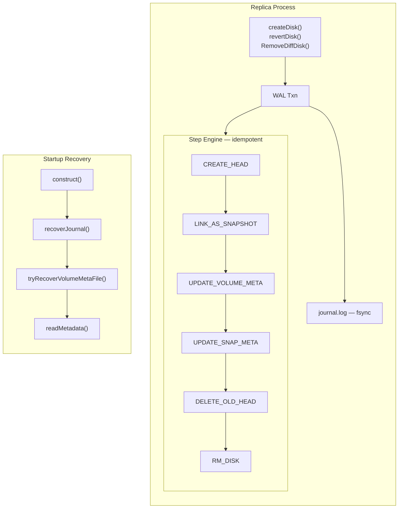

# Crash-Safe Replica Snapshot Chain Operations

## Summary

This enhancement introduces a Write-Ahead Log (WAL) into the Longhorn v1 data engine replica to make snapshot chain mutations (create, revert, remove) crash-safe. If the engine process is killed at any point during a snapshot operation, the replica automatically recovers to a consistent state on the next startup — either fully completing or fully aborting the interrupted operation. No manual intervention or data loss occurs.

The WAL is implemented as a reusable package (`github.com/longhorn/go-common-libs/wal`) so that other Longhorn components can adopt the same crash-safety pattern in the future.

### Related Issues

- https://github.com/longhorn/longhorn/issues/13259

## Motivation

### Problem Statement

The v1 replica performs snapshot chain mutations (create, revert, remove) as a sequence of filesystem operations, including file creation, hard-linking, metadata writes, and deletions. These operations are not atomic as a group. If the engine process is killed (OOM, SIGKILL, node reboot, instance-manager crash) between any two steps, the on-disk state can be left in an intermediate form that does not correspond to either the pre-operation or post-operation snapshot chain.

Specific failure modes observed or possible:

1. **Partial snapshot create**: The new head file is created but the old head was not yet linked as the snapshot image. The volume metadata still points to the old head, leaving an orphaned file and a broken chain.

    New head created, but old head never linked as snapshot:

    ```mermaid
    flowchart LR
      subgraph EX["Expected"]
        direction LR
        e_vm["volume.meta<br/>head = volume-head"] --> e_h["volume-head.img"]
        e_h -->|parent| e_s["snap-001.img"]
      end
      subgraph CR["Crashed"]
        direction LR
        c_vm["volume.meta<br/>head = volume-head"] --> c_h["volume-head.img"]
        c_o["snap-001.img<br/>orphaned"]:::warn
      end
      classDef warn fill:#fdd,stroke:#d00
    ```

2. **Partial snapshot revert**: The new head is created but the old head and intervening snapshots were not yet cleaned up. Metadata references dangling files.

    New head created, old head and intervening snapshots not cleaned up:

    ```mermaid
    flowchart LR
      subgraph EX["Expected"]
        direction LR
        e_vm["volume.meta<br/>head = volume-head"] --> e_h["volume-head.img"]
        e_h -->|parent| e_s["snap-001.img"]
      end
      subgraph CR["Crashed"]
        direction LR
        c_vm["volume.meta<br/>head = volume-head"] --> c_h["volume-head.img"]
        c_h -->|parent| c_s1["snap-001.img"]
        c_old1["volume-head-old.img<br/>not deleted"]:::warn
        c_old2["snap-002.img<br/>not deleted"]:::warn
      end
      classDef warn fill:#fdd,stroke:#d00
    ```

3. **Partial snapshot remove**: The child snapshot's parent pointer was updated but the target snapshot's files were not yet deleted, or vice versa. The chain has a gap or a dangling reference.

    Parent pointer vs file deletion out of sync:

    ```mermaid
    flowchart LR
      subgraph A["Case B: pointer updated, files remain"]
        direction LR
        a_s3["snap-003.meta<br/>parent = snap-001"] --> a_s1["snap-001.img"]
        a_s2["snap-002.img<br/>still on disk"]:::warn
      end
      subgraph B["Case A: files deleted, pointer stale"]
        direction LR
        b_s3["snap-003.meta<br/>parent = snap-002"] -.->|dangling| b_miss["snap-002.img<br/>missing"]:::warn
        b_s1["snap-001.img"]
      end
      classDef warn fill:#fdd,stroke:#d00
    ```

4. **Torn metadata writes**: `encodeToFile()` previously did not fsync the temporary file before rename, so a crash between rename and page-cache flush could expose a zero-length or partial `.meta` file.

    No fsync before rename leaves crash window:

    ```mermaid
    flowchart TD
      s1["1. Write data to .tmp"] --> s2["2. rename .tmp to .meta"]
      s2 -->|no fsync| s3["CRASH"]:::warn
      s3 --> s4[".meta on disk:<br/>zero-length or partial"]:::warn
      classDef warn fill:#fdd,stroke:#d00
    ```

In all cases, the replica currently fails to start or starts with corrupted chain metadata, requiring manual repair or replica deletion and rebuild. Both of which cause unnecessary I/O amplification and degraded redundancy windows.

### Goals

- Make snapshot create, revert, and remove operations on the v1 replica atomically recoverable after any crash.
- Recover automatically on replica startup without operator intervention.
- Preserve the existing replica on-disk format (snapshot images, `.meta` files, `volume.meta`).
- Introduce no runtime performance regression for normal (non-crash) operation paths.
- Provide an offline diagnostic tool (`journal-dump`) for inspecting the WAL contents.
- Implement the WAL as a shared library (`go-common-libs/wal`) reusable by other Longhorn components.

### Non-Goals

- Protect against storage-level corruption (bit rot, silent disk errors). The WAL protects against process-level crashes only.
- Redesign the snapshot chain format or migrate to a new on-disk layout.
- Make the WAL available for the v2 (SPDK) data engine — it has its own crash-safety mechanism.
- Handle concurrent multi-process access to the same replica directory (single-writer is enforced by flock).

## Proposal

### Overview

Introduce a per-replica append-only journal file (`journal.log`) that records the intent of each snapshot chain operation before any filesystem mutation begins. On startup, the replica opens the journal, replays any incomplete transactions to completion, and checkpoints the journal. The runtime path writes transaction records synchronously; the recovery path replays them idempotently.

### User Stories

**Story 1: Engine process killed during snapshot create**

A user triggers a snapshot while a monitoring system simultaneously OOM-kills the engine process. Previously, the replica would require manual cleanup or a full rebuild. With this enhancement, the replica starts cleanly on the next attempt — the WAL recovery replays the snapshot create to completion and the volume is healthy within seconds.

**Story 2: Instance-manager crash kills engine mid-operation**

The instance-manager process crashes or is killed unexpectedly while a periodic snapshot is in progress, taking the engine process down with it. When the instance-manager restarts, it relaunches the engine, which opens the replica and recovers the pending snapshot operation automatically. No degraded replica event is emitted.

**Story 3: Operator inspects a replica's WAL offline**

An SRE wants to understand what operations were in-flight when a replica crashed. They run `longhorn journal-dump /path/to/replica/` and see a human-readable table of all WAL records, including transaction boundaries, step intents, and completion markers.

### API Changes

N/A. This is an internal engine-level change. No CRD, gRPC, or REST API modifications are required.

## Design

### Architecture



### WAL Package (`go-common-libs/wal`)

The WAL is a single append-only file (`journal.log`) protected by an `flock`. Records are length-prefixed, CRC-32 checksummed binary frames. The package provides:

| Component | Purpose |
|-----------|---------|
| `Journal` | File handle, flock, append, scan, checkpoint |
| `Txn` | Transaction lifecycle: Begin, Intent, Prepare, StepDone, Commit, Abort |
| `Analyze()` | Determines pending transactions and their completion state |
| `OpenWithQuarantine()` | Fault-tolerant open that isolates corrupted journals |
| `ScanFile()` | Read-only scan without flock (for diagnostics) |
| `AdoptTxn()` | Resume an existing transaction during recovery |

#### Record Types

| Record | Semantics |
|--------|-----------|
| `TXN_BEGIN` | Starts a new transaction; carries operation name and parameters |
| `INTENT` | Declares a step to be executed; carries action type and full args |
| `TXN_PREPARE` | Marks all intents as durably written; recovery will roll forward |
| `STEP_DONE` | Marks a specific step as completed |
| `TXN_COMMIT` | Transaction completed successfully |
| `TXN_ABORT` | Transaction rolled back |
| `CHECKPOINT` | All prior records are obsolete; file may be truncated |

#### Transaction Protocol

```text
TXN_BEGIN(id=1, op=SNAP_CREATE)
  INTENT(txn=1, step=1, action=CREATE_HEAD, args={...})
  INTENT(txn=1, step=2, action=LINK_AS_SNAPSHOT, args={...})
  INTENT(txn=1, step=3, action=UPDATE_VOLUME_META, args={...})
  INTENT(txn=1, step=4, action=UPDATE_SNAP_META, args={...})
  INTENT(txn=1, step=5, action=DELETE_OLD_HEAD, args={...})
TXN_PREPARE(txn=1)
  -- crash at any point after PREPARE → recovery replays from here --
  STEP_DONE(txn=1, step=1)
  STEP_DONE(txn=1, step=2)
  STEP_DONE(txn=1, step=3)
  STEP_DONE(txn=1, step=4)
  STEP_DONE(txn=1, step=5)
TXN_COMMIT(txn=1)
CHECKPOINT
```

Recovery semantics:
- **Crash before `TXN_PREPARE`**: Transaction is aborted (intents are incomplete/torn).
- **Crash after `TXN_PREPARE`**: Transaction is rolled forward by replaying all steps whose `STEP_DONE` was not yet written.

### Step Engine (`pkg/replica/journal_engine.go`)

Each action corresponds to a single idempotent filesystem transformation. The args struct attached to its INTENT record captures the full target state so that re-applying the step is content-deterministic.

| Action | Description |
|--------|-------------|
| `CREATE_HEAD` | Truncate (or create) the new head image file to the volume size; write its `.meta` atomically |
| `LINK_AS_SNAPSHOT` | Hard-link the old head image + meta to the snapshot name |
| `UPDATE_VOLUME_META` | Atomically write `volume.meta` with the new head reference |
| `UPDATE_SNAP_META` | Atomically write a snapshot's `.meta` with updated fields (e.g. parent pointer) |
| `DELETE_OLD_HEAD` | Remove the old head image, meta, and checksum files |
| `RM_DISK` | Remove a snapshot's image, meta, and checksum files |

All apply functions operate on `(dir string, args []byte)` — they do not touch the live `*Replica` struct. This allows recovery to run before the Replica is fully constructed.

### Replica Lifecycle Integration

```go
func construct(...) (*Replica, error) {
    // 1. Sweep leftover *.tmp files
    r.sweepTmpFiles()

    // 2. Open WAL and recover pending transactions
    j, err := recoverJournal(dir)
    r.wal = j

    // 3. Recover volume.meta if needed
    r.tryRecoverVolumeMetaFile(head)

    // 4. Load chain metadata
    r.readMetadata()
    ...
}
```

### Hardened Metadata Writes

`encodeToFile()` is hardened to:

1. Write to a `.tmp` file.
2. `fsync()` the tmp file.
3. `rename()` to the target path.
4. `fsync()` the parent directory.

A startup sweep removes any leftover `.tmp` files from prior interrupted writes.

### Quarantine Fallback

If the journal file is unreadable on startup (I/O error, corruption beyond CRC recovery), `OpenWithQuarantine()`:

1. Renames the broken file to `journal.log.broken-<timestamp>`.
2. Opens a fresh empty journal.
3. Returns `QuarantineInfo` so the caller logs a loud warning with the quarantined path.

The replica then reconciles on-disk state via `tryRecoverVolumeMetaFile()`. In-flight transactions from the broken journal are lost, but the replica can start rather than being permanently stuck.

### Journal-Dump CLI

A new subcommand `longhorn journal-dump <path>` provides offline WAL inspection:

```
$ longhorn journal-dump /var/lib/longhorn/replicas/vol-abc/
File: /var/lib/longhorn/replicas/vol-abc/journal.log (2048 bytes, 12 records)

#    TYPE          TXN  SUMMARY
0    TXN_BEGIN     1    op=SNAP_CREATE params={"name":"snap1"...}
1    INTENT        1    step=1 action=CREATE_HEAD args={"head_name":"volume-head-002.img"...}
2    INTENT        1    step=2 action=LINK_AS_SNAPSHOT args={...}
...
11   CHECKPOINT    -
```

Supports `--format=json` for machine consumption and `--analyze` for pending-transaction analysis.

### Snapshot Operations Rewritten

#### createDisk (Snapshot Create)

1. Compute all step arguments (new head name, snap name, metadata).
2. `Begin(SNAP_CREATE)` → write all INTENTs → `Prepare()`.
3. Apply each step via the step engine; write `StepDone` after each.
4. `Commit()`.
5. Update in-memory state to reflect the now-durable on-disk state.

#### revertDisk (Snapshot Revert)

1. Compute arguments for creating the new head and deleting the old head.
2. `Begin(SNAP_REVERT)` → INTENTs → `Prepare()`.
3. Apply: CREATE_HEAD, UPDATE_VOLUME_META, DELETE_OLD_HEAD.
4. `Commit()`.
5. Return a freshly constructed `*Replica` (via `Reload()`).

#### RemoveDiffDisk (Snapshot Remove)

1. Determine if the child snapshot's parent pointer needs updating.
2. `Begin(SNAP_REMOVE)` → INTENTs (UPDATE_SNAP_META if needed, RM_DISK) → `Prepare()`.
3. Apply steps.
4. `Commit()`.
5. Update in-memory chain references.

## Test Plans

### Per-Step Idempotency

- Apply `CREATE_HEAD` twice with the same args; verify the file size and metadata are correct and unchanged on the second call.
- Apply `LINK_AS_SNAPSHOT` twice; verify hard-link inode equality.
- Apply `DELETE_OLD_HEAD` twice; verify no error on the second call when files are already gone.
- Apply `RM_DISK` on a non-existent snapshot; verify no error.

### Recovery: Full Replay

- Write a journal with a complete SNAP_CREATE intent set (5 steps) and TXN_PREPARE but no STEP_DONE or COMMIT.
- Run `recoverJournal()`.
- Verify the on-disk state matches a successful snapshot create (new head exists, old head linked as snapshot, volume.meta updated).

### Recovery: Abort Unprepared

- Write a journal with TXN_BEGIN and partial INTENTs but no TXN_PREPARE.
- Run `recoverJournal()`.
- Verify the transaction is aborted and on-disk state is unchanged.

### Recovery: Partial Progress

- Write a journal with PREPARE + some STEP_DONE records (e.g., steps 1–3 done, steps 4–5 pending).
- Run `recoverJournal()`.
- Verify only steps 4–5 are replayed; final state is correct.

### Crash-Injection Matrix

A parametric test harness drives every meaningful crash point for SNAP_CREATE, SNAP_REVERT, and SNAP_REMOVE:

- For each operation, enumerate crash points: after each INTENT write, after PREPARE, after each STEP_DONE.
- At each crash point, simulate SIGKILL (close journal fd without checkpoint).
- Open a new replica on the same directory.
- Assert the recovered state matches either the pre-operation or post-operation fingerprint — never an intermediate state.

### Nested Recovery (Recovery-of-Recovery)

- Set up a prepared transaction requiring recovery.
- Simulate the recovery process itself crashing partway through (after applying some steps but before committing).
- Run `recoverJournal()` again.
- Verify convergence to the correct final state.

### Quarantine Fallback

- Write garbage to `journal.log`.
- Open the replica.
- Verify the broken file is renamed to `journal.log.broken-*` and the replica starts successfully with a fresh journal.
- Verify the warning log contains the quarantine path.

### End-to-End

- Create a `*Replica`, call `Snapshot()`, close, reopen.
- Verify the chain is intact and the snapshot is present.
- Repeat for `Revert()` and `RemoveDiffDisk()`.

## Upgrade Plan

This enhancement is purely internal to `longhorn-engine` and does not change any external API, CRD, or on-disk format beyond adding the `journal.log` file to the replica directory.

**New replicas**: Automatically use the WAL from the first snapshot operation.

**Existing replicas after engine upgrade**: On the first startup with the new engine image, `recoverJournal()` finds no existing `journal.log`, creates a fresh one, and the replica continues normally. Subsequent snapshot operations are WAL-protected.

**Downgrade**: If the engine is downgraded to a version without WAL support, the `journal.log` file is harmlessly ignored (it is never referenced by `volume.meta` or any `.meta` file). The old code path operates as before. Re-upgrading later will resume WAL usage.

No data migration or manual steps are required.
