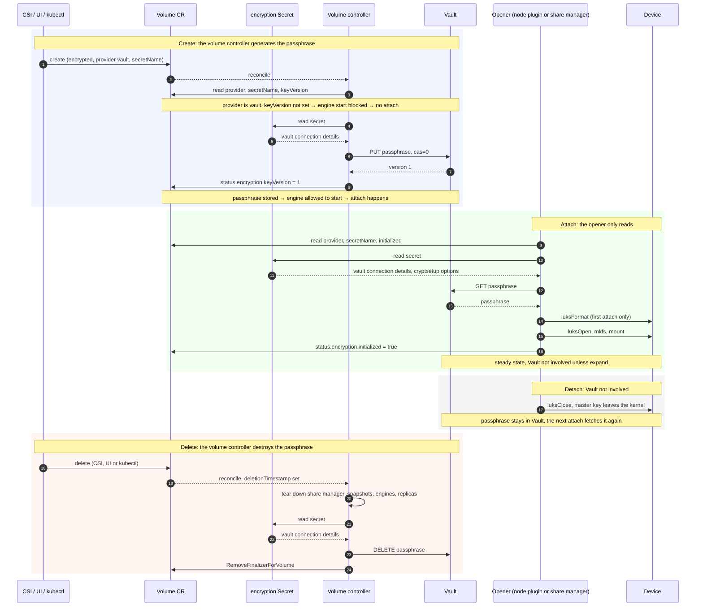
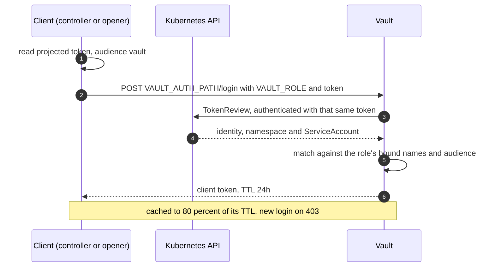

# Vault-backed key provider for encrypted volumes

## Summary

Longhorn already encrypts volumes with LUKS2, in the CSI node plugin for RWO and in the share-manager pod for RWX. Currently it supports only the `secret` key provider, so the passphrase is stored in plaintext in a Kubernetes Secret and anyone with access to it can read it. Also, all volumes derived from the same StorageClass share a common passphrase, unless the Secret name is templated per PVC.

This enhancement adds a `vault` provider that gives each volume its own random passphrase, kept in Vault and never written to a Kubernetes object. The volume controller owns it end to end: it stores the passphrase before the volume's engine is allowed to start, and destroys it before releasing the volume's finalizer. The CSI node plugin and the share-manager pod, which open the device, fetch the passphrase from Vault directly, so it never travels between components or appears in a log or a Kubernetes object.

The LUKS data path, the engines and the existing `secret` provider are unchanged.

### Related Issues

- [3026](https://github.com/longhorn/longhorn/issues/3026)

## Motivation

### Goals

- A distinct passphrase per volume, generated by Longhorn and stored in Vault.
- No passphrase in a Secret, a pod spec or a log, including for RWX volumes.
- The `secret` provider and every volume using it behave exactly as before.

### Non-goals

- **Key rotation.** Nothing in this enhancement rotates a passphrase. It is a follow-up, proposed separately once this lands and building on what is here.
- Stores other than Vault. The library keeps a provider interface so another store can be implemented later, but only `vault` ships.
- Converting an existing volume from one provider to the other.

## Proposal

### User Stories

#### Story 1: per-volume keys without templating

An operator runs a cluster where several teams share a StorageClass. Today every encrypted volume of that class is unlocked by the same passphrase, and the only way to separate them is to template the Secret name per PVC, which means creating and maintaining one Secret per volume. Each of those Secrets still holds a plaintext passphrase, visible to anyone with read access to them.

Afterwards the operator sets `encrypted: "true"` and `encryptionSecret: "longhorn-vault"` on one StorageClass, and creates one Secret that holds no passphrase at all. Each volume gets its own random passphrase, stored only in Vault under that volume's name, and destroyed when the volume is deleted.

#### Story 2: an RWX volume that does not expose its passphrase

Today a non-migratable RWX encrypted volume is opened by the share-manager pod, and the passphrase reaches it as a plaintext environment variable in the pod spec. Anyone who can read pods in `longhorn-system` can read the passphrase.

Afterwards the share-manager pod authenticates to Vault with its own projected ServiceAccount token and fetches the passphrase itself. The pod spec contains no passphrase and the manager never sends it one.

### User Experience In Detail

Cluster preparation, once per cluster:

1. On Vault, enable a `kubernetes` auth mount for the cluster, create the `longhorn-csi` policy over the KV prefix, and create a role bound to `longhorn-service-account` in `longhorn-system` with audience `vault`.
2. Create a Secret in Longhorn's namespace holding the Vault connection details and the cryptsetup options.

Both are documented with complete examples. The `tokenreviews` rule the auth method needs is part of Longhorn's ClusterRole and ships with the chart, so there is nothing to apply by hand for it.

The user creates a StorageClass naming that Secret and then creates PVCs as usual. Volumes created in the UI or with `kubectl` set `spec.encryption.secretName` on the Volume CR directly, since there is no StorageClass to read it from.

Deleting the PVC, or the volume in the UI, destroys the Vault entry as part of volume deletion. Taking a backup writes a passphrase entry owned by that backup, so the backup stays restorable after its volume is gone, and deleting the Backup CR removes that entry.

If Vault is unreachable the failure is visible rather than silent. A volume being created stays without an engine and carries a condition saying why. A volume being attached waits in `ContainerCreating` with its data intact, and volumes already open keep serving I/O, because a running dm-crypt mapping needs nothing from Vault.

### API changes

Volume CR, additive and optional:

```yaml
spec:
  encryption:
    provider: vault              # secret or vault, immutable
    secretName: longhorn-vault   # immutable, in the same namespace as this Volume
status:
  encryption:
    initialized: true            # the device has been formatted
    keyVersion: 1                # store version of the current passphrase, always 1 without rotation
```

Admission rules: encrypted with no provider defaults to `secret`, so every existing volume and hand-written CR behaves as before; `vault` whose `secretName` resolves to no Secret, or to one with no `VAULT_ADDR`, is rejected, so a typo cannot surface later as a mount failure on a node.

StorageClass gains one ordinary parameter, `encryptionSecret`, naming the Secret that configures the volume:

```yaml
parameters:
  encrypted: "true"                     # encrypt this volume with LUKS2
  encryptionSecret: "longhorn-vault"    # Secret holding the provider configuration, in Longhorn's namespace
```

Unlike the `secret` provider, a vault StorageClass sets no `csi.storage.k8s.io/` references at all. They would all name the same Secret, which is four pairs of parameters saying one thing.

The reference is also not stored on the PV. Today that is how a Secret is found after provisioning: the node plugin receives it in the CSI request, and the share-manager controller reads `pv.Spec.CSI.NodePublishSecretRef` to build the pod. Here it lives on the Volume CR instead, because the volume controller needs it on paths where no PV is involved and none may still exist.

Both providers use a Secret of the same shape, so the opener reads one flat map, switches on `CRYPTO_KEY_PROVIDER` and hands the rest to that provider. The cryptsetup options are shared, so a `vault` volume is no less configurable than a `secret` one.

```yaml
# vault provider
stringData:
  CRYPTO_KEY_PROVIDER: vault                   # required, "vault" is the new value
  CRYPTO_KEY_CIPHER: aes-xts-plain64           # optional, default aes-xts-plain64
  CRYPTO_KEY_HASH: sha256                      # optional, default sha256
  CRYPTO_KEY_SIZE: "512"                       # optional, default 256, which is AES-128 under XTS
  CRYPTO_PBKDF: argon2i                        # optional, default argon2i

  # new fields
  VAULT_ADDR: https://vault.example.com:8200   # required
  VAULT_AUTH_PATH: auth/kubernetes-prod-a      # required, login is appended
  VAULT_ROLE: longhorn-csi                     # required
  VAULT_KV_MOUNT: secret                       # optional, default secret
  VAULT_KV_PREFIX: longhorn/                   # optional, holds volumes/<volume> and backups/<backup>
  VAULT_DESTROY_KEYS: "true"                   # optional, default true, destroy every version on delete
  VAULT_TLS_SERVER_NAME: ""                    # optional, SNI override
  VAULT_NAMESPACE: ""                          # optional, Vault Enterprise only
  VAULT_CA_CERT: |                             # optional, PEM of the CA that signed Vault's certificate
    -----BEGIN CERTIFICATE-----
```

The `secret` provider keeps the same object and the same keys it has today. A StorageClass naming no `encryptionSecret` behaves exactly as before, using the node-stage reference it already carries.

## Design

### Implementation Overview

**Shared library, `go-common-libs/keystore`.** A `KeyProvider` interface with `Get`, `Put` with check-and-set, and `Delete`, the Vault implementation, profile parsing and validation, login and token caching, the fail-closed decision, and the `cryptsetup` helpers. Vendored by longhorn-manager and longhorn-share-manager so there is one implementation of the sequence rather than two.

**Volume controller.** Generates and stores the passphrase beside the existing restore and clone prerequisites, withholds `e.Spec.DesireState = Running` until it is stored, and destroys the entry in the deletion path before `RemoveFinalizerForVolume`. It also resolves the Secret named by `secretName` and raises a volume condition carrying any store error.

**Backup controller.** On backup completion, copies the volume's passphrase to an entry owned by the backup, at `<prefix>backups/<backup>` beside the volumes at `<prefix>volumes/<volume>`. Destroys it with the Backup CR.

**Chart and deployment.** A projected ServiceAccount token with audience `vault` at a fixed path on the manager and plugin DaemonSets, added to share-manager pods of vault volumes by their controller, plus the `tokenreviews` rule on the existing ClusterRole. No new ServiceAccount: everything already runs as `longhorn-service-account`.

#### Lifecycle

The Vault login is omitted below, since it is the same on every path and is shown under Authentication.



#### Why the volume controller owns this

The CSI controller plugin only sees volumes created through CSI, so `CreateVolume` and `DeleteVolume` never fire for a volume made or deleted in the UI or with `kubectl`. A backup also outlives its volume and needs a passphrase written and destroyed on the backup's own schedule, which is work no CSI call covers.

#### Derived volumes

- **Copied from a snapshot.** A snapshot and its source share the same passphrase, so the copy reads the source volume's entry. Reading it is safe because a snapshot cannot outlive its volume: the data sits in the replicas and the Snapshot CR carries an immutable owner reference to the volume.
- **Restored from a backup.** The passphrase is the backup's own entry. A backup can outlive the volume it came from, so pointing at the volume's entry would mean that deleting the volume destroys the passphrase for its own backups and leaves them unreadable. A restore reads that entry, so a DR cluster needs the same vault profile as the cluster that wrote the backup.

The copy is written under the new volume's name with `cas=0`, so from then on the volume owns its passphrase. For a clone that names no snapshot, the copy waits until the controller has taken the clone snapshot.

#### Authentication

Each client posts a ServiceAccount token and `VAULT_ROLE` to the auth mount's login path, caches the returned client token to 80 percent of its TTL, and re-logs in on 403.

The token is a second projected ServiceAccount token with audience `vault`, not the pod's default one, mounted at a fixed path. The Vault role binds that audience, so the default API-server-audience token of any pod is refused by Vault, and the `vault`-audience token has no standing with the Kubernetes API. Neither can be replayed as the other even though both belong to the same ServiceAccount. If the file is missing the operation fails explicitly rather than falling back.

Vault uses the `kubernetes` auth method and validates the token through the cluster's TokenReview API. That call needs a credential of its own, and rather than a per-cluster reviewer token that expires and has to be renewed, the mount leaves `token_reviewer_jwt` unset so Vault presents the token being validated as the credential for its own review. That requires the ServiceAccount to be allowed to create TokenReviews, which is one rule on Longhorn's existing ClusterRole.



#### Failure behaviour

- **Unreachable at creation.** The passphrase cannot be stored, so engine start stays blocked and the volume condition carries the reason.
- **Unreachable at attach.** The passphrase cannot be retrieved. Restarts and reboots wait in `ContainerCreating` with data intact, and already open mappings keep serving.
- **Unreachable at deletion.** Deletion is retried a few times, then the finalizer is released anyway, so a Vault outage cannot wedge volume deletion.

### Test plan

longhorn-tests gains a self-contained fixture that deploys a Vault server in the cluster and configures the auth mount, role and policy the way production does. A Robot variable selects whether the encrypted-volume keywords render a passphrase Secret or a vault ID, so the existing encrypted suite runs unchanged against both providers.

New cases tagged `vault` cover what is specific to the store: a distinct passphrase per volume with none in any Secret or pod spec, restore and clone opening with the copied passphrase, the fail-closed cases, a Vault outage during attach and during I/O, a volume deleted through the API rather than CSI, and a backup restored after its source volume is gone. Everything runs on both data engines.

### Upgrade strategy

Nothing to migrate. An existing encrypted volume has an empty `spec.encryption.provider`, which admission normalises to `secret`, and the new field and the `VAULT_*` keys are only read for `vault` volumes. A cluster that configures no vault profile behaves as it does today.

Downgrading a cluster that already has `vault` volumes is not supported, since an older manager would treat them as `secret` volumes with no passphrase.

## Note

Key rotation is planned as a follow-up, once this lands.

The provider expects a Vault KV v2 mount, since rotation will need its versioning and conditional writes.
