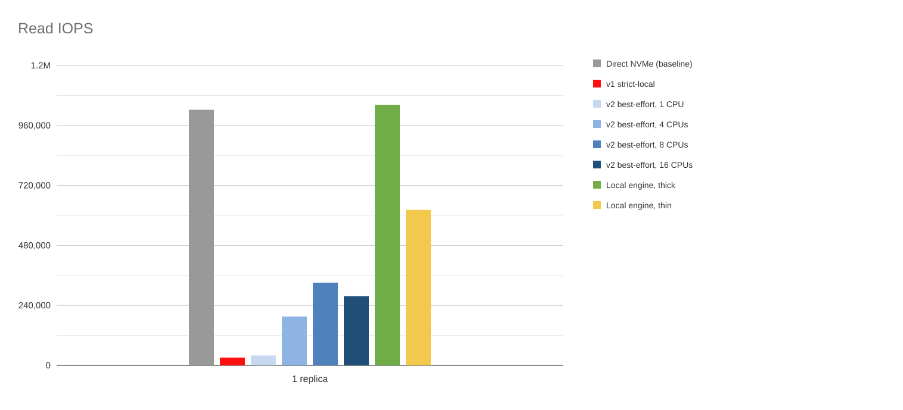
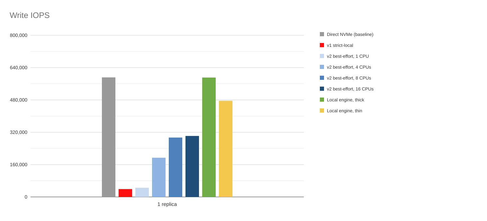
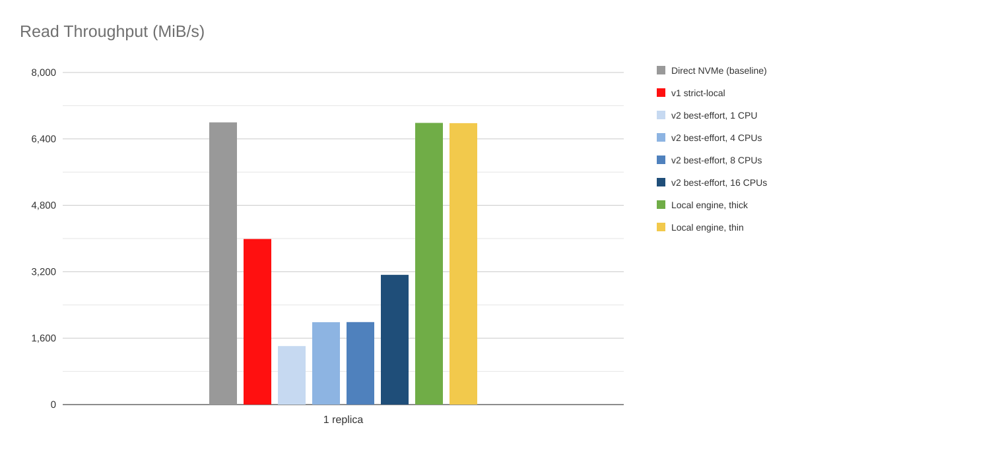
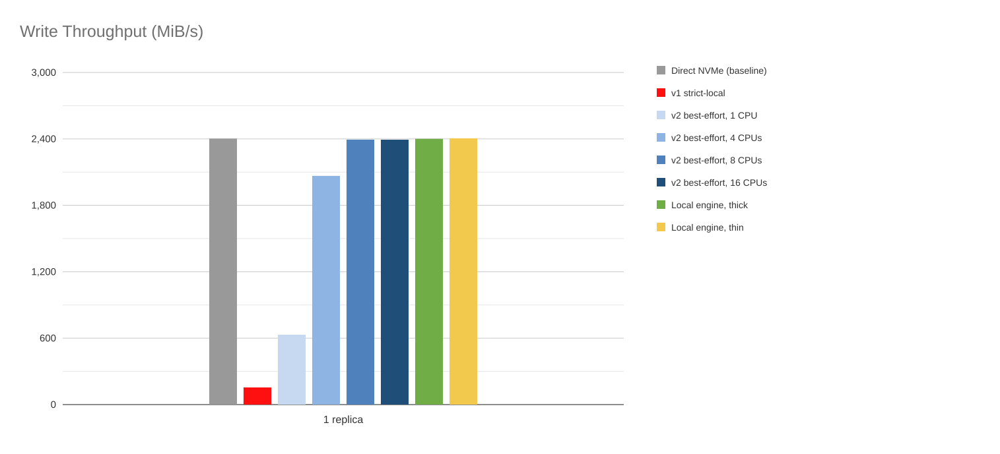
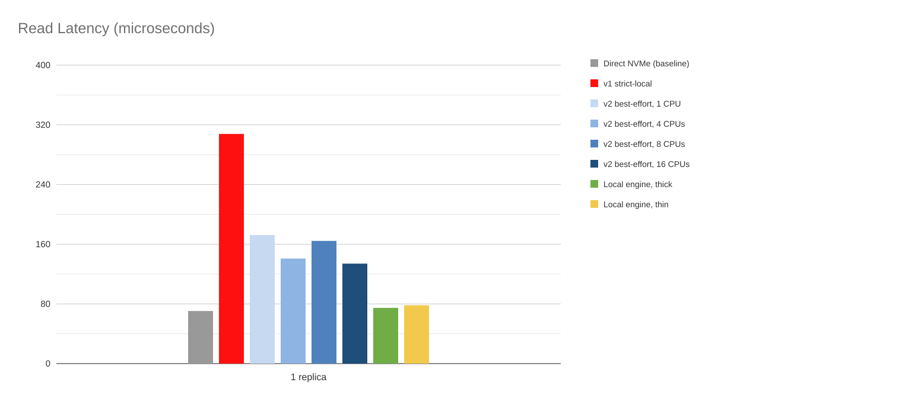
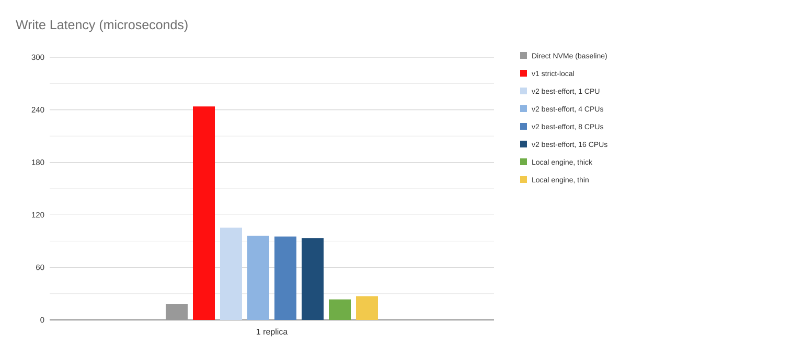

# Local Data Engine Performance Benchmark

This report accompanies the [Local Data Engine for Strict-Local Volumes](../../20260826-local-data-engine.md)
enhancement proposal. It compares the proposed LVM-backed local data engine with a direct NVMe baseline, a
v1 `strict-local` volume, and a v2 volume with one replica.

The benchmark was run on 2026-08-18.

## Environment

| | |
|---|---|
| Deployment | Single-node bare-metal Kubernetes cluster |
| Machine | Intel Xeon Silver 4214; 48 logical CPUs; 125 GiB RAM |
| OS | RHEL 9 compatible; kernel 6.12.48 |
| Kubernetes | v1.35.7 |
| Number of nodes | 1 |
| Storage | NVMe SSD (SAMSUNG MZPLJ1T6HBJR-0007C); 1.45 TiB; no RAID |
| Filesystem | ext4 |

The direct NVMe baseline, the v2 cases, and every local data engine case reused the same physical NVMe
device sequentially; no two configurations ran at the same time. The v2 cases used the `nvme` disk driver.

The v1 `strict-local` case used the node's existing Longhorn filesystem disk, so it is not a same-device
hardware comparison and should be read as an order-of-magnitude reference rather than a like-for-like
result.

Each Longhorn case used a 33 GiB PVC and a 30 GiB fio test file. The fio pod was pinned to host CPUs
`40-47`, and the v2 instance-manager CPU allocation was assigned to CPUs `0-39`. The node provided 2 GiB of
2 MiB hugepages on NUMA node 1.

## fio parameters

| Metric | Parameters |
|---|---|
| IOPS | `bs=4K`, `iodepth=128`, `numjobs=8`, `norandommap=1` |
| Throughput | `bs=128K`, `iodepth=16`, `numjobs=4` |
| Latency | `bs=4K`, `iodepth=1`, `numjobs=1` |

Common parameters were `ioengine=libaio`, `direct=1`, `time_based=1`, `ramp_time=60s`, `runtime=60s`,
`group_reporting=1`, `randrepeat=0`, and `verify=0`. Each run performed an unmeasured 60-second ramp
followed by a single 60-second measurement, and the test file was removed before each metric category.

These are the same parameters used by the upstream
[performance benchmark](https://github.com/longhorn/longhorn/wiki/Performance-Benchmark), so the numbers
below can be compared with published Longhorn results.

## Results

Latency is the fio mean total latency, which includes submission and completion; lower is better. All charts
use a linear scale.

### Measured values

Random 4 KiB IOPS:

| Configuration | Read IOPS | Write IOPS |
|---|---:|---:|
| Direct NVMe (baseline) | 1,022,730 | 591,512 |
| v1 strict-local | 31,132 | 39,111 |
| v2 best-effort, 1 CPU | 39,595 | 45,499 |
| v2 best-effort, 4 CPUs | 195,474 | 194,152 |
| v2 best-effort, 8 CPUs | 330,945 | 293,988 |
| v2 best-effort, 16 CPUs | 276,736 | 301,831 |
| Local engine, thick | 1,042,598 | 590,897 |
| Local engine, thin | 622,127 | 475,879 |

Sequential 128 KiB throughput, in MiB/s:

| Configuration | Read | Write |
|---|---:|---:|
| Direct NVMe (baseline) | 6,798.82 | 2,403.03 |
| v1 strict-local | 3,988.90 | 154.85 |
| v2 best-effort, 1 CPU | 1,408.87 | 631.22 |
| v2 best-effort, 4 CPUs | 1,984.45 | 2,065.96 |
| v2 best-effort, 8 CPUs | 1,987.90 | 2,393.71 |
| v2 best-effort, 16 CPUs | 3,125.07 | 2,393.02 |
| Local engine, thick | 6,785.82 | 2,400.33 |
| Local engine, thin | 6,778.94 | 2,404.74 |

Queue-depth-1 4 KiB latency, in microseconds:

| Configuration | Read | Write |
|---|---:|---:|
| Direct NVMe (baseline) | 70.48 | 18.42 |
| v1 strict-local | 307.80 | 243.89 |
| v2 best-effort, 1 CPU | 172.28 | 105.48 |
| v2 best-effort, 4 CPUs | 140.77 | 96.03 |
| v2 best-effort, 8 CPUs | 164.43 | 95.31 |
| v2 best-effort, 16 CPUs | 134.00 | 93.40 |
| Local engine, thick | 74.72 | 23.43 |
| Local engine, thin | 78.17 | 27.15 |

## Interpretation

- Thick provisioning performed at the direct NVMe baseline in every category. Random read and write IOPS,
  sequential throughput, and latency were all within a few percent of the raw device, which is the result the
  design predicts: once the LV is active, no Longhorn userspace code is in the I/O path.
- Thin provisioning kept sequential throughput at the baseline and stayed within roughly 4 microseconds of
  thick latency, but random IOPS was lower, mostly because the thin pool allocates and zeroes chunks on first
  write.
- Even in thin mode, the local data engine was well ahead of a single-replica v2 volume, including the v2
  runs given 8 or 16 dedicated CPU cores, and it needs no CPU allocation of its own.
- The v2 results scale with the CPU cores given to the SPDK target and plateau between 8 and 16 cores. The
  local data engine reaches higher numbers with no dedicated cores at all.
- An earlier thin configuration with thin-pool zeroing disabled was also measured. It did not perform
  measurably better than zeroed thin provisioning while it did expose stale chunk contents, so that mode was
  removed and is not reported here.

A future version may expose selected thin-pool tuning parameters, such as chunk size, if workload-specific
benchmarking shows that the configurability is worthwhile.
