# Reference Setup, Performance, Scalability, and Sizing Guidelines: Public Cloud - Medium Node Spec

## Table of contents
1. [Cluster Spec](#cluster-spec)
   1. [Node Spec](#node-spec)
   1. [Network Spec](#network-spec)
   1. [Disk Spec](#disk-spec)
   1. [Kubernetes Spec](#kubernetes-spec)
   1. [Longhorn Config](#longhorn-config)
   1. [Additional Components](#additional-components)
1. [Workload design](#workload-design)
   1. [Read and Write Tests Design](#read-and-write-performance)
   1. [Longhorn Control Tests Design](#longhorn-control-plane-performance)
   1. [Maximum Volume Size Tests Design](#maximum-volume-size-tests-design)
   1. [Load Balancing](#load-balancing)
1. [Read Performance](#read-performance)
   1. [Random Read IOPs - Stress Tests](#random-read-iops---stress-tests)
   1. [Random Read IOPs - Rate Limited](#random-read-iops---rate-limited)
   1. [Sequential Read IOPs - Stress Tests](#sequential-read-iops---stress-tests)
   1. [Sequential Read IOPs - Rate Limited](#sequential-read-iops---rate-limited)
   1. [Random Read Bandwidth - Stress Tests](#random-read-bandwidth---stress-tests)
   1. [Random Read Bandwidth - Rate Limited](#random-read-bandwidth---rate-limited)
   1. [Sequential Read Bandwidth - Stress Tests](#sequential-read-bandwidth---stress-tests)
   1. [Sequential Read Bandwidth - Rate Limited](#sequential-read-bandwidth---rate-limited)
   1. [Random Read Latency - Stress Tests](#random-read-latency---stress-tests)
   1. [Sequential Read Latency - Stress Tests](#sequential-read-latency---stress-tests)
1. [Write Performance](#write-performance)
   1. [Random Write IOPs - Stress Tests](#random-write-iops---stress-tests)
   1. [Random Write IOPs - Rate Limited](#random-write-iops---rate-limited)
   1. [Sequential Write IOPs - Stress Tests](#sequential-write-iops---stress-tests)
   1. [Sequential Write IOPs - Rate Limited](#sequential-write-iops---rate-limited)
   1. [Random Write Bandwidth - Stress Tests](#random-write-bandwidth---stress-tests)
   1. [Random Write Bandwidth - Rate Limited](#random-write-bandwidth---rate-limited)
   1. [Sequential Write Bandwidth - Stress Tests](#sequential-write-bandwidth---stress-tests)
   1. [Sequential Write Bandwidth - Rate Limited](#sequential-write-bandwidth---rate-limited)
   1. [Random Write Latency - Stress Tests](#random-write-latency---stress-tests)
   1. [Sequential Write Latency - Stress Tests](#sequential-write-latency---stress-tests)
1. [Longhorn Control Plane Performance](#longhorn-control-plane-performance)
1. [Volume Maximum Size](#volume-maximum-size)
1. [FAQs](#faqs)


## Cluster Spec
### Node Spec
* EC2 instance type: ec2 m5zn.2xlarge
* 8vCPUs, 32GB RAM
* Root disk
  * Size 50GB 
  * Type EBS gp3
* OS: Ubuntu 22.04.3 LTS (Jammy Jellyfish)
* Kernel version: 6.2.0-1017-aws

**Comment:**
We choose m5zn.2xlarge ec2 instance because it has consistent EBS performance unlike other similar (in terms of CPU and memory) instances which have baseline and burst EBS performance. 
Consistent EBS performance is important because we are using dedicated EBS disk for Longhorn storage. 
If the EBS performance is inconsistent, we will see inconsistent test result over time.
See more at https://docs.aws.amazon.com/AWSEC2/latest/UserGuide/ebs-optimized.html .

### Network Spec
* Network bandwidth: 
  * Baseline bandwidth 10 Gbps
  * Burst bandwidth: Up to 25 Gbps in short time 
* Network latency: ~0.3ms RTT via ping command

### Disk Spec
* We are using dedicated disk for Longhorn volumes' replicas on the nodes. 
We select a typical EBS volume with average IOPs and bandwidth performance:
  * Single EC2 EBS gp3
  * 1TB 
  * IOPs set to 10000 
  * Throughput set to 360MiB/s 
  * Formatted as ext4 filesystem

**Comment:**
* We choose 10000 for EBS disk's IOPs simply because it is a middle value between minimum value 3000 and maximum value 16000 of the gp3 EBS disk
* We choose 360MiB/s for EBS disk's bandwidth because the m5zn.2xlarge EC2 instance has EBS bandwidth 396.25 MiB/s. 
  If we choose a bigger value than 396.25 MiB/s for EBS disk's bandwidth, the ec2 instance would not be able to push EBS disk to that value

### Kubernetes Spec
* Kubernetes Version: v1.27.10+rke2r1
* CNI plugin: Calico
* Control plane nodes are separated from worker nodes

### Longhorn Config
* Longhorn version: v1.6.0
* Settings:
  * Using dedicated disk for Longhorn instead of root disk
  * The number of replicas per volume is 3
  * Storage Minimal Available Percentage setting: 10%
    * As we are using dedicated disk, we don't need big reserve storage as mentioned in best practice https://longhorn.io/docs/1.6.0/best-practices/#minimal-available-storage-and-over-provisioning
  * Storage Over Provisioning Percentage setting: 110%
    * We are planning to fill 15GB for each 20GB volume
      If we schedule maximum amount, it would be 1100 GiB and actual usage will be (15/20)*1200 = 825GiB. This leaves 100GiB as 10% Storage Minimal Available Percentage setting plus some volumes' filesystem space overhead

### Additional Components
* We deployed [Rancher monitoring](https://ranchermanager.docs.rancher.com/integrations-in-rancher/monitoring-and-alerting) which is a downstream version of [kube-prometheus-stack](https://github.com/prometheus-community/helm-charts/tree/main/charts/kube-prometheus-stack).
  Note that this monitoring system generally consumes a certain amount of CPU, memory, and disk space on the node. We are deploying it with:
  * CPU request: 750m
  * CPU limit: 1000m
  * Memory request: 750Mi
  * Memory limit: 3000Mi
  * Data retention size: 25GiB
* We deployed [Local Path Provisioner](https://github.com/rancher/local-path-provisioner) to test baseline storage performance when using  local storage in each node directly.

## Workload design

### Read and Write Tests Design
We use [Kbench](https://github.com/yasker/kbench) which is a tool to test Kubernetes storage.
The idea of Kbench is that it deploys a pod with a Longhorn volume.
Then it runs various `fio` jobs (specified by user) to test multiple performance aspects of the volume (IOPs, bandwidth, latency).
The pod runs the test repeatedly and exposes the result as Prometheus metrics.
We then collect and visualize the data using Grafana.

Traditionally, kbench only deploys 1 single pod to test 1 volume. 
However, in this report, we will gradually scale up the number of Kbench pods.
Since each pod stress-tests its Longhorn volume, as the number of Kbench pods go up,
we can simulate the situation in which the cluster has many pods doing IO aggressively. 
From there we can see the performance characteristic of Longhorn storage system as there are more and more IO intensive workloads.

We also perform the tests in which Kbench pods are rate-limited. 
From the rate-limited tests, we can further verify the result from the stress tests.

To avoid cache effect, we choose the `fio` test size to be big enough. See the more details at https://github.com/longhorn/kbench#:~:text=the%20YAML%20locally.-,As%20mentioned%20above%2C%20for%20formal%20benchmark%2C%20the%20size%20should%20be%20at%20least%2025%20times%20the%20read/write%20bandwidth%20to%20avoid%20the%20caching%20impacting%20the%20result.,-Step%20to%20deploy

### Longhorn Control Plane Tests Design
The read and write performance tests above mostly concern the Longhorn data plane. 
In order to discover the scalability of Longhorn control plane, we also run tests that have non-IO workloads. 
These tests will help us to answer questions such as:
1. Maximum number of Longhorn volumes inside the cluster
1. Maximum number of Longhorn volumes attached to a node
1. Maximum number of Longhorn replicas on a node

### Maximum Volume Size Tests Design
From the experience and code analysis, the maximum Longhorn volume size is limited by the replica rebuilding time.
In this report, we will measure the replica rebuilding time as the size of Longhorn volume is getting bigger.
From there user can estimate the maximum volume size they can set given the information about how Longhorn it would take if Longhorn need to rebuild replicas for that volume.

### Load Balancing
In this report, we will distribute the load evenly across worker nodes:

1. Each worker nodes will have relative similar number of Kbench pods
2. Each worker nodes will have relative similar number of Longhorn replicas

This setup optimize efficiency of the cluster and Longhorn system. In practice, this balance is also what users usually strive for.

## Read Performance

### Random Read IOPs - Stress Tests

#### 1 control plane node + 3 worker nodes

We start with the cluster that has 1 control plane node + 3 worker nodes.

##### 1 Workload Pod Scale
First, we do a comparison between a single RWO Longhorn PVC against a single Local Path Provisioner volume.
We deploy 1 Kbench pod which attaches a Local Path Provisioner PVC.
Then we delete the above Kbench pod and PVC and repeat the test with Longhorn PVC instead.

We use this yaml manifest for the Kbench workload:
<details>
<summary>With local path provisioner storageclass</summary>
<br>

```yaml
apiVersion: apps/v1
kind: StatefulSet
metadata:
  name: test-sts
  namespace: default
spec:
  serviceName: test-sts
  replicas: 1
  selector:
    matchLabels:
      app: test-sts
  podManagementPolicy: Parallel
  template:
    metadata:
      labels:
        app: test-sts
    spec:
      containers:
        - name: kbench
          image: phanle1010/kbench:dev
          imagePullPolicy: Always
          env:
            - name: MODE
              value: "random-read-iops"
            - name: OUTPUT
              value: /test-result/device
            - name: FILE_NAME
              value: "/volume/test"
            - name: SIZE
              value: "15G"
            - name: CPU_IDLE_PROF
              value: "disabled"
            - name: SKIP_PARSE
              value: "true"
            - name: LONG_RUN
              value: "true"
          volumeMounts:
            - name: vol
              mountPath: /volume/
            - name: shared-data
              mountPath: /test-result
        - name: metric-exporter
          image: phanle1010/kbench:dev
          imagePullPolicy: Always
          readinessProbe:
            exec:
              command:
                - sh
                - -c
                - '[ "$(ls -A /test-result)" ]'
            initialDelaySeconds: 30
            periodSeconds: 10
          command:
          - metric-exporter
          - -d
          - start
          env:
            - name: DATA_DIR
              value: /test-result
            - name: VOLUME_ACCESS_MODE
              value: rwo
            - name: TEST_MODE
              value: read-only
            - name: RATE_LIMIT_TYPE
              value: no-rate-limit
          ports:
            - containerPort: 8080
              name: metrics
          volumeMounts:
            - name: vol
              mountPath: /volume/
            - name: shared-data
              mountPath: /test-result
      volumes:
        - name: shared-data
          emptyDir: {}
  volumeClaimTemplates:
    - metadata:
        name: vol
      spec:
        accessModes: ["ReadWriteOnce"]
        storageClassName: "local-path"
        resources:
          requests:
            storage: 20Gi
```
</details>

<details>
<summary>With longhorn storageclass</summary>
<br>

```yaml
apiVersion: apps/v1
kind: StatefulSet
metadata:
  name: test-sts
  namespace: default
spec:
  serviceName: test-sts
  replicas: 1
  selector:
    matchLabels:
      app: test-sts
  podManagementPolicy: Parallel
  template:
    metadata:
      labels:
        app: test-sts
    spec:
      containers:
        - name: kbench
          image: phanle1010/kbench:dev
          imagePullPolicy: Always
          env:
            - name: MODE
              value: "random-read-iops"
            - name: OUTPUT
              value: /test-result/device
            - name: FILE_NAME
              value: "/volume/test"
            - name: SIZE
              value: "15G"
            - name: CPU_IDLE_PROF
              value: "disabled"
            - name: SKIP_PARSE
              value: "true"
            - name: LONG_RUN
              value: "true"
          volumeMounts:
            - name: vol
              mountPath: /volume/
            - name: shared-data
              mountPath: /test-result
        - name: metric-exporter
          image: phanle1010/kbench:dev
          imagePullPolicy: Always
          readinessProbe:
            exec:
              command:
                - sh
                - -c
                - '[ "$(ls -A /test-result)" ]'
            initialDelaySeconds: 30
            periodSeconds: 10
          command:
          - metric-exporter
          - -d
          - start
          env:
            - name: DATA_DIR
              value: /test-result
            - name: VOLUME_ACCESS_MODE
              value: rwo
            - name: TEST_MODE
              value: read-only
            - name: RATE_LIMIT_TYPE
              value: no-rate-limit
          ports:
            - containerPort: 8080
              name: metrics
          volumeMounts:
            - name: vol
              mountPath: /volume/
            - name: shared-data
              mountPath: /test-result
      volumes:
        - name: shared-data
          emptyDir: {}
  volumeClaimTemplates:
    - metadata:
        name: vol
      spec:
        accessModes: ["ReadWriteOnce"]
        storageClassName: "longhorn"
        resources:
          requests:
            storage: 20Gi
```
</details>

Some of the important Kbench parameters we would like to call out are:
* `MODE: random-read-iops`: specifies that we are running [random read iops job](https://github.com/longhorn/kbench/blob/main/fio/bandwidth-random-read.fio)
* `SIZE: 15G`: the `fio` test size is 15G, this will avoid cache effect
* PVC size is 20G

**Result**: 
> * Local Path Provisioner: 10000
> * Longhorn: 22180


**Analysis & Conclusion**: 
* Because Longhorn has 3 replicas, it can read from 3 replicas concurrently thus may produce better read performance

Next, we use Kbench with Longhorn PVCs and scale up the number of Kbench pods to see how random read IOPs is affected when there are more and more IO intensive pods.

##### 3 Workload Pods Scale

Scaling workload from 1 to 3 pods.

**Result**:
> * Each Kbench pod is able to achieve 10639 random read IOPs on its Longhorn volume
> * Total random IOPs can be achieved by all 3 Longhorn volumes is 31917


**Analysis & Conclusion**:
* Since each EBS volume on the host is provisioned with 10000 IOPs. Total IOPs of 3 EBS volumes is around 30000
* It looks like Longhorn system is able to reach the maximum IOPs capacity of the 3 host EBS volumes. 

##### > 3 Workload Pods Scale

Scaling workload from 3 to 6, then 6 to 9, then 9 to 12, then 12 to 15

**Result**:
> * At 6 pods, the average random read IOPs per Longhorn volume is 5320. Total random IOPs is 31920
> * At 9 pods, the average random read IOPs per Longhorn volume is 3541. Total random IOPs is 31869
> * At 12 pods, the average random read IOPs per Longhorn volume is 2633. Total random IOPs is 31596
> * At 15 pods, the average random read IOPs per Longhorn volume is 2116. Total random IOPs is 31740

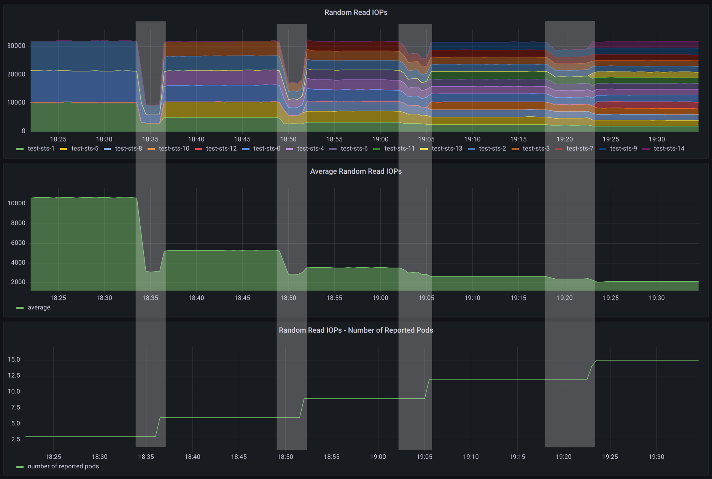

Note: the areas with the while background in the graph are transition periods. We can ignore the data in these areas. 

**Analysis & Conclusion**:
* From the scaling test so far, we can see that the total random read IOPs of all Longhorn volumes remains relatively the same (around 31500) when the number of Kbench pods increase.
  If we call the average random read IOPs each volume can achieve (x) and the number of volumes (y), they form a reciprocal function: x * y = 31500. 
  Users can use this information to make some prediction for this cluster:
  * The upper bound limit that Longhorn system can achieve in this cluster is 31500 random read IOPs
  * If each workload pod is doing 1000 random IOPs on average, there can be about 31 pods
* When the user keeps scaling up number of pods, eventually this reciprocal relation (x * y = 31500) might no longer hold as the CPU contention and other factors kick in (i.e. x*y will be less and less)
* The bottleneck in this cluster seems to be the IOPs performance of the EBS volumes on host instead of CPU, memory, or network bandwidth

#### 1 control plane node + 6 worker nodes
We double the number worker nodes (from 3 to 6) and double the number of Kbench pods (from 15 to 30)

**Result**:
> * The average random read IOPs per Longhorn volume is the same 2127
> * The total random IOPs can be achieved by all Longhorn volumes is doubled 63810

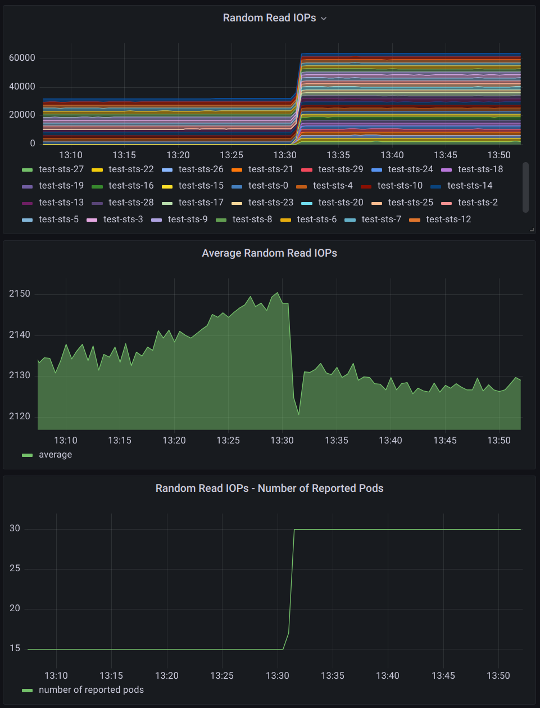

**Analysis & Conclusion**:
* Since the load is evenly distributed, we can see a linear relationship between total random IOPs and number of nodes: when the number of nodes is doubled, total random IOPs is doubled 
* From this reference, users can estimate how many worker nodes with the specified spec they need to achieve their target total random read IOPs

### Random Read IOPs - Rate Limited
In this test, we use 1 control plane node + 3 worker nodes. 
We add a rate limit to Kbench so that each Kbench pod is only doing 617 IOPs and observe the performance of Longhorn volumes.
Then we scale up the number of Kbench pod to 51 to see if the system is able to achieve 31467 random read IOPs.

<details>
<summary>We use this yaml manifest for the Kbench workload: </summary>
<br>

```yaml
apiVersion: apps/v1
kind: StatefulSet
metadata:
  name: test-sts
  namespace: default
spec:
  serviceName: test-sts
  replicas: 1
  selector:
    matchLabels:
      app: test-sts
  podManagementPolicy: Parallel
  template:
    metadata:
      labels:
        app: test-sts
    spec:
      containers:
        - name: kbench
          image: phanle1010/kbench:dev
          imagePullPolicy: Always
          env:
            - name: MODE
              value: "random-read-iops"
            - name: OUTPUT
              value: /test-result/device
            - name: FILE_NAME
              value: "/volume/test"
            - name: SIZE
              value: "15G"
            - name: CPU_IDLE_PROF
              value: "disabled"
            - name: SKIP_PARSE
              value: "true"
            - name: LONG_RUN
              value: "true"
            - name: RATE_IOPS
              value: "617"
          volumeMounts:
            - name: vol
              mountPath: /volume/
            - name: shared-data
              mountPath: /test-result
        - name: metric-exporter
          image: phanle1010/kbench:dev
          imagePullPolicy: Always
          readinessProbe:
            exec:
              command:
                - sh
                - -c
                - '[ "$(ls -A /test-result)" ]'
            initialDelaySeconds: 30
            periodSeconds: 10
          command:
            - metric-exporter
            - -d
            - start
          env:
            - name: DATA_DIR
              value: /test-result
            - name: VOLUME_ACCESS_MODE
              value: rwo
            - name: TEST_MODE
              value: read-only
            - name: RATE_LIMIT_TYPE
              value: rate-limit
          ports:
            - containerPort: 8080
              name: metrics
          volumeMounts:
            - name: vol
              mountPath: /volume/
            - name: shared-data
              mountPath: /test-result
      volumes:
        - name: shared-data
          emptyDir: {}
  volumeClaimTemplates:
    - metadata:
        name: vol
      spec:
        accessModes: ["ReadWriteOnce"]
        storageClassName: "longhorn"
        resources:
          requests:
            storage: 20Gi
```
</details>

**Result**:
> * The average random read IOPs per Longhorn volume is 616
> * The total random IOPs can be achieved by all 51 Longhorn volumes is 31416

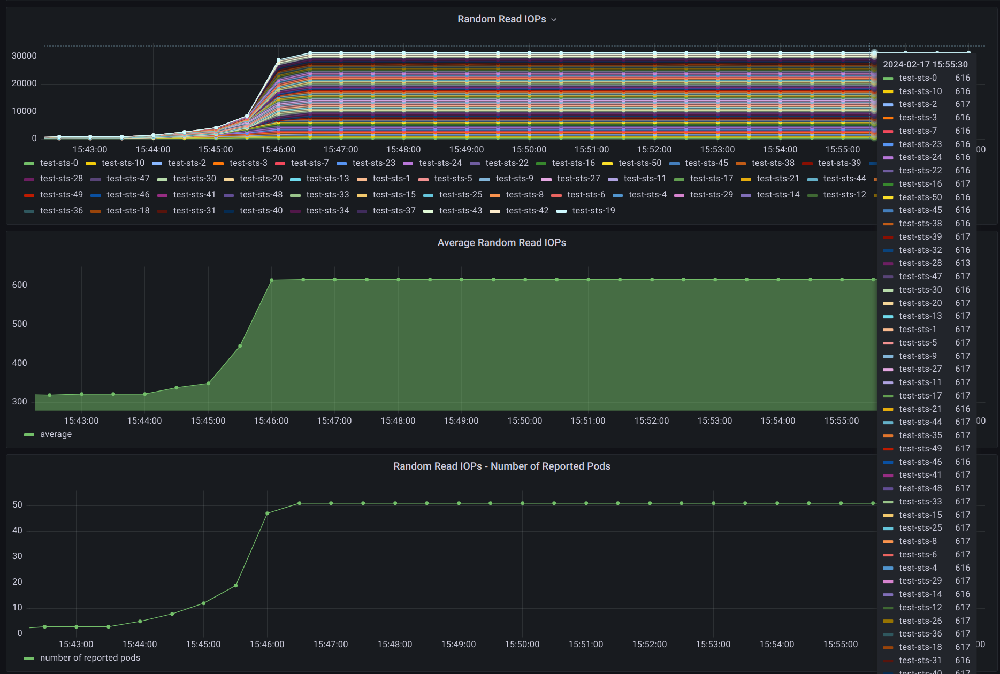

**Comments:**
* As discussed in the [Random Read IOPs - Stress Tests](#random-read-iops---stress-tests) section above, we come up with the conclusion that
`If we call the average random read IOPs each volume can achieve (x) and the number of volumes (y), they form a reciprocal function: x * y = 31500`
* The test result here further confirm this conclusion as x * y = 616*51 = 31416 (slightly lower than 31467 but it is insignificant difference)


### Sequential Read IOPs - Stress Tests

#### 1 control plane node + 3 worker nodes

We start with the cluster that has 1 control plane node + 3 worker nodes.

##### 1 Workload Pod Scale

First, we do a comparison between a single RWO Longhorn PVC against a single Local Path Provisioner volume.
We deploy 1 Kbench pod which attaches a Local Path Provisioner PVC.
Then we delete the above Kbench pod and PVC and repeat the test with Longhorn PVC instead.

We use this yaml manifest for the Kbench workload:
<details>
<summary>With local path provisioner storageclass</summary>
<br>

```yaml
apiVersion: apps/v1
kind: StatefulSet
metadata:
  name: test-sts
  namespace: default
spec:
  serviceName: test-sts
  replicas: 1
  selector:
    matchLabels:
      app: test-sts
  podManagementPolicy: Parallel
  template:
    metadata:
      labels:
        app: test-sts
    spec:
      containers:
        - name: kbench
          image: phanle1010/kbench:dev
          imagePullPolicy: Always
          env:
            - name: MODE
              value: "sequential-read-iops"
            - name: OUTPUT
              value: /test-result/device
            - name: FILE_NAME
              value: "/volume/test"
            - name: SIZE
              value: "15G"
            - name: CPU_IDLE_PROF
              value: "disabled"
            - name: SKIP_PARSE
              value: "true"
            - name: LONG_RUN
              value: "true"
          volumeMounts:
            - name: vol
              mountPath: /volume/
            - name: shared-data
              mountPath: /test-result
        - name: metric-exporter
          image: phanle1010/kbench:dev
          imagePullPolicy: Always
          readinessProbe:
            exec:
              command:
                - sh
                - -c
                - '[ "$(ls -A /test-result)" ]'
            initialDelaySeconds: 30
            periodSeconds: 10
          command:
          - metric-exporter
          - -d
          - start
          env:
            - name: DATA_DIR
              value: /test-result
            - name: VOLUME_ACCESS_MODE
              value: rwo
            - name: TEST_MODE
              value: read-only
            - name: RATE_LIMIT_TYPE
              value: no-rate-limit
          ports:
            - containerPort: 8080
              name: metrics
          volumeMounts:
            - name: vol
              mountPath: /volume/
            - name: shared-data
              mountPath: /test-result
      volumes:
        - name: shared-data
          emptyDir: {}
  volumeClaimTemplates:
    - metadata:
        name: vol
      spec:
        accessModes: ["ReadWriteOnce"]
        storageClassName: "local-path"
        resources:
          requests:
            storage: 20Gi
```
</details>

<details>
<summary>With longhorn storageclass</summary>
<br>

```yaml
apiVersion: apps/v1
kind: StatefulSet
metadata:
  name: test-sts
  namespace: default
spec:
  serviceName: test-sts
  replicas: 1
  selector:
    matchLabels:
      app: test-sts
  podManagementPolicy: Parallel
  template:
    metadata:
      labels:
        app: test-sts
    spec:
      containers:
        - name: kbench
          image: phanle1010/kbench:dev
          imagePullPolicy: Always
          env:
            - name: MODE
              value: "sequential-read-iops"
            - name: OUTPUT
              value: /test-result/device
            - name: FILE_NAME
              value: "/volume/test"
            - name: SIZE
              value: "15G"
            - name: CPU_IDLE_PROF
              value: "disabled"
            - name: SKIP_PARSE
              value: "true"
            - name: LONG_RUN
              value: "true"
          #            - name: RATE_IOPS
          #              value: "617"
          volumeMounts:
            - name: vol
              mountPath: /volume/
            - name: shared-data
              mountPath: /test-result
        - name: metric-exporter
          image: phanle1010/kbench:dev
          imagePullPolicy: Always
          readinessProbe:
            exec:
              command:
                - sh
                - -c
                - '[ "$(ls -A /test-result)" ]'
            initialDelaySeconds: 30
            periodSeconds: 10
          command:
            - metric-exporter
            - -d
            - start
          env:
            - name: DATA_DIR
              value: /test-result
            - name: VOLUME_ACCESS_MODE
              value: rwo
            - name: TEST_MODE
              value: read-only
            - name: RATE_LIMIT_TYPE
              value: no-rate-limit
          ports:
            - containerPort: 8080
              name: metrics
          volumeMounts:
            - name: vol
              mountPath: /volume/
            - name: shared-data
              mountPath: /test-result
      volumes:
        - name: shared-data
          emptyDir: {}
  volumeClaimTemplates:
    - metadata:
        name: vol
      spec:
        accessModes: ["ReadWriteOnce"]
        storageClassName: "longhorn"
        resources:
          requests:
            storage: 20Gi
```
</details>

Some of the important Kbench parameters we would like to call out are:
* `MODE: sequential-read-iops`: specifies that we are running [sequential read iops job](https://github.com/longhorn/kbench/blob/main/fio/iops-sequential-read.fio)
* `SIZE: 15G`: the `fio` test size is 15G, this will avoid cache effect
* PVC size is 20G

**Result**:
> * Local Path Provisioner: 10000
> * Longhorn: 39772

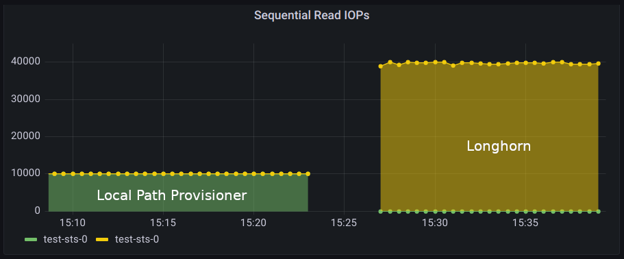

**Analysis & Conclusion**:
* We observe Longhorn volume achieves much bigger sequential read IOPs compares to the local path volume. 
  This can be explained by 2 factors:
  * Each Longhorn volume has 3 replicas so it can read concurrently from multiple replicas (each replica is on a different EBS disk) while the local path volume is reading from single EBS disk
  * When running Kbench with Longhorn volume, there is IO merging at both the kernel layer and EBS layer. 
    The IO merging can cause multiple Kbench IOs to be submitted as 1 therefore increasing the IOPs.
    This IO merging effect doesn't happen when running Kbench with local path volume.
    See more detailed explanation at https://github.com/longhorn/longhorn/pull/7905#issuecomment-1945463272

Next, we use Kbench with Longhorn PVCs and scale up the number of Kbench pods to see how sequential read IOPs is affected when there are more and more IO intensive pods.

##### 3 Workload Pods Scale 

Scaling workload from 1 to 3 pods.

**Result**:
> * Each Kbench pod is able to achieve 19840 sequential read IOPs on its Longhorn volume
> * Total sequential IOPs can be achieved by all 3 Longhorn volumes is: 59520


##### > 3 Workload Pods Scale

Scaling workload from 3 to 6, then 6 to 9, then 9 to 12, then 12 to 15

**Result**:
> * At 6 pods, the average sequential read IOPs per Longhorn volume is 10132. Total sequential read IOPs is 60792
> * At 9 pods, the average sequential read IOPs per Longhorn volume is 6875. Total sequential read IOPs is 61875
> * At 12 pods, the average sequential read IOPs per Longhorn volume is 5210. Total sequential read IOPs is 62520
> * At 15 pods, the average sequential read IOPs per Longhorn volume is 4159. Total sequential read IOPs is 62385


Note: the areas with the while background in the graph are transition periods. We can ignore the data in these areas.

**Analysis & Conclusion**:
* From the scaling test so far, we can see that the total sequential read IOPs of all Longhorn volumes remain relative same around 61500 when the number of Kbench pods increase.
  If we call the average sequential read IOPs each volume can achieve (x) and the number of volumes (y), they form a reciprocal function: x * y = 61500.
  Users can use this information to make some prediction for this cluster:
    * The upper bound limit that Longhorn system can achieve in this cluster is 61500 sequential read IOPs
    * If each workload pod is doing 1205 sequential IOPs on average, there can be 51 pods
* When the user keeps scaling up number of pods, eventually this reciprocal relation (x * y = 61500) might no longer hold as the CPU contention and other factors kick in (i.e. x*y will be reduced)
* The bottleneck in this cluster seems to be the IOPs performance of the EBS volumes on host instead of CPU, memory, or network bandwidth


#### 1 control plane node + 6 worker nodes

We double the number worker nodes (from 3 to 6) and double the number of Kbench pods (from 15 to 30)

**Result**:
> * The average sequential read IOPs per Longhorn volume is relatively the same around 4150 
> * The total sequential IOPs can be achieved by all Longhorn volumes is doubled to 124500


**Analysis & Conclusion**:
* Since the load is evenly distributed, we can see a linear relationship between total sequential IOPs and number of nodes: when the number of nodes is doubled, total sequential IOPs is doubled
* From this reference, users can estimate how many worker nodes with the specified spec they need to achieve their target total sequential read IOPs

### Sequential Read IOPs - Rate Limited

In this test, we use 1 control plane node + 3 worker nodes. 
We add a rate limit to Kbench so that each Kbench pod is only doing 1205 sequential read IOPs and observe the performance of Longhorn volumes. 
Then we scale up the number of Kbench pods to 51 to see if the system is able to achieve 61455 sequential read IOPs.

<details>
<summary>We use this yaml manifest for the Kbench workload: </summary>
<br>

```yaml
apiVersion: apps/v1
kind: StatefulSet
metadata:
  name: test-sts
  namespace: default
spec:
  serviceName: test-sts
  replicas: 1
  selector:
    matchLabels:
      app: test-sts
  podManagementPolicy: Parallel
  template:
    metadata:
      labels:
        app: test-sts
    spec:
      containers:
        - name: kbench
          image: phanle1010/kbench:dev
          imagePullPolicy: Always
          env:
            - name: MODE
              value: "sequential-read-iops"
            - name: OUTPUT
              value: /test-result/device
            - name: FILE_NAME
              value: "/volume/test"
            - name: SIZE
              value: "15G"
            - name: CPU_IDLE_PROF
              value: "disabled"
            - name: SKIP_PARSE
              value: "true"
            - name: LONG_RUN
              value: "true"
            - name: RATE_IOPS
              value: "1205"
          volumeMounts:
            - name: vol
              mountPath: /volume/
            - name: shared-data
              mountPath: /test-result
        - name: metric-exporter
          image: phanle1010/kbench:dev
          imagePullPolicy: Always
          readinessProbe:
            exec:
              command:
                - sh
                - -c
                - '[ "$(ls -A /test-result)" ]'
            initialDelaySeconds: 30
            periodSeconds: 10
          command:
            - metric-exporter
            - -d
            - start
          env:
            - name: DATA_DIR
              value: /test-result
            - name: VOLUME_ACCESS_MODE
              value: rwo
            - name: TEST_MODE
              value: read-only
            - name: RATE_LIMIT_TYPE
              value: rate-limit
          ports:
            - containerPort: 8080
              name: metrics
          volumeMounts:
            - name: vol
              mountPath: /volume/
            - name: shared-data
              mountPath: /test-result
      volumes:
        - name: shared-data
          emptyDir: {}
  volumeClaimTemplates:
    - metadata:
        name: vol
      spec:
        accessModes: ["ReadWriteOnce"]
        storageClassName: "longhorn"
        resources:
          requests:
            storage: 20Gi
```
</details>

**Result**:
> * The sequential read IOPs per Longhorn volume is 1190
> * The total sequential read IOPs can be achieved by all 51 Longhorn volumes is 60690


**Comments:**
* As discussed in the [Sequential Read IOPs - Stress Tests](#sequential-read-iops---stress-tests) section above, we come up with the conclusion that
  `If we call the sequential read IOPs each volume can achieve (x) and the number of volumes (y), they form a reciprocal function: x * y = 61500.`
* The test result here further confirm this conclusion as x * y = 1190*51 = 60690 (slightly lower than 61500 but it is insignificant difference)


### Random Read Bandwidth - Stress Tests

#### 1 control plane node + 3 worker nodes

We start with the cluster that has 1 control plane node + 3 worker nodes.

##### 1 Workload Pod Scale

First, we do a comparison between a single RWO Longhorn PVC against a single Local Path Provisioner volume.
We deploy 1 Kbench pod which attaches a Local Path Provisioner PVC.
Then we delete the above Kbench pod and PVC and repeat the test with Longhorn PVC instead.

We use this yaml manifest for the Kbench workload:
<details>
<summary>With local path provisioner storageclass</summary>
<br>

```yaml
apiVersion: apps/v1
kind: StatefulSet
metadata:
  name: test-sts
  namespace: default
spec:
  serviceName: test-sts
  replicas: 1
  selector:
    matchLabels:
      app: test-sts
  podManagementPolicy: Parallel
  template:
    metadata:
      labels:
        app: test-sts
    spec:
      containers:
        - name: kbench
          image: phanle1010/kbench:dev
          imagePullPolicy: Always
          env:
            - name: MODE
              value: "random-read-bandwidth"
            - name: OUTPUT
              value: /test-result/device
            - name: FILE_NAME
              value: "/volume/test"
            - name: SIZE
              value: "15G"
            - name: CPU_IDLE_PROF
              value: "disabled"
            - name: SKIP_PARSE
              value: "true"
            - name: LONG_RUN
              value: "true"
          #            - name: RATE_IOPS
          #              value: "1000"
          volumeMounts:
            - name: vol
              mountPath: /volume/
            - name: shared-data
              mountPath: /test-result
        - name: metric-exporter
          image: phanle1010/kbench:dev
          imagePullPolicy: Always
          readinessProbe:
            exec:
              command:
                - sh
                - -c
                - '[ "$(ls -A /test-result)" ]'
            initialDelaySeconds: 30
            periodSeconds: 10
          command:
            - metric-exporter
            - -d
            - start
          env:
            - name: DATA_DIR
              value: /test-result
            - name: VOLUME_ACCESS_MODE
              value: rwo
            - name: TEST_MODE
              value: read-only
            - name: RATE_LIMIT_TYPE
              value: no-rate-limit
          ports:
            - containerPort: 8080
              name: metrics
          volumeMounts:
            - name: vol
              mountPath: /volume/
            - name: shared-data
              mountPath: /test-result
      volumes:
        - name: shared-data
          emptyDir: {}
  volumeClaimTemplates:
    - metadata:
        name: vol
      spec:
        accessModes: ["ReadWriteOnce"]
        storageClassName: "local-path"
        resources:
          requests:
            storage: 20Gi
```
</details>

<details>
<summary>With longhorn storageclass</summary>
<br>

```yaml
apiVersion: apps/v1
kind: StatefulSet
metadata:
  name: test-sts
  namespace: default
spec:
  serviceName: test-sts
  replicas: 1
  selector:
    matchLabels:
      app: test-sts
  podManagementPolicy: Parallel
  template:
    metadata:
      labels:
        app: test-sts
    spec:
      containers:
        - name: kbench
          image: phanle1010/kbench:dev
          imagePullPolicy: Always
          env:
            - name: MODE
              value: "random-read-bandwidth"
            - name: OUTPUT
              value: /test-result/device
            - name: FILE_NAME
              value: "/volume/test"
            - name: SIZE
              value: "15G"
            - name: CPU_IDLE_PROF
              value: "disabled"
            - name: SKIP_PARSE
              value: "true"
            - name: LONG_RUN
              value: "true"
          #            - name: RATE_IOPS
          #              value: "1000"
          volumeMounts:
            - name: vol
              mountPath: /volume/
            - name: shared-data
              mountPath: /test-result
        - name: metric-exporter
          image: phanle1010/kbench:dev
          imagePullPolicy: Always
          readinessProbe:
            exec:
              command:
                - sh
                - -c
                - '[ "$(ls -A /test-result)" ]'
            initialDelaySeconds: 30
            periodSeconds: 10
          command:
            - metric-exporter
            - -d
            - start
          env:
            - name: DATA_DIR
              value: /test-result
            - name: VOLUME_ACCESS_MODE
              value: rwo
            - name: TEST_MODE
              value: read-only
            - name: RATE_LIMIT_TYPE
              value: no-rate-limit
          ports:
            - containerPort: 8080
              name: metrics
          volumeMounts:
            - name: vol
              mountPath: /volume/
            - name: shared-data
              mountPath: /test-result
      volumes:
        - name: shared-data
          emptyDir: {}
  volumeClaimTemplates:
    - metadata:
        name: vol
      spec:
        accessModes: ["ReadWriteOnce"]
        storageClassName: "longhorn"
        resources:
          requests:
            storage: 20Gi
```
</details>

Some of the important Kbench parameters we would like to call out are:
* `MODE: random-read-bandwidth`: specifies that we are running [random read bandwidth job](https://github.com/longhorn/kbench/blob/main/fio/bandwidth-random-read.fio)
* `SIZE: 15G`: the `fio` test size is 15G, this will avoid cache effect
* PVC size is 20G

**Result**:
> * Local Path Provisioner: 362 MiB/s
> * Longhorn: 874 MiB/s


**Analysis & Conclusion**:
* Because Longhorn has 3 replicas, it can read from 3 replicas concurrently, and thus may produce better read performance

Next, we use Kbench with Longhorn PVCs and scale up the number of Kbench pods to see how random read bandwidth is affected when there are more and more IO intensive pods.

##### 3 Workload Pods Scale

Scaling workload from 1 to 3 pods.

**Result**:
> * Each Kbench pod is able to achieve 386 MiB/s random read bandwidth on its Longhorn volume 
> * Total random read bandwidth can be achieved by all 3 Longhorn volumes is 1158


**Analysis & Conclusion**:
* Since each EBS volume on the host is provisioned with 360 MiB/s. Total IOPs of 3 EBS volumes is around 1080 MiB/s
It looks like Longhorn system is able to reach the maximum IOPs capacity of the 3 host EBS volumes. 
Longhorn is able to achieve slightly above 1080 MiB/s maybe due to small number of IO mergings or EBS actual bandwidth might be a bit higher the specified limit. 

##### > 3 Workload Pods Scale

Scaling workload from 3 to 6, then 6 to 9, then 9 to 12, then 12 to 15

**Result**:
> * At 6 pods, the average random read bandwidth per Longhorn volume is 196 MiB/s. Total random bandwidth is 1176 MiB/s
> * At 9 pods, the average random read bandwidth per Longhorn volume is 131 MiB/s. Total random bandwidth is 1179 MiB/s
> * At 12 pods, the average random read bandwidth per Longhorn volume is 97.5 MiB/s. Total random bandwidth is 1170 MiB/s
> * At 15 pods, the average random read bandwidth per Longhorn volume is 77.5 MiB/s. Total random bandwidth is 1162 MiB/s


**Analysis & Conclusion**:
* From the scaling test so far, we can see that the total random read bandwidth of all Longhorn volumes remain relatively the same around 1160 MiB/s when the number of Kbench pods increase. 
  If we call the average random read bandwidth each volume can achieve (x) and the number of volumes (y), they form a reciprocal function: x * y = 1160. 
  Users can use this information to make some prediction for this cluster:
  * The upper bound limit that Longhorn system can achieve in this cluster is 1160 MiB/s random read bandwidth
  * If each workload pod is doing 22.7 MiB/s random read bandwidth on average, there can be about 51 pods
* When the user keeps scaling up number of pods, eventually this reciprocal relation (x * y = 1160) might no longer hold as the CPU contention and other factors kick in (i.e. x*y will be less and less)
* The bottleneck in this cluster seems to be the IOPs performance of the EBS volumes on host instead of CPU, memory, or network bandwidth

#### 1 control plane node + 6 worker nodes

We double the number worker nodes (from 3 to 6) and double the number of Kbench pods (from 15 to 30)

**Result**:
> * The average random read bandwidth per Longhorn volume is the same around 77.3 MiB/s
> * The total random bandwidth can be achieved by all Longhorn volumes is doubled 2319 MiB/s


**Analysis & Conclusion**:
* Since the load is evenly distributed, we can see a linear relationship between total random read bandwidth and number of nodes: when the number of nodes is doubled, total random read bandwidth is doubled
* From this reference, users can estimate how many worker nodes with the specified spec they need to achieve their target total random read bandwidth.


### Random Read Bandwidth - Rate Limited

In this test, we use 1 control plane node + 3 worker nodes.
We add a rate limit to Kbench so that each Kbench pod is only doing 22.7 MiB/s random read bandwidth and observe the performance of Longhorn volumes.
Then we scale up the number of Kbench pods to 51 to see if the system is able to achieve 1157 MiB/s random read bandwidth

<details>
<summary>We use this yaml manifest for the Kbench workload: </summary>
<br>

```yaml
apiVersion: apps/v1
kind: StatefulSet
metadata:
  name: test-sts
  namespace: default
spec:
  serviceName: test-sts
  replicas: 1
  selector:
    matchLabels:
      app: test-sts
  podManagementPolicy: Parallel
  template:
    metadata:
      labels:
        app: test-sts
    spec:
      containers:
        - name: kbench
          image: phanle1010/kbench:dev
          imagePullPolicy: Always
          env:
            - name: MODE
              value: "random-read-bandwidth"
            - name: OUTPUT
              value: /test-result/device
            - name: FILE_NAME
              value: "/volume/test"
            - name: SIZE
              value: "15G"
            - name: CPU_IDLE_PROF
              value: "disabled"
            - name: SKIP_PARSE
              value: "true"
            - name: LONG_RUN
              value: "true"
            - name: RATE
              value: "23244k,"
          volumeMounts:
            - name: vol
              mountPath: /volume/
            - name: shared-data
              mountPath: /test-result
        - name: metric-exporter
          image: phanle1010/kbench:dev
          imagePullPolicy: Always
          readinessProbe:
            exec:
              command:
                - sh
                - -c
                - '[ "$(ls -A /test-result)" ]'
            initialDelaySeconds: 30
            periodSeconds: 10
          command:
            - metric-exporter
            - -d
            - start
          env:
            - name: DATA_DIR
              value: /test-result
            - name: VOLUME_ACCESS_MODE
              value: rwo
            - name: TEST_MODE
              value: read-only
            - name: RATE_LIMIT_TYPE
              value: rate-limit
          ports:
            - containerPort: 8080
              name: metrics
          volumeMounts:
            - name: vol
              mountPath: /volume/
            - name: shared-data
              mountPath: /test-result
      volumes:
        - name: shared-data
          emptyDir: {}
  volumeClaimTemplates:
    - metadata:
        name: vol
      spec:
        accessModes: ["ReadWriteOnce"]
        storageClassName: "longhorn"
        resources:
          requests:
            storage: 20Gi
```
</details>

**Result**:
> * The random read bandwidth per Longhorn volume is 22.3 MiB/s
> * The total random read bandwidth can be achieved by all 51 Longhorn volumes is 1137 MiB/s


**Analysis & Conclusion**:
* As discussed in the [Random Read Bandwidth - Stress Tests](#random-read-bandwidth---stress-tests) section above, we come up with the conclusion that
  `If we call the random read bandwidth each volume can achieve (x) and the number of volumes (y), they form a reciprocal function: x * y = 1160.`
* The test result here further confirm this conclusion as x * y = 22.3*51 = 1137 (slightly lower than 1160 as the CPU contention and other factors kick in)

### Sequential Read Bandwidth - Stress Tests
#### 1 control plane node + 3 worker nodes
We start with the cluster that has 1 control plane node + 3 worker nodes.

##### 1 Workload Pod Scale

First, we do a comparison between a single RWO Longhorn PVC against a single Local Path Provisioner volume.
We deploy 1 Kbench pod which attaches a Local Path Provisioner PVC.
Then we delete the above Kbench pod and PVC and repeat the test with Longhorn PVC instead.

We use this yaml manifest for the Kbench workload:
<details>
<summary>With local path provisioner storageclass</summary>
<br>

```yaml
apiVersion: apps/v1
kind: StatefulSet
metadata:
  name: test-sts
  namespace: default
spec:
  serviceName: test-sts
  replicas: 1
  selector:
    matchLabels:
      app: test-sts
  podManagementPolicy: Parallel
  template:
    metadata:
      labels:
        app: test-sts
    spec:
      containers:
        - name: kbench
          image: phanle1010/kbench:dev
          imagePullPolicy: Always
          env:
            - name: MODE
              value: "sequential-read-bandwidth"
            - name: OUTPUT
              value: /test-result/device
            - name: FILE_NAME
              value: "/volume/test"
            - name: SIZE
              value: "15G"
            - name: CPU_IDLE_PROF
              value: "disabled"
            - name: SKIP_PARSE
              value: "true"
            - name: LONG_RUN
              value: "true"
          #            - name: RATE
          #              value: "23244k,"
          volumeMounts:
            - name: vol
              mountPath: /volume/
            - name: shared-data
              mountPath: /test-result
        - name: metric-exporter
          image: phanle1010/kbench:dev
          imagePullPolicy: Always
          readinessProbe:
            exec:
              command:
                - sh
                - -c
                - '[ "$(ls -A /test-result)" ]'
            initialDelaySeconds: 30
            periodSeconds: 10
          command:
            - metric-exporter
            - -d
            - start
          env:
            - name: DATA_DIR
              value: /test-result
            - name: VOLUME_ACCESS_MODE
              value: rwo
            - name: TEST_MODE
              value: read-only
            - name: RATE_LIMIT_TYPE
              value: no-rate-limit
          ports:
            - containerPort: 8080
              name: metrics
          volumeMounts:
            - name: vol
              mountPath: /volume/
            - name: shared-data
              mountPath: /test-result
      volumes:
        - name: shared-data
          emptyDir: {}
  volumeClaimTemplates:
    - metadata:
        name: vol
      spec:
        accessModes: ["ReadWriteOnce"]
        storageClassName: "local-path"
        resources:
          requests:
            storage: 20Gi
```
</details>

<details>
<summary>With longhorn storageclass</summary>
<br>

```yaml
apiVersion: apps/v1
kind: StatefulSet
metadata:
  name: test-sts
  namespace: default
spec:
  serviceName: test-sts
  replicas: 1
  selector:
    matchLabels:
      app: test-sts
  podManagementPolicy: Parallel
  template:
    metadata:
      labels:
        app: test-sts
    spec:
      containers:
        - name: kbench
          image: phanle1010/kbench:dev
          imagePullPolicy: Always
          env:
            - name: MODE
              value: "sequential-read-bandwidth"
            - name: OUTPUT
              value: /test-result/device
            - name: FILE_NAME
              value: "/volume/test"
            - name: SIZE
              value: "15G"
            - name: CPU_IDLE_PROF
              value: "disabled"
            - name: SKIP_PARSE
              value: "true"
            - name: LONG_RUN
              value: "true"
          #            - name: RATE
          #              value: "23244k,"
          volumeMounts:
            - name: vol
              mountPath: /volume/
            - name: shared-data
              mountPath: /test-result
        - name: metric-exporter
          image: phanle1010/kbench:dev
          imagePullPolicy: Always
          readinessProbe:
            exec:
              command:
                - sh
                - -c
                - '[ "$(ls -A /test-result)" ]'
            initialDelaySeconds: 30
            periodSeconds: 10
          command:
            - metric-exporter
            - -d
            - start
          env:
            - name: DATA_DIR
              value: /test-result
            - name: VOLUME_ACCESS_MODE
              value: rwo
            - name: TEST_MODE
              value: read-only
            - name: RATE_LIMIT_TYPE
              value: no-rate-limit
          ports:
            - containerPort: 8080
              name: metrics
          volumeMounts:
            - name: vol
              mountPath: /volume/
            - name: shared-data
              mountPath: /test-result
      volumes:
        - name: shared-data
          emptyDir: {}
  volumeClaimTemplates:
    - metadata:
        name: vol
      spec:
        accessModes: ["ReadWriteOnce"]
        storageClassName: "longhorn"
        resources:
          requests:
            storage: 20Gi
```
</details>

Some of the important Kbench parameters we would like to call out are:
* `MODE: sequential-read-bandwidth`: specifies that we are running [sequential read bandwidth job](https://github.com/longhorn/kbench/blob/main/fio/bandwidth-sequential-read.fio)
* `SIZE: 15G`: the `fio` test size is 15G, this will avoid cache effect
* PVC size is 20G

**Result**:
> * Local Path Provisioner: 362 MiB/s
> * Longhorn: 669 MiB/s

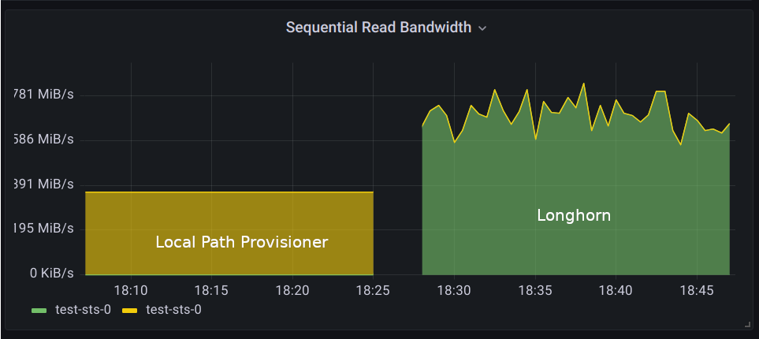

**Analysis & Conclusion**:
* Because Longhorn has 3 replicas, it can read from 3 replicas concurrently thus may produce better read performance
* _Note that the sequential read bandwidth is smaller than the random read bandwidth when testing against a single Longhorn volume of 3 replicas.
  We observed that this behavior happen when there is IO merging happen at kernel level and when the Longhorn volume has multiple replicas on different nodes.
  We don't understand the root cause of this behavior yet so we created a GitHub ticket to investigate it later https://github.com/longhorn/longhorn/issues/8108_

Next, we use Kbench with Longhorn PVCs and scale up the number of Kbench pods to see how sequential read bandwidth is affected when there are more and more IO intensive pods.

##### 3 Workload Pods Scale

Scaling workload from 1 to 3 pods.

**Result**:
> * Each Kbench pod is able to achieve 378 MiB/s sequential read bandwidth on its Longhorn volume
> * Total sequential read bandwidth can be achieved by all 3 Longhorn volumes is 1134


**Analysis & Conclusion**:
* Since each EBS volume on the host is provisioned with 360 MiB/s. Total IOPs of 3 EBS volumes is around 1080 MiB/s
  It looks like Longhorn system is able to reach the maximum bandwidth capacity of the 3 host EBS volumes.
  Longhorn is able to achieve slightly above 1080 MiB/s maybe due to small number of IO mergings or EBS actual bandwidth might be a bit higher the specified limit

##### > 3 Workload Pods Scale

Scaling workload from 3 to 6, then 6 to 9, then 9 to 12, then 12 to 15

**Result**:
> * At 6 pods, the average sequential read bandwidth per Longhorn volume is 192 MiB/s. Total sequential read bandwidth is 1152 MiB/s
> * At 9 pods, the average sequential read bandwidth per Longhorn volume is 126 MiB/s. Total sequential read bandwidth is 1179 MiB/s
> * At 12 pods, the average sequential read bandwidth per Longhorn volume is 94 MiB/s. Total sequential read bandwidth is 1128 MiB/s
> * At 15 pods, the average sequential read bandwidth per Longhorn volume is 74 MiB/s. Total sequential read bandwidth is 1110 MiB/s


**Analysis & Conclusion**:
* From the scaling test so far, we can see that the total sequential read bandwidth of all Longhorn volumes remain relatively the same around 1110 MiB/s when the number of Kbench pods increase.
  If we call the average sequential read bandwidth each volume can achieve (x) and the number of volumes (y), they form a reciprocal function: x * y = 1110
  Users can use this information to make some prediction for this cluster:
    * The upper bound limit that Longhorn system can achieve in this cluster is 1110 MiB/s sequential read bandwidth
    * If each workload pod is doing 21.7 MiB/s sequential read bandwidth on average, there can be 51 pods
* When the user keeps scaling up number of pods, eventually this reciprocal relation (x * y = 1160) might no longer hold as the CPU contention and other factors kick in (i.e. x*y will be less and less)
* The bottleneck in this cluster seems to be the IOPs performance of the EBS volumes on host instead of CPU, memory, or network bandwidth

#### 1 control plane node + 6 worker nodes


We double the number worker nodes (from 3 to 6) and double the number of Kbench pods (from 15 to 30)


**Result**:
> * The average sequential read bandwidth per Longhorn volume is the same around 74 MiB/s
> * The total sequential read bandwidth can be achieved by all Longhorn volumes is doubled 2220 MiB/s


**Analysis & Conclusion**:

* Since the load is evenly distributed, we can see a linear relationship between total sequential read bandwidth and number of nodes: when the number of nodes is doubled, total sequential read bandwidth is doubled
* From this reference, users can estimate how many worker nodes with the specified spec they need to achieve their target total sequential read bandwidth

### Sequential Read Bandwidth - Rate Limited

In this test, we use 1 control plane node + 3 worker nodes.
We add a rate limit to Kbench so that each Kbench pod is only doing 21.7 MiB/s sequential read bandwidth and observe the performance of Longhorn volumes.
Then we scale up the number of Kbench pods to 51 to see if the system is able to achieve 1107 MiB/s sequential read bandwidth.

<details>
<summary>We use this yaml manifest for the Kbench workload: </summary>
<br>

```yaml
apiVersion: apps/v1
kind: StatefulSet
metadata:
  name: test-sts
  namespace: default
spec:
  serviceName: test-sts
  replicas: 1
  selector:
    matchLabels:
      app: test-sts
  podManagementPolicy: Parallel
  template:
    metadata:
      labels:
        app: test-sts
    spec:
      containers:
        - name: kbench
          image: phanle1010/kbench:dev
          imagePullPolicy: Always
          env:
            - name: MODE
              value: "sequential-read-bandwidth"
            - name: OUTPUT
              value: /test-result/device
            - name: FILE_NAME
              value: "/volume/test"
            - name: SIZE
              value: "15G"
            - name: CPU_IDLE_PROF
              value: "disabled"
            - name: SKIP_PARSE
              value: "true"
            - name: LONG_RUN
              value: "true"
            - name: RATE
              value: "22220k,"
          volumeMounts:
            - name: vol
              mountPath: /volume/
            - name: shared-data
              mountPath: /test-result
        - name: metric-exporter
          image: phanle1010/kbench:dev
          imagePullPolicy: Always
          readinessProbe:
            exec:
              command:
                - sh
                - -c
                - '[ "$(ls -A /test-result)" ]'
            initialDelaySeconds: 22
            periodSeconds: 10
          command:
            - metric-exporter
            - -d
            - start
          env:
            - name: DATA_DIR
              value: /test-result
            - name: VOLUME_ACCESS_MODE
              value: rwo
            - name: TEST_MODE
              value: read-only
            - name: RATE_LIMIT_TYPE
              value: rate-limit
          ports:
            - containerPort: 8080
              name: metrics
          volumeMounts:
            - name: vol
              mountPath: /volume/
            - name: shared-data
              mountPath: /test-result
      volumes:
        - name: shared-data
          emptyDir: {}
  volumeClaimTemplates:
    - metadata:
        name: vol
      spec:
        accessModes: ["ReadWriteOnce"]
        storageClassName: "longhorn"
        resources:
          requests:
            storage: 20Gi
```
</details>

**Result**:
> * The sequential read bandwidth per Longhorn volume is 21.7 MiB/s
> * The total sequential read bandwidth can be achieved by all 51 Longhorn volumes is 1107 MiB/s


**Analysis & Conclusion**:
* As discussed in the [Sequential Read Bandwidth - Stress Tests](#sequential-read-bandwidth---stress-tests) section above, we come up with the conclusion that
  `If we call the sequential read bandwidth each volume can achieve (x) and the number of volumes (y), they form a reciprocal function: x * y = 1110`
* The test result here further confirm this conclusion as x * y = xxx*51 = 1107 (relatively same as 1110) 


### Random Read Latency - Stress Tests
In this test, we use a cluster that has 1 control plane node + 3 worker nodes.

First, we do a comparison between a single RWO Longhorn PVC against a single Local Path Provisioner volume.
We deploy 1 Kbench pod which attaches a Local Path Provisioner PVC.
Then we delete the above Kbench pod and PVC and repeat the test with Longhorn PVC instead.

We use this yaml manifest for the Kbench workload:
<details>
<summary>With local path provisioner storageclass</summary>
<br>

```yaml
apiVersion: apps/v1
kind: StatefulSet
metadata:
  name: test-sts
  namespace: default
spec:
  serviceName: test-sts
  replicas: 1
  selector:
    matchLabels:
      app: test-sts
  podManagementPolicy: Parallel
  template:
    metadata:
      labels:
        app: test-sts
    spec:
      containers:
        - name: kbench
          image: phanle1010/kbench:dev
          imagePullPolicy: Always
          env:
            - name: MODE
              value: "random-read-latency"
            - name: OUTPUT
              value: /test-result/device
            - name: FILE_NAME
              value: "/volume/test"
            - name: SIZE
              value: "15G"
            - name: CPU_IDLE_PROF
              value: "disabled"
            - name: SKIP_PARSE
              value: "true"
            - name: LONG_RUN
              value: "true"
          volumeMounts:
            - name: vol
              mountPath: /volume/
            - name: shared-data
              mountPath: /test-result
        - name: metric-exporter
          image: phanle1010/kbench:dev
          imagePullPolicy: Always
          readinessProbe:
            exec:
              command:
                - sh
                - -c
                - '[ "$(ls -A /test-result)" ]'
            initialDelaySeconds: 30
            periodSeconds: 10
          command:
            - metric-exporter
            - -d
            - start
          env:
            - name: DATA_DIR
              value: /test-result
            - name: VOLUME_ACCESS_MODE
              value: rwo
            - name: TEST_MODE
              value: read-only
            - name: RATE_LIMIT_TYPE
              value: no-rate-limit
          ports:
            - containerPort: 8080
              name: metrics
          volumeMounts:
            - name: vol
              mountPath: /volume/
            - name: shared-data
              mountPath: /test-result
      volumes:
        - name: shared-data
          emptyDir: {}
  volumeClaimTemplates:
    - metadata:
        name: vol
      spec:
        accessModes: ["ReadWriteOnce"]
        storageClassName: "local-path"
        resources:
          requests:
            storage: 20Gi
```
</details>

<details>
<summary>With longhorn storageclass</summary>
<br>

```yaml
apiVersion: apps/v1
kind: StatefulSet
metadata:
  name: test-sts
  namespace: default
spec:
  serviceName: test-sts
  replicas: 1
  selector:
    matchLabels:
      app: test-sts
  podManagementPolicy: Parallel
  template:
    metadata:
      labels:
        app: test-sts
    spec:
      containers:
        - name: kbench
          image: phanle1010/kbench:dev
          imagePullPolicy: Always
          env:
            - name: MODE
              value: "random-read-latency"
            - name: OUTPUT
              value: /test-result/device
            - name: FILE_NAME
              value: "/volume/test"
            - name: SIZE
              value: "15G"
            - name: CPU_IDLE_PROF
              value: "disabled"
            - name: SKIP_PARSE
              value: "true"
            - name: LONG_RUN
              value: "true"
          volumeMounts:
            - name: vol
              mountPath: /volume/
            - name: shared-data
              mountPath: /test-result
        - name: metric-exporter
          image: phanle1010/kbench:dev
          imagePullPolicy: Always
          readinessProbe:
            exec:
              command:
                - sh
                - -c
                - '[ "$(ls -A /test-result)" ]'
            initialDelaySeconds: 30
            periodSeconds: 10
          command:
            - metric-exporter
            - -d
            - start
          env:
            - name: DATA_DIR
              value: /test-result
            - name: VOLUME_ACCESS_MODE
              value: rwo
            - name: TEST_MODE
              value: read-only
            - name: RATE_LIMIT_TYPE
              value: no-rate-limit
          ports:
            - containerPort: 8080
              name: metrics
          volumeMounts:
            - name: vol
              mountPath: /volume/
            - name: shared-data
              mountPath: /test-result
      volumes:
        - name: shared-data
          emptyDir: {}
  volumeClaimTemplates:
    - metadata:
        name: vol
      spec:
        accessModes: ["ReadWriteOnce"]
        storageClassName: "longhorn"
        resources:
          requests:
            storage: 20Gi
```
</details>

Some of the important Kbench parameters we would like to call out are:
* `MODE: random-read-latency`: specifies that we are running [random read latency job](https://github.com/longhorn/kbench/blob/main/fio/latency-random-read.fio)
* `SIZE: 15G`: the `fio` test size is 15G, this will avoid cache effect
* PVC size is 20G

**Result**:
> * Local Path Provisioner: 500 microsecond
> * Longhorn: 750 microsecond


**Analysis & Conclusion**:
* Because the IO path of a Longhorn volume is more complicated than local path provisioner, it is expected that the Longhorn volume has bigger random read latency 

Next, we use Kbench with Longhorn PVCs and scale up the number of Kbench pods to see how random read latency is affected when there are more and more pods.

**Result**:

| Number of Kbench pods | Average Random Read Latency (ns) | 
|-----------------------|----------------------------------|
| 1                     | 742955                           |
| 3                     | 750170                           | 
| 6                     | 774555                           | 
| 9                     | 790714                           |
| 12                    | 810890                           |
| 15                    | 832421                           |
| 18                    | 858495                           |
| 21                    | 876277                           |
| 24                    | 902481                           |
| 27                    | 934727                           |
| 30                    | 972684                           |
| 33                    | 1014888                          |
| 36                    | 1117489                          |
| 39                    | 1212721                          |
| 42                    | 1304671                          |
| 45                    | 1391987                          |
| 48                    | 1488104                          |
| 51                    | 1581291                          |

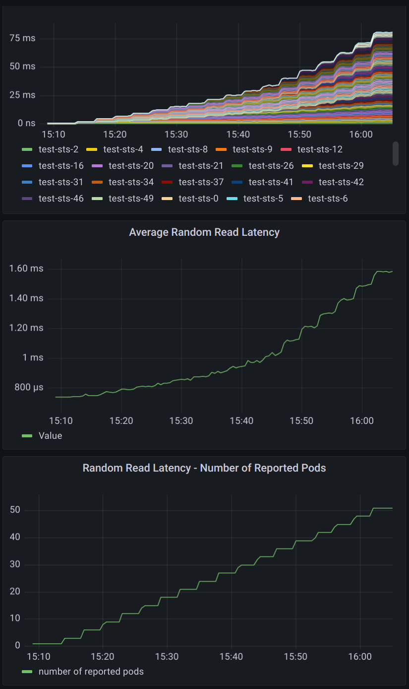

**Analysis & Conclusion**:
* As the number of kbench pods increase, the average random read latency of each Longhorn volume increase in non-linear fashion. 


### Sequential Read Latency - Stress Tests
In this test, we use a cluster that has 1 control plane node + 3 worker nodes.

First, we do a comparison between a single RWO Longhorn PVC against a single Local Path Provisioner volume.
We deploy 1 Kbench pod which attaches a Local Path Provisioner PVC.
Then we delete the above Kbench pod and PVC and repeat the test with Longhorn PVC instead.

We use this yaml manifest for the Kbench workload:
<details>
<summary>With local path provisioner storageclass</summary>
<br>

```yaml
apiVersion: apps/v1
kind: StatefulSet
metadata:
  name: test-sts
  namespace: default
spec:
  serviceName: test-sts
  replicas: 1
  selector:
    matchLabels:
      app: test-sts
  podManagementPolicy: Parallel
  template:
    metadata:
      labels:
        app: test-sts
    spec:
      containers:
        - name: kbench
          image: phanle1010/kbench:dev
          imagePullPolicy: Always
          env:
            - name: MODE
              value: "sequential-read-latency"
            - name: OUTPUT
              value: /test-result/device
            - name: FILE_NAME
              value: "/volume/test"
            - name: SIZE
              value: "15G"
            - name: CPU_IDLE_PROF
              value: "disabled"
            - name: SKIP_PARSE
              value: "true"
            - name: LONG_RUN
              value: "true"
          volumeMounts:
            - name: vol
              mountPath: /volume/
            - name: shared-data
              mountPath: /test-result
        - name: metric-exporter
          image: phanle1010/kbench:dev
          imagePullPolicy: Always
          readinessProbe:
            exec:
              command:
                - sh
                - -c
                - '[ "$(ls -A /test-result)" ]'
            initialDelaySeconds: 30
            periodSeconds: 10
          command:
            - metric-exporter
            - -d
            - start
          env:
            - name: DATA_DIR
              value: /test-result
            - name: VOLUME_ACCESS_MODE
              value: rwo
            - name: TEST_MODE
              value: read-only
            - name: RATE_LIMIT_TYPE
              value: no-rate-limit
          ports:
            - containerPort: 8080
              name: metrics
          volumeMounts:
            - name: vol
              mountPath: /volume/
            - name: shared-data
              mountPath: /test-result
      volumes:
        - name: shared-data
          emptyDir: {}
  volumeClaimTemplates:
    - metadata:
        name: vol
      spec:
        accessModes: ["ReadWriteOnce"]
        storageClassName: "local-path"
        resources:
          requests:
            storage: 20Gi
```
</details>

<details>
<summary>With longhorn storageclass</summary>
<br>

```yaml
apiVersion: apps/v1
kind: StatefulSet
metadata:
  name: test-sts
  namespace: default
spec:
  serviceName: test-sts
  replicas: 1
  selector:
    matchLabels:
      app: test-sts
  podManagementPolicy: Parallel
  template:
    metadata:
      labels:
        app: test-sts
    spec:
      containers:
        - name: kbench
          image: phanle1010/kbench:dev
          imagePullPolicy: Always
          env:
            - name: MODE
              value: "sequential-read-latency"
            - name: OUTPUT
              value: /test-result/device
            - name: FILE_NAME
              value: "/volume/test"
            - name: SIZE
              value: "15G"
            - name: CPU_IDLE_PROF
              value: "disabled"
            - name: SKIP_PARSE
              value: "true"
            - name: LONG_RUN
              value: "true"
          volumeMounts:
            - name: vol
              mountPath: /volume/
            - name: shared-data
              mountPath: /test-result
        - name: metric-exporter
          image: phanle1010/kbench:dev
          imagePullPolicy: Always
          readinessProbe:
            exec:
              command:
                - sh
                - -c
                - '[ "$(ls -A /test-result)" ]'
            initialDelaySeconds: 30
            periodSeconds: 10
          command:
            - metric-exporter
            - -d
            - start
          env:
            - name: DATA_DIR
              value: /test-result
            - name: VOLUME_ACCESS_MODE
              value: rwo
            - name: TEST_MODE
              value: read-only
            - name: RATE_LIMIT_TYPE
              value: no-rate-limit
          ports:
            - containerPort: 8080
              name: metrics
          volumeMounts:
            - name: vol
              mountPath: /volume/
            - name: shared-data
              mountPath: /test-result
      volumes:
        - name: shared-data
          emptyDir: {}
  volumeClaimTemplates:
    - metadata:
        name: vol
      spec:
        accessModes: ["ReadWriteOnce"]
        storageClassName: "longhorn"
        resources:
          requests:
            storage: 20Gi
```
</details>

Some of the important Kbench parameters we would like to call out are:
* `MODE: sequential-read-latency`: specifies that we are running [sequential read latency job](https://github.com/longhorn/kbench/blob/main/fio/latency-sequential-read.fio)
* `SIZE: 15G`: the `fio` test size is 15G, this will avoid cache effect
* PVC size is 20G

**Result**:
> * Local Path Provisioner: 480 microsecond
> * Longhorn: 740 microsecond

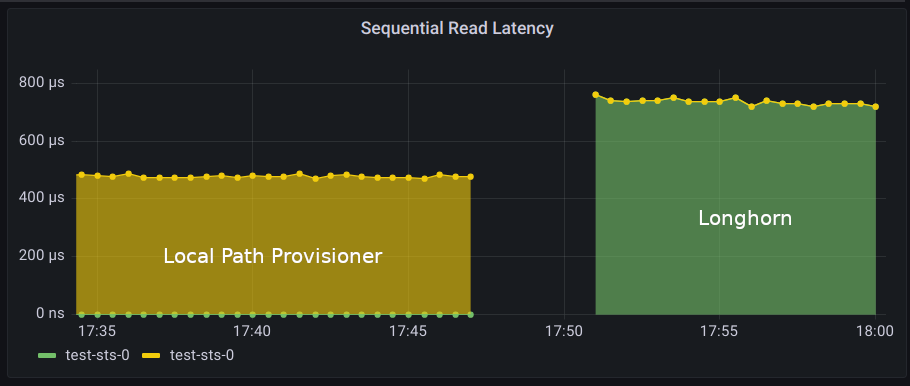

**Analysis & Conclusion**:
* Because the IO path of a Longhorn volume is longer than local path provisioner, it is expected that the Longhorn volume has bigger sequential read latency

Next, we use Kbench with Longhorn PVCs and scale up the number of Kbench pods to see how sequential read latency is affected when there are more and more pods.

**Result**:

| Number of Kbench pods | Average Random Read Latency (ns) | 
|-----------------------|----------------------------------|
| 1                     | 736699                           |
| 3                     | 745284                           | 
| 6                     | 766109                           | 
| 9                     | 790306                           |
| 12                    | 808654                           |
| 15                    | 827570                           |
| 18                    | 847532                           |
| 21                    | 869385                           |
| 24                    | 898042                           |
| 27                    | 926866                           |
| 30                    | 959980                           |
| 33                    | 1029409                          |
| 36                    | 1122368                          |
| 39                    | 1211142                          |
| 42                    | 1306095                          |
| 45                    | 1397748                          |
| 48                    | 1493102                          |
| 51                    | 1582556                          |

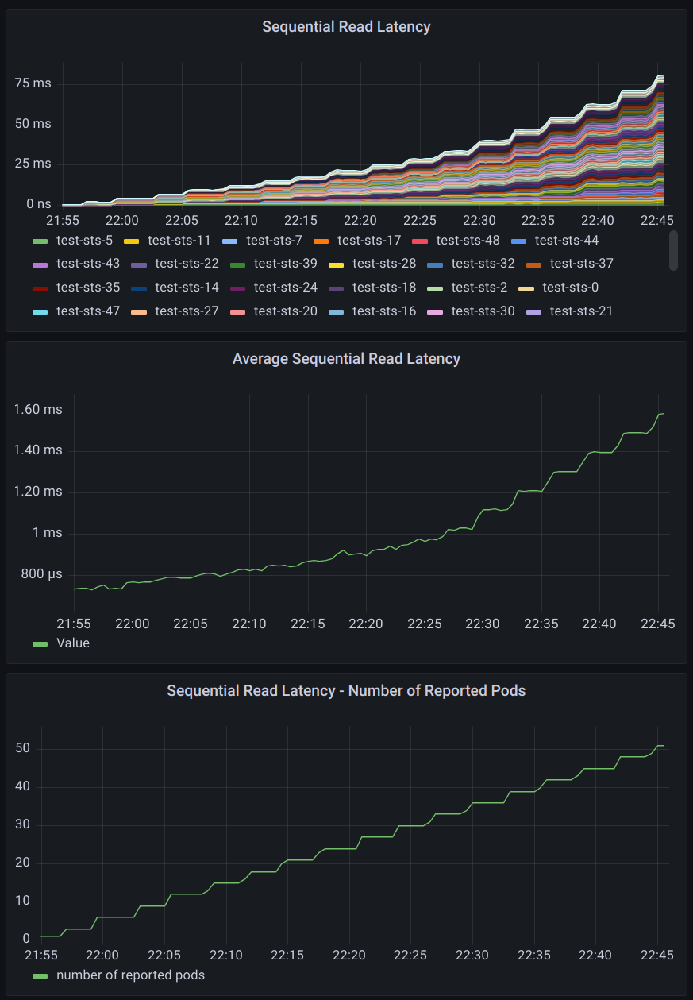

**Analysis & Conclusion**:
* Sequential read latency result is similar to random read latency
* As the number of kbench pods increase, the average sequential read latency of each Longhorn volume increase in non-linear fashion


## Write Performance

### Random Write IOPs - Stress Tests
#### 1 control plane node + 3 worker nodes

We start with the cluster that has 1 control plane node + 3 worker nodes.

##### > 1 Workload Pod Scale

First, we do a comparison between a single RWO Longhorn PVC against a single Local Path Provisioner volume.
We deploy 1 Kbench pod which attaches a Local Path Provisioner PVC.
Then we delete the above Kbench pod and PVC and repeat the test with Longhorn PVC instead.

We use this yaml manifest for the Kbench workload:
<details>
<summary>With local path provisioner storageclass</summary>
<br>

```yaml
apiVersion: apps/v1
kind: StatefulSet
metadata:
  name: test-sts
  namespace: default
spec:
  serviceName: test-sts
  replicas: 1
  selector:
    matchLabels:
      app: test-sts
  podManagementPolicy: Parallel
  template:
    metadata:
      labels:
        app: test-sts
    spec:
      containers:
        - name: kbench
          image: phanle1010/kbench:dev
          imagePullPolicy: Always
          env:
            - name: MODE
              value: "random-write-iops"
            - name: OUTPUT
              value: /test-result/device
            - name: FILE_NAME
              value: "/volume/test"
            - name: SIZE
              value: "15G"
            - name: CPU_IDLE_PROF
              value: "disabled"
            - name: SKIP_PARSE
              value: "true"
            - name: LONG_RUN
              value: "true"
          volumeMounts:
            - name: vol
              mountPath: /volume/
            - name: shared-data
              mountPath: /test-result
        - name: metric-exporter
          image: phanle1010/kbench:dev
          imagePullPolicy: Always
          readinessProbe:
            exec:
              command:
                - sh
                - -c
                - '[ "$(ls -A /test-result)" ]'
            initialDelaySeconds: 30
            periodSeconds: 10
          command:
          - metric-exporter
          - -d
          - start
          env:
            - name: DATA_DIR
              value: /test-result
            - name: VOLUME_ACCESS_MODE
              value: rwo
            - name: TEST_MODE
              value: write-only
            - name: RATE_LIMIT_TYPE
              value: no-rate-limit
          ports:
            - containerPort: 8080
              name: metrics
          volumeMounts:
            - name: vol
              mountPath: /volume/
            - name: shared-data
              mountPath: /test-result
      volumes:
        - name: shared-data
          emptyDir: {}
  volumeClaimTemplates:
    - metadata:
        name: vol
      spec:
        accessModes: ["ReadWriteOnce"]
        storageClassName: "local-path"
        resources:
          requests:
            storage: 20Gi
```
</details>

<details>
<summary>With longhorn storageclass</summary>
<br>

```yaml
apiVersion: apps/v1
kind: StatefulSet
metadata:
  name: test-sts
  namespace: default
spec:
  serviceName: test-sts
  replicas: 1
  selector:
    matchLabels:
      app: test-sts
  podManagementPolicy: Parallel
  template:
    metadata:
      labels:
        app: test-sts
    spec:
      containers:
        - name: kbench
          image: phanle1010/kbench:dev
          imagePullPolicy: Always
          env:
            - name: MODE
              value: "random-write-iops"
            - name: OUTPUT
              value: /test-result/device
            - name: FILE_NAME
              value: "/volume/test"
            - name: SIZE
              value: "15G"
            - name: CPU_IDLE_PROF
              value: "disabled"
            - name: SKIP_PARSE
              value: "true"
            - name: LONG_RUN
              value: "true"
          volumeMounts:
            - name: vol
              mountPath: /volume/
            - name: shared-data
              mountPath: /test-result
        - name: metric-exporter
          image: phanle1010/kbench:dev
          imagePullPolicy: Always
          readinessProbe:
            exec:
              command:
                - sh
                - -c
                - '[ "$(ls -A /test-result)" ]'
            initialDelaySeconds: 30
            periodSeconds: 10
          command:
          - metric-exporter
          - -d
          - start
          env:
            - name: DATA_DIR
              value: /test-result
            - name: VOLUME_ACCESS_MODE
              value: rwo
            - name: TEST_MODE
              value: write-only
            - name: RATE_LIMIT_TYPE
              value: no-rate-limit
          ports:
            - containerPort: 8080
              name: metrics
          volumeMounts:
            - name: vol
              mountPath: /volume/
            - name: shared-data
              mountPath: /test-result
      volumes:
        - name: shared-data
          emptyDir: {}
  volumeClaimTemplates:
    - metadata:
        name: vol
      spec:
        accessModes: ["ReadWriteOnce"]
        storageClassName: "longhorn"
        resources:
          requests:
            storage: 20Gi
```
</details>

Some of the important Kbench parameters we would like to call out are:
* `MODE: random-write-iops`: specifies that we are running [random write iops job](https://github.com/longhorn/kbench/blob/main/fio/iops-random-write.fio)
* `SIZE: 15G`: the `fio` test size is 15G, this will avoid cache effect
* PVC size is 20G

**Result**:
> * Local Path Provisioner: 9980
> * Longhorn: 1150


**Analysis & Conclusion**:
* Longhorn write speed is slower than local path volume because of several factors:
  * Because Longhorn has 3 replicas, it has to write to 3 replicas for each IO
  * By default, Longhorn has revision counter enabled which means that for each write IO, Longhorn has to do an additional write IO to write the revision counter
  * The Longhorn v1 tgt-iSCSI stack introduces some overhead

Next, we use Kbench with Longhorn PVCs and scale up the number of Kbench pods to see how random write IOPs is affected when there are more and more IO intensive pods.

##### 3 Workload Pods Scale

Scaling workload from 1 to 3 pods.
**Result**:
> * Each Kbench pod is able to achieve 1180 random write IOPs on its Longhorn volume
> * Total random write IOPs can be achieved by all 3 Longhorn volumes is 3540

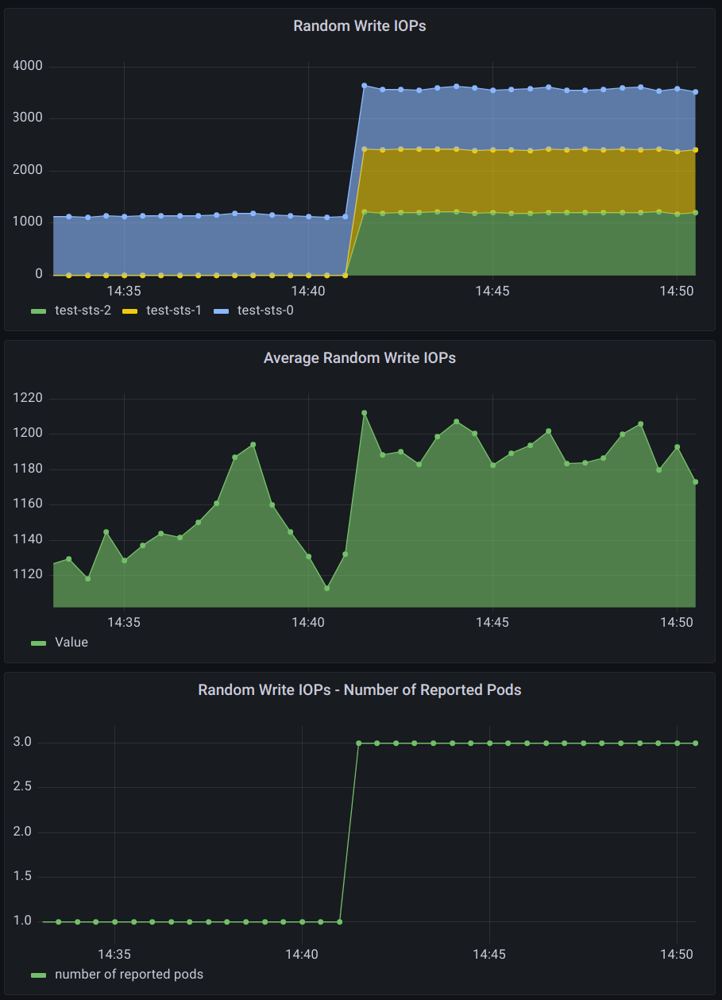

##### > 3 Workload Pods Scale

Scaling workload from 3 to 6, then 6 to 9, then 9 to 12, then 12 to 15
**Result**:
> * At 6 pods, the average random write IOPs per Longhorn volume is 852. Total random write IOPs is 5112
> * At 9 pods, the average random write IOPs per Longhorn volume is 576. Total random write IOPs is 5184
> * At 12 pods, the average random write IOPs per Longhorn volume is 436. Total random write IOPs is 5232
> * At 15 pods, the average random write IOPs per Longhorn volume is 350. Total random write IOPs is 5250

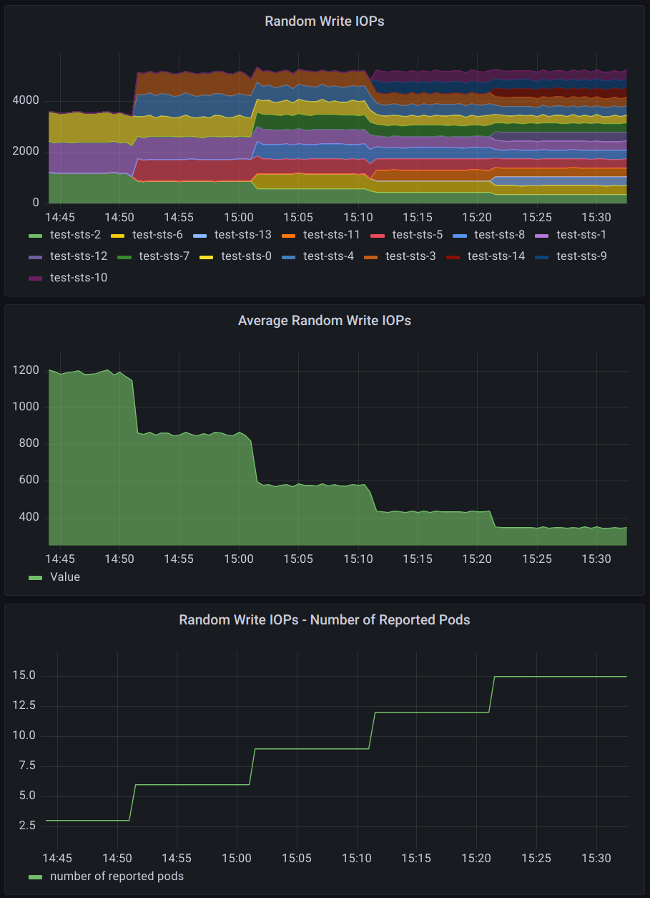

**Analysis & Conclusion**:
* From the scaling test so far, we can see that the total random write IOPs of all Longhorn volumes remain relatively the same around 5250 when the number of Kbench pods increase
* Since each EBS volume on the host is provisioned with 10000 IOPs. It looks like Longhorn system is able to reach half of the IOPs capacity of the host EBS volumes. This is due to the revision counter overhead.
* If we call the average random write IOPs each volume can achieve (x) and the number of volumes (y), they form a reciprocal function: x * y = 5250.
  Users can use this information to make some prediction for this cluster:
    * The upper bound limit that Longhorn system can achieve in this cluster is 5250 random write IOPs
    * If each workload pod is doing 102 random write IOPs in average, there can be 51 pods
* When the user keeps scaling up number of pods, eventually this reciprocal relation (x * y = 5250) might no longer hold as the CPU contention and other factors kick in (i.e. x*y will be less and less)
* The bottleneck in this cluster seems to be the IOPs performance of the EBS volumes on host instead of CPU, memory, or network bandwidth

#### 1 control plane node + 6 worker nodes

We double the number worker nodes (from 3 to 6) and double the number of Kbench pods (from 15 to 30)


**Result**:
> * The average random write IOPs per Longhorn volume is the same around 350
> * The total random write IOPs can be achieved by all Longhorn volumes is doubled 10500


**Analysis & Conclusion**:
* Since the load is evenly distributed, we can see a linear relationship between total random write IOPs and number of nodes: when the number of nodes is doubled, total random write IOPs is doubled
* From this reference, users can estimate how many worker nodes with the specified spec they need to achieve their target total random write IOPs

### Random Write IOPs - Rate Limited
In this test, we use 1 control plane node + 3 worker nodes.
We add a rate limit to Kbench so that each Kbench pod is only doing 102 random write IOPs and observe the performance of Longhorn volumes.
Then we scale up the number of Kbench pod to 51 to see if the system is able to achieve 102 * 51=5202 random write IOPs.

<details>
<summary>We use this yaml manifest for the Kbench workload: </summary>
<br>

```yaml
apiVersion: apps/v1
kind: StatefulSet
metadata:
  name: test-sts
  namespace: default
spec:
  serviceName: test-sts
  replicas: 1
  selector:
    matchLabels:
      app: test-sts
  podManagementPolicy: Parallel
  template:
    metadata:
      labels:
        app: test-sts
    spec:
      containers:
        - name: kbench
          image: phanle1010/kbench:dev
          imagePullPolicy: Always
          env:
            - name: MODE
              value: "random-write-iops"
            - name: OUTPUT
              value: /test-result/device
            - name: FILE_NAME
              value: "/volume/test"
            - name: SIZE
              value: "15G"
            - name: CPU_IDLE_PROF
              value: "disabled"
            - name: SKIP_PARSE
              value: "true"
            - name: LONG_RUN
              value: "true"
            - name: RATE_IOPS
              value: "102"
          volumeMounts:
            - name: vol
              mountPath: /volume/
            - name: shared-data
              mountPath: /test-result
        - name: metric-exporter
          image: phanle1010/kbench:dev
          imagePullPolicy: Always
          readinessProbe:
            exec:
              command:
                - sh
                - -c
                - '[ "$(ls -A /test-result)" ]'
            initialDelaySeconds: 22
            periodSeconds: 5
          command:
            - metric-exporter
            - -d
            - start
          env:
            - name: DATA_DIR
              value: /test-result
            - name: VOLUME_ACCESS_MODE
              value: rwo
            - name: TEST_MODE
              value: write-only
            - name: RATE_LIMIT_TYPE
              value: rate-limit
          ports:
            - containerPort: 8080
              name: metrics
          volumeMounts:
            - name: vol
              mountPath: /volume/
            - name: shared-data
              mountPath: /test-result
      volumes:
        - name: shared-data
          emptyDir: {}
  volumeClaimTemplates:
    - metadata:
        name: vol
      spec:
        accessModes: ["ReadWriteOnce"]
        storageClassName: "longhorn"
        resources:
          requests:
            storage: 20Gi
```
</details>

**Result**:
> * The average random write IOPs per Longhorn volume is 102
> * The total random write IOPs can be achieved by all 51 Longhorn volumes is 5202


**Analysis & Conclusion**:
* As discussed in the [Random Write IOPs - Stress Tests](#random-write-iops---stress-tests) section above, we come up with the conclusion that
  `If we call the average random write IOPs each volume can achieve (x) and the number of volumes (y), they form a reciprocal function: x * y = 5250`
* The test result here further confirm this conclusion as 102 * 51 = 5202

### Sequential Write IOPs - Stress Tests

We start with the cluster that has 1 control plane node + 3 worker nodes.

##### 1 Workload Pod Scale

First, we do a comparison between a single RWO Longhorn PVC against a single Local Path Provisioner volume.
We deploy 1 Kbench pod which attaches a Local Path Provisioner PVC.
Then we delete the above Kbench pod and PVC and repeat the test with Longhorn PVC instead.

We use this yaml manifest for the Kbench workload:
<details>
<summary>With local path provisioner storageclass</summary>
<br>

```yaml
apiVersion: apps/v1
kind: StatefulSet
metadata:
  name: test-sts
  namespace: default
spec:
  serviceName: test-sts
  replicas: 1
  selector:
    matchLabels:
      app: test-sts
  podManagementPolicy: Parallel
  template:
    metadata:
      labels:
        app: test-sts
    spec:
      containers:
        - name: kbench
          image: phanle1010/kbench:dev
          imagePullPolicy: Always
          env:
            - name: MODE
              value: "sequential-write-iops"
            - name: OUTPUT
              value: /test-result/device
            - name: FILE_NAME
              value: "/volume/test"
            - name: SIZE
              value: "15G"
            - name: CPU_IDLE_PROF
              value: "disabled"
            - name: SKIP_PARSE
              value: "true"
            - name: LONG_RUN
              value: "true"
          volumeMounts:
            - name: vol
              mountPath: /volume/
            - name: shared-data
              mountPath: /test-result
        - name: metric-exporter
          image: phanle1010/kbench:dev
          imagePullPolicy: Always
          readinessProbe:
            exec:
              command:
                - sh
                - -c
                - '[ "$(ls -A /test-result)" ]'
            initialDelaySeconds: 30
            periodSeconds: 10
          command:
          - metric-exporter
          - -d
          - start
          env:
            - name: DATA_DIR
              value: /test-result
            - name: VOLUME_ACCESS_MODE
              value: rwo
            - name: TEST_MODE
              value: write-only
            - name: RATE_LIMIT_TYPE
              value: no-rate-limit
          ports:
            - containerPort: 8080
              name: metrics
          volumeMounts:
            - name: vol
              mountPath: /volume/
            - name: shared-data
              mountPath: /test-result
      volumes:
        - name: shared-data
          emptyDir: {}
  volumeClaimTemplates:
    - metadata:
        name: vol
      spec:
        accessModes: ["ReadWriteOnce"]
        storageClassName: "local-path"
        resources:
          requests:
            storage: 20Gi
```
</details>

<details>
<summary>With longhorn storageclass</summary>
<br>

```yaml
apiVersion: apps/v1
kind: StatefulSet
metadata:
  name: test-sts
  namespace: default
spec:
  serviceName: test-sts
  replicas: 1
  selector:
    matchLabels:
      app: test-sts
  podManagementPolicy: Parallel
  template:
    metadata:
      labels:
        app: test-sts
    spec:
      containers:
        - name: kbench
          image: phanle1010/kbench:dev
          imagePullPolicy: Always
          env:
            - name: MODE
              value: "sequential-write-iops"
            - name: OUTPUT
              value: /test-result/device
            - name: FILE_NAME
              value: "/volume/test"
            - name: SIZE
              value: "15G"
            - name: CPU_IDLE_PROF
              value: "disabled"
            - name: SKIP_PARSE
              value: "true"
            - name: LONG_RUN
              value: "true"
          volumeMounts:
            - name: vol
              mountPath: /volume/
            - name: shared-data
              mountPath: /test-result
        - name: metric-exporter
          image: phanle1010/kbench:dev
          imagePullPolicy: Always
          readinessProbe:
            exec:
              command:
                - sh
                - -c
                - '[ "$(ls -A /test-result)" ]'
            initialDelaySeconds: 30
            periodSeconds: 10
          command:
          - metric-exporter
          - -d
          - start
          env:
            - name: DATA_DIR
              value: /test-result
            - name: VOLUME_ACCESS_MODE
              value: rwo
            - name: TEST_MODE
              value: write-only
            - name: RATE_LIMIT_TYPE
              value: no-rate-limit
          ports:
            - containerPort: 8080
              name: metrics
          volumeMounts:
            - name: vol
              mountPath: /volume/
            - name: shared-data
              mountPath: /test-result
      volumes:
        - name: shared-data
          emptyDir: {}
  volumeClaimTemplates:
    - metadata:
        name: vol
      spec:
        accessModes: ["ReadWriteOnce"]
        storageClassName: "longhorn"
        resources:
          requests:
            storage: 20Gi
```
</details>

Some of the important Kbench parameters we would like to call out are:
* `MODE: sequential-write-iops`: specifies that we are running [sequential write iops job](https://github.com/longhorn/kbench/blob/main/fio/iops-sequential-write.fio)
* `SIZE: 15G`: the `fio` test size is 15G, this will avoid cache effect
* PVC size is 20G

**Result**:
> * Local Path Provisioner: 10100
> * Longhorn: 2340


**Analysis & Conclusion**:
* Longhorn write speed is slower than local path volume because of several factors:
    * Because Longhorn has 3 replicas, it has to write to 3 replicas for each IO
    * By default, Longhorn has revision counter enabled which means that for each write IO, Longhorn has to do an additional write IO to write the revision counter
    * The Longhorn v1 tgt-iSCSI stack introduces some overhead

Next, we use Kbench with Longhorn PVCs and scale up the number of Kbench pods to see how sequential write IOPs is affected when there are more and more IO intensive pods.

##### 3 Workload Pods Scale

Scaling workload from 1 to 3 pods.
**Result**:
> * Each Kbench pod is able to achieve 2350 sequential write IOPs on its Longhorn volume
> * Total sequential write IOPs can be achieved by all 3 Longhorn volumes is 7050


##### > 3 Workload Pods Scale

Scaling workload from 3 to 6, then 6 to 9, then 9 to 12, then 12 to 15
**Result**:
> * At 6 pods, the average sequential write IOPs per Longhorn volume is 1745. Total sequential write IOPs is 10470
> * At 9 pods, the average sequential write IOPs per Longhorn volume is 1165. Total sequential write IOPs is 10485
> * At 12 pods, the average sequential write IOPs per Longhorn volume is 871. Total sequential write IOPs is 10452
> * At 15 pods, the average sequential write IOPs per Longhorn volume is 695. Total sequential write IOPs is 10425


**Analysis & Conclusion**:
* From the scaling test so far, we can see that the total sequential write IOPs of all Longhorn volumes remain relatively the same around 10400 when the number of Kbench pods increase
* Since each EBS volume on the host is provisioned with 10000 IOPs. It looks like Longhorn system is able to reach the IOPs capacity of the host EBS volumes. 
  Due to the IO merge, Longhorn does not need to update the revision counter frequently. Then the performance degradation caused by the revision counter is greatly reduced.
* If we call the average sequential write IOPs each volume can achieve (x) and the number of volumes (y), they form a reciprocal function: x * y = 10400.
  Users can use this information to make some prediction for this cluster:
    * The upper bound limit that Longhorn system can achieve in this cluster is 10400 sequential write IOPs
    * If each workload pod is doing 203 sequential write IOPs on average, there can be 51 pods
* When the user keeps scaling up number of pods, eventually this reciprocal relation (x * y = 10400) might no longer hold as the CPU contention and other factors kick in (i.e. x*y will be less and less)
* The bottleneck in this cluster seems to be the IOPs performance of the EBS volumes on host instead of CPU, memory, or network bandwidth

### Sequential Write IOPs - Rate Limited

In this test, we use 1 control plane node + 3 worker nodes.
We add a rate limit to Kbench so that each Kbench pod is only doing 203 sequential write IOPs and observe the performance of Longhorn volumes.
Then we scale up the number of Kbench pod to 51 to see if the system is able to achieve 203 * 51=10353 sequential write IOPs.

<details>
<summary>We use this yaml manifest for the Kbench workload: </summary>
<br>

```yaml
apiVersion: apps/v1
kind: StatefulSet
metadata:
  name: test-sts
  namespace: default
spec:
  serviceName: test-sts
  replicas: 1
  selector:
    matchLabels:
      app: test-sts
  podManagementPolicy: Parallel
  template:
    metadata:
      labels:
        app: test-sts
    spec:
      containers:
        - name: kbench
          image: phanle1010/kbench:dev
          imagePullPolicy: Always
          env:
            - name: MODE
              value: "sequential-write-iops"
            - name: OUTPUT
              value: /test-result/device
            - name: FILE_NAME
              value: "/volume/test"
            - name: SIZE
              value: "15G"
            - name: CPU_IDLE_PROF
              value: "disabled"
            - name: SKIP_PARSE
              value: "true"
            - name: LONG_RUN
              value: "true"
            - name: RATE_IOPS
              value: "203"
          volumeMounts:
            - name: vol
              mountPath: /volume/
            - name: shared-data
              mountPath: /test-result
        - name: metric-exporter
          image: phanle1010/kbench:dev
          imagePullPolicy: Always
          readinessProbe:
            exec:
              command:
                - sh
                - -c
                - '[ "$(ls -A /test-result)" ]'
            initialDelaySeconds: 22
            periodSeconds: 5
          command:
            - metric-exporter
            - -d
            - start
          env:
            - name: DATA_DIR
              value: /test-result
            - name: VOLUME_ACCESS_MODE
              value: rwo
            - name: TEST_MODE
              value: write-only
            - name: RATE_LIMIT_TYPE
              value: rate-limit
          ports:
            - containerPort: 8080
              name: metrics
          volumeMounts:
            - name: vol
              mountPath: /volume/
            - name: shared-data
              mountPath: /test-result
      volumes:
        - name: shared-data
          emptyDir: {}
  volumeClaimTemplates:
    - metadata:
        name: vol
      spec:
        accessModes: ["ReadWriteOnce"]
        storageClassName: "longhorn"
        resources:
          requests:
            storage: 20Gi
```
</details>

**Result**:
> * The average sequential write IOPs per Longhorn volume is 201
> * The total sequential write IOPs can be achieved by all 51 Longhorn volumes is 10251


**Analysis & Conclusion**:
* As discussed in the [Sequential Write IOPs - Stress Tests](#sequential-write-iops---stress-tests) section above, we come up with the conclusion that
  `If we call the average sequential write IOPs each volume can achieve (x) and the number of volumes (y), they form a reciprocal function: x * y = 10400`
* The test result here further confirm this conclusion as 201 * 51 = 10251 (slightly lower than 10400)

### Random Write Bandwidth - Stress Tests
#### 1 control plane node + 3 worker nodes

We start with the cluster that has 1 control plane node + 3 worker nodes.

##### > 1 Workload Pod Scale

First, we do a comparison between a single RWO Longhorn PVC against a single Local Path Provisioner volume.
We deploy 1 Kbench pod which attaches a Local Path Provisioner PVC.
Then we delete the above Kbench pod and PVC and repeat the test with Longhorn PVC instead.

We use this yaml manifest for the Kbench workload:
<details>
<summary>With local path provisioner storageclass</summary>
<br>

```yaml
apiVersion: apps/v1
kind: StatefulSet
metadata:
  name: test-sts
  namespace: default
spec:
  serviceName: test-sts
  replicas: 1
  selector:
    matchLabels:
      app: test-sts
  podManagementPolicy: Parallel
  template:
    metadata:
      labels:
        app: test-sts
    spec:
      containers:
        - name: kbench
          image: phanle1010/kbench:dev
          imagePullPolicy: Always
          env:
            - name: MODE
              value: "random-write-bandwidth"
            - name: OUTPUT
              value: /test-result/device
            - name: FILE_NAME
              value: "/volume/test"
            - name: SIZE
              value: "15G"
            - name: CPU_IDLE_PROF
              value: "disabled"
            - name: SKIP_PARSE
              value: "true"
            - name: LONG_RUN
              value: "true"
          #            - name: RATE
          #              value: "22220k,"
          volumeMounts:
            - name: vol
              mountPath: /volume/
            - name: shared-data
              mountPath: /test-result
        - name: metric-exporter
          image: phanle1010/kbench:dev
          imagePullPolicy: Always
          readinessProbe:
            exec:
              command:
                - sh
                - -c
                - '[ "$(ls -A /test-result)" ]'
            initialDelaySeconds: 22
            periodSeconds: 10
          command:
            - metric-exporter
            - -d
            - start
          env:
            - name: DATA_DIR
              value: /test-result
            - name: VOLUME_ACCESS_MODE
              value: rwo
            - name: TEST_MODE
              value: write-only
            - name: RATE_LIMIT_TYPE
              value: no-rate-limit
          ports:
            - containerPort: 8080
              name: metrics
          volumeMounts:
            - name: vol
              mountPath: /volume/
            - name: shared-data
              mountPath: /test-result
      volumes:
        - name: shared-data
          emptyDir: {}
  volumeClaimTemplates:
    - metadata:
        name: vol
      spec:
        accessModes: ["ReadWriteOnce"]
        storageClassName: "local-path"
        resources:
          requests:
            storage: 20Gi
```
</details>

<details>
<summary>With longhorn storageclass</summary>
<br>

```yaml
apiVersion: apps/v1
kind: StatefulSet
metadata:
  name: test-sts
  namespace: default
spec:
  serviceName: test-sts
  replicas: 1
  selector:
    matchLabels:
      app: test-sts
  podManagementPolicy: Parallel
  template:
    metadata:
      labels:
        app: test-sts
    spec:
      containers:
        - name: kbench
          image: phanle1010/kbench:dev
          imagePullPolicy: Always
          env:
            - name: MODE
              value: "random-write-bandwidth"
            - name: OUTPUT
              value: /test-result/device
            - name: FILE_NAME
              value: "/volume/test"
            - name: SIZE
              value: "15G"
            - name: CPU_IDLE_PROF
              value: "disabled"
            - name: SKIP_PARSE
              value: "true"
            - name: LONG_RUN
              value: "true"
          #            - name: RATE
          #              value: "22220k,"
          volumeMounts:
            - name: vol
              mountPath: /volume/
            - name: shared-data
              mountPath: /test-result
        - name: metric-exporter
          image: phanle1010/kbench:dev
          imagePullPolicy: Always
          readinessProbe:
            exec:
              command:
                - sh
                - -c
                - '[ "$(ls -A /test-result)" ]'
            initialDelaySeconds: 22
            periodSeconds: 10
          command:
            - metric-exporter
            - -d
            - start
          env:
            - name: DATA_DIR
              value: /test-result
            - name: VOLUME_ACCESS_MODE
              value: rwo
            - name: TEST_MODE
              value: write-only
            - name: RATE_LIMIT_TYPE
              value: no-rate-limit
          ports:
            - containerPort: 8080
              name: metrics
          volumeMounts:
            - name: vol
              mountPath: /volume/
            - name: shared-data
              mountPath: /test-result
      volumes:
        - name: shared-data
          emptyDir: {}
  volumeClaimTemplates:
    - metadata:
        name: vol
      spec:
        accessModes: ["ReadWriteOnce"]
        storageClassName: "longhorn"
        resources:
          requests:
            storage: 20Gi
```
</details>

Some of the important Kbench parameters we would like to call out are:
* `MODE: random-write-bandwidth`: specifies that we are running [random write bandwidth job](https://github.com/longhorn/kbench/blob/main/fio/bandwidth-random-write.fio)
* `SIZE: 15G`: the `fio` test size is 15G, this will avoid cache effect
* PVC size is 20G

**Result**:
> * Local Path Provisioner: 362 MiB/s
> * Longhorn: 159 MiB/s

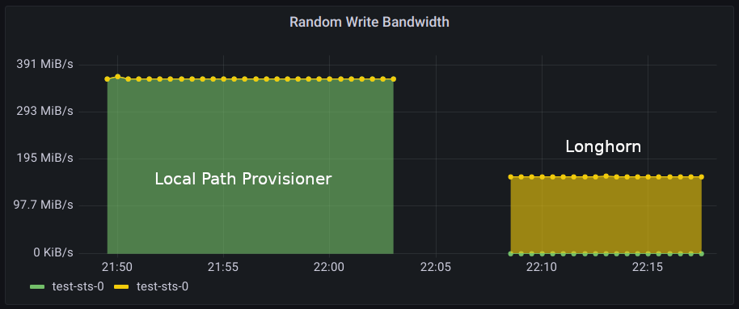

**Analysis & Conclusion**:
* Longhorn write speed is slower than local path volume because of several factors:
    * Because Longhorn has 3 replicas, it has to write to 3 replicas for each IO
    * By default, Longhorn has revision counter enabled which means that for each write IO, Longhorn has to do an additional write IO to write the revision counter
    * The Longhorn v1 tgt-iSCSI stack introduces some overhead


Next, we use Kbench with Longhorn PVCs and scale up the number of Kbench pods to see how random write bandwidth is affected when there are more and more IO intensive pods.

##### 3 Workload Pods Scale

Scaling workload from 1 to 3 pods.


**Result**:
> * Each Kbench pod is able to achieve 118 MiB/s random write bandwidth on its Longhorn volume
> * Total random write bandwidth can be achieved by all 3 Longhorn volumes is 354 MiB/s


**Analysis & Conclusion**:
* Since each EBS volume on the host is provisioned with 360 MiB/s. 
  It looks like Longhorn system is able to reach the maximum bandwidth capacity of the host EBS disks

##### > 3 Workload Pods Scale
Scaling workload from 3 to 6, then 6 to 9, then 9 to 12, then 12 to 15

**Result**:
> * At 6 pods, the average random write bandwidth per Longhorn volume is 63.2 MiB/s. Total random write bandwidth is 379.2 MiB/s
> * At 9 pods, the average random write bandwidth per Longhorn volume is 42.2 MiB/s. Total random write bandwidth is 379.8 MiB/s
> * At 12 pods, the average random write bandwidth per Longhorn volume is 31.4 MiB/s. Total random write bandwidth is 376.8 MiB/s
> * At 15 pods, the average random write bandwidth per Longhorn volume is 25.1 MiB/s. Total random write bandwidth is 376.5 MiB/s


**Analysis & Conclusion**:
* From the scaling test so far, we can see that the total random write bandwidth of all Longhorn volumes remain relatively the same around 376.5 MiB/s when the number of Kbench pods increase
  If we call the average random write bandwidth each volume can achieve (x) and the number of volumes (y), they form a reciprocal function: x * y = 376.5.
  Users can use this information to make some prediction for this cluster:
    * The upper bound limit that Longhorn system can achieve in this cluster is 376.5 MiB/s random write bandwidth
    * If each workload pod is doing 7.38 MiB/s random read bandwidth on average, there can be 51 pods
* When the user keeps scaling up number of pods, eventually this reciprocal relation (x * y = 376.5) might no longer hold as the CPU contention and other factors kick in (i.e. x*y will be less and less)
* The bottleneck in this cluster seems to be the IOPs performance of the EBS volumes on host instead of CPU, memory, or network bandwidth


### Random Write Bandwidth - Rate Limited Tests

In this test, we use 1 control plane node + 3 worker nodes.
We add a rate limit to Kbench so that each Kbench pod is only doing 7.38 MiB/s random write bandwidth and observe the performance of Longhorn volumes.
Then we scale up the number of Kbench pods to 51 to see if the system is able to achieve 376.38 MiB/s random write bandwidth.

<details>
<summary>We use this yaml manifest for the Kbench workload: </summary>
<br>

```yaml
apiVersion: apps/v1
kind: StatefulSet
metadata:
  name: test-sts
  namespace: default
spec:
  serviceName: test-sts
  replicas: 1
  selector:
    matchLabels:
      app: test-sts
  podManagementPolicy: Parallel
  template:
    metadata:
      labels:
        app: test-sts
    spec:
      containers:
        - name: kbench
          image: phanle1010/kbench:dev
          imagePullPolicy: Always
          env:
            - name: MODE
              value: "random-write-bandwidth"
            - name: OUTPUT
              value: /test-result/device
            - name: FILE_NAME
              value: "/volume/test"
            - name: SIZE
              value: "15G"
            - name: CPU_IDLE_PROF
              value: "disabled"
            - name: SKIP_PARSE
              value: "true"
            - name: LONG_RUN
              value: "true"
            - name: RATE
              value: ",7559k"
          volumeMounts:
            - name: vol
              mountPath: /volume/
            - name: shared-data
              mountPath: /test-result
        - name: metric-exporter
          image: phanle1010/kbench:dev
          imagePullPolicy: Always
          readinessProbe:
            exec:
              command:
                - sh
                - -c
                - '[ "$(ls -A /test-result)" ]'
            initialDelaySeconds: 22
            periodSeconds: 10
          command:
            - metric-exporter
            - -d
            - start
          env:
            - name: DATA_DIR
              value: /test-result
            - name: VOLUME_ACCESS_MODE
              value: rwo
            - name: TEST_MODE
              value: write-only
            - name: RATE_LIMIT_TYPE
              value: rate-limit
          ports:
            - containerPort: 8080
              name: metrics
          volumeMounts:
            - name: vol
              mountPath: /volume/
            - name: shared-data
              mountPath: /test-result
      volumes:
        - name: shared-data
          emptyDir: {}
  volumeClaimTemplates:
    - metadata:
        name: vol
      spec:
        accessModes: ["ReadWriteOnce"]
        storageClassName: "longhorn"
        resources:
          requests:
            storage: 20Gi
```
</details>

**Result**:
> * The random write bandwidth per Longhorn volume is 7.38 MiB/s
> * The total random write bandwidth can be achieved by all 51 Longhorn volumes is 376.38 MiB/s

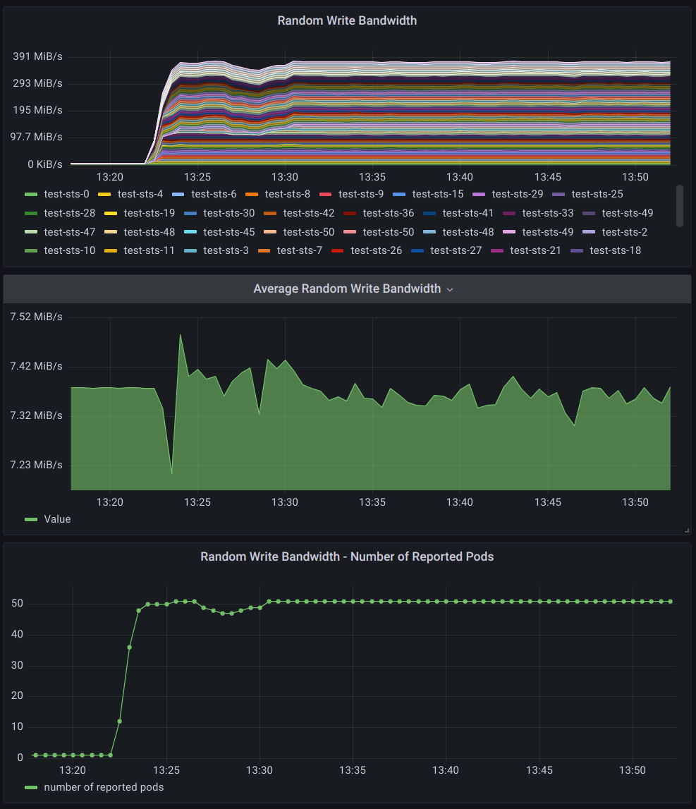

**Analysis & Conclusion**:
* As discussed in the [Random Write Bandwidth - Stress Tests](#random-write-bandwidth---stress-tests) section above, we come up with the conclusion that
  `If we call the random write bandwidth each volume can achieve (x) and the number of volumes (y), they form a reciprocal function: x * y = 376.5`
* The test result here further confirm this conclusion as x * y = 7.38*51 = 376.38 


### Sequential Write Bandwidth - Stress Tests

We start with the cluster that has 1 control plane node + 3 worker nodes.

##### 1 Workload Pod Scale

First, we do a comparison between a single RWO Longhorn PVC against a single Local Path Provisioner volume.
We deploy 1 Kbench pod which attaches a Local Path Provisioner PVC.
Then we delete the above Kbench pod and PVC and repeat the test with Longhorn PVC instead.

We use this yaml manifest for the Kbench workload:
<details>
<summary>With local path provisioner storageclass</summary>
<br>

```yaml
apiVersion: apps/v1
kind: StatefulSet
metadata:
  name: test-sts
  namespace: default
spec:
  serviceName: test-sts
  replicas: 1
  selector:
    matchLabels:
      app: test-sts
  podManagementPolicy: Parallel
  template:
    metadata:
      labels:
        app: test-sts
    spec:
      containers:
        - name: kbench
          image: phanle1010/kbench:dev
          imagePullPolicy: Always
          env:
            - name: MODE
              value: "sequential-write-bandwidth"
            - name: OUTPUT
              value: /test-result/device
            - name: FILE_NAME
              value: "/volume/test"
            - name: SIZE
              value: "15G"
            - name: CPU_IDLE_PROF
              value: "disabled"
            - name: SKIP_PARSE
              value: "true"
            - name: LONG_RUN
              value: "true"
          #            - name: RATE
          #              value: "22220k,"
          volumeMounts:
            - name: vol
              mountPath: /volume/
            - name: shared-data
              mountPath: /test-result
        - name: metric-exporter
          image: phanle1010/kbench:dev
          imagePullPolicy: Always
          readinessProbe:
            exec:
              command:
                - sh
                - -c
                - '[ "$(ls -A /test-result)" ]'
            initialDelaySeconds: 22
            periodSeconds: 10
          command:
            - metric-exporter
            - -d
            - start
          env:
            - name: DATA_DIR
              value: /test-result
            - name: VOLUME_ACCESS_MODE
              value: rwo
            - name: TEST_MODE
              value: write-only
            - name: RATE_LIMIT_TYPE
              value: no-rate-limit
          ports:
            - containerPort: 8080
              name: metrics
          volumeMounts:
            - name: vol
              mountPath: /volume/
            - name: shared-data
              mountPath: /test-result
      volumes:
        - name: shared-data
          emptyDir: {}
  volumeClaimTemplates:
    - metadata:
        name: vol
      spec:
        accessModes: ["ReadWriteOnce"]
        storageClassName: "local-path"
        resources:
          requests:
            storage: 20Gi
```
</details>

<details>
<summary>With longhorn storageclass</summary>
<br>

```yaml
apiVersion: apps/v1
kind: StatefulSet
metadata:
  name: test-sts
  namespace: default
spec:
  serviceName: test-sts
  replicas: 1
  selector:
    matchLabels:
      app: test-sts
  podManagementPolicy: Parallel
  template:
    metadata:
      labels:
        app: test-sts
    spec:
      containers:
        - name: kbench
          image: phanle1010/kbench:dev
          imagePullPolicy: Always
          env:
            - name: MODE
              value: "sequential-write-bandwidth"
            - name: OUTPUT
              value: /test-result/device
            - name: FILE_NAME
              value: "/volume/test"
            - name: SIZE
              value: "15G"
            - name: CPU_IDLE_PROF
              value: "disabled"
            - name: SKIP_PARSE
              value: "true"
            - name: LONG_RUN
              value: "true"
          #            - name: RATE
          #              value: "22220k,"
          volumeMounts:
            - name: vol
              mountPath: /volume/
            - name: shared-data
              mountPath: /test-result
        - name: metric-exporter
          image: phanle1010/kbench:dev
          imagePullPolicy: Always
          readinessProbe:
            exec:
              command:
                - sh
                - -c
                - '[ "$(ls -A /test-result)" ]'
            initialDelaySeconds: 22
            periodSeconds: 10
          command:
            - metric-exporter
            - -d
            - start
          env:
            - name: DATA_DIR
              value: /test-result
            - name: VOLUME_ACCESS_MODE
              value: rwo
            - name: TEST_MODE
              value: write-only
            - name: RATE_LIMIT_TYPE
              value: no-rate-limit
          ports:
            - containerPort: 8080
              name: metrics
          volumeMounts:
            - name: vol
              mountPath: /volume/
            - name: shared-data
              mountPath: /test-result
      volumes:
        - name: shared-data
          emptyDir: {}
  volumeClaimTemplates:
    - metadata:
        name: vol
      spec:
        accessModes: ["ReadWriteOnce"]
        storageClassName: "longhorn"
        resources:
          requests:
            storage: 20Gi
```
</details>

Some of the important Kbench parameters we would like to call out are:
* `MODE: sequential-write-bandwidth`: specifies that we are running [sequential write bandwidth job](https://github.com/longhorn/kbench/blob/main/fio/bandwidth-sequential-write.fio)
* `SIZE: 15G`: the `fio` test size is 15G, this will avoid cache effect
* PVC size is 20G

**Result**:
> * Local Path Provisioner: 362 MiB/s
> * Longhorn: 291 MiB/s

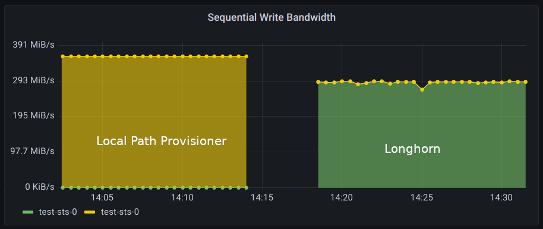

**Analysis & Conclusion**:
* Longhorn write speed is slower than local path volume because of several factors:
    * Because Longhorn has 3 replicas, it has to write to 3 replicas for each IO
    * By default, Longhorn has revision counter enabled which means that for each write IO, Longhorn has to do an additional write IO to write the revision counter
    * The Longhorn v1 tgt-iSCSI stack introduces some overhead


Next, we use Kbench with Longhorn PVCs and scale up the number of Kbench pods to see how sequential write bandwidth is affected when there are more and more IO intensive pods.

##### 3 Workload Pods Scale

Scaling workload from 1 to 3 pods.

**Result**:
> * Each Kbench pod is able to achieve 127 MiB/s sequential write bandwidth on its Longhorn volume
> * Total sequential write bandwidth can be achieved by all 3 Longhorn volumes is 381 MiB/s


**Analysis & Conclusion**:
* Since each EBS volume on the host is provisioned with 360 MiB/s
  It looks like Longhorn system is able to reach the maximum bandwidth capacity of the host EBS disks

##### > 3 Workload Pods Scale

Scaling workload from 3 to 6, then 6 to 9, then 9 to 12, then 12 to 15

**Result**:
> * At 6 pods, the average sequential write bandwidth per Longhorn volume is 63.3 MiB/s. Total sequential write bandwidth is 379.8 MiB/s
> * At 9 pods, the average sequential write bandwidth per Longhorn volume is 42.6 MiB/s. Total sequential write bandwidth is 383.4 MiB/s
> * At 12 pods, the average sequential write bandwidth per Longhorn volume is 31.8 MiB/s. Total sequential write bandwidth is 381.6 MiB/s
> * At 15 pods, the average sequential write bandwidth per Longhorn volume is 25.4 MiB/s. Total sequential write bandwidth is 381 MiB/s


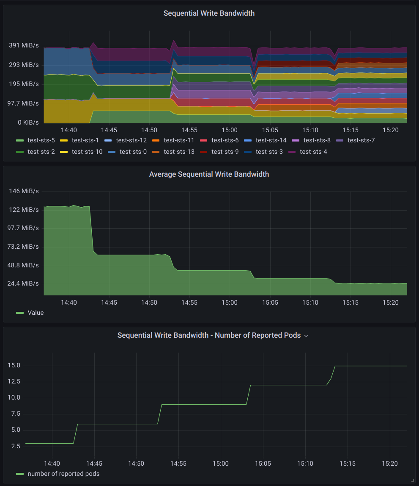


**Analysis & Conclusion**:
* From the scaling test so far, we can see that the total sequential write bandwidth of all Longhorn volumes remain relatively the same around 380 MiB/s when the number of Kbench pods increase
  If we call the average sequential write bandwidth each volume can achieve (x) and the number of volumes (y), they form a reciprocal function: x * y = 380.
  Users can use this information to make some prediction for this cluster:
    * The upper bound limit that Longhorn system can achieve in this cluster is 380 MiB/s sequential write bandwidth
    * If each workload pod is doing 7.45 MiB/s random read bandwidth on average, there can be 51 pods
* When the user keeps scaling up number of pods, eventually this reciprocal relation (x * y = 380) might no longer hold as the CPU contention and other factors kick in (i.e. x*y will be less and less)
* The bottleneck in this cluster seems to be the IOPs performance of the EBS volumes on host instead of CPU, memory, or network bandwidth

### Sequential Write Bandwidth - Rate Limited

In this test, we use 1 control plane node + 3 worker nodes.
We add a rate limit to Kbench so that each Kbench pod is only doing 7.45 MiB/s sequential write bandwidth and observe the performance of Longhorn volumes.
Then we scale up the number of Kbench pods to 51 to see if the system is able to achieve 379.9 MiB/s sequential write bandwidth.

<details>
<summary>We use this yaml manifest for the Kbench workload: </summary>
<br>

```yaml
apiVersion: apps/v1
kind: StatefulSet
metadata:
  name: test-sts
  namespace: default
spec:
  serviceName: test-sts
  replicas: 1
  selector:
    matchLabels:
      app: test-sts
  podManagementPolicy: Parallel
  template:
    metadata:
      labels:
        app: test-sts
    spec:
      containers:
        - name: kbench
          image: phanle1010/kbench:dev
          imagePullPolicy: Always
          env:
            - name: MODE
              value: "sequential-write-bandwidth"
            - name: OUTPUT
              value: /test-result/device
            - name: FILE_NAME
              value: "/volume/test"
            - name: SIZE
              value: "15G"
            - name: CPU_IDLE_PROF
              value: "disabled"
            - name: SKIP_PARSE
              value: "true"
            - name: LONG_RUN
              value: "true"
            - name: RATE
              value: ",7629k"
          volumeMounts:
            - name: vol
              mountPath: /volume/
            - name: shared-data
              mountPath: /test-result
        - name: metric-exporter
          image: phanle1010/kbench:dev
          imagePullPolicy: Always
          readinessProbe:
            exec:
              command:
                - sh
                - -c
                - '[ "$(ls -A /test-result)" ]'
            initialDelaySeconds: 22
            periodSeconds: 10
          command:
            - metric-exporter
            - -d
            - start
          env:
            - name: DATA_DIR
              value: /test-result
            - name: VOLUME_ACCESS_MODE
              value: rwo
            - name: TEST_MODE
              value: write-only
            - name: RATE_LIMIT_TYPE
              value: rate-limit
          ports:
            - containerPort: 8080
              name: metrics
          volumeMounts:
            - name: vol
              mountPath: /volume/
            - name: shared-data
              mountPath: /test-result
      volumes:
        - name: shared-data
          emptyDir: {}
  volumeClaimTemplates:
    - metadata:
        name: vol
      spec:
        accessModes: ["ReadWriteOnce"]
        storageClassName: "longhorn"
        resources:
          requests:
            storage: 20Gi
```
</details>

**Result**:
> * The sequential write bandwidth per Longhorn volume is 7.48 MiB/s
> * The total sequential write bandwidth can be achieved by all 51 Longhorn volumes is 381.5 MiB/s

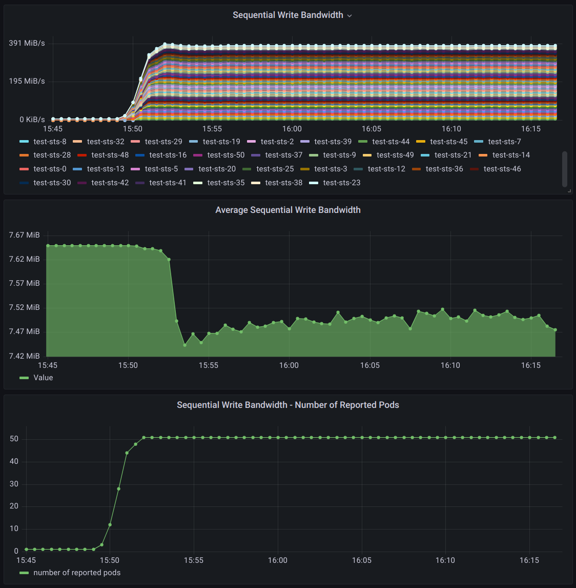

**Analysis & Conclusion**:
* As discussed in the [Sequential Write Bandwidth - Stress Tests](#sequential-write-bandwidth---stress-tests) section above, we come up with the conclusion that
  `If we call the sequential write bandwidth each volume can achieve (x) and the number of volumes (y), they form a reciprocal function: x * y = 380.`
* The test result here further confirm this conclusion as x * y = 7.48*51 = 381.5


### Random Write Latency - Stress Tests

In this test, we use a cluster that has 1 control plane node + 3 worker nodes.

First, we do a comparison between a single RWO Longhorn PVC against a single Local Path Provisioner volume.
We deploy 1 Kbench pod which attaches a Local Path Provisioner PVC.
Then we delete the above Kbench pod and PVC and repeat the test with Longhorn PVC instead.

We use this yaml manifest for the Kbench workload:
<details>
<summary>With local path provisioner storageclass</summary>
<br>

```yaml
apiVersion: apps/v1
kind: StatefulSet
metadata:
  name: test-sts
  namespace: default
spec:
  serviceName: test-sts
  replicas: 1
  selector:
    matchLabels:
      app: test-sts
  podManagementPolicy: Parallel
  template:
    metadata:
      labels:
        app: test-sts
    spec:
      containers:
        - name: kbench
          image: phanle1010/kbench:dev
          imagePullPolicy: Always
          env:
            - name: MODE
              value: "random-write-latency"
            - name: OUTPUT
              value: /test-result/device
            - name: FILE_NAME
              value: "/volume/test"
            - name: SIZE
              value: "15G"
            - name: CPU_IDLE_PROF
              value: "disabled"
            - name: SKIP_PARSE
              value: "true"
            - name: LONG_RUN
              value: "true"
          #            - name: RATE
          #              value: ",7559k"
          volumeMounts:
            - name: vol
              mountPath: /volume/
            - name: shared-data
              mountPath: /test-result
        - name: metric-exporter
          image: phanle1010/kbench:dev
          imagePullPolicy: Always
          readinessProbe:
            exec:
              command:
                - sh
                - -c
                - '[ "$(ls -A /test-result)" ]'
            initialDelaySeconds: 22
            periodSeconds: 10
          command:
            - metric-exporter
            - -d
            - start
          env:
            - name: DATA_DIR
              value: /test-result
            - name: VOLUME_ACCESS_MODE
              value: rwo
            - name: TEST_MODE
              value: write-only
            - name: RATE_LIMIT_TYPE
              value: no-rate-limit
          ports:
            - containerPort: 8080
              name: metrics
          volumeMounts:
            - name: vol
              mountPath: /volume/
            - name: shared-data
              mountPath: /test-result
      volumes:
        - name: shared-data
          emptyDir: {}
  volumeClaimTemplates:
    - metadata:
        name: vol
      spec:
        accessModes: ["ReadWriteOnce"]
        storageClassName: "local-path"
        resources:
          requests:
            storage: 20Gi
```
</details>

<details>
<summary>With longhorn storageclass</summary>
<br>

```yaml
apiVersion: apps/v1
kind: StatefulSet
metadata:
  name: test-sts
  namespace: default
spec:
  serviceName: test-sts
  replicas: 1
  selector:
    matchLabels:
      app: test-sts
  podManagementPolicy: Parallel
  template:
    metadata:
      labels:
        app: test-sts
    spec:
      containers:
        - name: kbench
          image: phanle1010/kbench:dev
          imagePullPolicy: Always
          env:
            - name: MODE
              value: "random-write-latency"
            - name: OUTPUT
              value: /test-result/device
            - name: FILE_NAME
              value: "/volume/test"
            - name: SIZE
              value: "15G"
            - name: CPU_IDLE_PROF
              value: "disabled"
            - name: SKIP_PARSE
              value: "true"
            - name: LONG_RUN
              value: "true"
          #            - name: RATE
          #              value: ",7559k"
          volumeMounts:
            - name: vol
              mountPath: /volume/
            - name: shared-data
              mountPath: /test-result
        - name: metric-exporter
          image: phanle1010/kbench:dev
          imagePullPolicy: Always
          readinessProbe:
            exec:
              command:
                - sh
                - -c
                - '[ "$(ls -A /test-result)" ]'
            initialDelaySeconds: 22
            periodSeconds: 10
          command:
            - metric-exporter
            - -d
            - start
          env:
            - name: DATA_DIR
              value: /test-result
            - name: VOLUME_ACCESS_MODE
              value: rwo
            - name: TEST_MODE
              value: write-only
            - name: RATE_LIMIT_TYPE
              value: no-rate-limit
          ports:
            - containerPort: 8080
              name: metrics
          volumeMounts:
            - name: vol
              mountPath: /volume/
            - name: shared-data
              mountPath: /test-result
      volumes:
        - name: shared-data
          emptyDir: {}
  volumeClaimTemplates:
    - metadata:
        name: vol
      spec:
        accessModes: ["ReadWriteOnce"]
        storageClassName: "longhorn"
        resources:
          requests:
            storage: 20Gi
```
</details>

Some of the important Kbench parameters we would like to call out are:
* `MODE: random-write-latency`: specifies that we are running [random write latency job](https://github.com/longhorn/kbench/blob/main/fio/latency-random-write.fio)
* `SIZE: 15G`: the `fio` test size is 15G, this will avoid cache effect
* PVC size is 20G

**Result**:
> * Local Path Provisioner: 810 microsecond
> * Longhorn: 2040 microsecond

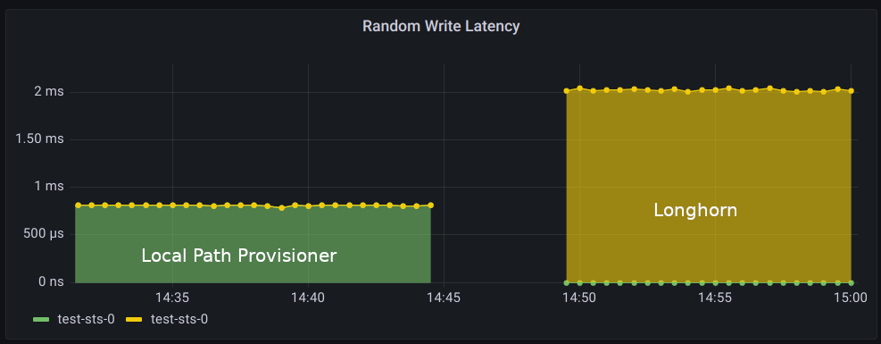

**Analysis & Conclusion**:
* Because the IO path of a Longhorn volume is longer than local path provisioner, it is expected that the Longhorn volume has bigger random write latency

Next, we use Kbench with Longhorn PVCs and scale up the number of Kbench pods to see how random write latency is affected when there are more and more pods.

**Result**:

| Number of Kbench pods | Average Random Write Latency (ns) | 
|-----------------------|-----------------------------------|
| 1                     | 2039519                           |
| 3                     | 2056904                           | 
| 6                     | 2091819                           | 
| 9                     | 2135070                           |
| 12                    | 2253089                           |
| 15                    | 2807773                           |
| 18                    | 3373824                           |
| 21                    | 3938172                           |
| 24                    | 4503630                           |
| 27                    | 5071816                           |
| 30                    | 5640033                           |
| 33                    | 6208153                           |
| 36                    | 6771033                           |
| 39                    | 7341914                           |
| 42                    | 7905373                           |
| 45                    | 8480925                           |
| 48                    | 9040640                           |
| 51                    | 9609189                           |

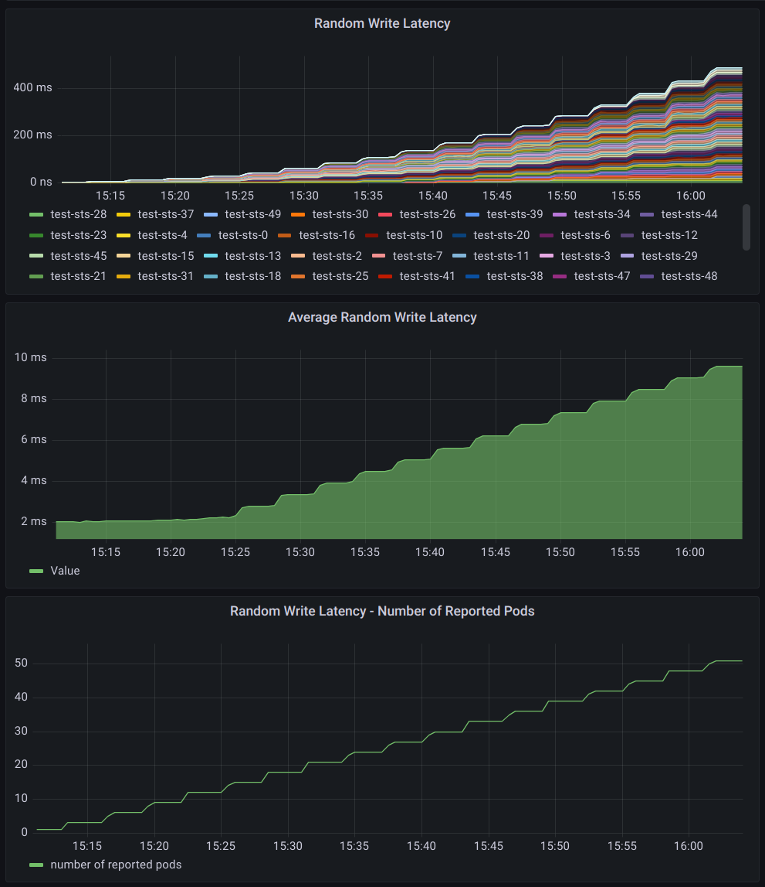

**Analysis & Conclusion**:
* As the number of kbench pods increase:
  * From 0 to 12 pods, the average random write latency of each Longhorn volume increase in linear fashion with smaller rate
  * From 12 to 51 pods, the average random write latency of each Longhorn volume increase in linear fashion with bigger rate

### Sequential Write Latency - Stress Tests

In this test, we use a cluster that has 1 control plane node + 3 worker nodes.

First, we do a comparison between a single RWO Longhorn PVC against a single Local Path Provisioner volume.
We deploy 1 Kbench pod which attaches a Local Path Provisioner PVC.
Then we delete the above Kbench pod and PVC and repeat the test with Longhorn PVC instead.

We use this yaml manifest for the Kbench workload:
<details>
<summary>With local path provisioner storageclass</summary>
<br>

```yaml
apiVersion: apps/v1
kind: StatefulSet
metadata:
  name: test-sts
  namespace: default
spec:
  serviceName: test-sts
  replicas: 1
  selector:
    matchLabels:
      app: test-sts
  podManagementPolicy: Parallel
  template:
    metadata:
      labels:
        app: test-sts
    spec:
      containers:
        - name: kbench
          image: phanle1010/kbench:dev
          imagePullPolicy: Always
          env:
            - name: MODE
              value: "sequential-write-latency"
            - name: OUTPUT
              value: /test-result/device
            - name: FILE_NAME
              value: "/volume/test"
            - name: SIZE
              value: "15G"
            - name: CPU_IDLE_PROF
              value: "disabled"
            - name: SKIP_PARSE
              value: "true"
            - name: LONG_RUN
              value: "true"
          #            - name: RATE
          #              value: ",7559k"
          volumeMounts:
            - name: vol
              mountPath: /volume/
            - name: shared-data
              mountPath: /test-result
        - name: metric-exporter
          image: phanle1010/kbench:dev
          imagePullPolicy: Always
          readinessProbe:
            exec:
              command:
                - sh
                - -c
                - '[ "$(ls -A /test-result)" ]'
            initialDelaySeconds: 22
            periodSeconds: 10
          command:
            - metric-exporter
            - -d
            - start
          env:
            - name: DATA_DIR
              value: /test-result
            - name: VOLUME_ACCESS_MODE
              value: rwo
            - name: TEST_MODE
              value: write-only
            - name: RATE_LIMIT_TYPE
              value: no-rate-limit
          ports:
            - containerPort: 8080
              name: metrics
          volumeMounts:
            - name: vol
              mountPath: /volume/
            - name: shared-data
              mountPath: /test-result
      volumes:
        - name: shared-data
          emptyDir: {}
  volumeClaimTemplates:
    - metadata:
        name: vol
      spec:
        accessModes: ["ReadWriteOnce"]
        storageClassName: "local-path"
        resources:
          requests:
            storage: 20Gi
```
</details>

<details>
<summary>With longhorn storageclass</summary>
<br>

```yaml
apiVersion: apps/v1
kind: StatefulSet
metadata:
  name: test-sts
  namespace: default
spec:
  serviceName: test-sts
  replicas: 1
  selector:
    matchLabels:
      app: test-sts
  podManagementPolicy: Parallel
  template:
    metadata:
      labels:
        app: test-sts
    spec:
      containers:
        - name: kbench
          image: phanle1010/kbench:dev
          imagePullPolicy: Always
          env:
            - name: MODE
              value: "sequential-write-latency"
            - name: OUTPUT
              value: /test-result/device
            - name: FILE_NAME
              value: "/volume/test"
            - name: SIZE
              value: "15G"
            - name: CPU_IDLE_PROF
              value: "disabled"
            - name: SKIP_PARSE
              value: "true"
            - name: LONG_RUN
              value: "true"
          #            - name: RATE
          #              value: ",7559k"
          volumeMounts:
            - name: vol
              mountPath: /volume/
            - name: shared-data
              mountPath: /test-result
        - name: metric-exporter
          image: phanle1010/kbench:dev
          imagePullPolicy: Always
          readinessProbe:
            exec:
              command:
                - sh
                - -c
                - '[ "$(ls -A /test-result)" ]'
            initialDelaySeconds: 22
            periodSeconds: 10
          command:
            - metric-exporter
            - -d
            - start
          env:
            - name: DATA_DIR
              value: /test-result
            - name: VOLUME_ACCESS_MODE
              value: rwo
            - name: TEST_MODE
              value: write-only
            - name: RATE_LIMIT_TYPE
              value: no-rate-limit
          ports:
            - containerPort: 8080
              name: metrics
          volumeMounts:
            - name: vol
              mountPath: /volume/
            - name: shared-data
              mountPath: /test-result
      volumes:
        - name: shared-data
          emptyDir: {}
  volumeClaimTemplates:
    - metadata:
        name: vol
      spec:
        accessModes: ["ReadWriteOnce"]
        storageClassName: "longhorn"
        resources:
          requests:
            storage: 20Gi
```
</details>

Some of the important Kbench parameters we would like to call out are:
* `MODE: sequential-write-latency`: specifies that we are running [sequential write latency job](https://github.com/longhorn/kbench/blob/main/fio/latency-sequential-write.fio)
* `SIZE: 15G`: the `fio` test size is 15G, this will avoid cache effect
* PVC size is 20G

**Result**:
> * Local Path Provisioner: 803 microsecond
> * Longhorn: 2028 microsecond

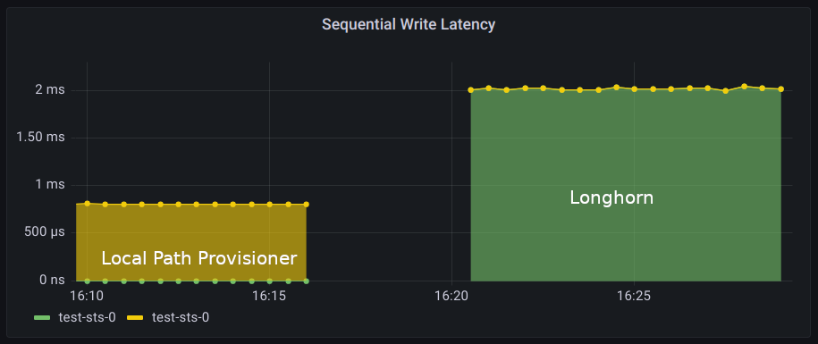

**Analysis & Conclusion**:
* Because the IO path of a Longhorn volume is longer than local path provisioner, it is expected that the Longhorn volume has bigger sequential write latency

Next, we use Kbench with Longhorn PVCs and scale up the number of Kbench pods to see how sequential write latency is affected when there are more and more pods.

**Result**:

| Number of Kbench pods | Average Sequential Write Latency (ns) | 
|-----------------------|---------------------------------------|
| 1                     | 2027403                               |
| 3                     | 2064941                               | 
| 6                     | 2101946                               | 
| 9                     | 2135524                               |
| 12                    | 2256725                               |
| 15                    | 2812809                               |
| 18                    | 3377877                               |
| 21                    | 3942233                               |
| 24                    | 4503992                               |
| 27                    | 5078192                               |
| 30                    | 5640632                               |
| 33                    | 6204730                               |
| 36                    | 6770942                               |
| 39                    | 7343912                               |
| 42                    | 7906260                               |
| 45                    | 8475788                               |
| 48                    | 9035704                               |
| 51                    | 9611938                               |


**Analysis & Conclusion**:
* As the number of kbench pods increase:
    * From 0 to 12 pods, the average sequential write latency of each Longhorn volume increase in linear fashion with smaller rate
    * From 12 to 51 pods, the average sequential write latency of each Longhorn volume increase in linear fashion with bigger rate

## Longhorn Control Plane Performance

We deploy a StatefulSet workload. 
Each pod of the StatefulSet is a nginx web server with 1 Longhorn PVC attached to it.
Each pods has a liveness probe to ensure the Longhorn volume is still functional.
This is the yaml of the StatefulSet:
<details>
<summary>StatefulSet workload</summary>
<br>

```yaml
apiVersion: v1
kind: Service
metadata:
  name: nginx
  labels:
    app: nginx
spec:
  ports:
  - port: 80
    name: web
  selector:
    app: nginx
  type: NodePort
---
apiVersion: apps/v1
kind: StatefulSet
metadata:
  name: web
  namespace: default
spec:
  podManagementPolicy: Parallel
  selector:
    matchLabels:
      app: nginx
  serviceName: "nginx"
  replicas: 0
  template:
    metadata:
      labels:
        app: nginx
    spec:
      restartPolicy: Always
      terminationGracePeriodSeconds: 10
      containers:
      - name: nginx
        image: registry.k8s.io/nginx-slim:0.8
        livenessProbe:
          exec:
            command:
              - ls
              - /usr/share/nginx/html/lost+found
          initialDelaySeconds: 5
          periodSeconds: 5
        ports:
        - containerPort: 80
          name: web
        volumeMounts:
        - name: www
          mountPath: /usr/share/nginx/html
  volumeClaimTemplates:
  - metadata:
      name: www
    spec:
      accessModes: [ "ReadWriteOnce" ]
      storageClassName: "longhorn"
      resources:
        requests:
          storage: 1Gi
```

</details>

Then we scale up the StatefulSet with the rate 30 pods per minute and monitor the number of pods, CPU and RAM usage of Longhorn system, ECTD, and KubeAPI metrics. The scaling script is:
```bash
NAMESPACE="default"; STATEFULSET_NAME="web"; MAX_PODS="<a-specific-number-for-each-test>"; INTERVAL=2; while true; do CURRENT_REPLICAS=$(kubectl get statefulset -n $NAMESPACE $STATEFULSET_NAME -o jsonpath='{.spec.replicas}'); if [ "$CURRENT_REPLICAS" -lt "$MAX_PODS" ]; then NEW_REPLICAS=$((CURRENT_REPLICAS + 1)); echo "Scaling $STATEFULSET_NAME to $NEW_REPLICAS replicas"; kubectl scale --replicas=$NEW_REPLICAS statefulset -n $NAMESPACE $STATEFULSET_NAME; fi; sleep $INTERVAL; done
```
We define the following stopping conditions for the scale test. 
If we hit any of these conditions, we stop the scale test and record the current scaling number.
1. There are more than 10 pods with starting time more than 4 minutes (the duration from pod being created to pod becomes running). 
   The idea is that if pod is taking more than 4 minutes to start, the system is being too slow
1. The per-minute rate of pod become running is smaller than 10. It means that the system should be able to create more than 10 pods per minute. 
   If not, it is being too slow
1. There are more than 3 crashing pods or restarted containers. If there are many crashes, the system is not stable at the scale

Finally, we will scale down the StatefulSet from the max value to 0 with the rate of 30 pods per minute. We will measure the scaling down speed.

This test design touches the end-to-end life cycle of a pod from pod creation -> CSI flow provision/attach/mount Longhorn volume -> CSI flow unmount/detach Longhorn volume -> pod termination

> Notes: There are a few small modification we made in this section comparing to the previous data plan performance testing section:
> 1. Because of this known issue in Longhorn v1.6.0 https://github.com/longhorn/longhorn/issues/7919, it might lock up the Longhorn control plane when there are many volumes.
>    Therefore, we decided to use Longhorn v1.6.1 version for this control plane test 
>    Longhorn v1.6.1 should have very similar characteristic as Longhorn 1.6.0 except for some bug fixes
> 1. At this large scale, Prometheus server uses too much RAM and CPU. 
>    Therefore, we decided to create a dedicated node for the Prometheus server to avoid interfering with Longhorn system
> 1. We set the Longhorn setting [automatically-delete-workload-pod-when-the-volume-is-detached-unexpectedly](https://longhorn.io/docs/1.6.1/references/settings/#automatically-delete-workload-pod-when-the-volume-is-detached-unexpectedly) to false so that we can observe the workload pod crashes instead of asking Longhorn to clean it up quickly

### 1 master node + 3 worker nodes
#### Result
1. The cluster can handle up to 699 pods with 699 Longhorn volumes
1. Each node can have 233 Longhorn volumes.
2. Each node can have 669 Longhorn replicas.

#### Scaling Up
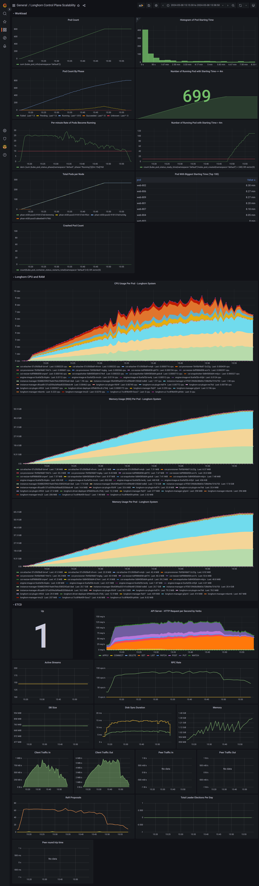

##### Comment
1. This test hits the 1st stopping condition (there are more than 10 pods with starting time more than 4 minutes) at 699 pods (with 699 Longhorn volumes).
1. We can see that the number of running pod is linearly scaled from 0 to 460. Then rate is slow down after that.
1. The component which is consuming the most CPU and RAM are instance manager pods followed by longhorn manager pods
1. API and ETCD are not overloaded

#### Scaling Down

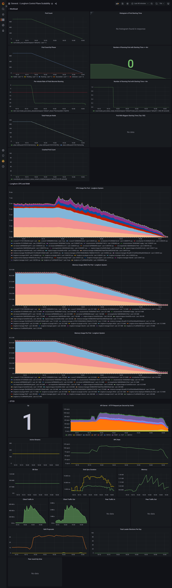

##### Comment

Scaling down has no issue. Everything is perfectly linear
> Note:  that some of the graphs are not very meaningful because they reflect starting time and no pods are starting.


### 1 master node + 6 worker nodes

#### Result
1. The cluster can handle up to 1114 pods with 1114 Longhorn volumes
1. Each node can have 185 Longhorn volumes
2. Each node can have 557 Longhorn replicas

#### Scaling Up

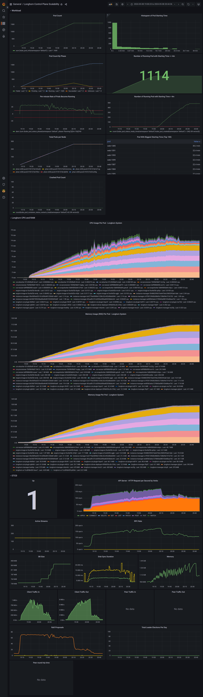

##### Comment
1. This test hits the 1st stopping condition (there are more than 10 pods with starting time more than 4 minutes) at 1114 pods (with 1114 Longhorn volumes)
1. We can see that the number of running pod is linearly scaled from 0 to 840. Then rate is slow down after that
1. The component which is consuming the most CPU and RAM are instance manager pods followed by longhorn manager pods
1. API and ETCD are not overloaded

#### Scaling Down

##### Comment

Scaling down has no issue. Everything is perfectly linear similar to the above test


### 1 master node + 9 worker nodes

#### Result
1. The cluster can handle up to 1561 pods with 1561 Longhorn volumes
1. Each node can have 173 Longhorn volumes
2. Each node can have 520 Longhorn replicas

#### Scaling Up

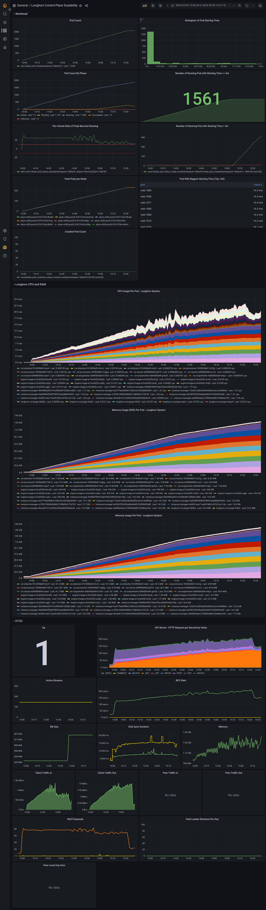

##### Comment
1. This test hits the 1st stopping condition (there are more than 10 pods with starting time more than 4 minutes) at 1561 pods (with 1561 Longhorn volumes)
1. We can see that the number of running pod is linearly scaled from 0 to 1400. Then rate is slow down after that
1. The component which is consuming the most CPU and RAM are instance manager pods followed by longhorn manager pods
1. API and ETCD are not overloaded

#### Scaling Down

##### Comment

Scaling down has no issue. Everything is perfectly linear similar to the above test

## Volume Maximum Size

As mentioned above the maximum Longhorn volume size is limited by the replica rebuilding time.
Currently, Longhorn limited the rebuilding time to be 24h. Therefore, we will measure how much data we can rebuild within 24h.
We further notice that the rebuilding speed is depended on the data pattern inside the volume and the number of snapshot inside the volume.

### Case 1: Volume With Full Data
1. We deploy a volume of 100G size with 1 replica
1. Write 100G of data to the volume by `dd if=/dev/urandom of=/dev/longhorn/<volume-name> bs=1M count=102400`
1. Scale up the number of replicas to 2 to trigger rebuilding
1. Measure the time it takes to finish rebuilding. We use this python script to draw the rebuilding speed graph:
    <details>
    <summary>rebuilding_speed_monitor.py</summary>
    <br>
    
    ```python
    #!/usr/bin/env python3
    
    from kubernetes import client, config
    from datetime import datetime
    import time
    import matplotlib.pyplot as plt
    
    def main():
        # Load kubeconfig
        config.load_kube_config()
    
        namespace = "longhorn-system"
        engine_name = "testvol-e-0" # replace by the name of the target volume's engine
    
        # Create a custom object API client
        api_instance = client.CustomObjectsApi()
    
        starting_timestamp = datetime.now()
        data = []
    
        rebuild_started = False
        while True:
            current_duration = (datetime.now() - starting_timestamp).total_seconds()
            current_progress = 0
            try:
                # Get the engine object
                engine = api_instance.get_namespaced_custom_object(
                    group="longhorn.io",
                    version="v1beta1",
                    namespace=namespace,
                    plural="engines",
                    name=engine_name
                )
    
                # Extract the rebuildStatus field
                rebuild_status = engine.get("status", {}).get("rebuildStatus", {})
    
                # Extract the rebuild progress
                for _, status in rebuild_status.items():
                    for k, v in status.items():
                        if k == "progress":
                            current_progress = int(v)
    
                data.append((current_duration, current_progress))
    
                if current_progress > 0:
                    rebuild_started = True
    
                if rebuild_started and (current_progress <= 0 or current_progress >= 100):
                    print("Done. Sleeping for 1 hour to give chance for user to take screenshoot")
                    time.sleep(3600) 
                    return
                
                print("%f : %d" % (current_duration, current_progress))
                plot_graph(data)
    
            except client.exceptions.ApiException as e:
                print(f"Error getting engine: {e}")
    
            time.sleep(2) 
    
    # Function to plot the graph
    def plot_graph(data_points):
        # Extract x and y coordinates
        x = [point[0] for point in data_points]
        y = [point[1] for point in data_points]
    
        # Clear the previous plot
        plt.clf()
    
        # Plot the graph
        plt.plot(x, y)
    
        # Add labels and title
        plt.xlabel('Time (seconds)')
        plt.ylabel('Progress (%)')
        plt.title('Rebuilding Speed')
    
        # Draw the plot without blocking
        plt.pause(0.001)  # You can adjust this value to control the refresh rate
    
    if __name__ == "__main__":
        main()
    ```
    </details>
    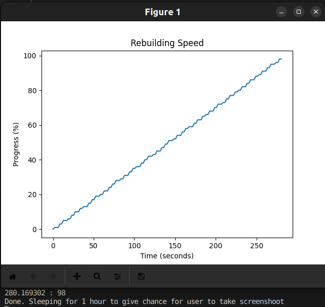

1. So it takes 281 seconds to rebuild the volume. The maximum size of Longhorn volume would be calculated as `(3600*24*100)/281 = 30747 Gi` (30Ti)

> Note: If the volume has more than 1 snapshot, the maximum size would be smaller. 
> More specifically, let's say the volume is set so that it has maximum x snapshots (including volume-head).
> The maximum volume size would be calculated as `30Ti/x`

### Case 2: Volume With Data Pattern 4k_data-4k_hole-4k_data-4k_hole-...
From our experience, this data pattern is the worst case for rebuilding speed.

1. We deploy a volume of 10G size with 1 replica
1. Use this `fio` job to generate data pattern 4k_data-4k_hole-4k_data-4k_hole-...
    <details>
    <summary>job.fio</summary>
    <br>
    
    ```bash
    [global]
    bs=4k
    iodepth=128
    direct=1
    end_fsync=1
    ioengine=libaio
    randseed=1
    randrepeat=0
    group_reporting
    
    # 4k bs
    [job1]
    bs=4k
    rw=write:4k
    filename=/dev/longhorn/ # replace by volume name
    name=data4k-holes4k
    io_size=5G
    ```
    </details>
1. Scale up the number of replicas to 2 to trigger rebuilding
1. Measure the time it takes to finish rebuilding. We use the same python script above to draw the rebuilding speed graph:
    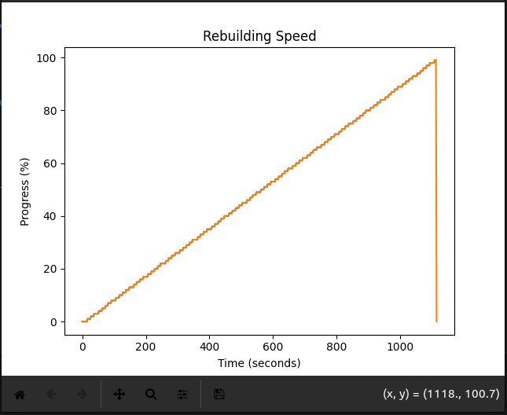
1. So it takes 1118 seconds to rebuild the volume. From the graph we see that the rebuilding speed is perfectly linear. 
   Therefore, we can predict that the maximum size of Longhorn volume would be calculated as `(3600*24*10)/1118 = 772 Gi`

> Note: If the volume has snapshots, the maximum size would be smaller.
> More specifically, let's say the volume is set so that it has maximum x snapshots (including volume-head).
> The maximum volume size would be calculated as `772Gi/x`

## FAQs

The following are some FAQs that we can answer using data from this report. 
Note that the answers are particular to this setup. 
If you are more/less powerful setup, the number might be different.

1. What is the maximum number of Longhorn volumes inside the cluster?
   1. For 1 master node + 3 worker nodes cluster: 699 Longhorn volumes
   1. For 1 master node + 6 worker nodes cluster: 1114 Longhorn volumes
   1. For 1 master node + 9 worker nodes cluster: 1561 Longhorn volumes
   1. We don't test with bigger number of nodes, but you can have roughly estimation using the above data
1. What is the maximum number of Longhorn volumes can be attached to a node?
   Answer: 233 Longhorn volumes
1. What is the maximum number of Longhorn replicas per node?
   Answer: 669 Longhorn replicas
1. What is the maximum Longhorn volume size?
   1. For volume with full data pattern (A.K.A every snapshot is a full), the maximum volume size would be calculated as `30Ti/x` where `x` is maximum number of snapshots setting of the volume (including volume-head)
   1. For volume with data pattern 4k_data-4k_hole-4k_data-4k_hole-..., the maximum volume size would be calculated as `772Gi/x` where `x` is maximum number of snapshots setting of the volume (including volume-head). This is the worst case
1. What is the maximum IOPs of a Longhorn volume?  
   1. random-read-iops: 22180
   1. sequential-read-iops: 39772
   1. random-write-iops: 1150
   1. sequential-write-iops: 2340
1. What is the maximum bandwidth of a Longhorn volume?
    1. random-read-bandwidth: 874 MiB/s
    1. sequential-read-bandwidth: 669 MiB/s
    1. random-write-bandwidth: 159 MiB/s
    1. sequential-write-bandwidth: 291 MiB/s
1. What is the minimum latency of Longhorn volume?
    1. random-read-latency: 750 microseconds
    1. sequential-read-latency: 740 microseconds
    1. random-write-latency:  2040 microseconds
    1. sequential-write-latency: 2028 microseconds
1. What is the maximum IOPs of all Longhorn volumes with 3 worker nodes?
    1. random-read-iops: ~31700
    1. sequential-read-iops: ~62500
    1. random-write-iops: ~5250
    1. sequential-write-iops: ~10400
    1. Also, the number is linearly increased by number of worker nodes
1. What is the maximum bandwidth of all Longhorn volumes with 3 worker nodes?
    1. random-read-bandwidth: ~1170 MiB/s
    1. sequential-read-bandwidth: ~1152 MiB/s
    1. random-write-bandwidth: ~376.8 MiB/s
    1. sequential-write-bandwidth: ~381.6 MiB/s
    1. Also, the number is linearly increased by number of worker nodes